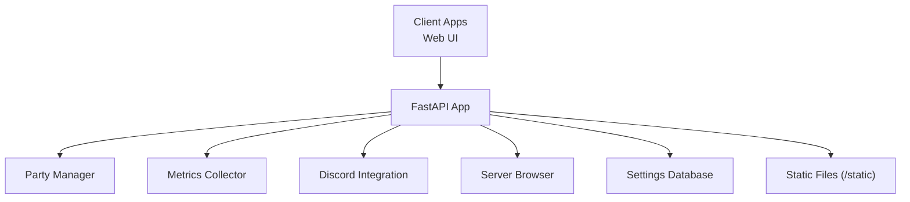
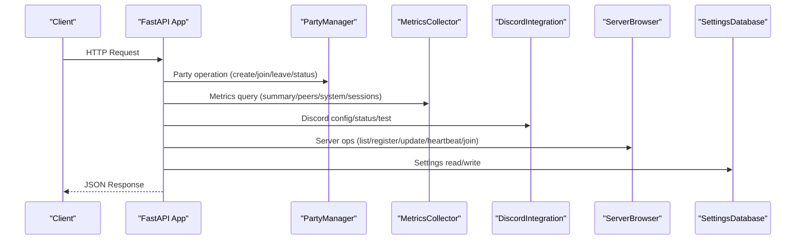
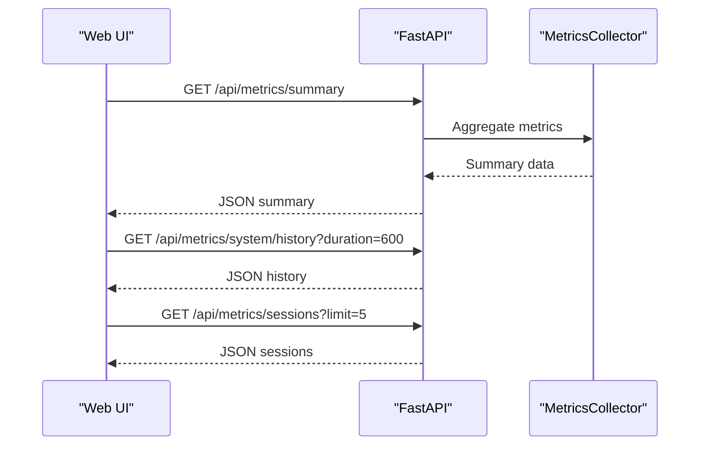
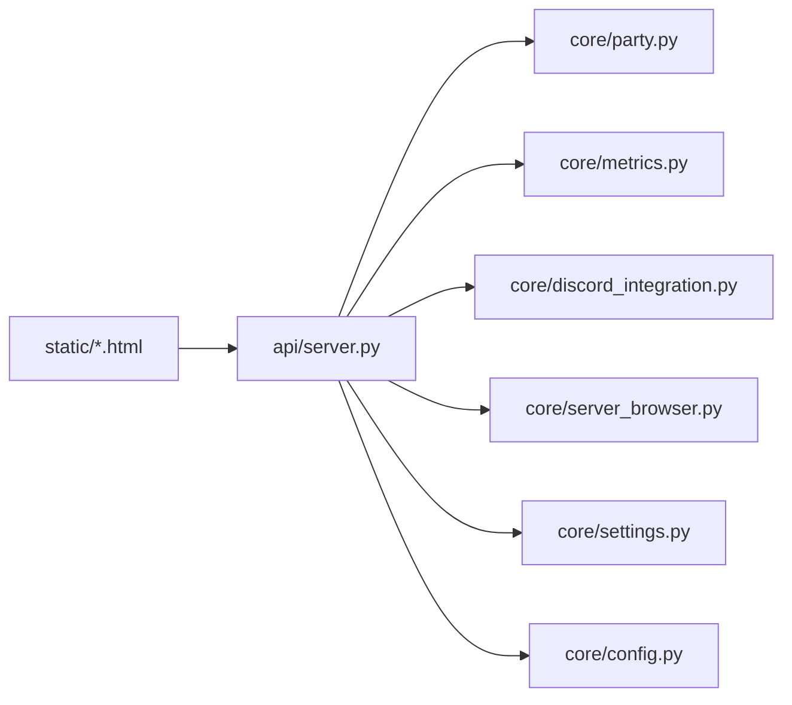

# API Reference

<cite>
**Referenced Files in This Document**
- [lanrage.py](file://lanrage.py)
- [api/server.py](file://api/server.py)
- [core/party.py](file://core/party.py)
- [core/metrics.py](file://core/metrics.py)
- [core/discord_integration.py](file://core/discord_integration.py)
- [core/server_browser.py](file://core/server_browser.py)
- [core/config.py](file://core/config.py)
- [core/settings.py](file://core/settings.py)
- [static/index.html](file://static/index.html)
- [static/dashboard.html](file://static/dashboard.html)
- [static/settings.html](file://static/settings.html)
- [docs/API.md](file://docs/API.md)
- [README.md](file://README.md)
</cite>

## Table of Contents
1. [Introduction](#introduction)
2. [Project Structure](#project-structure)
3. [Core Components](#core-components)
4. [Architecture Overview](#architecture-overview)
5. [Detailed Component Analysis](#detailed-component-analysis)
6. [Dependency Analysis](#dependency-analysis)
7. [Performance Considerations](#performance-considerations)
8. [Troubleshooting Guide](#troubleshooting-guide)
9. [Conclusion](#conclusion)
10. [Appendices](#appendices)

## Introduction
This document provides a comprehensive API reference for LANrage’s REST API and web interface. It covers HTTP endpoints for party management, metrics, Discord integration, server browser, and settings, along with request/response schemas, authentication, rate limiting, and security considerations. It also documents the web UI API endpoints used by the dashboard, settings, and server browser pages.

LANrage exposes a FastAPI-based REST API with a local-only default binding and a built-in web UI served from static assets. The API supports health checks, party lifecycle operations, metrics retrieval, Discord integration controls, server discovery and registration, and runtime configuration management.

**Section sources**
- [README.md](file://README.md#L1-L376)
- [docs/API.md](file://docs/API.md#L1-L800)

## Project Structure
LANrage organizes its API surface under a FastAPI application with:
- REST endpoints for party, metrics, Discord, server browser, and settings
- Static file serving for the web UI
- CORS enabled for local UI consumption
- Pydantic models for request/response validation

**Diagram sources**
- [api/server.py](file://api/server.py#L1-L701)
- [static/index.html](file://static/index.html#L1-L800)
- [static/dashboard.html](file://static/dashboard.html#L1-L587)
- [static/settings.html](file://static/settings.html#L1-L684)

**Section sources**
- [api/server.py](file://api/server.py#L1-L701)
- [static/index.html](file://static/index.html#L1-L800)
- [static/dashboard.html](file://static/dashboard.html#L1-L587)
- [static/settings.html](file://static/settings.html#L1-L684)

## Core Components
- Party Management: Create, join, leave parties; query party status.
- Metrics: Retrieve peer/system metrics, latency histories, and recent game sessions.
- Discord Integration: Configure webhook/invite, check status, send test notifications.
- Server Browser: Register/list servers, update heartbeat/player counts, measure latency, manage favorites.
- Settings: Get/update/reset settings; save/load server configurations.

**Section sources**
- [api/server.py](file://api/server.py#L107-L701)
- [core/party.py](file://core/party.py#L102-L304)
- [core/metrics.py](file://core/metrics.py#L193-L705)
- [core/discord_integration.py](file://core/discord_integration.py#L81-L633)
- [core/server_browser.py](file://core/server_browser.py#L75-L552)
- [core/settings.py](file://core/settings.py#L20-L525)

## Architecture Overview
The API server is started from the main entry point and mounts static assets. It delegates to domain managers for party, metrics, Discord, and server browser operations. Settings are persisted in an SQLite-backed asynchronous database.

**Diagram sources**
- [lanrage.py](file://lanrage.py#L14-L154)
- [api/server.py](file://api/server.py#L680-L701)
- [core/party.py](file://core/party.py#L102-L304)
- [core/metrics.py](file://core/metrics.py#L193-L705)
- [core/discord_integration.py](file://core/discord_integration.py#L81-L633)
- [core/server_browser.py](file://core/server_browser.py#L75-L552)
- [core/settings.py](file://core/settings.py#L20-L525)

## Detailed Component Analysis

### REST API Endpoints

#### Base Endpoints
- GET /api
  - Purpose: Health check
  - Response: {"status":"ok","service":"LANrage"}
- GET /
  - Purpose: Serve the web UI (index.html)
- GET /logo.png
  - Purpose: Serve the application logo
- GET /favicon.ico
  - Purpose: Serve the favicon

**Section sources**
- [api/server.py](file://api/server.py#L107-L144)

#### Party Management
- GET /status
  - Purpose: Get current party status
  - Response: Party status with peers and NAT info
  - Status Codes: 200, 500 (not initialized)
- POST /party/create
  - Purpose: Create a new party
  - Request: {"name": "..."}
  - Response: {"party_id": "...", "party": {...}}
  - Status Codes: 200, 500 (not initialized)
- POST /party/join
  - Purpose: Join an existing party
  - Request: {"party_id": "...", "peer_name": "..."}
  - Response: {"party": {...}}
  - Status Codes: 200, 501 (not implemented), 500 (not initialized)
- POST /party/leave
  - Purpose: Leave current party
  - Response: {"status":"left"}

**Section sources**
- [api/server.py](file://api/server.py#L146-L186)
- [core/party.py](file://core/party.py#L102-L304)

#### Metrics Endpoints
- GET /api/metrics/summary
  - Purpose: Overall metrics summary (peers, system, network quality)
  - Response: {"peers":[...],"system":{...},"network_quality":...}
- GET /api/metrics/peers
  - Purpose: Metrics for all peers
  - Response: {"peers":[...]}
- GET /api/metrics/peers/{peer_id}
  - Purpose: Metrics for a specific peer
  - Path Params: peer_id
  - Response: Peer summary object
  - Status Codes: 200, 404 (not found)
- GET /api/metrics/peers/{peer_id}/latency?duration={seconds}
  - Purpose: Latency history for a peer
  - Response: {"peer_id":"...","duration":...,"data":[{"timestamp":..., "value":...}, ...]}
- GET /api/metrics/system
  - Purpose: System metrics summary
  - Response: {"cpu":{...},"memory":{...},"network":{...}}
- GET /api/metrics/system/history?duration={seconds}
  - Purpose: System metrics history
  - Response: {"duration":...,"data":{"cpu":[...],"memory":[...],"network_sent":[...],"network_received":[...]}}
- GET /api/metrics/sessions?limit={n}
  - Purpose: Recent game sessions
  - Response: {"sessions":[{...}]}

**Section sources**
- [api/server.py](file://api/server.py#L188-L276)
- [core/metrics.py](file://core/metrics.py#L193-L705)

#### Discord Integration Endpoints
- POST /api/discord/webhook
  - Purpose: Set Discord webhook URL
  - Request: {"webhook_url": "..."}
  - Response: {"status":"ok","message":"..."}
  - Status Codes: 200, 400 (invalid URL)
- POST /api/discord/invite
  - Purpose: Set Discord invite URL
  - Request: {"invite_url": "..."}
  - Response: {"status":"ok","message":"..."}
  - Status Codes: 200, 400 (invalid URL)
- GET /api/discord/status
  - Purpose: Get Discord integration status
  - Response: {"webhook_configured":true,"invite_configured":true,"invite_url":"...","rich_presence":true,"bot_configured":true,"bot_online":true}
- GET /api/discord/instructions
  - Purpose: Get setup instructions for webhook and invite
  - Response: {"webhook":"...","invite":"..."}
- POST /api/discord/test
  - Purpose: Send a test notification
  - Response: {"status":"ok","message":"..."}
  - Status Codes: 200, 400 (webhook not configured)

**Section sources**
- [api/server.py](file://api/server.py#L278-L359)
- [core/discord_integration.py](file://core/discord_integration.py#L81-L633)

#### Server Browser Endpoints
- GET /api/servers?game={name}&hide_full={bool}&hide_empty={bool}&hide_password={bool}&tags={a,b}&search={term}
  - Purpose: List servers with optional filters
  - Response: {"servers":[{...}],"count":...,"stats":{...}}
- POST /api/servers
  - Purpose: Register a new game server
  - Request: {"server_id": "...", "name": "...", "game": "...", "max_players": n, "current_players": n, ...}
  - Response: {"status":"ok","server": {...}}
  - Status Codes: 200, 400 (must be in a party)
- GET /api/servers/{server_id}
  - Purpose: Get details for a specific server
  - Response: Server object
  - Status Codes: 200, 404 (not found)
- DELETE /api/servers/{server_id}
  - Purpose: Unregister a server
  - Response: {"status":"ok","message":"..."}
  - Status Codes: 200, 404 (not found)
- POST /api/servers/{server_id}/heartbeat
  - Purpose: Update server heartbeat
  - Response: {"status":"ok","message":"..."}
  - Status Codes: 200, 404 (not found)
- POST /api/servers/{server_id}/players
  - Purpose: Update player count
  - Request: {"current_players": n}
  - Response: {"status":"ok","message":"..."}
  - Status Codes: 200, 404 (not found)
- POST /api/servers/{server_id}/join
  - Purpose: Join a game server (connects to host’s party)
  - Response: {"status":"ok","message":"...","server": {...},"party": {...}}
  - Status Codes: 200, 400 (server full), 404 (not found), 501 (not available)
- POST /api/servers/{server_id}/favorite
  - Purpose: Add server to favorites
  - Response: {"status":"ok","message":"..."}
- DELETE /api/servers/{server_id}/favorite
  - Purpose: Remove server from favorites
  - Response: {"status":"ok","message":"..."}
- GET /api/servers/{server_id}/latency
  - Purpose: Measure latency to a server
  - Response: {"server_id":"...","latency_ms": n}
  - Status Codes: 200, 500 (failed to measure)
- GET /api/servers/stats
  - Purpose: Get server browser statistics
  - Response: {"total_servers":...,"total_players":...,"unique_games":...,"games":[...],"favorites":...}
- GET /api/games
  - Purpose: Get list of games with active servers
  - Response: {"games":[...],"count": ...}

**Section sources**
- [api/server.py](file://api/server.py#L361-L560)
- [core/server_browser.py](file://core/server_browser.py#L75-L552)

#### Settings Endpoints
- GET /api/settings
  - Purpose: Get all settings
  - Response: Key-value pairs of current settings
- POST /api/settings
  - Purpose: Update settings
  - Request: Partial settings object (only provided fields are updated)
  - Response: {"status":"ok","message":"...","updated":[...]}
- POST /api/settings/reset
  - Purpose: Reset settings to defaults
  - Response: {"status":"ok","message":"..."}
- GET /api/settings/configs
  - Purpose: Get all saved configurations
  - Response: [{"id": ..., "name": "...", "mode": "...", "config": {...}, "enabled": true|false}, ...]
- POST /api/settings/configs
  - Purpose: Save a new configuration
  - Request: {"name": "...", "mode": "...", "config": {...}}
  - Response: {"status":"ok","message":"...","id": ...}
- POST /api/settings/configs/{config_id}/activate
  - Purpose: Activate a saved configuration
  - Response: {"status":"ok","message":"..."}
- DELETE /api/settings/configs/{config_id}
  - Purpose: Delete a saved configuration
  - Response: {"status":"ok","message":"..."}

**Section sources**
- [api/server.py](file://api/server.py#L572-L678)
- [core/settings.py](file://core/settings.py#L20-L525)

### Web UI API Endpoints
The web UI pages consume the API endpoints described above:
- Dashboard (dashboard.html): Fetches metrics summary, system history, and recent sessions to render charts and peer lists.
- Settings (settings.html): Loads current settings, saves updates, resets to defaults, and manages saved configurations.
- Home (index.html): Provides tabs for Party, Servers, Metrics, Discord, and Settings; integrates with the API for live updates.

**Diagram sources**
- [static/dashboard.html](file://static/dashboard.html#L420-L584)
- [api/server.py](file://api/server.py#L188-L276)
- [core/metrics.py](file://core/metrics.py#L193-L705)

**Section sources**
- [static/dashboard.html](file://static/dashboard.html#L1-L587)
- [static/settings.html](file://static/settings.html#L1-L684)
- [static/index.html](file://static/index.html#L1-L800)

### Authentication, Rate Limiting, and Security
- Authentication: No authentication is enforced by the API. The service binds to localhost by default and serves static assets for the local web UI.
- Authorization: Endpoints operate against the in-memory state and persisted settings database; no per-endpoint ACL is implemented.
- CORS: Enabled for all origins to support local web UI consumption.
- Security Considerations:
  - Bind only to localhost by default; do not expose publicly.
  - Use HTTPS at the edge if exposing externally.
  - Treat the settings database as sensitive configuration storage.
  - Validate and sanitize inputs using Pydantic models.
- Rate Limiting: Not implemented. Consider adding middleware for production deployments.

**Section sources**
- [api/server.py](file://api/server.py#L23-L29)
- [core/config.py](file://core/config.py#L27-L29)

### API Versioning, Backwards Compatibility, and Deprecation
- Versioning: The FastAPI app declares a version; however, no explicit versioned base URL is used in the endpoints.
- Backwards Compatibility: The API is designed for internal use and the web UI. No formal deprecation policy is defined.
- Recommendations:
  - Use the declared version for awareness.
  - Maintain backward-compatible request/response shapes when possible.
  - Introduce a deprecation timeline and migration guide if external clients are anticipated.

**Section sources**
- [api/server.py](file://api/server.py#L16)
- [docs/API.md](file://docs/API.md#L1-L800)

### Common Use Cases and Integration Patterns
- Creating and sharing a party:
  - POST /party/create → share party_id → friends POST /party/join
- Hosting a game server:
  - Ensure in a party → POST /api/servers with server metadata → optionally POST /api/servers/{id}/heartbeat and POST /api/servers/{id}/players
- Monitoring performance:
  - Periodically GET /api/metrics/summary and /api/metrics/system/history
- Discord notifications:
  - POST /api/discord/webhook → POST /api/discord/test
- Managing configurations:
  - GET /api/settings → POST /api/settings → save/load configurations via /api/settings/configs endpoints

**Section sources**
- [api/server.py](file://api/server.py#L155-L560)
- [docs/API.md](file://docs/API.md#L1-L800)

### Practical Examples
- Example: Create a party
  - Request: POST /party/create with {"name": "Friday Night Gaming"}
  - Response: {"party_id": "...", "party": {...}}
- Example: Get peer latency history
  - Request: GET /api/metrics/peers/{peer_id}/latency?duration=1800
  - Response: {"peer_id":"...","duration":1800,"data":[...]}
- Example: Register a server
  - Request: POST /api/servers with server metadata
  - Response: {"status":"ok","server": {...}}

**Section sources**
- [docs/API.md](file://docs/API.md#L66-L132)
- [docs/API.md](file://docs/API.md#L231-L252)
- [docs/API.md](file://docs/API.md#L496-L521)

## Dependency Analysis
The API server depends on core modules for business logic and state. The following diagram shows key dependencies among components.

**Diagram sources**
- [api/server.py](file://api/server.py#L1-L701)
- [core/party.py](file://core/party.py#L102-L304)
- [core/metrics.py](file://core/metrics.py#L193-L705)
- [core/discord_integration.py](file://core/discord_integration.py#L81-L633)
- [core/server_browser.py](file://core/server_browser.py#L75-L552)
- [core/settings.py](file://core/settings.py#L20-L525)
- [core/config.py](file://core/config.py#L17-L114)
- [static/index.html](file://static/index.html#L1-L800)
- [static/dashboard.html](file://static/dashboard.html#L1-L587)
- [static/settings.html](file://static/settings.html#L1-L684)

**Section sources**
- [api/server.py](file://api/server.py#L1-L701)
- [core/party.py](file://core/party.py#L102-L304)
- [core/metrics.py](file://core/metrics.py#L193-L705)
- [core/discord_integration.py](file://core/discord_integration.py#L81-L633)
- [core/server_browser.py](file://core/server_browser.py#L75-L552)
- [core/settings.py](file://core/settings.py#L20-L525)
- [core/config.py](file://core/config.py#L17-L114)

## Performance Considerations
- Metrics collection interval: The metrics collector samples system metrics at a fixed interval and maintains rolling windows for latency and throughput.
- Latency measurement: The server browser measures latency using multiple ping samples and adaptive intervals to balance accuracy and overhead.
- Recommendations:
  - Tune collection intervals for high-frequency polling dashboards.
  - Use appropriate duration parameters for history endpoints to limit payload size.
  - Cache responses at the client for frequently accessed metrics.

**Section sources**
- [core/metrics.py](file://core/metrics.py#L216-L246)
- [core/server_browser.py](file://core/server_browser.py#L334-L473)

## Troubleshooting Guide
- API not reachable:
  - Verify default host/port and ensure the service is running.
  - Confirm localhost binding and firewall settings.
- Party operations failing:
  - Ensure the party manager is initialized; some operations require a control plane.
- Discord integration issues:
  - Validate webhook/invite URLs; use test endpoint to confirm connectivity.
- Server browser latency measurement failures:
  - Check network reachability and ICMP restrictions.
- Settings database errors:
  - Confirm database initialization and integrity; reset settings if corrupted.

**Section sources**
- [api/server.py](file://api/server.py#L146-L186)
- [api/server.py](file://api/server.py#L281-L359)
- [api/server.py](file://api/server.py#L540-L551)
- [core/settings.py](file://core/settings.py#L373-L431)

## Conclusion
LANrage’s REST API provides a focused set of endpoints for party management, metrics, Discord integration, server discovery, and settings. It is designed for local-only use with a simple web UI and robust Pydantic validation. For production deployments, consider adding authentication, rate limiting, and edge HTTPS termination.

[No sources needed since this section summarizes without analyzing specific files]

## Appendices

### WebSocket Connection Handling
- No WebSocket endpoints are exposed in the current API. Real-time updates are achieved via periodic polling of metrics and status endpoints from the web UI.

**Section sources**
- [api/server.py](file://api/server.py#L1-L701)
- [static/dashboard.html](file://static/dashboard.html#L420-L584)

### Request/Response Schemas (Selected)
- Party Create: {"name": "string"}
- Party Join: {"party_id": "string", "peer_name": "string"}
- Server Registration: {"server_id": "string", "name": "string", "game": "string", "max_players": integer, "current_players": integer, "map_name": "string|null", "game_mode": "string|null", "password_protected": boolean, "tags": ["string"]|null}
- Player Count Update: {"current_players": integer}
- Settings Update: Partial settings object with nullable fields for optional updates
- Discord Webhook/Invite: {"webhook_url": "string"} | {"invite_url": "string"}

**Section sources**
- [api/server.py](file://api/server.py#L32-L105)
- [api/server.py](file://api/server.py#L49-L105)
- [api/server.py](file://api/server.py#L69-L72)
- [api/server.py](file://api/server.py#L74-L97)
- [api/server.py](file://api/server.py#L41-L47)