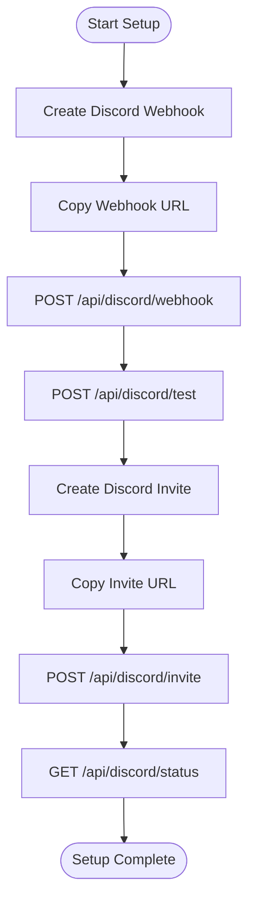

# Discord Integration API

<cite>
**Referenced Files in This Document**
- [api/server.py](file://api/server.py)
- [core/discord_integration.py](file://core/discord_integration.py)
- [core/settings.py](file://core/settings.py)
- [docs/DISCORD.md](file://docs/DISCORD.md)
- [docs/DISCORD_SETUP_GUIDE.md](file://docs/DISCORD_SETUP_GUIDE.md)
- [docs/API.md](file://docs/API.md)
- [static/discord.html](file://static/discord.html)
- [tests/test_discord.py](file://tests/test_discord.py)
</cite>

## Table of Contents
1. [Introduction](#introduction)
2. [Project Structure](#project-structure)
3. [Core Components](#core-components)
4. [Architecture Overview](#architecture-overview)
5. [Detailed Component Analysis](#detailed-component-analysis)
6. [Dependency Analysis](#dependency-analysis)
7. [Performance Considerations](#performance-considerations)
8. [Troubleshooting Guide](#troubleshooting-guide)
9. [Conclusion](#conclusion)
10. [Appendices](#appendices)

## Introduction
This document provides comprehensive API documentation for LANrage's Discord integration endpoints. It covers HTTP methods, URL patterns, request/response schemas, validation requirements, and practical examples for webhook configuration, invite URLs, status checking, and testing notifications. It also documents the integration status structure, bot configuration, and webhook instructions, along with practical setup and testing procedures.

## Project Structure
The Discord integration is implemented as a FastAPI service with dedicated endpoints under the `/api/discord` namespace. The backend logic resides in the core module and integrates with the settings database for persistence.


**Diagram sources**
- [api/server.py](file://api/server.py#L278-L360)
- [core/discord_integration.py](file://core/discord_integration.py#L81-L633)
- [core/settings.py](file://core/settings.py#L20-L525)

**Section sources**
- [api/server.py](file://api/server.py#L1-L701)
- [core/discord_integration.py](file://core/discord_integration.py#L1-L633)
- [core/settings.py](file://core/settings.py#L1-L525)

## Core Components
- DiscordIntegration: Manages webhook notifications, Rich Presence, and bot connectivity. Provides methods for sending notifications, updating presence, and managing invite links.
- DiscordWebhookHelper: Provides validation helpers and setup instructions for webhook and invite URLs.
- SettingsDatabase: Persistent storage for Discord-related settings (webhook URL, invite URL, bot token, channel ID, app ID).

Key responsibilities:
- Webhook configuration and validation
- Invite URL configuration and retrieval
- Integration status reporting
- Test notification delivery
- Rich Presence and bot connectivity management

**Section sources**
- [core/discord_integration.py](file://core/discord_integration.py#L81-L633)
- [core/settings.py](file://core/settings.py#L20-L525)

## Architecture Overview
The Discord integration follows a layered architecture with clear separation between API endpoints, core integration logic, and persistence.


**Diagram sources**
- [api/server.py](file://api/server.py#L281-L358)
- [core/discord_integration.py](file://core/discord_integration.py#L306-L402)
- [core/settings.py](file://core/settings.py#L97-L142)

## Detailed Component Analysis

### API Endpoints

#### POST /api/discord/webhook
Sets the Discord webhook URL for notifications.

**Request Schema:**
- webhook_url: string (required)
  - Must start with "https://discord.com/api/webhooks/" or "https://discordapp.com/api/webhooks/"
  - Minimum length: 1 character

**Response Schema:**
- status: string ("ok")
- message: string ("Discord webhook configured")

**Validation Rules:**
- URL format validation using DiscordWebhookHelper.validate_webhook_url()
- Returns 400 Bad Request for invalid format

**Example Request:**
```json
{
  "webhook_url": "https://discord.com/api/webhooks/123456789/abcdefghijklmnop"
}
```

**Example Response:**
```json
{
  "status": "ok",
  "message": "Discord webhook configured"
}
```

**Section sources**
- [api/server.py](file://api/server.py#L41-L47)
- [api/server.py](file://api/server.py#L281-L294)
- [core/discord_integration.py](file://core/discord_integration.py#L596-L607)

#### POST /api/discord/invite
Sets the Discord invite URL for voice chat.

**Request Schema:**
- invite_url: string (required)
  - Must start with "https://discord.gg/" or "https://discord.com/invite/"
  - Minimum length: 1 character

**Response Schema:**
- status: string ("ok")
- message: string ("Discord invite configured")

**Validation Rules:**
- URL format validation using DiscordWebhookHelper.validate_invite_url()
- Returns 400 Bad Request for invalid format

**Example Request:**
```json
{
  "invite_url": "https://discord.gg/abc123xyz"
}
```

**Example Response:**
```json
{
  "status": "ok",
  "message": "Discord invite configured"
}
```

**Section sources**
- [api/server.py](file://api/server.py#L45-L47)
- [api/server.py](file://api/server.py#L296-L309)
- [core/discord_integration.py](file://core/discord_integration.py#L602-L607)

#### GET /api/discord/status
Retrieves the current Discord integration status.

**Response Schema:**
- webhook_configured: boolean
- invite_configured: boolean
- invite_url: string|null
- rich_presence: boolean
- bot_configured: boolean
- bot_online: boolean

**Example Response:**
```json
{
  "webhook_configured": true,
  "invite_configured": true,
  "invite_url": "https://discord.gg/abc123xyz",
  "rich_presence": false,
  "bot_configured": false,
  "bot_online": false
}
```

**Section sources**
- [api/server.py](file://api/server.py#L311-L330)

#### GET /api/discord/instructions
Provides setup instructions for Discord integration.

**Response Schema:**
- webhook: string (multi-line instructions)
- invite: string (multi-line instructions)

**Section sources**
- [api/server.py](file://api/server.py#L332-L341)
- [core/discord_integration.py](file://core/discord_integration.py#L558-L594)

#### POST /api/discord/test
Sends a test notification to Discord.

**Response Schema:**
- status: string ("ok")
- message: string ("Test notification sent")

**Validation Rules:**
- Returns 400 Bad Request if webhook is not configured
- Uses DiscordIntegration.send_notification() with predefined test message

**Section sources**
- [api/server.py](file://api/server.py#L343-L358)
- [core/discord_integration.py](file://core/discord_integration.py#L324-L346)

### Data Models and Validation

#### DiscordWebhookRequest Model
- webhook_url: string
  - Field validator ensures minimum length > 0
  - Additional URL format validation performed in endpoint

#### DiscordInviteRequest Model
- invite_url: string
  - Field validator ensures minimum length > 0
  - Additional URL format validation performed in endpoint

**Section sources**
- [api/server.py](file://api/server.py#L41-L47)
- [api/server.py](file://api/server.py#L45-L47)

### URL Validation Rules

#### Webhook URL Validation
Valid formats:
- https://discord.com/api/webhooks/{webhook_id}/{webhook_token}
- https://discordapp.com/api/webhooks/{webhook_id}/{webhook_token}

Invalid formats:
- Non-HTTPS URLs
- Wrong domain (e.g., example.com)
- Missing webhook components

#### Invite URL Validation
Valid formats:
- https://discord.gg/{invite_code}
- https://discord.com/invite/{invite_code}

Invalid formats:
- Non-HTTPS URLs
- Wrong domain (e.g., example.com)
- Missing invite code

**Section sources**
- [core/discord_integration.py](file://core/discord_integration.py#L596-L607)
- [tests/test_discord.py](file://tests/test_discord.py#L63-L99)

### Integration Status Structure
The status endpoint returns a comprehensive view of the Discord integration state:

- webhook_configured: Boolean indicating if webhook URL is set
- invite_configured: Boolean indicating if invite URL is set
- invite_url: String containing the current invite URL or null
- rich_presence: Boolean indicating Rich Presence connection status
- bot_configured: Boolean derived from presence of bot token in settings
- bot_online: Boolean indicating bot connection status

**Section sources**
- [api/server.py](file://api/server.py#L311-L330)

### Bot Configuration
The system supports Discord bot functionality through the following settings:
- discord_bot_token: Authentication token for the bot
- discord_channel_id: Channel where bot messages are posted
- discord_app_id: Application ID for Rich Presence (optional)

These settings are stored in the persistent settings database and can be managed through the settings API.

**Section sources**
- [core/settings.py](file://core/settings.py#L494-L499)
- [api/server.py](file://api/server.py#L92-L96)

### Webhook Instructions
The system provides comprehensive setup instructions for both webhooks and invites:

#### Webhook Setup Instructions
1. Open Discord server
2. Go to Server Settings → Integrations
3. Click "Create Webhook" or "View Webhooks"
4. Click "New Webhook"
5. Name it "LANrage"
6. Select the channel for notifications
7. Copy the Webhook URL
8. Paste it in LANrage settings

#### Invite Setup Instructions
1. Open Discord server
2. Right-click on a voice channel
3. Click "Invite People"
4. Click "Edit Invite Link"
5. Set "Expire After" to "Never"
6. Set "Max Uses" to "No Limit"
7. Copy the invite link
8. Paste it in LANrage settings

**Section sources**
- [core/discord_integration.py](file://core/discord_integration.py#L558-L594)
- [docs/DISCORD_SETUP_GUIDE.md](file://docs/DISCORD_SETUP_GUIDE.md#L27-L66)

### Practical Examples

#### Webhook Setup and Testing
1. Create Discord webhook in server settings
2. Copy webhook URL
3. Send POST request to /api/discord/webhook
4. Verify configuration with GET /api/discord/status
5. Send test notification with POST /api/discord/test

#### Invite Configuration
1. Create permanent invite link to voice channel
2. Copy invite URL
3. Send POST request to /api/discord/invite
4. Verify invite appears in status response

#### Programmatic API Usage
```bash
# Set webhook
curl -X POST http://localhost:8666/api/discord/webhook \
  -H "Content-Type: application/json" \
  -d '{"webhook_url": "https://discord.com/api/webhooks/..."}'

# Set invite
curl -X POST http://localhost:8666/api/discord/invite \
  -H "Content-Type: application/json" \
  -d '{"invite_url": "https://discord.gg/..."}'

# Get status
curl http://localhost:8666/api/discord/status

# Send test notification
curl -X POST http://localhost:8666/api/discord/test
```

**Section sources**
- [docs/DISCORD_SETUP_GUIDE.md](file://docs/DISCORD_SETUP_GUIDE.md#L149-L169)

## Dependency Analysis


**Diagram sources**
- [core/discord_integration.py](file://core/discord_integration.py#L1-L15)
- [core/settings.py](file://core/settings.py#L1-L17)

The integration has minimal external dependencies:
- aiohttp for HTTP webhook requests
- sqlite3/aiosqlite for persistent settings storage
- Optional: pypresence for Rich Presence (not required)

**Section sources**
- [core/discord_integration.py](file://core/discord_integration.py#L1-L15)
- [core/settings.py](file://core/settings.py#L1-L17)

## Performance Considerations
- Webhook notifications are fire-and-forget with no retry mechanism
- Notification batching reduces API calls by grouping similar events within 500ms windows
- HTTP requests use aiohttp.ClientSession for efficient connection pooling
- Rich Presence operations run in separate threads to avoid blocking the event loop
- Settings operations are asynchronous and use database locking for thread safety

## Troubleshooting Guide

### Common Issues and Solutions

#### Webhook Not Working
- Verify webhook URL format starts with "https://discord.com/api/webhooks/"
- Check Discord channel permissions for the webhook
- Test with "Send Test" button
- Check LANrage logs for error messages

#### Invite Link Issues
- Verify invite URL format starts with "https://discord.gg/"
- Ensure invite is set to never expire
- Check that invite has unlimited uses

#### Rich Presence Problems
- Install pypresence: `uv pip install pypresence`
- Restart LANrage application
- Ensure Discord desktop app is running
- Verify Discord app ID is properly configured

#### API Endpoint Errors
- 400 Bad Request: Invalid URL format or missing parameters
- 500 Internal Server Error: Integration not initialized
- Check endpoint responses for specific error details

**Section sources**
- [docs/DISCORD_SETUP_GUIDE.md](file://docs/DISCORD_SETUP_GUIDE.md#L123-L140)
- [core/discord_integration.py](file://core/discord_integration.py#L392-L401)

## Conclusion
LANrage's Discord integration provides a robust, configurable solution for Discord webhook notifications, voice chat coordination, and Rich Presence. The API offers straightforward endpoints for configuration, status monitoring, and testing, with comprehensive validation and error handling. The system is designed for reliability with graceful degradation when optional components (like Rich Presence) are unavailable.

## Appendices

### Complete API Reference
For the complete REST API reference including all endpoints, request/response schemas, and status codes, refer to the main API documentation.

**Section sources**
- [docs/API.md](file://docs/API.md#L343-L441)

### Setup Flow Diagram


[No sources needed since this diagram shows conceptual workflow, not actual code structure]