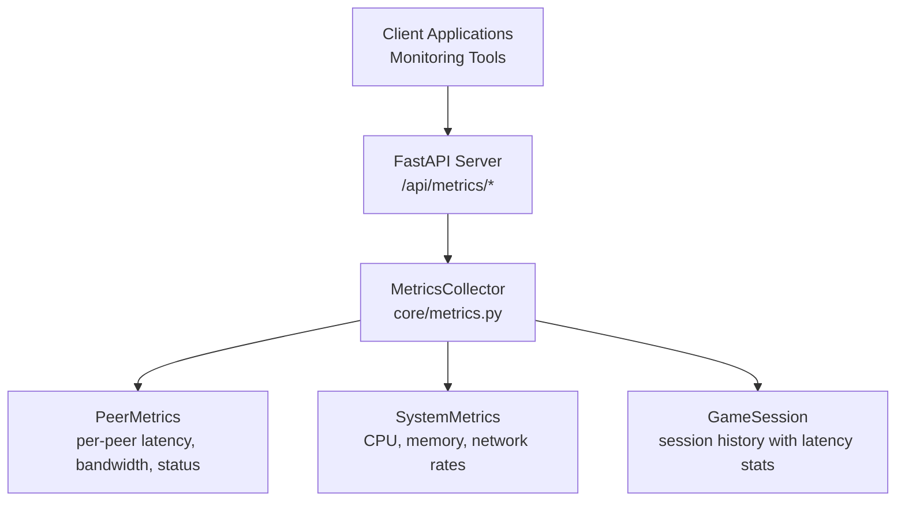
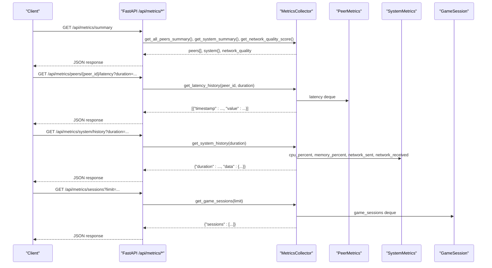
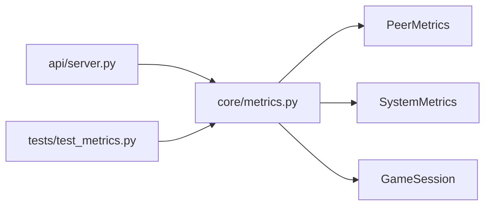

# Metrics API

<cite>
**Referenced Files in This Document**
- [api/server.py](file://api/server.py)
- [core/metrics.py](file://core/metrics.py)
- [docs/METRICS.md](file://docs/METRICS.md)
- [docs/API.md](file://docs/API.md)
- [tests/test_metrics.py](file://tests/test_metrics.py)
</cite>

## Table of Contents
1. [Introduction](#introduction)
2. [Project Structure](#project-structure)
3. [Core Components](#core-components)
4. [Architecture Overview](#architecture-overview)
5. [Detailed Component Analysis](#detailed-component-analysis)
6. [Dependency Analysis](#dependency-analysis)
7. [Performance Considerations](#performance-considerations)
8. [Troubleshooting Guide](#troubleshooting-guide)
9. [Conclusion](#conclusion)

## Introduction
This document provides comprehensive API documentation for LANrage’s metrics and monitoring endpoints. It covers HTTP methods, URL patterns, query parameters, and response schemas for peer metrics, system metrics, latency history, and game sessions. It also documents the metrics data structures, aggregation methods, and historical data formats, along with practical examples for monitoring integration and performance analysis.

## Project Structure
The metrics API is implemented as part of the FastAPI server and backed by the MetricsCollector class. The server exposes endpoints under `/api/metrics/*`, while the core metrics logic resides in `core/metrics.py`. Documentation for the metrics system is available in `docs/METRICS.md`, and the API reference is in `docs/API.md`.

**Diagram sources**
- [api/server.py](file://api/server.py#L188-L276)
- [core/metrics.py](file://core/metrics.py#L193-L215)

**Section sources**
- [api/server.py](file://api/server.py#L188-L276)
- [core/metrics.py](file://core/metrics.py#L193-L215)

## Core Components
- MetricsCollector: Central class managing peer metrics, system metrics, and game sessions. Provides methods to collect, summarize, and aggregate metrics.
- PeerMetrics: Per-peer latency history, bandwidth counters, packet counts, connection status, and quality metrics.
- SystemMetrics: CPU, memory, and network throughput histories.
- GameSession: Session records with timestamps, peers, and latency statistics.

Key behaviors:
- Latency history is stored with timestamps and supports duration-based filtering.
- System metrics are summarized with current, average, and max values.
- Aggregation functions compute count, min, max, average, 95th percentile, and sum over a time window.

**Section sources**
- [core/metrics.py](file://core/metrics.py#L16-L705)
- [docs/METRICS.md](file://docs/METRICS.md#L17-L72)

## Architecture Overview
The metrics API endpoints expose:
- Summary of peers, system, and overall network quality
- Individual peer metrics
- Peer latency history with duration filtering
- System metrics summary and history
- Recent game sessions with latency statistics

**Diagram sources**
- [api/server.py](file://api/server.py#L191-L276)
- [core/metrics.py](file://core/metrics.py#L442-L581)

## Detailed Component Analysis

### Metrics Endpoints

#### GET /api/metrics/summary
- Purpose: Retrieve an overall snapshot including peer summaries, system summary, and network quality score.
- Response schema:
  - peers: Array of peer summaries
  - system: System summary with cpu, memory, and network fields
  - network_quality: Single float score (0–100)
- Typical usage: Dashboard overview and health checks.

**Section sources**
- [api/server.py](file://api/server.py#L191-L201)
- [docs/API.md](file://docs/API.md#L137-L187)

#### GET /api/metrics/peers
- Purpose: Retrieve summaries for all tracked peers.
- Response schema:
  - peers: Array of peer summary objects (same structure as individual peer summary)
- Typical usage: Bulk peer monitoring.

**Section sources**
- [api/server.py](file://api/server.py#L204-L210)
- [docs/API.md](file://docs/API.md#L191-L200)

#### GET /api/metrics/peers/{peer_id}
- Purpose: Retrieve metrics for a specific peer.
- Path parameters:
  - peer_id: String identifier of the peer
- Response schema:
  - peer_id, peer_name, status
  - latency: current, average, min, max
  - bandwidth: sent, received
  - packets: sent, received
  - uptime, last_seen
- Typical usage: Per-peer diagnostics and alerts.

**Section sources**
- [api/server.py](file://api/server.py#L213-L223)
- [docs/API.md](file://docs/API.md#L204-L223)

#### GET /api/metrics/peers/{peer_id}/latency
- Purpose: Retrieve latency history for a peer within a given duration.
- Path parameters:
  - peer_id: String identifier of the peer
- Query parameters:
  - duration: Integer seconds (default 3600)
- Response schema:
  - peer_id, duration
  - data: Array of {timestamp, value} pairs
- Typical usage: Graphing latency trends and detecting anomalies.

**Section sources**
- [api/server.py](file://api/server.py#L226-L238)
- [docs/API.md](file://docs/API.md#L231-L252)

#### GET /api/metrics/system
- Purpose: Retrieve a summary of system metrics.
- Response schema:
  - cpu: current, average, max
  - memory: current, average, max
  - network: sent_rate, recv_rate, total_sent, total_recv
- Typical usage: System health monitoring.

**Section sources**
- [api/server.py](file://api/server.py#L241-L247)
- [docs/API.md](file://docs/API.md#L256-L279)

#### GET /api/metrics/system/history
- Purpose: Retrieve system metrics history within a given duration.
- Query parameters:
  - duration: Integer seconds (default 3600)
- Response schema:
  - duration
  - data: Object with cpu, memory, network_sent, network_received arrays of {timestamp, value}
- Typical usage: Historical analysis and trend visualization.

**Section sources**
- [api/server.py](file://api/server.py#L250-L261)
- [docs/API.md](file://docs/API.md#L284-L307)

#### GET /api/metrics/sessions
- Purpose: Retrieve recent game sessions with latency statistics.
- Query parameters:
  - limit: Integer maximum sessions to return (default 10)
- Response schema:
  - sessions: Array of session objects with game_id, game_name, timestamps, peers, and latency averages/min/max
- Typical usage: Post-game analysis and reporting.

**Section sources**
- [api/server.py](file://api/server.py#L264-L275)
- [docs/API.md](file://docs/API.md#L311-L339)

### Data Structures and Aggregation

#### PeerMetrics
- Fields:
  - peer_id, peer_name
  - latency: deque of MetricPoint
  - bytes_sent, bytes_received, packets_sent, packets_received
  - connection_uptime, last_seen, status
  - packet_loss_percent, jitter_ms, quality_score, quality_trend

#### SystemMetrics
- Fields:
  - cpu_percent, memory_percent, network_sent, network_received (deque of MetricPoint)

#### GameSession
- Fields:
  - game_id, game_name, started_at, ended_at, duration
  - peers, avg_latency, max_latency, min_latency

#### Aggregation Methods
- aggregate_metrics_by_window:
  - Computes count, min, max, avg, p95, sum over a time window
  - Used by get_aggregated_system_metrics and get_aggregated_peer_metrics

**Section sources**
- [core/metrics.py](file://core/metrics.py#L16-L705)
- [docs/METRICS.md](file://docs/METRICS.md#L17-L72)

### Example Workflows

#### Retrieving Peer Latency History with Duration Filtering
- Endpoint: GET /api/metrics/peers/{peer_id}/latency?duration=1800
- Behavior:
  - Filters latency points within the last 1800 seconds
  - Returns an array of {timestamp, value} pairs
- Practical use:
  - Plot 30-minute latency trends
  - Detect spikes or sustained high latency

**Section sources**
- [api/server.py](file://api/server.py#L226-L238)
- [tests/test_metrics.py](file://tests/test_metrics.py#L107-L141)

#### Retrieving System Metrics History
- Endpoint: GET /api/metrics/system/history?duration=1800
- Behavior:
  - Returns four series (cpu, memory, network_sent, network_received)
  - Each series is filtered to the last 1800 seconds
- Practical use:
  - Correlate CPU spikes with network congestion
  - Identify periods of high memory usage

**Section sources**
- [api/server.py](file://api/server.py#L250-L261)
- [tests/test_metrics.py](file://tests/test_metrics.py#L154-L164)

#### Monitoring Integration and Performance Analysis
- Use GET /api/metrics/summary for dashboard widgets
- Use GET /api/metrics/peers/{peer_id}/latency for per-peer graphs
- Use GET /api/metrics/system/history for system trend charts
- Use GET /api/metrics/sessions for post-session reports

**Section sources**
- [docs/METRICS.md](file://docs/METRICS.md#L460-L538)

## Dependency Analysis
The metrics API depends on the MetricsCollector for data computation. The server initializes and injects the collector instance into route handlers. Tests validate the behavior of latency history filtering and system history retrieval.

**Diagram sources**
- [api/server.py](file://api/server.py#L680-L701)
- [core/metrics.py](file://core/metrics.py#L193-L215)
- [tests/test_metrics.py](file://tests/test_metrics.py#L1-L273)

**Section sources**
- [api/server.py](file://api/server.py#L680-L701)
- [core/metrics.py](file://core/metrics.py#L193-L215)
- [tests/test_metrics.py](file://tests/test_metrics.py#L1-L273)

## Performance Considerations
- Data retention: Up to 360 data points per metric series (1 hour at 10-second intervals).
- Memory footprint: Estimated ~1–2 MB for typical usage (10 peers).
- CPU usage: Collection loop negligible; metric recording and summary generation lightweight.
- Filtering: Duration-based filters reduce payload sizes for historical endpoints.

**Section sources**
- [docs/METRICS.md](file://docs/METRICS.md#L542-L562)

## Troubleshooting Guide
Common issues and resolutions:
- Peer not found:
  - Symptom: 404 when querying a specific peer
  - Cause: Peer not tracked or removed
  - Resolution: Ensure peer is added before querying latency history
- Metrics collector not initialized:
  - Symptom: 500 when calling any metrics endpoint
  - Cause: Server not started with a MetricsCollector instance
  - Resolution: Initialize and pass the collector to the API server
- Empty latency history:
  - Symptom: Empty data array for latency history
  - Cause: No recent data within the requested duration
  - Resolution: Increase duration or wait for new measurements

**Section sources**
- [api/server.py](file://api/server.py#L194-L201)
- [tests/test_metrics.py](file://tests/test_metrics.py#L242-L269)

## Conclusion
LANrage’s metrics API provides a focused set of endpoints for real-time monitoring and historical analysis. The endpoints expose peer-level latency, system resource usage, and game session statistics, enabling robust monitoring and performance analysis. The underlying MetricsCollector offers efficient data structures and aggregation capabilities suitable for production dashboards and alerting systems.