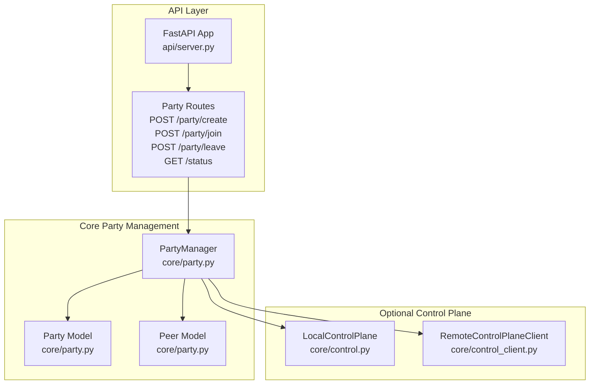
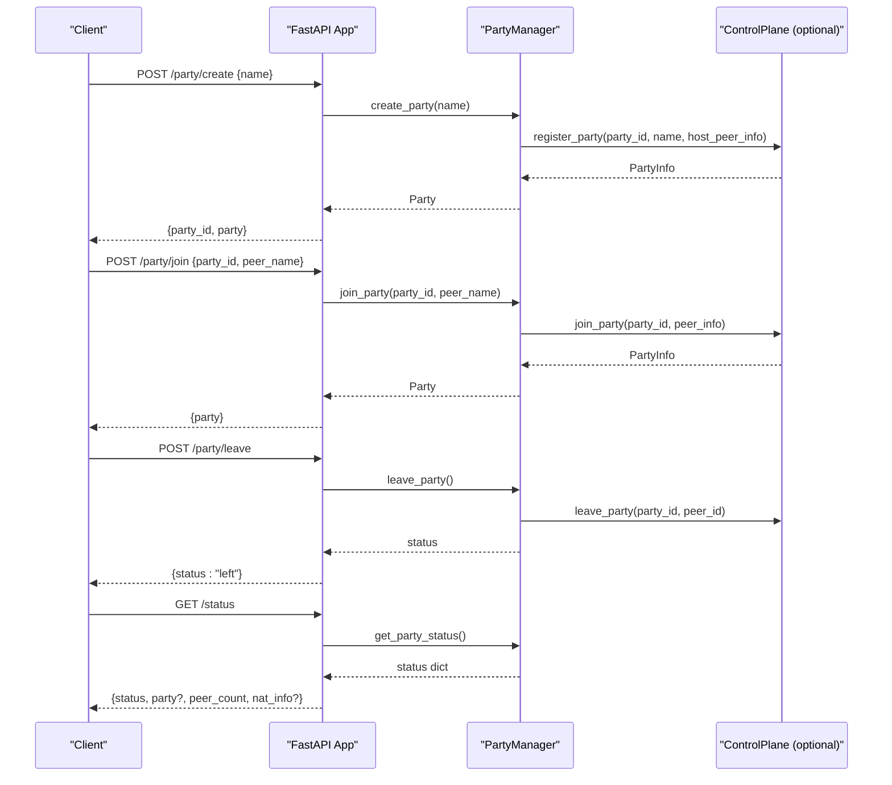
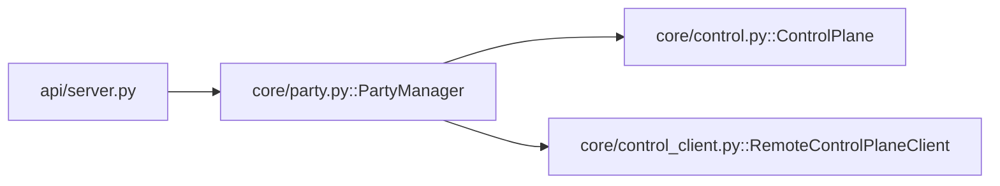

# Party Management API

<cite>
**Referenced Files in This Document**
- [api/server.py](file://api/server.py)
- [core/party.py](file://core/party.py)
- [core/control.py](file://core/control.py)
- [core/control_client.py](file://core/control_client.py)
- [docs/PARTY.md](file://docs/PARTY.md)
- [docs/API.md](file://docs/API.md)
- [lanrage.py](file://lanrage.py)
- [tests/test_party.py](file://tests/test_party.py)
</cite>

## Table of Contents
1. [Introduction](#introduction)
2. [Project Structure](#project-structure)
3. [Core Components](#core-components)
4. [Architecture Overview](#architecture-overview)
5. [Detailed Component Analysis](#detailed-component-analysis)
6. [Dependency Analysis](#dependency-analysis)
7. [Performance Considerations](#performance-considerations)
8. [Troubleshooting Guide](#troubleshooting-guide)
9. [Conclusion](#conclusion)
10. [Appendices](#appendices)

## Introduction
This document describes the Party Management API used by LANrage to manage virtual LAN parties. It covers HTTP endpoints for creating, joining, leaving parties, and retrieving party status. It also documents request/response schemas, validation rules, error handling, and integration patterns. Authentication and security considerations are explained, along with practical examples for typical party lifecycle management scenarios.

## Project Structure
The Party Management API is implemented as part of the FastAPI server and integrates with the core party management subsystem and optional control plane.

**Diagram sources**
- [api/server.py](file://api/server.py#L155-L186)
- [core/party.py](file://core/party.py#L102-L304)
- [core/control.py](file://core/control.py#L458-L880)
- [core/control_client.py](file://core/control_client.py#L23-L438)

**Section sources**
- [api/server.py](file://api/server.py#L1-L701)
- [core/party.py](file://core/party.py#L1-L304)
- [core/control.py](file://core/control.py#L1-L880)
- [core/control_client.py](file://core/control_client.py#L1-L438)

## Core Components
- FastAPI application with party endpoints under /party and /status.
- PartyManager orchestrating party lifecycle and peer connections.
- Pydantic models for request validation and response serialization.
- Optional control plane integration for distributed party discovery and signaling.

Key responsibilities:
- Validation of request bodies using Pydantic models.
- Delegation to PartyManager for party operations.
- Returning structured JSON responses with consistent schemas.
- Graceful error handling with appropriate HTTP status codes.

**Section sources**
- [api/server.py](file://api/server.py#L32-L39)
- [api/server.py](file://api/server.py#L155-L186)
- [core/party.py](file://core/party.py#L102-L304)

## Architecture Overview
The Party Management API exposes four primary endpoints:
- POST /party/create: Creates a new party and returns the generated party ID and party details.
- POST /party/join: Joins an existing party by ID with a display name.
- POST /party/leave: Leaves the current party.
- GET /status: Retrieves current party status including peer list, peer count, and NAT information.

**Diagram sources**
- [api/server.py](file://api/server.py#L155-L186)
- [core/party.py](file://core/party.py#L159-L304)
- [core/control.py](file://core/control.py#L228-L294)
- [core/control_client.py](file://core/control_client.py#L191-L268)

## Detailed Component Analysis

### Endpoint Definitions

#### Create Party
- Method: POST
- URL: /party/create
- Request Body: CreatePartyRequest
- Response: CreatePartyResponse

Request schema:
- name: string (min length 1, max length 50)

Response schema:
- party_id: string
- party: Party object (includes id, name, host_id, peers, created_at)

Validation rules:
- name is required and must be 1–50 characters long.

Status codes:
- 200: Success
- 400: Bad Request (validation error)
- 500: Internal Server Error (Party manager not initialized)

Example request:
- POST /party/create with JSON body:
  - name: "Gaming Night"

Example response:
- 200 OK with JSON:
  - party_id: "abc123"
  - party: {id, name, host_id, peers, created_at}

Notes:
- The party is created locally by default; if a remote control plane is configured, registration occurs there as well.

**Section sources**
- [api/server.py](file://api/server.py#L32-L34)
- [api/server.py](file://api/server.py#L155-L162)
- [core/party.py](file://core/party.py#L159-L196)

#### Join Party
- Method: POST
- URL: /party/join
- Request Body: JoinPartyRequest
- Response: JoinPartyResponse

Request schema:
- party_id: string (min length 1, max length 20)
- peer_name: string (min length 1, max length 50)

Response schema:
- party: Party object (includes id, name, host_id, peers, created_at)

Validation rules:
- party_id and peer_name are required and must be 1–20 and 1–50 characters respectively.

Status codes:
- 200: Success
- 400: Bad Request (validation error)
- 500: Internal Server Error (Party manager not initialized)
- 501: Not Implemented (when control plane not initialized)

Behavior:
- Attempts to join via control plane if available; otherwise raises a not implemented error.
- On success, returns the updated party object with peers populated.

**Section sources**
- [api/server.py](file://api/server.py#L36-L39)
- [api/server.py](file://api/server.py#L165-L175)
- [core/party.py](file://core/party.py#L198-L247)

#### Leave Party
- Method: POST
- URL: /party/leave
- Request Body: None
- Response: LeavePartyResponse

Response schema:
- status: string ("left")

Behavior:
- Leaves the current party and disconnects from peers via the control plane.
- Clears current party state.

Status codes:
- 200: Success
- 500: Internal Server Error (Party manager not initialized)

**Section sources**
- [api/server.py](file://api/server.py#L178-L185)
- [core/party.py](file://core/party.py#L249-L261)

#### Get Party Status
- Method: GET
- URL: /status
- Request Body: None
- Response: PartyStatusResponse

Response schema:
- status: string ("no_party" or "in_party")
- party: Party object (present when in_party)
- peer_count: integer
- nat_info: object (present when NAT detected)
  - nat_type: string
  - public_ip: string
  - public_port: integer

Behavior:
- Returns current party status, peer count, and NAT information.
- Measures latency for peers when available.

Status codes:
- 200: Success
- 500: Internal Server Error (Party manager not initialized)

**Section sources**
- [api/server.py](file://api/server.py#L146-L152)
- [core/party.py](file://core/party.py#L279-L304)

### Request/Response Schemas

#### CreatePartyRequest
- name: string (required, min length 1, max length 50)

Validation:
- Enforced by Pydantic field validators.

**Section sources**
- [api/server.py](file://api/server.py#L32-L34)

#### JoinPartyRequest
- party_id: string (required, min length 1, max length 20)
- peer_name: string (required, min length 1, max length 50)

Validation:
- Enforced by Pydantic field validators.

**Section sources**
- [api/server.py](file://api/server.py#L36-L39)

#### Party Model
- id: string
- name: string
- host_id: string
- peers: dict[string, Peer]
- created_at: datetime

Methods:
- get_peer_list(): list[Peer]
- get_compatible_peers(my_nat_type): list[Peer]

**Section sources**
- [core/party.py](file://core/party.py#L58-L100)

#### Peer Model
- id: string
- name: string
- public_key: string (WireGuard public key)
- virtual_ip: string
- endpoint: string | None
- latency_ms: float | None
- connection_type: string ("direct", "relayed", "connecting", "host", "failed", "unknown")
- nat_type: string
- joined_at: datetime

**Section sources**
- [core/party.py](file://core/party.py#L44-L56)

### Authentication and Security
- Local API: No authentication required. CORS is enabled for local web UI.
- Control plane integration: Optional remote control plane supports Bearer token authentication for server-side endpoints. The client sends Authorization: Bearer <token> headers on requests.
- Party management endpoints exposed by the local API do not require tokens.

Security considerations:
- Party IDs are randomly generated 6-byte hex strings, not guessable.
- Peer authentication uses WireGuard public key cryptography.
- Game traffic is end-to-end encrypted; privacy controls are documented in the party system documentation.

**Section sources**
- [docs/API.md](file://docs/API.md#L934-L948)
- [core/control_client.py](file://core/control_client.py#L101-L103)
- [docs/PARTY.md](file://docs/PARTY.md#L489-L511)

### Error Handling and Status Codes
Common HTTP status codes:
- 200: Success
- 400: Bad Request (validation errors)
- 404: Not Found (resources not found)
- 500: Internal Server Error (server-side failures)
- 501: Not Implemented (feature not available)

Party-specific error handling:
- Party manager not initialized: 500
- Party joining not yet implemented: 501
- Other join failures: 500 with error message

**Section sources**
- [docs/API.md](file://docs/API.md#L898-L904)
- [api/server.py](file://api/server.py#L158-L175)

### Practical Examples and Lifecycle Patterns

#### Example 1: Create a Party
- Steps:
  - POST /party/create with {name: "Gaming Night"}
  - Store returned party_id
  - Share party_id with friends
- Expected response:
  - {party_id: "...", party: {...}}

**Section sources**
- [api/server.py](file://api/server.py#L155-L162)

#### Example 2: Join a Party
- Steps:
  - POST /party/join with {party_id: "...", peer_name: "Alice"}
  - On success, poll /status to monitor peers and NAT status
- Expected response:
  - {party: {...}}

**Section sources**
- [api/server.py](file://api/server.py#L165-L175)
- [api/server.py](file://api/server.py#L146-L152)

#### Example 3: Leave a Party
- Steps:
  - POST /party/leave
  - Stop polling /status
- Expected response:
  - {status: "left"}

**Section sources**
- [api/server.py](file://api/server.py#L178-L185)

#### Example 4: Monitor Party Status
- Steps:
  - GET /status
  - Inspect status, peer_count, nat_info
- Expected response:
  - {status: "in_party", party: {...}, peer_count: 2, nat_info: {...}}

**Section sources**
- [api/server.py](file://api/server.py#L146-L152)

## Dependency Analysis
The API depends on PartyManager for party operations. PartyManager optionally integrates with a control plane (local or remote) for peer discovery and signaling.

**Diagram sources**
- [api/server.py](file://api/server.py#L155-L186)
- [core/party.py](file://core/party.py#L102-L304)
- [core/control.py](file://core/control.py#L458-L880)
- [core/control_client.py](file://core/control_client.py#L23-L438)

**Section sources**
- [api/server.py](file://api/server.py#L1-L701)
- [core/party.py](file://core/party.py#L1-L304)
- [core/control.py](file://core/control.py#L1-L880)
- [core/control_client.py](file://core/control_client.py#L1-L438)

## Performance Considerations
- Party creation: minimal latency, single control plane request.
- Joining party: 1–3 seconds, includes control plane request plus peer connections.
- Status updates: <500ms with latency measurements; latency measured via ICMP ping.

**Section sources**
- [docs/PARTY.md](file://docs/PARTY.md#L469-L487)

## Troubleshooting Guide
Common issues and resolutions:
- Party manager not initialized: Ensure the API server is started with PartyManager injected.
- Party joining not implemented: Initialize control plane or use local mode.
- Validation errors: Verify request body fields meet length constraints.
- NAT-related connectivity: Check NAT type and compatibility; fallback to relay mode if needed.

**Section sources**
- [api/server.py](file://api/server.py#L149-L175)
- [docs/PARTY.md](file://docs/PARTY.md#L435-L467)

## Conclusion
The Party Management API provides a simple, validated interface for creating, joining, leaving, and monitoring parties. It integrates with the core party management subsystem and can optionally leverage a control plane for distributed discovery. Requests are validated using Pydantic models, and responses follow consistent schemas. The API is designed for local operation without requiring authentication, while advanced features like remote control plane integration rely on Bearer tokens.

## Appendices

### API Reference Summary
- POST /party/create
  - Request: CreatePartyRequest
  - Response: {party_id, party}
  - Status: 200, 400, 500
- POST /party/join
  - Request: JoinPartyRequest
  - Response: {party}
  - Status: 200, 400, 500, 501
- POST /party/leave
  - Request: None
  - Response: {status: "left"}
  - Status: 200, 500
- GET /status
  - Request: None
  - Response: {status, party?, peer_count, nat_info?}
  - Status: 200, 500

**Section sources**
- [api/server.py](file://api/server.py#L155-L186)
- [api/server.py](file://api/server.py#L146-L152)

### Validation Rules Reference
- CreatePartyRequest.name: required, length 1–50
- JoinPartyRequest.party_id: required, length 1–20
- JoinPartyRequest.peer_name: required, length 1–50

**Section sources**
- [api/server.py](file://api/server.py#L32-L39)

### NAT Compatibility Notes
- Direct P2P connections depend on NAT compatibility.
- Symmetric NAT typically requires relay mode.
- Compatibility matrix is used to determine direct connection feasibility.

**Section sources**
- [core/party.py](file://core/party.py#L19-L41)
- [docs/PARTY.md](file://docs/PARTY.md#L69-L87)