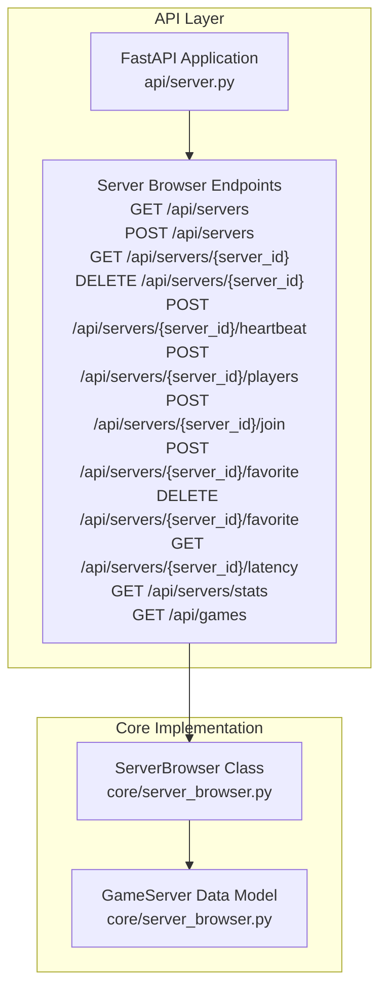
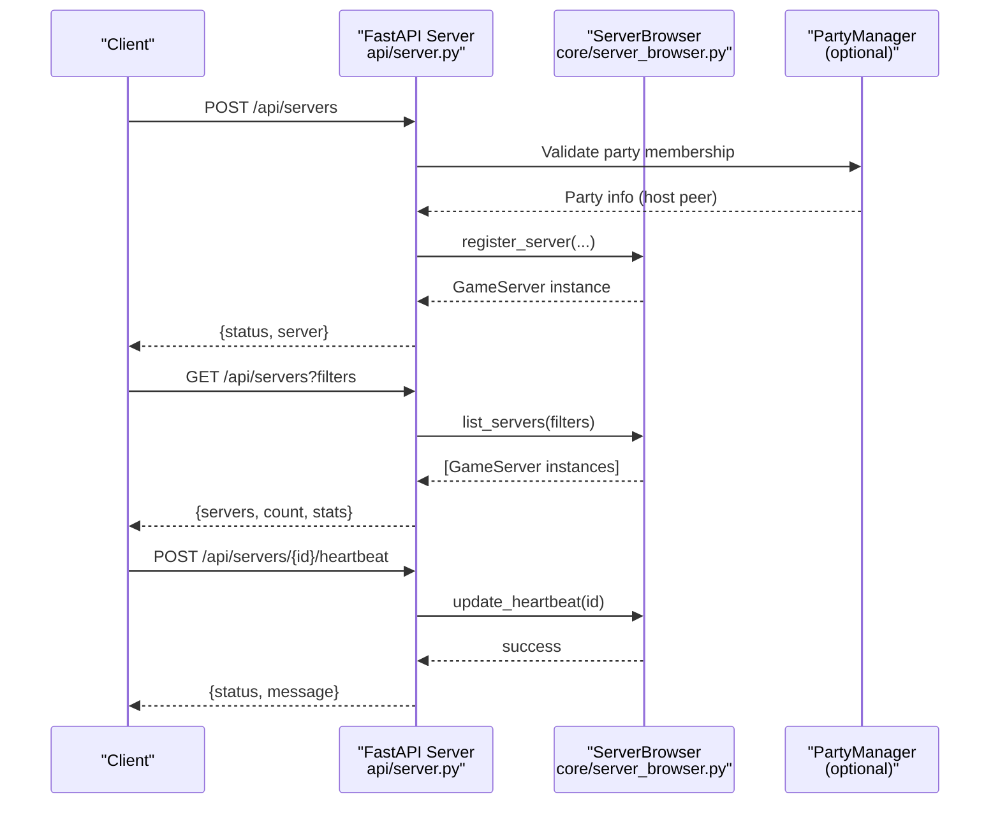
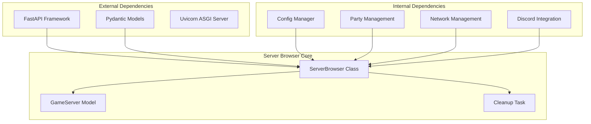

# Server Browser API

<cite>
**Referenced Files in This Document**
- [api/server.py](file://api/server.py)
- [core/server_browser.py](file://core/server_browser.py)
- [docs/API.md](file://docs/API.md)
- [docs/SERVER_BROWSER.md](file://docs/SERVER_BROWSER.md)
- [tests/test_server_browser.py](file://tests/test_server_browser.py)
</cite>

## Table of Contents
1. [Introduction](#introduction)
2. [Project Structure](#project-structure)
3. [Core Components](#core-components)
4. [Architecture Overview](#architecture-overview)
5. [Detailed Component Analysis](#detailed-component-analysis)
6. [Dependency Analysis](#dependency-analysis)
7. [Performance Considerations](#performance-considerations)
8. [Troubleshooting Guide](#troubleshooting-guide)
9. [Conclusion](#conclusion)

## Introduction
This document provides comprehensive API documentation for LANrage's server browser endpoints. It covers HTTP methods, URL patterns, query parameters, and request/response schemas for server listing, registration, heartbeat, player count updates, and server details. It also documents server filtering options, favorite management, and latency measurement capabilities, along with practical examples for server registration workflows and integration patterns.

## Project Structure
The server browser functionality is implemented as a FastAPI application with a dedicated server browser module that manages game server discovery and browsing. The API endpoints are defined in the FastAPI application and delegate to the server browser implementation.



**Diagram sources**
- [api/server.py](file://api/server.py#L361-L560)
- [core/server_browser.py](file://core/server_browser.py#L75-L552)

**Section sources**
- [api/server.py](file://api/server.py#L1-L701)
- [core/server_browser.py](file://core/server_browser.py#L1-L552)

## Core Components
The server browser API consists of two primary components:
- FastAPI application with server browser endpoints
- ServerBrowser class that manages server lifecycle and discovery

Key responsibilities:
- Server registration and lifecycle management
- Server discovery with filtering and sorting
- Player count updates and heartbeat maintenance
- Favorite management and latency measurement
- Automatic cleanup of expired servers

**Section sources**
- [api/server.py](file://api/server.py#L361-L560)
- [core/server_browser.py](file://core/server_browser.py#L75-L552)

## Architecture Overview
The server browser API follows a layered architecture with clear separation between the HTTP interface and the business logic:



**Diagram sources**
- [api/server.py](file://api/server.py#L364-L477)
- [core/server_browser.py](file://core/server_browser.py#L101-L167)

## Detailed Component Analysis

### Server Listing Endpoint
The server listing endpoint provides filtered and sorted server discovery with comprehensive filtering options.

**Endpoint**: `GET /api/servers`
**Query Parameters**:
- `game`: Filter by game name (case-insensitive)
- `hide_full`: Boolean to hide full servers
- `hide_empty`: Boolean to hide empty servers  
- `hide_password`: Boolean to hide password-protected servers
- `tags`: Comma-separated list of tags (any match)
- `search`: Text search across server name, game, and host name

**Response Schema**:
```json
{
  "servers": [
    {
      "id": "string",
      "name": "string", 
      "game": "string",
      "host_peer_id": "string",
      "host_peer_name": "string",
      "host_ip": "string",
      "max_players": integer,
      "current_players": integer,
      "map_name": "string|null",
      "game_mode": "string|null",
      "password_protected": boolean,
      "tags": ["string"],
      "created_at": number,
      "last_heartbeat": number,
      "latency_ms": number|null,
      "is_full": boolean,
      "age_seconds": number
    }
  ],
  "count": integer,
  "stats": {
    "total_servers": integer,
    "total_players": integer,
    "unique_games": integer,
    "games": ["string"],
    "favorites": integer
  }
}
```

**Filtering Logic**:
1. Game filtering (exact case-insensitive match)
2. Full server exclusion (current_players >= max_players)
3. Empty server exclusion (current_players <= 0)
4. Password protection exclusion
5. Tag matching (any tag in server's tags)
6. Text search across name, game, and host name
7. Sorting by player count (descending), then by name

**Section sources**
- [api/server.py](file://api/server.py#L364-L391)
- [core/server_browser.py](file://core/server_browser.py#L226-L284)

### Server Registration Endpoint
The server registration endpoint allows hosts to advertise their game servers to the browser.

**Endpoint**: `POST /api/servers`
**Request Schema** (RegisterServerRequest):
```json
{
  "server_id": "string",
  "name": "string",
  "game": "string", 
  "max_players": integer,
  "current_players": integer,
  "map_name": "string|null",
  "game_mode": "string|null",
  "password_protected": boolean,
  "tags": ["string|null"]
}
```

**Validation Rules**:
- `server_id`: Required, length 1-100
- `name`: Required, length 1-100
- `game`: Required, length 1-50
- `max_players`: Required, integer ≥ 1, ≤ 1000
- `current_players`: Required, integer ≥ 0
- `map_name`: Optional, length ≤ 100
- `game_mode`: Optional, length ≤ 50
- `password_protected`: Optional boolean (default: false)
- `tags`: Optional array, length ≤ 10
- **Custom Validation**: `current_players` cannot exceed `max_players`

**Response Schema**:
```json
{
  "status": "ok",
  "server": { /* Full GameServer object */ }
}
```

**Integration Requirements**:
- Must be in a party to register (party membership validated)
- Host peer information extracted from current party
- Server registration creates GameServer instance with host metadata

**Section sources**
- [api/server.py](file://api/server.py#L49-L68)
- [api/server.py](file://api/server.py#L395-L424)
- [core/server_browser.py](file://core/server_browser.py#L101-L167)

### Server Details Endpoint
Retrieves detailed information about a specific server.

**Endpoint**: `GET /api/servers/{server_id}`
**Path Parameter**:
- `server_id`: Server identifier

**Response Schema**: Complete GameServer object with additional computed fields:
- `is_full`: Boolean indicating if server is at capacity
- `age_seconds`: Age of server in seconds

**Section sources**
- [api/server.py](file://api/server.py#L427-L437)
- [core/server_browser.py](file://core/server_browser.py#L42-L64)

### Server Lifecycle Management
Endpoints for managing server lifecycle and operational status.

**Unregister Server**: `DELETE /api/servers/{server_id}`
**Heartbeat Update**: `POST /api/servers/{server_id}/heartbeat`
**Player Count Update**: `POST /api/servers/{server_id}/players`
**Join Server**: `POST /api/servers/{server_id}/join`

**Response Schemas**:
- Unregister: `{status: "ok", message: "Server unregistered"}`
- Heartbeat: `{status: "ok", message: "Heartbeat updated"}`
- Player Count: `{status: "ok", message: "Player count updated"}`
- Join: `{status: "ok", message: "Join server by connecting to host", server: {...}, host_ip: "string"}`

**Section sources**
- [api/server.py](file://api/server.py#L440-L477)

### Favorite Management
Endpoints for managing favorite servers.

**Add to Favorites**: `POST /api/servers/{server_id}/favorite`
**Remove from Favorites**: `DELETE /api/servers/{server_id}/favorite`

**Response Schema**:
```json
{
  "status": "ok", 
  "message": "Server added to favorites|removed from favorites"
}
```

**Section sources**
- [api/server.py](file://api/server.py#L516-L537)

### Latency Measurement
Measures network latency to a specific server using ICMP ping with advanced metrics.

**Endpoint**: `GET /api/servers/{server_id}/latency`
**Response Schema**:
```json
{
  "server_id": "string",
  "latency_ms": number
}
```

**Advanced Latency Features**:
- Multi-sample ping collection (3 samples)
- Median calculation for outlier rejection
- Exponential Moving Average (EMA) smoothing
- Trend detection (improving/stable/degrading)
- Adaptive measurement intervals (10-60 seconds)
- Platform-specific ping command support

**Section sources**
- [api/server.py](file://api/server.py#L540-L550)
- [core/server_browser.py](file://core/server_browser.py#L334-L473)

### Additional Endpoints
**Statistics**: `GET /api/servers/stats` - Returns server browser statistics
**Games List**: `GET /api/games` - Returns list of games with active servers

**Section sources**
- [api/server.py](file://api/server.py#L553-L569)

## Dependency Analysis
The server browser API has clear dependency relationships between components:



**Diagram sources**
- [api/server.py](file://api/server.py#L1-L701)
- [core/server_browser.py](file://core/server_browser.py#L1-L552)

**Section sources**
- [api/server.py](file://api/server.py#L680-L701)
- [core/server_browser.py](file://core/server_browser.py#L75-L100)

## Performance Considerations
The server browser is designed for low overhead operation:

- **Memory Usage**: ~1KB per server (metadata only)
- **CPU Usage**: 
  - Registration: <0.1ms per server
  - Filtering: <1ms for 100 servers
  - Cleanup: <1ms per cleanup cycle
  - Latency Measurement: 1-2 seconds (blocking ping)
- **Automatic Cleanup**: Expired servers (no heartbeat for 90 seconds) are removed every 30 seconds
- **Best Practices**: Hosts should send heartbeats every 30-60 seconds

**Section sources**
- [docs/SERVER_BROWSER.md](file://docs/SERVER_BROWSER.md#L591-L607)

## Troubleshooting Guide

### Common Issues and Solutions

**Server Registration Failures**:
- **Error**: "Must be in a party to register a server"
- **Cause**: Client not part of a party
- **Solution**: Create or join a party before registering

**Server Not Found Errors**:
- **Error Codes**: 404 Not Found
- **Causes**: Non-existent server ID, expired server
- **Solutions**: Verify server ID, ensure server is still active

**Player Count Validation**:
- **Error**: Validation error for current_players exceeding max_players
- **Cause**: Invalid player count values
- **Solution**: Ensure current_players ≤ max_players

**Latency Measurement Failures**:
- **Error**: "Failed to measure latency"
- **Causes**: Ping command failures, network issues
- **Solutions**: Check network connectivity, firewall settings

**Section sources**
- [api/server.py](file://api/server.py#L397-L401)
- [api/server.py](file://api/server.py#L431-L435)
- [api/server.py](file://api/server.py#L543-L549)

## Conclusion
The LANrage server browser API provides a comprehensive solution for game server discovery and management. Its RESTful design, robust validation, and advanced features like adaptive latency measurement make it suitable for both simple and complex gaming scenarios. The clear separation between API endpoints and core implementation ensures maintainability and extensibility for future enhancements.