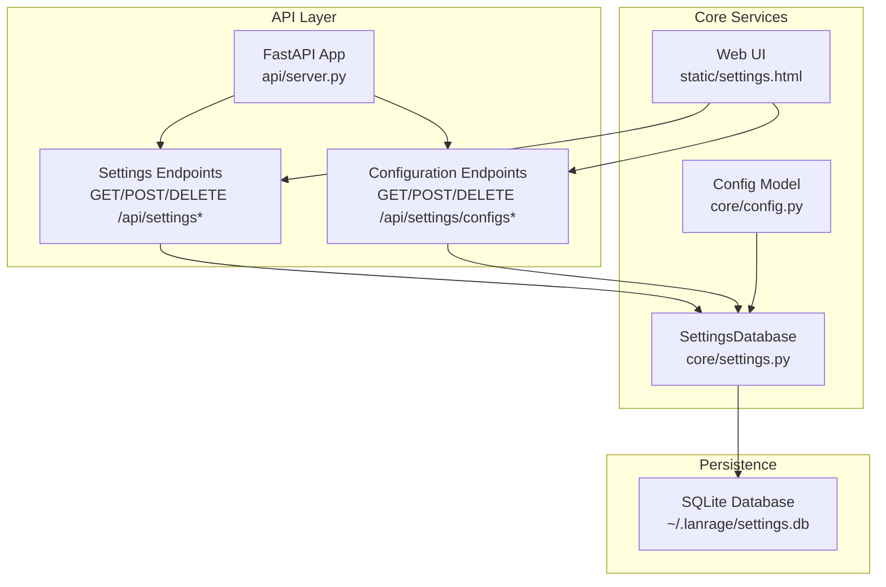
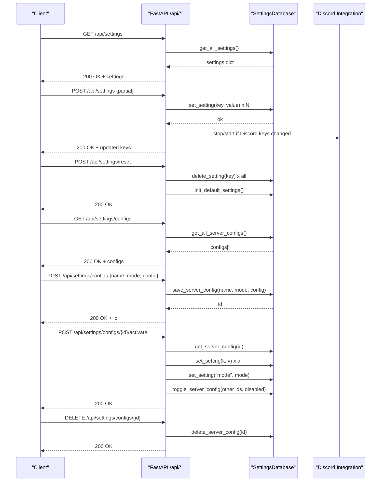
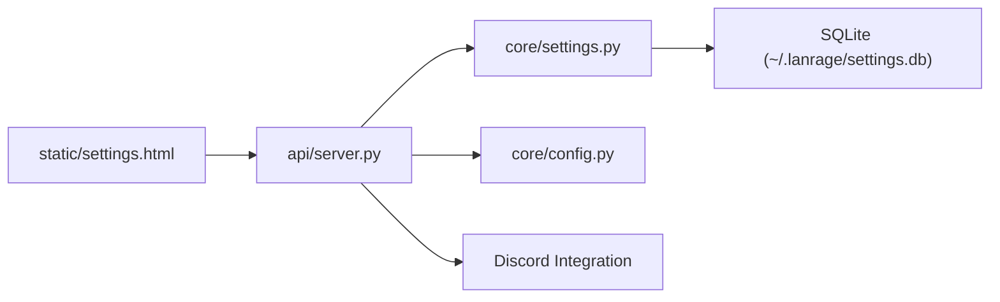

# Settings & Configuration API

<cite>
**Referenced Files in This Document**
- [api/server.py](file://api/server.py)
- [core/settings.py](file://core/settings.py)
- [core/config.py](file://core/config.py)
- [docs/API.md](file://docs/API.md)
- [docs/SETTINGS.md](file://docs/SETTINGS.md)
- [static/settings.html](file://static/settings.html)
- [lanrage.py](file://lanrage.py)
- [setup.py](file://setup.py)
</cite>

## Table of Contents
1. [Introduction](#introduction)
2. [Project Structure](#project-structure)
3. [Core Components](#core-components)
4. [Architecture Overview](#architecture-overview)
5. [Detailed Component Analysis](#detailed-component-analysis)
6. [Dependency Analysis](#dependency-analysis)
7. [Performance Considerations](#performance-considerations)
8. [Troubleshooting Guide](#troubleshooting-guide)
9. [Conclusion](#conclusion)

## Introduction
This document provides comprehensive API documentation for LANrage's settings and configuration management endpoints. It covers HTTP methods, URL patterns, request/response schemas, validation requirements, and operational behavior for retrieving, updating, and managing settings and configuration templates. It also documents the SettingsRequest model and SaveConfigRequest model, along with default values, validation rules, and practical examples for automated configuration management and settings synchronization.

## Project Structure
LANrage exposes a FastAPI-based REST API with dedicated endpoints for settings and configuration management. The API integrates with a SQLite-backed settings database and a Pydantic-based configuration model. The Web UI provides a user-friendly interface for managing settings and saved configurations.

**Diagram sources**
- [api/server.py](file://api/server.py#L107-L677)
- [core/settings.py](file://core/settings.py#L20-L473)
- [core/config.py](file://core/config.py#L17-L113)
- [static/settings.html](file://static/settings.html#L483-L680)

**Section sources**
- [api/server.py](file://api/server.py#L107-L677)
- [core/settings.py](file://core/settings.py#L20-L473)
- [core/config.py](file://core/config.py#L17-L113)
- [static/settings.html](file://static/settings.html#L483-L680)

## Core Components
- SettingsDatabase: Async SQLite-backed storage for settings, server configurations, favorites, and game profiles. Provides CRUD operations and serialization/deserialization helpers.
- SettingsRequest: Pydantic model for partial settings updates via POST /api/settings.
- SaveConfigRequest: Pydantic model for saving configuration templates via POST /api/settings/configs.
- Config: Pydantic model representing runtime configuration loaded from the settings database.

Key behaviors:
- Settings are serialized to SQLite with type metadata and updated timestamps.
- Default settings are initialized automatically if missing.
- Configuration templates support activation/deactivation and bulk application.

**Section sources**
- [core/settings.py](file://core/settings.py#L20-L473)
- [api/server.py](file://api/server.py#L74-L105)
- [core/config.py](file://core/config.py#L17-L113)

## Architecture Overview
The settings and configuration management flow connects HTTP requests to the SettingsDatabase through FastAPI endpoints. Updates trigger persistence and optional integration restarts (e.g., Discord). Configuration templates are stored separately and can be activated to apply multiple settings atomically.

**Diagram sources**
- [api/server.py](file://api/server.py#L575-L677)
- [core/settings.py](file://core/settings.py#L132-L240)

## Detailed Component Analysis

### Settings Retrieval and Update Endpoints
- GET /api/settings
  - Purpose: Retrieve all current settings as a JSON object.
  - Response: Object containing all persisted settings.
  - Notes: Used by the Web UI to populate form fields.

- POST /api/settings
  - Purpose: Partially update settings.
  - Request body: SettingsRequest (see below).
  - Behavior: Applies only provided fields; ignores nulls. If Discord-related keys change, the Discord integration is restarted.
  - Response: Object indicating success and the list of updated keys.

- POST /api/settings/reset
  - Purpose: Reset all settings to defaults.
  - Behavior: Deletes all existing settings, then initializes default values.
  - Response: Success message.

Validation and defaults:
- Settings are validated by the SettingsRequest model (Pydantic).
- Default values are initialized automatically if the database is empty or missing required keys.

Practical example:
- Use GET to snapshot current settings, then POST to apply targeted changes, and optionally POST /api/settings/reset to revert to defaults.

**Section sources**
- [api/server.py](file://api/server.py#L575-L630)
- [docs/API.md](file://docs/API.md#L735-L800)
- [docs/SETTINGS.md](file://docs/SETTINGS.md#L481-L503)

### SettingsRequest Model
SettingsRequest defines the schema for partial settings updates. All fields are optional to support incremental updates.

Fields:
- mode: str | None
- peer_name: str | None
- interface_name: str | None
- virtual_subnet: str | None
- wireguard_keepalive: int | None
- auto_optimize_games: bool | None
- enable_broadcast: bool | None
- enable_discord: bool | None
- enable_metrics: bool | None
- relay_public_ip: str | None
- relay_port: int | None
- max_clients: int | None
- api_host: str | None
- api_port: int | None
- control_server: str | None
- discord_app_id: str | None
- discord_webhook: str | None
- discord_invite: str | None
- discord_bot_token: str | None
- discord_channel_id: str | None

Behavior:
- Only provided fields are applied.
- Discord-related keys trigger integration restart if present.

Validation:
- Fields are validated by Pydantic; type mismatches will cause HTTP 422 responses.

**Section sources**
- [api/server.py](file://api/server.py#L74-L96)
- [docs/API.md](file://docs/API.md#L764-L785)

### Configuration Templates Endpoints
- GET /api/settings/configs
  - Purpose: List all saved configuration templates.
  - Response: Array of configuration objects with id, name, mode, config, enabled flag, and timestamps.

- POST /api/settings/configs
  - Purpose: Save a new configuration template.
  - Request body: SaveConfigRequest (see below).
  - Response: Object with status, message, and newly assigned id.

- POST /api/settings/configs/{config_id}/activate
  - Purpose: Activate a saved configuration.
  - Behavior: Applies all settings from the template, sets mode, and enables this template while disabling others.
  - Response: Success message.

- DELETE /api/settings/configs/{config_id}
  - Purpose: Delete a configuration template.
  - Response: Success message.

Validation:
- Template names must be unique; conflicts are handled by the underlying storage.

**Section sources**
- [api/server.py](file://api/server.py#L632-L677)
- [docs/API.md](file://docs/API.md#L803-L884)

### SaveConfigRequest Model
SaveConfigRequest defines the schema for saving configuration templates.

Fields:
- name: str (required)
- mode: str (required)
- config: dict (required)

Behavior:
- Saves a named template with a mode and a dictionary of settings.
- The config dict can include any subset of supported settings.

**Section sources**
- [api/server.py](file://api/server.py#L99-L105)
- [docs/API.md](file://docs/API.md#L823-L846)

### Settings Validation, Defaults, and Integration Behavior
- Validation:
  - SettingsRequest enforces field types via Pydantic.
  - Discord endpoints validate URLs before applying changes.
- Defaults:
  - Default settings are initialized automatically if missing.
  - Defaults include network, API, user, WireGuard, relay, and feature toggles.
- Integration:
  - Updating Discord-related settings triggers Discord integration restart.
  - Activation applies all settings from a template and sets the mode accordingly.

**Section sources**
- [api/server.py](file://api/server.py#L582-L611)
- [core/settings.py](file://core/settings.py#L476-L507)
- [docs/SETTINGS.md](file://docs/SETTINGS.md#L481-L503)

### Practical Examples for Automated Configuration Management and Settings Synchronization

- Example 1: Snapshot and compare settings
  - GET /api/settings to retrieve current settings.
  - Store the response for later comparison.
  - POST /api/settings with a minimal SettingsRequest to apply targeted changes.
  - Compare updated vs original to confirm changes.

- Example 2: Bulk configuration rollout
  - POST /api/settings/configs with a SaveConfigRequest to create a template.
  - Store the returned id.
  - POST /api/settings/configs/{id}/activate to apply the template across nodes.
  - Optionally POST /api/settings/reset to revert to defaults.

- Example 3: Synchronized settings across environments
  - Export current settings via GET /api/settings.
  - Distribute the exported payload to other machines.
  - On target machines, POST /api/settings with the received payload to synchronize.

- Example 4: Web UI automation
  - The Web UI (static/settings.html) demonstrates how to call these endpoints programmatically:
    - GET /api/settings to populate form fields.
    - POST /api/settings to save changes.
    - POST /api/settings/reset to restore defaults.
    - POST /api/settings/configs to save templates.
    - POST /api/settings/configs/{id}/activate to apply templates.
    - DELETE /api/settings/configs/{id} to remove templates.

**Section sources**
- [static/settings.html](file://static/settings.html#L483-L680)
- [docs/API.md](file://docs/API.md#L735-L884)

## Dependency Analysis
The settings and configuration subsystem depends on:
- FastAPI for HTTP routing and request validation.
- SettingsDatabase for persistence and type-aware serialization.
- Config for runtime configuration derived from settings.
- Discord integration for optional real-time updates when settings change.

**Diagram sources**
- [api/server.py](file://api/server.py#L107-L677)
- [core/settings.py](file://core/settings.py#L20-L473)
- [core/config.py](file://core/config.py#L17-L113)
- [static/settings.html](file://static/settings.html#L483-L680)

**Section sources**
- [api/server.py](file://api/server.py#L107-L677)
- [core/settings.py](file://core/settings.py#L20-L473)
- [core/config.py](file://core/config.py#L17-L113)
- [static/settings.html](file://static/settings.html#L483-L680)

## Performance Considerations
- Settings operations are lightweight (<1ms reads, <5ms writes).
- SQLite provides efficient key-value storage for settings.
- Concurrency is protected by an asyncio lock to prevent race conditions.
- Configuration templates are stored as JSON blobs, enabling compact storage and fast retrieval.

[No sources needed since this section provides general guidance]

## Troubleshooting Guide
Common issues and resolutions:
- Database locked or integrity errors:
  - Cause: Concurrent access without proper locking or disk corruption.
  - Resolution: Ensure exclusive access; validate integrity; restore from backup if needed.
- Settings not persisting:
  - Cause: Database not initialized or write failures.
  - Resolution: Confirm database file exists, verify permissions, and check disk space.
- Discord integration not updating:
  - Cause: Missing or invalid Discord settings.
  - Resolution: Update Discord-related settings via POST /api/settings; the integration restarts automatically.

**Section sources**
- [docs/SETTINGS.md](file://docs/SETTINGS.md#L606-L634)
- [api/server.py](file://api/server.py#L592-L606)

## Conclusion
LANrage’s settings and configuration management provides a robust, database-first approach to persistent configuration. The API supports granular updates, bulk configuration templates, and safe activation/deactivation workflows. Combined with the Web UI and programmatic automation, it enables flexible and reliable configuration management across diverse deployment scenarios.