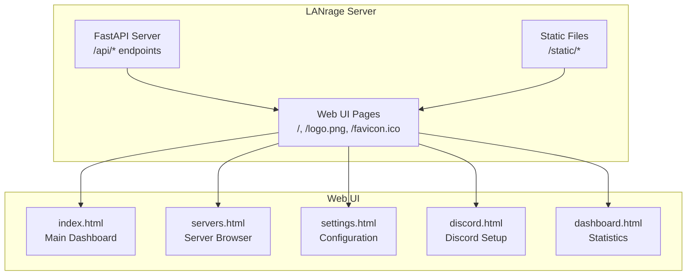
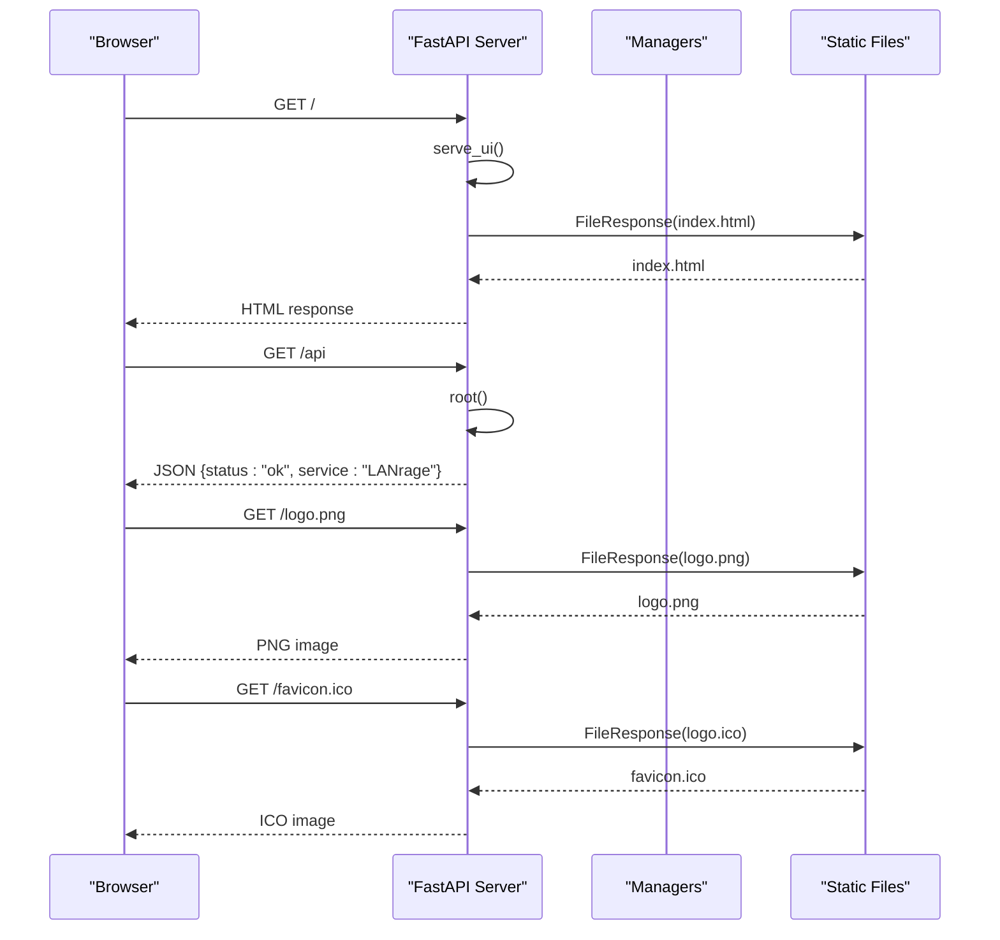
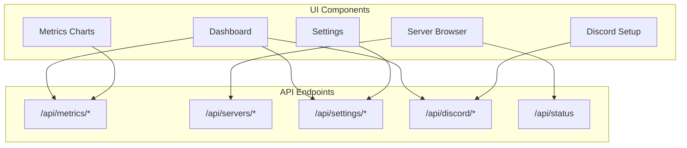
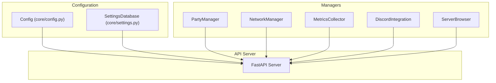

# Web UI Endpoints

<cite>
**Referenced Files in This Document**
- [lanrage.py](file://lanrage.py)
- [api/server.py](file://api/server.py)
- [static/index.html](file://static/index.html)
- [static/dashboard.html](file://static/dashboard.html)
- [static/servers.html](file://static/servers.html)
- [static/settings.html](file://static/settings.html)
- [static/discord.html](file://static/discord.html)
- [core/config.py](file://core/config.py)
- [core/settings.py](file://core/settings.py)
</cite>

## Table of Contents
1. [Introduction](#introduction)
2. [Project Structure](#project-structure)
3. [Core Components](#core-components)
4. [Architecture Overview](#architecture-overview)
5. [Detailed Component Analysis](#detailed-component-analysis)
6. [Dependency Analysis](#dependency-analysis)
7. [Performance Considerations](#performance-considerations)
8. [Troubleshooting Guide](#troubleshooting-guide)
9. [Conclusion](#conclusion)
10. [Appendices](#appendices)

## Introduction
This document provides comprehensive API documentation for LANrage's web interface endpoints and static file serving. It covers the root endpoint, UI serving endpoints, favicon and logo serving, and health check endpoint. Additionally, it documents the relationship between API endpoints and web interface components, provides practical examples for embedding LANrage UI in external applications, and explains customization options for the web interface.

## Project Structure
LANrage consists of:
- A FastAPI server that serves both REST API endpoints and static web assets
- A set of HTML pages that form the web UI
- Static assets (images, icons) served alongside the UI
- Configuration and settings management that powers the UI and API



**Diagram sources**
- [api/server.py](file://api/server.py#L18-L29)
- [static/index.html](file://static/index.html#L674-L676)
- [static/servers.html](file://static/servers.html#L325-L326)
- [static/settings.html](file://static/settings.html#L295-L296)
- [static/discord.html](file://static/discord.html#L217-L218)
- [static/dashboard.html](file://static/dashboard.html#L267-L274)

**Section sources**
- [api/server.py](file://api/server.py#L1-L701)
- [lanrage.py](file://lanrage.py#L143-L154)

## Core Components
This section outlines the primary web UI endpoints and static file serving capabilities.

- Root endpoint (`/`)
  - Purpose: Serve the main web UI (index.html)
  - Method: GET
  - Response: HTML file response
  - Notes: Falls back to JSON error if UI file is missing

- Health check endpoint (`/api`)
  - Purpose: Basic service health verification
  - Method: GET
  - Response: JSON with status and service name

- Logo endpoint (`/logo.png`)
  - Purpose: Serve the LANrage logo image
  - Method: GET
  - Response: PNG image file response
  - Notes: Returns 404 if file is missing

- Favicon endpoint (`/favicon.ico`)
  - Purpose: Serve the browser favicon
  - Method: GET
  - Response: ICO image file response
  - Notes: Returns 404 if file is missing

- Static file serving (`/static/*`)
  - Purpose: Serve static assets (CSS, JS, images)
  - Method: GET
  - Response: Static files mounted from the static directory
  - Notes: Mounted at runtime if directory exists

**Section sources**
- [api/server.py](file://api/server.py#L107-L121)
- [api/server.py](file://api/server.py#L107-L111)
- [api/server.py](file://api/server.py#L124-L132)
- [api/server.py](file://api/server.py#L135-L143)
- [api/server.py](file://api/server.py#L18-L21)

## Architecture Overview
The web UI architecture integrates FastAPI endpoints with static HTML pages and assets. The server initializes managers (party, network, metrics, discord, browser) and exposes both API endpoints and UI routes. Static assets are served from the static directory, while the main UI is served from index.html.



**Diagram sources**
- [api/server.py](file://api/server.py#L113-L121)
- [api/server.py](file://api/server.py#L107-L111)
- [api/server.py](file://api/server.py#L124-L132)
- [api/server.py](file://api/server.py#L135-L143)

**Section sources**
- [api/server.py](file://api/server.py#L680-L701)
- [lanrage.py](file://lanrage.py#L143-L154)

## Detailed Component Analysis

### Root Endpoint (`/`)
- Description: Serves the main web UI page (index.html)
- Behavior:
  - Checks if index.html exists in the static directory
  - Returns FileResponse with index.html if found
  - Returns JSON error if file is missing
- Integration: Used by browsers to load the main dashboard

**Section sources**
- [api/server.py](file://api/server.py#L113-L121)
- [static/index.html](file://static/index.html#L1-L50)

### Health Check Endpoint (`/api`)
- Description: Provides basic service health status
- Response: JSON object containing status and service name
- Usage: Can be used for monitoring and health checks

**Section sources**
- [api/server.py](file://api/server.py#L107-L111)

### Logo Serving (`/logo.png`)
- Description: Serves the LANrage logo image
- Response: PNG image file response
- Error handling: Returns 404 if logo.png is missing

**Section sources**
- [api/server.py](file://api/server.py#L124-L132)

### Favicon Serving (`/favicon.ico`)
- Description: Serves the browser favicon
- Response: ICO image file response
- Error handling: Returns 404 if logo.ico is missing

**Section sources**
- [api/server.py](file://api/server.py#L135-L143)

### Static File Serving (`/static/*`)
- Description: Serves static assets from the static directory
- Behavior:
  - Mounts the static directory at runtime if it exists
  - Serves files with appropriate MIME types
- Integration: Used by all HTML pages to load CSS, JavaScript, and images

**Section sources**
- [api/server.py](file://api/server.py#L18-L21)

### Web UI Pages and Their API Dependencies

#### Main Dashboard (`/`)
- Page: index.html
- API dependencies:
  - `/api/metrics/summary` - Dashboard metrics
  - `/api/metrics/system/history?duration=600` - System charts
  - `/api/metrics/sessions?limit=5` - Recent sessions
  - `/api/settings` - Settings for mode and configuration
  - `/api/discord/status` - Discord integration status
  - `/api/servers/stats` - Server browser statistics
- Integration patterns:
  - Periodic polling for metrics updates
  - Manual refresh controls for server listings
  - Dynamic content updates based on settings

**Section sources**
- [static/index.html](file://static/index.html#L420-L445)
- [static/index.html](file://static/index.html#L447-L479)
- [static/index.html](file://static/index.html#L481-L507)

#### Server Browser (`/servers.html`)
- Page: servers.html
- API dependencies:
  - `/api/servers` - List servers with filtering
  - `/api/servers/{server_id}/join` - Join a server
  - `/api/servers/{server_id}/favorite` - Toggle favorites
  - `/api/servers/{server_id}/latency` - Measure latency
  - `/api/servers/stats` - Server statistics
  - `/api/games` - Game list for filtering
- Integration patterns:
  - Real-time server updates (auto-refresh)
  - Interactive filtering and search
  - Favorite management

**Section sources**
- [static/servers.html](file://static/servers.html#L407-L445)
- [static/servers.html](file://static/servers.html#L543-L559)
- [static/servers.html](file://static/servers.html#L561-L578)
- [static/servers.html](file://static/servers.html#L580-L594)

#### Settings (`/settings.html`)
- Page: settings.html
- API dependencies:
  - `/api/settings` - Get current settings
  - `/api/settings` (POST) - Update settings
  - `/api/settings/reset` - Reset to defaults
  - `/api/settings/configs` - List saved configurations
  - `/api/settings/configs` (POST) - Save new configuration
  - `/api/settings/configs/{config_id}/activate` - Activate configuration
  - `/api/settings/configs/{config_id}` (DELETE) - Delete configuration
- Integration patterns:
  - Form-based settings management
  - Configuration templates
  - Mode switching (client/relay)

**Section sources**
- [static/settings.html](file://static/settings.html#L483-L524)
- [static/settings.html](file://static/settings.html#L526-L563)
- [static/settings.html](file://static/settings.html#L565-L579)
- [static/settings.html](file://static/settings.html#L613-L639)
- [static/settings.html](file://static/settings.html#L641-L669)

#### Discord Integration (`/discord.html`)
- Page: discord.html
- API dependencies:
  - `/api/discord/status` - Get integration status
  - `/api/discord/webhook` (POST) - Set webhook URL
  - `/api/discord/invite` (POST) - Set invite URL
  - `/api/discord/test` (POST) - Send test notification
  - `/api/discord/instructions` - Get setup instructions
- Integration patterns:
  - Step-by-step Discord setup
  - Real-time status updates
  - Validation of URLs before saving

**Section sources**
- [static/discord.html](file://static/discord.html#L330-L376)
- [static/discord.html](file://static/discord.html#L378-L409)
- [static/discord.html](file://static/discord.html#L411-L426)
- [static/discord.html](file://static/discord.html#L428-L459)

#### Statistics Dashboard (`/dashboard.html`)
- Page: dashboard.html
- API dependencies:
  - `/api/metrics/summary` - Overall metrics
  - `/api/metrics/system/history?duration=600` - System charts
  - `/api/metrics/sessions?limit=5` - Recent sessions
- Integration patterns:
  - Real-time chart updates
  - Peer list management
  - Session history display

**Section sources**
- [static/dashboard.html](file://static/dashboard.html#L420-L445)
- [static/dashboard.html](file://static/dashboard.html#L447-L479)
- [static/dashboard.html](file://static/dashboard.html#L481-L507)

### API-to-UI Component Relationships
The web UI components depend on specific API endpoints for their functionality:



**Diagram sources**
- [static/index.html](file://static/index.html#L420-L445)
- [static/servers.html](file://static/servers.html#L407-L445)
- [static/settings.html](file://static/settings.html#L483-L524)
- [static/discord.html](file://static/discord.html#L330-L376)
- [static/dashboard.html](file://static/dashboard.html#L420-L445)

## Dependency Analysis
The web UI relies on several backend components and configuration sources:



**Diagram sources**
- [core/config.py](file://core/config.py#L17-L114)
- [core/settings.py](file://core/settings.py#L20-L525)
- [api/server.py](file://api/server.py#L680-L701)

Key dependency relationships:
- Configuration drives API behavior and UI defaults
- Settings database persists UI and system configuration
- Managers provide the data and functionality for API endpoints
- Static files and UI pages depend on API endpoints for dynamic content

**Section sources**
- [core/config.py](file://core/config.py#L49-L114)
- [core/settings.py](file://core/settings.py#L466-L525)
- [api/server.py](file://api/server.py#L680-L701)

## Performance Considerations
- Static file serving: The static directory is mounted at runtime, minimizing overhead for UI assets
- API caching: Some endpoints return cached data from managers to reduce processing overhead
- Real-time updates: The UI implements periodic polling for metrics and server lists
- Resource optimization: HTML pages are designed with minimal JavaScript dependencies to improve load times

## Troubleshooting Guide
Common issues and resolutions:

### UI Not Loading
- Verify the root endpoint (`/`) returns index.html
- Check that static directory exists and contains index.html
- Confirm the static mount point is active

### Missing Assets
- Logo not displaying: Ensure logo.png exists in the project root
- Favicon not showing: Ensure logo.ico exists in the project root
- CSS/JS not loading: Verify /static/* endpoints are accessible

### API Integration Issues
- Metrics not updating: Check /api/metrics endpoints availability
- Server browser not working: Verify /api/servers endpoints
- Settings not saving: Confirm /api/settings endpoints are reachable

**Section sources**
- [api/server.py](file://api/server.py#L113-L121)
- [api/server.py](file://api/server.py#L124-L143)
- [api/server.py](file://api/server.py#L18-L21)

## Conclusion
LANrage provides a comprehensive web interface with integrated API endpoints and static file serving. The architecture cleanly separates concerns between API functionality and UI presentation, enabling both standalone usage and potential embedding in external applications. The endpoints and static assets work together to deliver a responsive, real-time gaming experience with extensive configuration options.

## Appendices

### Practical Embedding Examples

#### Basic Embedding Pattern
To embed LANrage UI in an external application:

```javascript
// Example: Embedding the main dashboard
const iframe = document.createElement('iframe');
iframe.src = 'http://localhost:8666/';
iframe.style.width = '100%';
iframe.style.height = '600px';
document.body.appendChild(iframe);
```

#### Customized UI Integration
For custom applications, you can:
- Use the settings API to preconfigure LANrage
- Access metrics endpoints for monitoring
- Integrate server browser functionality programmatically

### Customization Options
- Theme customization: Modify CSS variables in HTML pages
- API host/port: Configure through settings endpoints
- Feature toggles: Enable/disable specific components via settings
- Branding: Replace logo and favicon with custom assets

**Section sources**
- [static/index.html](file://static/index.html#L1-L800)
- [static/servers.html](file://static/servers.html#L1-L625)
- [static/settings.html](file://static/settings.html#L1-L684)
- [static/discord.html](file://static/discord.html#L1-L473)
- [static/dashboard.html](file://static/dashboard.html#L1-L587)