# Architecture & Design

<cite>
**Referenced Files in This Document**
- [README.md](file://README.md)
- [lanrage.py](file://lanrage.py)
- [api/server.py](file://api/server.py)
- [core/config.py](file://core/config.py)
- [core/party.py](file://core/party.py)
- [core/network.py](file://core/network.py)
- [core/control.py](file://core/control.py)
- [core/connection.py](file://core/connection.py)
- [core/nat.py](file://core/nat.py)
- [core/ipam.py](file://core/ipam.py)
- [core/metrics.py](file://core/metrics.py)
- [core/server_browser.py](file://core/server_browser.py)
- [core/settings.py](file://core/settings.py)
- [servers/control_server.py](file://servers/control_server.py)
- [servers/relay_server.py](file://servers/relay_server.py)
</cite>

## Table of Contents
1. [Introduction](#introduction)
2. [Project Structure](#project-structure)
3. [Core Components](#core-components)
4. [Architecture Overview](#architecture-overview)
5. [Detailed Component Analysis](#detailed-component-analysis)
6. [Dependency Analysis](#dependency-analysis)
7. [Performance Considerations](#performance-considerations)
8. [Troubleshooting Guide](#troubleshooting-guide)
9. [Conclusion](#conclusion)
10. [Appendices](#appendices)

## Introduction
LANrage is a zero-config mesh VPN designed to bring LAN-like connectivity to online gaming. It emphasizes low-latency direct peer-to-peer (P2P) connections with smart relay fallback, WireGuard-based data planes, and a modular control plane for peer discovery and signaling. The system integrates configuration management, metrics and monitoring, NAT traversal, and a game server browser to deliver a seamless gaming experience.

Key goals:
- Zero-config operation with a Web UI and REST API
- Direct P2P when feasible, with relay fallback for challenging NAT topologies
- Mesh networking across multiple peers with automatic reconnection and relay switching
- Real-time metrics and quality-of-service (QoS) indicators
- Production-ready reliability with graceful shutdown and cleanup

## Project Structure
The repository is organized around a main entry point, a modular core subsystem, an API layer, and supporting packages for control and relay servers.

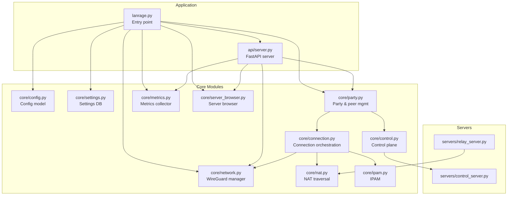

**Diagram sources**
- [lanrage.py](file://lanrage.py#L1-L230)
- [api/server.py](file://api/server.py#L1-L701)
- [core/config.py](file://core/config.py#L1-L114)
- [core/settings.py](file://core/settings.py#L1-L525)
- [core/network.py](file://core/network.py#L1-L515)
- [core/party.py](file://core/party.py#L1-L304)
- [core/control.py](file://core/control.py#L1-L880)
- [core/connection.py](file://core/connection.py#L1-L493)
- [core/nat.py](file://core/nat.py#L1-L525)
- [core/ipam.py](file://core/ipam.py#L1-L183)
- [core/metrics.py](file://core/metrics.py#L1-L705)
- [core/server_browser.py](file://core/server_browser.py#L1-L552)
- [servers/control_server.py](file://servers/control_server.py)
- [servers/relay_server.py](file://servers/relay_server.py)

**Section sources**
- [README.md](file://README.md#L93-L108)
- [lanrage.py](file://lanrage.py#L1-L230)
- [api/server.py](file://api/server.py#L1-L701)

## Core Components
- Configuration and Settings: Centralized configuration model and a persistent settings database for runtime and restart consistency.
- Network Management: WireGuard interface creation, key management, and peer configuration.
- Party and Control Plane: Local or remote control plane for peer discovery, registration, and signaling.
- Connection Orchestration: NAT-aware connection strategy selection, direct P2P vs relay, and dynamic endpoint switching.
- NAT Traversal: STUN-based NAT detection, UDP hole punching, and relay endpoint selection.
- IP Address Management: Virtual subnet allocation for peers within a configurable base network.
- Metrics and Monitoring: Continuous system and peer metrics collection with quality scoring and aggregation.
- Server Browser: Discovery, registration, and latency measurement for game servers.
- API Layer: FastAPI endpoints for UI and external integrations.

**Section sources**
- [core/config.py](file://core/config.py#L17-L114)
- [core/settings.py](file://core/settings.py#L20-L525)
- [core/network.py](file://core/network.py#L25-L515)
- [core/party.py](file://core/party.py#L102-L304)
- [core/control.py](file://core/control.py#L187-L880)
- [core/connection.py](file://core/connection.py#L18-L493)
- [core/nat.py](file://core/nat.py#L41-L525)
- [core/ipam.py](file://core/ipam.py#L10-L183)
- [core/metrics.py](file://core/metrics.py#L193-L705)
- [core/server_browser.py](file://core/server_browser.py#L75-L552)
- [api/server.py](file://api/server.py#L1-L701)

## Architecture Overview
LANrage’s architecture separates concerns into a control plane (peer discovery and signaling), a data plane (WireGuard tunnels), and relay infrastructure. The system supports local-only control for development and testing, with a path to remote control servers.

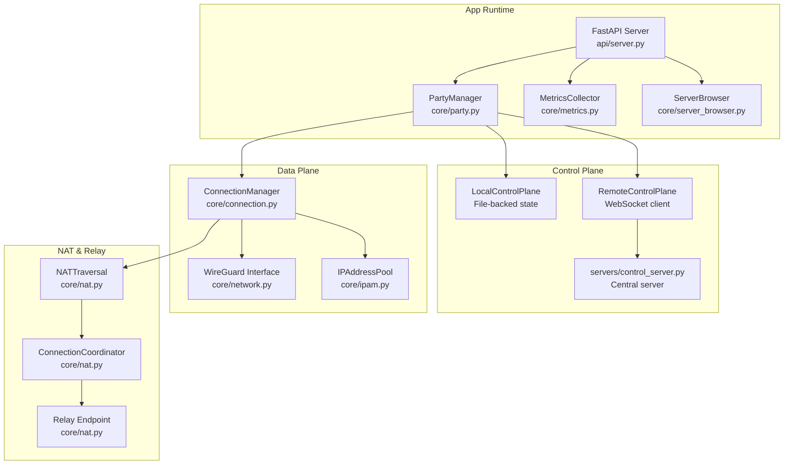

**Diagram sources**
- [core/party.py](file://core/party.py#L102-L158)
- [core/control.py](file://core/control.py#L187-L880)
- [core/connection.py](file://core/connection.py#L18-L125)
- [core/network.py](file://core/network.py#L25-L160)
- [core/nat.py](file://core/nat.py#L41-L398)
- [core/ipam.py](file://core/ipam.py#L10-L98)
- [core/metrics.py](file://core/metrics.py#L193-L235)
- [core/server_browser.py](file://core/server_browser.py#L75-L100)
- [api/server.py](file://api/server.py#L680-L701)
- [servers/control_server.py](file://servers/control_server.py)
- [servers/relay_server.py](file://servers/relay_server.py)

## Detailed Component Analysis

### Control Plane: Peer Discovery and Key Exchange
- Local-only control plane persists state to disk and supports local discovery via a shared file. It tracks parties, peers, and heartbeats, with periodic cleanup of stale entries.
- Remote control plane connects to a central server via WebSocket, falling back to local mode on failure. It handles registration, joining, and signaling messages.
- The control plane coordinates peer identity, NAT metadata, and endpoint information used by the connection manager.

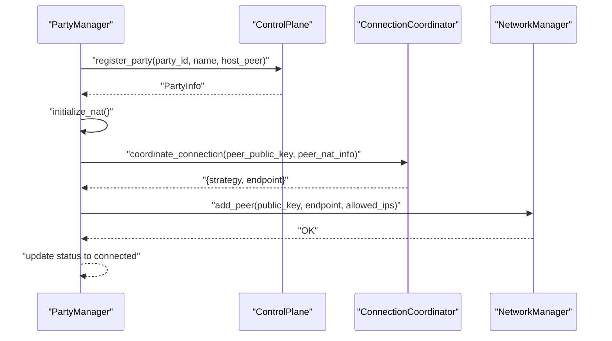

**Diagram sources**
- [core/party.py](file://core/party.py#L144-L196)
- [core/control.py](file://core/control.py#L228-L267)
- [core/connection.py](file://core/connection.py#L38-L125)
- [core/network.py](file://core/network.py#L392-L420)

**Section sources**
- [core/control.py](file://core/control.py#L187-L456)
- [core/party.py](file://core/party.py#L144-L196)

### Data Plane: WireGuard Tunnels and Mesh Networking
- NetworkManager manages WireGuard interface creation, key generation, and peer configuration. It supports Windows and Linux with platform-specific steps and ensures proper permissions and MTU.
- ConnectionManager orchestrates adding/removing peers, assigning virtual IPs, and monitoring connection health. It triggers reconnection attempts and can switch relays dynamically.

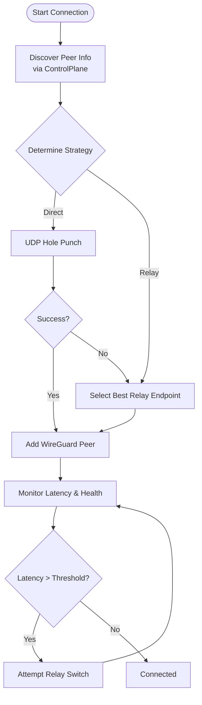

**Diagram sources**
- [core/connection.py](file://core/connection.py#L38-L125)
- [core/nat.py](file://core/nat.py#L337-L398)
- [core/network.py](file://core/network.py#L392-L420)

**Section sources**
- [core/network.py](file://core/network.py#L25-L160)
- [core/connection.py](file://core/connection.py#L18-L125)

### Relay Node Infrastructure
- Relay selection considers control plane-provided relays, configured defaults, and latency measurements. The coordinator measures latency to candidate relays and selects the best endpoint.
- The relay server implementation is provided in the servers package for deployment.

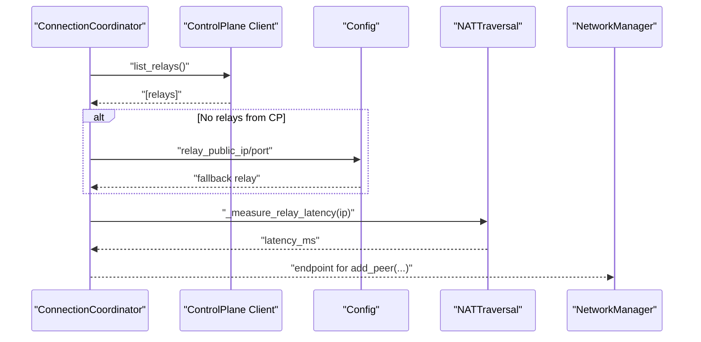

**Diagram sources**
- [core/nat.py](file://core/nat.py#L379-L455)
- [core/connection.py](file://core/connection.py#L334-L437)

**Section sources**
- [core/nat.py](file://core/nat.py#L379-L455)
- [servers/relay_server.py](file://servers/relay_server.py)

### Mesh Networking and NAT Traversal
- NATTraversal detects NAT type using STUN and determines whether direct P2P is possible. It performs UDP hole punching and falls back to relay when needed.
- ConnectionCoordinator chooses the optimal strategy and coordinates relay discovery and selection.

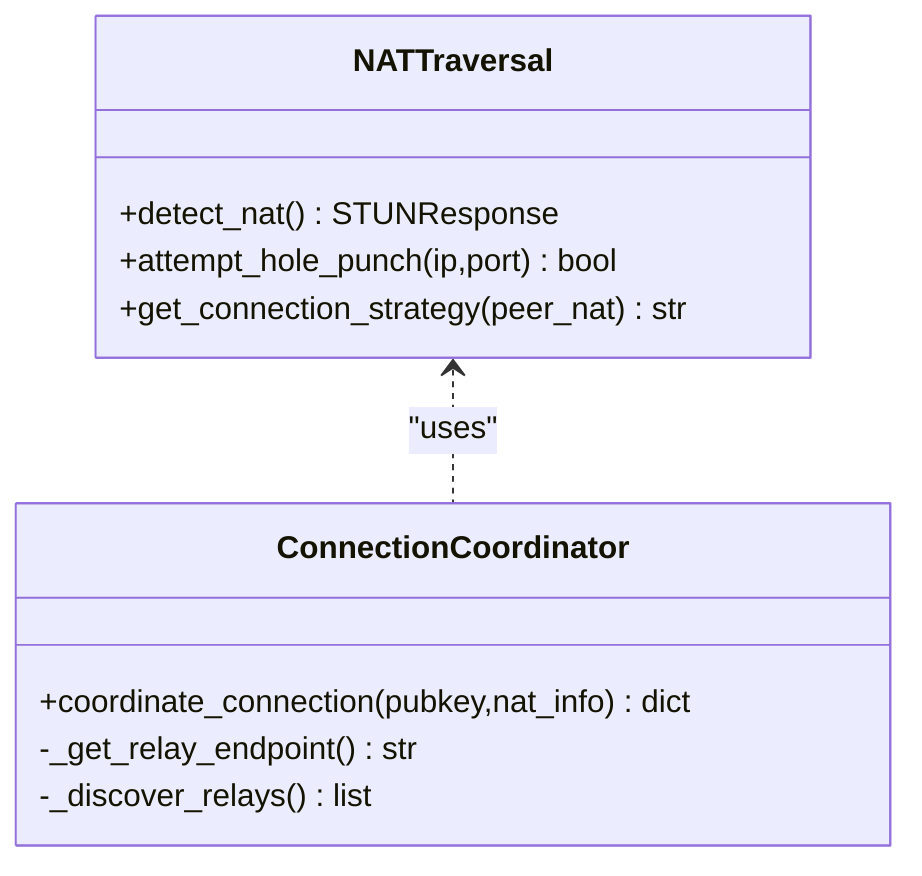

**Diagram sources**
- [core/nat.py](file://core/nat.py#L41-L398)

**Section sources**
- [core/nat.py](file://core/nat.py#L41-L398)

### IP Address Management
- IPAddressPool allocates virtual IPs from a base subnet, expanding across subnets as needed. It maintains allocation tables and validates integrity.

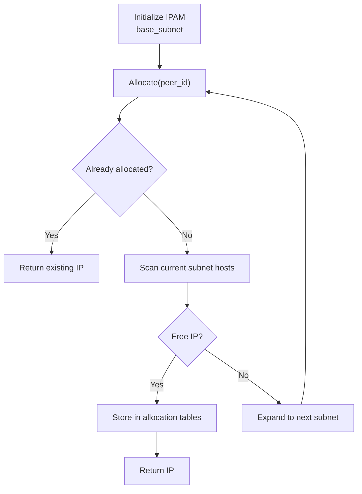

**Diagram sources**
- [core/ipam.py](file://core/ipam.py#L55-L98)

**Section sources**
- [core/ipam.py](file://core/ipam.py#L10-L183)

### Metrics and Monitoring
- MetricsCollector continuously gathers CPU, memory, and network throughput deltas. It records peer latency, computes jitter, predicts connection quality, and aggregates statistics for trending.

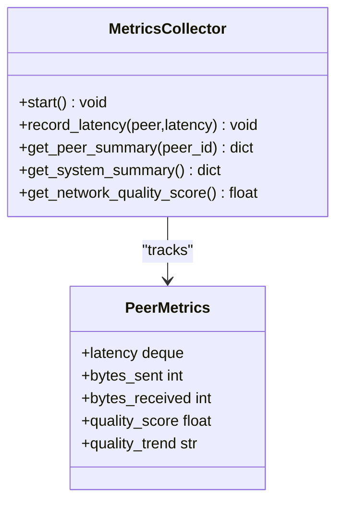

**Diagram sources**
- [core/metrics.py](file://core/metrics.py#L193-L235)
- [core/metrics.py](file://core/metrics.py#L24-L44)

**Section sources**
- [core/metrics.py](file://core/metrics.py#L193-L705)

### Server Browser and Game Sessions
- ServerBrowser registers, discovers, and measures latency to game servers. It maintains favorites, adapts measurement intervals, and cleans up expired servers.
- MetricsCollector tracks game sessions with latency statistics and quality trends.

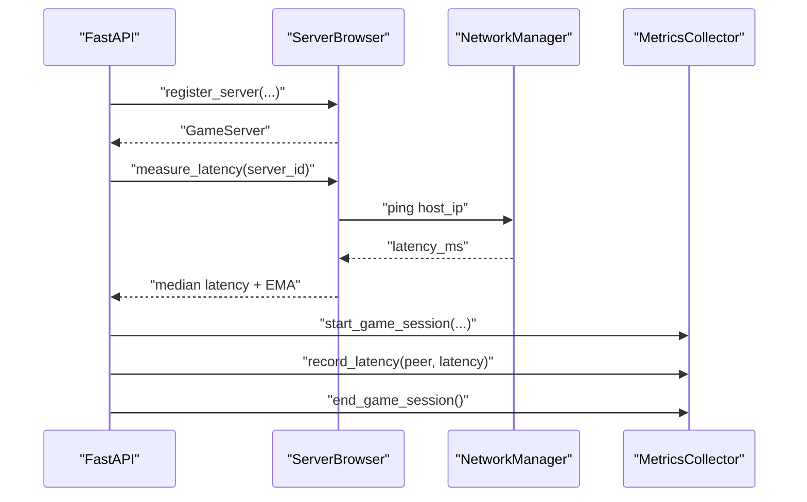

**Diagram sources**
- [core/server_browser.py](file://core/server_browser.py#L101-L167)
- [core/server_browser.py](file://core/server_browser.py#L334-L397)
- [core/metrics.py](file://core/metrics.py#L392-L441)

**Section sources**
- [core/server_browser.py](file://core/server_browser.py#L75-L552)
- [core/metrics.py](file://core/metrics.py#L193-L705)

### API Layer and Startup Flow
- The API server exposes endpoints for party management, metrics, Discord integration, server browser, and settings. It mounts static assets and enables CORS for local UI.
- The main entry point initializes settings, loads configuration, sets up network, NAT, control plane, metrics, Discord integration, and starts the API server with graceful shutdown handling.

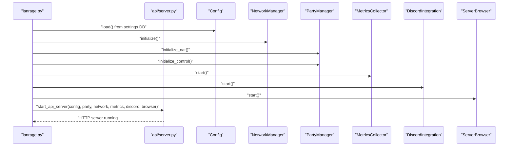

**Diagram sources**
- [lanrage.py](file://lanrage.py#L40-L170)
- [api/server.py](file://api/server.py#L680-L701)
- [core/config.py](file://core/config.py#L49-L114)
- [core/network.py](file://core/network.py#L70-L94)
- [core/party.py](file://core/party.py#L121-L158)
- [core/metrics.py](file://core/metrics.py#L216-L235)

**Section sources**
- [api/server.py](file://api/server.py#L1-L701)
- [lanrage.py](file://lanrage.py#L1-L230)

## Dependency Analysis
- Cohesion: Each module encapsulates a distinct responsibility (configuration, networking, control, metrics, browser).
- Coupling: Core modules depend on configuration and logging abstractions; ConnectionManager depends on NetworkManager, NATTraversal, and ControlPlane; PartyManager depends on ControlPlane and ConnectionManager.
- External Dependencies: FastAPI/Uvicorn for API, SQLite/aiosqlite for settings persistence, psutil for system metrics, cryptography for key generation, and optional websockets for remote control.

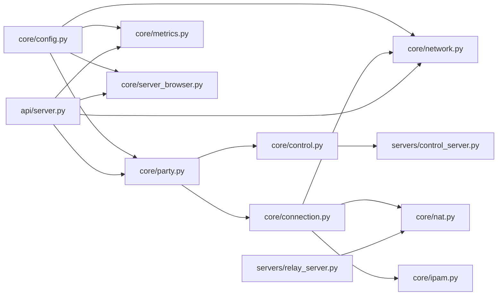

**Diagram sources**
- [core/config.py](file://core/config.py#L17-L114)
- [core/party.py](file://core/party.py#L102-L158)
- [core/connection.py](file://core/connection.py#L18-L37)
- [core/network.py](file://core/network.py#L25-L38)
- [core/nat.py](file://core/nat.py#L41-L63)
- [core/ipam.py](file://core/ipam.py#L10-L29)
- [core/metrics.py](file://core/metrics.py#L193-L214)
- [core/server_browser.py](file://core/server_browser.py#L75-L84)
- [api/server.py](file://api/server.py#L680-L701)
- [servers/control_server.py](file://servers/control_server.py)
- [servers/relay_server.py](file://servers/relay_server.py)

**Section sources**
- [core/party.py](file://core/party.py#L102-L158)
- [core/connection.py](file://core/connection.py#L18-L37)
- [api/server.py](file://api/server.py#L680-L701)

## Performance Considerations
- Direct P2P prioritization reduces latency by avoiding extra hops. NAT traversal uses STUN and UDP hole punching to maximize direct connectivity.
- Relay switching proactively switches to lower-latency relays when degradation is detected, minimizing impact on gameplay.
- Metrics-driven quality scoring helps identify underperforming links and guides adaptive behavior.
- IPAM efficiently allocates virtual IPs from a large subnet to support many peers without fragmentation.
- Asynchronous I/O and batched persistence reduce overhead and improve responsiveness.

[No sources needed since this section provides general guidance]

## Troubleshooting Guide
- Network initialization failures: Ensure WireGuard is installed, running with sufficient privileges, and no conflicting interfaces exist. Check logs and error messages for specific causes.
- Control plane connectivity: Local mode is available if remote control server is unreachable; verify configuration and network access.
- NAT detection issues: Multiple STUN servers are tried; failures indicate restrictive network environments requiring relay fallback.
- Metrics collection: If metrics are missing, confirm the metrics collector is started and running; check system resource availability.

**Section sources**
- [core/network.py](file://core/network.py#L70-L122)
- [core/control.py](file://core/control.py#L558-L622)
- [core/nat.py](file://core/nat.py#L64-L106)
- [core/metrics.py](file://core/metrics.py#L216-L235)

## Conclusion
LANrage delivers a robust, modular architecture for mesh gaming networks. Its control plane enables peer discovery and signaling, the data plane leverages WireGuard for secure and efficient tunnels, and NAT traversal plus relay infrastructure ensures connectivity across diverse network environments. The API layer, metrics, and server browser round out a production-ready system optimized for low latency and ease of use.

[No sources needed since this section summarizes without analyzing specific files]

## Appendices

### System Boundaries and Integration Points
- Control Plane: Local file-based and remote WebSocket-based modes; integrates with a central control server for production deployments.
- Data Plane: WireGuard interface management with platform-specific provisioning and peer configuration.
- Relay Infrastructure: Stateless relay endpoints discovered via control plane or configured defaults.
- API Layer: REST endpoints for UI and external integrations, serving static assets and CORS-enabled access.
- Settings Database: Persistent configuration and preferences stored in SQLite with async operations.

**Section sources**
- [core/control.py](file://core/control.py#L458-L880)
- [core/network.py](file://core/network.py#L161-L340)
- [core/nat.py](file://core/nat.py#L379-L455)
- [api/server.py](file://api/server.py#L18-L30)
- [core/settings.py](file://core/settings.py#L36-L96)

### Technology Stack Choices
- Python with asyncio for asynchronous networking and I/O.
- FastAPI/Uvicorn for the API server and Web UI.
- SQLite/aiosqlite for lightweight, embedded persistence.
- WireGuard for secure, high-performance VPN transport.
- psutil for system metrics.
- cryptography for key generation and serialization.

**Section sources**
- [api/server.py](file://api/server.py#L1-L16)
- [core/metrics.py](file://core/metrics.py#L1-L12)
- [core/network.py](file://core/network.py#L10-L14)
- [core/settings.py](file://core/settings.py#L13-L15)

### Architectural Patterns Used
- Factory pattern: Control plane creation via factory functions/selectors for local vs remote implementations.
- Observer pattern: MetricsCollector observes system and peer events to update quality and trends.
- Strategy pattern: ConnectionCoordinator selects between direct P2P and relay strategies based on NAT compatibility.
- Singleton pattern: Global settings database instance managed via a module-level accessor.

**Section sources**
- [core/control.py](file://core/control.py#L187-L218)
- [core/metrics.py](file://core/metrics.py#L216-L235)
- [core/connection.py](file://core/connection.py#L337-L369)
- [core/settings.py](file://core/settings.py#L466-L473)

### Scalability Considerations
- Horizontal scaling: Deploy multiple relay servers and use control plane discovery to distribute load.
- Vertical scaling: Tune keepalive and MTU, and leverage metrics to identify bottlenecks.
- Deployment topology: Client nodes, relay nodes, and central control server can be deployed independently; clients can operate in local-only mode for isolated testing.

**Section sources**
- [core/nat.py](file://core/nat.py#L379-L455)
- [core/control.py](file://core/control.py#L541-L622)
- [servers/relay_server.py](file://servers/relay_server.py)