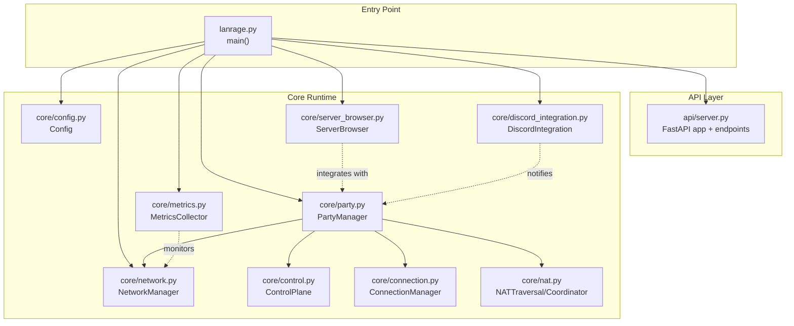
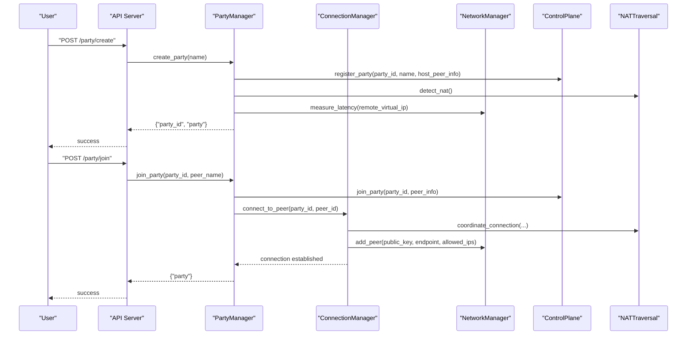
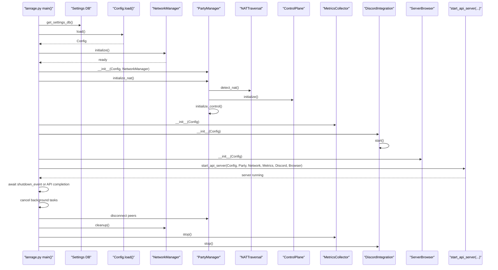
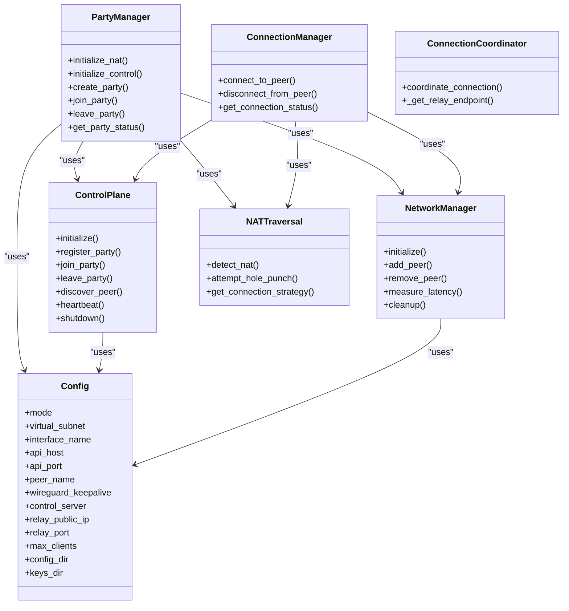
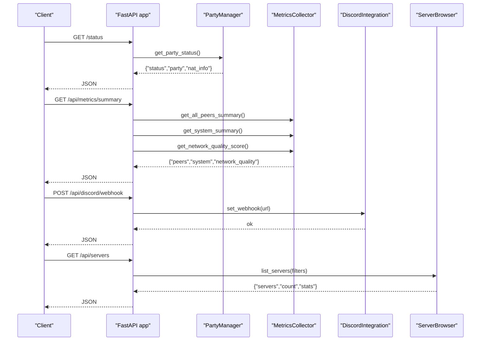
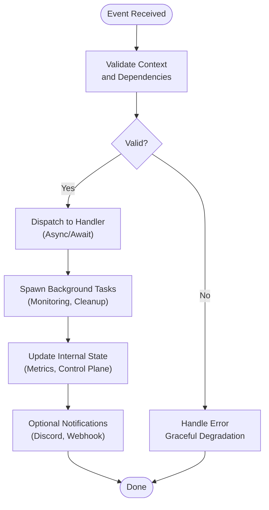
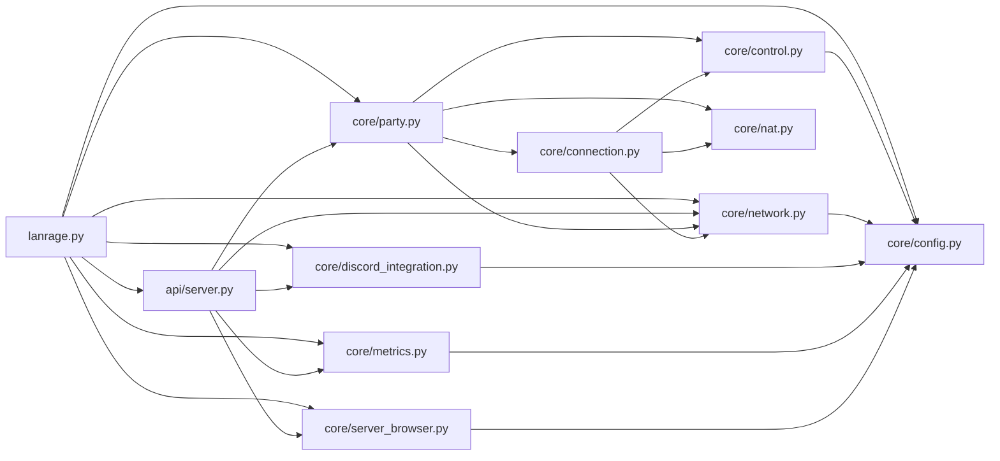
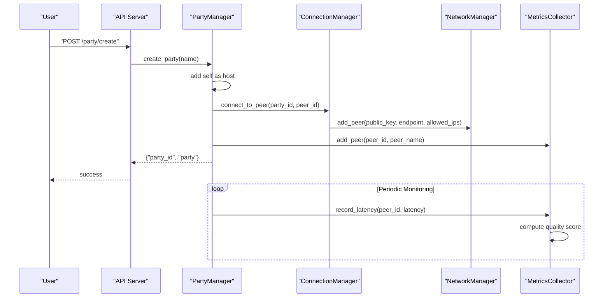

# Component Interactions

<cite>
**Referenced Files in This Document**
- [lanrage.py](file://lanrage.py)
- [server.py](file://api/server.py)
- [party.py](file://core/party.py)
- [network.py](file://core/network.py)
- [config.py](file://core/config.py)
- [control.py](file://core/control.py)
- [connection.py](file://core/connection.py)
- [nat.py](file://core/nat.py)
- [server_browser.py](file://core/server_browser.py)
- [metrics.py](file://core/metrics.py)
- [discord_integration.py](file://core/discord_integration.py)
</cite>

## Table of Contents
1. [Introduction](#introduction)
2. [Project Structure](#project-structure)
3. [Core Components](#core-components)
4. [Architecture Overview](#architecture-overview)
5. [Detailed Component Analysis](#detailed-component-analysis)
6. [Dependency Analysis](#dependency-analysis)
7. [Performance Considerations](#performance-considerations)
8. [Troubleshooting Guide](#troubleshooting-guide)
9. [Conclusion](#conclusion)
10. [Appendices](#appendices)

## Introduction
This document explains LANrage’s component interaction patterns and data flow architecture. It covers the startup sequence from the main entry point through configuration loading to network initialization, the orchestration among PartyManager, NetworkManager, and Config during runtime, the API server integration with business logic components, and real-time update propagation. It also documents the event-driven architecture using async/await patterns, WebSocket connections for real-time updates, dependency injection patterns, component lifecycle management, error handling strategies, graceful degradation, component isolation, and the plugin architecture and extension points for future enhancements.

## Project Structure
LANrage is organized around a main entry point that initializes core subsystems, an API server that exposes endpoints for UI and integrations, and modular components for networking, party orchestration, NAT traversal, metrics, and Discord integration. The configuration is database-backed and drives runtime behavior.

**Diagram sources**
- [lanrage.py](file://lanrage.py#L40-L230)
- [server.py](file://api/server.py#L1-L701)
- [party.py](file://core/party.py#L102-L304)
- [network.py](file://core/network.py#L25-L515)
- [config.py](file://core/config.py#L17-L114)
- [control.py](file://core/control.py#L187-L880)
- [connection.py](file://core/connection.py#L18-L493)
- [nat.py](file://core/nat.py#L41-L525)
- [server_browser.py](file://core/server_browser.py#L75-L552)
- [metrics.py](file://core/metrics.py#L193-L705)
- [discord_integration.py](file://core/discord_integration.py#L81-L633)

**Section sources**
- [lanrage.py](file://lanrage.py#L40-L230)
- [server.py](file://api/server.py#L1-L701)

## Core Components
- Config: Loads runtime configuration from the settings database and provides typed configuration for all subsystems.
- NetworkManager: Manages WireGuard interface creation, key handling, peer addition/removal, and latency measurement.
- PartyManager: Orchestrates party lifecycle, NAT detection, control plane registration/joining, and peer connectivity coordination.
- ControlPlane: Local or remote control plane for peer discovery, signaling, and state persistence.
- ConnectionManager: Coordinates NAT-aware connection strategies, manages peer connections, and monitors health.
- NATTraversal/Coordinator: Performs STUN-based NAT detection, UDP hole punching, and relay selection.
- ServerBrowser: Registers, discovers, and browses game servers; tracks latency and trends.
- MetricsCollector: Gathers system and peer metrics, computes quality scores, and exposes summaries.
- DiscordIntegration: Sends webhook notifications, manages Rich Presence, and bot messaging.

**Section sources**
- [config.py](file://core/config.py#L17-L114)
- [network.py](file://core/network.py#L25-L515)
- [party.py](file://core/party.py#L102-L304)
- [control.py](file://core/control.py#L187-L880)
- [connection.py](file://core/connection.py#L18-L493)
- [nat.py](file://core/nat.py#L41-L525)
- [server_browser.py](file://core/server_browser.py#L75-L552)
- [metrics.py](file://core/metrics.py#L193-L705)
- [discord_integration.py](file://core/discord_integration.py#L81-L633)

## Architecture Overview
LANrage follows an event-driven, asynchronous architecture with clear separation of concerns:
- Entry point initializes components, starts the API server, and coordinates shutdown.
- API server depends on injected runtime components (PartyManager, NetworkManager, MetricsCollector, DiscordIntegration, ServerBrowser).
- PartyManager orchestrates NAT detection, control plane integration, and peer connections.
- ConnectionManager encapsulates NAT-aware strategies and maintains peer connections.
- MetricsCollector and ServerBrowser operate independently, emitting summaries consumed by the API.
- DiscordIntegration is optional and isolated; it batches notifications and supports multiple transport modes.

**Diagram sources**
- [server.py](file://api/server.py#L155-L176)
- [party.py](file://core/party.py#L159-L247)
- [connection.py](file://core/connection.py#L38-L125)
- [nat.py](file://core/nat.py#L337-L369)
- [network.py](file://core/network.py#L392-L420)

**Section sources**
- [server.py](file://api/server.py#L155-L176)
- [party.py](file://core/party.py#L159-L247)
- [connection.py](file://core/connection.py#L38-L125)
- [nat.py](file://core/nat.py#L337-L369)
- [network.py](file://core/network.py#L392-L420)

## Detailed Component Analysis

### Startup Sequence and Lifecycle
The startup sequence initializes settings, loads configuration, sets up networking, party orchestration, NAT traversal, control plane, metrics, Discord integration, and finally starts the API server. Graceful shutdown cancels background tasks, disconnects peers, cleans up network, stops metrics, and performs Discord cleanup.

**Diagram sources**
- [lanrage.py](file://lanrage.py#L40-L230)
- [config.py](file://core/config.py#L49-L114)
- [network.py](file://core/network.py#L70-L94)
- [party.py](file://core/party.py#L121-L158)
- [control.py](file://core/control.py#L209-L227)
- [metrics.py](file://core/metrics.py#L216-L246)
- [discord_integration.py](file://core/discord_integration.py#L104-L133)
- [server.py](file://api/server.py#L680-L701)

**Section sources**
- [lanrage.py](file://lanrage.py#L40-L230)
- [config.py](file://core/config.py#L49-L114)
- [network.py](file://core/network.py#L70-L94)
- [party.py](file://core/party.py#L121-L158)
- [control.py](file://core/control.py#L209-L227)
- [metrics.py](file://core/metrics.py#L216-L246)
- [discord_integration.py](file://core/discord_integration.py#L104-L133)
- [server.py](file://api/server.py#L680-L701)

### Orchestration Patterns: PartyManager, NetworkManager, Config
- Dependency Injection: PartyManager receives Config and NetworkManager in __init__; NetworkManager receives Config; ControlPlane receives Config; ConnectionManager composes NetworkManager, NATTraversal, and ControlPlane.
- Lifecycle Management: PartyManager initializes NAT and control plane, then creates or joins parties. NetworkManager handles interface lifecycle and peer management. ControlPlane persists state and coordinates discovery/signaling.
- Isolation: Each component focuses on a bounded responsibility; cross-component communication occurs via explicit method calls and data models.

**Diagram sources**
- [party.py](file://core/party.py#L102-L158)
- [network.py](file://core/network.py#L25-L94)
- [control.py](file://core/control.py#L187-L227)
- [connection.py](file://core/connection.py#L18-L37)
- [nat.py](file://core/nat.py#L41-L63)

**Section sources**
- [party.py](file://core/party.py#L102-L158)
- [network.py](file://core/network.py#L25-L94)
- [control.py](file://core/control.py#L187-L227)
- [connection.py](file://core/connection.py#L18-L37)
- [nat.py](file://core/nat.py#L41-L63)

### API Server Integration and Real-Time Updates
- Dependency Injection: The API server accepts PartyManager, NetworkManager, MetricsCollector, DiscordIntegration, and ServerBrowser as arguments to start_api_server, enabling decoupled operation and testability.
- Endpoints integrate business logic:
  - Party endpoints call PartyManager methods.
  - Metrics endpoints call MetricsCollector methods.
  - Discord endpoints call DiscordIntegration methods.
  - Server browser endpoints call ServerBrowser methods.
- Real-time updates: The API server does not implement WebSocket endpoints itself; however, the control plane supports remote WebSocket connections (RemoteControlPlane) for signaling and notifications. The API server can be extended to expose WebSocket endpoints for real-time updates if needed.

**Diagram sources**
- [server.py](file://api/server.py#L146-L276)
- [server.py](file://api/server.py#L278-L359)
- [server.py](file://api/server.py#L361-L560)
- [party.py](file://core/party.py#L279-L304)
- [metrics.py](file://core/metrics.py#L442-L486)
- [discord_integration.py](file://core/discord_integration.py#L306-L346)
- [server_browser.py](file://core/server_browser.py#L226-L284)

**Section sources**
- [server.py](file://api/server.py#L146-L276)
- [server.py](file://api/server.py#L278-L359)
- [server.py](file://api/server.py#L361-L560)
- [party.py](file://core/party.py#L279-L304)
- [metrics.py](file://core/metrics.py#L442-L486)
- [discord_integration.py](file://core/discord_integration.py#L306-L346)
- [server_browser.py](file://core/server_browser.py#L226-L284)

### Event-Driven Architecture and Concurrency
- Async/Await: All major operations are async, including network commands, metrics collection loops, Discord notifications, and NAT traversal.
- Background Tasks: PartyManager schedules connection monitoring and cleanup tasks; MetricsCollector runs a periodic collection loop; DiscordIntegration batches notifications and flushes periodically.
- Graceful Degradation: If NAT detection fails, the system falls back to relay-only mode. If control server is unavailable, RemoteControlPlane falls back to local mode. Network initialization failures are surfaced with actionable guidance.

[No sources needed since this diagram shows conceptual workflow, not actual code structure]

**Section sources**
- [connection.py](file://core/connection.py#L213-L333)
- [metrics.py](file://core/metrics.py#L241-L246)
- [discord_integration.py](file://core/discord_integration.py#L179-L187)
- [control.py](file://core/control.py#L558-L622)

### Plugin Architecture and Extension Points
- Control Plane Abstraction: LocalControlPlane and RemoteControlPlane share the same interface, enabling easy swapping or extension to new control mechanisms.
- NAT Strategies: ConnectionCoordinator encapsulates NAT-aware strategies; adding new strategies is localized.
- Metrics Extensibility: MetricsCollector exposes methods to add/remove peers and record metrics; extending with new metrics is straightforward.
- Discord Integration: Optional; can be disabled or swapped with alternative notification systems without affecting core logic.
- API Surface: FastAPI endpoints are the primary extension surface for new features; components are injected via start_api_server.

**Section sources**
- [control.py](file://core/control.py#L458-L539)
- [control.py](file://core/control.py#L541-L800)
- [nat.py](file://core/nat.py#L330-L369)
- [metrics.py](file://core/metrics.py#L294-L307)
- [discord_integration.py](file://core/discord_integration.py#L81-L133)
- [server.py](file://api/server.py#L680-L701)

## Dependency Analysis
The following diagram highlights key dependencies among components and their import relationships.

**Diagram sources**
- [lanrage.py](file://lanrage.py#L14-L22)
- [server.py](file://api/server.py#L11-L15)
- [party.py](file://core/party.py#L9-L14)
- [network.py](file://core/network.py#L13-L14)
- [control.py](file://core/control.py#L12-L14)
- [connection.py](file://core/connection.py#L6-L13)
- [nat.py](file://core/nat.py#L12-L14)
- [server_browser.py](file://core/server_browser.py#L9-L10)
- [metrics.py](file://core/metrics.py#L10-L11)
- [discord_integration.py](file://core/discord_integration.py#L12-L13)

**Section sources**
- [lanrage.py](file://lanrage.py#L14-L22)
- [server.py](file://api/server.py#L11-L15)
- [party.py](file://core/party.py#L9-L14)
- [network.py](file://core/network.py#L13-L14)
- [control.py](file://core/control.py#L12-L14)
- [connection.py](file://core/connection.py#L6-L13)
- [nat.py](file://core/nat.py#L12-L14)
- [server_browser.py](file://core/server_browser.py#L9-L10)
- [metrics.py](file://core/metrics.py#L10-L11)
- [discord_integration.py](file://core/discord_integration.py#L12-L13)

## Performance Considerations
- Asynchronous I/O: All I/O-bound operations (network commands, metrics collection, Discord HTTP calls) are performed asynchronously to maximize throughput.
- Batching and Deduplication: MetricsCollector uses fixed-size deques and aggregation windows to reduce memory footprint and data volume. DiscordNotificationBatcher reduces API calls by grouping events.
- Connection Monitoring: ConnectionManager monitors latency and automatically reconnects or switches relays to maintain quality.
- NAT Optimization: NATTraversal selects optimal strategies (direct vs relay) and measures relay latency to minimize overhead.
- Resource Cleanup: Graceful shutdown cancels tasks and cleans up resources to prevent leaks.

[No sources needed since this section provides general guidance]

## Troubleshooting Guide
- Network Initialization Failures:
  - Symptoms: WireGuard not found, permission errors, conflicting interfaces.
  - Actions: Ensure WireGuard is installed, run with appropriate privileges, resolve conflicting interfaces.
  - References: [network.py](file://core/network.py#L75-L94), [network.py](file://core/network.py#L236-L310)
- NAT Detection Failures:
  - Symptoms: NAT detection raises errors; fallback to relay-only mode.
  - Actions: Verify STUN servers reachable; check firewall/NAT restrictions.
  - References: [nat.py](file://core/nat.py#L64-L106), [nat.py](file://core/nat.py#L228-L243)
- Control Plane Connectivity:
  - Symptoms: Remote control server unreachable; falls back to local mode.
  - Actions: Install websockets dependency; verify URLs; retry connection.
  - References: [control.py](file://core/control.py#L558-L622), [control.py](file://core/control.py#L676-L698)
- API Server Errors:
  - Symptoms: Exceptions during startup or runtime.
  - Actions: Review logs; validate configuration; restart with proper settings.
  - References: [server.py](file://api/server.py#L680-L701), [lanrage.py](file://lanrage.py#L168-L170)
- Graceful Shutdown:
  - Symptoms: Hanging tasks or resource leaks.
  - Actions: Ensure background tasks are cancelled; disconnect peers; cleanup network and metrics.
  - References: [lanrage.py](file://lanrage.py#L171-L216)

**Section sources**
- [network.py](file://core/network.py#L75-L94)
- [network.py](file://core/network.py#L236-L310)
- [nat.py](file://core/nat.py#L64-L106)
- [nat.py](file://core/nat.py#L228-L243)
- [control.py](file://core/control.py#L558-L622)
- [control.py](file://core/control.py#L676-L698)
- [server.py](file://api/server.py#L680-L701)
- [lanrage.py](file://lanrage.py#L168-L216)

## Conclusion
LANrage’s architecture emphasizes modularity, async concurrency, and graceful degradation. The main entry point orchestrates initialization and shutdown, while the API server cleanly exposes business logic through injected components. PartyManager, NetworkManager, and ControlPlane collaborate closely to manage peer connectivity, NAT traversal, and signaling. Metrics, Discord integration, and server browsing provide observability and social features. The design supports extension via pluggable control planes, NAT strategies, and notification channels, enabling future enhancements without disrupting core functionality.

[No sources needed since this section summarizes without analyzing specific files]

## Appendices

### Typical Workflows: Party Creation and Active Gaming Sessions

**Diagram sources**
- [server.py](file://api/server.py#L155-L163)
- [party.py](file://core/party.py#L159-L197)
- [connection.py](file://core/connection.py#L38-L125)
- [network.py](file://core/network.py#L392-L420)
- [metrics.py](file://core/metrics.py#L294-L371)

**Section sources**
- [server.py](file://api/server.py#L155-L163)
- [party.py](file://core/party.py#L159-L197)
- [connection.py](file://core/connection.py#L38-L125)
- [network.py](file://core/network.py#L392-L420)
- [metrics.py](file://core/metrics.py#L294-L371)