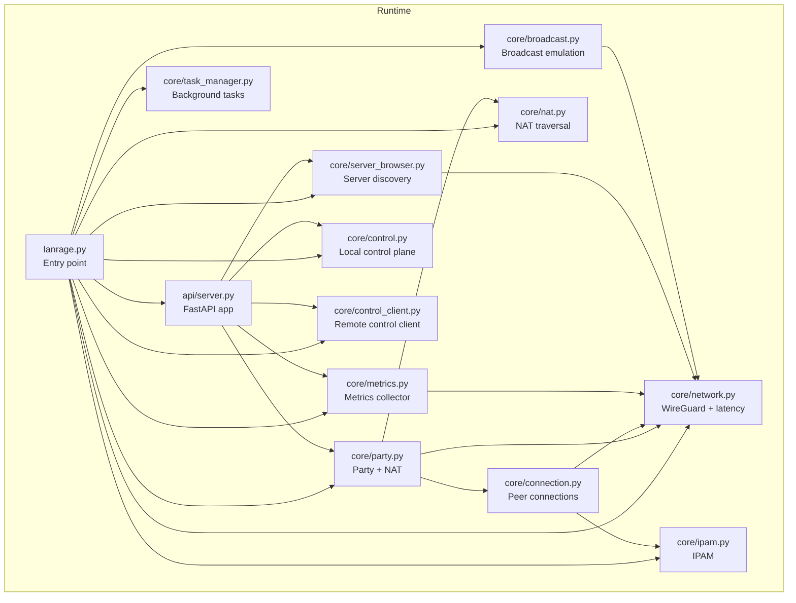
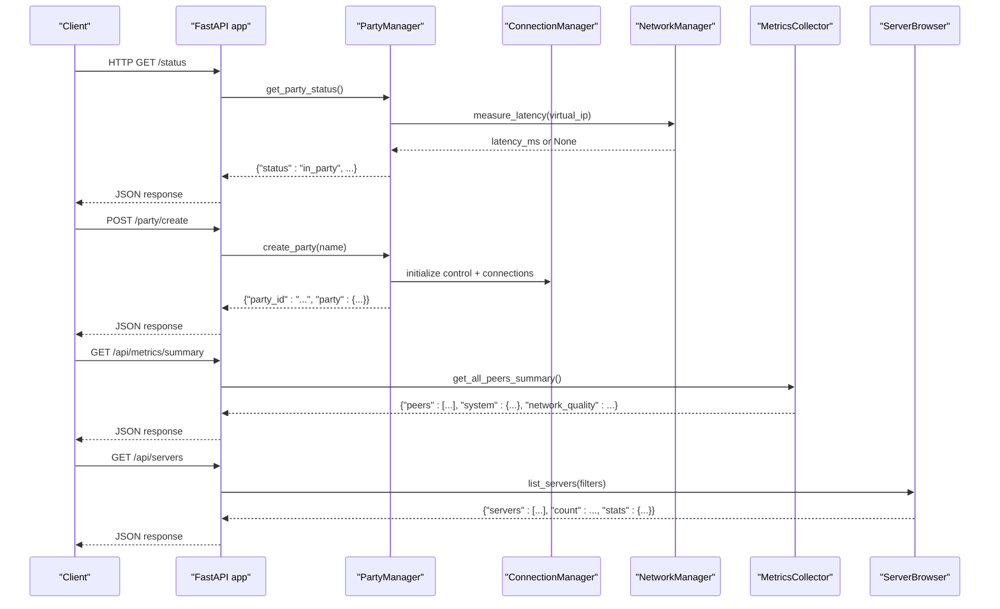
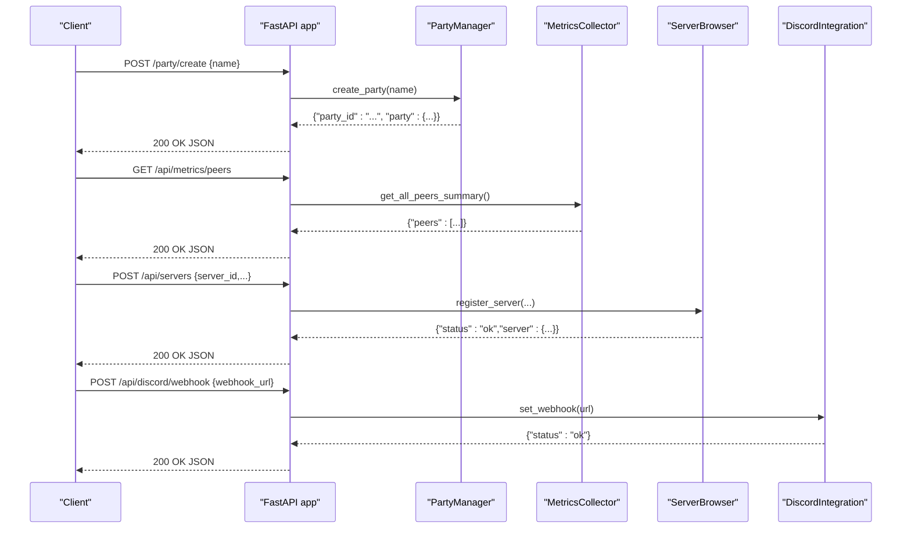
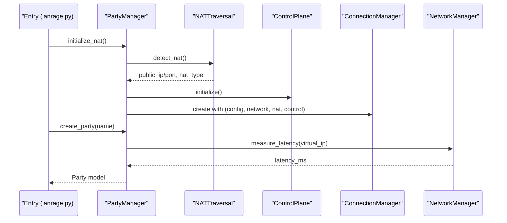
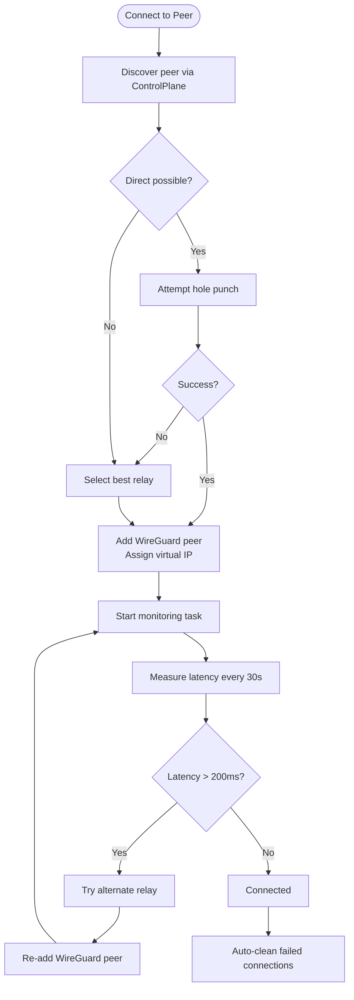
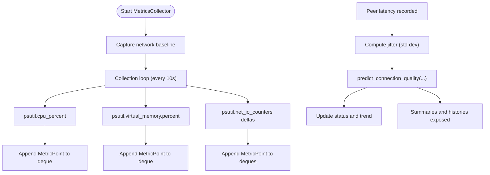
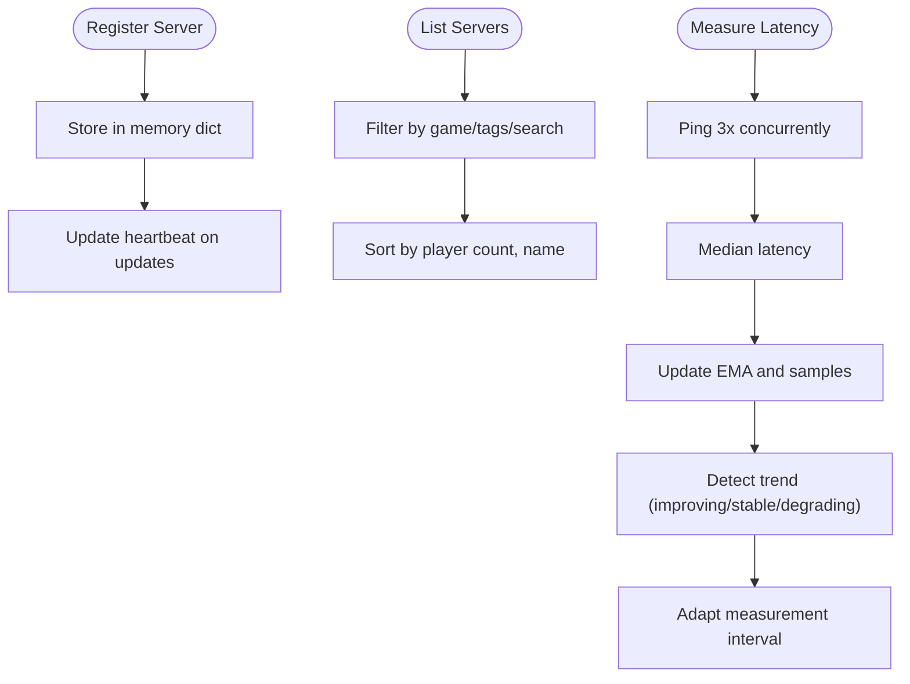
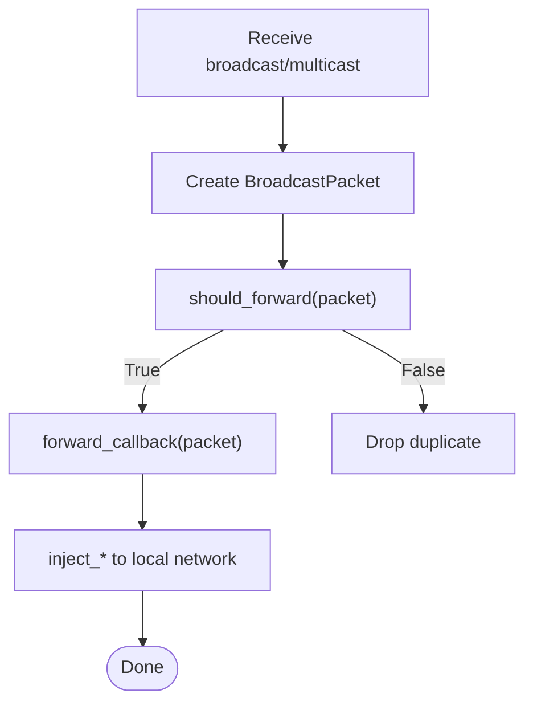
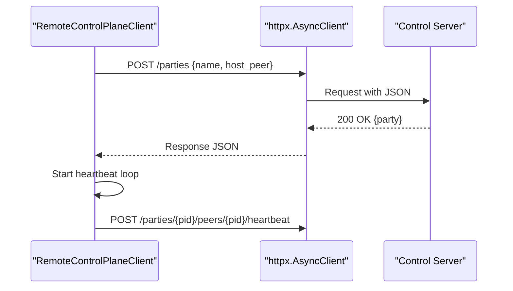
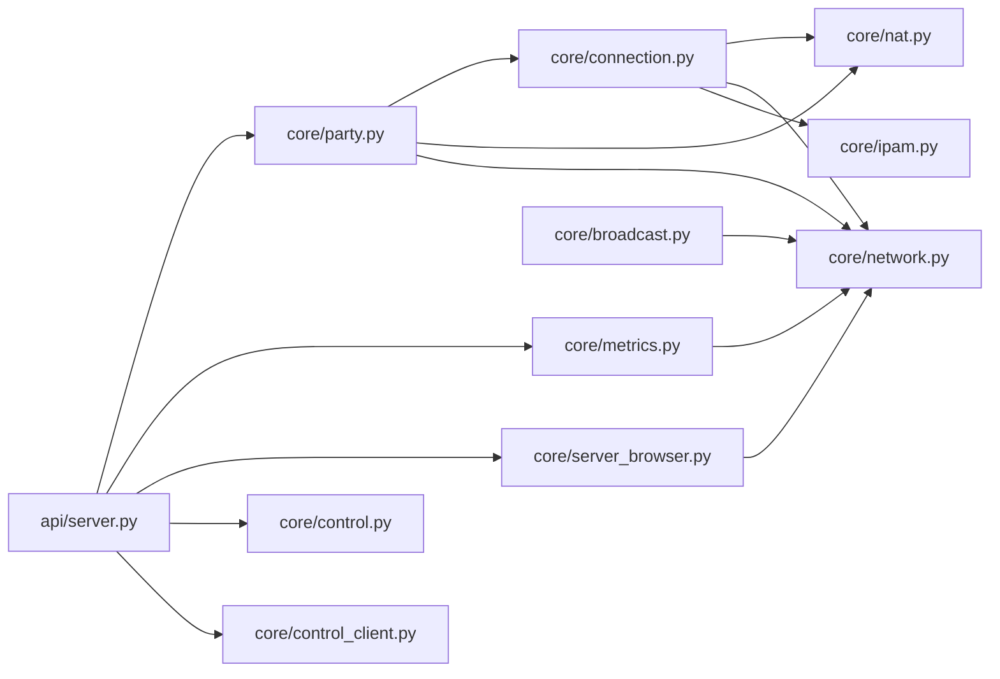

# Data Flow Patterns

<cite>
**Referenced Files in This Document**
- [lanrage.py](file://lanrage.py)
- [api/server.py](file://api/server.py)
- [core/party.py](file://core/party.py)
- [core/connection.py](file://core/connection.py)
- [core/network.py](file://core/network.py)
- [core/metrics.py](file://core/metrics.py)
- [core/server_browser.py](file://core/server_browser.py)
- [core/broadcast.py](file://core/broadcast.py)
- [core/nat.py](file://core/nat.py)
- [core/control.py](file://core/control.py)
- [core/control_client.py](file://core/control_client.py)
- [core/task_manager.py](file://core/task_manager.py)
- [core/ipam.py](file://core/ipam.py)
</cite>

## Table of Contents
1. [Introduction](#introduction)
2. [Project Structure](#project-structure)
3. [Core Components](#core-components)
4. [Architecture Overview](#architecture-overview)
5. [Detailed Component Analysis](#detailed-component-analysis)
6. [Dependency Analysis](#dependency-analysis)
7. [Performance Considerations](#performance-considerations)
8. [Troubleshooting Guide](#troubleshooting-guide)
9. [Conclusion](#conclusion)

## Introduction
This document explains LANrage’s data flow patterns and information exchange across components. It covers:
- Request-response patterns between the API server and business logic
- Real-time data propagation via asynchronous mechanisms
- Event-driven communication using asyncio tasks and callbacks
- Data transformation pipelines from raw network measurements to API responses
- Caching strategies, validation flows, and consistency guarantees
- Asynchronous processing patterns and backpressure handling

## Project Structure
LANrage is organized around a modular core with an API server fronting business logic components:
- Entry point initializes configuration, network, party management, metrics, Discord integration, and server browser
- API server exposes endpoints backed by business managers
- Business managers coordinate NAT traversal, peer connections, metrics collection, broadcast emulation, and server discovery
- Background task management ensures graceful shutdown and resource cleanup

**Diagram sources**
- [lanrage.py](file://lanrage.py#L140-L154)
- [api/server.py](file://api/server.py#L680-L701)
- [core/network.py](file://core/network.py#L25-L40)
- [core/party.py](file://core/party.py#L102-L120)
- [core/connection.py](file://core/connection.py#L18-L36)
- [core/metrics.py](file://core/metrics.py#L193-L214)
- [core/server_browser.py](file://core/server_browser.py#L75-L84)
- [core/broadcast.py](file://core/broadcast.py#L201-L228)
- [core/nat.py](file://core/nat.py#L41-L63)
- [core/control.py](file://core/control.py#L187-L207)
- [core/control_client.py](file://core/control_client.py#L23-L46)
- [core/task_manager.py](file://core/task_manager.py#L11-L25)
- [core/ipam.py](file://core/ipam.py#L10-L28)

**Section sources**
- [lanrage.py](file://lanrage.py#L40-L154)
- [api/server.py](file://api/server.py#L680-L701)

## Core Components
- API Server: FastAPI app exposing endpoints for party management, metrics, server browser, settings, and Discord integration. It delegates to managers and returns structured JSON responses.
- Party Manager: Orchestrates party lifecycle, NAT detection, control plane integration, and peer discovery.
- Connection Manager: Establishes and monitors peer connections, coordinates NAT traversal strategies, and manages WireGuard peers.
- Metrics Collector: Aggregates system and peer metrics, computes quality scores, and exposes summaries and histories.
- Server Browser: Registers, discovers, and tracks game servers with adaptive latency measurement and cleanup.
- Broadcast Emulation: Captures and forwards LAN broadcasts/multicasts with deduplication and injection into local network.
- NAT Traversal: Detects NAT type, performs STUN, attempts hole punching, and selects direct or relay strategies.
- Control Plane: Local or remote control plane for peer discovery, signaling, and state persistence.
- Task Manager: Centralized background task creation, tracking, and graceful cancellation.
- IPAM: Virtual IP allocation for peers within a controlled subnet.

**Section sources**
- [api/server.py](file://api/server.py#L107-L701)
- [core/party.py](file://core/party.py#L102-L304)
- [core/connection.py](file://core/connection.py#L18-L493)
- [core/metrics.py](file://core/metrics.py#L193-L705)
- [core/server_browser.py](file://core/server_browser.py#L75-L552)
- [core/broadcast.py](file://core/broadcast.py#L201-L646)
- [core/nat.py](file://core/nat.py#L41-L525)
- [core/control.py](file://core/control.py#L187-L456)
- [core/control_client.py](file://core/control_client.py#L23-L438)
- [core/task_manager.py](file://core/task_manager.py#L11-L167)
- [core/ipam.py](file://core/ipam.py#L10-L183)

## Architecture Overview
The runtime starts the API server and business managers, wiring them together so that HTTP requests trigger business logic, which in turn manipulates network state and emits metrics. Background tasks handle periodic operations, cleanup, and heartbeat maintenance.

**Diagram sources**
- [api/server.py](file://api/server.py#L146-L153)
- [api/server.py](file://api/server.py#L155-L162)
- [api/server.py](file://api/server.py#L191-L201)
- [api/server.py](file://api/server.py#L364-L391)
- [core/party.py](file://core/party.py#L279-L303)
- [core/network.py](file://core/network.py#L340-L391)
- [core/metrics.py](file://core/metrics.py#L478-L485)
- [core/server_browser.py](file://core/server_browser.py#L226-L284)

## Detailed Component Analysis

### API Server: Request-Response Patterns
- Health and UI endpoints serve status and static assets.
- Party endpoints create/join/leave parties and return structured data.
- Metrics endpoints aggregate peer/system metrics and histories.
- Server browser endpoints register/list servers, update heartbeats/player counts, and measure latency.
- Settings endpoints persist configuration updates and react to Discord setting changes.
- Discord integration endpoints configure webhooks, invites, and test notifications.

**Diagram sources**
- [api/server.py](file://api/server.py#L155-L162)
- [api/server.py](file://api/server.py#L204-L210)
- [api/server.py](file://api/server.py#L394-L424)
- [api/server.py](file://api/server.py#L281-L293)

**Section sources**
- [api/server.py](file://api/server.py#L107-L701)

### Party Management: Lifecycle and NAT Coordination
- Initializes NAT traversal and control plane, then creates or joins parties.
- Measures latency to peers via the network manager and computes NAT compatibility.
- Integrates with control plane for peer discovery and signaling.

**Diagram sources**
- [lanrage.py](file://lanrage.py#L108-L125)
- [core/party.py](file://core/party.py#L121-L158)
- [core/party.py](file://core/party.py#L198-L247)
- [core/party.py](file://core/party.py#L279-L303)
- [core/nat.py](file://core/nat.py#L64-L106)
- [core/network.py](file://core/network.py#L340-L391)

**Section sources**
- [core/party.py](file://core/party.py#L102-L304)
- [core/nat.py](file://core/nat.py#L41-L106)

### Connection Management: NAT Strategies and Monitoring
- Determines connection strategy (direct vs relay) based on NAT types.
- Attempts hole punching for direct connections; falls back to relay selection.
- Monitors connections, measures latency, and auto-reconnects or switches relays when needed.
- Allocates virtual IPs via IPAM and configures WireGuard peers.

**Diagram sources**
- [core/connection.py](file://core/connection.py#L39-L125)
- [core/connection.py](file://core/connection.py#L213-L305)
- [core/connection.py](file://core/connection.py#L334-L437)
- [core/nat.py](file://core/nat.py#L337-L369)
- [core/nat.py](file://core/nat.py#L379-L455)
- [core/ipam.py](file://core/ipam.py#L55-L97)

**Section sources**
- [core/connection.py](file://core/connection.py#L18-L493)
- [core/nat.py](file://core/nat.py#L330-L525)
- [core/ipam.py](file://core/ipam.py#L10-L183)

### Metrics Collection: Pipelines and Aggregation
- Periodically collects CPU/memory/network deltas and stores MetricPoints.
- Records peer latency, computes jitter, and predicts connection quality (0–100).
- Provides summaries, histories, and aggregated statistics for trending.

**Diagram sources**
- [core/metrics.py](file://core/metrics.py#L216-L246)
- [core/metrics.py](file://core/metrics.py#L248-L293)
- [core/metrics.py](file://core/metrics.py#L308-L371)
- [core/metrics.py](file://core/metrics.py#L519-L560)

**Section sources**
- [core/metrics.py](file://core/metrics.py#L193-L705)

### Server Browser: Discovery, Filtering, and Latency
- Registers servers with metadata and heartbeat timestamps.
- Filters and sorts servers by game, occupancy, tags, and search terms.
- Measures latency using multiple ping samples, EMA smoothing, and adaptive intervals.

**Diagram sources**
- [core/server_browser.py](file://core/server_browser.py#L101-L167)
- [core/server_browser.py](file://core/server_browser.py#L226-L284)
- [core/server_browser.py](file://core/server_browser.py#L334-L397)
- [core/server_browser.py](file://core/server_browser.py#L399-L473)

**Section sources**
- [core/server_browser.py](file://core/server_browser.py#L75-L552)

### Broadcast Emulation: Deduplication and Injection
- Captures LAN broadcasts/multicasts on common ports and groups.
- Prevents duplicate forwarding with time-windowed hashing and periodic cleanup.
- Forwards to peers and injects into local network to emulate LAN discovery.

**Diagram sources**
- [core/broadcast.py](file://core/broadcast.py#L338-L381)
- [core/broadcast.py](file://core/broadcast.py#L54-L96)
- [core/broadcast.py](file://core/broadcast.py#L632-L646)

**Section sources**
- [core/broadcast.py](file://core/broadcast.py#L18-L646)

### Control Plane: Local and Remote Coordination
- Local control plane persists state to disk with write-behind batching and periodic cleanup.
- Remote control client handles HTTP requests with retries, timeouts, and heartbeat loops.

**Diagram sources**
- [core/control_client.py](file://core/control_client.py#L191-L232)
- [core/control_client.py](file://core/control_client.py#L404-L425)

**Section sources**
- [core/control.py](file://core/control.py#L187-L456)
- [core/control_client.py](file://core/control_client.py#L23-L438)

### Data Transformation Pipelines
- From raw network measurements to API responses:
  - NetworkManager.ping returns latency or None; PartyManager converts to peer status.
  - ServerBrowser.ping executes multiple samples, computes median and EMA, then exposes filtered lists and stats.
  - MetricsCollector aggregates MetricPoints into summaries and histories.
- Validation flows:
  - API request validators enforce bounds and formats.
  - Control plane validates NAT types and serializes/deserializes state safely.
  - Broadcast deduplicator validates packet uniqueness via hashes.

**Section sources**
- [core/network.py](file://core/network.py#L340-L391)
- [core/party.py](file://core/party.py#L279-L303)
- [core/server_browser.py](file://core/server_browser.py#L334-L473)
- [core/metrics.py](file://core/metrics.py#L108-L175)
- [api/server.py](file://api/server.py#L60-L68)

### Caching, Validation, and Consistency
- State persistence with write-behind batching reduces disk I/O and consolidates rapid updates.
- Deduplication caches packet hashes with time-based cleanup to bound memory.
- Validation occurs at API boundaries and in control plane state transitions.
- Consistency across distributed components:
  - Heartbeat loops keep peers alive and detect staleness.
  - Relay selection chooses the best endpoint based on measured latency.
  - IPAM ensures deterministic, conflict-free virtual IP assignment.

**Section sources**
- [core/control.py](file://core/control.py#L19-L113)
- [core/broadcast.py](file://core/broadcast.py#L132-L159)
- [core/control_client.py](file://core/control_client.py#L404-L425)
- [core/nat.py](file://core/nat.py#L379-L455)
- [core/ipam.py](file://core/ipam.py#L55-L97)

### Asynchronous Processing and Backpressure
- Background tasks are created and tracked centrally; completion callbacks and graceful cancellation are supported.
- Periodic loops (metrics, server cleanup, heartbeat) run independently and are cancellable.
- Latency-sensitive operations (ping, STUN, hole punching) use timeouts and exponential backoff where applicable.
- Broadcast deduplication uses fire-and-forget cleanup tasks to avoid blocking packet handling.

**Section sources**
- [core/task_manager.py](file://core/task_manager.py#L11-L167)
- [core/metrics.py](file://core/metrics.py#L241-L246)
- [core/server_browser.py](file://core/server_browser.py#L510-L534)
- [core/broadcast.py](file://core/broadcast.py#L98-L109)
- [core/control_client.py](file://core/control_client.py#L128-L159)

## Dependency Analysis
Key dependencies and coupling:
- API server depends on managers (Party, Metrics, ServerBrowser, Discord) and passes them into the server runner.
- PartyManager depends on NetworkManager for latency and NATTraversal for connectivity strategies.
- ConnectionManager depends on NATTraversal, ControlPlane, and NetworkManager; uses IPAM for virtual IPs.
- MetricsCollector depends on psutil and NetworkManager for baseline deltas.
- ServerBrowser depends on NetworkManager for latency measurements.
- BroadcastEmulator depends on NetworkManager for socket operations and deduplication for packet integrity.
- ControlPlane persists state via StatePersister; RemoteControlPlaneClient depends on httpx for HTTP operations.

**Diagram sources**
- [api/server.py](file://api/server.py#L680-L701)
- [core/party.py](file://core/party.py#L102-L120)
- [core/connection.py](file://core/connection.py#L18-L36)
- [core/network.py](file://core/network.py#L25-L40)
- [core/metrics.py](file://core/metrics.py#L193-L214)
- [core/server_browser.py](file://core/server_browser.py#L75-L84)
- [core/broadcast.py](file://core/broadcast.py#L201-L228)
- [core/nat.py](file://core/nat.py#L41-L63)
- [core/control.py](file://core/control.py#L187-L207)
- [core/control_client.py](file://core/control_client.py#L23-L46)
- [core/ipam.py](file://core/ipam.py#L10-L28)

**Section sources**
- [api/server.py](file://api/server.py#L680-L701)
- [core/party.py](file://core/party.py#L102-L120)
- [core/connection.py](file://core/connection.py#L18-L36)
- [core/network.py](file://core/network.py#L25-L40)
- [core/metrics.py](file://core/metrics.py#L193-L214)
- [core/server_browser.py](file://core/server_browser.py#L75-L84)
- [core/broadcast.py](file://core/broadcast.py#L201-L228)
- [core/nat.py](file://core/nat.py#L41-L63)
- [core/control.py](file://core/control.py#L187-L207)
- [core/control_client.py](file://core/control_client.py#L23-L46)
- [core/ipam.py](file://core/ipam.py#L10-L28)

## Performance Considerations
- Asynchronous I/O: HTTP, ping, and STUN operations are non-blocking, enabling concurrency.
- Batching and aggregation: Metrics and control state use batching to reduce I/O and CPU overhead.
- Adaptive measurement intervals: ServerBrowser adjusts ping frequency based on latency stability.
- Time-windowed deduplication: Limits memory footprint and prevents network loops.
- Graceful shutdown: Centralized task cancellation and resource cleanup prevent leaks and abrupt termination.

[No sources needed since this section provides general guidance]

## Troubleshooting Guide
- API server startup and shutdown:
  - Entry point registers signal handlers and cancels tasks on shutdown; logs cleanup steps.
- Network initialization:
  - WireGuard checks and platform-specific interface creation; logs errors and raises explicit exceptions.
- Metrics collection:
  - Baseline establishment and periodic collection; warns on missing data or parsing errors.
- Server cleanup:
  - Background cleanup removes expired servers; logs errors without failing the loop.
- Broadcast deduplication:
  - Cleanup tasks remove expired hashes; logs errors and continues operation.
- Control plane persistence:
  - Batched writes with lock protection; logs serialization and disk errors.

**Section sources**
- [lanrage.py](file://lanrage.py#L170-L216)
- [core/network.py](file://core/network.py#L70-L94)
- [core/metrics.py](file://core/metrics.py#L216-L246)
- [core/server_browser.py](file://core/server_browser.py#L510-L534)
- [core/broadcast.py](file://core/broadcast.py#L132-L159)
- [core/control.py](file://core/control.py#L67-L113)

## Conclusion
LANrage’s architecture cleanly separates concerns across API, business logic, networking, and persistence. Asynchronous patterns, background task management, and targeted caching enable scalable, real-time operation. Validation and deduplication ensure data integrity, while adaptive strategies (latency-based intervals, relay selection) improve user experience. The design supports both local and remote control planes, enabling future scalability and distributed coordination.