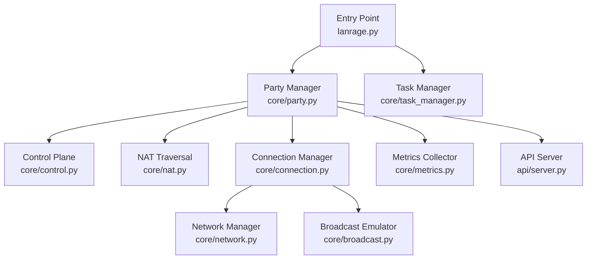
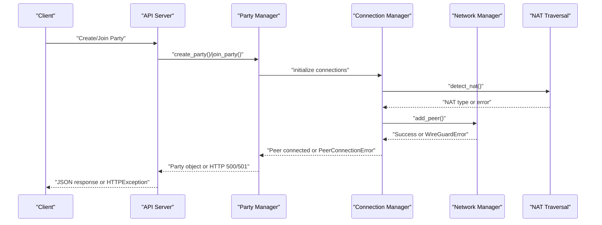
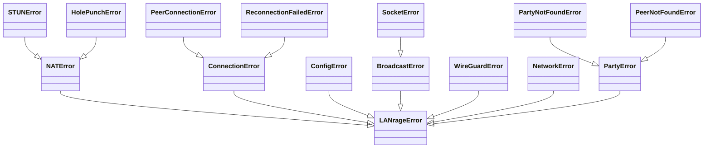
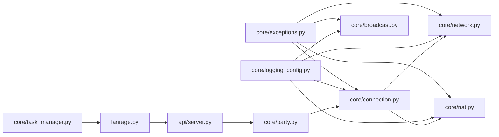

# Error Handling Strategies

<cite>
**Referenced Files in This Document**
- [lanrage.py](file://lanrage.py)
- [core/exceptions.py](file://core/exceptions.py)
- [core/logging_config.py](file://core/logging_config.py)
- [core/network.py](file://core/network.py)
- [core/connection.py](file://core/connection.py)
- [core/nat.py](file://core/nat.py)
- [core/broadcast.py](file://core/broadcast.py)
- [core/party.py](file://core/party.py)
- [core/task_manager.py](file://core/task_manager.py)
- [api/server.py](file://api/server.py)
- [docs/TROUBLESHOOTING.md](file://docs/TROUBLESHOOTING.md)
</cite>

## Table of Contents
1. [Introduction](#introduction)
2. [Project Structure](#project-structure)
3. [Core Components](#core-components)
4. [Architecture Overview](#architecture-overview)
5. [Detailed Component Analysis](#detailed-component-analysis)
6. [Dependency Analysis](#dependency-analysis)
7. [Performance Considerations](#performance-considerations)
8. [Troubleshooting Guide](#troubleshooting-guide)
9. [Conclusion](#conclusion)

## Introduction
This document details LANrage’s error handling strategies and fault tolerance mechanisms. It traces exception propagation from low-level network operations to high-level API responses, documents graceful degradation, retry and fallback procedures, logging and diagnostics, user-facing messaging, recovery steps, and system state restoration. It also outlines monitoring and alerting approaches for component health and performance.

## Project Structure
LANrage is organized around modular components:
- Entry point and lifecycle management
- Network and NAT traversal
- Connection orchestration and peer lifecycle
- Control plane and party management
- Broadcast emulation
- Metrics and diagnostics
- API server and user-facing endpoints
- Logging and structured context

**Diagram sources**
- [lanrage.py](file://lanrage.py#L40-L230)
- [core/party.py](file://core/party.py#L102-L304)
- [core/nat.py](file://core/nat.py#L41-L525)
- [core/connection.py](file://core/connection.py#L18-L493)
- [core/network.py](file://core/network.py#L25-L515)
- [core/broadcast.py](file://core/broadcast.py#L201-L646)
- [core/task_manager.py](file://core/task_manager.py#L11-L167)
- [api/server.py](file://api/server.py#L1-L701)

**Section sources**
- [lanrage.py](file://lanrage.py#L40-L230)
- [core/party.py](file://core/party.py#L102-L304)
- [core/connection.py](file://core/connection.py#L18-L493)
- [core/network.py](file://core/network.py#L25-L515)
- [core/nat.py](file://core/nat.py#L41-L525)
- [core/broadcast.py](file://core/broadcast.py#L201-L646)
- [core/task_manager.py](file://core/task_manager.py#L11-L167)
- [api/server.py](file://api/server.py#L1-L701)

## Core Components
- Exception taxonomy: A hierarchy of domain-specific exceptions enables precise error handling and user-facing messaging.
- Logging: Structured logging with context variables, performance timing, and dual JSON/plain formatters.
- Network: Robust WireGuard lifecycle management with graceful fallbacks and diagnostics.
- Connections: Automated reconnection, relay switching, and auto-cleanup for failed connections.
- NAT: STUN-based detection, hole punching, and relay fallback strategies.
- Broadcast: Deduplication and safe forwarding with error-tolerant listeners.
- Metrics: Continuous system and peer metrics with quality scoring and aggregation.
- API: HTTP exceptions surfaced to clients with clear status codes and messages.
- Lifecycle: Graceful shutdown with task cancellation, peer disconnection, and resource cleanup.

**Section sources**
- [core/exceptions.py](file://core/exceptions.py#L4-L96)
- [core/logging_config.py](file://core/logging_config.py#L26-L277)
- [core/network.py](file://core/network.py#L25-L515)
- [core/connection.py](file://core/connection.py#L18-L493)
- [core/nat.py](file://core/nat.py#L41-L525)
- [core/broadcast.py](file://core/broadcast.py#L29-L646)
- [core/task_manager.py](file://core/task_manager.py#L11-L167)
- [api/server.py](file://api/server.py#L107-L701)

## Architecture Overview
The error handling architecture follows a layered pattern:
- Low-level operations (network, sockets, STUN) raise domain exceptions or generic errors.
- Higher layers catch and translate errors into meaningful user-facing messages or HTTP responses.
- Structured logging captures context, timing, and exceptions for diagnostics.
- Graceful degradation switches to relay mode, reduces functionality, or continues with partial state.
- Monitoring and metrics inform health and guide remediation.

**Diagram sources**
- [api/server.py](file://api/server.py#L155-L186)
- [core/party.py](file://core/party.py#L159-L247)
- [core/connection.py](file://core/connection.py#L38-L125)
- [core/nat.py](file://core/nat.py#L64-L106)
- [core/network.py](file://core/network.py#L392-L420)

## Detailed Component Analysis

### Exception Taxonomy and Propagation
LANrage defines a clear exception hierarchy enabling precise error handling:
- Base LANrageError
- Specializations for NAT, STUN, Hole Punch, Connection, PeerConnection, ReconnectionFailed, Config, Broadcast, Socket, WireGuard, Network, Party, PartyNotFound, PeerNotFound

Propagation pattern:
- Low-level operations raise domain exceptions or generic errors.
- Mid-level components catch and translate to higher-level exceptions or HTTP exceptions.
- API layer converts exceptions to HTTP responses with appropriate status codes.

**Diagram sources**
- [core/exceptions.py](file://core/exceptions.py#L4-L96)

**Section sources**
- [core/exceptions.py](file://core/exceptions.py#L4-L96)
- [core/connection.py](file://core/connection.py#L53-L82)
- [core/network.py](file://core/network.py#L78-L93)
- [core/broadcast.py](file://core/broadcast.py#L253-L258)

### Logging, Context, and Timing
Structured logging provides:
- Context variables (peer_id, party_id, session_id, correlation_id) for cross-component tracing.
- Dual formatters: JSON for machine parsing and plain human-readable logs.
- Performance timing decorators to capture operation durations.

Key behaviors:
- Context is set per operation and cleared after completion.
- Exceptions and extra data are included in structured logs.
- Timing records are emitted automatically.

**Section sources**
- [core/logging_config.py](file://core/logging_config.py#L26-L277)

### Network and WireGuard Fault Tolerance
NetworkManager encapsulates WireGuard lifecycle with robust error handling:
- Initialization validates prerequisites and raises WireGuardError on failure.
- Platform-specific interface creation with detailed error reporting.
- Asynchronous logging to file with fallback to stderr on write failures.
- Cleanup routines on failure paths and graceful shutdown.

Graceful degradation:
- If WireGuard is missing, initialization fails early with actionable guidance.
- On interface creation failures, detailed error messages guide remediation.

**Section sources**
- [core/network.py](file://core/network.py#L70-L121)
- [core/network.py](file://core/network.py#L161-L310)
- [core/network.py](file://core/network.py#L464-L482)

### NAT Detection, Hole Punching, and Relay Fallback
NATTraversal performs:
- STUN-based detection across multiple servers with detailed error logging.
- Hole punching attempts with timeouts and error handling.
- Strategy selection between direct and relay connections.

Fallback procedures:
- If direct connection fails, automatically switch to relay selection.
- Relay discovery prioritizes control plane-provided relays, falls back to configured or default relays.
- Latency measurement selects the best relay; if measurement fails, uses first available.

**Section sources**
- [core/nat.py](file://core/nat.py#L64-L106)
- [core/nat.py](file://core/nat.py#L244-L294)
- [core/nat.py](file://core/nat.py#L379-L455)
- [core/nat.py](file://core/nat.py#L481-L525)

### Connection Management: Retry, Degradation, and Cleanup
ConnectionManager implements:
- Connection orchestration with NAT-aware strategy selection.
- Periodic monitoring with reconnection attempts (bounded retries).
- Degraded state transitions for high latency or connectivity issues.
- Automatic cleanup of failed connections after a timeout.
- Relay switching for improved latency.

Retry and circuit breaker patterns:
- Limited reconnection attempts before marking a connection failed.
- No external circuit breaker; internal bounded retry prevents indefinite spinning.

Graceful degradation:
- Downgrades to degraded state for high latency.
- Switches to relay when direct connection is unstable.

**Section sources**
- [core/connection.py](file://core/connection.py#L213-L333)
- [core/connection.py](file://core/connection.py#L334-L437)
- [core/connection.py](file://core/connection.py#L486-L493)

### Broadcast Emulation: Deduplication and Resilience
BroadcastEmulator provides:
- Broadcast and multicast listeners with error handling per-port.
- Deduplication to prevent loops and redundant forwarding.
- Metrics on forwarded/deduplicated packets.
- Safe injection of packets with OS-level error logging.

Resilience:
- Listener startup failures are logged and do not crash the system.
- Packet forwarding errors are caught and logged without affecting other peers.

**Section sources**
- [core/broadcast.py](file://core/broadcast.py#L240-L287)
- [core/broadcast.py](file://core/broadcast.py#L288-L381)
- [core/broadcast.py](file://core/broadcast.py#L427-L550)
- [core/broadcast.py](file://core/broadcast.py#L618-L646)

### Metrics and Health Monitoring
MetricsCollector:
- Tracks peer and system metrics with quality scoring and trends.
- Aggregates metrics over time windows for trending analysis.
- Provides summaries and histories for dashboards and alerts.

Monitoring and alerting:
- Use metrics endpoints to expose health to external systems.
- Combine latency, jitter, and packet loss to derive quality scores.
- Alert thresholds can be applied at the monitoring layer (outside this code) based on collected metrics.

**Section sources**
- [core/metrics.py](file://core/metrics.py#L16-L106)
- [core/metrics.py](file://core/metrics.py#L108-L176)
- [core/metrics.py](file://core/metrics.py#L193-L705)

### API Layer: User-Facing Errors and Responses
API server translates internal errors to HTTP responses:
- HTTPException with appropriate status codes for client visibility.
- Health checks and status endpoints surface operational state.
- Metrics endpoints return structured data for dashboards and monitoring.

User-facing error messages:
- Clients receive clear HTTP status codes and messages.
- Guidance for remediation is provided in documentation and UI.

**Section sources**
- [api/server.py](file://api/server.py#L107-L186)
- [api/server.py](file://api/server.py#L191-L276)
- [api/server.py](file://api/server.py#L680-L701)

### Lifecycle and Graceful Shutdown
The entry point coordinates:
- Signal handling for graceful shutdown.
- Cancellation of background tasks with timeouts.
- Peer disconnection and network cleanup.
- Metrics and Discord integration cleanup.

This ensures consistent state restoration and resource release.

**Section sources**
- [lanrage.py](file://lanrage.py#L34-L74)
- [lanrage.py](file://lanrage.py#L170-L216)
- [core/task_manager.py](file://core/task_manager.py#L80-L109)

## Dependency Analysis
The error handling strategy relies on clear separation of concerns:
- Domain exceptions decouple error semantics from transport (HTTP vs. internal).
- Logging is centralized and context-aware, enabling correlation across components.
- Network and NAT components encapsulate failures and provide actionable messages.
- Connection manager coordinates retries and fallbacks.
- API layer translates errors into user-visible HTTP responses.

**Diagram sources**
- [core/exceptions.py](file://core/exceptions.py#L4-L96)
- [core/logging_config.py](file://core/logging_config.py#L26-L277)
- [core/task_manager.py](file://core/task_manager.py#L11-L167)
- [lanrage.py](file://lanrage.py#L40-L230)
- [api/server.py](file://api/server.py#L1-L701)
- [core/party.py](file://core/party.py#L102-L304)
- [core/connection.py](file://core/connection.py#L18-L493)
- [core/network.py](file://core/network.py#L25-L515)
- [core/nat.py](file://core/nat.py#L41-L525)
- [core/broadcast.py](file://core/broadcast.py#L29-L646)

**Section sources**
- [core/exceptions.py](file://core/exceptions.py#L4-L96)
- [core/logging_config.py](file://core/logging_config.py#L26-L277)
- [core/task_manager.py](file://core/task_manager.py#L11-L167)
- [lanrage.py](file://lanrage.py#L40-L230)
- [api/server.py](file://api/server.py#L1-L701)
- [core/party.py](file://core/party.py#L102-L304)
- [core/connection.py](file://core/connection.py#L18-L493)
- [core/network.py](file://core/network.py#L25-L515)
- [core/nat.py](file://core/nat.py#L41-L525)
- [core/broadcast.py](file://core/broadcast.py#L29-L646)

## Performance Considerations
- Logging overhead: Structured logging with timing adds minimal overhead; JSON formatting is efficient for machine parsing.
- Metrics collection: Sampling intervals and windowed aggregation reduce memory and CPU usage.
- Network operations: Asynchronous subprocess calls with timeouts prevent blocking and resource leaks.
- Background tasks: Centralized task management ensures timely cancellation and cleanup.

[No sources needed since this section provides general guidance]

## Troubleshooting Guide
This guide complements the error handling mechanisms with practical recovery steps:
- Connection issues: Flowcharts for NAT type, port configuration, and relay usage.
- High latency: Connection type checks, base latency measurement, and optimization steps.
- Relay selection: Auto-selection, testing, and switching strategies.
- WireGuard interface: Installation, permissions, and configuration verification.
- Quick diagnostics: Status checks, interface inspection, and log locations.

These steps align with the error handling and graceful degradation strategies documented above.

**Section sources**
- [docs/TROUBLESHOOTING.md](file://docs/TROUBLESHOOTING.md#L9-L132)
- [docs/TROUBLESHOOTING.md](file://docs/TROUBLESHOOTING.md#L171-L226)
- [docs/TROUBLESHOOTING.md](file://docs/TROUBLESHOOTING.md#L372-L503)
- [docs/TROUBLESHOOTING.md](file://docs/TROUBLESHOOTING.md#L505-L537)
- [docs/TROUBLESHOOTING.md](file://docs/TROUBLESHOOTING.md#L741-L800)

## Conclusion
LANrage’s error handling is layered, observable, and resilient:
- Domain exceptions enable precise error handling and user-facing messaging.
- Structured logging with context and timing supports deep diagnostics.
- Network and NAT components provide robust fallbacks and actionable guidance.
- Connection management implements bounded retries, degradation, and cleanup.
- API surfaces errors clearly to clients.
- Lifecycle management ensures graceful shutdown and state restoration.

Together, these mechanisms deliver a reliable, observable, and user-friendly system capable of operating under varied network conditions.