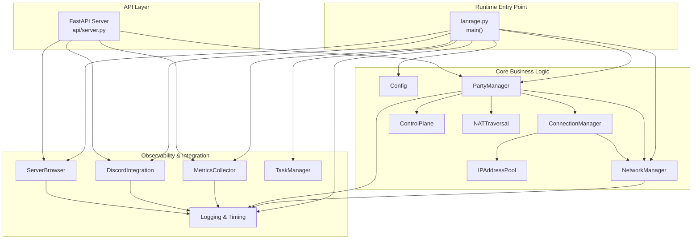
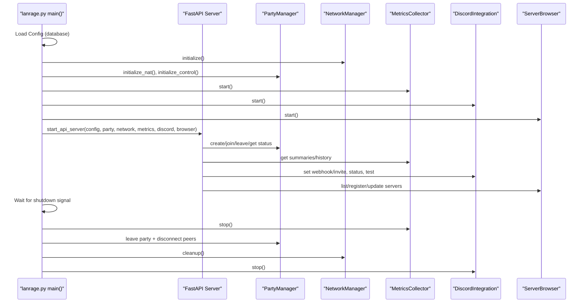
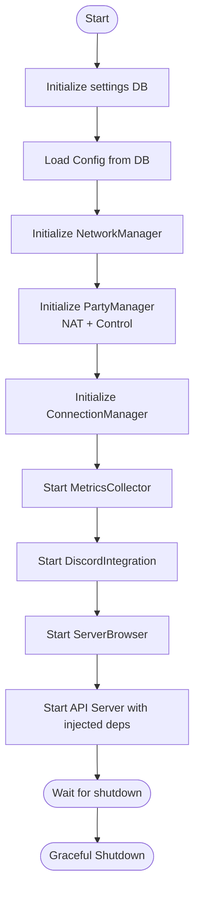
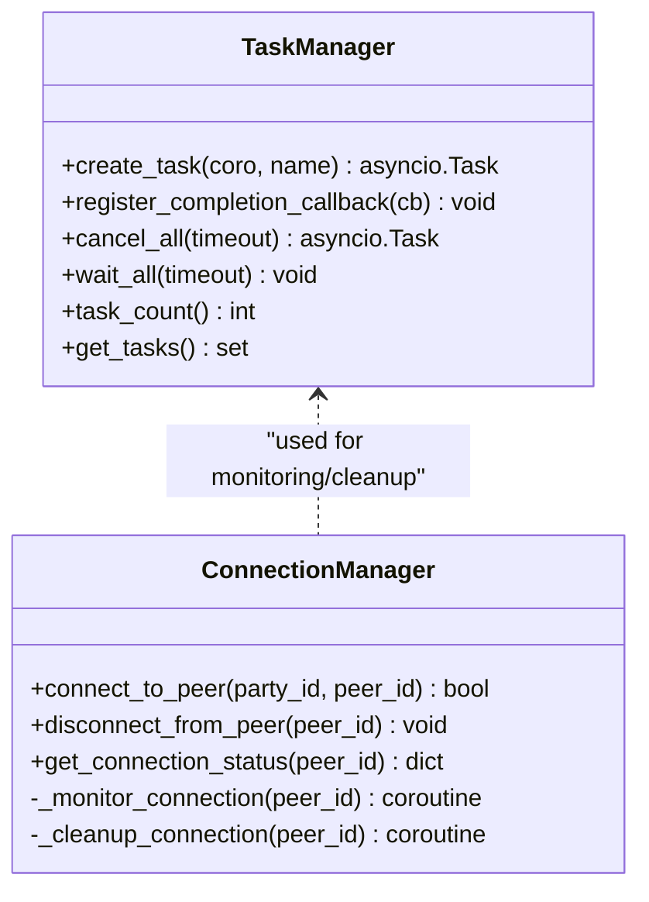
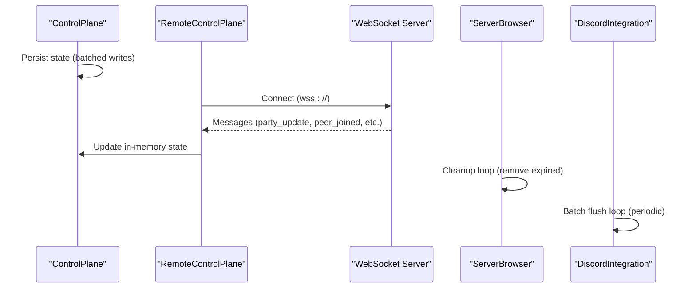
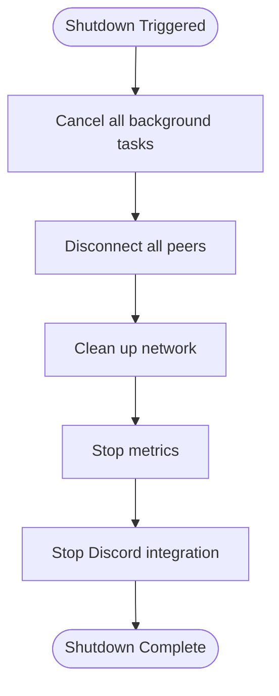
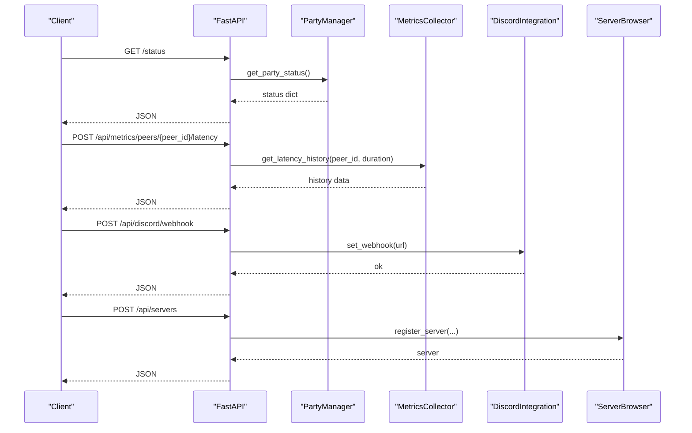
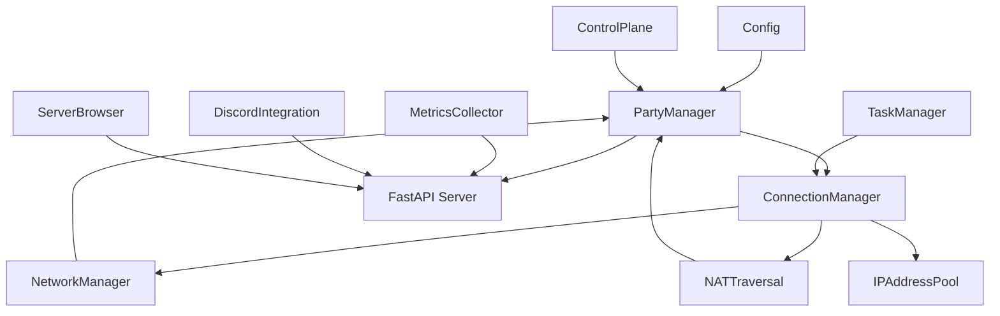

# Runtime Orchestration

<cite>
**Referenced Files in This Document**
- [lanrage.py](file://lanrage.py)
- [api/server.py](file://api/server.py)
- [core/party.py](file://core/party.py)
- [core/network.py](file://core/network.py)
- [core/config.py](file://core/config.py)
- [core/task_manager.py](file://core/task_manager.py)
- [core/metrics.py](file://core/metrics.py)
- [core/discord_integration.py](file://core/discord_integration.py)
- [core/server_browser.py](file://core/server_browser.py)
- [core/connection.py](file://core/connection.py)
- [core/control.py](file://core/control.py)
- [core/nat.py](file://core/nat.py)
- [core/ipam.py](file://core/ipam.py)
- [core/logging_config.py](file://core/logging_config.py)
</cite>

## Table of Contents
1. [Introduction](#introduction)
2. [Project Structure](#project-structure)
3. [Core Components](#core-components)
4. [Architecture Overview](#architecture-overview)
5. [Detailed Component Analysis](#detailed-component-analysis)
6. [Dependency Analysis](#dependency-analysis)
7. [Performance Considerations](#performance-considerations)
8. [Troubleshooting Guide](#troubleshooting-guide)
9. [Conclusion](#conclusion)

## Introduction
This document explains LANrage’s runtime component orchestration and coordination patterns. It covers the PartyManager–NetworkManager–Config dependency injection and initialization sequence, async task management for the API server, metrics collection, and background operations, the event-driven architecture using asyncio and WebSocket-like signaling, graceful shutdown procedures, component lifecycle management, error propagation, fault tolerance, and the integration between API endpoints and business logic during active gaming sessions.

## Project Structure
LANrage is organized around a modular core with clear separation of concerns:
- Entry point initializes configuration, network, party management, NAT traversal, metrics, Discord integration, and server browser, then starts the API server.
- API server exposes endpoints that delegate to business logic components (PartyManager, MetricsCollector, ServerBrowser, DiscordIntegration).
- Background tasks are managed centrally to ensure graceful cancellation and cleanup.
- Logging and timing utilities provide observability and performance insights.

**Diagram sources**
- [lanrage.py](file://lanrage.py#L40-L216)
- [api/server.py](file://api/server.py#L680-L701)
- [core/party.py](file://core/party.py#L102-L158)
- [core/network.py](file://core/network.py#L25-L94)
- [core/config.py](file://core/config.py#L17-L101)
- [core/task_manager.py](file://core/task_manager.py#L11-L109)
- [core/metrics.py](file://core/metrics.py#L193-L246)
- [core/discord_integration.py](file://core/discord_integration.py#L81-L133)
- [core/server_browser.py](file://core/server_browser.py#L75-L100)
- [core/connection.py](file://core/connection.py#L18-L37)
- [core/nat.py](file://core/nat.py#L41-L106)
- [core/ipam.py](file://core/ipam.py#L10-L32)
- [core/logging_config.py](file://core/logging_config.py#L118-L155)

**Section sources**
- [lanrage.py](file://lanrage.py#L40-L216)
- [api/server.py](file://api/server.py#L680-L701)

## Core Components
- Config: Database-first configuration loader and validator.
- NetworkManager: WireGuard interface creation, key management, peer management, and latency measurement.
- PartyManager: Party lifecycle, NAT detection, control plane integration, and peer connection orchestration.
- ConnectionManager: NAT-aware connection orchestration, peer configuration, monitoring, and cleanup.
- ControlPlane: Local and remote signaling/state management with persistence and cleanup.
- NATTraversal and ConnectionCoordinator: NAT detection, hole punching, and relay selection.
- IPAddressPool: Virtual IP allocation for peers.
- MetricsCollector: System and peer metrics collection, aggregation, and quality scoring.
- DiscordIntegration: Webhook notifications, bot, and Rich Presence with batching and cleanup.
- ServerBrowser: Game server registration, discovery, latency measurement, and cleanup.
- TaskManager: Centralized background task tracking, completion callbacks, and cancellation.
- Logging and Timing: Structured logging, context variables, and performance timing.

**Section sources**
- [core/config.py](file://core/config.py#L17-L101)
- [core/network.py](file://core/network.py#L25-L94)
- [core/party.py](file://core/party.py#L102-L158)
- [core/connection.py](file://core/connection.py#L18-L37)
- [core/control.py](file://core/control.py#L187-L227)
- [core/nat.py](file://core/nat.py#L41-L106)
- [core/ipam.py](file://core/ipam.py#L10-L32)
- [core/metrics.py](file://core/metrics.py#L193-L246)
- [core/discord_integration.py](file://core/discord_integration.py#L81-L133)
- [core/server_browser.py](file://core/server_browser.py#L75-L100)
- [core/task_manager.py](file://core/task_manager.py#L11-L109)
- [core/logging_config.py](file://core/logging_config.py#L118-L155)

## Architecture Overview
LANrage uses an event-driven, dependency-injected runtime orchestrated by the main entry point. The API server acts as the primary external interface, delegating to business logic components. Async tasks manage long-running operations (metrics, Discord notifications, server cleanup). Graceful shutdown cancels tasks, disconnects peers, cleans up network state, and stops integrations.

**Diagram sources**
- [lanrage.py](file://lanrage.py#L40-L216)
- [api/server.py](file://api/server.py#L680-L701)
- [core/party.py](file://core/party.py#L121-L158)
- [core/network.py](file://core/network.py#L71-L94)
- [core/metrics.py](file://core/metrics.py#L216-L246)
- [core/discord_integration.py](file://core/discord_integration.py#L105-L133)
- [core/server_browser.py](file://core/server_browser.py#L86-L100)

## Detailed Component Analysis

### Dependency Injection and Initialization Sequence
The main entry point orchestrates initialization in a strict order:
1. Settings database initialization and integrity checks.
2. Config loading from database.
3. NetworkManager initialization (WireGuard interface and keys).
4. PartyManager initialization (NAT detection, control plane, connection manager).
5. MetricsCollector start.
6. DiscordIntegration start.
7. ServerBrowser start.
8. API server start with injected dependencies.

**Diagram sources**
- [lanrage.py](file://lanrage.py#L53-L142)

**Section sources**
- [lanrage.py](file://lanrage.py#L53-L142)

### Async Task Management
LANrage centralizes background task management:
- TaskManager tracks tasks, registers completion callbacks, and supports graceful cancellation with timeouts.
- create_background_task integrates with ConnectionManager to monitor peer connections and handle cleanup.
- cancel_all_background_tasks is used during shutdown to ensure no orphaned tasks remain.

**Diagram sources**
- [core/task_manager.py](file://core/task_manager.py#L11-L109)
- [core/connection.py](file://core/connection.py#L113-L125)

**Section sources**
- [core/task_manager.py](file://core/task_manager.py#L11-L109)
- [core/connection.py](file://core/connection.py#L113-L125)

### Event-Driven Architecture and WebSocket Integration
LANrage implements event-driven patterns:
- ControlPlane provides local and remote signaling with persistence and cleanup loops.
- RemoteControlPlane uses WebSocket connections for live updates and reconnection logic.
- ServerBrowser maintains a cleanup loop to remove expired servers.
- DiscordIntegration batches notifications and runs periodic flush loops.

**Diagram sources**
- [core/control.py](file://core/control.py#L19-L113)
- [core/control.py](file://core/control.py#L541-L791)
- [core/server_browser.py](file://core/server_browser.py#L510-L534)
- [core/discord_integration.py](file://core/discord_integration.py#L179-L187)

**Section sources**
- [core/control.py](file://core/control.py#L19-L113)
- [core/control.py](file://core/control.py#L541-L791)
- [core/server_browser.py](file://core/server_browser.py#L510-L534)
- [core/discord_integration.py](file://core/discord_integration.py#L179-L187)

### Graceful Shutdown Procedure
The shutdown sequence ensures safe termination:
- Cancel all background tasks with timeout.
- Disconnect all peers via ConnectionManager.
- Clean up network interface.
- Stop metrics collection and Discord integration.
- Log completion.

**Diagram sources**
- [lanrage.py](file://lanrage.py#L170-L216)
- [core/task_manager.py](file://core/task_manager.py#L80-L109)
- [core/connection.py](file://core/connection.py#L126-L151)
- [core/network.py](file://core/network.py#L464-L482)
- [core/metrics.py](file://core/metrics.py#L236-L240)
- [core/discord_integration.py](file://core/discord_integration.py#L135-L178)

**Section sources**
- [lanrage.py](file://lanrage.py#L170-L216)
- [core/task_manager.py](file://core/task_manager.py#L80-L109)
- [core/connection.py](file://core/connection.py#L126-L151)
- [core/network.py](file://core/network.py#L464-L482)
- [core/metrics.py](file://core/metrics.py#L236-L240)
- [core/discord_integration.py](file://core/discord_integration.py#L135-L178)

### Component Lifecycle Management
- Config: Loaded once from database; validated and used throughout.
- NetworkManager: Initialize on boot, add/remove peers, measure latency, cleanup on shutdown.
- PartyManager: Create/join/leave parties, initialize NAT and control plane, coordinate connections.
- ConnectionManager: Establish direct/relay connections, monitor health, auto-clean failed connections.
- ControlPlane: Initialize state, persist changes, cleanup stale entries.
- MetricsCollector: Start collection loop, aggregate metrics, stop gracefully.
- DiscordIntegration: Start session, batch notifications, stop with final flush.
- ServerBrowser: Start cleanup loop, register/unregister servers, measure latency.

**Section sources**
- [core/config.py](file://core/config.py#L49-L101)
- [core/network.py](file://core/network.py#L71-L94)
- [core/party.py](file://core/party.py#L159-L247)
- [core/connection.py](file://core/connection.py#L38-L125)
- [core/control.py](file://core/control.py#L209-L227)
- [core/metrics.py](file://core/metrics.py#L216-L246)
- [core/discord_integration.py](file://core/discord_integration.py#L105-L133)
- [core/server_browser.py](file://core/server_browser.py#L86-L100)

### Error Propagation and Fault Tolerance
- NetworkManager raises WireGuardError for initialization failures; main handles and exits with guidance.
- PartyManager raises NotImplementedError when control plane is unavailable; API routes catch and return HTTP 501.
- ControlPlane and RemoteControlPlane handle connection failures, timeouts, and reconnection with backoff.
- ConnectionManager retries reconnection and switches relays when latency increases.
- ServerBrowser and MetricsCollector handle measurement failures and continue operating.
- Logging and timing decorators capture performance and exceptions for diagnostics.

**Section sources**
- [core/network.py](file://core/network.py#L19-L23)
- [core/party.py](file://core/party.py#L198-L201)
- [core/control.py](file://core/control.py#L558-L622)
- [core/connection.py](file://core/connection.py#L213-L305)
- [core/server_browser.py](file://core/server_browser.py#L334-L398)
- [core/metrics.py](file://core/metrics.py#L241-L246)
- [core/logging_config.py](file://core/logging_config.py#L169-L231)

### Integration Between API Endpoints and Business Logic
The API server injects dependencies and delegates to business logic:
- Party endpoints: create/join/leave/status via PartyManager.
- Metrics endpoints: summaries/history via MetricsCollector.
- Discord endpoints: webhook/invite configuration and status via DiscordIntegration.
- Server browser endpoints: register/list/update/heartbeat via ServerBrowser.
- Settings endpoints: update settings and reconnect Discord if needed.

**Diagram sources**
- [api/server.py](file://api/server.py#L146-L153)
- [api/server.py](file://api/server.py#L191-L201)
- [api/server.py](file://api/server.py#L281-L294)
- [api/server.py](file://api/server.py#L394-L424)

**Section sources**
- [api/server.py](file://api/server.py#L146-L153)
- [api/server.py](file://api/server.py#L191-L201)
- [api/server.py](file://api/server.py#L281-L294)
- [api/server.py](file://api/server.py#L394-L424)

## Dependency Analysis
Key runtime dependencies and coupling:
- PartyManager depends on Config, NetworkManager, NATTraversal, ControlPlane, and ConnectionManager.
- ConnectionManager depends on NetworkManager, NATTraversal, ControlPlane, and IPAddressPool.
- API server depends on PartyManager, MetricsCollector, DiscordIntegration, and ServerBrowser.
- TaskManager is a cross-cutting concern used by ConnectionManager and other components.

**Diagram sources**
- [core/party.py](file://core/party.py#L102-L158)
- [core/connection.py](file://core/connection.py#L18-L37)
- [api/server.py](file://api/server.py#L680-L701)
- [core/task_manager.py](file://core/task_manager.py#L11-L109)

**Section sources**
- [core/party.py](file://core/party.py#L102-L158)
- [core/connection.py](file://core/connection.py#L18-L37)
- [api/server.py](file://api/server.py#L680-L701)
- [core/task_manager.py](file://core/task_manager.py#L11-L109)

## Performance Considerations
- Asynchronous I/O: Network operations, subprocess execution, and external integrations use asyncio to avoid blocking.
- Batching and caching: Metrics aggregation, Discord notification batching, and state persistence reduce overhead.
- Latency measurement: Parallel ping sampling and exponential smoothing improve accuracy and responsiveness.
- Connection resilience: Retry logic, relay switching, and automatic cleanup prevent long-lived failures.
- Structured logging and timing decorators provide visibility into hotspots and bottlenecks.

[No sources needed since this section provides general guidance]

## Troubleshooting Guide
Common issues and resolutions:
- WireGuard initialization failures: Check installation, privileges, and conflicting interfaces; see WireGuardError handling.
- Control plane connectivity: RemoteControlPlane falls back to local mode on failure; verify websockets availability.
- Peer connection instability: Monitor latency and rely on automatic reconnection and relay switching.
- Metrics collection errors: MetricsCollector continues collecting; inspect logs for psutil or network I/O issues.
- Discord integration failures: Notifications are batched; ensure webhook/invite URLs are valid and reachable.

**Section sources**
- [core/network.py](file://core/network.py#L78-L94)
- [core/control.py](file://core/control.py#L558-L622)
- [core/connection.py](file://core/connection.py#L213-L305)
- [core/metrics.py](file://core/metrics.py#L241-L246)
- [core/discord_integration.py](file://core/discord_integration.py#L368-L402)

## Conclusion
LANrage’s runtime orchestration centers on a clear initialization sequence, dependency-injected business logic, and robust async task management. The event-driven design with ControlPlane signaling, NAT-aware connections, and comprehensive observability enables resilient operation across diverse network environments. The graceful shutdown procedure ensures resources are cleanly released, and the integration between API endpoints and business logic provides a cohesive developer and operator experience.