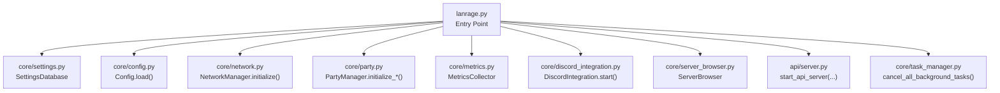
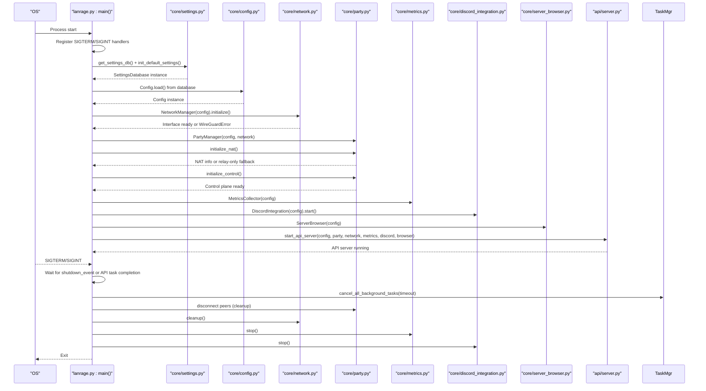
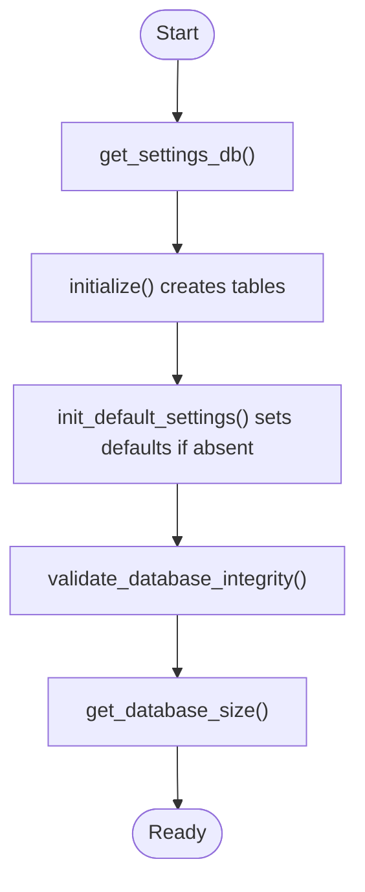
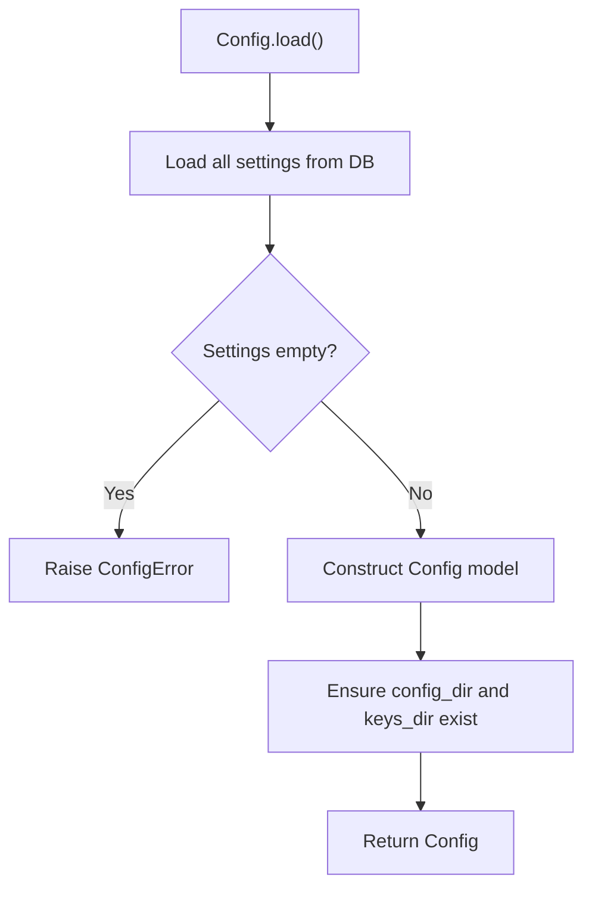
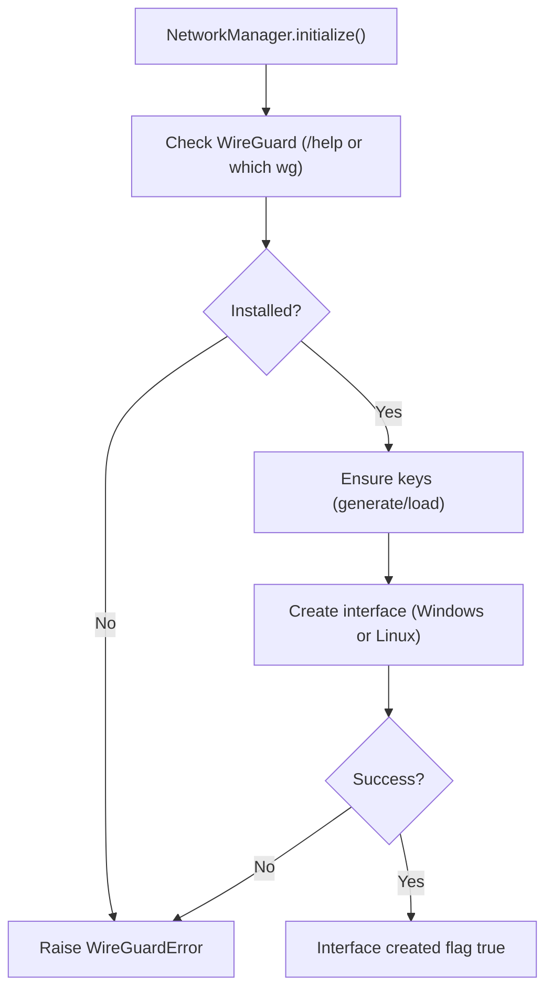
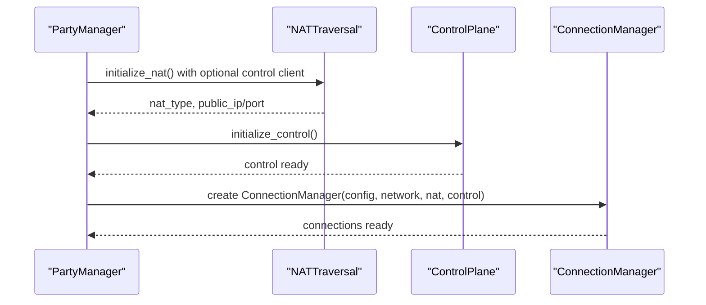
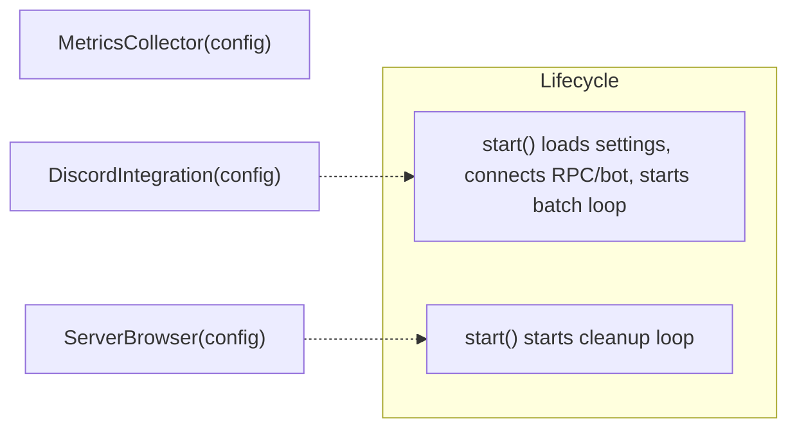
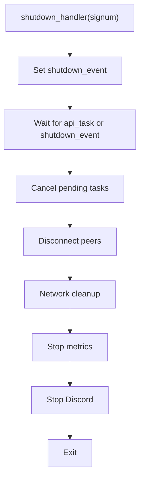
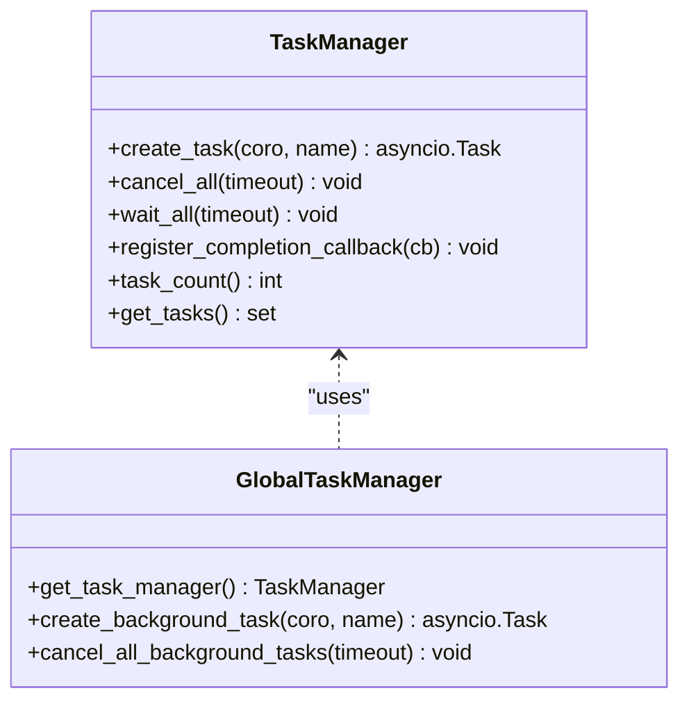
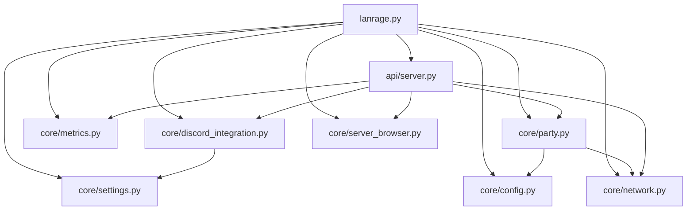

# Startup Sequence

<cite>
**Referenced Files in This Document**
- [lanrage.py](file://lanrage.py)
- [settings.py](file://core/settings.py)
- [config.py](file://core/config.py)
- [network.py](file://core/network.py)
- [party.py](file://core/party.py)
- [metrics.py](file://core/metrics.py)
- [discord_integration.py](file://core/discord_integration.py)
- [server_browser.py](file://core/server_browser.py)
- [task_manager.py](file://core/task_manager.py)
- [exceptions.py](file://core/exceptions.py)
- [server.py](file://api/server.py)
- [STARTUP_VALIDATION.md](file://docs/STARTUP_VALIDATION.md)
- [test_wireguard.py](file://tests/test_wireguard.py)
</cite>

## Table of Contents
1. [Introduction](#introduction)
2. [Project Structure](#project-structure)
3. [Core Components](#core-components)
4. [Architecture Overview](#architecture-overview)
5. [Detailed Component Analysis](#detailed-component-analysis)
6. [Dependency Analysis](#dependency-analysis)
7. [Performance Considerations](#performance-considerations)
8. [Troubleshooting Guide](#troubleshooting-guide)
9. [Conclusion](#conclusion)

## Introduction
This document explains LANrage’s application startup sequence and initialization workflow. It covers the step-by-step process from the main entry point through settings database setup, configuration loading, network initialization, and component orchestration. It also documents dependency resolution order, error handling strategies, signal-driven graceful shutdown, async task orchestration, database integrity validation, settings initialization and fallbacks, startup validation checks for WireGuard installation and administrative privileges, and troubleshooting guidance for common startup failures.

## Project Structure
LANrage follows a modular architecture with a clear separation of concerns:
- Entry point initializes components and starts the API server
- Settings and configuration are database-driven
- Network management handles WireGuard lifecycle
- Party management coordinates NAT traversal, control plane, and connections
- Metrics, Discord integration, and server browser are integrated into the API server lifecycle
- Task manager provides robust background task orchestration and cleanup

**Diagram sources**
- [lanrage.py](file://lanrage.py#L40-L216)
- [settings.py](file://core/settings.py#L466-L525)
- [config.py](file://core/config.py#L51-L114)
- [network.py](file://core/network.py#L70-L94)
- [party.py](file://core/party.py#L121-L158)
- [metrics.py](file://core/metrics.py#L193-L200)
- [discord_integration.py](file://core/discord_integration.py#L104-L132)
- [server_browser.py](file://core/server_browser.py#L85-L100)
- [task_manager.py](file://core/task_manager.py#L160-L167)
- [server.py](file://api/server.py#L1-L200)

**Section sources**
- [lanrage.py](file://lanrage.py#L1-L230)
- [settings.py](file://core/settings.py#L1-L525)
- [config.py](file://core/config.py#L1-L114)
- [network.py](file://core/network.py#L1-L515)
- [party.py](file://core/party.py#L1-L304)
- [metrics.py](file://core/metrics.py#L1-L705)
- [discord_integration.py](file://core/discord_integration.py#L1-L633)
- [server_browser.py](file://core/server_browser.py#L1-L552)
- [task_manager.py](file://core/task_manager.py#L1-L167)
- [server.py](file://api/server.py#L1-L701)

## Core Components
- SettingsDatabase: Async SQLite-backed persistence for application settings, server configurations, favorites, and game profiles. Provides integrity checks, sizing, and default initialization.
- Config: Database-first configuration loader using Pydantic models. Loads all runtime settings from the settings database.
- NetworkManager: WireGuard interface lifecycle management, key generation, platform-specific interface creation, and cleanup.
- PartyManager: Orchestrates NAT traversal, control plane, and connection management.
- MetricsCollector: Runtime metrics aggregation and quality scoring.
- DiscordIntegration: Webhook, Rich Presence, and bot integrations with batching and graceful shutdown.
- ServerBrowser: In-memory server registry and discovery with heartbeat and cleanup.
- TaskManager: Centralized background task tracking, cancellation, and completion callbacks.
- Exceptions: Domain-specific exceptions for graceful error propagation.

**Section sources**
- [settings.py](file://core/settings.py#L20-L96)
- [config.py](file://core/config.py#L17-L114)
- [network.py](file://core/network.py#L25-L515)
- [party.py](file://core/party.py#L102-L200)
- [metrics.py](file://core/metrics.py#L193-L200)
- [discord_integration.py](file://core/discord_integration.py#L81-L132)
- [server_browser.py](file://core/server_browser.py#L75-L100)
- [task_manager.py](file://core/task_manager.py#L11-L109)
- [exceptions.py](file://core/exceptions.py#L4-L96)

## Architecture Overview
The startup sequence is orchestrated by the main entry point, which registers signal handlers, initializes the settings database, loads configuration, initializes networking, party management, metrics, Discord integration, and server browser, then starts the API server. Shutdown is handled via asyncio events and signal handlers, with coordinated cancellation of background tasks and cleanup of network resources.

**Diagram sources**
- [lanrage.py](file://lanrage.py#L34-L216)
- [settings.py](file://core/settings.py#L466-L525)
- [config.py](file://core/config.py#L51-L114)
- [network.py](file://core/network.py#L70-L94)
- [party.py](file://core/party.py#L121-L158)
- [metrics.py](file://core/metrics.py#L193-L200)
- [discord_integration.py](file://core/discord_integration.py#L134-L178)
- [server_browser.py](file://core/server_browser.py#L85-L100)
- [task_manager.py](file://core/task_manager.py#L160-L167)
- [server.py](file://api/server.py#L1-L200)

## Detailed Component Analysis

### Settings Database Initialization and Integrity
- Initializes the settings database schema on first run and ensures directory existence.
- Provides default settings if missing, keyed by logical names.
- Validates database integrity and reports size for diagnostics.
- Supports backup and maintenance operations.

**Diagram sources**
- [settings.py](file://core/settings.py#L37-L96)
- [settings.py](file://core/settings.py#L476-L507)
- [settings.py](file://core/settings.py#L373-L407)

**Section sources**
- [settings.py](file://core/settings.py#L466-L525)
- [settings.py](file://core/settings.py#L476-L507)
- [settings.py](file://core/settings.py#L373-L407)

### Configuration Loading (Database-First)
- Loads all configuration from the settings database.
- Enforces initialization by checking for required keys.
- Creates config and keys directories.

**Diagram sources**
- [config.py](file://core/config.py#L51-L114)

**Section sources**
- [config.py](file://core/config.py#L51-L114)

### Network Initialization and Validation
- Checks WireGuard availability (platform-aware).
- Generates or loads WireGuard keys.
- Creates the interface (Windows service or Linux ip/wg commands).
- Implements timeouts and robust error handling.
- Provides cleanup routines and status queries.

**Diagram sources**
- [network.py](file://core/network.py#L70-L94)
- [network.py](file://core/network.py#L95-L122)
- [network.py](file://core/network.py#L161-L171)
- [network.py](file://core/network.py#L172-L235)
- [network.py](file://core/network.py#L236-L310)

**Section sources**
- [network.py](file://core/network.py#L70-L94)
- [network.py](file://core/network.py#L95-L122)
- [network.py](file://core/network.py#L161-L171)
- [network.py](file://core/network.py#L172-L235)
- [network.py](file://core/network.py#L236-L310)

### Party Management, NAT, and Control Plane
- Initializes NAT traversal and connection coordinator.
- Initializes control plane and connection manager.
- Integrates with network public key and NAT info.

**Diagram sources**
- [party.py](file://core/party.py#L121-L158)

**Section sources**
- [party.py](file://core/party.py#L121-L158)

### Metrics, Discord Integration, and Server Browser
- MetricsCollector is constructed with config and remains idle until needed.
- DiscordIntegration is started asynchronously and manages sessions, batching, and cleanup.
- ServerBrowser is started and maintains in-memory server registry with cleanup loop.

**Diagram sources**
- [metrics.py](file://core/metrics.py#L193-L200)
- [discord_integration.py](file://core/discord_integration.py#L104-L132)
- [server_browser.py](file://core/server_browser.py#L85-L100)

**Section sources**
- [metrics.py](file://core/metrics.py#L193-L200)
- [discord_integration.py](file://core/discord_integration.py#L104-L132)
- [server_browser.py](file://core/server_browser.py#L85-L100)

### Signal Handler Registration and Graceful Shutdown
- Registers SIGTERM and SIGINT handlers to set a shared asyncio.Event.
- Starts the API server as a cancellable task and waits for either completion or shutdown.
- Cancels remaining tasks, disconnects peers, cleans up network, stops metrics and Discord, then exits.

**Diagram sources**
- [lanrage.py](file://lanrage.py#L34-L74)
- [lanrage.py](file://lanrage.py#L150-L216)

**Section sources**
- [lanrage.py](file://lanrage.py#L34-L74)
- [lanrage.py](file://lanrage.py#L150-L216)
- [task_manager.py](file://core/task_manager.py#L160-L167)

### Async Task Orchestration Pattern
- Background tasks are tracked centrally via TaskManager.
- Completion callbacks are registered for monitoring.
- On shutdown, tasks are cancelled with a timeout and cleaned up.

**Diagram sources**
- [task_manager.py](file://core/task_manager.py#L11-L109)
- [task_manager.py](file://core/task_manager.py#L139-L167)

**Section sources**
- [task_manager.py](file://core/task_manager.py#L11-L109)
- [task_manager.py](file://core/task_manager.py#L139-L167)

## Dependency Analysis
- Entry point depends on settings, config, network, party, metrics, Discord, and server browser.
- NetworkManager depends on platform detection and external commands (wg, ip, wireguard).
- PartyManager depends on Config, NetworkManager, NATTraversal, and ControlPlane.
- API server depends on all core managers and exposes endpoints guarded by initialization checks.

**Diagram sources**
- [lanrage.py](file://lanrage.py#L14-L22)
- [party.py](file://core/party.py#L9-L14)
- [discord_integration.py](file://core/discord_integration.py#L12-L13)
- [server.py](file://api/server.py#L11-L15)

**Section sources**
- [lanrage.py](file://lanrage.py#L14-L22)
- [party.py](file://core/party.py#L9-L14)
- [discord_integration.py](file://core/discord_integration.py#L12-L13)
- [server.py](file://api/server.py#L11-L15)

## Performance Considerations
- Asynchronous I/O for database operations and external command execution prevents blocking the event loop.
- Metrics and notification batching reduce API overhead and CPU usage.
- Cleanup routines ensure resources are reclaimed promptly on shutdown.
- NAT detection and control plane initialization are guarded to avoid unnecessary delays.

## Troubleshooting Guide
Common startup failures and resolutions:
- Settings database initialization failure
  - Symptoms: Critical error during settings initialization; application exits.
  - Causes: Permission issues in user home directory or insufficient disk space.
  - Resolution: Verify permissions and free disk space under the user profile directory; retry.
  - Section sources
    - [lanrage.py](file://lanrage.py#L67-L74)
    - [settings.py](file://core/settings.py#L373-L407)

- Configuration load failure (empty or uninitialized database)
  - Symptoms: ConfigError indicating database not initialized; fallback to default configuration.
  - Causes: First-time run without WebUI configuration.
  - Resolution: Access the WebUI and configure settings; restart LANrage.
  - Section sources
    - [lanrage.py](file://lanrage.py#L79-L93)
    - [config.py](file://core/config.py#L68-L74)

- WireGuard not installed or interface creation fails
  - Symptoms: WireGuardError during network initialization; Windows tunnel installation may hang.
  - Causes: Missing WireGuard, lack of admin/root privileges (Linux), or Windows service conflicts.
  - Resolution: Install WireGuard, run as administrator/root, ensure no conflicting interfaces, and follow the documented workaround for Windows tunnel installation.
  - Section sources
    - [network.py](file://core/network.py#L75-L94)
    - [network.py](file://core/network.py#L214-L234)
    - [STARTUP_VALIDATION.md](file://docs/STARTUP_VALIDATION.md#L96-L125)

- Administrative privileges required (Linux)
  - Symptoms: Failure to create interface without root.
  - Resolution: Run LANrage with appropriate privileges.
  - Section sources
    - [network.py](file://core/network.py#L239-L242)

- API endpoints return 500 due to uninitialized components
  - Symptoms: 500 errors on metrics, Discord, and server browser endpoints.
  - Resolution: Ensure all components are initialized before starting the API server.
  - Section sources
    - [STARTUP_VALIDATION.md](file://docs/STARTUP_VALIDATION.md#L15-L30)
    - [server.py](file://api/server.py#L149-L150)

- NAT detection failures
  - Symptoms: NAT detection failed; fallback to relay-only mode.
  - Resolution: Continue with relay-only mode; verify STUN server reachability.
  - Section sources
    - [party.py](file://core/party.py#L139-L143)

- Testing startup validation
  - Use the included test scripts to validate WireGuard installation and interface creation.
  - Section sources
    - [test_wireguard.py](file://tests/test_wireguard.py#L21-L87)

## Conclusion
LANrage’s startup sequence is designed for reliability and clarity. The database-first configuration, robust error handling, explicit dependency initialization, and structured shutdown ensure predictable behavior across platforms. By following the documented validation steps and troubleshooting guidance, users can diagnose and resolve most startup issues efficiently.