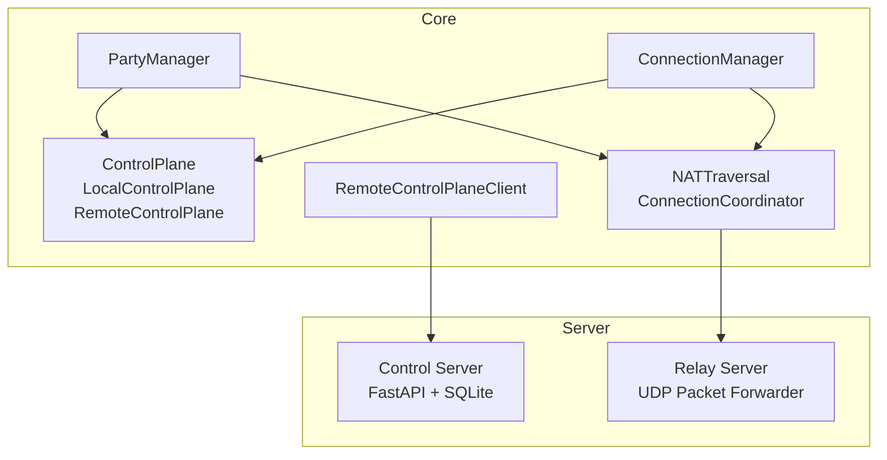
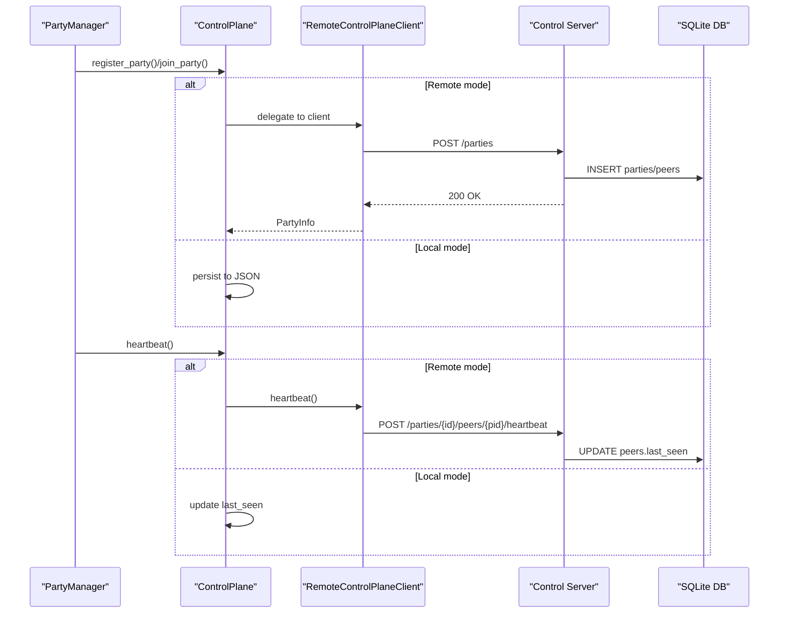
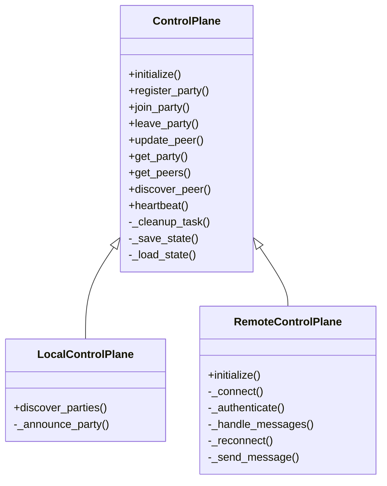
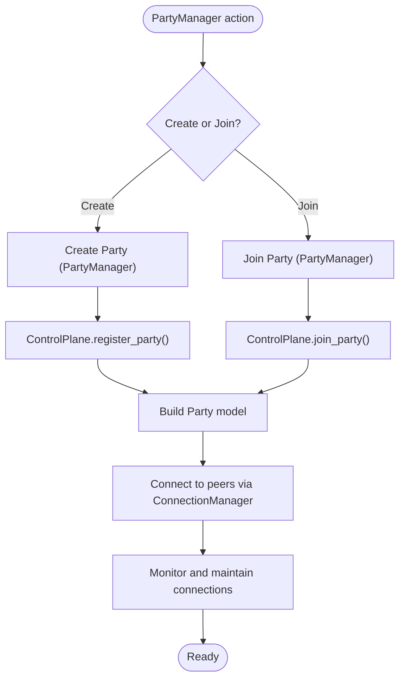
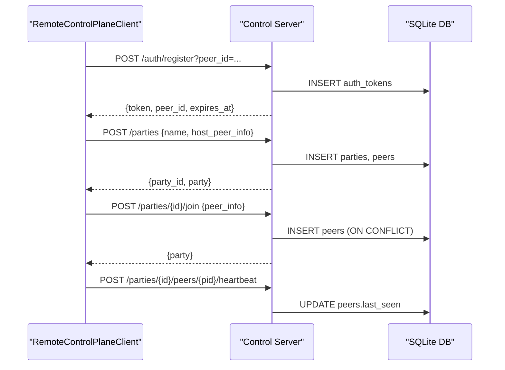
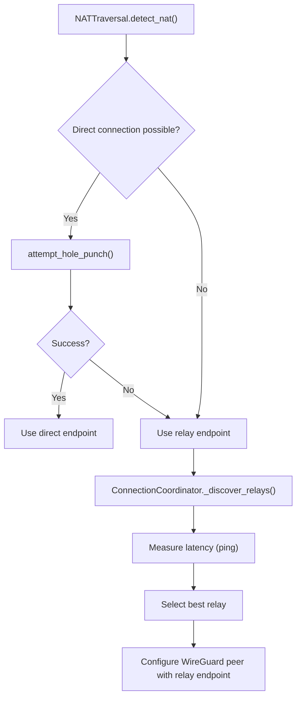
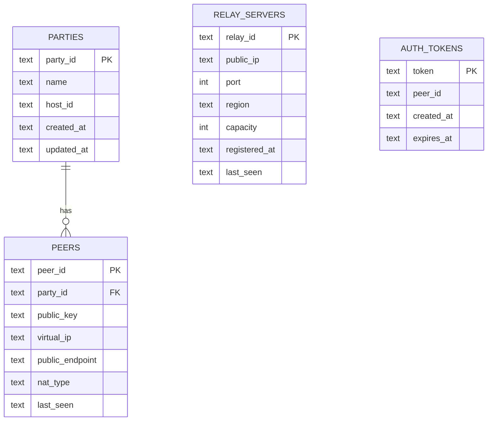
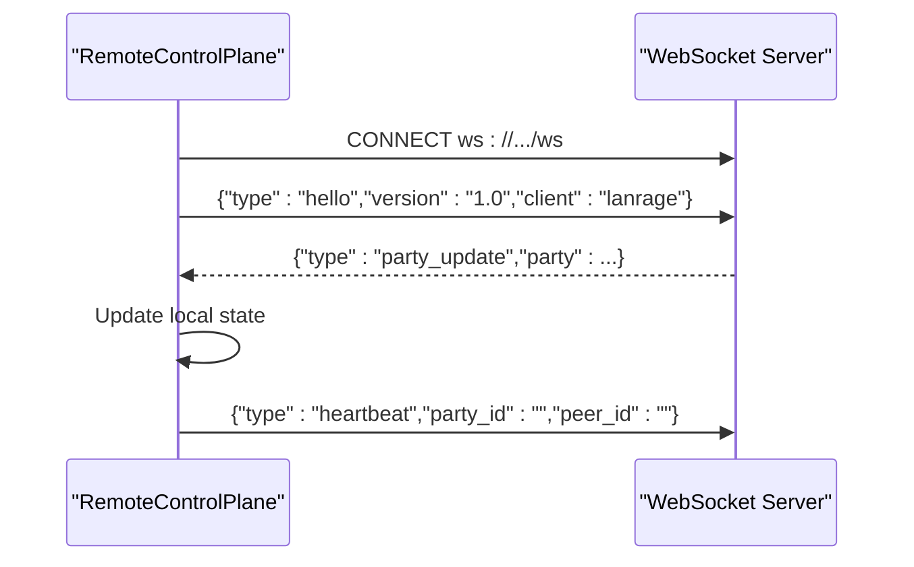
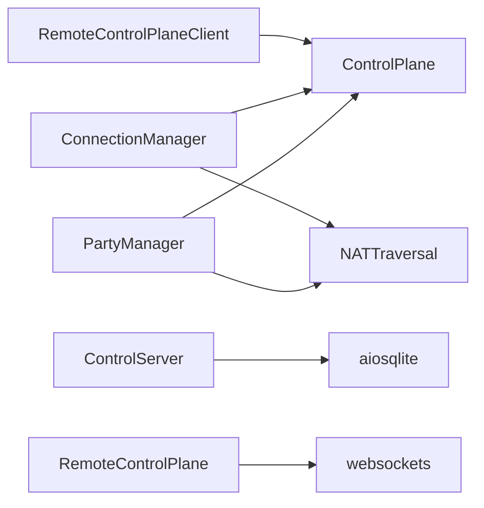

# Control Plane Design

<cite>
**Referenced Files in This Document**
- [core/control.py](file://core/control.py)
- [core/party.py](file://core/party.py)
- [core/nat.py](file://core/nat.py)
- [core/connection.py](file://core/connection.py)
- [servers/control_server.py](file://servers/control_server.py)
- [core/control_client.py](file://core/control_client.py)
- [servers/relay_server.py](file://servers/relay_server.py)
- [docs/CONTROL_PLANE.md](file://docs/CONTROL_PLANE.md)
- [SECURITY.md](file://SECURITY.md)
</cite>

## Table of Contents
1. [Introduction](#introduction)
2. [Project Structure](#project-structure)
3. [Core Components](#core-components)
4. [Architecture Overview](#architecture-overview)
5. [Detailed Component Analysis](#detailed-component-analysis)
6. [Dependency Analysis](#dependency-analysis)
7. [Performance Considerations](#performance-considerations)
8. [Troubleshooting Guide](#troubleshooting-guide)
9. [Conclusion](#conclusion)
10. [Appendices](#appendices)

## Introduction
This document describes LANrage’s control plane architecture with a focus on peer discovery, party management, and relay coordination. It explains the current SQLite-based local control plane implementation using aiosqlite for persistent state, the transition path to a WebSocket-based remote control plane, and the security model of the peer-to-peer control plane. It also covers database schema design, query optimization, and state synchronization patterns.

## Project Structure
The control plane spans several modules:
- Core control plane abstractions and local/remote implementations
- Party management and NAT traversal coordination
- Remote HTTP client for centralized control plane
- Centralized control plane server with SQLite-backed persistence
- Relay server for UDP packet forwarding

**Diagram sources**
- [core/control.py](file://core/control.py#L187-L860)
- [core/party.py](file://core/party.py#L102-L304)
- [core/nat.py](file://core/nat.py#L41-L525)
- [core/connection.py](file://core/connection.py#L18-L200)
- [core/control_client.py](file://core/control_client.py#L23-L438)
- [servers/control_server.py](file://servers/control_server.py#L1-L729)
- [servers/relay_server.py](file://servers/relay_server.py#L1-L297)

**Section sources**
- [core/control.py](file://core/control.py#L1-L880)
- [core/party.py](file://core/party.py#L1-L304)
- [core/nat.py](file://core/nat.py#L1-L525)
- [core/connection.py](file://core/connection.py#L1-L493)
- [core/control_client.py](file://core/control_client.py#L1-L438)
- [servers/control_server.py](file://servers/control_server.py#L1-L729)
- [servers/relay_server.py](file://servers/relay_server.py#L1-L297)

## Core Components
- ControlPlane: In-memory state with batched persistence to a JSON file; supports registering/joining/leaving parties, updating peer info, heartbeat, and cleanup of stale entries.
- LocalControlPlane: Extends ControlPlane with a shared discovery file for local LAN discovery.
- RemoteControlPlane: Extends ControlPlane with WebSocket connectivity to a centralized control server; includes authentication scaffolding and message handling.
- RemoteControlPlaneClient: HTTP client for centralized control plane with retries, heartbeats, and relay discovery.
- Control Server: FastAPI service backed by SQLite using aiosqlite; exposes party management, peer discovery, relay registry, and token-based authentication.
- Relay Server: Stateless UDP packet forwarder for NAT traversal; tracks clients and cleans up stale ones.
- PartyManager: Integrates control plane, NAT traversal, and connection manager to orchestrate party lifecycle and peer connectivity.
- NATTraversal and ConnectionCoordinator: Determine connection strategy (direct vs relay), perform hole punching, and discover/select relay endpoints.

**Section sources**
- [core/control.py](file://core/control.py#L187-L860)
- [core/control_client.py](file://core/control_client.py#L23-L438)
- [servers/control_server.py](file://servers/control_server.py#L1-L729)
- [servers/relay_server.py](file://servers/relay_server.py#L1-L297)
- [core/party.py](file://core/party.py#L102-L304)
- [core/nat.py](file://core/nat.py#L41-L525)

## Architecture Overview
The control plane supports two operational modes:
- Local mode: Uses file-based persistence and discovery for same-LAN testing.
- Remote mode: Uses a centralized FastAPI control server with SQLite persistence and optional WebSocket messaging for real-time updates.

**Diagram sources**
- [core/party.py](file://core/party.py#L159-L247)
- [core/control.py](file://core/control.py#L228-L310)
- [core/control_client.py](file://core/control_client.py#L191-L268)
- [servers/control_server.py](file://servers/control_server.py#L292-L399)

## Detailed Component Analysis

### Control Plane Abstractions
- StatePersister batches writes to reduce disk I/O and ensures atomic writes to a JSON state file.
- ControlPlane manages in-memory state, persists via StatePersister, and runs a periodic cleanup task removing stale peers and empty parties.
- LocalControlPlane extends ControlPlane with a discovery file for local LAN peer discovery.
- RemoteControlPlane extends ControlPlane with WebSocket connectivity and message handling for real-time updates.

**Diagram sources**
- [core/control.py](file://core/control.py#L19-L113)
- [core/control.py](file://core/control.py#L458-L540)
- [core/control.py](file://core/control.py#L541-L860)

**Section sources**
- [core/control.py](file://core/control.py#L19-L113)
- [core/control.py](file://core/control.py#L458-L540)
- [core/control.py](file://core/control.py#L541-L860)

### Party Management
- PartyManager integrates control plane, NAT traversal, and connection manager to create/join/leave parties and manage peer connections.
- It converts between control plane PeerInfo and party-level Peer models, assigns virtual IPs, and initiates connections.

**Diagram sources**
- [core/party.py](file://core/party.py#L159-L247)
- [core/connection.py](file://core/connection.py#L38-L125)

**Section sources**
- [core/party.py](file://core/party.py#L102-L304)
- [core/connection.py](file://core/connection.py#L18-L200)

### Remote Control Plane Client and Server
- RemoteControlPlaneClient encapsulates HTTP requests with retries, timeouts, and heartbeats; supports relay discovery via GET endpoints.
- Control Server exposes REST endpoints for party management, peer discovery, heartbeat, and relay registry; uses SQLite with aiosqlite for persistence and token-based authentication.

**Diagram sources**
- [core/control_client.py](file://core/control_client.py#L161-L268)
- [servers/control_server.py](file://servers/control_server.py#L267-L595)

**Section sources**
- [core/control_client.py](file://core/control_client.py#L23-L438)
- [servers/control_server.py](file://servers/control_server.py#L1-L729)

### Relay Coordination
- NATTraversal performs STUN-based NAT detection and attempts UDP hole punching for direct connections.
- ConnectionCoordinator selects “direct” or “relay” strategies, discovers relays from control plane or defaults, measures latency, and coordinates endpoint selection.
- RelayServer forwards UDP packets between peers behind NATs; maintains client records and cleans up stale clients.

**Diagram sources**
- [core/nat.py](file://core/nat.py#L64-L328)
- [core/nat.py](file://core/nat.py#L379-L525)
- [servers/relay_server.py](file://servers/relay_server.py#L85-L209)

**Section sources**
- [core/nat.py](file://core/nat.py#L41-L525)
- [servers/relay_server.py](file://servers/relay_server.py#L1-L297)

### Database Schema and Query Optimization
- Control Server schema includes:
  - parties: party_id, name, host_id, created_at, updated_at
  - peers: peer_id, party_id, public_key, virtual_ip, public_endpoint, nat_type, last_seen
  - relay_servers: relay_id, public_ip, port, region, capacity, registered_at, last_seen
  - auth_tokens: token, peer_id, created_at, expires_at
- Indexes:
  - idx_peers_party_id on peers(party_id)
  - idx_tokens_expires_at on auth_tokens(expires_at)
- Cleanup tasks:
  - Periodic cleanup of stale peers, empty parties, expired tokens, and stale relays.

**Diagram sources**
- [servers/control_server.py](file://servers/control_server.py#L37-L99)

**Section sources**
- [servers/control_server.py](file://servers/control_server.py#L37-L213)

### Transition to WebSocket-Based Remote Control Plane
- RemoteControlPlane currently sends hello messages and handles basic message types; authentication is a placeholder.
- Future enhancements include full WebSocket protocol, real-time party updates, signaling, and robust authentication.

**Diagram sources**
- [core/control.py](file://core/control.py#L571-L663)

**Section sources**
- [core/control.py](file://core/control.py#L541-L860)
- [docs/CONTROL_PLANE.md](file://docs/CONTROL_PLANE.md#L490-L575)

## Dependency Analysis
- Coupling:
  - PartyManager depends on ControlPlane, NATTraversal, and ConnectionManager.
  - ConnectionManager depends on ControlPlane, NATTraversal, and NetworkManager.
  - RemoteControlPlaneClient depends on ControlPlane and FastAPI endpoints.
  - Control Server depends on aiosqlite and FastAPI.
- Cohesion:
  - ControlPlane encapsulates state and persistence; RemoteControlPlane adds networking.
  - NATTraversal and ConnectionCoordinator encapsulate NAT logic and strategy selection.
- External dependencies:
  - aiosqlite for async SQLite operations.
  - httpx for robust HTTP client behavior.
  - websockets for WebSocket client (optional for remote mode).

**Diagram sources**
- [core/party.py](file://core/party.py#L102-L158)
- [core/connection.py](file://core/connection.py#L18-L37)
- [core/control_client.py](file://core/control_client.py#L23-L47)
- [servers/control_server.py](file://servers/control_server.py#L20-L33)

**Section sources**
- [core/party.py](file://core/party.py#L102-L158)
- [core/connection.py](file://core/connection.py#L18-L37)
- [core/control_client.py](file://core/control_client.py#L23-L47)
- [servers/control_server.py](file://servers/control_server.py#L20-L33)

## Performance Considerations
- Batched persistence: StatePersister batches writes and flushes after a short delay to reduce disk I/O.
- Cleanup intervals: Background tasks run periodically to remove stale entries and expired tokens.
- Query optimization: Indexes on foreign keys and expiration fields improve lookup performance.
- Connection monitoring: ConnectionManager monitors latency and can switch relays dynamically for improved performance.

[No sources needed since this section provides general guidance]

## Troubleshooting Guide
- Local mode issues:
  - State file corruption: The loader handles corrupted files gracefully by starting fresh.
  - Discovery file problems: LocalControlPlane announces and reads discovery files; errors are logged and do not fail the process.
- Remote mode issues:
  - Connection failures: RemoteControlPlane falls back to local mode on connection errors; reconnect attempts are limited.
  - Authentication failures: Token verification checks presence, format, and expiration; expired tokens are deleted.
  - Heartbeat failures: Heartbeat errors are logged but do not interrupt operation.
- Relay issues:
  - Stale clients: RelayServer cleans up clients inactive for more than 5 minutes.
  - Packet forwarding failures: Errors are logged; relay continues operating.

**Section sources**
- [core/control.py](file://core/control.py#L426-L456)
- [core/control.py](file://core/control.py#L558-L570)
- [servers/control_server.py](file://servers/control_server.py#L147-L178)
- [servers/relay_server.py](file://servers/relay_server.py#L189-L209)

## Conclusion
LANrage’s control plane provides a flexible architecture that starts with a simple, local-only design and cleanly transitions to a centralized, authenticated model. The SQLite-backed server offers robust persistence and scalability, while NAT traversal and relay coordination ensure reliable peer-to-peer connectivity. Security is layered through WireGuard encryption, token-based authentication, and a local-first design that minimizes trust assumptions.

[No sources needed since this section summarizes without analyzing specific files]

## Appendices

### Security Implications and Trust Model
- Local control plane: Trust is implicit among peers on the same LAN; no central authority.
- Remote control plane: Introduces a centralized server; authentication tokens and indexes protect access.
- Relay trust: Relays forward encrypted packets and can observe metadata; use trusted or self-operated relays.
- Known limitations and mitigations are documented in the security policy.

**Section sources**
- [SECURITY.md](file://SECURITY.md#L112-L127)
- [servers/control_server.py](file://servers/control_server.py#L142-L178)