# Control Plane Implementation

<cite>
**Referenced Files in This Document**
- [core/control.py](file://core/control.py)
- [core/control_client.py](file://core/control_client.py)
- [servers/control_server.py](file://servers/control_server.py)
- [core/config.py](file://core/config.py)
- [core/party.py](file://core/party.py)
- [docs/CONTROL_PLANE.md](file://docs/CONTROL_PLANE.md)
- [docs/CONTROL_PLANE_SERVER.md](file://docs/CONTROL_PLANE_SERVER.md)
- [tests/test_control_client.py](file://tests/test_control_client.py)
- [tests/test_control_server.py](file://tests/test_control_server.py)
</cite>

## Table of Contents
1. [Introduction](#introduction)
2. [Project Structure](#project-structure)
3. [Core Components](#core-components)
4. [Architecture Overview](#architecture-overview)
5. [Detailed Component Analysis](#detailed-component-analysis)
6. [Dependency Analysis](#dependency-analysis)
7. [Performance Considerations](#performance-considerations)
8. [Troubleshooting Guide](#troubleshooting-guide)
9. [Conclusion](#conclusion)
10. [Appendices](#appendices)

## Introduction
This document explains LANrage’s control plane implementation architecture. It covers the abstract ControlPlane base class and its concrete implementations LocalControlPlane and RemoteControlPlane. It documents the factory pattern used to instantiate the control plane based on configuration, the transition from a local SQLite-based control plane to a WebSocket-based remote control plane, and the client-server communication protocol. It also details message handling, state synchronization, fallback mechanisms, and practical examples for configuration, client initialization, and server integration. Finally, it outlines an architectural evolution roadmap and migration strategies between local and remote control plane modes.

## Project Structure
The control plane spans three primary areas:
- Core control plane logic and factory in core/control.py
- HTTP client for remote control plane in core/control_client.py
- Centralized control plane server in servers/control_server.py
- Configuration and runtime integration in core/config.py and core/party.py
- Documentation and tests supporting the control plane in docs/* and tests/*

**Diagram sources**
- [core/control.py](file://core/control.py#L187-L880)
- [core/control_client.py](file://core/control_client.py#L23-L438)
- [servers/control_server.py](file://servers/control_server.py#L1-L729)
- [core/config.py](file://core/config.py#L17-L114)
- [core/party.py](file://core/party.py#L102-L158)

**Section sources**
- [core/control.py](file://core/control.py#L1-L880)
- [core/control_client.py](file://core/control_client.py#L1-L438)
- [servers/control_server.py](file://servers/control_server.py#L1-L729)
- [core/config.py](file://core/config.py#L1-L114)
- [core/party.py](file://core/party.py#L1-L200)

## Core Components
- ControlPlane: Abstract base class providing party registration, peer discovery, heartbeat, and state persistence. It supports both local and remote modes and includes a batched state writer and periodic cleanup.
- LocalControlPlane: Local-only implementation using file-based discovery and persistence for same-LAN testing and development.
- RemoteControlPlane: Client that connects to a centralized control server via WebSocket, handling real-time updates and fallback to local mode on failure.
- RemoteControlPlaneClient: HTTP-based client for centralized control plane server, featuring automatic retries, connection pooling, timeouts, and heartbeat management.
- ControlPlaneError: Custom exception type used consistently across control plane operations.
- create_control_plane: Factory function that selects LocalControlPlane or RemoteControlPlaneClient based on configuration.

Key behaviors:
- State persistence: Batched writes to a JSON state file with a write-behind cache and periodic flush.
- Cleanup: Background task removes stale peers and empty parties based on last_seen timestamps.
- Fallback: RemoteControlPlane falls back to local mode on connection failure or import errors.

**Section sources**
- [core/control.py](file://core/control.py#L187-L880)
- [docs/CONTROL_PLANE.md](file://docs/CONTROL_PLANE.md#L1-L629)

## Architecture Overview
The control plane architecture supports two operational modes:
- Local mode: File-based discovery and persistence for LAN-only environments.
- Remote mode: WebSocket-based client communicating with a centralized FastAPI server backed by SQLite.

**Diagram sources**
- [core/party.py](file://core/party.py#L144-L158)
- [core/control.py](file://core/control.py#L863-L880)
- [core/control_client.py](file://core/control_client.py#L161-L232)
- [servers/control_server.py](file://servers/control_server.py#L267-L289)

## Detailed Component Analysis

### ControlPlane Base Class
Responsibilities:
- Manage parties and peers
- Persist state to disk with a batched writer
- Periodic cleanup of stale entries
- Heartbeat updates to prevent cleanup
- Local and remote mode compatibility

Implementation highlights:
- StatePersister batches writes and flushes after a short delay to reduce disk I/O.
- Cleanup runs every minute, removing peers inactive for more than five minutes and empty parties.
- Persistence uses ISO-formatted timestamps and JSON serialization.

**Diagram sources**
- [core/control.py](file://core/control.py#L19-L113)
- [core/control.py](file://core/control.py#L187-L456)

**Section sources**
- [core/control.py](file://core/control.py#L187-L456)
- [docs/CONTROL_PLANE.md](file://docs/CONTROL_PLANE.md#L81-L295)

### LocalControlPlane
Features:
- Announces parties to a shared discovery file for local peers
- Discovers parties by reading the discovery file
- Inherits all ControlPlane capabilities

Operational notes:
- Discovery file is used for local LAN discovery
- Falls back gracefully if the discovery file cannot be read/written

**Section sources**
- [core/control.py](file://core/control.py#L458-L539)
- [docs/CONTROL_PLANE.md](file://docs/CONTROL_PLANE.md#L296-L336)

### RemoteControlPlane (WebSocket Client)
Purpose:
- Connect to a centralized control server via WebSocket
- Handle real-time updates (party updates, peer joins/leaves, signals)
- Fallback to local mode on connection failure

Key behaviors:
- Converts HTTP(S) URLs to WebSocket URLs and appends a ws path
- Attempts connection with a timeout and starts a message handler
- Implements exponential backoff reconnection with a maximum number of attempts
- Sends a hello message upon successful connection
- On failure, prints warnings and falls back to local mode

**Diagram sources**
- [core/control.py](file://core/control.py#L541-L848)

**Section sources**
- [core/control.py](file://core/control.py#L541-L848)
- [docs/CONTROL_PLANE.md](file://docs/CONTROL_PLANE.md#L337-L429)

### RemoteControlPlaneClient (HTTP Client)
Purpose:
- Provides HTTP-based client for centralized control plane server
- Robust async HTTP communication with retries, connection pooling, timeouts, and heartbeat management

Key behaviors:
- Initializes an httpx.AsyncClient with connection pooling and timeouts
- Implements retry logic with exponential backoff for transient failures
- Manages authentication tokens and heartbeat tasks
- Supports party lifecycle operations (create/join/leave/get/list)

**Diagram sources**
- [core/control_client.py](file://core/control_client.py#L23-L438)

**Section sources**
- [core/control_client.py](file://core/control_client.py#L1-L438)
- [docs/CONTROL_PLANE_SERVER.md](file://docs/CONTROL_PLANE_SERVER.md#L1-L471)

### Control Server (FastAPI)
Purpose:
- Centralized control plane server providing HTTP endpoints for party management, peer discovery, relay registry, and heartbeats
- Uses SQLite via aiosqlite for persistence and includes automatic cleanup tasks

Key endpoints:
- Health check: GET /
- Authentication: POST /auth/register
- Party management: POST /parties, GET /parties/{id}, GET /parties/{id}/peers, GET /parties/{id}/peers/{peer_id}, POST /parties/{id}/join, DELETE /parties/{id}/peers/{peer_id}
- Heartbeat: POST /parties/{id}/peers/{peer_id}/heartbeat
- Relay registry: POST /relays, GET /relays, GET /relays/{region}

**Diagram sources**
- [servers/control_server.py](file://servers/control_server.py#L37-L232)
- [servers/control_server.py](file://servers/control_server.py#L244-L729)

**Section sources**
- [servers/control_server.py](file://servers/control_server.py#L1-L729)
- [docs/CONTROL_PLANE_SERVER.md](file://docs/CONTROL_PLANE_SERVER.md#L1-L471)

### Factory Pattern and Runtime Integration
The factory function create_control_plane selects the appropriate control plane implementation based on configuration:
- If a control server URL is configured and differs from the default, RemoteControlPlaneClient is returned
- Otherwise, LocalControlPlane is returned

Integration in PartyManager:
- PartyManager calls create_control_plane during initialization
- It then initializes the control plane and connection manager

**Diagram sources**
- [core/config.py](file://core/config.py#L49-L114)
- [core/control.py](file://core/control.py#L863-L880)
- [core/party.py](file://core/party.py#L144-L158)

**Section sources**
- [core/control.py](file://core/control.py#L863-L880)
- [core/party.py](file://core/party.py#L144-L158)
- [core/config.py](file://core/config.py#L37-L91)

## Dependency Analysis
- ControlPlane depends on Config for persistence paths and on StatePersister for batched writes.
- LocalControlPlane extends ControlPlane and adds file-based discovery.
- RemoteControlPlane extends ControlPlane and adds WebSocket connectivity and reconnection logic.
- RemoteControlPlaneClient is decoupled from RemoteControlPlane and communicates with the server via HTTP endpoints.
- PartyManager integrates the control plane into the broader networking stack.

```mermaid
graph TB
CFG["Config<br/>core/config.py"]
CP["ControlPlane<br/>core/control.py"]
LCP["LocalControlPlane<br/>core/control.py"]
RCP["RemoteControlPlane<br/>core/control.py"]
CPC["RemoteControlPlaneClient<br/>core/control_client.py"]
CS["Control Server<br/>servers/control_server.py"]
PARTY["PartyManager<br/>core/party.py"]
PARTY --> CFG
PARTY --> CP
CP --> LCP
CP --> RCP
RCP --> CPC
CPC --> CS
```

**Diagram sources**
- [core/control.py](file://core/control.py#L187-L880)
- [core/control_client.py](file://core/control_client.py#L23-L438)
- [servers/control_server.py](file://servers/control_server.py#L1-L729)
- [core/config.py](file://core/config.py#L17-L114)
- [core/party.py](file://core/party.py#L102-L158)

**Section sources**
- [core/control.py](file://core/control.py#L187-L880)
- [core/control_client.py](file://core/control_client.py#L23-L438)
- [servers/control_server.py](file://servers/control_server.py#L1-L729)
- [core/config.py](file://core/config.py#L17-L114)
- [core/party.py](file://core/party.py#L102-L158)

## Performance Considerations
- Batched state persistence reduces disk I/O by queuing writes and flushing after a short delay.
- Cleanup runs periodically to remove stale peers and empty parties, preventing state bloat.
- HTTP client uses connection pooling and timeouts to improve throughput and reliability.
- Heartbeat intervals balance liveness detection with resource usage.

[No sources needed since this section provides general guidance]

## Troubleshooting Guide
Common issues and remedies:
- Connection refused to control server: Verify server is running, firewall rules, and server logs.
- Timeout errors: Increase client timeout, check network latency, and ensure server is not overloaded.
- Stale peers: Confirm heartbeat interval and cleanup timeout; adjust if necessary.
- Import errors for remote control client: Ensure dependencies are installed; the factory falls back to local mode on ImportError.
- WebSocket reconnection failures: The client attempts a limited number of reconnects with delays; on exhaustion, it falls back to local mode.

**Section sources**
- [docs/CONTROL_PLANE_SERVER.md](file://docs/CONTROL_PLANE_SERVER.md#L395-L425)
- [core/control.py](file://core/control.py#L571-L698)
- [core/control_client.py](file://core/control_client.py#L128-L156)

## Conclusion
LANrage’s control plane provides a flexible, extensible architecture that supports both local and remote modes. The abstract ControlPlane base class enables seamless migration from a local SQLite-based implementation to a WebSocket-based remote control plane. The factory pattern ensures appropriate instantiation based on configuration, while robust fallback mechanisms maintain availability. The centralized server offers scalable HTTP endpoints for party management, peer discovery, and relay coordination, with room for future enhancements such as WebSocket real-time updates and multi-instance backends.

[No sources needed since this section summarizes without analyzing specific files]

## Appendices

### Practical Examples

- Control plane configuration
  - Set the control server URL in configuration; the factory will select RemoteControlPlaneClient when a non-default URL is provided.
  - Reference: [core/config.py](file://core/config.py#L85-L87), [core/control.py](file://core/control.py#L863-L880)

- Client initialization
  - Initialize the RemoteControlPlaneClient and register a peer to obtain an authentication token.
  - Reference: [core/control_client.py](file://core/control_client.py#L48-L58), [core/control_client.py](file://core/control_client.py#L162-L189)

- Server integration
  - Start the control server and expose endpoints for authentication, party management, peer discovery, heartbeats, and relay registry.
  - Reference: [servers/control_server.py](file://servers/control_server.py#L685-L729), [docs/CONTROL_PLANE_SERVER.md](file://docs/CONTROL_PLANE_SERVER.md#L80-L96)

- Message protocol (WebSocket)
  - Client sends hello, register_party, join_party, leave_party, heartbeat.
  - Server responds with party_update, peer_joined, peer_left, error.
  - Reference: [docs/CONTROL_PLANE.md](file://docs/CONTROL_PLANE.md#L490-L575)

- Migration strategies
  - Start with local mode for development and testing.
  - Configure a control server URL to switch to remote mode.
  - Use the factory to transparently select the appropriate control plane implementation.
  - Reference: [core/control.py](file://core/control.py#L863-L880), [docs/CONTROL_PLANE.md](file://docs/CONTROL_PLANE.md#L414-L429)

**Section sources**
- [core/config.py](file://core/config.py#L85-L87)
- [core/control.py](file://core/control.py#L863-L880)
- [core/control_client.py](file://core/control_client.py#L48-L58)
- [core/control_client.py](file://core/control_client.py#L162-L189)
- [servers/control_server.py](file://servers/control_server.py#L685-L729)
- [docs/CONTROL_PLANE_SERVER.md](file://docs/CONTROL_PLANE_SERVER.md#L80-L96)
- [docs/CONTROL_PLANE.md](file://docs/CONTROL_PLANE.md#L490-L575)
- [docs/CONTROL_PLANE.md](file://docs/CONTROL_PLANE.md#L414-L429)