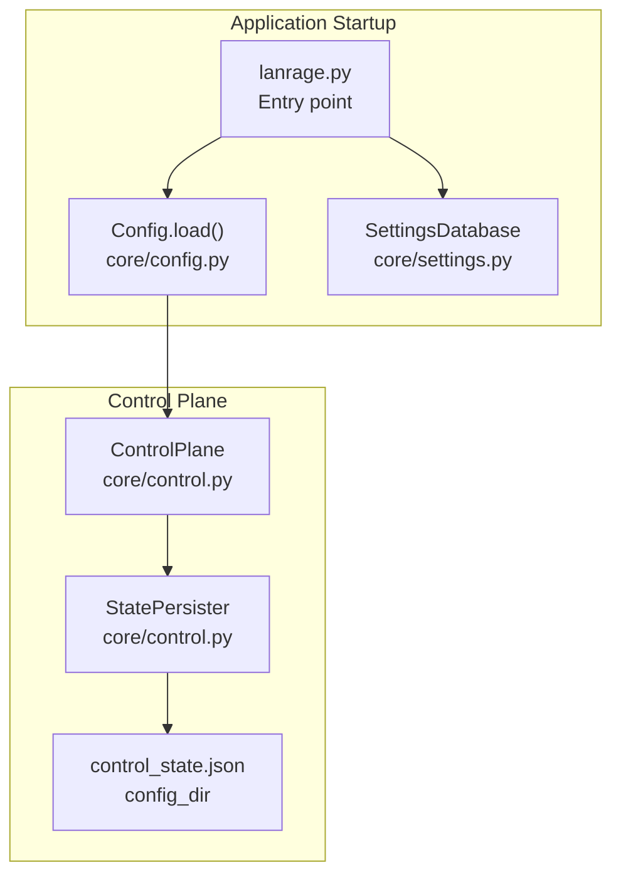
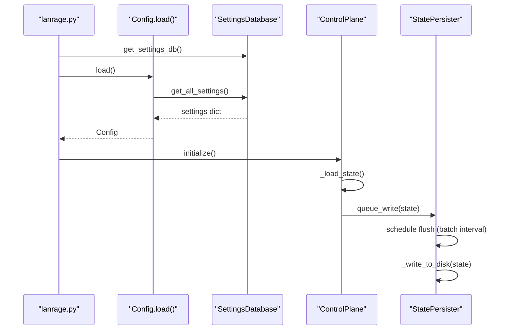
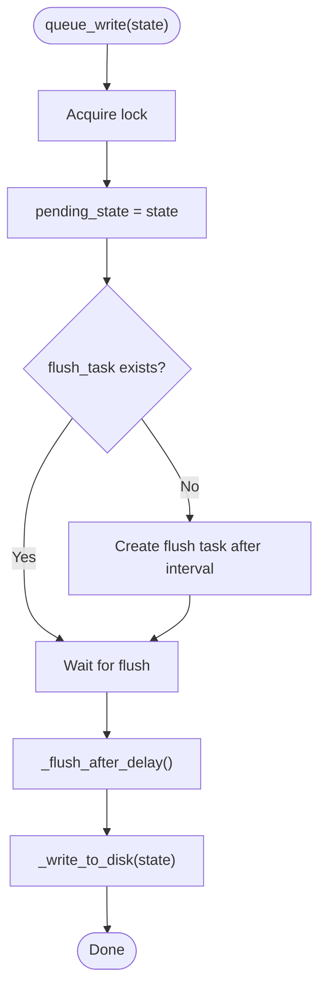
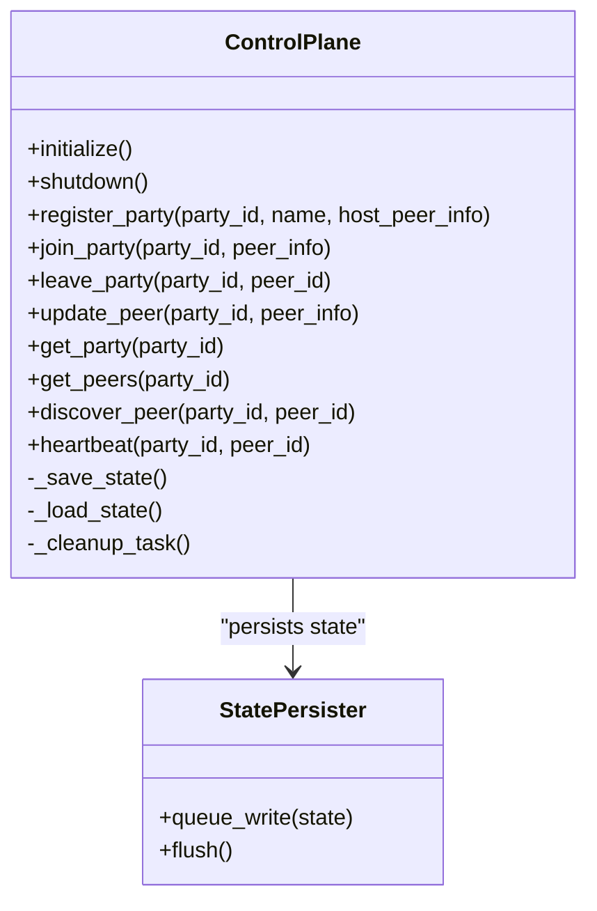
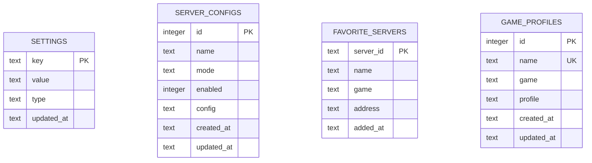
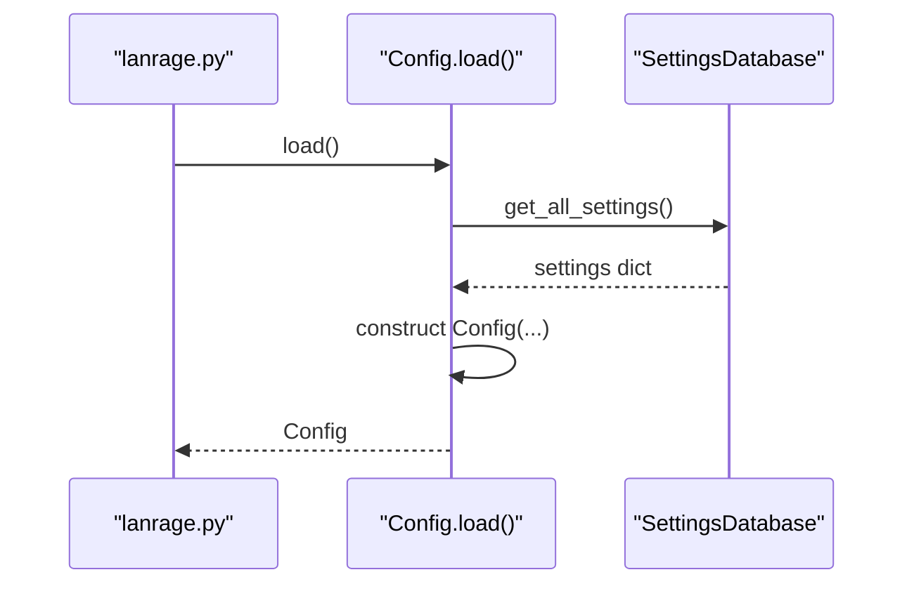
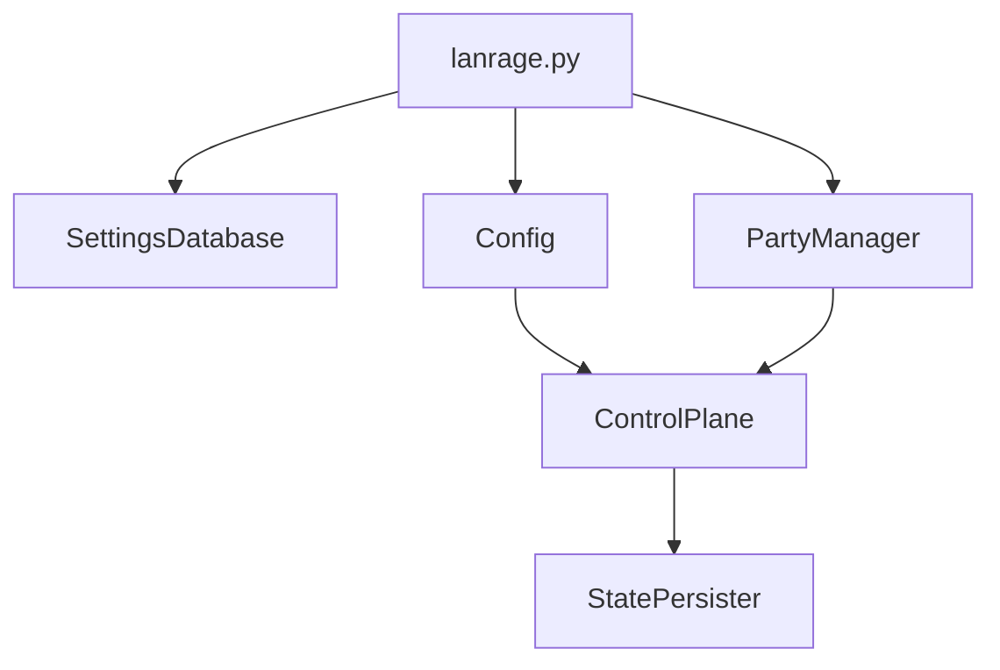

# Database & State Persistence

<cite>
**Referenced Files in This Document**
- [lanrage.py](file://lanrage.py)
- [control.py](file://core/control.py)
- [settings.py](file://core/settings.py)
- [config.py](file://core/config.py)
- [party.py](file://core/party.py)
- [logging_config.py](file://core/logging_config.py)
- [exceptions.py](file://core/exceptions.py)
</cite>

## Table of Contents
1. [Introduction](#introduction)
2. [Project Structure](#project-structure)
3. [Core Components](#core-components)
4. [Architecture Overview](#architecture-overview)
5. [Detailed Component Analysis](#detailed-component-analysis)
6. [Dependency Analysis](#dependency-analysis)
7. [Performance Considerations](#performance-considerations)
8. [Troubleshooting Guide](#troubleshooting-guide)
9. [Conclusion](#conclusion)
10. [Appendices](#appendices)

## Introduction
This document explains LANrage’s state persistence and database management system. It covers:
- The StatePersister write-behind cache and batched writes for control plane state
- Atomic file operations and graceful degradation when disk operations fail
- SQLite-based settings database with robust schema design and maintenance
- State synchronization patterns, write optimization strategies, and error handling
- Practical workflows for loading/saving state, recovery procedures, and performance tuning
- Data integrity guarantees, backup strategies, and migration procedures for state format changes

## Project Structure
LANrage centralizes persistence in two primary subsystems:
- Settings database (SQLite): asynchronous, durable storage for configuration and user preferences
- Control plane state (JSON): lightweight, file-backed state for parties and peers with write-behind caching

**Diagram sources**
- [lanrage.py](file://lanrage.py#L53-L93)
- [config.py](file://core/config.py#L51-L100)
- [settings.py](file://core/settings.py#L466-L473)
- [control.py](file://core/control.py#L187-L226)

**Section sources**
- [lanrage.py](file://lanrage.py#L53-L93)
- [config.py](file://core/config.py#L51-L100)
- [settings.py](file://core/settings.py#L466-L473)
- [control.py](file://core/control.py#L187-L226)

## Core Components
- StatePersister: batches state writes with a short flush interval, deduplicates rapid updates, and performs atomic file writes
- ControlPlane: manages parties and peers, persists state via StatePersister, and cleans up stale entries
- SettingsDatabase: async SQLite-backed storage for configuration, server configs, favorites, and game profiles
- Config: loads application configuration from the settings database

Key responsibilities:
- Minimize disk I/O through write-behind caching and batching
- Ensure graceful degradation when persistence fails
- Maintain data integrity with atomic file writes and database integrity checks
- Support recovery and migration for evolving state formats

**Section sources**
- [control.py](file://core/control.py#L19-L113)
- [control.py](file://core/control.py#L187-L456)
- [settings.py](file://core/settings.py#L20-L96)
- [config.py](file://core/config.py#L17-L100)

## Architecture Overview
The persistence architecture combines a settings database and a control-plane state file:

**Diagram sources**
- [lanrage.py](file://lanrage.py#L53-L93)
- [config.py](file://core/config.py#L51-L100)
- [settings.py](file://core/settings.py#L466-L473)
- [control.py](file://core/control.py#L209-L226)
- [control.py](file://core/control.py#L411-L424)
- [control.py](file://core/control.py#L50-L101)

## Detailed Component Analysis

### StatePersister: Write-Behind Cache and Atomic Writes
StatePersister reduces disk I/O by batching state updates and writing asynchronously:
- Queues state updates and schedules a flush after a fixed interval
- Deduplicates rapid successive writes by replacing pending state
- Writes are performed via async file I/O and logged for observability
- On error, logs warnings and continues without failing the application

**Diagram sources**
- [control.py](file://core/control.py#L35-L66)
- [control.py](file://core/control.py#L67-L101)

**Section sources**
- [control.py](file://core/control.py#L19-L113)

### ControlPlane: Parties, Peers, and State Persistence
ControlPlane maintains in-memory state of parties and peers and persists it to disk:
- Registers/joins parties and updates peer metadata
- Periodic cleanup removes stale peers and empty parties
- Persists state via StatePersister with a 100 ms batch interval
- Loads state on initialization and handles errors gracefully

**Diagram sources**
- [control.py](file://core/control.py#L187-L456)
- [control.py](file://core/control.py#L19-L113)

**Section sources**
- [control.py](file://core/control.py#L187-L456)

### SettingsDatabase: SQLite-Based Configuration Storage
SettingsDatabase provides async, typed storage for configuration and user preferences:
- Schema includes tables for settings, server configurations, favorites, and game profiles
- Uses JSON serialization for complex values and type tagging for deserialization
- Provides integrity checks, size reporting, and backup using SQLite’s native APIs
- Thread-safety via asyncio.Lock and per-operation connections

**Diagram sources**
- [settings.py](file://core/settings.py#L42-L93)

**Section sources**
- [settings.py](file://core/settings.py#L20-L96)
- [settings.py](file://core/settings.py#L97-L150)
- [settings.py](file://core/settings.py#L371-L432)

### Config: Database-First Configuration Loading
Config loads application configuration from the settings database:
- Validates that the database is initialized and contains required settings
- Creates config_dir and keys_dir if missing
- Raises explicit errors when the database is uninitialized

**Diagram sources**
- [lanrage.py](file://lanrage.py#L76-L93)
- [config.py](file://core/config.py#L51-L100)

**Section sources**
- [config.py](file://core/config.py#L51-L100)

## Dependency Analysis
- Application startup depends on SettingsDatabase initialization and Config.load
- ControlPlane depends on Config for paths and on StatePersister for persistence
- PartyManager coordinates ControlPlane and ConnectionManager; it indirectly triggers state updates

**Diagram sources**
- [lanrage.py](file://lanrage.py#L53-L93)
- [party.py](file://core/party.py#L144-L158)
- [control.py](file://core/control.py#L187-L226)

**Section sources**
- [lanrage.py](file://lanrage.py#L53-L93)
- [party.py](file://core/party.py#L144-L158)
- [control.py](file://core/control.py#L187-L226)

## Performance Considerations
- Write-behind caching: StatePersister batches writes with a 100 ms interval, reducing disk I/O and improving throughput
- Deduplication: Rapid successive writes overwrite pending state, avoiding redundant flushes
- Async I/O: Uses aiofiles and aiosqlite to minimize blocking and improve concurrency
- Cleanup: ControlPlane periodically prunes stale peers and empty parties to keep state compact
- Graceful degradation: Persistence failures are logged and do not crash the app; state remains in memory

[No sources needed since this section provides general guidance]

## Troubleshooting Guide
Common scenarios and remedies:
- Settings database initialization failure
  - Symptoms: startup errors indicating database initialization failed
  - Actions: verify file permissions in the user’s home directory, ensure sufficient disk space, and confirm the database path exists
  - References: [lanrage.py](file://lanrage.py#L55-L74)
- Corrupted or unreadable state file
  - Symptoms: warnings about corrupted state file or inability to load control plane state
  - Actions: remove or rename the control state file to reset; verify JSON validity; restart the application
  - References: [control.py](file://core/control.py#L426-L456)
- Disk write failures
  - Symptoms: warnings about failing to save state to disk
  - Actions: check disk space, permissions, and antivirus exclusions; ensure the config directory is writable
  - References: [control.py](file://core/control.py#L86-L100)
- Database integrity issues
  - Symptoms: integrity check reports failure
  - Actions: use backup/restore workflow or manual repair; consider recreating the database if necessary
  - References: [settings.py](file://core/settings.py#L373-L394)
- Configuration load errors
  - Symptoms: “Settings database is empty” errors
  - Actions: initialize defaults via the WebUI or ensure the database contains required settings
  - References: [config.py](file://core/config.py#L68-L74)

**Section sources**
- [lanrage.py](file://lanrage.py#L55-L74)
- [control.py](file://core/control.py#L426-L456)
- [control.py](file://core/control.py#L86-L100)
- [settings.py](file://core/settings.py#L373-L394)
- [config.py](file://core/config.py#L68-L74)

## Conclusion
LANrage’s persistence strategy balances simplicity and reliability:
- Control plane state is persisted efficiently with write-behind caching and atomic file writes
- Settings are stored in a robust, async SQLite database with strong integrity guarantees
- The system degrades gracefully under disk errors and supports recovery and backups
- Clear separation of concerns enables future enhancements, such as migrating to a centralized control server

[No sources needed since this section summarizes without analyzing specific files]

## Appendices

### Database Schema Design Notes
- settings: key-value pairs with type tagging and timestamps
- server_configs: named server configurations with enable flag and JSON payload
- favorite_servers: user-added servers with metadata
- game_profiles: named game-specific profiles with JSON payload

**Section sources**
- [settings.py](file://core/settings.py#L42-L93)

### State Loading and Saving Mechanisms
- Settings loading: Config.load reads all settings from SettingsDatabase and constructs a strongly-typed Config
- Control plane loading: ControlPlane._load_state reads control_state.json and reconstructs in-memory state
- Control plane saving: ControlPlane._save_state serializes state and queues it via StatePersister

**Section sources**
- [config.py](file://core/config.py#L51-L100)
- [control.py](file://core/control.py#L411-L424)
- [control.py](file://core/control.py#L426-L456)

### Recovery Procedures
- Settings database recovery
  - Integrity check: validate_database_integrity
  - Backup: backup_database to a separate file
  - Restore: copy backup over the main database and restart
  - References: [settings.py](file://core/settings.py#L373-L432)
- Control plane recovery
  - If control_state.json is corrupted, remove or rename it; the system will rebuild state from memory on next flush
  - References: [control.py](file://core/control.py#L426-L456)

**Section sources**
- [settings.py](file://core/settings.py#L373-L432)
- [control.py](file://core/control.py#L426-L456)

### Data Integrity Guarantees
- SQLite transactions and per-operation connections ensure ACID properties for settings
- Atomic file writes in StatePersister are logged and retried; partial writes are prevented by using a single serialized JSON payload
- Cleanup tasks proactively prune stale data to maintain integrity and performance

**Section sources**
- [settings.py](file://core/settings.py#L118-L130)
- [control.py](file://core/control.py#L67-L101)

### Backup Strategies
- Settings database: use backup_database to create a snapshot; schedule periodic backups outside the application
- Control plane: rely on periodic flushes; consider backing up control_state.json alongside the settings database
- References: [settings.py](file://core/settings.py#L408-L432), [control.py](file://core/control.py#L219-L226)

**Section sources**
- [settings.py](file://core/settings.py#L408-L432)
- [control.py](file://core/control.py#L219-L226)

### Migration Procedures for State Format Changes
- Versioned state: introduce a version field in the serialized state and handle upgrades in _load_state
- Backward compatibility: detect older formats and migrate to the latest schema before persisting
- Safety: always persist migrated state with flush to ensure atomicity; keep a backup until verified
- References: [control.py](file://core/control.py#L426-L456), [control.py](file://core/control.py#L411-L424)

**Section sources**
- [control.py](file://core/control.py#L426-L456)
- [control.py](file://core/control.py#L411-L424)