# Party Coordination

<cite>
**Referenced Files in This Document**
- [core/party.py](file://core/party.py)
- [docs/PARTY.md](file://docs/PARTY.md)
- [tests/test_party.py](file://tests/test_party.py)
- [core/control.py](file://core/control.py)
- [core/connection.py](file://core/connection.py)
- [core/nat.py](file://core/nat.py)
- [core/network.py](file://core/network.py)
- [api/server.py](file://api/server.py)
- [static/index.html](file://static/index.html)
- [servers/control_server.py](file://servers/control_server.py)
</cite>

## Table of Contents
1. [Introduction](#introduction)
2. [Project Structure](#project-structure)
3. [Core Components](#core-components)
4. [Architecture Overview](#architecture-overview)
5. [Detailed Component Analysis](#detailed-component-analysis)
6. [Dependency Analysis](#dependency-analysis)
7. [Performance Considerations](#performance-considerations)
8. [Troubleshooting Guide](#troubleshooting-guide)
9. [Conclusion](#conclusion)
10. [Appendices](#appendices)

## Introduction
This document explains LANrage’s party coordination system: how parties are created, discovered, synchronized, and managed across peers. It covers the PartyInfo data model, peer lifecycle, NAT-aware connectivity, automatic cleanup of empty parties, and security posture including authentication tokens and access control. Practical workflows for creating parties, coordinating members, and terminating parties are included, along with diagrams and references to source files.

## Project Structure
The party system spans several modules:
- Party domain models and lifecycle management
- Control plane for peer discovery and state persistence
- Connection orchestration with NAT traversal and WireGuard
- API endpoints and UI integration
- Server-side control plane with authentication and cleanup

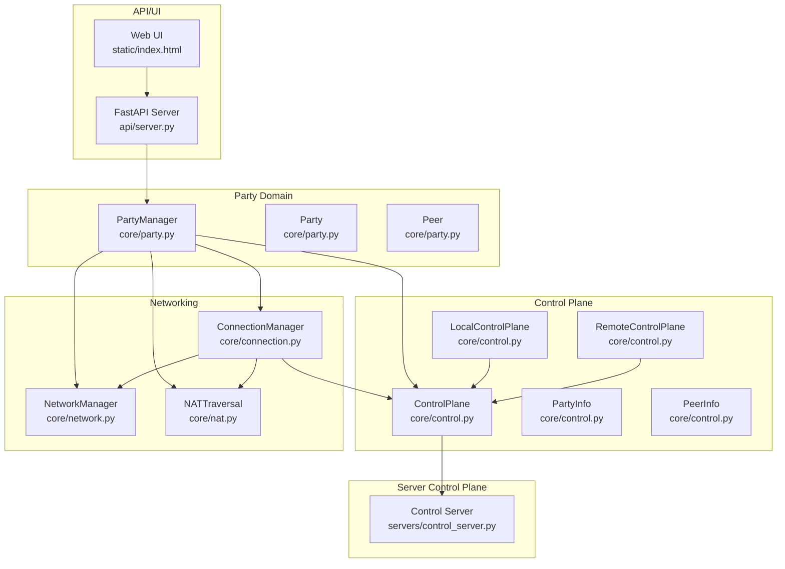

**Diagram sources**
- [core/party.py](file://core/party.py#L102-L304)
- [core/control.py](file://core/control.py#L187-L500)
- [core/connection.py](file://core/connection.py#L18-L200)
- [core/nat.py](file://core/nat.py#L41-L106)
- [core/network.py](file://core/network.py#L25-L95)
- [api/server.py](file://api/server.py#L155-L186)
- [static/index.html](file://static/index.html#L1191-L1252)
- [servers/control_server.py](file://servers/control_server.py#L1-L200)

**Section sources**
- [core/party.py](file://core/party.py#L1-L304)
- [core/control.py](file://core/control.py#L187-L500)
- [core/connection.py](file://core/connection.py#L18-L200)
- [core/nat.py](file://core/nat.py#L41-L106)
- [core/network.py](file://core/network.py#L25-L95)
- [api/server.py](file://api/server.py#L155-L186)
- [static/index.html](file://static/index.html#L1191-L1252)
- [servers/control_server.py](file://servers/control_server.py#L1-L200)

## Core Components
- Party: A virtual LAN with metadata, host identification, creation timestamp, and a collection of peers.
- Peer: A participant with identity, cryptographic key, virtual IP, endpoint, latency, connection type, NAT type, and join timestamp.
- PartyManager: Orchestrates NAT initialization, control plane registration, party creation/join/leave, and status reporting.
- ControlPlane: Stores and synchronizes party state, supports discovery, heartbeats, and cleanup of stale entries.
- ConnectionManager: Establishes and monitors peer connections, coordinates NAT traversal strategies, and manages WireGuard peers.
- NATTraversal: Detects NAT type and enables traversal strategies.
- NetworkManager: Manages WireGuard interface, keys, and latency measurements.
- API/UI: Exposes endpoints for create/join/leave and integrates with the web UI.

**Section sources**
- [core/party.py](file://core/party.py#L44-L100)
- [core/party.py](file://core/party.py#L102-L304)
- [core/control.py](file://core/control.py#L187-L330)
- [core/connection.py](file://core/connection.py#L18-L120)
- [core/nat.py](file://core/nat.py#L41-L106)
- [core/network.py](file://core/network.py#L25-L95)
- [api/server.py](file://api/server.py#L155-L186)
- [static/index.html](file://static/index.html#L1191-L1252)

## Architecture Overview
The party system follows a layered architecture:
- UI triggers party actions via API endpoints.
- PartyManager coordinates with ControlPlane for discovery/state and with ConnectionManager for peer connectivity.
- ConnectionManager uses NATTraversal to determine direct vs relay strategies and configures WireGuard via NetworkManager.
- A local or remote ControlPlane persists party state and cleans up stale entries.

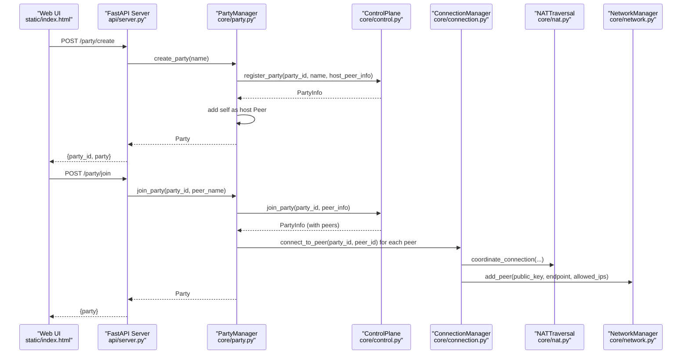

**Diagram sources**
- [api/server.py](file://api/server.py#L155-L186)
- [core/party.py](file://core/party.py#L159-L247)
- [core/control.py](file://core/control.py#L228-L267)
- [core/connection.py](file://core/connection.py#L38-L120)
- [core/nat.py](file://core/nat.py#L64-L106)
- [core/network.py](file://core/network.py#L25-L95)
- [static/index.html](file://static/index.html#L1191-L1252)

## Detailed Component Analysis

### PartyInfo Data Model and Lifecycle
- Party: Contains id, name, host_id, peers dictionary, and created_at timestamp. Provides helper methods to enumerate peers and filter NAT-compatible peers.
- Peer: Encapsulates identity, crypto key, virtual IP, optional endpoint, latency, connection_type, nat_type, and joined_at.
- PartyManager: Initializes NAT and control plane, creates/joins/leaves parties, and reports status including latency and NAT info.

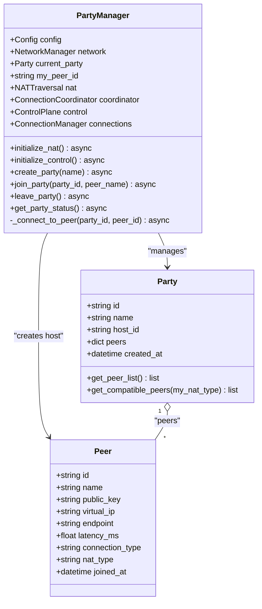

**Diagram sources**
- [core/party.py](file://core/party.py#L44-L100)
- [core/party.py](file://core/party.py#L102-L304)

**Section sources**
- [core/party.py](file://core/party.py#L44-L100)
- [core/party.py](file://core/party.py#L102-L304)
- [docs/PARTY.md](file://docs/PARTY.md#L16-L88)

### Party Discovery and Announcement
- Local discovery: A local-only control plane announces parties via a discovery file for same-LAN testing.
- Remote discovery: A centralized control server maintains persistent state and exposes REST endpoints for create/join/leave.
- Heartbeats: Peers periodically refresh last_seen timestamps to avoid premature cleanup.

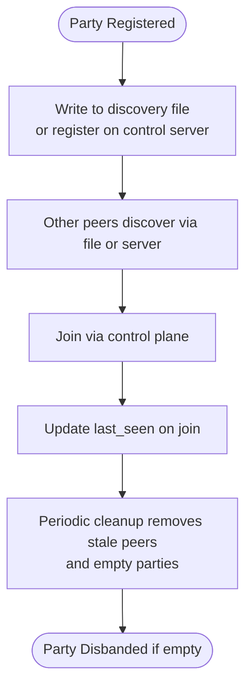

**Diagram sources**
- [core/control.py](file://core/control.py#L470-L539)
- [core/control.py](file://core/control.py#L378-L410)
- [servers/control_server.py](file://servers/control_server.py#L180-L200)

**Section sources**
- [core/control.py](file://core/control.py#L470-L539)
- [core/control.py](file://core/control.py#L378-L410)
- [servers/control_server.py](file://servers/control_server.py#L180-L200)

### Party Membership Management and Role Assignments
- Host: The first peer added to a party becomes the host. The host’s connection_type is “host” and virtual IP is fixed at 10.66.0.1.
- Peers: New members join via control plane, receive peer records, and are connected to existing peers. Connection types reflect strategy: direct, relayed, connecting, failed, unknown.
- Automatic cleanup: Empty parties are deleted; stale peers are pruned by heartbeats and periodic cleanup tasks.

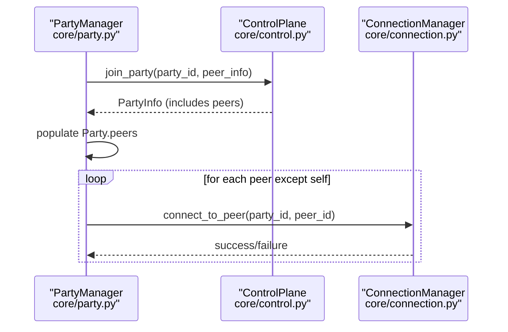

**Diagram sources**
- [core/party.py](file://core/party.py#L198-L247)
- [core/control.py](file://core/control.py#L251-L267)
- [core/connection.py](file://core/connection.py#L38-L120)

**Section sources**
- [core/party.py](file://core/party.py#L168-L176)
- [core/party.py](file://core/party.py#L242-L246)
- [core/party.py](file://core/party.py#L262-L278)
- [docs/PARTY.md](file://docs/PARTY.md#L336-L367)

### Party State Synchronization and Conflict Resolution
- Synchronization: Control plane stores PartyInfo and PeerInfo, serializing/deserializing to/from dictionaries. Local and remote control planes share the same semantics.
- Conflict resolution: Stale peers are removed by heartbeats; empty parties are deleted. Connection failures mark peers as failed and trigger reconnection attempts and eventual cleanup.

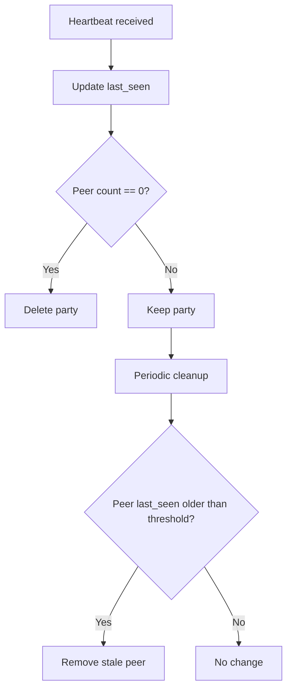

**Diagram sources**
- [core/control.py](file://core/control.py#L362-L377)
- [core/control.py](file://core/control.py#L378-L410)

**Section sources**
- [core/control.py](file://core/control.py#L362-L377)
- [core/control.py](file://core/control.py#L378-L410)

### NAT Compatibility and Connection Strategies
- NAT types are detected and used to determine whether direct P2P connections are feasible.
- ConnectionManager selects strategies (direct or relay) and configures WireGuard accordingly.

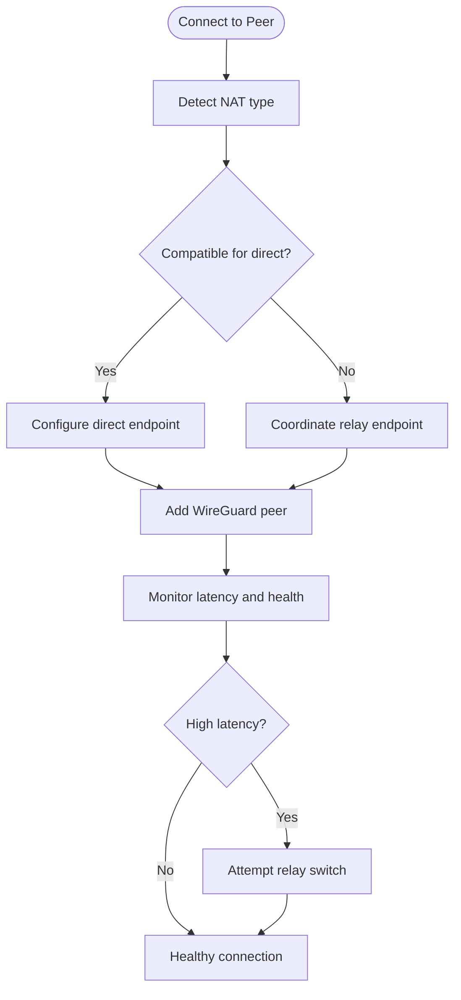

**Diagram sources**
- [core/nat.py](file://core/nat.py#L64-L106)
- [core/connection.py](file://core/connection.py#L38-L120)
- [core/connection.py](file://core/connection.py#L213-L305)
- [core/connection.py](file://core/connection.py#L334-L437)

**Section sources**
- [core/party.py](file://core/party.py#L73-L99)
- [core/nat.py](file://core/nat.py#L19-L41)
- [core/connection.py](file://core/connection.py#L213-L305)

### Party Creation Workflows
- Create party: Generates a unique party ID, registers with control plane, adds self as host, and sets current party.
- Join party: Retrieves party info from control plane, converts to local format, connects to existing peers, and updates status.

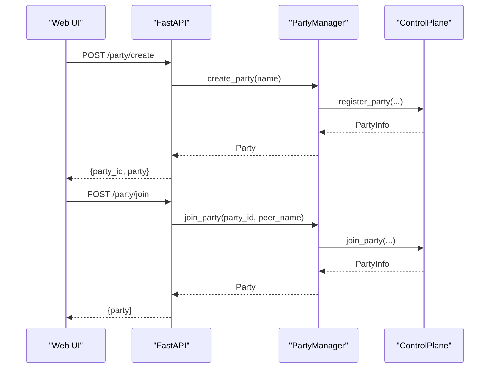

**Diagram sources**
- [api/server.py](file://api/server.py#L155-L186)
- [core/party.py](file://core/party.py#L159-L247)
- [core/control.py](file://core/control.py#L228-L267)
- [static/index.html](file://static/index.html#L1191-L1252)

**Section sources**
- [docs/PARTY.md](file://docs/PARTY.md#L259-L292)
- [docs/PARTY.md](file://docs/PARTY.md#L153-L214)

### Member Coordination and Termination Procedures
- Member coordination: On join, PartyManager initiates connections to all existing peers and updates connection_type upon success or failure.
- Termination: Leaving a party disconnects from peers and invokes control plane leave; if the host leaves or the party becomes empty, it is deleted.

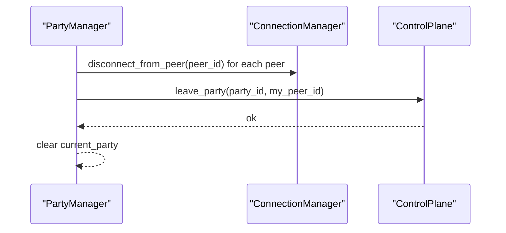

**Diagram sources**
- [core/party.py](file://core/party.py#L249-L261)
- [core/connection.py](file://core/connection.py#L126-L151)
- [core/control.py](file://core/control.py#L269-L293)

**Section sources**
- [core/party.py](file://core/party.py#L249-L261)
- [docs/PARTY.md](file://docs/PARTY.md#L201-L214)

### Security Considerations
- Party IDs: Random 6-byte hex strings, not guessable, invite-only model enforced by control plane.
- Peer authentication: WireGuard public key authentication; no passwords; cryptographic verification reduces MITM risk.
- Access control: Centralized control server supports bearer token authentication for protected endpoints; tokens are stored with expiry and cleaned up periodically.
- Privacy: Membership and endpoints are visible to the control plane; game traffic is end-to-end encrypted via WireGuard.

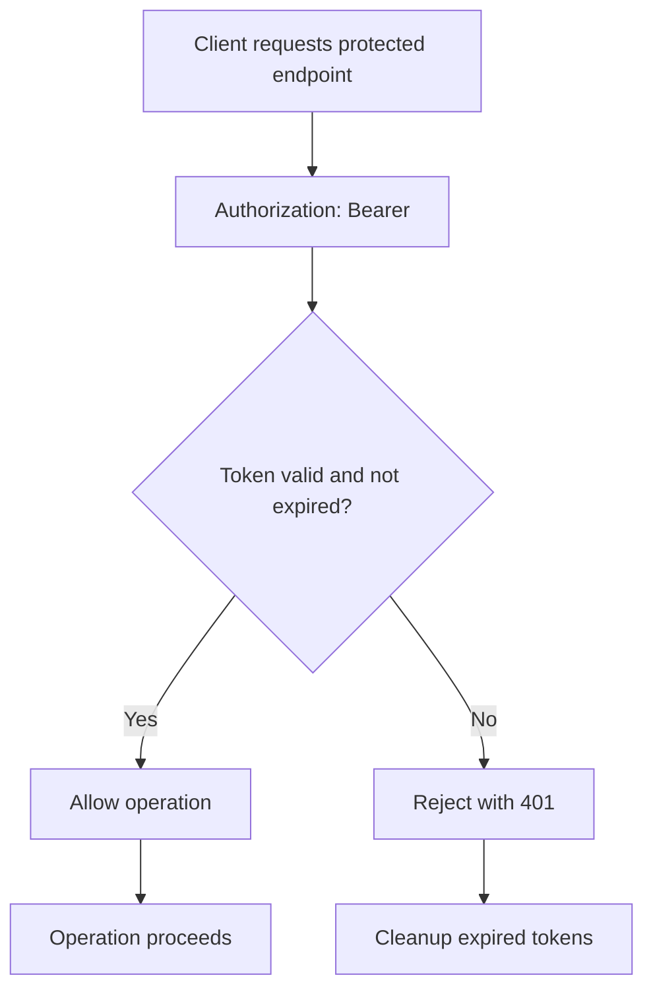

**Diagram sources**
- [servers/control_server.py](file://servers/control_server.py#L147-L178)
- [servers/control_server.py](file://servers/control_server.py#L180-L200)

**Section sources**
- [docs/PARTY.md](file://docs/PARTY.md#L489-L511)
- [servers/control_server.py](file://servers/control_server.py#L147-L178)
- [servers/control_server.py](file://servers/control_server.py#L180-L200)

## Dependency Analysis
The following diagram highlights key dependencies among components involved in party coordination.

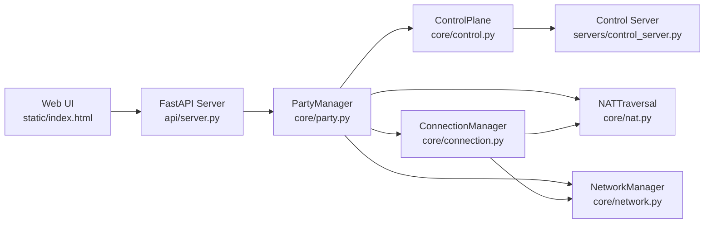

**Diagram sources**
- [core/party.py](file://core/party.py#L102-L158)
- [core/control.py](file://core/control.py#L187-L217)
- [core/connection.py](file://core/connection.py#L18-L36)
- [core/nat.py](file://core/nat.py#L41-L63)
- [core/network.py](file://core/network.py#L25-L41)
- [api/server.py](file://api/server.py#L155-L186)
- [static/index.html](file://static/index.html#L1191-L1252)
- [servers/control_server.py](file://servers/control_server.py#L1-L34)

**Section sources**
- [core/party.py](file://core/party.py#L102-L158)
- [core/control.py](file://core/control.py#L187-L217)
- [core/connection.py](file://core/connection.py#L18-L36)
- [api/server.py](file://api/server.py#L155-L186)

## Performance Considerations
- Party creation: Sub-100 ms with a single control plane round-trip.
- Joining party: 1–3 seconds including control plane join and N peer connection attempts.
- Status updates: Sub-500 ms including latency measurements per peer.
- Background tasks: Connection monitoring and cleanup tasks run periodically to maintain health and reclaim resources.

[No sources needed since this section provides general guidance]

## Troubleshooting Guide
- NAT detection failures: The system falls back to relay-only mode; verify STUN server reachability and firewall settings.
- Join failures: Validate party ID, ensure control plane availability, and confirm peer credentials.
- Connection failures: Inspect connection status, latency, and strategy; failed connections are auto-cleaned after a timeout.
- Cleanup: Empty parties and stale peers are removed by periodic cleanup tasks; ensure heartbeats are sent to keep peers alive.

**Section sources**
- [core/party.py](file://core/party.py#L134-L143)
- [docs/PARTY.md](file://docs/PARTY.md#L435-L467)
- [core/connection.py](file://core/connection.py#L213-L305)
- [core/control.py](file://core/control.py#L378-L410)

## Conclusion
LANrage’s party coordination system provides a robust, NAT-aware framework for multiplayer virtual LANs. It leverages a control plane for discovery and state synchronization, ConnectionManager for connectivity orchestration, and NetworkManager/WireGuard for secure transport. Built-in cleanup and monitoring ensure reliability, while authentication tokens and public key cryptography support security and privacy.

[No sources needed since this section summarizes without analyzing specific files]

## Appendices

### API Endpoints for Party Operations
- POST /party/create: Creates a new party and returns party_id and party metadata.
- POST /party/join: Joins an existing party by ID and returns the updated party.
- POST /party/leave: Leaves the current party.
- GET /status: Returns current party status including peer count and NAT info.

**Section sources**
- [api/server.py](file://api/server.py#L155-L186)
- [api/server.py](file://api/server.py#L146-L153)
- [static/index.html](file://static/index.html#L1191-L1252)

### Practical Examples
- Creating a party: Use the UI form or call POST /party/create with a party name.
- Joining a party: Use the UI form or call POST /party/join with party_id and peer_name.
- Leaving a party: Call POST /party/leave or use the UI action.

**Section sources**
- [docs/PARTY.md](file://docs/PARTY.md#L153-L214)
- [static/index.html](file://static/index.html#L1191-L1252)

### Tests and Validation
- Unit tests validate NAT compatibility filtering and peer model attributes.
- Multi-peer tests exercise party creation and NAT type propagation.

**Section sources**
- [tests/test_party.py](file://tests/test_party.py#L43-L149)
- [tests/test_party.py](file://tests/test_party.py#L160-L196)