# Peer Management

<cite>
**Referenced Files in This Document**
- [core/control.py](file://core/control.py)
- [core/control_client.py](file://core/control_client.py)
- [core/party.py](file://core/party.py)
- [core/connection.py](file://core/connection.py)
- [core/nat.py](file://core/nat.py)
- [core/network.py](file://core/network.py)
- [core/ipam.py](file://core/ipam.py)
- [core/config.py](file://core/config.py)
- [servers/control_server.py](file://servers/control_server.py)
- [docs/CONNECTION.md](file://docs/CONNECTION.md)
- [tests/test_party.py](file://tests/test_party.py)
- [tests/test_nat.py](file://tests/test_nat.py)
</cite>

## Table of Contents
1. [Introduction](#introduction)
2. [Project Structure](#project-structure)
3. [Core Components](#core-components)
4. [Architecture Overview](#architecture-overview)
5. [Detailed Component Analysis](#detailed-component-analysis)
6. [Dependency Analysis](#dependency-analysis)
7. [Performance Considerations](#performance-considerations)
8. [Troubleshooting Guide](#troubleshooting-guide)
9. [Conclusion](#conclusion)
10. [Appendices](#appendices)

## Introduction
This document describes the peer management subsystem within LANrage’s control plane. It covers the PeerInfo data structure, peer lifecycle (registration, authentication, updates, removal), peer discovery, NAT-based connectivity strategies, and state persistence. It also documents the trust model, validation mechanisms, and synchronization patterns across multiple clients.

## Project Structure
The peer management subsystem spans several modules:
- Control plane: peer registry, discovery, and persistence
- Control plane client: HTTP-based client for centralized control plane
- Party management: high-level party orchestration and NAT compatibility
- Connection management: NAT traversal coordination, WireGuard integration, and connection monitoring
- NAT traversal: STUN-based detection, hole punching, and relay selection
- Network: WireGuard interface management and latency measurement
- IPAM: virtual IP allocation for peers
- Configuration: runtime settings and defaults

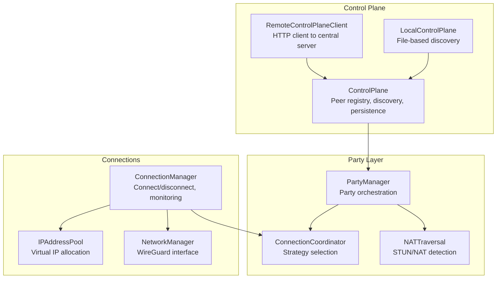

**Diagram sources**
- [core/control.py](file://core/control.py#L115-L425)
- [core/control_client.py](file://core/control_client.py#L23-L438)
- [core/party.py](file://core/party.py#L102-L304)
- [core/connection.py](file://core/connection.py#L18-L493)
- [core/nat.py](file://core/nat.py#L41-L525)
- [core/network.py](file://core/network.py#L25-L515)
- [core/ipam.py](file://core/ipam.py#L10-L183)

**Section sources**
- [core/control.py](file://core/control.py#L1-L880)
- [core/control_client.py](file://core/control_client.py#L1-L438)
- [core/party.py](file://core/party.py#L1-L304)
- [core/connection.py](file://core/connection.py#L1-L493)
- [core/nat.py](file://core/nat.py#L1-L525)
- [core/network.py](file://core/network.py#L1-L515)
- [core/ipam.py](file://core/ipam.py#L1-L183)
- [core/config.py](file://core/config.py#L1-L114)

## Core Components
- PeerInfo: Encapsulates peer identity and network metadata, including NAT type and last-seen timestamp. Provides validation and serialization helpers.
- ControlPlane: Central registry for parties and peers, with persistence and cleanup.
- RemoteControlPlaneClient: HTTP client for centralized control plane, including authentication and heartbeat.
- PartyManager: Party orchestration, NAT initialization, and peer compatibility checks.
- ConnectionManager: Orchestrates peer connections, NAT strategy selection, WireGuard configuration, and monitoring.
- NATTraversal and ConnectionCoordinator: NAT detection, hole punching, and relay selection.
- NetworkManager: WireGuard interface lifecycle and latency measurement.
- IPAddressPool: Virtual IP allocation for peers.

**Section sources**
- [core/control.py](file://core/control.py#L115-L191)
- [core/control.py](file://core/control.py#L187-L456)
- [core/control_client.py](file://core/control_client.py#L23-L438)
- [core/party.py](file://core/party.py#L44-L100)
- [core/connection.py](file://core/connection.py#L18-L493)
- [core/nat.py](file://core/nat.py#L41-L525)
- [core/network.py](file://core/network.py#L25-L515)
- [core/ipam.py](file://core/ipam.py#L10-L183)

## Architecture Overview
The peer management architecture integrates discovery, NAT traversal, and transport setup. The control plane maintains peer state and synchronizes it across clients. Parties are virtual LANs; peers exchange NAT information to determine direct or relay connectivity. WireGuard is used for secure transport, with NAT traversal enabling direct P2P when possible.

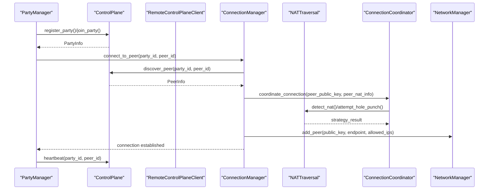

**Diagram sources**
- [core/party.py](file://core/party.py#L159-L247)
- [core/control.py](file://core/control.py#L228-L310)
- [core/connection.py](file://core/connection.py#L38-L125)
- [core/nat.py](file://core/nat.py#L330-L398)
- [core/network.py](file://core/network.py#L392-L420)

**Section sources**
- [docs/CONNECTION.md](file://docs/CONNECTION.md#L248-L276)
- [core/party.py](file://core/party.py#L159-L247)
- [core/connection.py](file://core/connection.py#L38-L125)
- [core/nat.py](file://core/nat.py#L330-L398)

## Detailed Component Analysis

### PeerInfo Data Structure
PeerInfo captures:
- Identity: peer_id, name, public_key
- Network: public_ip, public_port, local_ip, local_port
- NAT: nat_type
- Timestamp: last_seen

Validation ensures nat_type is a known enum value. Serialization supports round-trip conversion to/from dictionaries.

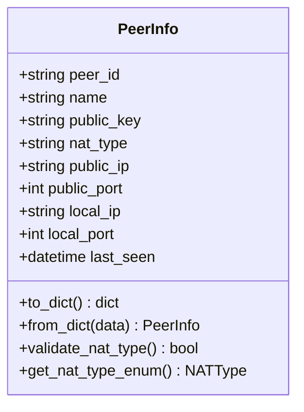

**Diagram sources**
- [core/control.py](file://core/control.py#L115-L152)

**Section sources**
- [core/control.py](file://core/control.py#L115-L152)

### Control Plane: Registration, Discovery, Updates, Removal
- Registration: Host registers party and self via ControlPlane.register_party; state is persisted.
- Joining: Clients call join_party; peer is added to party.
- Discovery: discover_peer retrieves a specific peer by ID.
- Updates: update_peer refreshes last_seen and persists state.
- Heartbeat: heartbeat updates last_seen for liveness.
- Cleanup: periodic task removes stale peers and empty parties.
- Persistence: StatePersister batches writes to reduce disk I/O.

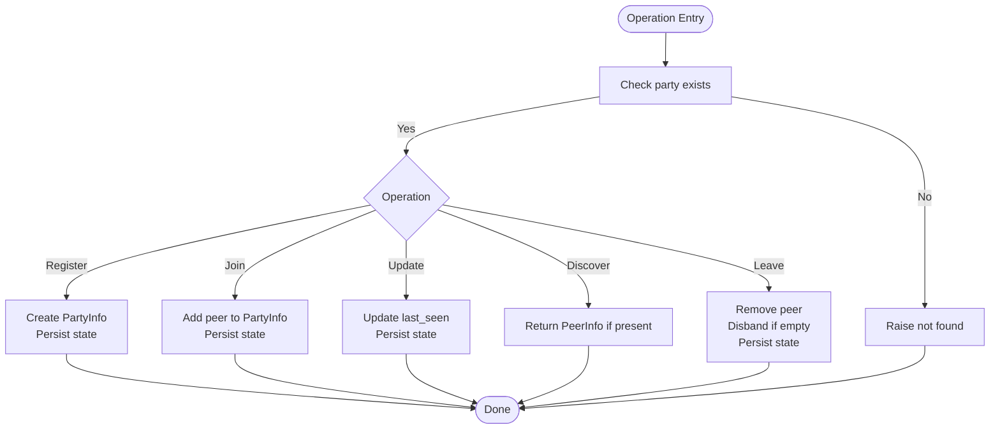

**Diagram sources**
- [core/control.py](file://core/control.py#L228-L310)
- [core/control.py](file://core/control.py#L378-L410)
- [core/control.py](file://core/control.py#L411-L456)

**Section sources**
- [core/control.py](file://core/control.py#L228-L310)
- [core/control.py](file://core/control.py#L362-L377)
- [core/control.py](file://core/control.py#L378-L410)
- [core/control.py](file://core/control.py#L411-L456)

### Authentication and Trust Model
- Authentication: RemoteControlPlaneClient.register_peer obtains a bearer token from the control server.
- Authorization: verify_token validates tokens stored in the server-side database and enforces expiration.
- Trust: Only authenticated peers can create/join parties and exchange signaling. Tokens are short-lived.

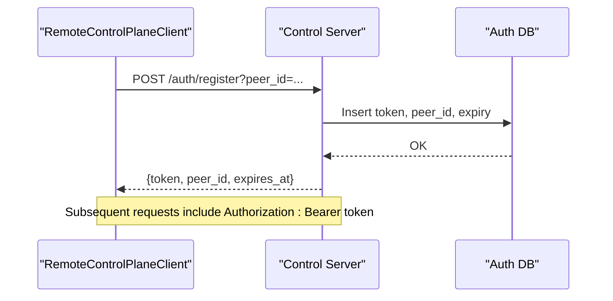

**Diagram sources**
- [core/control_client.py](file://core/control_client.py#L161-L190)
- [servers/control_server.py](file://servers/control_server.py#L267-L289)
- [servers/control_server.py](file://servers/control_server.py#L147-L178)

**Section sources**
- [core/control_client.py](file://core/control_client.py#L161-L190)
- [servers/control_server.py](file://servers/control_server.py#L147-L178)
- [servers/control_server.py](file://servers/control_server.py#L267-L289)

### Peer Discovery Mechanism
- Local discovery: LocalControlPlane announces parties to a shared discovery file and reads it to list parties.
- Centralized discovery: RemoteControlPlaneClient lists parties and peers via HTTP endpoints.

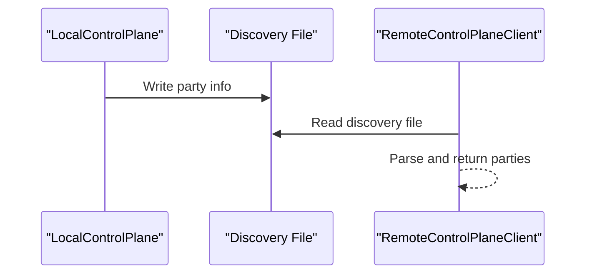

**Diagram sources**
- [core/control.py](file://core/control.py#L481-L538)
- [core/control_client.py](file://core/control_client.py#L316-L332)

**Section sources**
- [core/control.py](file://core/control.py#L513-L538)
- [core/control_client.py](file://core/control_client.py#L316-L332)

### Peer-to-Peer Communication Patterns and NAT Validation
- NAT detection: STUN queries reveal public/private endpoints and NAT type classification.
- Strategy selection: Direct P2P via hole punching when compatible; otherwise relay.
- Relay discovery: Query control plane for relays, measure latency, select best.

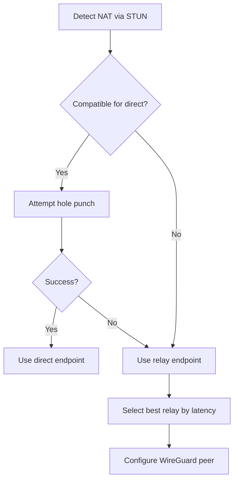

**Diagram sources**
- [core/nat.py](file://core/nat.py#L64-L106)
- [core/nat.py](file://core/nat.py#L244-L294)
- [core/nat.py](file://core/nat.py#L323-L369)
- [core/nat.py](file://core/nat.py#L379-L455)

**Section sources**
- [core/nat.py](file://core/nat.py#L64-L106)
- [core/nat.py](file://core/nat.py#L244-L294)
- [core/nat.py](file://core/nat.py#L323-L369)
- [core/nat.py](file://core/nat.py#L379-L455)

### Peer Lifecycle Management and Automatic Cleanup
- Heartbeat keeps peers alive; last_seen is updated.
- Cleanup task runs periodically to remove stale peers (>5 minutes) and empty parties.
- State persistence uses a write-behind cache to batch writes.

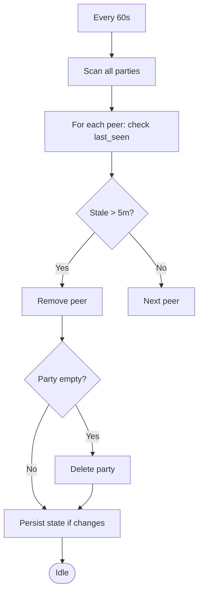

**Diagram sources**
- [core/control.py](file://core/control.py#L378-L410)
- [core/control.py](file://core/control.py#L411-L425)

**Section sources**
- [core/control.py](file://core/control.py#L378-L410)
- [core/control.py](file://core/control.py#L411-L425)

### Peer Validation System and NAT Compatibility
- NAT type validation: PeerInfo.validate_nat_type ensures nat_type is a known enum.
- Compatibility matrix: Party.get_compatible_peers determines which peers can connect directly based on NAT types.
- Tests validate compatibility for various NAT combinations.

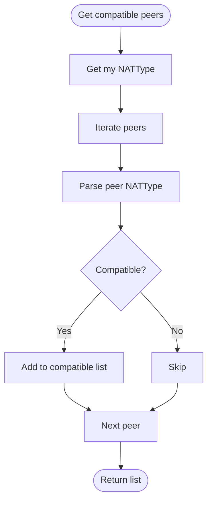

**Diagram sources**
- [core/party.py](file://core/party.py#L73-L99)
- [tests/test_party.py](file://tests/test_party.py#L48-L149)

**Section sources**
- [core/control.py](file://core/control.py#L141-L152)
- [core/party.py](file://core/party.py#L73-L99)
- [tests/test_party.py](file://tests/test_party.py#L48-L149)

### Practical Examples

#### Example 1: Peer Registration Flow
- Host initializes NAT and control plane, creates a Party, and registers with ControlPlane.
- ControlPlane persists state and tracks my_peer_id/my_party_id.

**Section sources**
- [core/party.py](file://core/party.py#L159-L196)
- [core/control.py](file://core/control.py#L228-L249)

#### Example 2: Peer Update Flow
- Peer calls heartbeat to refresh last_seen.
- ControlPlane.update_peer updates last_seen and persists state.

**Section sources**
- [core/control.py](file://core/control.py#L362-L377)
- [core/control.py](file://core/control.py#L295-L309)

#### Example 3: Peer Removal Scenario
- Peer leaves party; ControlPlane.leave_party removes peer and disbands party if empty.
- ConnectionManager.disconnect_from_peer tears down WireGuard peer and releases virtual IP.

**Section sources**
- [core/control.py](file://core/control.py#L269-L294)
- [core/connection.py](file://core/connection.py#L126-L151)
- [core/connection.py](file://core/connection.py#L200-L212)

### Peer State Persistence and Synchronization
- StatePersister batches writes with a 100ms interval, deduplicating rapid updates and writing atomically.
- ControlPlane saves parties, my_peer_id, and my_party_id; loads on startup.
- RemoteControlPlaneClient heartbeats keep sessions alive; server cleans up expired tokens.

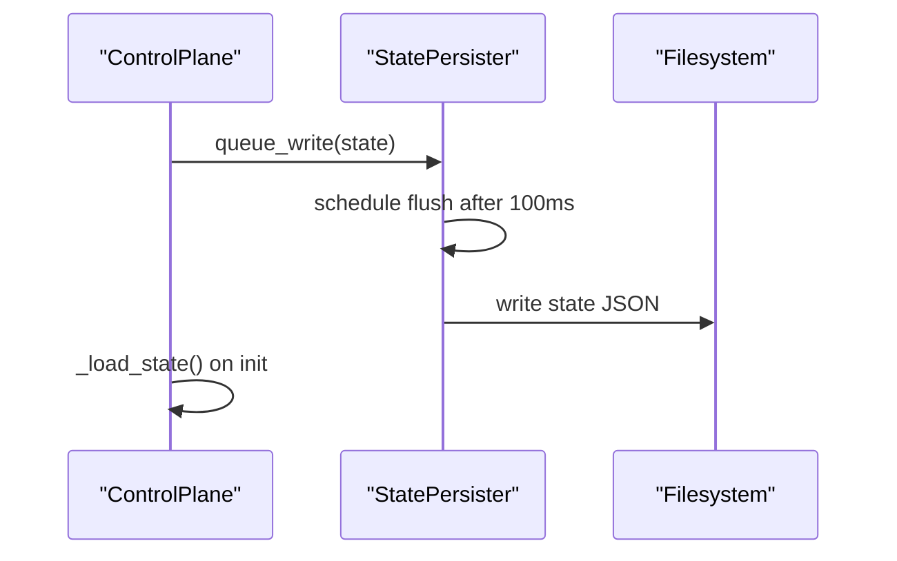

**Diagram sources**
- [core/control.py](file://core/control.py#L19-L113)
- [core/control.py](file://core/control.py#L411-L456)
- [core/control.py](file://core/control.py#L426-L456)

**Section sources**
- [core/control.py](file://core/control.py#L19-L113)
- [core/control.py](file://core/control.py#L411-L456)

## Dependency Analysis
Key dependencies and interactions:
- ControlPlane depends on PeerInfo and PartyInfo for state representation.
- PartyManager depends on ControlPlane, NATTraversal, and ConnectionCoordinator.
- ConnectionManager depends on ControlPlane, NATTraversal, ConnectionCoordinator, and NetworkManager.
- NATTraversal depends on configuration and optionally control client for relay discovery.
- NetworkManager manages WireGuard lifecycle and latency measurement.
- IPAM provides deterministic virtual IP allocation.

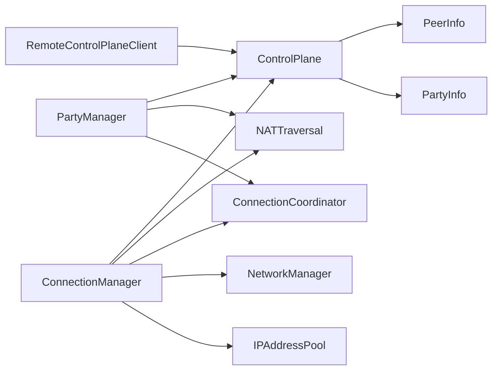

**Diagram sources**
- [core/control.py](file://core/control.py#L115-L191)
- [core/party.py](file://core/party.py#L102-L120)
- [core/connection.py](file://core/connection.py#L18-L36)
- [core/nat.py](file://core/nat.py#L41-L63)
- [core/network.py](file://core/network.py#L25-L41)
- [core/ipam.py](file://core/ipam.py#L10-L28)

**Section sources**
- [core/control.py](file://core/control.py#L115-L191)
- [core/party.py](file://core/party.py#L102-L120)
- [core/connection.py](file://core/connection.py#L18-L36)
- [core/nat.py](file://core/nat.py#L41-L63)
- [core/network.py](file://core/network.py#L25-L41)
- [core/ipam.py](file://core/ipam.py#L10-L28)

## Performance Considerations
- Batched persistence: StatePersister reduces disk I/O by queuing writes and flushing after a short interval.
- Connection monitoring: ConnectionManager measures latency periodically and triggers reconnection or relay switching.
- NAT strategy: Direct connections preferred when possible; relay switching improves latency dynamically.
- IPAM scalability: Subnet expansion allows growth within base network boundaries.

[No sources needed since this section provides general guidance]

## Troubleshooting Guide
Common issues and resolutions:
- NAT detection failures: Check firewall, test STUN reachability, retry on different networks.
- Hole punching failures: Expect fallback to relay; verify router settings.
- Relay performance: Use ConnectionCoordinator’s relay discovery and latency measurement to select better relays.
- Stale peers: Cleanup task removes peers inactive for more than 5 minutes; ensure heartbeats are sent.
- Authentication errors: Verify token validity and expiration; regenerate tokens as needed.

**Section sources**
- [core/nat.py](file://core/nat.py#L488-L525)
- [core/nat.py](file://core/nat.py#L500-L525)
- [core/connection.py](file://core/connection.py#L213-L305)
- [core/control.py](file://core/control.py#L378-L410)
- [servers/control_server.py](file://servers/control_server.py#L147-L178)

## Conclusion
The peer management subsystem integrates discovery, NAT traversal, and transport setup to enable seamless peer-to-peer connectivity. It provides robust state persistence, automatic cleanup, and a clear trust model via authentication. The modular design allows local and centralized operation, with graceful fallbacks to relay-based connectivity when direct P2P is not possible.

## Appendices

### Appendix A: NAT Compatibility Matrix
- Open: Compatible with all types
- Full cone: Compatible with Open, Full cone, Restricted cone, Port-restricted cone
- Restricted cone: Compatible with Open, Full cone, Restricted cone
- Port-restricted cone: Compatible with Open, Full cone
- Symmetric: Only compatible with Open
- Unknown: Requires relay

**Section sources**
- [core/party.py](file://core/party.py#L18-L41)
- [tests/test_party.py](file://tests/test_party.py#L48-L149)

### Appendix B: Configuration Defaults
- Virtual subnet: 10.66.0.0/16
- Interface name: lanrage0
- API host/port: 127.0.0.1:8666
- WireGuard keepalive: 25 seconds
- Control server: https://control.lanrage.io
- Relay port: 51820
- Max clients (relay mode): 100

**Section sources**
- [core/config.py](file://core/config.py#L17-L48)