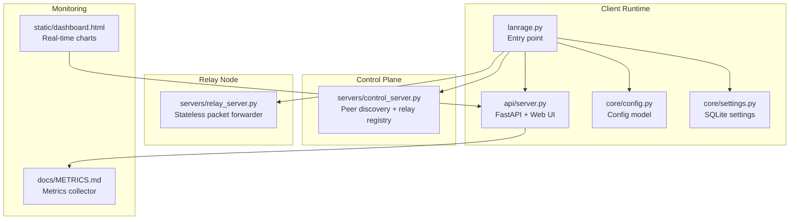
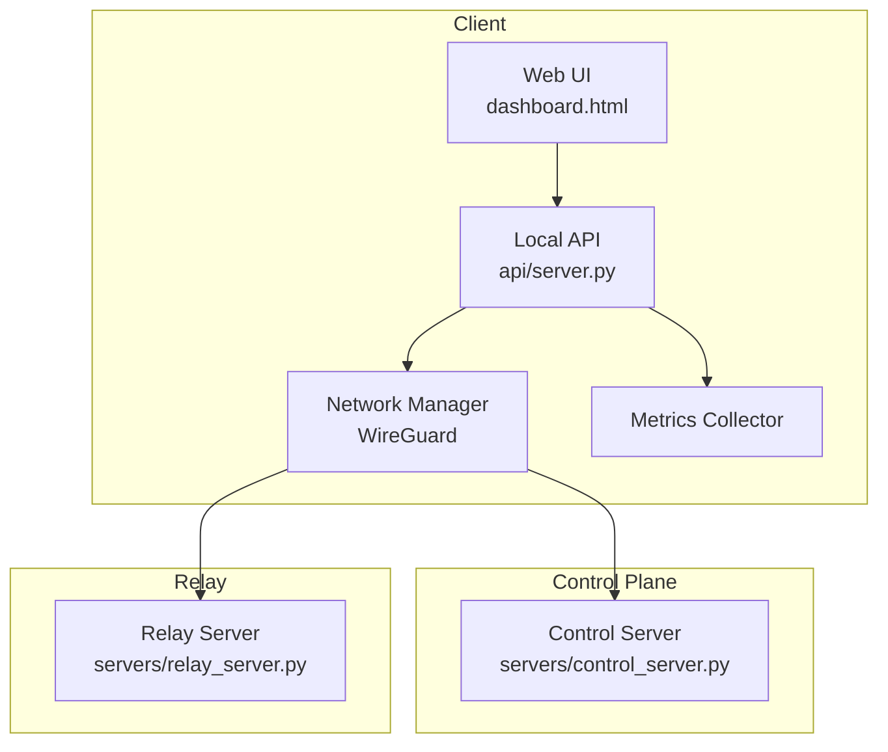
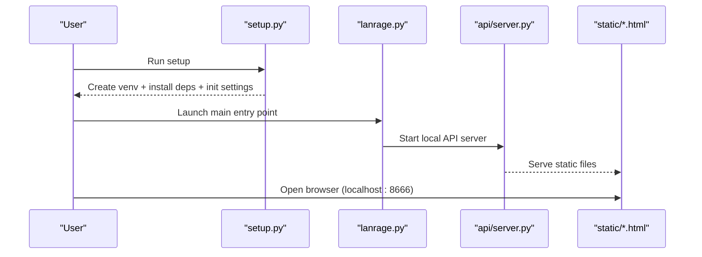
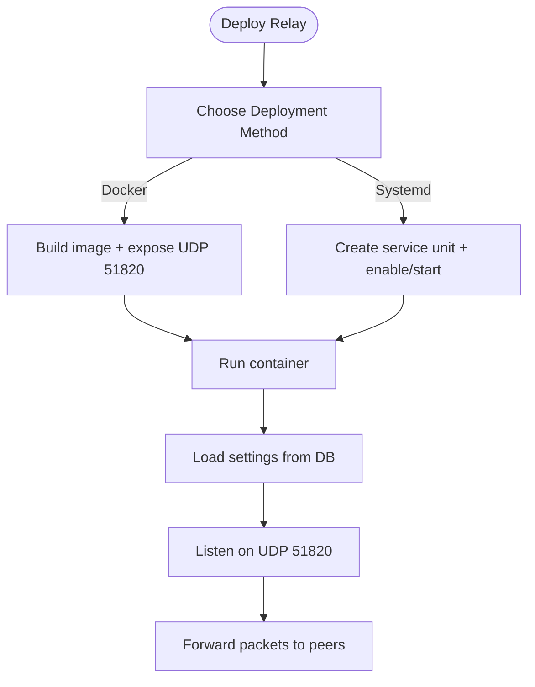
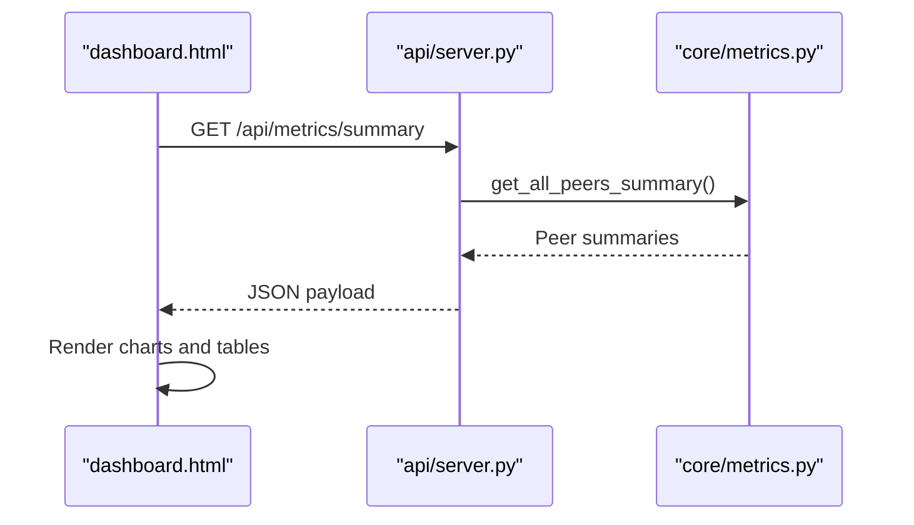
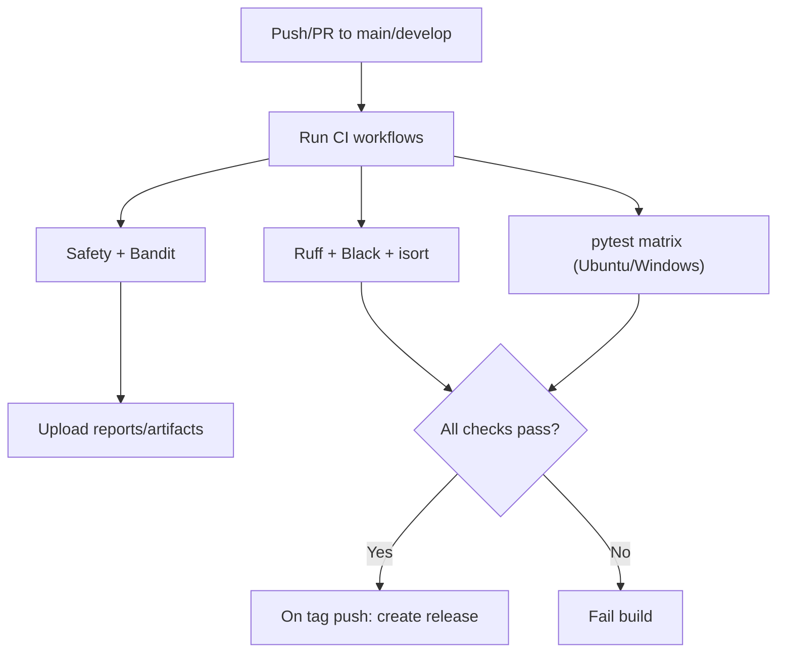
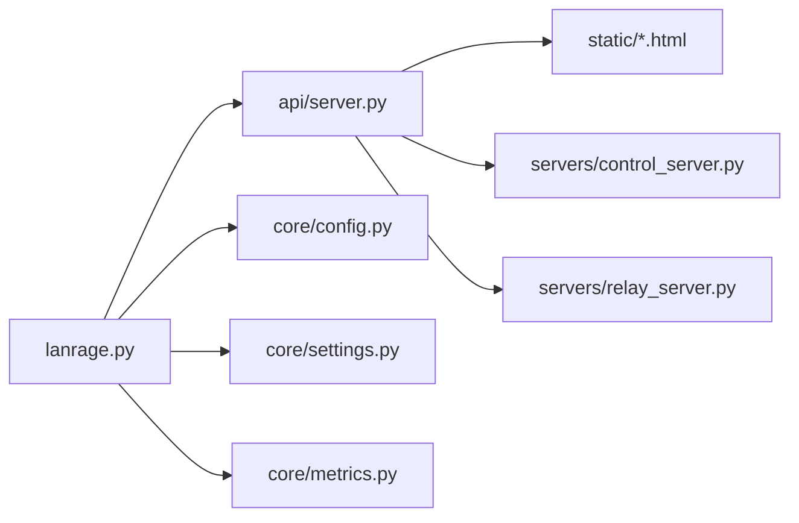

# Deployment Topology

<cite>
**Referenced Files in This Document**
- [README.md](file://README.md)
- [ARCHITECTURE.md](file://docs/ARCHITECTURE.md)
- [RELAY_SERVER.md](file://docs/RELAY_SERVER.md)
- [CI_CD.md](file://docs/CI_CD.md)
- [METRICS.md](file://docs/METRICS.md)
- [lanrage.py](file://lanrage.py)
- [setup.py](file://setup.py)
- [requirements.txt](file://requirements.txt)
- [config.py](file://core/config.py)
- [settings.py](file://core/settings.py)
- [server.py](file://api/server.py)
- [control_server.py](file://servers/control_server.py)
- [relay_server.py](file://servers/relay_server.py)
- [dashboard.html](file://static/dashboard.html)
- [index.html](file://static/index.html)
- [ROADMAP.md](file://docs/ROADMAP.md)
</cite>

## Table of Contents
1. [Introduction](#introduction)
2. [Project Structure](#project-structure)
3. [Core Components](#core-components)
4. [Architecture Overview](#architecture-overview)
5. [Detailed Component Analysis](#detailed-component-analysis)
6. [Dependency Analysis](#dependency-analysis)
7. [Performance Considerations](#performance-considerations)
8. [Troubleshooting Guide](#troubleshooting-guide)
9. [Conclusion](#conclusion)
10. [Appendices](#appendices)

## Introduction
This document describes LANrage’s deployment architecture and infrastructure topology. It covers the client deployment model (standalone executables, auto-updates, and local web UI), relay node deployment options (Docker, systemd, minimal dependencies), scalability from single relay deployments to geographic relay pools with anycast routing, monitoring and observability (latency graphs, connection tracking, bandwidth usage), deployment automation and CI/CD integration, infrastructure requirements and capacity planning, high availability and disaster recovery, and maintenance procedures. It also outlines future roadmap items including IPv6 support and enhanced UI architecture.

## Project Structure
LANrage is organized around a modular Python application with:
- A client runtime that initializes the network stack, control plane, metrics, Discord integration, and a local FastAPI server hosting the web UI.
- A relay server process that forwards encrypted WireGuard packets statelessly.
- A centralized control plane server for peer discovery and relay registration.
- A metrics subsystem with a REST API and a built-in dashboard.
- CI/CD workflows for quality gates and automated releases.



**Diagram sources**
- [lanrage.py](file://lanrage.py#L1-L230)
- [server.py](file://api/server.py#L1-L701)
- [config.py](file://core/config.py#L1-L114)
- [settings.py](file://core/settings.py#L1-L525)
- [control_server.py](file://servers/control_server.py#L1-L729)
- [relay_server.py](file://servers/relay_server.py#L1-L297)
- [METRICS.md](file://docs/METRICS.md#L1-L593)
- [dashboard.html](file://static/dashboard.html#L1-L587)

**Section sources**
- [README.md](file://README.md#L1-L376)
- [ARCHITECTURE.md](file://docs/ARCHITECTURE.md#L1-L206)

## Core Components
- Client runtime: Orchestrates network initialization, party management, NAT traversal, metrics, Discord integration, and starts the local API server.
- Local API server: Serves the web UI and exposes REST endpoints for party management, server browser, settings, and metrics.
- Settings database: SQLite-backed configuration and user preferences.
- Control plane server: Centralized peer discovery, party registry, and relay server registry.
- Relay server: Stateless UDP packet forwarder for NAT traversal.
- Metrics system: In-memory collectors for peer latency, bandwidth, system resources, and game sessions.
- Web UI: HTML/CSS/JS dashboards served by the local API server.

**Section sources**
- [lanrage.py](file://lanrage.py#L1-L230)
- [server.py](file://api/server.py#L1-L701)
- [settings.py](file://core/settings.py#L1-L525)
- [control_server.py](file://servers/control_server.py#L1-L729)
- [relay_server.py](file://servers/relay_server.py#L1-L297)
- [METRICS.md](file://docs/METRICS.md#L1-L593)

## Architecture Overview
LANrage separates concerns into a control plane (peer discovery and relay registry) and a data plane (WireGuard tunnels). Clients run locally with a web UI and metrics, optionally connecting to a centralized control plane. When direct P2P is not possible, clients fall back to relay nodes. The relay server is stateless and forwards encrypted packets.



**Diagram sources**
- [index.html](file://static/index.html#L1-L800)
- [dashboard.html](file://static/dashboard.html#L1-L587)
- [server.py](file://api/server.py#L1-L701)
- [control_server.py](file://servers/control_server.py#L1-L729)
- [relay_server.py](file://servers/relay_server.py#L1-L297)

**Section sources**
- [ARCHITECTURE.md](file://docs/ARCHITECTURE.md#L1-L206)

## Detailed Component Analysis

### Client Deployment Model
- Standalone executables: The project provides a setup script and a main entry point. The setup script initializes a virtual environment, installs dependencies, and prepares the settings database. The main entry point initializes the network, control plane, metrics, Discord integration, and starts the local API server.
- Auto-updates: The repository does not include an explicit auto-update mechanism. Users can re-run the setup script to refresh dependencies and configuration.
- Local web UI: The local API server serves static assets (HTML/CSS/JS) and provides REST endpoints for metrics and party management.



**Diagram sources**
- [setup.py](file://setup.py#L1-L100)
- [lanrage.py](file://lanrage.py#L1-L230)
- [server.py](file://api/server.py#L1-L701)
- [index.html](file://static/index.html#L1-L800)

**Section sources**
- [setup.py](file://setup.py#L1-L100)
- [lanrage.py](file://lanrage.py#L1-L230)
- [server.py](file://api/server.py#L1-L701)

### Relay Node Deployment Options
- Docker container: The relay server can be containerized with a minimal Dockerfile exposing the WireGuard UDP port.
- Systemd service: The relay server can be deployed as a systemd unit with restart policies.
- Minimal dependencies: The relay server relies on Python and asyncio; it does not require a GUI or heavy frameworks.
- Configuration: The relay server reads settings from the shared settings database and supports environment overrides.



**Diagram sources**
- [RELAY_SERVER.md](file://docs/RELAY_SERVER.md#L278-L301)
- [RELAY_SERVER.md](file://docs/RELAY_SERVER.md#L251-L276)
- [relay_server.py](file://servers/relay_server.py#L258-L297)

**Section sources**
- [RELAY_SERVER.md](file://docs/RELAY_SERVER.md#L278-L301)
- [RELAY_SERVER.md](file://docs/RELAY_SERVER.md#L251-L276)
- [relay_server.py](file://servers/relay_server.py#L258-L297)

### Scalability Architecture
- Single relay: Supports moderate concurrency and throughput suitable for small LAN parties.
- Relay pool: Geographic distribution with anycast routing to reduce latency and increase resilience.
- Control plane: Centralized registry of peers and relays; can evolve to a remote control plane in future versions.

```mermaid
graph TB
subgraph "Clients"
C1["Client A"]
C2["Client B"]
end
subgraph "Regional Relays"
R1["Relay 1<br/>Region A"]
R2["Relay 2<br/>Region B"]
end
subgraph "Anycast"
ANY["Anycast DNS/anyCAST"]
end
C1 --> ANY
ANY --> R1
ANY --> R2
R1 <- --> R2
C2 --> ANY
```

**Diagram sources**
- [ARCHITECTURE.md](file://docs/ARCHITECTURE.md#L161-L172)
- [RELAY_SERVER.md](file://docs/RELAY_SERVER.md#L334-L361)

**Section sources**
- [ARCHITECTURE.md](file://docs/ARCHITECTURE.md#L161-L172)
- [RELAY_SERVER.md](file://docs/RELAY_SERVER.md#L334-L361)

### Monitoring and Observability
- Metrics collector: Tracks peer latency, bandwidth, system CPU/memory, and game sessions. Provides REST endpoints for summaries and histories.
- Web dashboard: Real-time charts for system performance and bandwidth, plus peer and session listings.
- Logging: Relay server prints periodic stats and cleanup events; clients log initialization and shutdown.



**Diagram sources**
- [dashboard.html](file://static/dashboard.html#L420-L479)
- [server.py](file://api/server.py#L191-L201)
- [METRICS.md](file://docs/METRICS.md#L460-L513)

**Section sources**
- [METRICS.md](file://docs/METRICS.md#L1-L593)
- [server.py](file://api/server.py#L191-L276)
- [dashboard.html](file://static/dashboard.html#L1-L587)

### Deployment Automation and CI/CD
- GitHub Actions workflows enforce strict code quality, run tests across matrix platforms, and automate releases on version tags.
- Quality gates include linting, formatting, import sorting, security scanning, and coverage thresholds.
- Release automation builds distribution packages and publishes GitHub Releases.



**Diagram sources**
- [CI_CD.md](file://docs/CI_CD.md#L9-L77)
- [CI_CD.md](file://docs/CI_CD.md#L32-L48)
- [CI_CD.md](file://docs/CI_CD.md#L54-L66)

**Section sources**
- [CI_CD.md](file://docs/CI_CD.md#L1-L265)

### Infrastructure Requirements and Capacity Planning
- Client: Lightweight; primarily depends on OS network stack and Python runtime.
- Relay node: CPU and network I/O dominate; designed to scale linearly with cores. Typical VPS specs recommended for moderate to high traffic.
- Control plane: SQLite-backed; lightweight but should be monitored for disk and connection limits.

**Section sources**
- [RELAY_SERVER.md](file://docs/RELAY_SERVER.md#L425-L440)
- [RELAY_SERVER.md](file://docs/RELAY_SERVER.md#L334-L361)
- [control_server.py](file://servers/control_server.py#L37-L98)

### High Availability and Disaster Recovery
- Relay HA: Stateless relays can be horizontally scaled; use anycast or DNS round-robin to distribute clients across multiple instances.
- Control plane HA: Centralized control plane can be replicated or migrated; ensure backups of SQLite databases and consider failover mechanisms.
- Client resilience: Graceful shutdown and cleanup of network interfaces; metrics and settings persisted in local database.

**Section sources**
- [RELAY_SERVER.md](file://docs/RELAY_SERVER.md#L384-L388)
- [lanrage.py](file://lanrage.py#L170-L216)

### Maintenance Procedures
- Routine: Monitor relay stats, clean up stale clients, and review logs.
- Upgrades: Re-run setup script to refresh dependencies; restart services as needed.
- Backups: Use the settings database backup helper to preserve configuration and user preferences.

**Section sources**
- [RELAY_SERVER.md](file://docs/RELAY_SERVER.md#L305-L317)
- [settings.py](file://core/settings.py#L408-L431)
- [setup.py](file://setup.py#L76-L83)

## Dependency Analysis
The client runtime depends on the API server, configuration, settings, metrics, and network managers. The API server serves static assets and exposes endpoints for party management, server browser, Discord integration, and metrics. The control plane and relay servers are separate processes that integrate via the settings database and configuration.



**Diagram sources**
- [lanrage.py](file://lanrage.py#L1-L230)
- [server.py](file://api/server.py#L1-L701)
- [config.py](file://core/config.py#L1-L114)
- [settings.py](file://core/settings.py#L1-L525)
- [control_server.py](file://servers/control_server.py#L1-L729)
- [relay_server.py](file://servers/relay_server.py#L1-L297)

**Section sources**
- [lanrage.py](file://lanrage.py#L1-L230)
- [server.py](file://api/server.py#L1-L701)

## Performance Considerations
- Latency targets: Direct P2P under 5ms; relayed under 15ms. The metrics system provides latency graphs and peer status to validate performance.
- Throughput: Scales linearly with CPU cores; network I/O is the primary bottleneck.
- Resource usage: Clients and relays are designed to be lightweight; metrics and logging should be tuned for production environments.

**Section sources**
- [ARCHITECTURE.md](file://docs/ARCHITECTURE.md#L119-L126)
- [RELAY_SERVER.md](file://docs/RELAY_SERVER.md#L334-L361)
- [METRICS.md](file://docs/METRICS.md#L542-L562)

## Troubleshooting Guide
- Client startup: Validate settings database integrity and configuration loading; ensure WireGuard is installed and reachable.
- Relay connectivity: Confirm UDP port 51820 is open, public IP is correct, and firewall rules permit traffic.
- Metrics: Use the dashboard endpoints to inspect peer summaries, system metrics, and session history.
- CI/CD: Use the documented troubleshooting steps for Ruff failures, test discrepancies, and coverage drops.

**Section sources**
- [lanrage.py](file://lanrage.py#L53-L93)
- [RELAY_SERVER.md](file://docs/RELAY_SERVER.md#L481-L518)
- [server.py](file://api/server.py#L191-L276)
- [CI_CD.md](file://docs/CI_CD.md#L158-L207)

## Conclusion
LANrage’s deployment model emphasizes simplicity and performance: clients run locally with a web UI and metrics, optional centralized control plane, and stateless relays for NAT traversal. The CI/CD pipeline enforces quality, and the roadmap outlines future enhancements including IPv6 support, enhanced UI, and remote control plane capabilities. With proper infrastructure planning and monitoring, LANrage can scale from home setups to regional relay pools.

## Appendices

### Future Roadmap Highlights
- IPv6 support and dual-stack networking.
- Enhanced web UI (React/Vue rewrite).
- Remote control plane for centralized peer discovery.
- Auto-updates and installer packages.
- Monitoring and analytics (Grafana/Prometheus).

**Section sources**
- [ROADMAP.md](file://docs/ROADMAP.md#L68-L100)
- [ROADMAP.md](file://docs/ROADMAP.md#L102-L124)
- [ROADMAP.md](file://docs/ROADMAP.md#L127-L161)