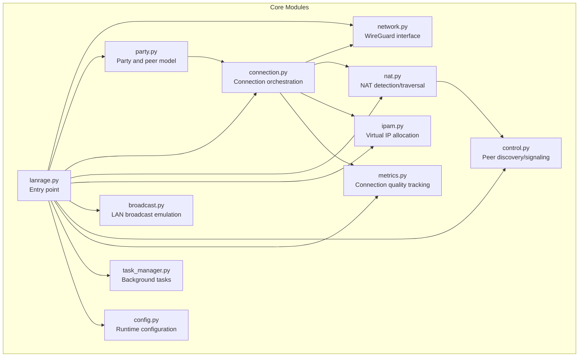
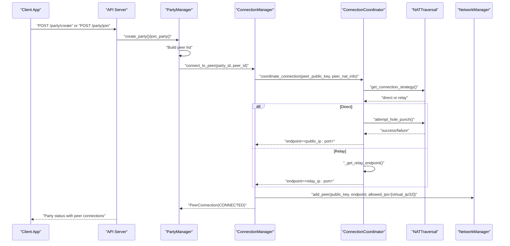
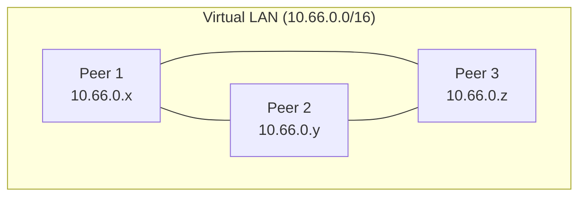
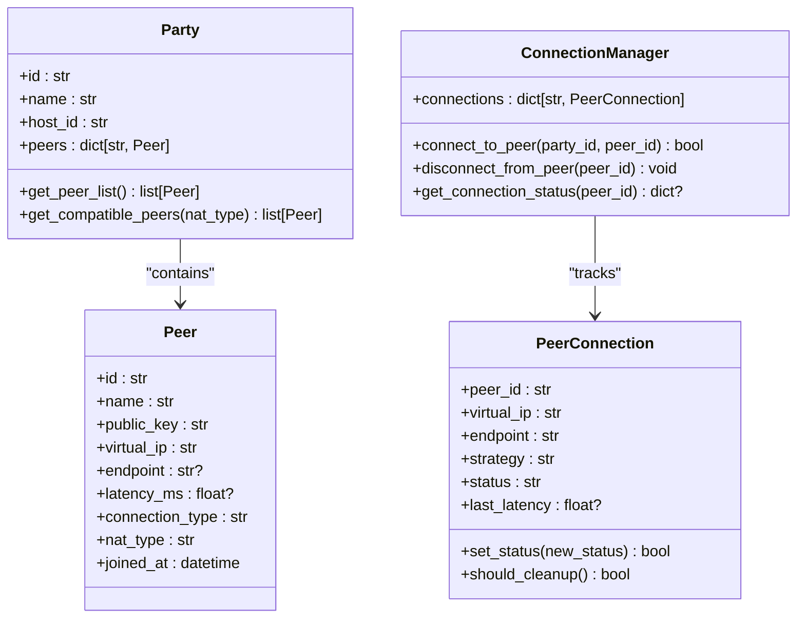
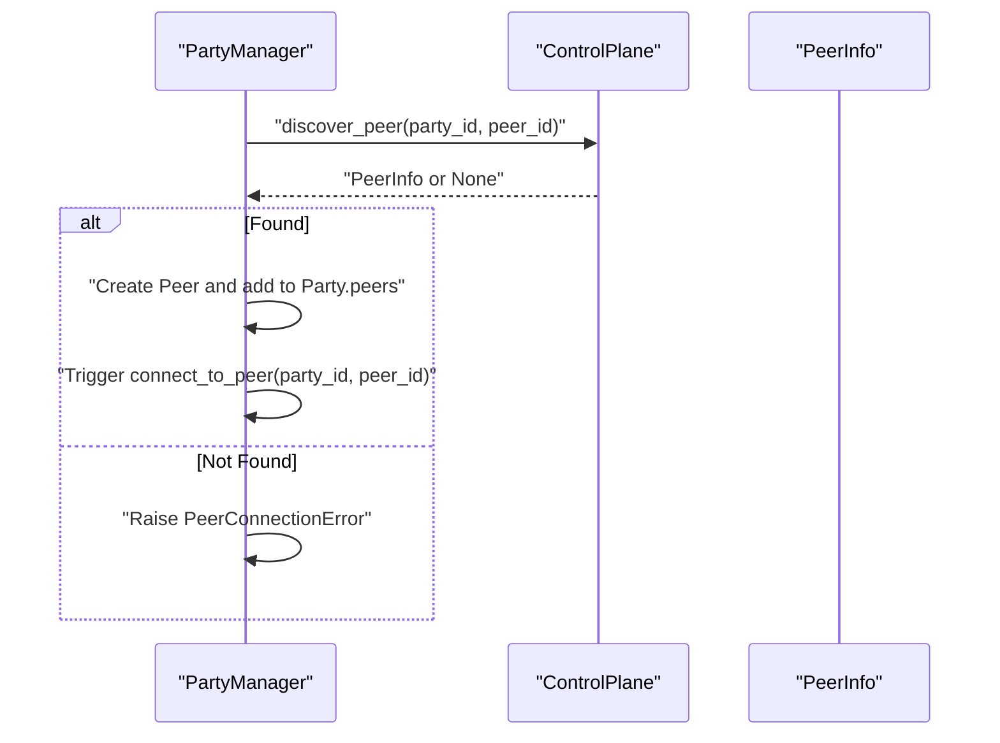
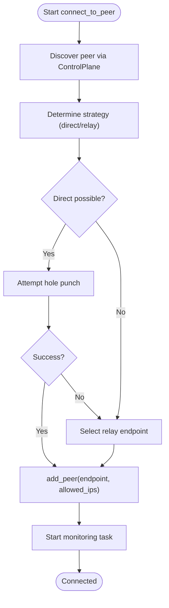
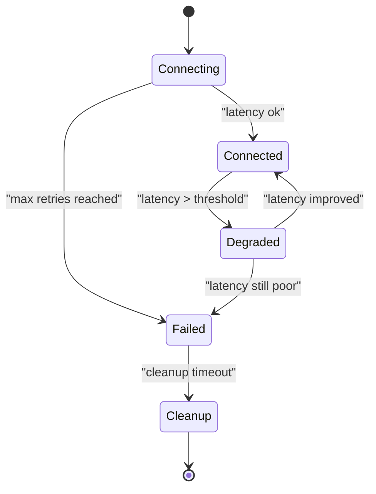
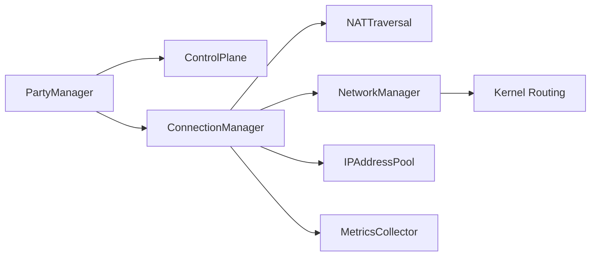
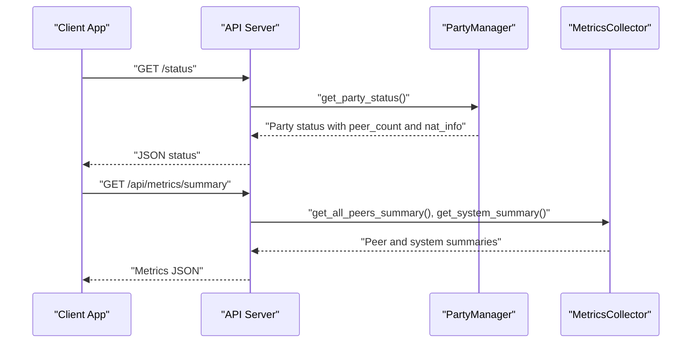

# Mesh Networking Design

<cite>
**Referenced Files in This Document**
- [lanrage.py](file://lanrage.py)
- [network.py](file://core/network.py)
- [party.py](file://core/party.py)
- [connection.py](file://core/connection.py)
- [nat.py](file://core/nat.py)
- [ipam.py](file://core/ipam.py)
- [broadcast.py](file://core/broadcast.py)
- [control.py](file://core/control.py)
- [metrics.py](file://core/metrics.py)
- [task_manager.py](file://core/task_manager.py)
- [config.py](file://core/config.py)
- [server.py](file://api/server.py)
</cite>

## Table of Contents
1. [Introduction](#introduction)
2. [Project Structure](#project-structure)
3. [Core Components](#core-components)
4. [Architecture Overview](#architecture-overview)
5. [Detailed Component Analysis](#detailed-component-analysis)
6. [Dependency Analysis](#dependency-analysis)
7. [Performance Considerations](#performance-considerations)
8. [Troubleshooting Guide](#troubleshooting-guide)
9. [Conclusion](#conclusion)
10. [Appendices](#appendices)

## Introduction
This document explains LANrage’s mesh networking architecture that enables scalable peer-to-peer connectivity without central coordination. The system creates a fully connected mesh where each peer maintains direct connections to all other peers in the party, forming a virtual LAN over the internet. It covers connection matrix management, peer discovery, automatic connection establishment, bandwidth aggregation, health monitoring, automatic reconnection, routing implications, traffic distribution, and scalability characteristics.

## Project Structure
LANrage organizes mesh networking around several core modules:
- Network layer: WireGuard interface creation and per-peer configuration
- Party management: Party lifecycle, peer lists, and NAT compatibility
- Connection management: Per-peer connection orchestration, monitoring, and reconnection
- NAT traversal: STUN-based detection and UDP hole punching
- IPAM: Virtual IP allocation for peers
- Broadcast emulation: LAN-like broadcast/multicast behavior
- Control plane: Peer discovery and signaling
- Metrics: Connection quality and performance tracking
- Task management: Background task lifecycle
- API server: Exposes mesh networking controls and status

**Diagram sources**
- [lanrage.py](file://lanrage.py#L40-L230)
- [network.py](file://core/network.py#L25-L515)
- [party.py](file://core/party.py#L102-L304)
- [connection.py](file://core/connection.py#L18-L493)
- [nat.py](file://core/nat.py#L41-L525)
- [ipam.py](file://core/ipam.py#L10-L183)
- [broadcast.py](file://core/broadcast.py#L201-L646)
- [control.py](file://core/control.py#L187-L880)
- [metrics.py](file://core/metrics.py#L193-L705)
- [task_manager.py](file://core/task_manager.py#L11-L167)
- [config.py](file://core/config.py#L17-L114)

**Section sources**
- [lanrage.py](file://lanrage.py#L40-L230)
- [config.py](file://core/config.py#L17-L114)

## Core Components
- NetworkManager: Creates and manages the WireGuard interface, adds/removes peers, measures latency, and cleans up.
- PartyManager: Manages party membership, NAT compatibility, and initiates connections to peers.
- ConnectionManager: Orchestrates peer connection discovery, NAT strategy selection, WireGuard peer addition, and ongoing monitoring.
- NATTraversal and ConnectionCoordinator: Detect NAT type, decide direct vs relay strategy, and coordinate hole punching and relay selection.
- IPAddressPool: Allocates unique virtual IPs to peers within a virtual subnet.
- ControlPlane: Provides peer discovery and signaling infrastructure (local or remote).
- BroadcastEmulator: Emulates LAN broadcast/multicast for legacy games with deduplication.
- MetricsCollector: Tracks latency, bandwidth, and connection quality for peers and system.
- TaskManager: Ensures background tasks are tracked and canceled gracefully.

**Section sources**
- [network.py](file://core/network.py#L25-L515)
- [party.py](file://core/party.py#L102-L304)
- [connection.py](file://core/connection.py#L18-L493)
- [nat.py](file://core/nat.py#L41-L525)
- [ipam.py](file://core/ipam.py#L10-L183)
- [control.py](file://core/control.py#L187-L880)
- [broadcast.py](file://core/broadcast.py#L201-L646)
- [metrics.py](file://core/metrics.py#L193-L705)
- [task_manager.py](file://core/task_manager.py#L11-L167)

## Architecture Overview
LANrage builds a fully connected mesh by:
- Creating a WireGuard interface with a virtual subnet
- Assigning each peer a unique virtual IP from an IPAM pool
- Establishing direct P2P connections where feasible via NAT traversal
- Falling back to relay servers when direct connections are not possible
- Monitoring connection health and automatically reconnecting or switching relays
- Exposing status and metrics via the API server

**Diagram sources**
- [party.py](file://core/party.py#L198-L247)
- [connection.py](file://core/connection.py#L38-L125)
- [nat.py](file://core/nat.py#L337-L369)
- [network.py](file://core/network.py#L392-L420)

## Detailed Component Analysis

### Fully Connected Mesh Topology
- Each peer maintains a direct WireGuard peer entry to every other peer in the party.
- Virtual IP assignment ensures each peer has a unique IP within the virtual subnet.
- The connection matrix is implicit: every peer is reachable via its virtual IP, and the kernel routes accordingly.

**Diagram sources**
- [ipam.py](file://core/ipam.py#L55-L97)
- [network.py](file://core/network.py#L392-L420)

**Section sources**
- [ipam.py](file://core/ipam.py#L55-L97)
- [network.py](file://core/network.py#L392-L420)

### Connection Matrix Management
- PartyManager maintains a dictionary of peers and exposes compatibility checks based on NAT types.
- ConnectionManager tracks active PeerConnection objects keyed by peer_id.
- IPAddressPool assigns and releases virtual IPs for peers.

**Diagram sources**
- [party.py](file://core/party.py#L58-L100)
- [party.py](file://core/party.py#L44-L56)
- [connection.py](file://core/connection.py#L18-L493)

**Section sources**
- [party.py](file://core/party.py#L58-L100)
- [connection.py](file://core/connection.py#L18-L125)

### Peer Discovery Mechanisms
- ControlPlane provides peer discovery and signaling. It supports local file-based discovery and remote WebSocket-based discovery.
- PartyManager uses ControlPlane to discover peers and initiate connections.

**Diagram sources**
- [party.py](file://core/party.py#L198-L247)
- [control.py](file://core/control.py#L331-L345)

**Section sources**
- [control.py](file://core/control.py#L331-L345)
- [party.py](file://core/party.py#L198-L247)

### Automatic Connection Establishment Procedures
- ConnectionManager orchestrates the full connection flow: discovery, strategy selection, WireGuard peer addition, and monitoring.
- NATTraversal decides direct vs relay strategy and performs hole punching when possible.
- ConnectionCoordinator coordinates NAT decisions and relay endpoint selection.

**Diagram sources**
- [connection.py](file://core/connection.py#L38-L125)
- [nat.py](file://core/nat.py#L337-L369)
- [nat.py](file://core/nat.py#L244-L294)

**Section sources**
- [connection.py](file://core/connection.py#L38-L125)
- [nat.py](file://core/nat.py#L337-L369)

### Bandwidth Aggregation Benefits
- In a fully connected mesh, each peer can receive data from multiple sources simultaneously, increasing aggregate throughput.
- Latency measurements and quality scoring help identify optimal paths and redundant links for resilience.
- MetricsCollector tracks per-peer bandwidth and latency trends to inform load balancing and relay switching.

**Section sources**
- [metrics.py](file://core/metrics.py#L308-L371)
- [metrics.py](file://core/metrics.py#L583-L604)

### Connection State Management and Health Monitoring
- PeerConnection encapsulates connection lifecycle states (connecting, connected, degraded, failed, cleanup).
- ConnectionManager monitors latency, triggers reconnection attempts, and switches relays when beneficial.
- TaskManager ensures monitoring tasks are tracked and canceled gracefully.

**Diagram sources**
- [connection.py](file://core/connection.py#L439-L493)
- [connection.py](file://core/connection.py#L213-L305)

**Section sources**
- [connection.py](file://core/connection.py#L439-L493)
- [connection.py](file://core/connection.py#L213-L305)
- [task_manager.py](file://core/task_manager.py#L11-L167)

### Automatic Reconnection Handling
- On repeated latency measurement failures, ConnectionManager removes and re-adds the WireGuard peer to refresh the tunnel.
- If a relay connection is degraded, ConnectionCoordinator measures alternative relay latencies and switches if it improves performance.

**Section sources**
- [connection.py](file://core/connection.py#L244-L282)
- [connection.py](file://core/connection.py#L334-L437)
- [nat.py](file://core/nat.py#L457-L525)

### Routing Implications and Traffic Distribution
- WireGuard routes packets based on allowed-ips per peer, ensuring traffic reaches the correct virtual IP.
- BroadcastEmulator forwards LAN-like broadcasts/multicasts to all peers with deduplication to prevent loops.
- The virtual subnet allows traditional LAN applications to function unchanged.

**Section sources**
- [network.py](file://core/network.py#L392-L420)
- [broadcast.py](file://core/broadcast.py#L201-L646)

### Scalability Considerations
- Fully connected mesh scales with O(N^2) peer entries and routing table growth.
- Practical limits depend on CPU, memory, and network capacity. MetricsCollector helps monitor system and peer health.
- NAT compatibility affects direct connectivity; relays provide fallback for symmetric NAT scenarios.

**Section sources**
- [party.py](file://core/party.py#L73-L99)
- [metrics.py](file://core/metrics.py#L216-L246)

## Dependency Analysis
The mesh networking relies on tight integration among modules:
- PartyManager depends on ControlPlane for discovery and NATTraversal for compatibility.
- ConnectionManager depends on NATTraversal for strategy selection and NetworkManager for WireGuard operations.
- IPAM provides deterministic virtual IP allocation.
- MetricsCollector integrates with ConnectionManager to track quality and latency.

**Diagram sources**
- [party.py](file://core/party.py#L102-L158)
- [connection.py](file://core/connection.py#L18-L493)
- [nat.py](file://core/nat.py#L41-L525)
- [network.py](file://core/network.py#L25-L515)
- [ipam.py](file://core/ipam.py#L10-L183)
- [metrics.py](file://core/metrics.py#L193-L705)

**Section sources**
- [party.py](file://core/party.py#L102-L158)
- [connection.py](file://core/connection.py#L18-L493)

## Performance Considerations
- WireGuard’s efficient encryption and minimal overhead support high-throughput mesh networking.
- Latency thresholds trigger degradation handling; relays can improve performance when direct paths are poor.
- Metrics-driven insights enable proactive adjustments to maintain quality.

[No sources needed since this section provides general guidance]

## Troubleshooting Guide
Common issues and remedies:
- WireGuard initialization failures: Verify platform support, permissions, and interface conflicts.
- NAT detection failures: Expect relay-only mode; configure relay endpoints if needed.
- Connection failures: Check peer availability, firewall/NAT rules, and retry attempts.
- Monitoring tasks: Ensure TaskManager cancels tasks gracefully on shutdown.

**Section sources**
- [network.py](file://core/network.py#L70-L94)
- [nat.py](file://core/nat.py#L64-L105)
- [lanrage.py](file://lanrage.py#L174-L216)
- [task_manager.py](file://core/task_manager.py#L80-L109)

## Conclusion
LANrage’s mesh networking leverages WireGuard to create a fully connected virtual LAN without central coordination. Through NAT-aware connection strategies, automatic monitoring, and relay fallbacks, it achieves scalable, resilient peer-to-peer connectivity. Metrics and broadcast emulation further enhance usability for legacy LAN applications.

[No sources needed since this section summarizes without analyzing specific files]

## Appendices

### API Exposure of Mesh Status
The API server exposes party status, peer metrics, and system metrics for monitoring the mesh.

**Diagram sources**
- [server.py](file://api/server.py#L146-L153)
- [server.py](file://api/server.py#L191-L201)
- [party.py](file://core/party.py#L279-L303)
- [metrics.py](file://core/metrics.py#L478-L485)

**Section sources**
- [server.py](file://api/server.py#L146-L153)
- [server.py](file://api/server.py#L191-L201)
- [party.py](file://core/party.py#L279-L303)
- [metrics.py](file://core/metrics.py#L478-L485)