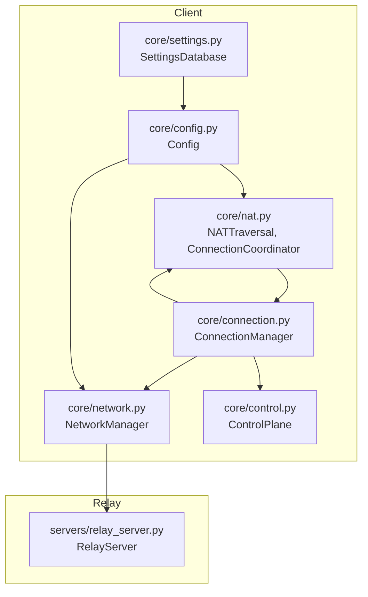
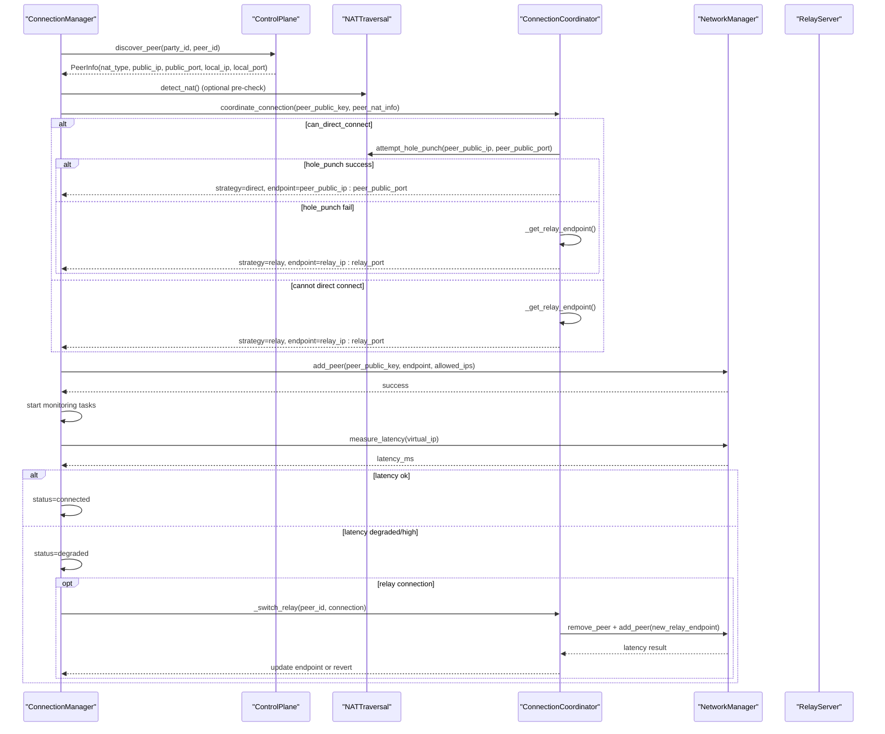
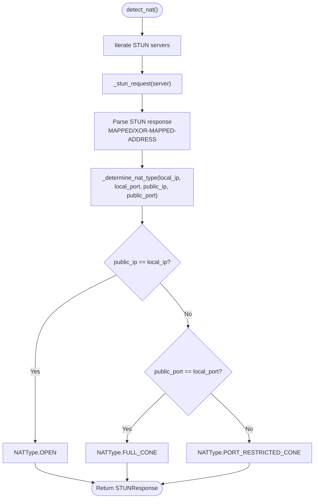
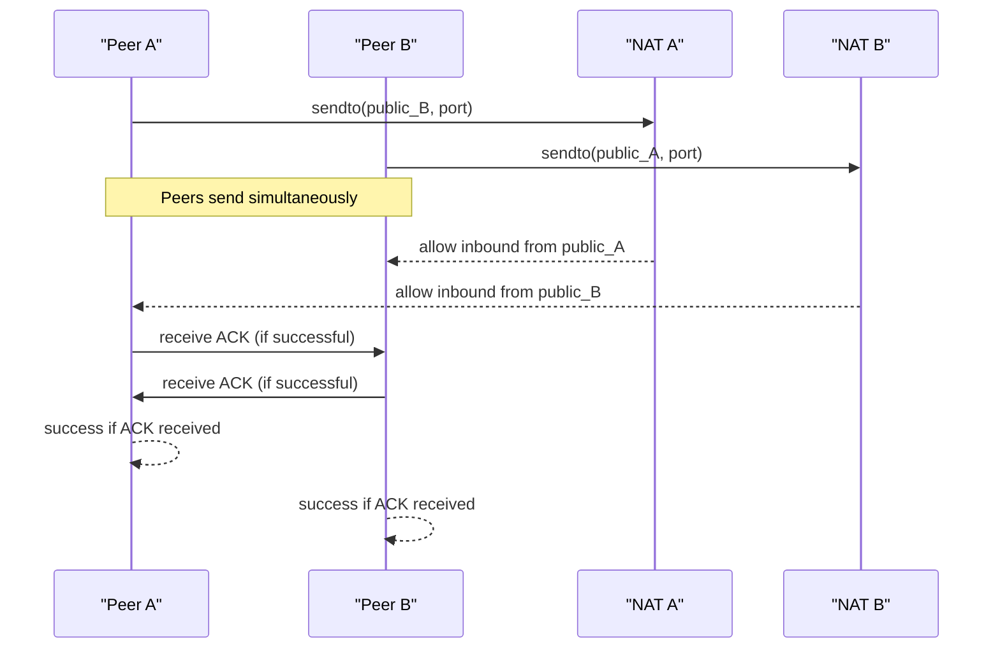
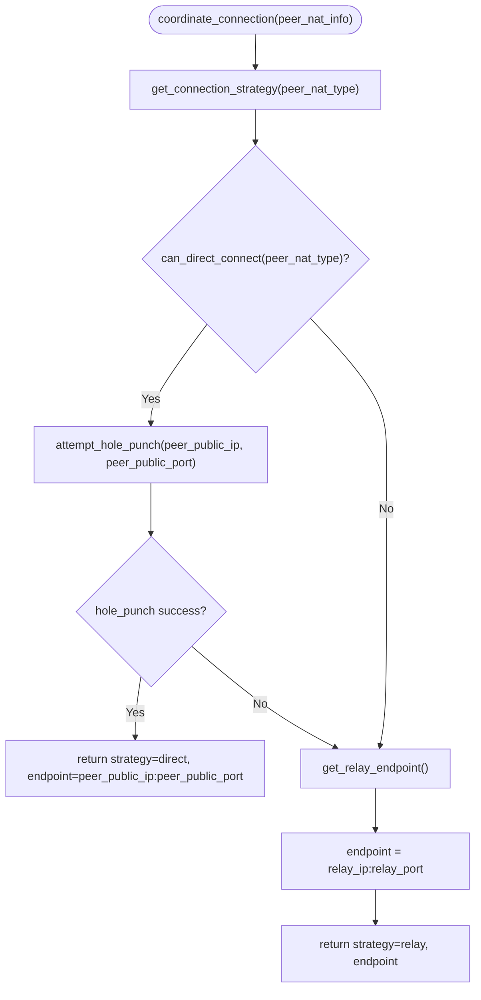
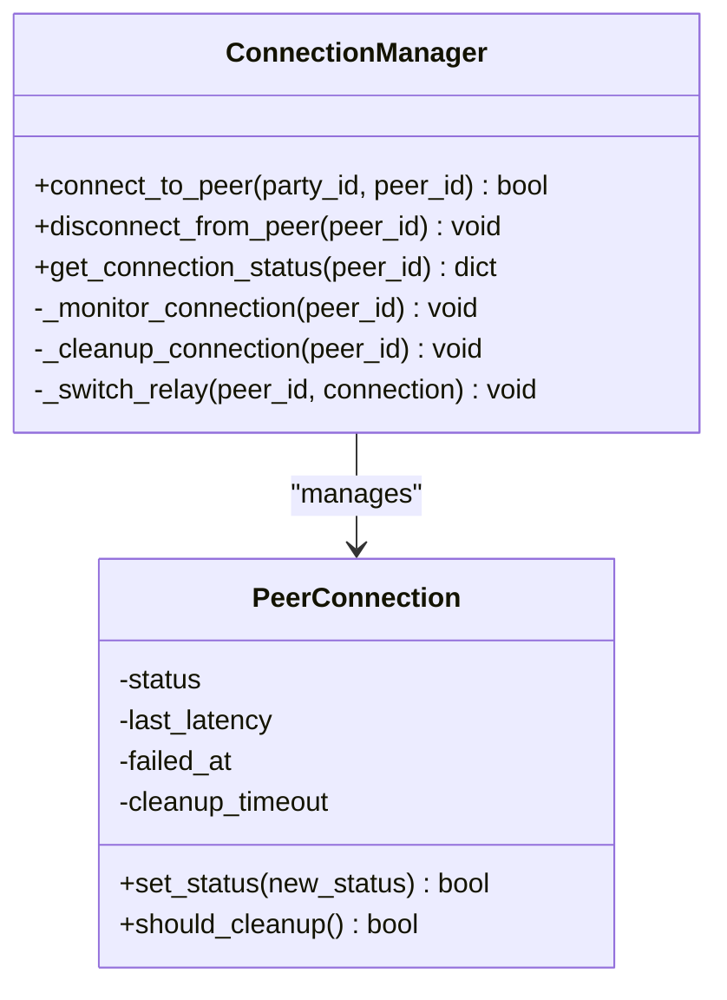
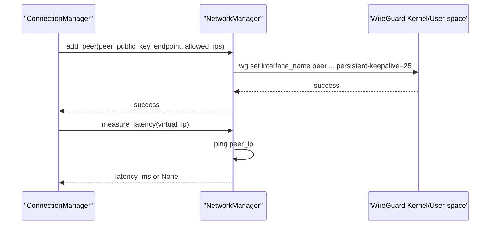
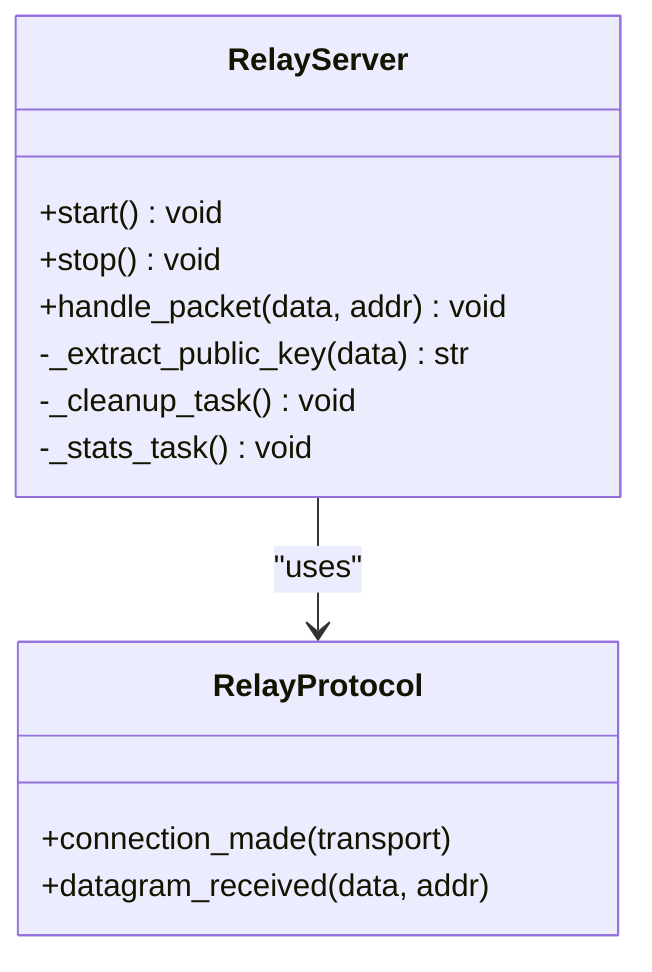
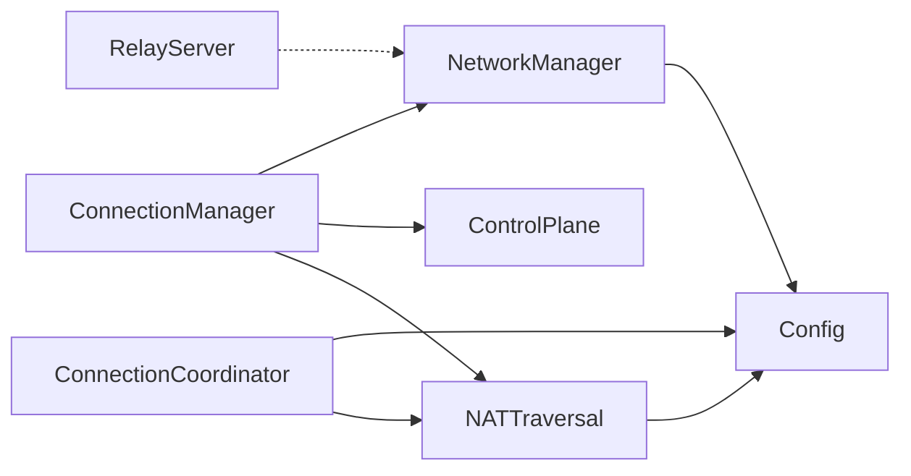

# NAT Traversal Strategies

<cite>
**Referenced Files in This Document**
- [core/nat.py](file://core/nat.py)
- [core/connection.py](file://core/connection.py)
- [core/network.py](file://core/network.py)
- [core/control.py](file://core/control.py)
- [servers/relay_server.py](file://servers/relay_server.py)
- [docs/NAT_TRAVERSAL.md](file://docs/NAT_TRAVERSAL.md)
- [tests/test_nat.py](file://tests/test_nat.py)
- [core/config.py](file://core/config.py)
- [core/settings.py](file://core/settings.py)
</cite>

## Table of Contents
1. [Introduction](#introduction)
2. [Project Structure](#project-structure)
3. [Core Components](#core-components)
4. [Architecture Overview](#architecture-overview)
5. [Detailed Component Analysis](#detailed-component-analysis)
6. [Dependency Analysis](#dependency-analysis)
7. [Performance Considerations](#performance-considerations)
8. [Troubleshooting Guide](#troubleshooting-guide)
9. [Conclusion](#conclusion)

## Introduction
This document explains LANrage’s multi-layered NAT traversal strategy for establishing direct P2P connections across diverse network topologies. It covers STUN-based NAT type detection, UDP hole punching, fallback to relay-based TCP tunneling, connection prioritization with latency-based decisions, timeout handling, graceful degradation, NAT type classification, and connection health monitoring with automatic failover.

## Project Structure
LANrage organizes NAT traversal logic primarily in core modules:
- NAT detection and hole punching: core/nat.py
- Connection orchestration: core/connection.py
- WireGuard network stack and keepalive: core/network.py
- Control plane for peer discovery and relay discovery: core/control.py
- Relay server implementation: servers/relay_server.py
- Documentation and tests: docs/NAT_TRAVERSAL.md, tests/test_nat.py
- Configuration and settings: core/config.py, core/settings.py

**Diagram sources**
- [core/nat.py](file://core/nat.py#L41-L328)
- [core/connection.py](file://core/connection.py#L18-L125)
- [core/network.py](file://core/network.py#L25-L160)
- [core/control.py](file://core/control.py#L187-L346)
- [servers/relay_server.py](file://servers/relay_server.py#L30-L138)
- [core/config.py](file://core/config.py#L17-L114)
- [core/settings.py](file://core/settings.py#L20-L142)

**Section sources**
- [core/nat.py](file://core/nat.py#L1-L100)
- [core/connection.py](file://core/connection.py#L1-L50)
- [core/network.py](file://core/network.py#L1-L50)
- [core/control.py](file://core/control.py#L1-L50)
- [servers/relay_server.py](file://servers/relay_server.py#L1-L50)
- [core/config.py](file://core/config.py#L1-L50)
- [core/settings.py](file://core/settings.py#L1-L50)

## Core Components
- NATTraversal: Implements STUN-based NAT type detection, simplified NAT classification, and UDP hole punching.
- ConnectionCoordinator: Coordinates strategy selection (direct vs relay), attempts hole punching, and discovers/selects relay endpoints.
- ConnectionManager: Orchestrates peer connection lifecycle, WireGuard peer configuration, and connection health monitoring.
- NetworkManager: Manages WireGuard interface creation, peer addition/removal, and latency measurement.
- ControlPlane: Provides peer discovery and relay discovery hooks for strategy selection.
- RelayServer: Stateless UDP packet forwarder for relay fallback.

**Section sources**
- [core/nat.py](file://core/nat.py#L41-L328)
- [core/connection.py](file://core/connection.py#L18-L125)
- [core/network.py](file://core/network.py#L25-L160)
- [core/control.py](file://core/control.py#L187-L346)
- [servers/relay_server.py](file://servers/relay_server.py#L30-L138)

## Architecture Overview
The NAT traversal pipeline integrates discovery, detection, strategy selection, and connection establishment:

**Diagram sources**
- [core/connection.py](file://core/connection.py#L38-L125)
- [core/nat.py](file://core/nat.py#L330-L398)
- [core/network.py](file://core/network.py#L392-L443)

## Detailed Component Analysis

### NAT Detection and Classification
- STUN-based detection: Sends Binding Requests to multiple public STUN servers, parses XOR-MAPPED-ADDRESS, and determines NAT type.
- Simplified classification: Treats open (no NAT), full cone (easy), and port-restricted cone (requires coordinated hole punching) as compatible for direct P2P; symmetric NAT requires relay.
- Public STUN servers: Multiple Google STUN endpoints are used for robustness.

**Diagram sources**
- [core/nat.py](file://core/nat.py#L64-L106)
- [core/nat.py](file://core/nat.py#L107-L179)
- [core/nat.py](file://core/nat.py#L181-L226)
- [core/nat.py](file://core/nat.py#L228-L242)

**Section sources**
- [core/nat.py](file://core/nat.py#L19-L28)
- [core/nat.py](file://core/nat.py#L64-L106)
- [core/nat.py](file://core/nat.py#L107-L179)
- [core/nat.py](file://core/nat.py#L181-L242)
- [docs/NAT_TRAVERSAL.md](file://docs/NAT_TRAVERSAL.md#L16-L27)

### UDP Hole Punching
- Simultaneous open technique: Both peers send UDP packets to each other’s public endpoints concurrently to create return-path holes in their respective NATs.
- Timing: Five packets sent over 500 ms with 100 ms intervals; 2-second ACK wait window.
- Acknowledgement: Expects a specific ACK payload to confirm successful hole punching.

**Diagram sources**
- [core/nat.py](file://core/nat.py#L244-L294)
- [docs/NAT_TRAVERSAL.md](file://docs/NAT_TRAVERSAL.md#L380-L416)

**Section sources**
- [core/nat.py](file://core/nat.py#L244-L294)
- [docs/NAT_TRAVERSAL.md](file://docs/NAT_TRAVERSAL.md#L380-L416)

### Strategy Selection and Fallback
- Direct P2P feasibility: Determined by compatibility matrix (open/open, full cone/full cone, restricted/restricted, port-restricted/port-restricted); symmetric NAT requires relay.
- Relay discovery: Attempts control plane discovery, falls back to configured relay, then default relay.
- Latency-based relay selection: Measures ping latency to each discovered relay and selects the best.

**Diagram sources**
- [core/nat.py](file://core/nat.py#L330-L369)
- [core/nat.py](file://core/nat.py#L371-L377)
- [core/nat.py](file://core/nat.py#L379-L455)
- [core/nat.py](file://core/nat.py#L457-L525)

**Section sources**
- [core/nat.py](file://core/nat.py#L295-L327)
- [core/nat.py](file://core/nat.py#L330-L369)
- [core/nat.py](file://core/nat.py#L379-L455)
- [core/nat.py](file://core/nat.py#L457-L525)

### Connection Orchestration and Health Monitoring
- ConnectionManager coordinates peer discovery, strategy selection, WireGuard peer configuration, and starts monitoring tasks.
- Health monitoring: Periodic latency checks; marks connections as connected/degraded/failed; attempts reconnection; switches relay if latency degrades.
- Automatic cleanup: Removes failed connections after a timeout threshold.

**Diagram sources**
- [core/connection.py](file://core/connection.py#L18-L125)
- [core/connection.py](file://core/connection.py#L439-L493)

**Section sources**
- [core/connection.py](file://core/connection.py#L38-L125)
- [core/connection.py](file://core/connection.py#L213-L333)
- [core/connection.py](file://core/connection.py#L334-L437)

### WireGuard Integration and Keepalive
- NetworkManager manages WireGuard interface creation, key generation, and peer configuration.
- Persistent keepalive is set to improve NAT traversal reliability and detect liveness.
- Latency measurement uses ICMP ping to assess connection health.

**Diagram sources**
- [core/network.py](file://core/network.py#L392-L443)
- [core/network.py](file://core/network.py#L340-L390)

**Section sources**
- [core/network.py](file://core/network.py#L25-L160)
- [core/network.py](file://core/network.py#L392-L443)
- [core/network.py](file://core/network.py#L340-L390)

### Relay Server Implementation
- Stateless UDP forwarder: Receives packets, identifies clients, and forwards to others without decrypting.
- Public key extraction from WireGuard handshake messages enables client tracking.
- Cleanup and statistics tasks manage stale clients and report metrics.

**Diagram sources**
- [servers/relay_server.py](file://servers/relay_server.py#L30-L138)
- [servers/relay_server.py](file://servers/relay_server.py#L224-L256)

**Section sources**
- [servers/relay_server.py](file://servers/relay_server.py#L30-L138)
- [servers/relay_server.py](file://servers/relay_server.py#L224-L256)

### Control Plane Integration
- Peer discovery: ConnectionManager obtains peer NAT info via ControlPlane.
- Relay discovery: ConnectionCoordinator queries control plane for relay list and converts to internal format.
- Graceful fallback: If control plane is unavailable, uses configured or default relay.

**Section sources**
- [core/connection.py](file://core/connection.py#L53-L77)
- [core/control.py](file://core/control.py#L331-L345)
- [core/nat.py](file://core/nat.py#L399-L455)

## Dependency Analysis
Key dependencies and interactions:
- ConnectionManager depends on NATTraversal, ControlPlane, and NetworkManager.
- NATTraversal depends on Config and optionally ControlPlane for relay discovery.
- NetworkManager depends on Config and uses system commands to manage WireGuard.
- RelayServer is external to client runtime but participates in relay fallback.

**Diagram sources**
- [core/connection.py](file://core/connection.py#L18-L33)
- [core/nat.py](file://core/nat.py#L53-L57)
- [core/network.py](file://core/network.py#L28-L35)
- [servers/relay_server.py](file://servers/relay_server.py#L38-L42)

**Section sources**
- [core/connection.py](file://core/connection.py#L18-L33)
- [core/nat.py](file://core/nat.py#L53-L57)
- [core/network.py](file://core/network.py#L28-L35)
- [servers/relay_server.py](file://servers/relay_server.py#L38-L42)

## Performance Considerations
- Direct P2P: Minimal latency overhead; high success rate for compatible NAT combinations.
- Hole-punched connections: Slightly higher latency due to timing and potential retries.
- Relay connections: Predictable overhead; latency dominated by geographic distance and relay load.
- Keepalive: Persistent keepalive improves NAT traversal stability and reduces false failures.

[No sources needed since this section provides general guidance]

## Troubleshooting Guide
Common issues and resolutions:
- NAT detection failures: Check firewall rules, test STUN connectivity, and try alternate networks.
- Hole punching failures: Expected for symmetric NAT; rely on automatic relay fallback.
- Slow relay connections: Switch to a closer relay, deploy more relays, or investigate network quality.

**Section sources**
- [docs/NAT_TRAVERSAL.md](file://docs/NAT_TRAVERSAL.md#L486-L523)
- [tests/test_nat.py](file://tests/test_nat.py#L20-L100)

## Conclusion
LANrage’s NAT traversal strategy combines STUN-based detection, UDP hole punching, and relay fallback to maximize direct P2P connectivity while gracefully degrading to reliable relay tunnels. The system’s latency-aware relay selection, persistent keepalive, and continuous health monitoring ensure robust, adaptive connectivity across diverse network environments.