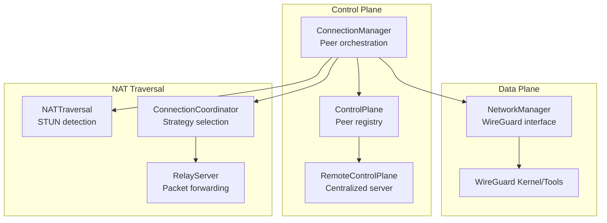
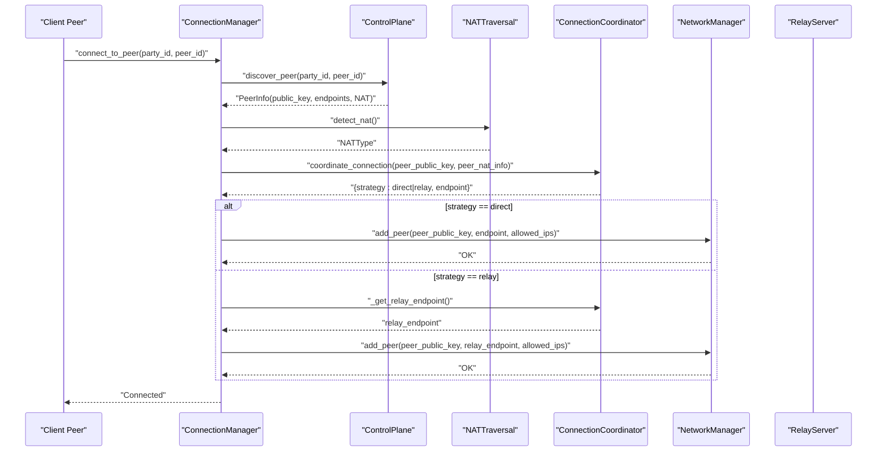
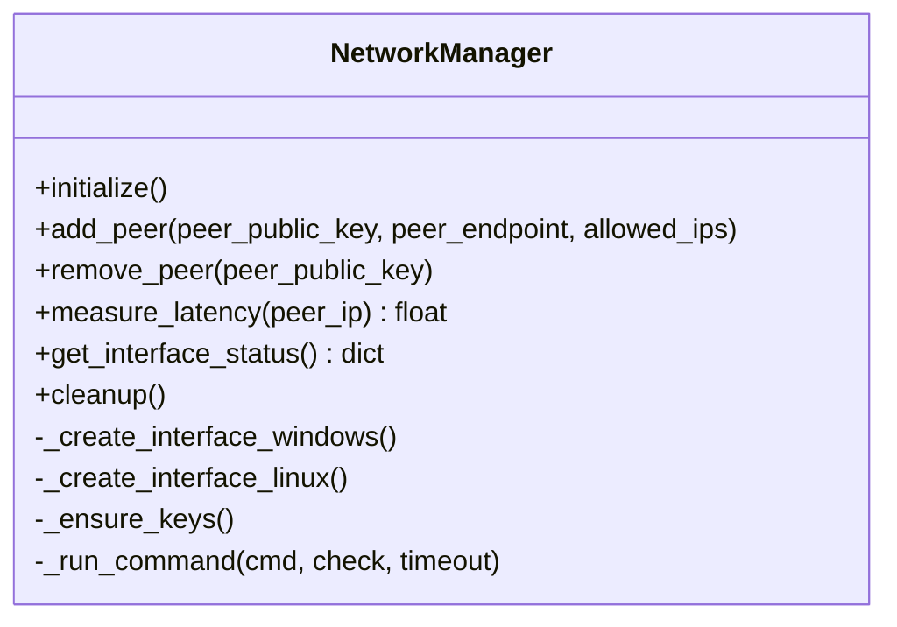
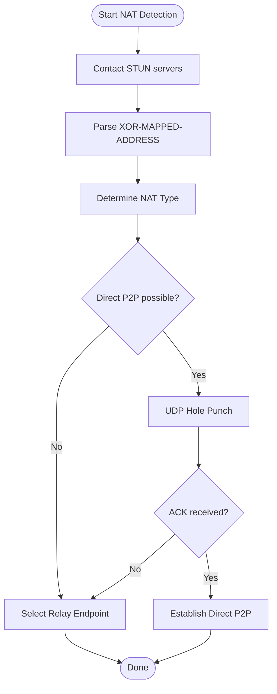
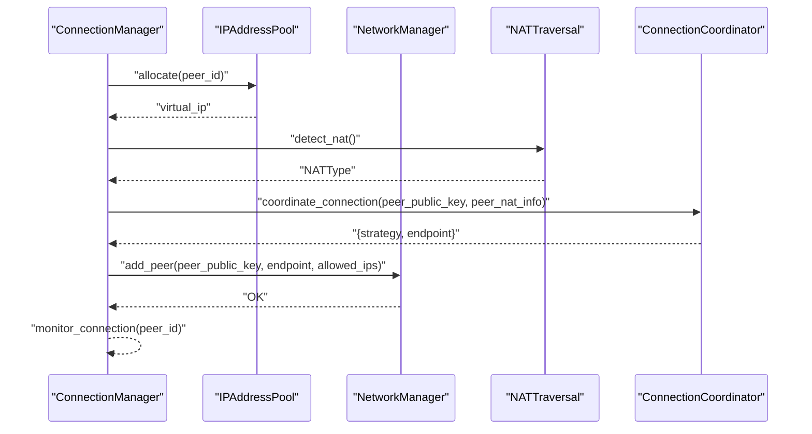
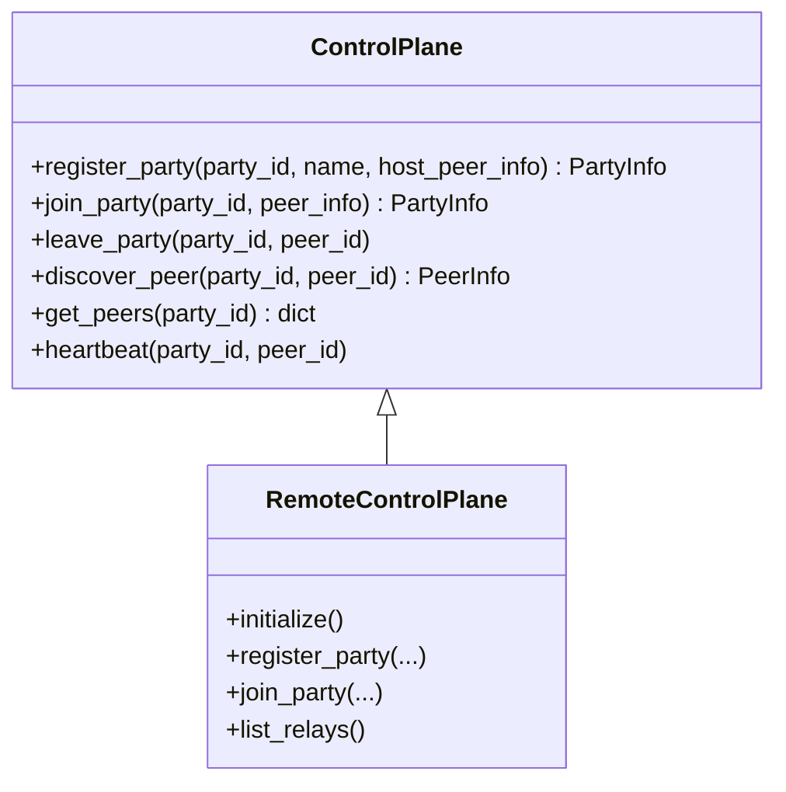
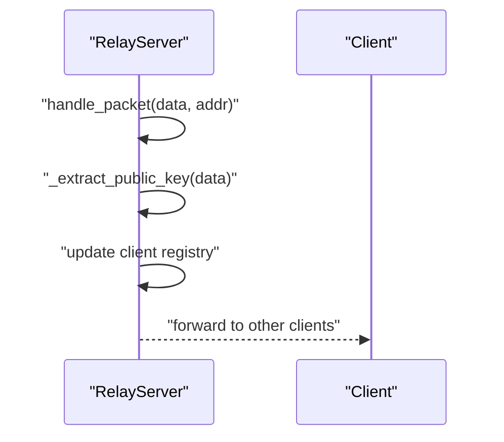
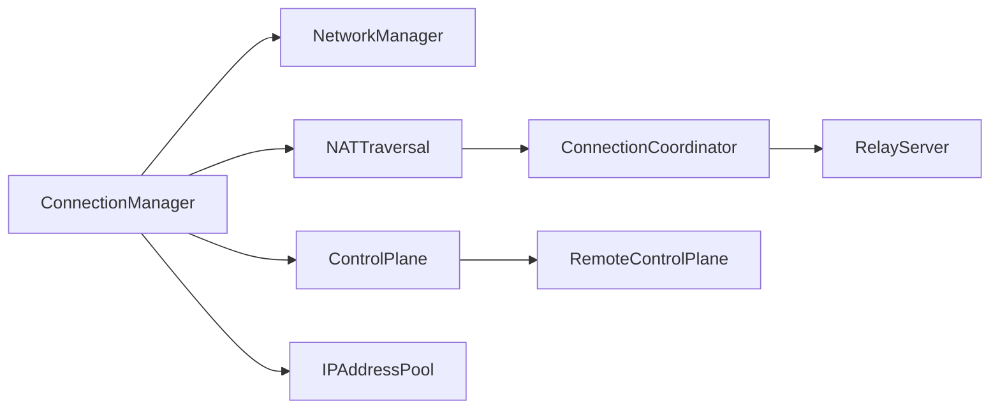

# Networking Architecture

<cite>
**Referenced Files in This Document**
- [core/network.py](file://core/network.py)
- [core/nat.py](file://core/nat.py)
- [core/connection.py](file://core/connection.py)
- [core/ipam.py](file://core/ipam.py)
- [core/config.py](file://core/config.py)
- [core/control.py](file://core/control.py)
- [servers/relay_server.py](file://servers/relay_server.py)
- [servers/control_server.py](file://servers/control_server.py)
- [docs/NAT_TRAVERSAL.md](file://docs/NAT_TRAVERSAL.md)
- [docs/WIREGUARD_SETUP.md](file://docs/WIREGUARD_SETUP.md)
- [docs/NETWORK.md](file://docs/NETWORK.md)
- [tests/test_wireguard.py](file://tests/test_wireguard.py)
- [tests/test_nat.py](file://tests/test_nat.py)
</cite>

## Table of Contents
1. [Introduction](#introduction)
2. [Project Structure](#project-structure)
3. [Core Components](#core-components)
4. [Architecture Overview](#architecture-overview)
5. [Detailed Component Analysis](#detailed-component-analysis)
6. [Dependency Analysis](#dependency-analysis)
7. [Performance Considerations](#performance-considerations)
8. [Troubleshooting Guide](#troubleshooting-guide)
9. [Conclusion](#conclusion)

## Introduction
This document explains LANrage’s networking architecture with a focus on the data plane built on top of WireGuard VPN technology. It covers the mesh networking design enabling direct P2P connections with intelligent relay fallback, the connection priority system from direct P2P to TCP tunnel fallback, virtual network configuration, NAT traversal strategies, and security implementation. It also outlines platform-specific considerations and cross-platform compatibility approaches.

## Project Structure
The networking stack is organized around three primary layers:
- Data plane: WireGuard interface management and peer routing
- Control plane: Peer discovery, signaling, and relay registry
- NAT traversal: STUN/TURN-like mechanisms and UDP hole punching

**Diagram sources**
- [core/network.py](file://core/network.py#L25-L515)
- [core/connection.py](file://core/connection.py#L18-L493)
- [core/control.py](file://core/control.py#L187-L880)
- [core/nat.py](file://core/nat.py#L41-L525)
- [servers/relay_server.py](file://servers/relay_server.py#L30-L297)
- [servers/control_server.py](file://servers/control_server.py#L36-L729)

**Section sources**
- [core/network.py](file://core/network.py#L1-L515)
- [core/connection.py](file://core/connection.py#L1-L493)
- [core/control.py](file://core/control.py#L1-L880)
- [core/nat.py](file://core/nat.py#L1-L525)
- [servers/relay_server.py](file://servers/relay_server.py#L1-L297)
- [servers/control_server.py](file://servers/control_server.py#L1-L729)

## Core Components
- NetworkManager: Creates and manages the WireGuard interface, handles key generation, peer management, and latency measurement.
- NATTraversal: Detects NAT type via STUN, performs UDP hole punching, and determines whether direct P2P is feasible.
- ConnectionCoordinator: Chooses between direct P2P and relay strategies, discovers and measures relay endpoints.
- ConnectionManager: Orchestrates peer connections, assigns virtual IPs, monitors health, and switches relays when needed.
- ControlPlane: Provides peer discovery and signaling; RemoteControlPlane integrates with a centralized server.
- RelayServer: Stateless packet forwarder for peers behind difficult NATs.
- IPAM: Allocates virtual IPs from the configured subnet.

**Section sources**
- [core/network.py](file://core/network.py#L25-L515)
- [core/nat.py](file://core/nat.py#L41-L525)
- [core/connection.py](file://core/connection.py#L18-L493)
- [core/control.py](file://core/control.py#L187-L880)
- [servers/relay_server.py](file://servers/relay_server.py#L30-L297)
- [core/ipam.py](file://core/ipam.py#L10-L183)

## Architecture Overview
The system implements a mesh VPN where each peer maintains a WireGuard interface and routes traffic through the virtual LAN. The control plane coordinates peer discovery and signaling. NAT traversal is used to establish direct P2P connections when possible, with automatic fallback to relay servers.

**Diagram sources**
- [core/connection.py](file://core/connection.py#L38-L125)
- [core/nat.py](file://core/nat.py#L330-L398)
- [core/network.py](file://core/network.py#L392-L420)
- [servers/relay_server.py](file://servers/relay_server.py#L85-L138)

## Detailed Component Analysis

### Data Plane: WireGuard Interface and Routing
- Interface creation and configuration:
  - Windows: Uses the WireGuard tunnel service with a generated configuration file.
  - Linux: Creates a wireguard interface, sets private key, assigns IP, sets MTU, and brings it up.
- Key management:
  - Curve25519 keys generated and stored securely; base64 encoded for WireGuard.
- Peer management:
  - Adds/removes peers with allowed IPs and persistent keepalive for NAT traversal.
- Latency measurement:
  - Uses platform-specific ping to measure latency to peers’ virtual IPs.

**Diagram sources**
- [core/network.py](file://core/network.py#L25-L515)

**Section sources**
- [core/network.py](file://core/network.py#L70-L515)
- [docs/WIREGUARD_SETUP.md](file://docs/WIREGUARD_SETUP.md#L103-L279)
- [docs/NETWORK.md](file://docs/NETWORK.md#L16-L280)

### NAT Traversal: STUN, Hole Punching, and Relay Coordination
- STUN-based NAT detection:
  - Attempts multiple public STUN servers to determine NAT type.
  - Parses XOR-MAPPED-ADDRESS to infer public endpoint.
- UDP hole punching:
  - Sends synchronized probe packets to peers’ public endpoints to open NAT mappings.
  - Waits for acknowledgment to confirm successful hole punching.
- Strategy selection:
  - Direct P2P for compatible NAT types; relay fallback otherwise.
- Relay discovery and selection:
  - Discovers relays from control plane or falls back to configured/default relays.
  - Measures latency to each relay and selects the best one.

**Diagram sources**
- [core/nat.py](file://core/nat.py#L64-L106)
- [core/nat.py](file://core/nat.py#L244-L294)
- [core/nat.py](file://core/nat.py#L330-L398)

**Section sources**
- [core/nat.py](file://core/nat.py#L41-L525)
- [docs/NAT_TRAVERSAL.md](file://docs/NAT_TRAVERSAL.md#L1-L562)

### Connection Orchestration: Mesh Networking and Priority System
- Mesh networking design:
  - Each peer adds others as WireGuard peers with individual allowed IPs.
  - Traffic routes through the virtual LAN (10.66.0.0/16) with direct P2P preferred.
- Priority system:
  - Direct P2P with hole punching when NAT types permit.
  - TCP tunnel fallback via relay server when direct P2P is not possible.
- Monitoring and resilience:
  - Periodic latency checks; automatic reconnection attempts; relay switching when latency degrades.

**Diagram sources**
- [core/connection.py](file://core/connection.py#L38-L125)
- [core/ipam.py](file://core/ipam.py#L55-L98)
- [core/nat.py](file://core/nat.py#L330-L398)
- [core/network.py](file://core/network.py#L392-L420)

**Section sources**
- [core/connection.py](file://core/connection.py#L18-L493)
- [core/ipam.py](file://core/ipam.py#L10-L183)

### Control Plane: Peer Discovery and Signaling
- Local control plane:
  - Stores and serves party and peer metadata; periodic cleanup of stale entries.
- Remote control plane:
  - Centralized server with FastAPI endpoints for party management, peer discovery, and relay registry.
  - Token-based authentication and cleanup tasks for stale data.
- Integration:
  - ConnectionManager uses ControlPlane to discover peers and exchange NAT information.

**Diagram sources**
- [core/control.py](file://core/control.py#L187-L880)
- [servers/control_server.py](file://servers/control_server.py#L36-L729)

**Section sources**
- [core/control.py](file://core/control.py#L187-L880)
- [servers/control_server.py](file://servers/control_server.py#L1-L729)

### Relay Server: Stateless Packet Forwarding
- Stateless operation:
  - Forwards encrypted WireGuard packets without decryption.
  - Tracks clients and periodically cleans up stale entries.
- Public key extraction:
  - Extracts public key from handshake packets to associate clients.
- Scalability:
  - Designed for high concurrency and minimal CPU overhead.

**Diagram sources**
- [servers/relay_server.py](file://servers/relay_server.py#L85-L138)
- [servers/relay_server.py](file://servers/relay_server.py#L139-L187)

**Section sources**
- [servers/relay_server.py](file://servers/relay_server.py#L30-L297)

## Dependency Analysis
- Coupling:
  - ConnectionManager depends on NetworkManager, NATTraversal, ControlPlane, and IPAM.
  - NATTraversal coordinates with ConnectionCoordinator to decide strategies.
  - ControlPlane integrates with RemoteControlPlane for centralized deployments.
- Cohesion:
  - NetworkManager encapsulates all WireGuard operations.
  - NATTraversal encapsulates NAT detection and hole punching.
  - IPAM encapsulates virtual IP allocation.
- External dependencies:
  - WireGuard tools and kernel modules on Linux; Windows service on Windows.
  - STUN servers for NAT detection.
  - Optional websockets for RemoteControlPlane.

**Diagram sources**
- [core/connection.py](file://core/connection.py#L18-L493)
- [core/network.py](file://core/network.py#L25-L515)
- [core/nat.py](file://core/nat.py#L41-L525)
- [core/control.py](file://core/control.py#L187-L880)
- [servers/relay_server.py](file://servers/relay_server.py#L30-L297)

**Section sources**
- [core/connection.py](file://core/connection.py#L18-L493)
- [core/nat.py](file://core/nat.py#L41-L525)
- [core/network.py](file://core/network.py#L25-L515)
- [core/control.py](file://core/control.py#L187-L880)
- [servers/relay_server.py](file://servers/relay_server.py#L30-L297)

## Performance Considerations
- Latency overhead:
  - Direct P2P: <1ms added.
  - Same-region relay: 5–15ms overhead.
  - Cross-region relay: 30–100ms overhead.
- Throughput:
  - WireGuard overhead ~60 bytes per packet; MTU 1420 bytes accounts for overhead.
  - Line speed on modern hardware; minimal CPU usage (<1% idle, 2–5% during active gaming).
- Monitoring:
  - Periodic latency checks and automatic reconnection attempts.
  - Relay switching when latency exceeds thresholds.

**Section sources**
- [docs/NETWORK.md](file://docs/NETWORK.md#L325-L350)
- [docs/NAT_TRAVERSAL.md](file://docs/NAT_TRAVERSAL.md#L443-L462)
- [core/connection.py](file://core/connection.py#L213-L437)

## Troubleshooting Guide
- WireGuard not found:
  - Install WireGuard per platform and ensure commands are available in PATH.
- Permission denied:
  - Run with administrative privileges on Windows; ensure root/sudo access on Linux.
- Interface creation failed:
  - Check for conflicting interfaces, kernel modules, or port availability.
- Peer unreachable:
  - Verify endpoint correctness, firewall rules, and NAT traversal status.
- NAT detection failures:
  - Confirm STUN server reachability and firewall UDP access.
- Relay slow:
  - Choose a closer relay or deploy more relays.

**Section sources**
- [docs/WIREGUARD_SETUP.md](file://docs/WIREGUARD_SETUP.md#L166-L279)
- [docs/NAT_TRAVERSAL.md](file://docs/NAT_TRAVERSAL.md#L486-L523)
- [tests/test_wireguard.py](file://tests/test_wireguard.py#L21-L107)
- [tests/test_nat.py](file://tests/test_nat.py#L20-L121)

## Conclusion
LANrage’s networking architecture builds a robust mesh VPN using WireGuard as the data plane, with intelligent NAT traversal and relay fallback. The design prioritizes direct P2P connections for optimal latency while ensuring reliable connectivity through automatic relay switching. The modular components enable cross-platform compatibility, centralized control plane integration, and scalable relay forwarding.