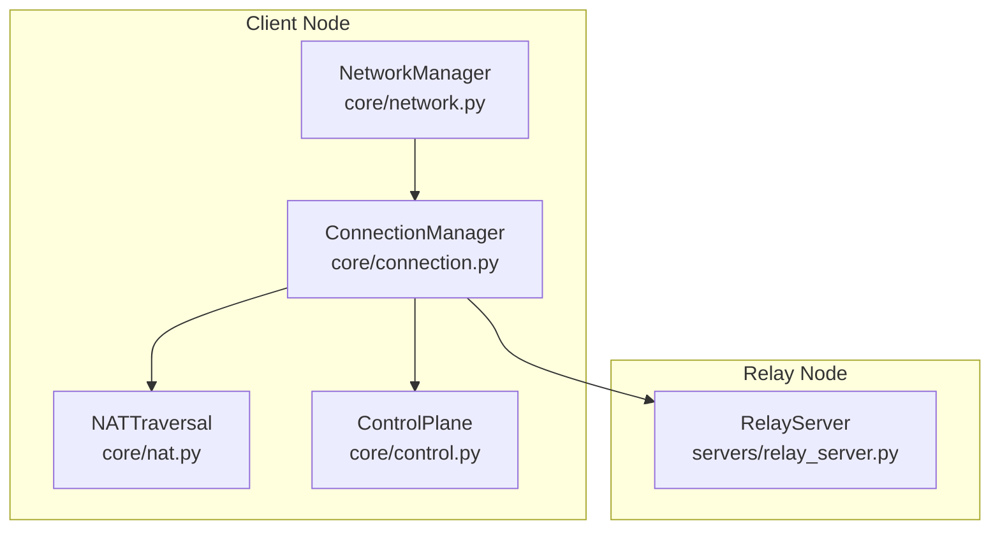
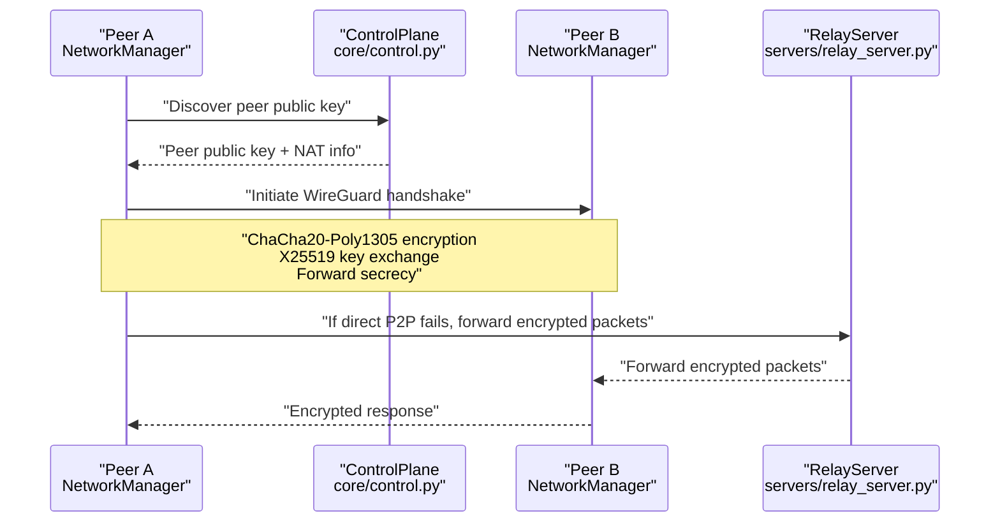
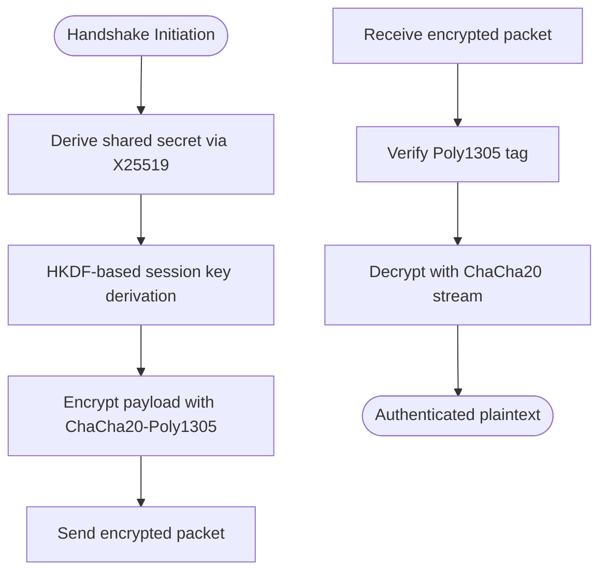
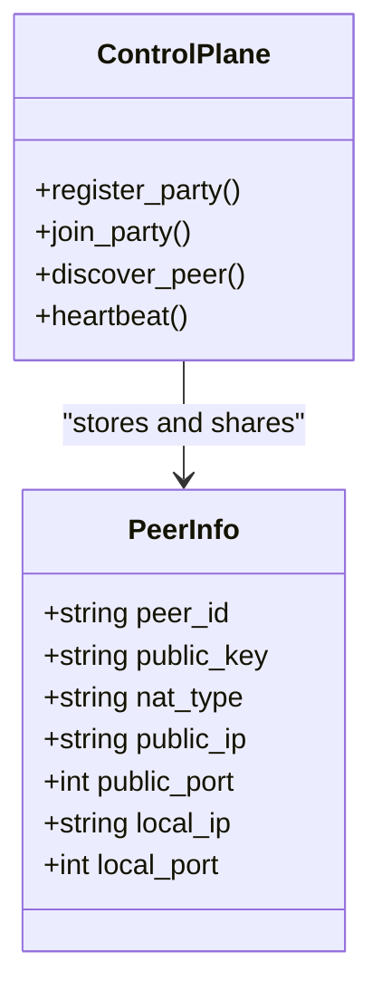
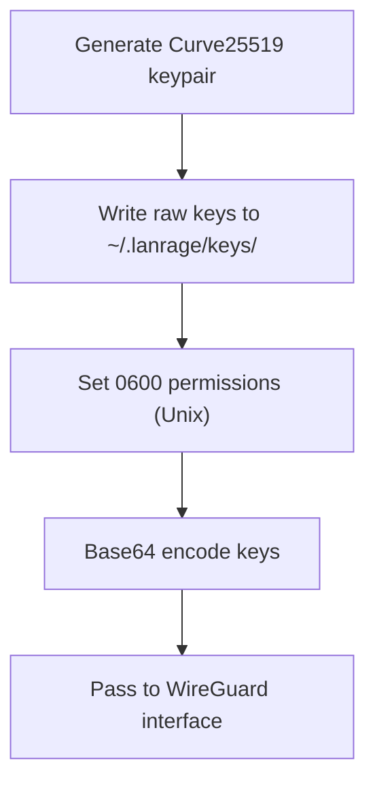
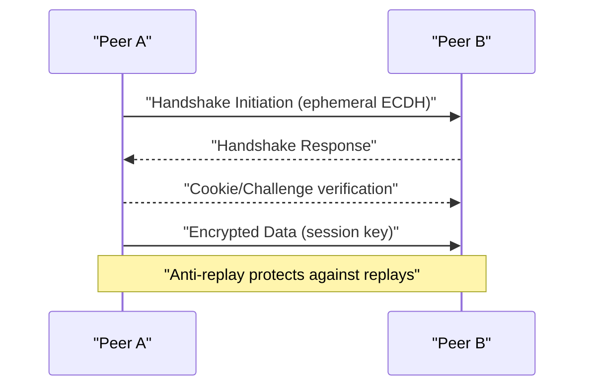
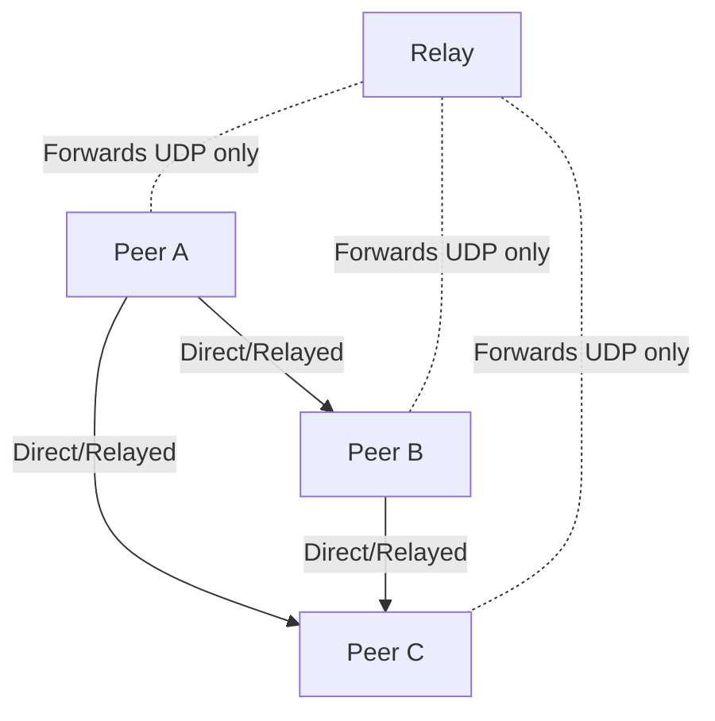
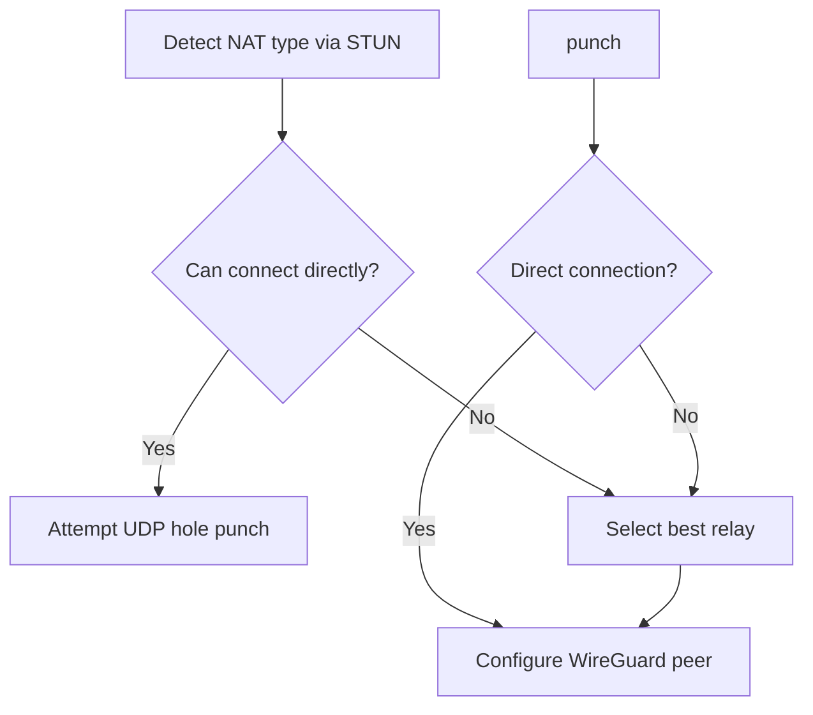
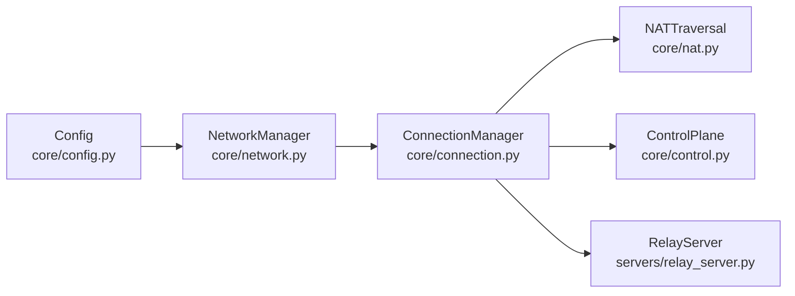

# Security and Encryption

<cite>
**Referenced Files in This Document**
- [SECURITY.md](file://SECURITY.md)
- [README.md](file://README.md)
- [docs/WIREGUARD_SETUP.md](file://docs/WIREGUARD_SETUP.md)
- [docs/NETWORK.md](file://docs/NETWORK.md)
- [core/network.py](file://core/network.py)
- [core/connection.py](file://core/connection.py)
- [core/nat.py](file://core/nat.py)
- [core/control.py](file://core/control.py)
- [core/config.py](file://core/config.py)
- [servers/relay_server.py](file://servers/relay_server.py)
- [tests/test_wireguard.py](file://tests/test_wireguard.py)
</cite>

## Table of Contents
1. [Introduction](#introduction)
2. [Project Structure](#project-structure)
3. [Core Components](#core-components)
4. [Architecture Overview](#architecture-overview)
5. [Detailed Component Analysis](#detailed-component-analysis)
6. [Dependency Analysis](#dependency-analysis)
7. [Performance Considerations](#performance-considerations)
8. [Troubleshooting Guide](#troubleshooting-guide)
9. [Conclusion](#conclusion)

## Introduction
This document explains LANrage’s security implementation using WireGuard’s cryptographic primitives. It covers how the system achieves confidentiality and integrity with ChaCha20-Poly1305 authenticated encryption, forward secrecy via X25519 key exchange, and a peer-to-peer trust model that eliminates the need for certificate authorities. It also documents key management, ephemeral key handling, session key derivation, replay attack protection, and the security implications of the mesh topology and peer verification mechanisms in distributed gaming scenarios.

## Project Structure
LANrage integrates WireGuard at the network layer and orchestrates peer connections with NAT traversal and relay fallback. The security-critical components are:
- WireGuard interface management and key handling
- NAT traversal and connection coordination
- Control plane for peer discovery and signaling
- Relay server for encrypted packet forwarding

**Diagram sources**
- [core/network.py](file://core/network.py#L25-L515)
- [core/connection.py](file://core/connection.py#L18-L493)
- [core/nat.py](file://core/nat.py#L41-L525)
- [core/control.py](file://core/control.py#L187-L880)
- [servers/relay_server.py](file://servers/relay_server.py#L30-L297)

**Section sources**
- [README.md](file://README.md#L93-L108)
- [docs/WIREGUARD_SETUP.md](file://docs/WIREGUARD_SETUP.md#L1-L279)
- [docs/NETWORK.md](file://docs/NETWORK.md#L1-L453)

## Core Components
- WireGuard interface management with automatic key generation and base64 encoding for configuration
- Peer-to-peer trust model using public key authentication and cryptographic identity
- ChaCha20-Poly1305 authenticated encryption providing confidentiality and integrity
- X25519 key exchange ensuring forward secrecy and perfect forward security
- Persistent keepalive for NAT traversal and session liveness
- Relay server forwarding encrypted packets without decryption

**Section sources**
- [core/network.py](file://core/network.py#L123-L160)
- [docs/WIREGUARD_SETUP.md](file://docs/WIREGUARD_SETUP.md#L225-L247)
- [docs/NETWORK.md](file://docs/NETWORK.md#L351-L372)
- [servers/relay_server.py](file://servers/relay_server.py#L30-L138)

## Architecture Overview
The system builds a secure mesh of peers:
- Each peer generates Curve25519 keys and shares only public keys
- Peers authenticate each other using public keys and WireGuard’s cryptographic handshake
- Traffic is encrypted end-to-end; relays forward only UDP packets without inspecting payload
- NAT traversal uses STUN and UDP hole punching; fallback routes via relays

**Diagram sources**
- [core/control.py](file://core/control.py#L331-L346)
- [core/network.py](file://core/network.py#L392-L420)
- [servers/relay_server.py](file://servers/relay_server.py#L85-L138)

**Section sources**
- [core/nat.py](file://core/nat.py#L244-L294)
- [docs/WIREGUARD_SETUP.md](file://docs/WIREGUARD_SETUP.md#L234-L247)

## Detailed Component Analysis

### WireGuard Encryption and Forward Secrecy
- ChaCha20-Poly1305 provides authenticated encryption with 256-bit keys and Poly1305 MAC for integrity
- X25519 key exchange ensures forward secrecy: new session keys are derived per handshake
- Persistent keepalive (25 seconds) maintains NAT bindings and session liveness

**Diagram sources**
- [docs/NETWORK.md](file://docs/NETWORK.md#L351-L372)
- [docs/WIREGUARD_SETUP.md](file://docs/WIREGUARD_SETUP.md#L234-L247)

**Section sources**
- [docs/NETWORK.md](file://docs/NETWORK.md#L351-L372)
- [docs/WIREGUARD_SETUP.md](file://docs/WIREGUARD_SETUP.md#L234-L247)

### Peer-to-Peer Trust Model and Identity
- Peers are identified by public keys; no passwords or tokens are used
- Public keys are shared via the control plane; private keys are stored securely on disk
- Man-in-the-middle resistance comes from cryptographic authentication and public key pinning

**Diagram sources**
- [core/control.py](file://core/control.py#L115-L152)
- [core/control.py](file://core/control.py#L187-L457)

**Section sources**
- [docs/WIREGUARD_SETUP.md](file://docs/WIREGUARD_SETUP.md#L241-L247)
- [core/control.py](file://core/control.py#L331-L346)

### Key Management: Generation, Encoding, and Storage
- Curve25519 keys generated cryptographically securely and saved to the user’s home directory
- Private key permissions restricted (0600 on Unix); public key safe to share
- Keys are base64-encoded for configuration and passed to WireGuard tools

**Diagram sources**
- [core/network.py](file://core/network.py#L123-L160)
- [docs/WIREGUARD_SETUP.md](file://docs/WIREGUARD_SETUP.md#L119-L122)

**Section sources**
- [core/network.py](file://core/network.py#L123-L160)
- [docs/WIREGUARD_SETUP.md](file://docs/WIREGUARD_SETUP.md#L227-L233)

### Ephemeral Keys, Session Derivation, and Replay Protection
- Each handshake derives fresh session keys; previous session keys become invalid after rekeying
- WireGuard’s anti-replay window prevents replay attacks across sessions
- Persistent keepalive helps maintain session liveness and detects connectivity issues

**Diagram sources**
- [docs/NETWORK.md](file://docs/NETWORK.md#L366-L372)
- [docs/WIREGUARD_SETUP.md](file://docs/WIREGUARD_SETUP.md#L234-L240)

**Section sources**
- [docs/NETWORK.md](file://docs/NETWORK.md#L366-L372)
- [core/network.py](file://core/network.py#L411-L414)

### Mesh Topology and Peer Verification
- Mesh enables direct P2P when possible; otherwise uses relays
- Peer verification relies on public key authentication; peers must exchange public keys via the control plane
- Relay visibility is limited to encrypted packets; relays cannot decrypt payloads

**Diagram sources**
- [core/connection.py](file://core/connection.py#L38-L125)
- [servers/relay_server.py](file://servers/relay_server.py#L85-L138)

**Section sources**
- [core/connection.py](file://core/connection.py#L38-L125)
- [servers/relay_server.py](file://servers/relay_server.py#L30-L138)

### NAT Traversal and Relay Fallback
- STUN is used to detect NAT type and determine connectivity
- UDP hole punching attempts direct P2P; if unsuccessful, relay fallback is used
- Relay endpoints are discovered and latency measured to select optimal relays

**Diagram sources**
- [core/nat.py](file://core/nat.py#L64-L106)
- [core/nat.py](file://core/nat.py#L244-L294)
- [core/nat.py](file://core/nat.py#L379-L398)

**Section sources**
- [core/nat.py](file://core/nat.py#L64-L106)
- [core/nat.py](file://core/nat.py#L379-L398)

### Control Plane and Signaling
- Local control plane stores and shares peer information; remote control plane is planned for v1.1
- Heartbeats keep peers alive; stale entries are cleaned up
- Signal messages facilitate NAT coordination (placeholder for future WebRTC-style signaling)

**Section sources**
- [core/control.py](file://core/control.py#L209-L227)
- [core/control.py](file://core/control.py#L362-L377)
- [core/control.py](file://core/control.py#L347-L361)

## Dependency Analysis
WireGuard security depends on correct integration of:
- NetworkManager for key generation, base64 encoding, and wg interface configuration
- ConnectionManager for peer orchestration and WireGuard peer updates
- NATTraversal for connectivity strategy and relay selection
- ControlPlane for peer discovery and signaling
- RelayServer for encrypted packet forwarding

**Diagram sources**
- [core/config.py](file://core/config.py#L17-L114)
- [core/network.py](file://core/network.py#L25-L515)
- [core/connection.py](file://core/connection.py#L18-L493)
- [core/nat.py](file://core/nat.py#L41-L525)
- [core/control.py](file://core/control.py#L187-L880)
- [servers/relay_server.py](file://servers/relay_server.py#L30-L297)

**Section sources**
- [core/config.py](file://core/config.py#L46-L47)
- [core/network.py](file://core/network.py#L28-L37)
- [core/connection.py](file://core/connection.py#L21-L33)

## Performance Considerations
- WireGuard overhead is minimal (~100 bytes per packet) with hardware-accelerated crypto
- Persistent keepalive (25 seconds) balances NAT traversal reliability with minimal overhead
- Relay selection uses latency measurements to minimize round-trip delays

[No sources needed since this section provides general guidance]

## Troubleshooting Guide
Common security-related issues and mitigations:
- WireGuard not found or permission denied: ensure proper installation and elevated privileges
- Interface creation failures: verify kernel modules, port availability, and configuration
- Peer unreachable: confirm endpoints, firewall rules, and NAT traversal status
- Relay visibility: expect encrypted traffic metadata visibility; use trusted relays

**Section sources**
- [docs/WIREGUARD_SETUP.md](file://docs/WIREGUARD_SETUP.md#L166-L224)
- [docs/NETWORK.md](file://docs/NETWORK.md#L373-L410)

## Conclusion
LANrage’s security model leverages WireGuard’s ChaCha20-Poly1305 authenticated encryption and X25519 key exchange to deliver confidentiality, integrity, and forward secrecy. The peer-to-peer trust model, based on public key authentication, eliminates the need for certificates or central PKI. The mesh topology, combined with NAT traversal and relay fallback, ensures resilient connectivity for gaming scenarios. While ephemeral key rotation is noted as future work, the existing implementation provides strong cryptographic protections suitable for personal and small-group gaming use.