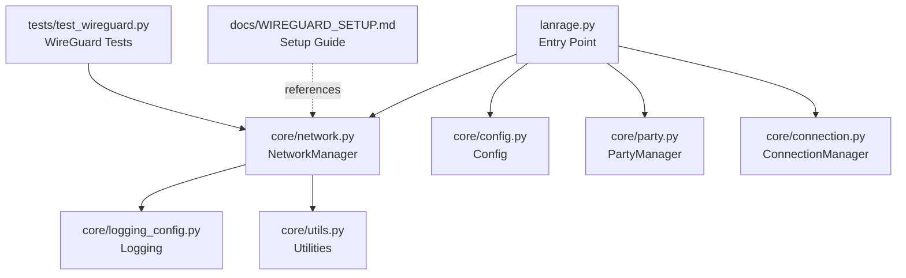
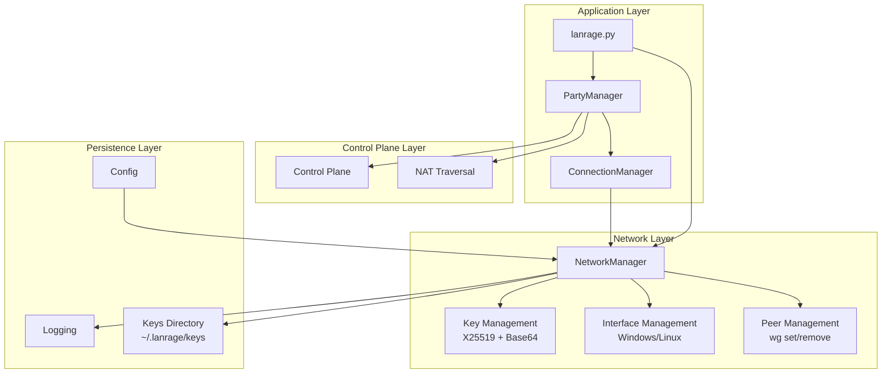
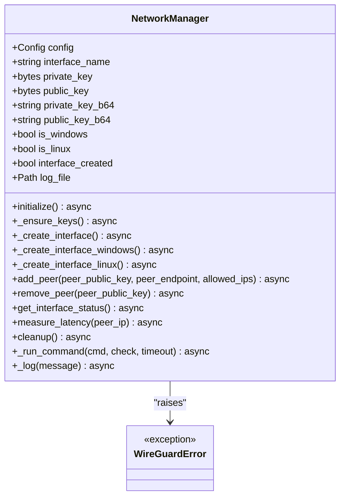
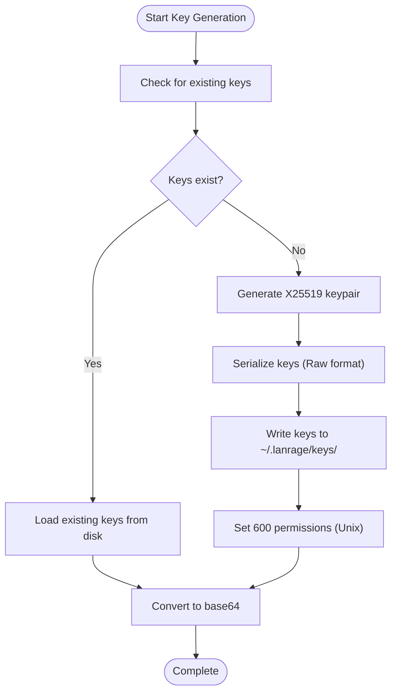
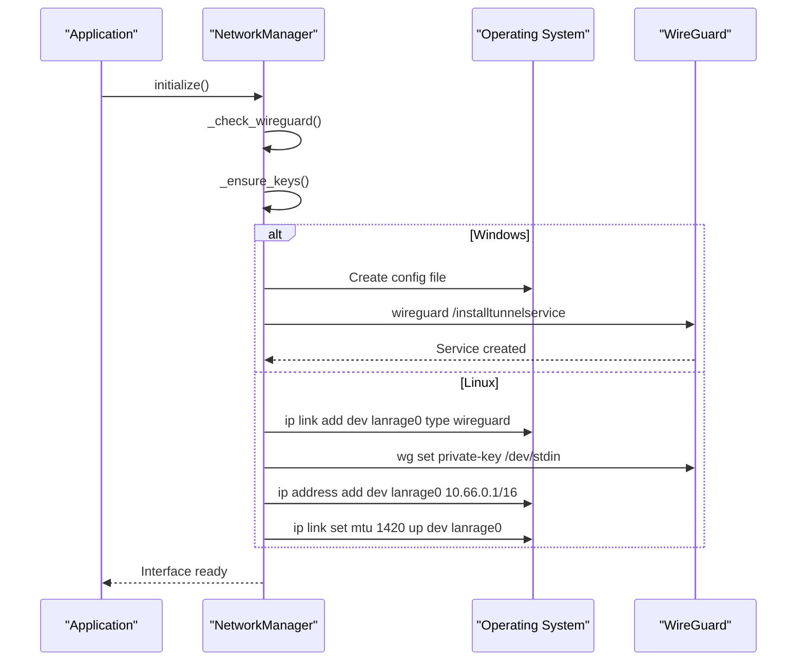
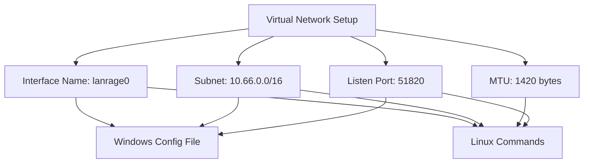
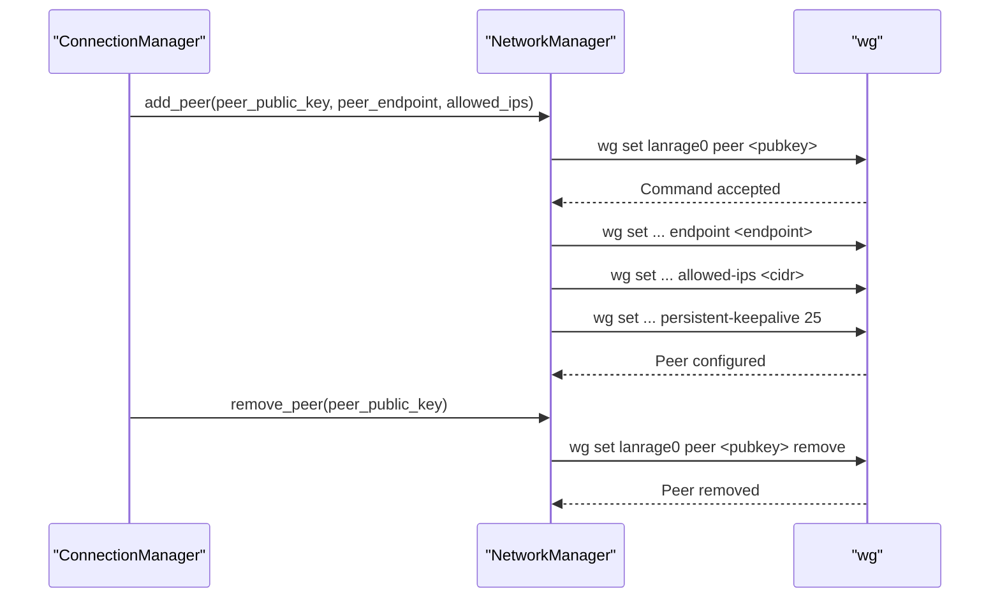
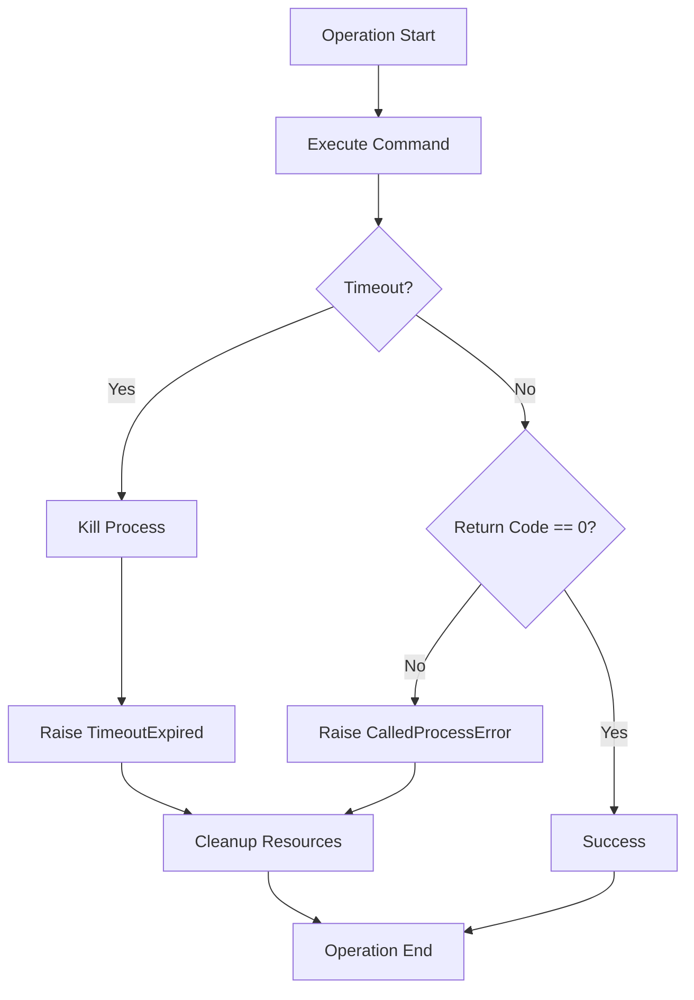
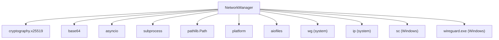

# WireGuard Implementation

<cite>
**Referenced Files in This Document**
- [lanrage.py](file://lanrage.py)
- [network.py](file://core/network.py)
- [config.py](file://core/config.py)
- [party.py](file://core/party.py)
- [connection.py](file://core/connection.py)
- [logging_config.py](file://core/logging_config.py)
- [utils.py](file://core/utils.py)
- [test_wireguard.py](file://tests/test_wireguard.py)
- [WIREGUARD_SETUP.md](file://docs/WIREGUARD_SETUP.md)
</cite>

## Table of Contents
1. [Introduction](#introduction)
2. [Project Structure](#project-structure)
3. [Core Components](#core-components)
4. [Architecture Overview](#architecture-overview)
5. [Detailed Component Analysis](#detailed-component-analysis)
6. [Dependency Analysis](#dependency-analysis)
7. [Performance Considerations](#performance-considerations)
8. [Troubleshooting Guide](#troubleshooting-guide)
9. [Conclusion](#conclusion)

## Introduction
This document provides comprehensive technical documentation for LANrage's WireGuard VPN implementation. It covers the NetworkManager class architecture, cross-platform interface management, cryptographic key generation using X25519 elliptic curve cryptography, base64 encoding for configuration, secure key storage with proper file permissions, and platform-specific implementations for Windows (WireGuardTunnel service) and Linux (ip link type wireguard). It also documents the virtual network configuration with subnet 10.66.0.0/16, interface name lanrage0, MTU optimization to 1420 bytes, WireGuard peer management commands, persistent keepalive configuration, interface status monitoring, error handling strategies, timeout management, and logging mechanisms.

## Project Structure
The WireGuard implementation is primarily located in the core package with supporting components for configuration, logging, utilities, and testing. The main entry point initializes the system and delegates network management to the NetworkManager.

**Diagram sources**
- [lanrage.py](file://lanrage.py#L40-L107)
- [network.py](file://core/network.py#L25-L41)
- [config.py](file://core/config.py#L17-L48)
- [party.py](file://core/party.py#L102-L120)
- [connection.py](file://core/connection.py#L18-L37)
- [logging_config.py](file://core/logging_config.py#L118-L155)
- [utils.py](file://core/utils.py#L12-L40)
- [test_wireguard.py](file://tests/test_wireguard.py#L21-L50)
- [WIREGUARD_SETUP.md](file://docs/WIREGUARD_SETUP.md#L1-L20)

**Section sources**
- [lanrage.py](file://lanrage.py#L40-L107)
- [network.py](file://core/network.py#L25-L41)
- [config.py](file://core/config.py#L17-L48)

## Core Components
- NetworkManager: Central orchestrator for WireGuard interface lifecycle, key management, platform-specific interface creation, peer management, and status monitoring.
- Config: Provides configuration values including virtual subnet, interface name, and keepalive settings.
- PartyManager and ConnectionManager: Higher-level components that coordinate NAT traversal, peer discovery, and WireGuard peer configuration.
- Logging: Structured logging with context variables and performance timing.
- Utilities: Administrative privilege checks and command execution helpers.

Key responsibilities:
- Cross-platform interface creation and cleanup
- X25519 key generation and base64 encoding
- Secure key storage with appropriate file permissions
- Persistent keepalive configuration for NAT traversal
- Latency measurement and connection monitoring
- Error handling with timeouts and structured logging

**Section sources**
- [network.py](file://core/network.py#L25-L41)
- [config.py](file://core/config.py#L17-L48)
- [party.py](file://core/party.py#L102-L120)
- [connection.py](file://core/connection.py#L18-L37)
- [logging_config.py](file://core/logging_config.py#L118-L155)
- [utils.py](file://core/utils.py#L12-L40)

## Architecture Overview
The system follows a layered architecture:
- Application Layer: Entry point and orchestration
- Network Layer: WireGuard interface management
- Control Plane Layer: Peer discovery and NAT coordination
- Persistence Layer: Configuration and key storage

**Diagram sources**
- [lanrage.py](file://lanrage.py#L94-L107)
- [party.py](file://core/party.py#L102-L158)
- [connection.py](file://core/connection.py#L18-L37)
- [network.py](file://core/network.py#L25-L41)
- [config.py](file://core/config.py#L17-L48)
- [logging_config.py](file://core/logging_config.py#L118-L155)

## Detailed Component Analysis

### NetworkManager Class Architecture
NetworkManager encapsulates all WireGuard operations with platform detection and asynchronous command execution.

**Diagram sources**
- [network.py](file://core/network.py#L25-L41)
- [network.py](file://core/network.py#L71-L94)
- [network.py](file://core/network.py#L123-L160)
- [network.py](file://core/network.py#L161-L171)
- [network.py](file://core/network.py#L392-L444)

#### Key Generation Process (X25519 Elliptic Curve)
The implementation uses the cryptography library's X25519 primitives for key generation:
- Generates Curve25519 private/public key pairs
- Serializes keys in raw format without encryption
- Converts to base64 for WireGuard configuration
- Stores keys in the keys directory with secure permissions on Unix systems

**Diagram sources**
- [network.py](file://core/network.py#L123-L160)

**Section sources**
- [network.py](file://core/network.py#L123-L160)

#### Cross-Platform Interface Management
Platform detection determines implementation strategy:
- Windows: Uses WireGuardTunnel service with configuration file management
- Linux: Uses ip link and wg commands for interface creation and management

**Diagram sources**
- [network.py](file://core/network.py#L71-L94)
- [network.py](file://core/network.py#L161-L171)
- [network.py](file://core/network.py#L172-L235)
- [network.py](file://core/network.py#L236-L310)

**Section sources**
- [network.py](file://core/network.py#L161-L171)
- [network.py](file://core/network.py#L172-L235)
- [network.py](file://core/network.py#L236-L310)

#### Virtual Network Configuration
The implementation establishes a virtual network with:
- Interface name: lanrage0 (configurable)
- Subnet: 10.66.0.0/16 (configurable)
- MTU: 1420 bytes (optimized for WireGuard overhead)
- Listen port: 51820 (hardcoded in Windows configuration)

**Diagram sources**
- [config.py](file://core/config.py#L24-L25)
- [config.py](file://core/config.py#L46-L47)
- [network.py](file://core/network.py#L180-L184)
- [network.py](file://core/network.py#L273-L299)

**Section sources**
- [config.py](file://core/config.py#L24-L25)
- [config.py](file://core/config.py#L46-L47)
- [network.py](file://core/network.py#L180-L184)
- [network.py](file://core/network.py#L273-L299)

#### Peer Management Operations
Peer management uses wg commands with persistent keepalive for NAT traversal:
- Add peer: wg set <iface> peer <pubkey> endpoint <ip:port> allowed-ips <cidr> persistent-keepalive 25
- Remove peer: wg set <iface> peer <pubkey> remove
- Status: wg show <iface>

**Diagram sources**
- [connection.py](file://core/connection.py#L95-L99)
- [network.py](file://core/network.py#L392-L420)
- [network.py](file://core/network.py#L421-L444)

**Section sources**
- [connection.py](file://core/connection.py#L95-L99)
- [network.py](file://core/network.py#L392-L420)
- [network.py](file://core/network.py#L421-L444)

#### Error Handling and Timeout Management
The implementation includes comprehensive error handling:
- Asynchronous command execution with configurable timeouts
- Graceful fallbacks for unsupported platforms
- Structured logging for diagnostics
- Cleanup procedures on failure

**Diagram sources**
- [network.py](file://core/network.py#L483-L515)

**Section sources**
- [network.py](file://core/network.py#L483-L515)

### Logging and Monitoring
The system employs structured logging with context variables for correlation tracking:
- JSON-formatted logs with performance timing
- Context variables for peer_id, party_id, session_id, correlation_id
- Network operation logging to file with fallback to stderr
- Timing decorators for performance measurement

**Section sources**
- [logging_config.py](file://core/logging_config.py#L118-L155)
- [logging_config.py](file://core/logging_config.py#L169-L231)
- [network.py](file://core/network.py#L42-L69)

### Testing and Validation
The test suite validates WireGuard functionality:
- Privilege checks for administrative access
- Interface initialization and status verification
- Latency measurement capabilities
- Cleanup procedures

**Section sources**
- [test_wireguard.py](file://tests/test_wireguard.py#L21-L87)

## Dependency Analysis
The WireGuard implementation has minimal external dependencies focused on core system operations:

**Diagram sources**
- [network.py](file://core/network.py#L3-L16)
- [network.py](file://core/network.py#L483-L515)

**Section sources**
- [network.py](file://core/network.py#L3-L16)
- [network.py](file://core/network.py#L483-L515)

## Performance Considerations
- MTU optimization: 1420 bytes reduces fragmentation overhead
- Persistent keepalive: 25-second intervals balance NAT traversal with bandwidth efficiency
- Asynchronous operations: Non-blocking command execution prevents UI blocking
- Connection monitoring: Periodic latency checks with adaptive reconnection
- Resource cleanup: Proper interface deletion on shutdown or failure

## Troubleshooting Guide

### Common Issues and Solutions
- **WireGuard not found**: Verify installation and PATH configuration
- **Permission denied**: Ensure administrative/root privileges
- **Interface conflicts**: Check for existing interfaces and remove them
- **Latency measurement failures**: Verify ICMP access and network connectivity

### Error Categories
- Initialization failures: Platform detection, key generation, interface creation
- Runtime failures: Peer management, status monitoring, cleanup operations
- Configuration errors: Invalid settings, missing dependencies

### Diagnostic Tools
- Interface status: `wg show lanrage0`
- Latency testing: Platform-specific ping commands
- Log inspection: Network operation logs in configuration directory

**Section sources**
- [WIREGUARD_SETUP.md](file://docs/WIREGUARD_SETUP.md#L166-L224)
- [network.py](file://core/network.py#L445-L463)

## Conclusion
LANrage's WireGuard implementation provides a robust, cross-platform VPN solution with secure key management, platform-specific interface handling, and comprehensive error management. The modular architecture enables easy maintenance and extension while maintaining strong security practices through proper key storage and cryptographic standards. The implementation demonstrates good engineering practices with structured logging, performance monitoring, and graceful error handling suitable for production gaming environments.