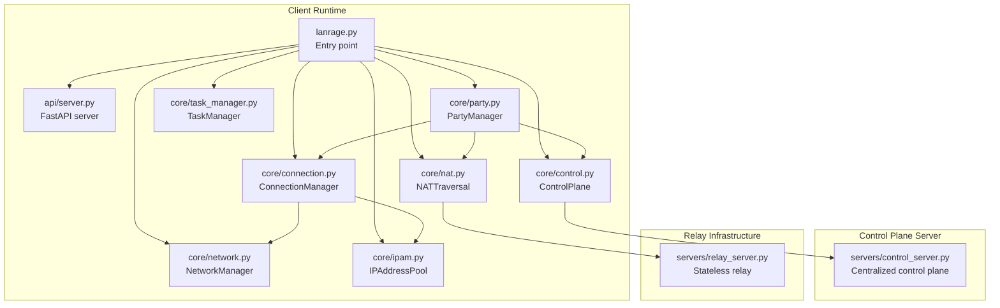
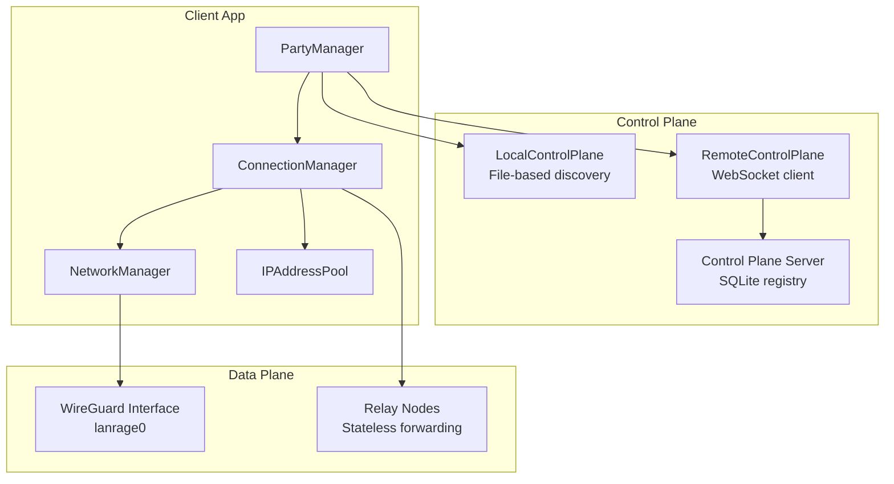
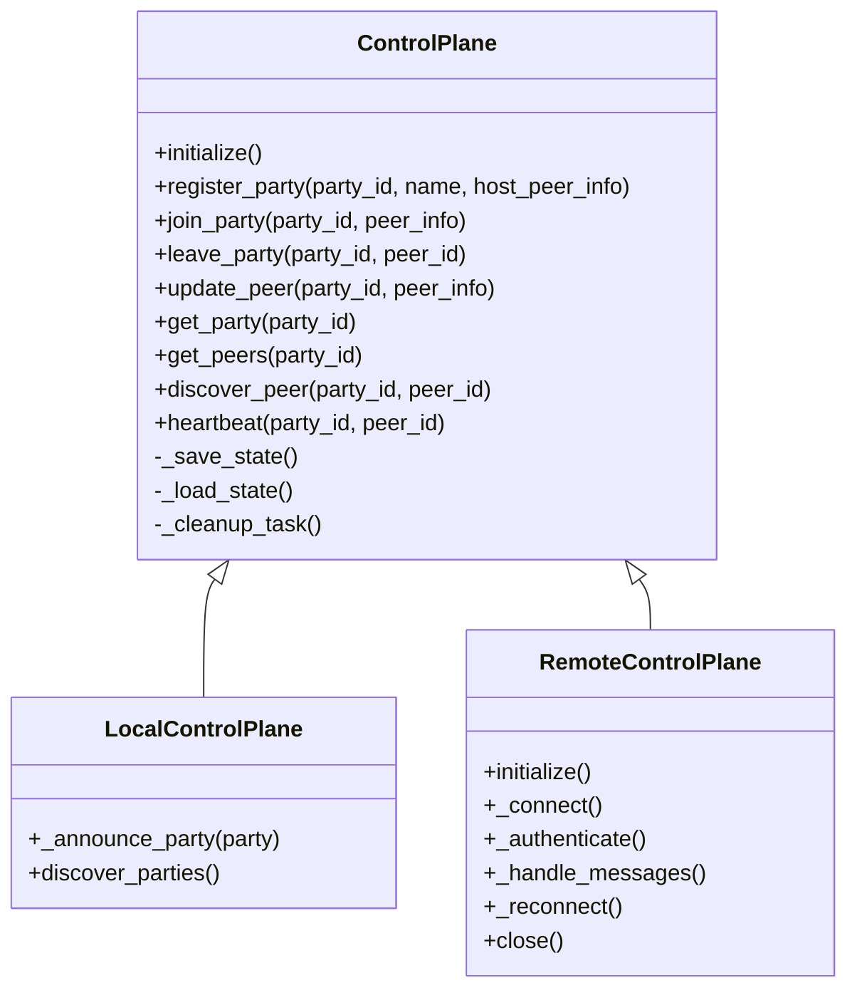
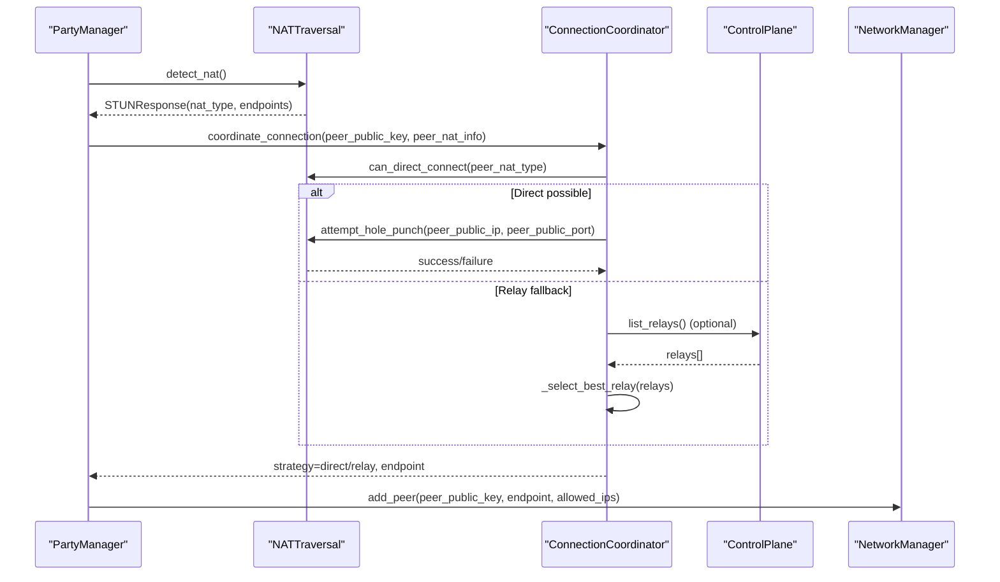
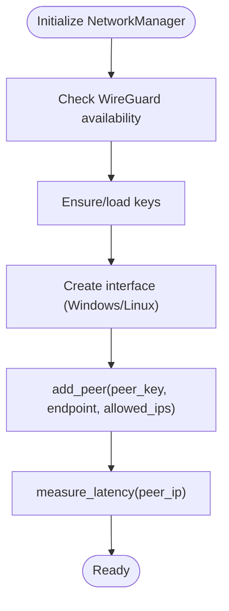
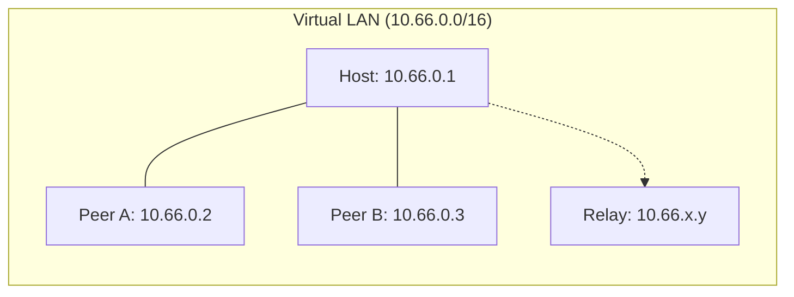
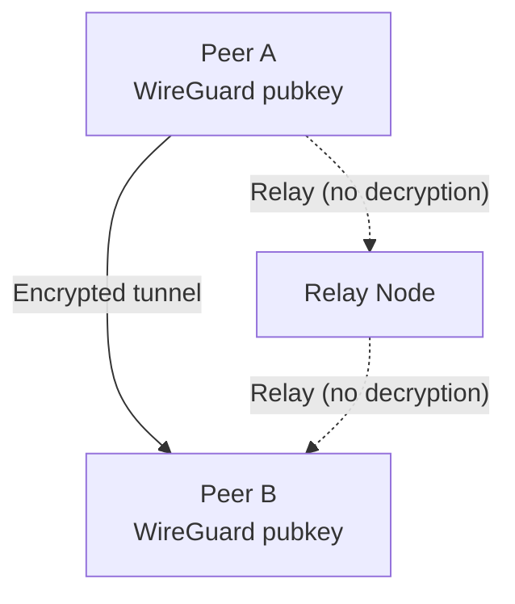
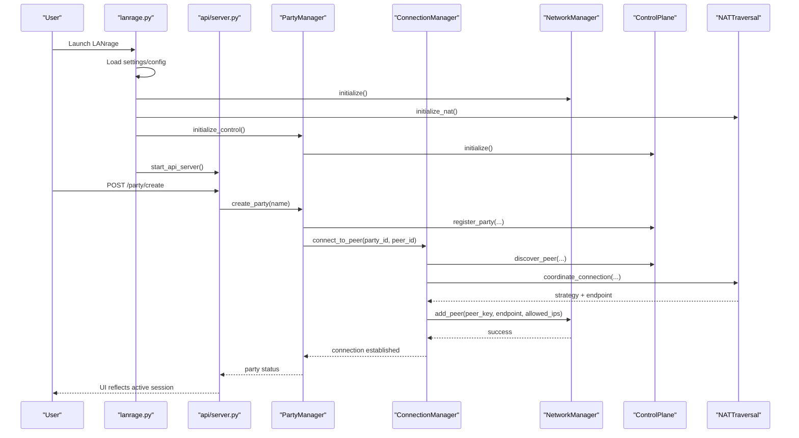
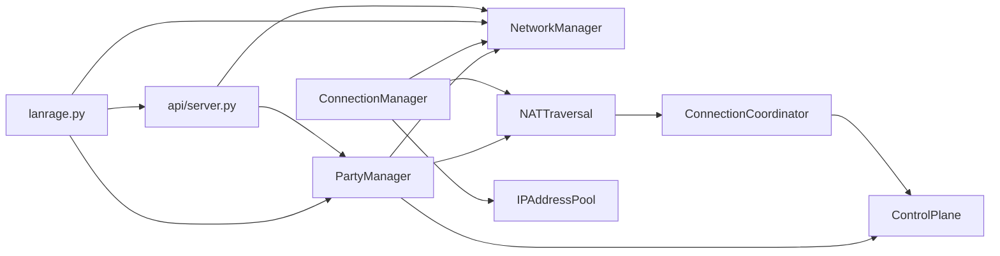

# System Overview

<cite>
**Referenced Files in This Document**
- [README.md](file://README.md)
- [ARCHITECTURE.md](file://docs/ARCHITECTURE.md)
- [CONTROL_PLANE.md](file://docs/CONTROL_PLANE.md)
- [NAT_TRAVERSAL.md](file://docs/NAT_TRAVERSAL.md)
- [NETWORK.md](file://docs/NETWORK.md)
- [lanrage.py](file://lanrage.py)
- [api/server.py](file://api/server.py)
- [core/config.py](file://core/config.py)
- [core/control.py](file://core/control.py)
- [core/nat.py](file://core/nat.py)
- [core/network.py](file://core/network.py)
- [core/connection.py](file://core/connection.py)
- [core/party.py](file://core/party.py)
- [core/ipam.py](file://core/ipam.py)
- [core/task_manager.py](file://core/task_manager.py)
- [servers/control_server.py](file://servers/control_server.py)
- [servers/relay_server.py](file://servers/relay_server.py)
</cite>

## Table of Contents
1. [Introduction](#introduction)
2. [Project Structure](#project-structure)
3. [Core Components](#core-components)
4. [Architecture Overview](#architecture-overview)
5. [Detailed Component Analysis](#detailed-component-analysis)
6. [Dependency Analysis](#dependency-analysis)
7. [Performance Considerations](#performance-considerations)
8. [Troubleshooting Guide](#troubleshooting-guide)
9. [Conclusion](#conclusion)

## Introduction
LANrage is a zero-configuration mesh VPN designed to make online gaming feel like a LAN party. It solves the fundamental problem of gaming networking over the internet—where traditional NAT traversal and port forwarding create latency-heavy, unreliable connections—by combining:
- Direct peer-to-peer (P2P) connectivity when possible
- Smart relay fallback for NAT traversal
- A virtual LAN overlay with broadcast/multicast emulation
- Game-aware profiles and QoS
- A clean web UI and REST API

Its core design philosophy prioritizes gamers: latency obsession, zero configuration, and open-source simplicity. The system achieves near-LAN performance by leveraging WireGuard for secure, low-latency tunnels and implementing robust NAT traversal with STUN/UDP hole punching and relay selection.

**Section sources**
- [README.md](file://README.md#L22-L56)
- [README.md](file://README.md#L326-L333)

## Project Structure
LANrage is organized around a modular Python architecture with three primary layers:
- Control plane: Peer discovery, party management, and relay coordination
- Data plane: WireGuard-based virtual network and peer tunnels
- Client application: Local API server, web UI, and runtime orchestration

**Diagram sources**
- [lanrage.py](file://lanrage.py#L40-L154)
- [api/server.py](file://api/server.py#L680-L701)
- [core/party.py](file://core/party.py#L102-L158)
- [core/network.py](file://core/network.py#L25-L41)
- [core/control.py](file://core/control.py#L187-L227)
- [core/nat.py](file://core/nat.py#L41-L63)
- [core/connection.py](file://core/connection.py#L18-L37)
- [core/ipam.py](file://core/ipam.py#L10-L32)
- [core/task_manager.py](file://core/task_manager.py#L11-L25)
- [servers/control_server.py](file://servers/control_server.py#L231-L242)
- [servers/relay_server.py](file://servers/relay_server.py#L30-L80)

**Section sources**
- [lanrage.py](file://lanrage.py#L40-L154)
- [api/server.py](file://api/server.py#L680-L701)

## Core Components
- Control plane (SQLite-based or remote WebSocket-based)
  - Peer discovery, party registration, heartbeat, and cleanup
  - Local file-based discovery and remote control plane integration
- Data plane (WireGuard)
  - Encrypted tunnels, direct P2P or relayed paths, MTU and keepalive tuning
- Client application
  - Local API server, web UI, network manager, party manager, and metrics
- Relay nodes
  - Stateless packet forwarders with optional discovery and selection

**Section sources**
- [ARCHITECTURE.md](file://docs/ARCHITECTURE.md#L7-L38)
- [CONTROL_PLANE.md](file://docs/CONTROL_PLANE.md#L1-L629)
- [NETWORK.md](file://docs/NETWORK.md#L1-L453)

## Architecture Overview
LANrage’s three-tier architecture separates concerns:
- Control plane: Manages identity, discovery, and signaling
- Data plane: Provides encrypted, low-latency tunnels
- Client application: Orchestrates initialization, NAT traversal, and user experience

**Diagram sources**
- [core/control.py](file://core/control.py#L458-L539)
- [core/control.py](file://core/control.py#L541-L800)
- [servers/control_server.py](file://servers/control_server.py#L231-L242)
- [core/connection.py](file://core/connection.py#L18-L37)
- [core/network.py](file://core/network.py#L25-L41)
- [core/ipam.py](file://core/ipam.py#L10-L32)
- [servers/relay_server.py](file://servers/relay_server.py#L30-L80)

**Section sources**
- [ARCHITECTURE.md](file://docs/ARCHITECTURE.md#L3-L91)

## Detailed Component Analysis

### Control Plane
The control plane coordinates peer discovery and party lifecycle:
- Local mode uses a shared discovery file for LAN-only scenarios
- Remote mode connects to a centralized control plane server via WebSocket
- Persistent state stored in JSON with batched writes to reduce I/O
- Cleanup task removes stale peers and empty parties

**Diagram sources**
- [core/control.py](file://core/control.py#L187-L227)
- [core/control.py](file://core/control.py#L458-L539)
- [core/control.py](file://core/control.py#L541-L800)

**Section sources**
- [CONTROL_PLANE.md](file://docs/CONTROL_PLANE.md#L1-L629)
- [core/control.py](file://core/control.py#L19-L114)

### NAT Traversal and Relay Selection
LANrage detects NAT type using STUN, performs UDP hole punching, and falls back to relay servers when needed. It selects the best relay by latency measurement and supports multi-region discovery.

**Diagram sources**
- [core/nat.py](file://core/nat.py#L41-L106)
- [core/nat.py](file://core/nat.py#L200-L276)
- [core/nat.py](file://core/nat.py#L330-L398)
- [core/connection.py](file://core/connection.py#L38-L125)
- [core/network.py](file://core/network.py#L392-L420)

**Section sources**
- [NAT_TRAVERSAL.md](file://docs/NAT_TRAVERSAL.md#L1-L562)
- [core/nat.py](file://core/nat.py#L19-L106)
- [core/nat.py](file://core/nat.py#L330-L398)
- [core/connection.py](file://core/connection.py#L38-L125)

### Data Plane: WireGuard Interface and Virtual Network
The data plane manages the WireGuard interface, peer configuration, and latency measurement. It enforces a virtual LAN subnet and MTU suitable for gaming.

**Diagram sources**
- [core/network.py](file://core/network.py#L70-L94)
- [core/network.py](file://core/network.py#L123-L160)
- [core/network.py](file://core/network.py#L161-L310)
- [core/network.py](file://core/network.py#L392-L420)
- [core/network.py](file://core/network.py#L340-L391)

**Section sources**
- [NETWORK.md](file://docs/NETWORK.md#L1-L453)
- [core/network.py](file://core/network.py#L25-L94)

### Virtual Network Topology, Subnet Allocation, and Interface Management
- Virtual subnet: 10.66.0.0/16 with interface lanrage0
- MTU: 1420 to account for WireGuard overhead
- IPAM allocates per-peer virtual IPs from sequential /24 subnets within the base subnet
- ConnectionManager assigns virtual IPs and configures WireGuard peers

**Diagram sources**
- [NETWORK.md](file://docs/NETWORK.md#L267-L288)
- [core/ipam.py](file://core/ipam.py#L10-L32)
- [core/connection.py](file://core/connection.py#L181-L212)

**Section sources**
- [NETWORK.md](file://docs/NETWORK.md#L267-L288)
- [core/ipam.py](file://core/ipam.py#L55-L98)
- [core/connection.py](file://core/connection.py#L181-L212)

### Security Model
- Transport encryption: WireGuard ChaCha20-Poly1305 with X25519 key exchange
- Authentication: Public key cryptography; peers exchange WireGuard public keys
- Trust model: Peer-to-peer with trustless relay nodes that never decrypt traffic
- Control plane: Optional remote control plane with future authentication

**Diagram sources**
- [ARCHITECTURE.md](file://docs/ARCHITECTURE.md#L79-L91)
- [NAT_TRAVERSAL.md](file://docs/NAT_TRAVERSAL.md#L479-L485)
- [NETWORK.md](file://docs/NETWORK.md#L351-L372)

**Section sources**
- [ARCHITECTURE.md](file://docs/ARCHITECTURE.md#L79-L91)
- [NAT_TRAVERSAL.md](file://docs/NAT_TRAVERSAL.md#L463-L485)
- [NETWORK.md](file://docs/NETWORK.md#L351-L372)

### Client Application Lifecycle: From Initialization to Active Gaming
The client initializes settings, network, NAT detection, control plane, and starts the API server. Users create or join parties, which triggers peer discovery, NAT traversal, and WireGuard configuration.

**Diagram sources**
- [lanrage.py](file://lanrage.py#L40-L154)
- [api/server.py](file://api/server.py#L155-L175)
- [core/party.py](file://core/party.py#L159-L196)
- [core/connection.py](file://core/connection.py#L38-L125)
- [core/network.py](file://core/network.py#L392-L420)
- [core/control.py](file://core/control.py#L228-L267)
- [core/nat.py](file://core/nat.py#L330-L398)

**Section sources**
- [lanrage.py](file://lanrage.py#L40-L154)
- [api/server.py](file://api/server.py#L155-L175)
- [core/party.py](file://core/party.py#L159-L196)
- [core/connection.py](file://core/connection.py#L38-L125)

## Dependency Analysis
Key dependencies and interactions:
- PartyManager depends on NetworkManager, NATTraversal, and ControlPlane
- ConnectionManager depends on NetworkManager, NATTraversal, and IPAM
- ControlPlane integrates with LocalControlPlane/RemoteControlPlane and optionally a centralized control plane server
- NATTraversal integrates with ConnectionCoordinator and optionally queries the control plane for relay discovery
- API server orchestrates PartyManager, NetworkManager, Metrics, Discord, and ServerBrowser

**Diagram sources**
- [core/party.py](file://core/party.py#L102-L158)
- [core/connection.py](file://core/connection.py#L18-L37)
- [core/network.py](file://core/network.py#L25-L41)
- [core/nat.py](file://core/nat.py#L330-L398)
- [core/ipam.py](file://core/ipam.py#L10-L32)
- [lanrage.py](file://lanrage.py#L108-L154)
- [api/server.py](file://api/server.py#L680-L701)

**Section sources**
- [core/party.py](file://core/party.py#L102-L158)
- [core/connection.py](file://core/connection.py#L18-L37)
- [core/nat.py](file://core/nat.py#L330-L398)
- [core/network.py](file://core/network.py#L25-L41)
- [core/ipam.py](file://core/ipam.py#L10-L32)
- [lanrage.py](file://lanrage.py#L108-L154)
- [api/server.py](file://api/server.py#L680-L701)

## Performance Considerations
- Latency targets
  - Direct P2P: <1ms overhead
  - Same-region relay: 5–15ms overhead
  - Cross-region relay: 30–100ms overhead
- Throughput: Line speed with WireGuard overhead
- CPU/memory: <5% idle, <15% active; <100MB per client
- MTU: 1420 bytes; persistent keepalive 25 seconds for NAT traversal
- Scalability: Single relay 50–100 concurrent connections, 500 Mbps throughput; relay pools with anycast and auto-scaling

**Section sources**
- [ARCHITECTURE.md](file://docs/ARCHITECTURE.md#L119-L172)
- [NETWORK.md](file://docs/NETWORK.md#L325-L350)

## Troubleshooting Guide
Common issues and resolutions:
- NAT detection failures
  - Cause: Firewall blocking UDP, STUN unreachable
  - Resolution: Check firewall, test STUN manually, try different network
- Hole punching failures
  - Cause: Symmetric NAT, strict firewall, timing
  - Resolution: Automatic relay fallback, retry on different network
- Relay connection slowness
  - Cause: Geographic distance, overload, congestion
  - Resolution: Use closer relay, deploy more relays, check network quality
- WireGuard not found
  - Cause: Missing WireGuard, insufficient privileges
  - Resolution: Install WireGuard, run as admin/root, ensure port 51820 available
- Peer unreachable
  - Cause: Incorrect endpoint, firewall, NAT traversal issues
  - Resolution: Verify endpoint, allow UDP 51820, test ping, check NAT status

**Section sources**
- [NAT_TRAVERSAL.md](file://docs/NAT_TRAVERSAL.md#L486-L523)
- [NETWORK.md](file://docs/NETWORK.md#L373-L410)

## Conclusion
LANrage’s mesh VPN architecture delivers a zero-configuration, latency-first gaming experience by combining robust NAT traversal, a secure WireGuard data plane, and a practical control plane. Its three-tier design cleanly separates discovery/signaling, transport, and application concerns, enabling scalable, reliable peer-to-peer gaming over the internet with minimal friction.