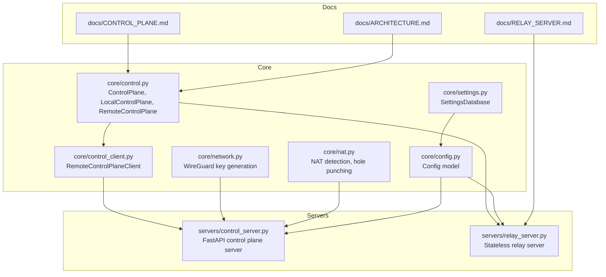
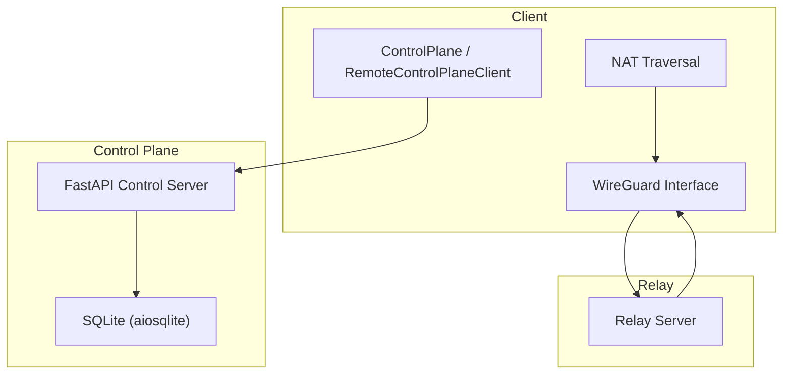
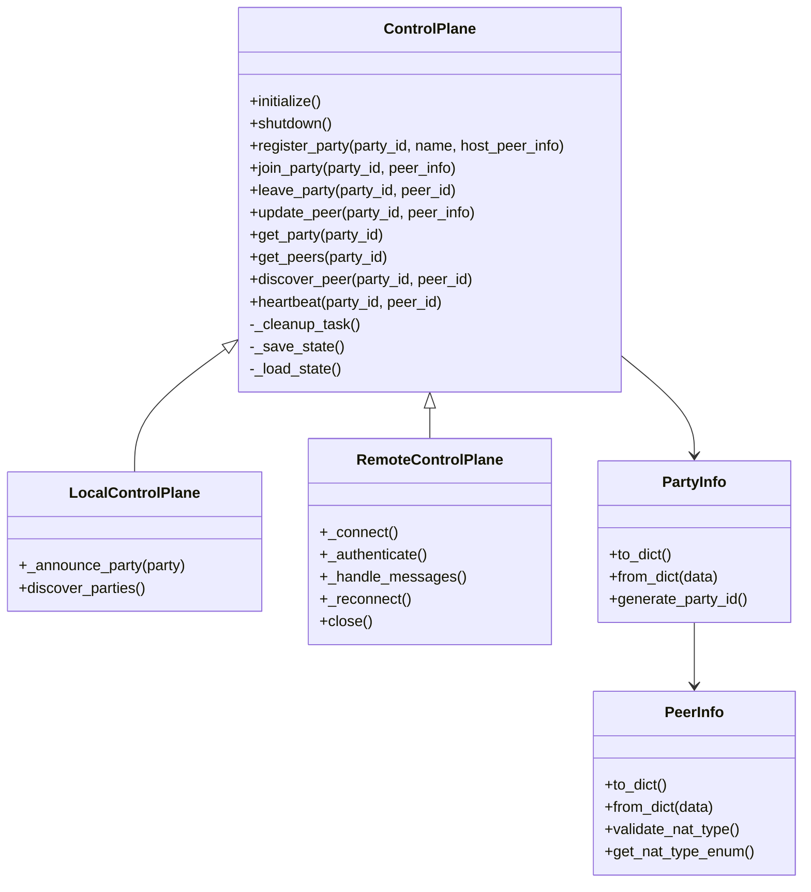
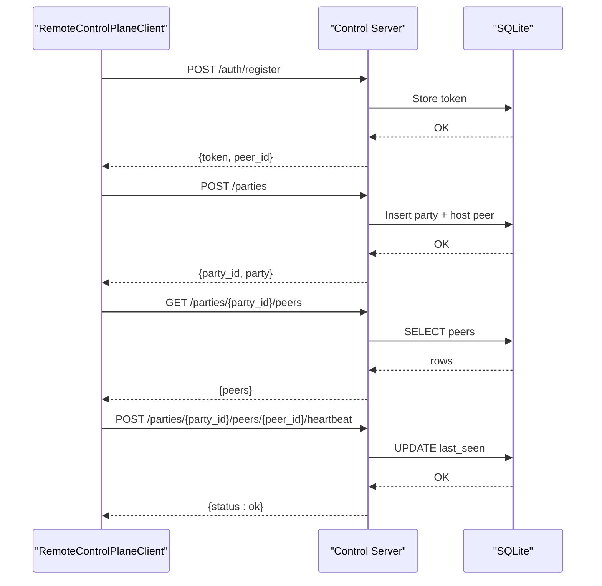
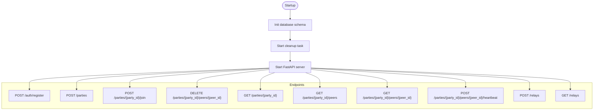
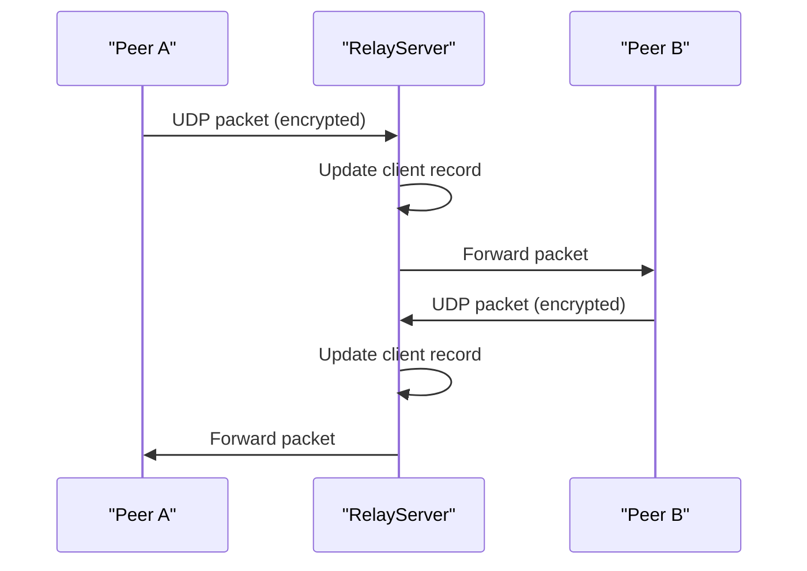
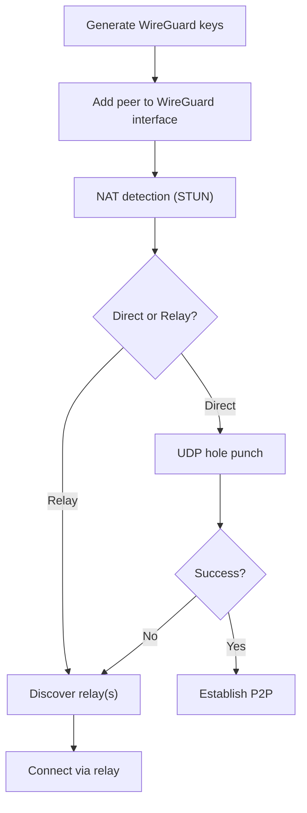
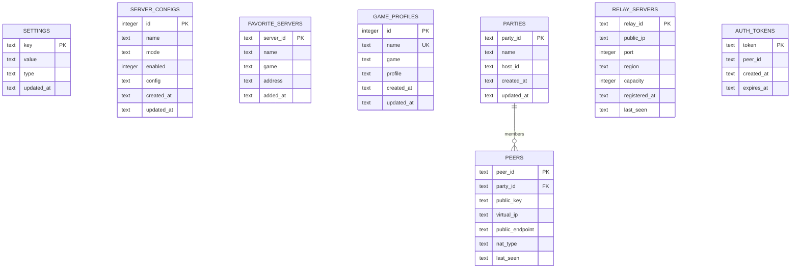
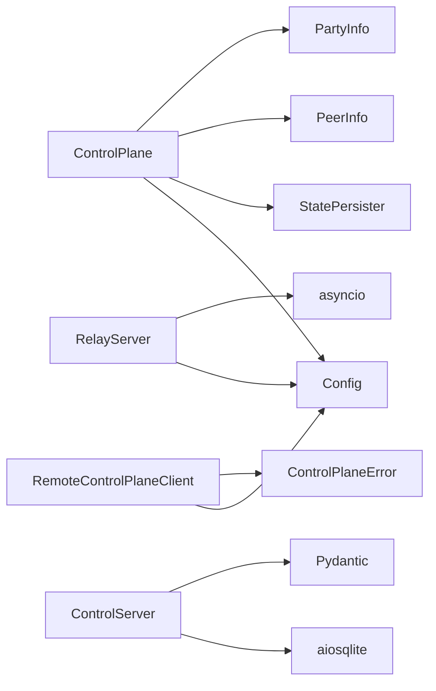

# Control Plane

<cite>
**Referenced Files in This Document**
- [core/control.py](file://core/control.py)
- [core/control_client.py](file://core/control_client.py)
- [servers/control_server.py](file://servers/control_server.py)
- [servers/relay_server.py](file://servers/relay_server.py)
- [core/network.py](file://core/network.py)
- [core/nat.py](file://core/nat.py)
- [core/settings.py](file://core/settings.py)
- [core/config.py](file://core/config.py)
- [docs/CONTROL_PLANE.md](file://docs/CONTROL_PLANE.md)
- [docs/RELAY_SERVER.md](file://docs/RELAY_SERVER.md)
- [docs/ARCHITECTURE.md](file://docs/ARCHITECTURE.md)
- [.env.example](file://.env.example)
</cite>

## Table of Contents
1. [Introduction](#introduction)
2. [Project Structure](#project-structure)
3. [Core Components](#core-components)
4. [Architecture Overview](#architecture-overview)
5. [Detailed Component Analysis](#detailed-component-analysis)
6. [Dependency Analysis](#dependency-analysis)
7. [Performance Considerations](#performance-considerations)
8. [Troubleshooting Guide](#troubleshooting-guide)
9. [Conclusion](#conclusion)
10. [Appendices](#appendices)

## Introduction
This document describes LANrage’s control plane system responsible for peer discovery, key exchange, and session management. It explains how the system discovers peers, coordinates sessions, persists state, and integrates with relay servers for NAT traversal. It also documents the control server architecture, relay server implementation, database integration, security measures, and deployment guidelines.

## Project Structure
The control plane spans several modules:
- Core control plane logic and state persistence
- Remote control plane client for HTTP-based coordination
- Control plane server with FastAPI and SQLite
- Relay server for stateless packet forwarding
- Network and NAT traversal utilities for key exchange and connectivity
- Settings and configuration management

**Diagram sources**
- [core/control.py](file://core/control.py#L187-L880)
- [core/control_client.py](file://core/control_client.py#L23-L438)
- [servers/control_server.py](file://servers/control_server.py#L1-L729)
- [servers/relay_server.py](file://servers/relay_server.py#L1-L297)
- [core/network.py](file://core/network.py#L25-L515)
- [core/nat.py](file://core/nat.py#L41-L525)
- [core/settings.py](file://core/settings.py#L20-L525)
- [core/config.py](file://core/config.py#L17-L114)
- [docs/CONTROL_PLANE.md](file://docs/CONTROL_PLANE.md#L1-L629)
- [docs/RELAY_SERVER.md](file://docs/RELAY_SERVER.md#L1-L544)
- [docs/ARCHITECTURE.md](file://docs/ARCHITECTURE.md#L1-L206)

**Section sources**
- [docs/ARCHITECTURE.md](file://docs/ARCHITECTURE.md#L1-L206)

## Core Components
- ControlPlane: In-memory party registry with file-backed persistence and cleanup.
- LocalControlPlane: File-based discovery for local LAN testing.
- RemoteControlPlane: HTTP client to a centralized control plane server.
- RemoteControlPlaneClient: Async HTTP client with retry/backoff and heartbeat.
- Control Plane Server: FastAPI service with SQLite for persistent state, authentication tokens, and relay registry.
- Relay Server: Stateless UDP packet forwarder for NAT traversal.
- Network Manager: WireGuard key generation and interface management.
- NAT Traversal: STUN-based NAT detection and UDP hole punching.
- Settings Database: SQLite-backed settings store with typed serialization.

**Section sources**
- [core/control.py](file://core/control.py#L187-L880)
- [core/control_client.py](file://core/control_client.py#L23-L438)
- [servers/control_server.py](file://servers/control_server.py#L1-L729)
- [servers/relay_server.py](file://servers/relay_server.py#L1-L297)
- [core/network.py](file://core/network.py#L25-L515)
- [core/nat.py](file://core/nat.py#L41-L525)
- [core/settings.py](file://core/settings.py#L20-L525)

## Architecture Overview
The control plane architecture separates concerns:
- Control Plane (SQLite): Persistent registry of parties, peers, and relay servers; authentication tokens.
- Data Plane (WireGuard): Encrypted P2P tunnels with optional relay fallback.
- Client Application: Local API server, Web UI, and orchestration of control plane and data plane.
- Relay Nodes: Stateless forwarders for NAT traversal.

**Diagram sources**
- [servers/control_server.py](file://servers/control_server.py#L1-L729)
- [core/control_client.py](file://core/control_client.py#L23-L438)
- [core/network.py](file://core/network.py#L25-L515)
- [core/nat.py](file://core/nat.py#L41-L525)
- [servers/relay_server.py](file://servers/relay_server.py#L1-L297)

## Detailed Component Analysis

### Control Plane: Peer Discovery, Registration, and State Persistence
- Data models:
  - PeerInfo: Peer identity, keys, NAT info, and timestamps.
  - PartyInfo: Party metadata and member registry.
- ControlPlane:
  - Registers/joins/leaves parties.
  - Updates peer info and heartbeats.
  - Periodic cleanup of stale peers and parties.
  - Batched state persistence to disk with deduplicated writes.
- LocalControlPlane:
  - Announces parties to a shared discovery file for local LAN discovery.
- RemoteControlPlane:
  - HTTP client to control server with retry/backoff and heartbeat.
  - WebSocket connection (planned) for live updates.

**Diagram sources**
- [core/control.py](file://core/control.py#L115-L880)

**Section sources**
- [core/control.py](file://core/control.py#L187-L880)
- [docs/CONTROL_PLANE.md](file://docs/CONTROL_PLANE.md#L1-L629)

### Remote Control Plane Client: HTTP Coordination
- Async HTTP client with:
  - Automatic retry/backoff.
  - Connection pooling and timeouts.
  - Heartbeat management.
- Operations:
  - Register peer and obtain token.
  - Create/join parties.
  - Discover peers and parties.
  - Heartbeat and graceful leave.

**Diagram sources**
- [core/control_client.py](file://core/control_client.py#L161-L438)
- [servers/control_server.py](file://servers/control_server.py#L267-L594)

**Section sources**
- [core/control_client.py](file://core/control_client.py#L23-L438)
- [servers/control_server.py](file://servers/control_server.py#L267-L594)

### Control Plane Server: Centralized Registry and Authentication
- Endpoints:
  - Authentication: register peer and issue token.
  - Party management: create, join, leave, list peers, discover peer.
  - Heartbeat: keep peer alive.
  - Relay registry: register and list relays.
- Database schema:
  - parties, peers, relay_servers, auth_tokens.
- Background cleanup:
  - Removes stale peers, empty parties, expired tokens, and stale relays.

**Diagram sources**
- [servers/control_server.py](file://servers/control_server.py#L36-L213)
- [servers/control_server.py](file://servers/control_server.py#L267-L729)

**Section sources**
- [servers/control_server.py](file://servers/control_server.py#L1-L729)

### Relay Server: Stateless Packet Forwarder
- Stateless forwarding of encrypted WireGuard packets.
- Automatic cleanup of stale clients.
- Statistics tracking and periodic reporting.
- Optional rate limiting and blocked IP tracking.

**Diagram sources**
- [servers/relay_server.py](file://servers/relay_server.py#L85-L255)

**Section sources**
- [servers/relay_server.py](file://servers/relay_server.py#L1-L297)
- [docs/RELAY_SERVER.md](file://docs/RELAY_SERVER.md#L1-L544)

### Key Exchange and Session Management
- WireGuard key exchange:
  - NetworkManager generates X25519 keypairs and manages WireGuard interface.
- NAT traversal:
  - NATTraversal detects NAT type via STUN and attempts UDP hole punching.
  - ConnectionCoordinator selects direct or relay strategy and discovers relays.
- Session coordination:
  - Control plane stores peer public keys and NAT info.
  - Clients coordinate endpoints and persist keys for future sessions.

**Diagram sources**
- [core/network.py](file://core/network.py#L123-L160)
- [core/nat.py](file://core/nat.py#L64-L106)
- [core/nat.py](file://core/nat.py#L244-L294)
- [core/nat.py](file://core/nat.py#L330-L455)

**Section sources**
- [core/network.py](file://core/network.py#L25-L515)
- [core/nat.py](file://core/nat.py#L41-L525)

### Database Integration: Persistent Configuration and State
- SettingsDatabase:
  - Typed settings storage with JSON serialization for complex values.
  - Server configurations, favorites, and game profiles.
- Control Plane Database:
  - Parties, peers, relay servers, and auth tokens.
  - Indexes for efficient queries.
- Initialization and migrations:
  - Schema creation on first run.
  - Cleanup tasks for stale entries.

**Diagram sources**
- [core/settings.py](file://core/settings.py#L42-L95)
- [servers/control_server.py](file://servers/control_server.py#L40-L98)

**Section sources**
- [core/settings.py](file://core/settings.py#L20-L525)
- [servers/control_server.py](file://servers/control_server.py#L36-L98)

## Dependency Analysis
- ControlPlane depends on:
  - Config for paths and settings.
  - StatePersister for batched persistence.
  - PeerInfo/PartyInfo for data modeling.
- RemoteControlPlaneClient depends on:
  - httpx for async HTTP.
  - ControlPlaneError for error handling.
- Control Server depends on:
  - aiosqlite for async DB operations.
  - Pydantic models for request/response validation.
- Relay Server depends on:
  - asyncio for UDP handling.
  - Config for runtime settings.

**Diagram sources**
- [core/control.py](file://core/control.py#L187-L210)
- [core/control_client.py](file://core/control_client.py#L35-L46)
- [servers/control_server.py](file://servers/control_server.py#L20-L30)
- [servers/relay_server.py](file://servers/relay_server.py#L16-L18)

**Section sources**
- [core/control.py](file://core/control.py#L187-L210)
- [core/control_client.py](file://core/control_client.py#L35-L46)
- [servers/control_server.py](file://servers/control_server.py#L20-L30)
- [servers/relay_server.py](file://servers/relay_server.py#L16-L18)

## Performance Considerations
- Control Plane:
  - Batched state writes reduce disk I/O.
  - Cleanup runs periodically to prune stale entries.
- Relay Server:
  - Stateless forwarding with minimal CPU/memory overhead.
  - UDP buffer tuning and kernel parameters improve throughput.
- NAT Traversal:
  - STUN reduces connection setup latency.
  - Hole punching avoids unnecessary relay usage.

[No sources needed since this section provides general guidance]

## Troubleshooting Guide
- Control Plane Client:
  - Timeouts and connection failures are retried with exponential backoff.
  - Heartbeat keeps peers alive; failures are logged but do not crash the client.
- Control Server:
  - Health endpoint reports counts of parties and relays.
  - Cleanup removes stale peers and expired tokens.
- Relay Server:
  - Stale client cleanup prevents resource leaks.
  - Stats printed periodically aid monitoring.
- NAT Traversal:
  - STUN failures indicate network restrictions; fall back to relay.
  - Hole punching failures suggest symmetric NAT requiring relay.

**Section sources**
- [core/control_client.py](file://core/control_client.py#L75-L160)
- [servers/control_server.py](file://servers/control_server.py#L244-L263)
- [servers/relay_server.py](file://servers/relay_server.py#L189-L222)
- [core/nat.py](file://core/nat.py#L64-L106)

## Conclusion
LANrage’s control plane provides a robust, database-backed foundation for peer discovery, session coordination, and relay management. The separation of concerns between control and data planes, combined with NAT traversal and relay fallback, ensures reliable connectivity across diverse network environments. The documented architecture, APIs, and deployment guidance enable scalable and secure operations.

[No sources needed since this section summarizes without analyzing specific files]

## Appendices

### Deployment Guidelines
- Control Plane Server:
  - Run with FastAPI/Uvicorn; ensure SQLite file location is writable.
  - Configure API host/port via settings database.
- Relay Server:
  - Expose UDP port 51820; tune kernel buffers for throughput.
  - Use systemd or Docker for production deployments.
- Client:
  - Configure settings via Web UI; restart to apply changes.
- Environment:
  - Legacy .env is deprecated; all settings are stored in the settings database.

**Section sources**
- [servers/control_server.py](file://servers/control_server.py#L685-L729)
- [servers/relay_server.py](file://servers/relay_server.py#L258-L297)
- [.env.example](file://.env.example#L1-L36)
- [docs/RELAY_SERVER.md](file://docs/RELAY_SERVER.md#L236-L302)