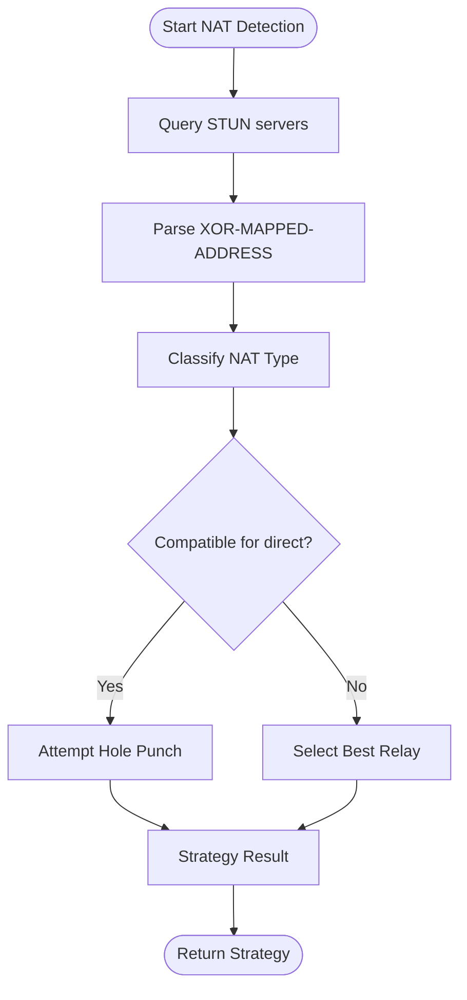

# Key Exchange Mechanism

<cite>
**Referenced Files in This Document**
- [core/control.py](file://core/control.py)
- [core/nat.py](file://core/nat.py)
- [core/network.py](file://core/network.py)
- [core/connection.py](file://core/connection.py)
- [core/config.py](file://core/config.py)
- [servers/control_server.py](file://servers/control_server.py)
- [docs/CONTROL_PLANE.md](file://docs/CONTROL_PLANE.md)
- [docs/NAT_TRAVERSAL.md](file://docs/NAT_TRAVERSAL.md)
- [docs/CONNECTION.md](file://docs/CONNECTION.md)
- [docs/WIREGUARD_SETUP.md](file://docs/WIREGUARD_SETUP.md)
- [lanrage.py](file://lanrage.py)
</cite>

## Table of Contents
1. [Introduction](#introduction)
2. [Project Structure](#project-structure)
3. [Core Components](#core-components)
4. [Architecture Overview](#architecture-overview)
5. [Detailed Component Analysis](#detailed-component-analysis)
6. [Dependency Analysis](#dependency-analysis)
7. [Performance Considerations](#performance-considerations)
8. [Troubleshooting Guide](#troubleshooting-guide)
9. [Conclusion](#conclusion)

## Introduction
This document explains the key exchange mechanism used in LANrage's control plane for establishing secure peer-to-peer connections. It covers the cryptographic handshake process, the PeerInfo data structure and its public_key field, NAT type detection and traversal strategies, the signal_connection method for WebRTC-style signaling, security considerations for key distribution and peer authentication, and integration with WireGuard key management across the peer lifecycle.

## Project Structure
The key exchange spans several modules:
- Control plane: peer discovery, party management, and signaling coordination
- NAT traversal: STUN-based detection and UDP hole punching
- Network/WireGuard: cryptographic key management and peer configuration
- Connection manager: orchestration of discovery, strategy selection, and monitoring

**Diagram sources**
- [core/control.py](file://core/control.py#L115-L185)
- [core/nat.py](file://core/nat.py#L19-L525)
- [core/network.py](file://core/network.py#L25-L515)
- [core/connection.py](file://core/connection.py#L18-L493)
- [core/config.py](file://core/config.py#L17-L114)
- [servers/control_server.py](file://servers/control_server.py#L1-L729)
- [lanrage.py](file://lanrage.py#L40-L150)

**Section sources**
- [core/control.py](file://core/control.py#L115-L185)
- [core/nat.py](file://core/nat.py#L19-L525)
- [core/network.py](file://core/network.py#L25-L515)
- [core/connection.py](file://core/connection.py#L18-L493)
- [core/config.py](file://core/config.py#L17-L114)
- [servers/control_server.py](file://servers/control_server.py#L1-L729)
- [lanrage.py](file://lanrage.py#L40-L150)

## Core Components
- PeerInfo: carries cryptographic identity (public_key) and network metadata (NAT type, public/private endpoints) used for connection coordination.
- NATTraversal: detects NAT type via STUN and performs UDP hole punching to enable direct P2P.
- ConnectionCoordinator: selects direct vs relay strategy based on NAT compatibility.
- NetworkManager: manages WireGuard interface, generates X25519 keys, and adds/removes peers.
- ControlPlane: persists peer state, coordinates discovery, and provides signaling hooks for WebRTC-style coordination.

**Section sources**
- [core/control.py](file://core/control.py#L115-L185)
- [core/nat.py](file://core/nat.py#L19-L525)
- [core/network.py](file://core/network.py#L25-L515)
- [core/connection.py](file://core/connection.py#L18-L493)

## Architecture Overview
The key exchange lifecycle integrates cryptographic identity distribution with NAT-aware connection orchestration:

**Diagram sources**
- [core/connection.py](file://core/connection.py#L39-L125)
- [core/nat.py](file://core/nat.py#L64-L327)
- [core/network.py](file://core/network.py#L392-L420)
- [core/control.py](file://core/control.py#L331-L346)

## Detailed Component Analysis

### PeerInfo Data Structure and Public Key Role
PeerInfo encapsulates the identity and network context required for secure peer exchange:
- peer_id: unique identifier
- name: display name
- public_key: WireGuard public key (base64) used for cryptographic identification and WireGuard peer configuration
- nat_type: NAT classification affecting connection strategy
- public_ip/public_port and local_ip/local_port: endpoint metadata for direct/relay decisions
- last_seen: heartbeat timestamp for liveness

The public_key field is central to:
- WireGuard peer addition/removal
- Identity verification (cryptographic, not shared credentials)
- Deterministic virtual IP assignment per peer

**Diagram sources**
- [core/control.py](file://core/control.py#L115-L185)

**Section sources**
- [core/control.py](file://core/control.py#L115-L185)
- [docs/CONTROL_PLANE.md](file://docs/CONTROL_PLANE.md#L18-L80)

### NAT Type Detection and Connection Strategies
NATTraversal performs STUN-based detection and determines whether direct P2P is feasible:
- NATType enum defines classifications from open to symmetric
- detect_nat parses XOR-MAPPED-ADDRESS to infer public/private endpoint mapping
- can_direct_connect evaluates compatibility matrices
- ConnectionCoordinator selects "direct" or "relay" and coordinates endpoint configuration

**Diagram sources**
- [core/nat.py](file://core/nat.py#L64-L327)
- [docs/NAT_TRAVERSAL.md](file://docs/NAT_TRAVERSAL.md#L1-L562)

**Section sources**
- [core/nat.py](file://core/nat.py#L19-L525)
- [docs/NAT_TRAVERSAL.md](file://docs/NAT_TRAVERSAL.md#L1-L562)

### Signal Connection for WebRTC-Style Signaling
The control plane supports WebRTC-style signaling to coordinate NAT traversal:
- signal_connection is designed to exchange NAT information and relay endpoints
- RemoteControlPlane exposes a WebSocket channel for signaling messages
- Future implementations can leverage this to coordinate ICE candidates and connectivity checks

Note: The current implementation stubs signaling; production deployments should implement bidirectional signaling and error handling.

**Section sources**
- [core/control.py](file://core/control.py#L347-L361)
- [core/control.py](file://core/control.py#L558-L762)
- [docs/CONTROL_PLANE.md](file://docs/CONTROL_PLANE.md#L490-L575)

### WireGuard Key Management and Lifecycle
WireGuard integration manages cryptographic keys and peer configuration:
- NetworkManager generates X25519 keypairs and stores them securely
- Keys are base64-encoded for WireGuard compatibility
- add_peer configures endpoints and allowed IPs; persistent-keepalive is set for NAT traversal
- During connection, the peer's public_key is used to identify and configure the WireGuard peer

**Diagram sources**
- [core/network.py](file://core/network.py#L392-L420)
- [docs/WIREGUARD_SETUP.md](file://docs/WIREGUARD_SETUP.md#L103-L165)

**Section sources**
- [core/network.py](file://core/network.py#L25-L515)
- [docs/WIREGUARD_SETUP.md](file://docs/WIREGUARD_SETUP.md#L1-L279)

### Connection Orchestration and Monitoring
ConnectionManager orchestrates the end-to-end workflow:
- Discovers peer via ControlPlane
- Coordinates strategy via ConnectionCoordinator
- Configures WireGuard peer
- Allocates deterministic virtual IP
- Starts monitoring tasks for latency and automatic reconnection/relay switching

**Diagram sources**
- [core/connection.py](file://core/connection.py#L39-L125)
- [core/connection.py](file://core/connection.py#L156-L437)

**Section sources**
- [core/connection.py](file://core/connection.py#L18-L493)
- [docs/CONNECTION.md](file://docs/CONNECTION.md#L1-L465)

## Dependency Analysis
The key exchange mechanism depends on tight coupling between modules:
- ConnectionManager depends on ControlPlane for peer discovery, NATTraversal for strategy, and NetworkManager for WireGuard configuration
- ControlPlane persists PeerInfo with public_key and NAT metadata
- NATTraversal provides strategy selection and hole punching
- NetworkManager manages X25519 keys and WireGuard peer operations

**Diagram sources**
- [core/connection.py](file://core/connection.py#L18-L493)
- [core/control.py](file://core/control.py#L187-L456)
- [core/nat.py](file://core/nat.py#L330-L525)
- [core/network.py](file://core/network.py#L25-L515)
- [servers/control_server.py](file://servers/control_server.py#L1-L729)

**Section sources**
- [core/connection.py](file://core/connection.py#L18-L493)
- [core/control.py](file://core/control.py#L187-L456)
- [core/nat.py](file://core/nat.py#L330-L525)
- [core/network.py](file://core/network.py#L25-L515)
- [servers/control_server.py](file://servers/control_server.py#L1-L729)

## Performance Considerations
- NAT detection and hole punching add minimal overhead; direct P2P introduces negligible latency compared to relayed connections
- Persistent keepalive reduces NAT binding churn and improves reliability
- Monitoring tasks check latency periodically to proactively switch relays when degradation occurs

[No sources needed since this section provides general guidance]

## Troubleshooting Guide
Common issues and resolutions:
- NAT detection failures: verify firewall allows UDP to STUN servers; test connectivity manually
- Hole punching failures: expect fallback to relay; confirm symmetric NAT or overly restrictive firewalls
- Relay latency concerns: use ConnectionManager's relay switching to find lower-latency endpoints
- WireGuard initialization errors: ensure administrative privileges and correct platform-specific setup

**Section sources**
- [docs/NAT_TRAVERSAL.md](file://docs/NAT_TRAVERSAL.md#L486-L523)
- [docs/WIREGUARD_SETUP.md](file://docs/WIREGUARD_SETUP.md#L166-L224)
- [core/connection.py](file://core/connection.py#L334-L437)

## Conclusion
LANrage’s key exchange mechanism combines cryptographic identity distribution (via PeerInfo.public_key) with NAT-aware connection orchestration. The control plane coordinates peer discovery and signaling, NAT traversal enables direct P2P where possible, and WireGuard provides secure, authenticated peer-to-peer transport. Together, these components deliver resilient, low-latency connectivity across diverse network environments.