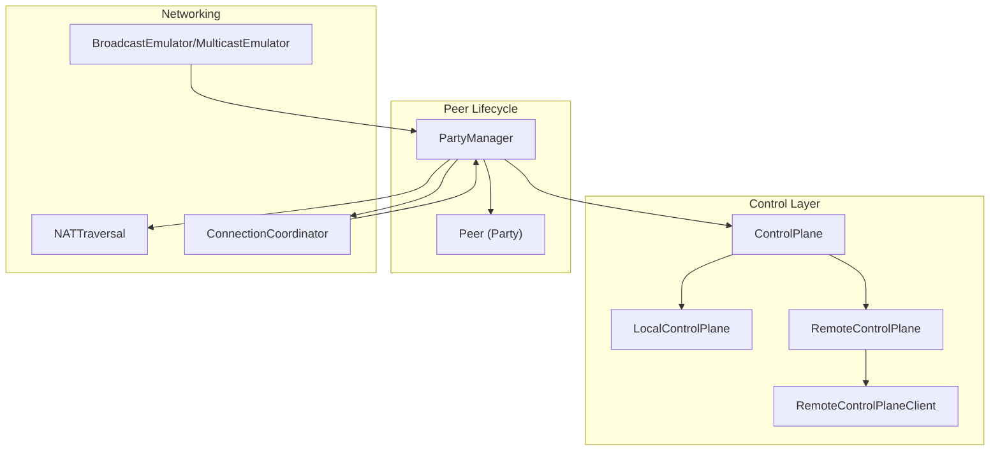
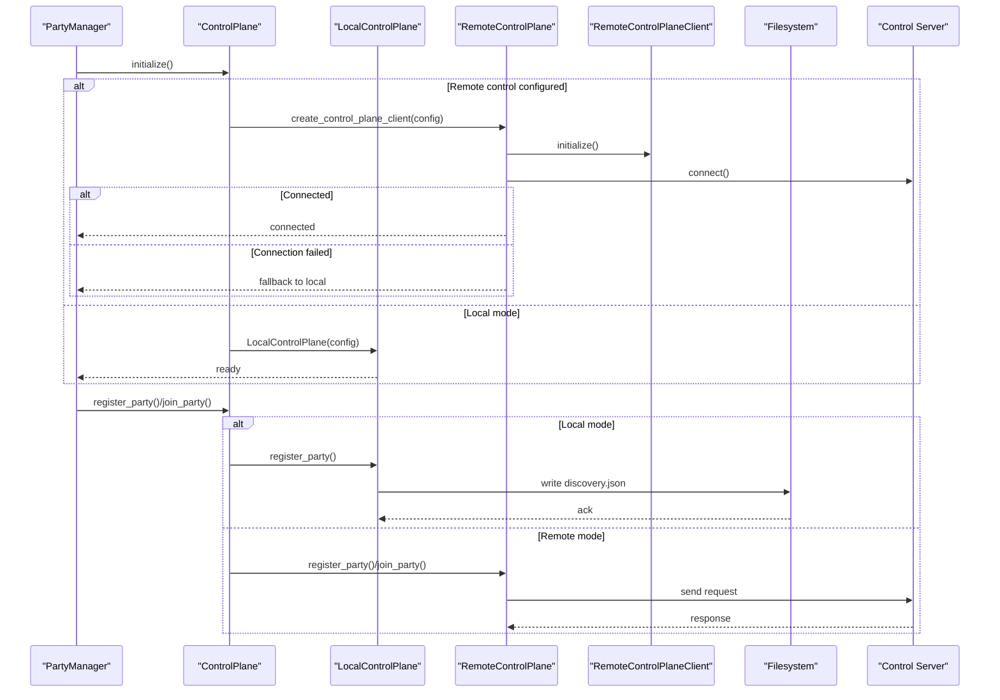
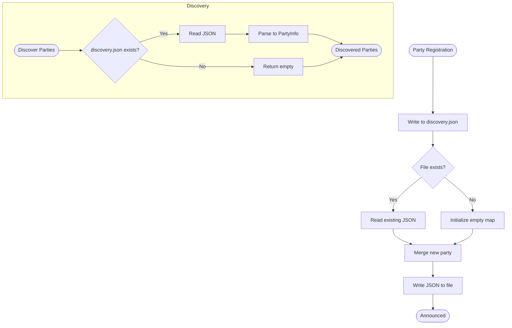
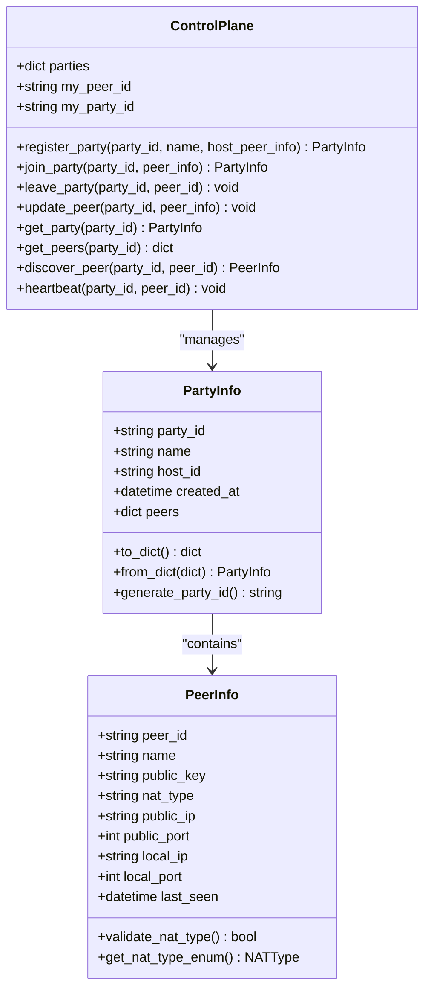
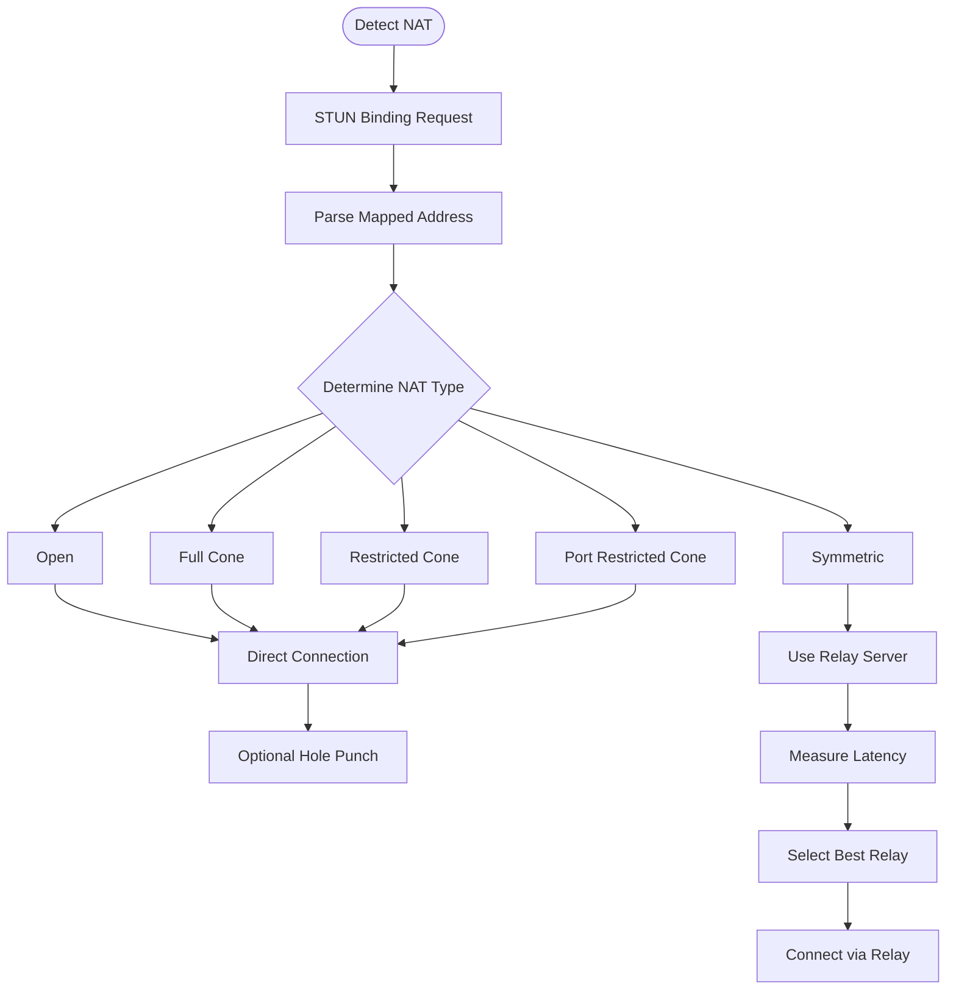
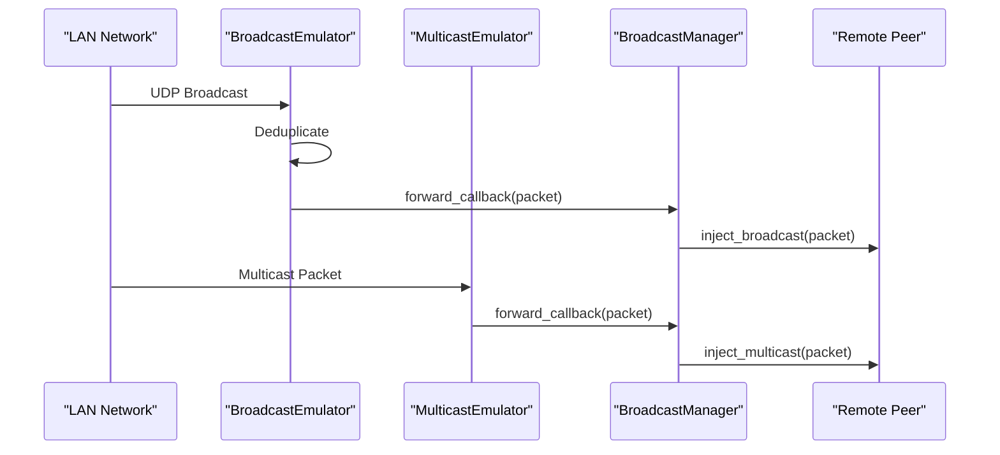
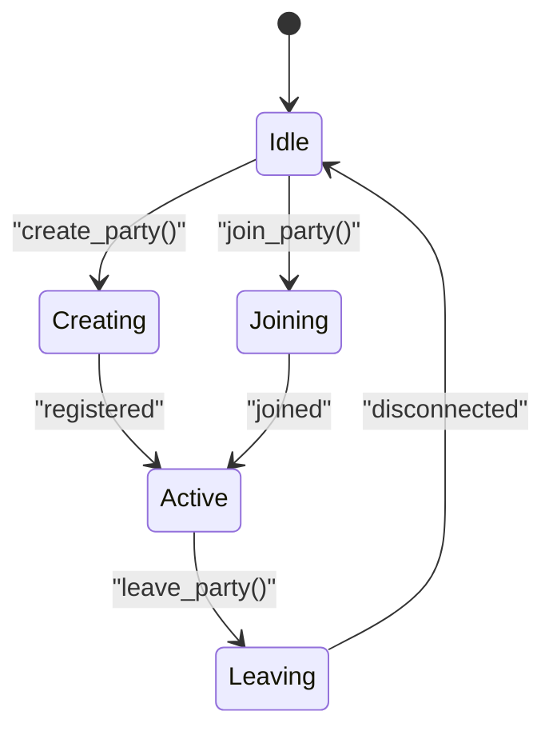
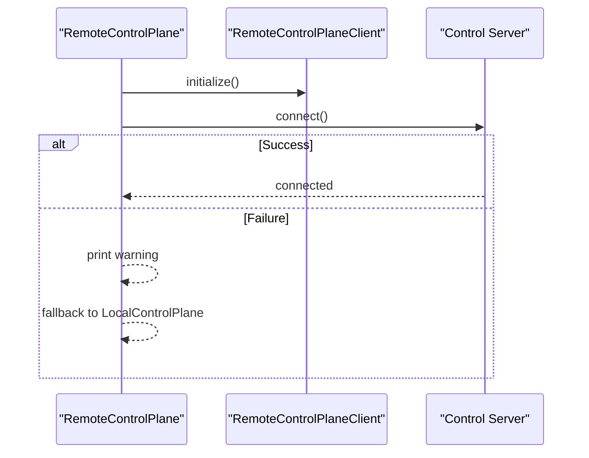
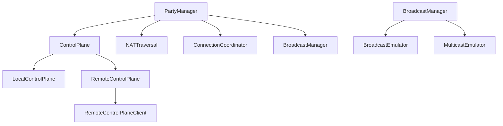
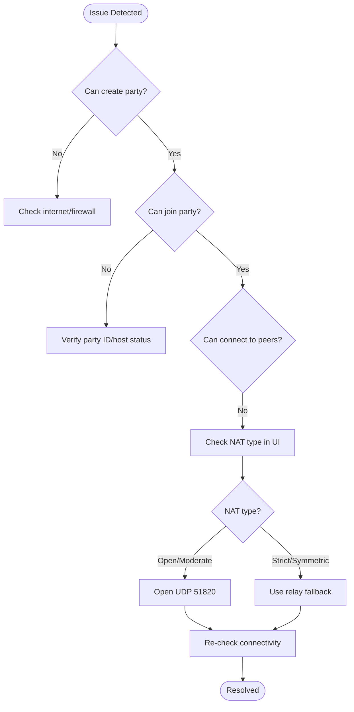

# Peer Discovery System

<cite>
**Referenced Files in This Document**
- [core/control.py](file://core/control.py)
- [core/control_client.py](file://core/control_client.py)
- [core/config.py](file://core/config.py)
- [core/party.py](file://core/party.py)
- [core/nat.py](file://core/nat.py)
- [core/broadcast.py](file://core/broadcast.py)
- [docs/CONTROL_PLANE.md](file://docs/CONTROL_PLANE.md)
- [docs/TROUBLESHOOTING.md](file://docs/TROUBLESHOOTING.md)
- [tests/test_multi_peer.py](file://tests/test_multi_peer.py)
</cite>

## Table of Contents
1. [Introduction](#introduction)
2. [Project Structure](#project-structure)
3. [Core Components](#core-components)
4. [Architecture Overview](#architecture-overview)
5. [Detailed Component Analysis](#detailed-component-analysis)
6. [Dependency Analysis](#dependency-analysis)
7. [Performance Considerations](#performance-considerations)
8. [Troubleshooting Guide](#troubleshooting-guide)
9. [Conclusion](#conclusion)
10. [Appendices](#appendices)

## Introduction
This document explains the peer discovery system that enables LANrage clients to find and connect to each other across the same LAN and beyond. It covers the distributed discovery mechanism using local file-based announcements and broadcast protocols, the LocalControlPlane implementation with discovery.json file sharing for same-LAN scenarios, peer registration and validation, NAT type detection, and peer lifecycle management. It also documents fallback strategies when remote control servers are unavailable and provides practical workflows and troubleshooting guidance.

## Project Structure
The peer discovery system spans several modules:
- Control plane: centralizes peer and party state, persistence, and discovery APIs
- Local control plane: file-based discovery for same-LAN environments
- Remote control plane client: HTTP-based client for centralized control server
- NAT traversal: detects NAT type and coordinates direct vs relay connections
- Broadcast emulation: captures and forwards LAN broadcasts/multicasts to peers
- Party management: orchestrates NAT detection, control plane initialization, and peer lifecycle

**Diagram sources**
- [core/control.py](file://core/control.py#L187-L456)
- [core/control_client.py](file://core/control_client.py#L23-L437)
- [core/party.py](file://core/party.py#L102-L304)
- [core/nat.py](file://core/nat.py#L41-L525)
- [core/broadcast.py](file://core/broadcast.py#L201-L646)

**Section sources**
- [core/control.py](file://core/control.py#L187-L456)
- [core/control_client.py](file://core/control_client.py#L23-L437)
- [core/party.py](file://core/party.py#L102-L304)
- [core/nat.py](file://core/nat.py#L41-L525)
- [core/broadcast.py](file://core/broadcast.py#L201-L646)

## Core Components
- ControlPlane: Base class managing parties, peers, persistence, and cleanup
- LocalControlPlane: File-based discovery for same-LAN using discovery.json
- RemoteControlPlane: Centralized control server client with WebSocket fallback
- RemoteControlPlaneClient: HTTP client for remote control server
- PeerInfo: Structured peer metadata for discovery and signaling
- PartyInfo: Party metadata and peer registry
- PartyManager: Orchestrates NAT detection, control plane integration, and peer lifecycle
- NATTraversal and ConnectionCoordinator: NAT detection and connection strategy selection
- BroadcastEmulator/MulticastEmulator: LAN broadcast/multicast capture and forwarding

**Section sources**
- [core/control.py](file://core/control.py#L115-L456)
- [core/control_client.py](file://core/control_client.py#L23-L437)
- [core/party.py](file://core/party.py#L102-L304)
- [core/nat.py](file://core/nat.py#L19-L525)
- [core/broadcast.py](file://core/broadcast.py#L201-L646)

## Architecture Overview
The peer discovery architecture supports two primary modes:
- Local mode: peers share a discovery.json file in a shared config directory to advertise parties and peers
- Remote mode: peers connect to a centralized control server via WebSocket or HTTP, with automatic fallback to local mode when unavailable

**Diagram sources**
- [core/control.py](file://core/control.py#L863-L879)
- [core/control_client.py](file://core/control_client.py#L48-L58)
- [core/control.py](file://core/control.py#L470-L512)

## Detailed Component Analysis

### LocalControlPlane and discovery.json
LocalControlPlane implements a file-based discovery mechanism for same-LAN environments:
- Announces parties by writing PartyInfo to a shared discovery.json file
- Discovers parties by reading discovery.json and converting entries to PartyInfo
- Persists control state to control_state.json for continuity across restarts

Key behaviors:
- Party announcement writes the entire discovery map and appends the new party
- Discovery reads the file atomically and reconstructs PartyInfo objects
- State persistence batches writes to reduce disk I/O

**Diagram sources**
- [core/control.py](file://core/control.py#L481-L538)

**Section sources**
- [core/control.py](file://core/control.py#L458-L538)
- [docs/CONTROL_PLANE.md](file://docs/CONTROL_PLANE.md#L465-L469)

### Peer Registration and Validation
Peer registration involves creating PeerInfo with identity, cryptographic key, NAT metadata, and IP/port information. The system validates NAT types and persists peer updates.

PeerInfo fields:
- peer_id, name, public_key
- nat_type, public_ip, public_port, local_ip, local_port
- last_seen timestamp for heartbeat tracking

Validation:
- NAT type validation ensures only known types are accepted
- Enum conversion allows downstream logic to rely on standardized values

**Diagram sources**
- [core/control.py](file://core/control.py#L115-L184)
- [core/control.py](file://core/control.py#L187-L456)

**Section sources**
- [core/control.py](file://core/control.py#L115-L184)
- [core/control.py](file://core/control.py#L187-L456)
- [docs/CONTROL_PLANE.md](file://docs/CONTROL_PLANE.md#L18-L52)

### NAT Type Detection and Connection Strategy
NATTraversal performs STUN-based detection and determines NAT type, enabling connection strategies:
- Open and full-cone NATs generally allow direct connections
- Restricted and port-restricted cones may require hole punching
- Symmetric NATs typically require relay servers

ConnectionCoordinator selects between direct and relay strategies and discovers or measures relay endpoints.

**Diagram sources**
- [core/nat.py](file://core/nat.py#L64-L105)
- [core/nat.py](file://core/nat.py#L228-L321)
- [core/nat.py](file://core/nat.py#L330-L525)

**Section sources**
- [core/nat.py](file://core/nat.py#L19-L525)

### Broadcast and Multicast Emulation
BroadcastEmulator and MulticastEmulator capture LAN broadcasts and multicasts and forward them to peers, preventing network loops via deduplication.

Key features:
- Monitors common game ports (e.g., Minecraft, Terraria, Source engine)
- Captures broadcast/multicast packets and injects them back into the LAN
- Deduplicates packets to avoid exponential growth and wasted bandwidth
- Supports graceful error handling and cleanup

**Diagram sources**
- [core/broadcast.py](file://core/broadcast.py#L201-L646)

**Section sources**
- [core/broadcast.py](file://core/broadcast.py#L201-L646)

### Party Management and Lifecycle
PartyManager integrates NAT detection, control plane initialization, and peer lifecycle:
- Initializes NAT traversal and connection coordinator
- Creates or joins parties via the control plane
- Updates peer status and connection types
- Measures latency and exposes NAT information

**Diagram sources**
- [core/party.py](file://core/party.py#L102-L304)

**Section sources**
- [core/party.py](file://core/party.py#L102-L304)

### Remote Control Plane Fallback
RemoteControlPlane attempts to connect to a centralized control server and falls back to local mode on failure. RemoteControlPlaneClient provides HTTP-based operations with retry logic and heartbeat management.

**Diagram sources**
- [core/control.py](file://core/control.py#L558-L621)
- [core/control_client.py](file://core/control_client.py#L48-L58)

**Section sources**
- [core/control.py](file://core/control.py#L541-L791)
- [core/control_client.py](file://core/control_client.py#L23-L437)

## Dependency Analysis
The peer discovery system exhibits layered dependencies:
- PartyManager depends on ControlPlane, NATTraversal, and ConnectionCoordinator
- ControlPlane variants (LocalControlPlane, RemoteControlPlane) depend on configuration and persistence
- RemoteControlPlane depends on RemoteControlPlaneClient for HTTP operations
- BroadcastManager coordinates BroadcastEmulator and MulticastEmulator with peer forwarding

**Diagram sources**
- [core/party.py](file://core/party.py#L102-L304)
- [core/control.py](file://core/control.py#L187-L879)
- [core/control_client.py](file://core/control_client.py#L23-L437)
- [core/broadcast.py](file://core/broadcast.py#L552-L646)

**Section sources**
- [core/party.py](file://core/party.py#L102-L304)
- [core/control.py](file://core/control.py#L187-L879)
- [core/control_client.py](file://core/control_client.py#L23-L437)
- [core/broadcast.py](file://core/broadcast.py#L552-L646)

## Performance Considerations
- Batched state persistence reduces disk I/O and improves reliability
- Broadcast deduplication prevents network loops and bandwidth waste
- Heartbeat intervals and cleanup tasks balance responsiveness and resource usage
- Relay selection measures latency to minimize connection overhead
- NAT detection and hole punching optimize direct connection attempts

[No sources needed since this section provides general guidance]

## Troubleshooting Guide
Common issues and resolutions:
- Connection problems: verify internet connectivity, firewall rules, and NAT type; use relay fallback for strict NATs
- High latency: check connection type (direct vs relay), optimize network conditions, or switch to a closer relay
- Relay server selection: measure latency to available relays and select the best option
- WireGuard interface issues: ensure proper installation and permissions, then recreate the interface

**Diagram sources**
- [docs/TROUBLESHOOTING.md](file://docs/TROUBLESHOOTING.md#L11-L50)

**Section sources**
- [docs/TROUBLESHOOTING.md](file://docs/TROUBLESHOOTING.md#L1-L200)

## Conclusion
The peer discovery system combines local file-based discovery with broadcast/multicast emulation and centralized control for robust cross-LAN peer finding. LocalControlPlane simplifies same-LAN scenarios via discovery.json, while RemoteControlPlane offers scalable centralized management with fallback to local mode. NAT traversal and connection strategies ensure optimal connectivity, and comprehensive lifecycle management keeps peers synchronized and healthy.

[No sources needed since this section summarizes without analyzing specific files]

## Appendices

### Peer Discovery Workflows
- Same-LAN discovery: create a party, LocalControlPlane announces via discovery.json; other peers read discovery.json and join
- Cross-LAN discovery: use RemoteControlPlane to register and discover parties; fallback to local mode if remote server is unavailable
- Broadcast discovery: LAN games emit broadcasts/multicasts; BroadcastEmulator captures and forwards to peers

**Section sources**
- [core/control.py](file://core/control.py#L458-L538)
- [core/broadcast.py](file://core/broadcast.py#L201-L646)
- [tests/test_multi_peer.py](file://tests/test_multi_peer.py#L182-L260)