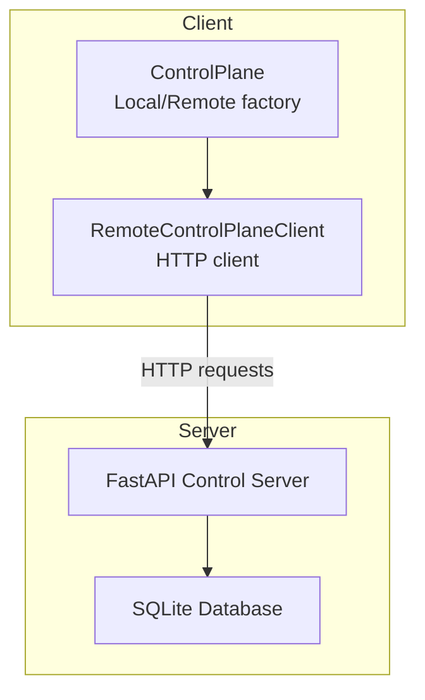
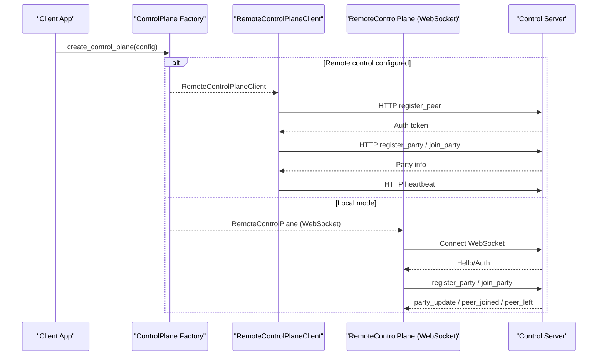
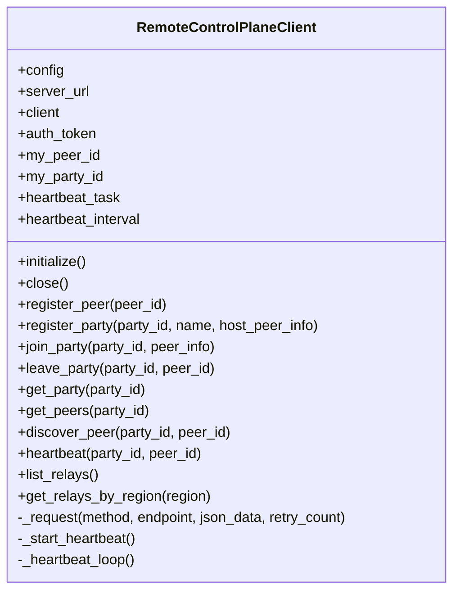
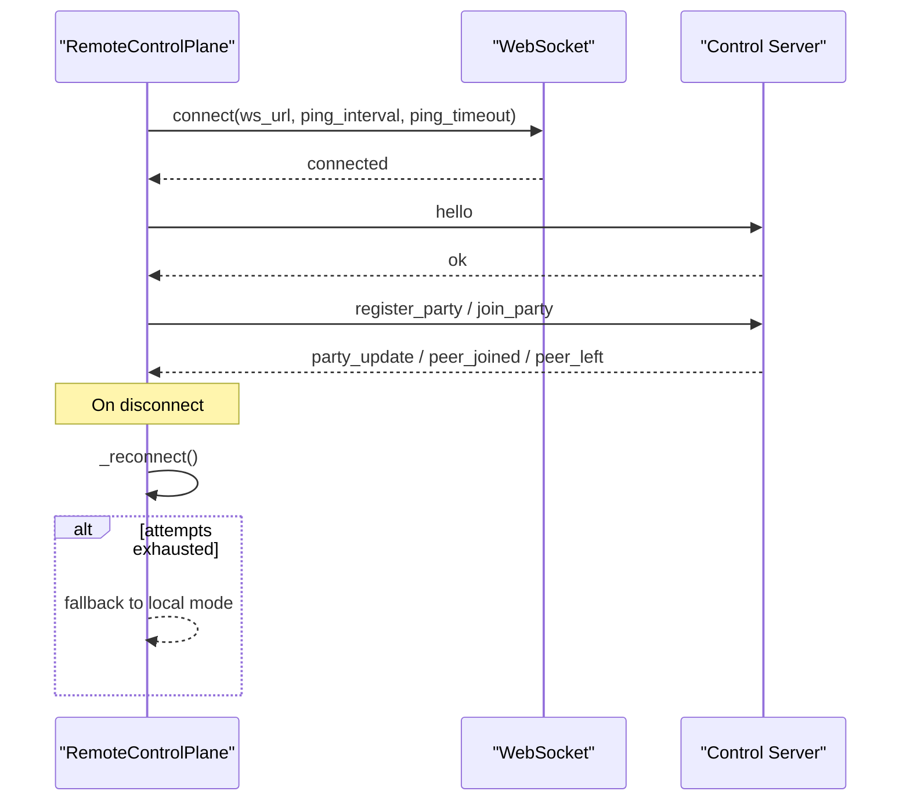
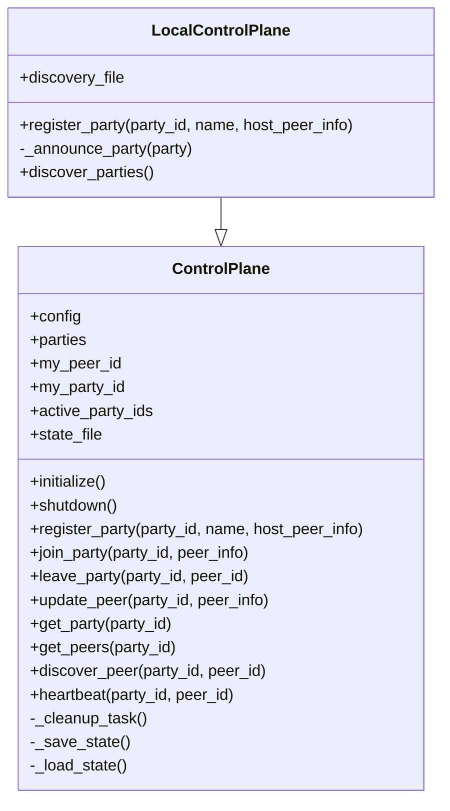
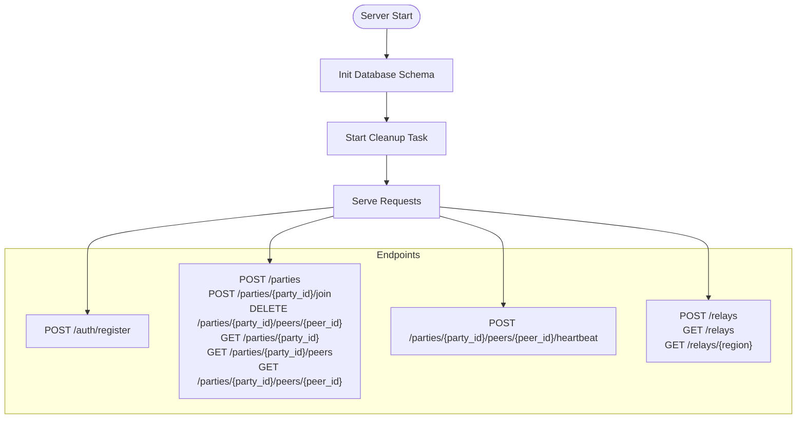
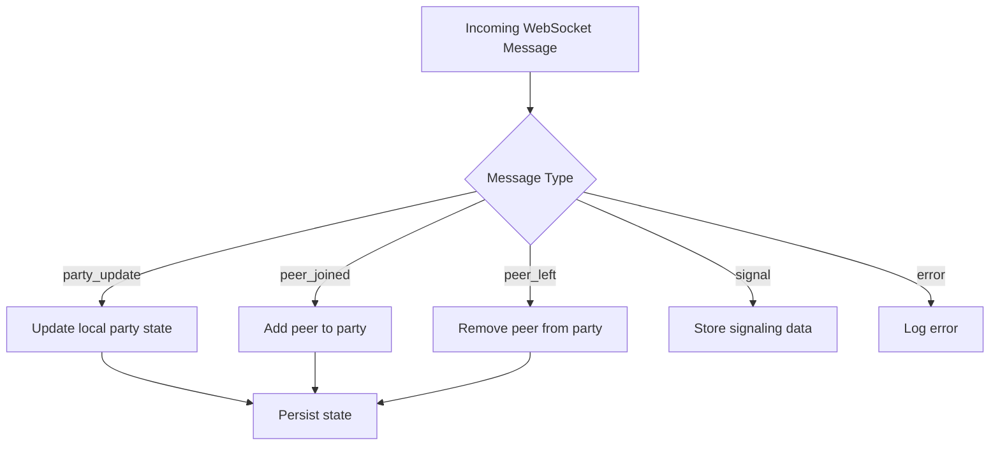
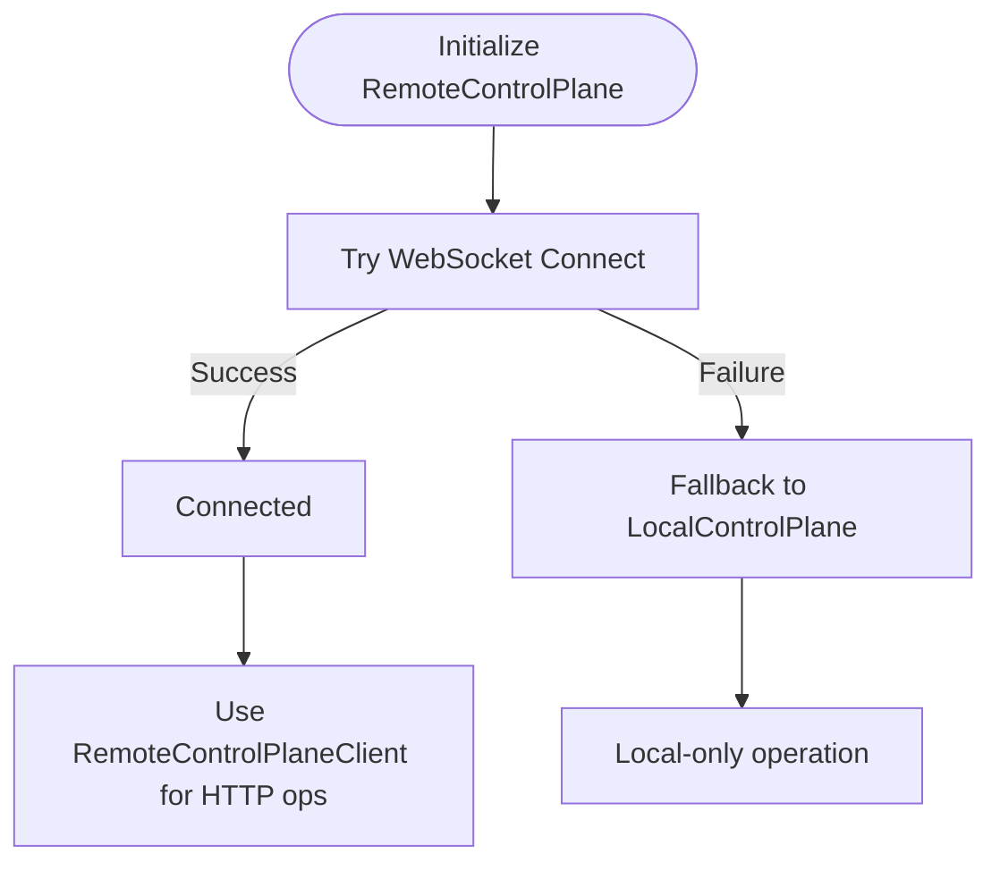
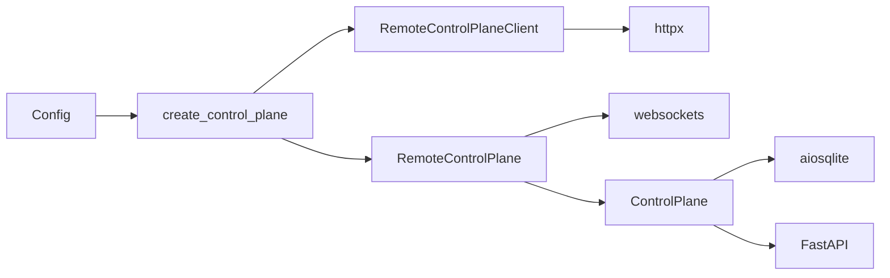

# Remote Control Server

<cite>
**Referenced Files in This Document**
- [core/control.py](file://core/control.py)
- [core/control_client.py](file://core/control_client.py)
- [servers/control_server.py](file://servers/control_server.py)
- [core/config.py](file://core/config.py)
- [core/exceptions.py](file://core/exceptions.py)
- [core/logging_config.py](file://core/logging_config.py)
- [docs/CONTROL_PLANE.md](file://docs/CONTROL_PLANE.md)
- [docs/CONTROL_PLANE_SERVER.md](file://docs/CONTROL_PLANE_SERVER.md)
- [tests/test_control_client.py](file://tests/test_control_client.py)
- [tests/test_control_server.py](file://tests/test_control_server.py)
</cite>

## Table of Contents
1. [Introduction](#introduction)
2. [Project Structure](#project-structure)
3. [Core Components](#core-components)
4. [Architecture Overview](#architecture-overview)
5. [Detailed Component Analysis](#detailed-component-analysis)
6. [Dependency Analysis](#dependency-analysis)
7. [Performance Considerations](#performance-considerations)
8. [Troubleshooting Guide](#troubleshooting-guide)
9. [Conclusion](#conclusion)
10. [Appendices](#appendices)

## Introduction
This document explains the remote control server implementation and client connectivity for LANrage. It covers:
- The RemoteControlPlane class with WebSocket-based communication to centralized control servers
- Connection establishment (URL conversion from HTTP(S) to WebSocket), authentication mechanisms, and reconnection strategies
- Message handling for party updates, peer notifications, and signaling messages
- Fallback mechanisms when remote servers are unavailable, transitioning to local mode operation
- The server-side control server implementation with party registration, peer management, and state synchronization
- Connection pooling, error handling, and network resilience features
- Security considerations for client authentication and message encryption
- Deployment guidelines for control server infrastructure and scaling considerations

## Project Structure
The remote control plane spans two primary areas:
- Client-side HTTP-based control plane client for centralized coordination
- Server-side FastAPI control plane server with SQLite persistence

**Diagram sources**
- [core/control_client.py](file://core/control_client.py#L23-L438)
- [core/control.py](file://core/control.py#L863-L880)
- [servers/control_server.py](file://servers/control_server.py#L1-L729)

**Section sources**
- [core/control_client.py](file://core/control_client.py#L1-L438)
- [core/control.py](file://core/control.py#L1-L880)
- [servers/control_server.py](file://servers/control_server.py#L1-L729)

## Core Components
- RemoteControlPlaneClient: An HTTP client using httpx for robust async communication with automatic retries, connection pooling, timeouts, and heartbeat management.
- RemoteControlPlane: A WebSocket client that connects to a centralized control server, handles authentication, message routing, and reconnection with fallback to local mode.
- ControlPlane: Base class providing party and peer management, state persistence, and cleanup tasks.
- LocalControlPlane: Local-only implementation for testing and same-LAN scenarios with file-based discovery.
- ControlPlaneError: Custom exception type for control plane errors.
- Control Server: FastAPI server exposing HTTP endpoints for party management, peer discovery, relay registration, and heartbeat.

Key configuration and logging utilities:
- Config: Centralized configuration model loaded from a settings database.
- Logging: Structured logging with context variables and performance timing decorators.

**Section sources**
- [core/control_client.py](file://core/control_client.py#L23-L438)
- [core/control.py](file://core/control.py#L187-L880)
- [core/config.py](file://core/config.py#L17-L114)
- [core/logging_config.py](file://core/logging_config.py#L1-L200)
- [core/exceptions.py](file://core/exceptions.py#L857-L860)
- [servers/control_server.py](file://servers/control_server.py#L1-L729)

## Architecture Overview
The system supports both remote and local modes. When a remote control server is configured, the client uses HTTP endpoints to register peers, create/join parties, and manage peers. The server persists state in SQLite and exposes health, party, peer, and relay endpoints. A future RemoteControlPlane (WebSocket) client is designed to connect to the server and receive real-time updates.

**Diagram sources**
- [core/control.py](file://core/control.py#L863-L880)
- [core/control_client.py](file://core/control_client.py#L161-L232)
- [servers/control_server.py](file://servers/control_server.py#L267-L288)
- [docs/CONTROL_PLANE.md](file://docs/CONTROL_PLANE.md#L337-L401)

## Detailed Component Analysis

### RemoteControlPlaneClient (HTTP-based)
- Purpose: Provides HTTP-based client for centralized control plane server using httpx for robust async communication.
- Features:
  - Automatic retries with exponential backoff
  - Connection pooling and timeouts
  - Heartbeat management
  - Token-based authentication via Authorization header
- Key methods:
  - initialize/close: Setup and teardown of httpx client
  - register_peer: Obtain auth token
  - register_party/join_party/leave_party/get_party/get_peers/discover_peer: CRUD operations for parties and peers
  - heartbeat/list_relays/get_relays_by_region: Utility operations

**Diagram sources**
- [core/control_client.py](file://core/control_client.py#L23-L438)

**Section sources**
- [core/control_client.py](file://core/control_client.py#L23-L438)
- [tests/test_control_client.py](file://tests/test_control_client.py#L1-L192)

### RemoteControlPlane (WebSocket-based)
- Purpose: WebSocket client for production-grade centralized control server with real-time updates.
- Features:
  - Converts HTTP(S) URLs to WebSocket (wss:// or ws://) and appends “/ws”
  - Connects with timeout and starts message handler
  - Authentication placeholder (hello message)
  - Message routing for party_update, peer_joined, peer_left, signal, error
  - Reconnection logic with bounded attempts and delays
  - Fallback to local mode on repeated failures
- Key methods:
  - initialize/_connect: Establish WebSocket connection
  - _authenticate/_handle_messages/_reconnect: Manage auth and reconnection
  - _send_message/_handle_*: Send and handle messages
  - register_party/join_party/leave_party/heartbeat: Bridge to HTTP client behavior

**Diagram sources**
- [core/control.py](file://core/control.py#L558-L698)
- [docs/CONTROL_PLANE.md](file://docs/CONTROL_PLANE.md#L337-L401)

**Section sources**
- [core/control.py](file://core/control.py#L541-L880)
- [docs/CONTROL_PLANE.md](file://docs/CONTROL_PLANE.md#L337-L401)

### ControlPlane and LocalControlPlane
- ControlPlane: Base class managing parties and peers, persistence, cleanup, and heartbeat.
- LocalControlPlane: Extends ControlPlane for local-only operation with file-based discovery and announcements.

**Diagram sources**
- [core/control.py](file://core/control.py#L187-L540)

**Section sources**
- [core/control.py](file://core/control.py#L187-L540)

### Control Server (FastAPI)
- Purpose: Centralized control server exposing HTTP endpoints for party management, peer discovery, relay registration, and heartbeat.
- Database: SQLite via aiosqlite with tables for parties, peers, relay_servers, and auth_tokens.
- Cleanup: Background task removes stale peers, empty parties, expired tokens, and stale relays.
- Endpoints:
  - Health: GET /
  - Authentication: POST /auth/register
  - Parties: POST /parties, POST /parties/{party_id}/join, DELETE /parties/{party_id}/peers/{peer_id}, GET /parties/{party_id}, GET /parties/{party_id}/peers, GET /parties/{party_id}/peers/{peer_id}
  - Heartbeat: POST /parties/{party_id}/peers/{peer_id}/heartbeat
  - Relays: POST /relays, GET /relays, GET /relays/{region}

**Diagram sources**
- [servers/control_server.py](file://servers/control_server.py#L37-L98)
- [servers/control_server.py](file://servers/control_server.py#L244-L729)

**Section sources**
- [servers/control_server.py](file://servers/control_server.py#L1-L729)
- [tests/test_control_server.py](file://tests/test_control_server.py#L1-L179)

### Message Handling System
- RemoteControlPlane supports WebSocket message types:
  - party_update: Party information changed
  - peer_joined: New peer joined party
  - peer_left: Peer left party
  - signal: WebRTC-style signaling
  - error: Server error message
- RemoteControlPlaneClient handles HTTP responses for party and peer operations.

**Diagram sources**
- [core/control.py](file://core/control.py#L635-L762)

**Section sources**
- [core/control.py](file://core/control.py#L635-L762)
- [docs/CONTROL_PLANE.md](file://docs/CONTROL_PLANE.md#L490-L574)

### Fallback Mechanisms
- RemoteControlPlane.initialize attempts to connect to the control server. On failure, it falls back to local mode.
- RemoteControlPlaneClient uses HTTP endpoints and heartbeats; if connection fails, it continues operating locally.

**Diagram sources**
- [core/control.py](file://core/control.py#L558-L569)
- [core/control.py](file://core/control.py#L863-L880)

**Section sources**
- [core/control.py](file://core/control.py#L558-L569)
- [core/control.py](file://core/control.py#L863-L880)

## Dependency Analysis
- ControlPlane factory selects RemoteControlPlaneClient when a remote control server is configured; otherwise, it uses LocalControlPlane.
- RemoteControlPlaneClient depends on httpx for HTTP communication and uses Config for server URL.
- RemoteControlPlane depends on websockets for WebSocket communication and converts HTTP(S) URLs to ws/wss.
- Control server depends on FastAPI, aiosqlite, and Pydantic models for request/response validation.

**Diagram sources**
- [core/config.py](file://core/config.py#L17-L114)
- [core/control.py](file://core/control.py#L863-L880)
- [core/control_client.py](file://core/control_client.py#L14-L18)
- [servers/control_server.py](file://servers/control_server.py#L20-L29)

**Section sources**
- [core/config.py](file://core/config.py#L17-L114)
- [core/control.py](file://core/control.py#L863-L880)
- [core/control_client.py](file://core/control_client.py#L14-L18)
- [servers/control_server.py](file://servers/control_server.py#L20-L29)

## Performance Considerations
- Connection pooling and timeouts:
  - RemoteControlPlaneClient uses httpx.AsyncClient with connection limits and timeouts.
  - RemoteControlPlane sets ping_interval/ping_timeout for WebSocket stability.
- Retry and backoff:
  - HTTP requests retry with exponential backoff to handle transient failures.
- Cleanup and persistence:
  - Background cleanup removes stale peers and parties to keep memory footprint low.
  - State persistence batches writes to reduce disk I/O.
- Database tuning:
  - Indexes on foreign keys and token expiration improve query performance.
  - Cleanup task runs periodically to remove stale data.

[No sources needed since this section provides general guidance]

## Troubleshooting Guide
Common issues and resolutions:
- Connection refused:
  - Verify server is running and reachable.
  - Check firewall rules and network connectivity.
- Timeout errors:
  - Increase client timeout or reduce network latency.
  - Monitor server load and resource utilization.
- Stale peers:
  - Confirm heartbeat interval and cleanup timeout are appropriate.
  - Adjust cleanup intervals if needed.
- Authentication failures:
  - Ensure Authorization header is present for protected endpoints.
  - Verify token validity and expiration.

**Section sources**
- [docs/CONTROL_PLANE_SERVER.md](file://docs/CONTROL_PLANE_SERVER.md#L395-L411)
- [servers/control_server.py](file://servers/control_server.py#L147-L177)

## Conclusion
The remote control plane provides a flexible architecture supporting both HTTP-based and WebSocket-based control planes. The HTTP client offers robust connectivity with retries and heartbeats, while the WebSocket client enables real-time updates and reconnection strategies. The server-side control plane ensures reliable party and peer management with persistence and cleanup. Together, these components enable scalable, resilient, and secure peer discovery and coordination.

[No sources needed since this section summarizes without analyzing specific files]

## Appendices

### API Definitions
- Authentication:
  - POST /auth/register: Registers a peer and returns a token with expiry.
- Party management:
  - POST /parties: Creates a new party.
  - POST /parties/{party_id}/join: Joins an existing party.
  - DELETE /parties/{party_id}/peers/{peer_id}: Leaves a party.
  - GET /parties/{party_id}: Retrieves party info.
  - GET /parties/{party_id}/peers: Lists all peers in a party.
  - GET /parties/{party_id}/peers/{peer_id}: Discovers a specific peer.
- Heartbeat:
  - POST /parties/{party_id}/peers/{peer_id}/heartbeat: Keeps peer alive.
- Relay management:
  - POST /relays: Registers a relay server.
  - GET /relays: Lists available relays.
  - GET /relays/{region}: Lists relays by region.

**Section sources**
- [servers/control_server.py](file://servers/control_server.py#L267-L682)

### Security Considerations
- HTTPS: Use a reverse proxy (nginx/Caddy) with SSL/TLS termination.
- Authentication: Implement token-based auth with bearer tokens and expiration.
- Rate limiting: Add rate limiting middleware to protect endpoints.
- CORS: Configure allowed origins appropriately.
- Firewall: Restrict access to known IPs and ports.
- Encryption: Use TLS for transport and consider encrypting sensitive payloads.

**Section sources**
- [docs/CONTROL_PLANE_SERVER.md](file://docs/CONTROL_PLANE_SERVER.md#L366-L393)

### Deployment Guidelines
- Single instance: SQLite handles moderate loads; monitor performance and adjust workers.
- Horizontal scaling: Migrate to PostgreSQL or Redis for multi-instance deployments while keeping the same API interface.
- Containerization: Use Docker with Uvicorn for production deployments.
- Orchestration: Deploy with Kubernetes, ECS, or Cloud Run with health checks and load balancing.

**Section sources**
- [docs/CONTROL_PLANE_SERVER.md](file://docs/CONTROL_PLANE_SERVER.md#L253-L343)
- [docs/CONTROL_PLANE_SERVER.md](file://docs/CONTROL_PLANE_SERVER.md#L419-L425)