# Session Management

<cite>
**Referenced Files in This Document**
- [party.py](file://core/party.py)
- [control.py](file://core/control.py)
- [connection.py](file://core/connection.py)
- [network.py](file://core/network.py)
- [config.py](file://core/config.py)
- [settings.py](file://core/settings.py)
- [control_client.py](file://core/control_client.py)
- [PARTY.md](file://docs/PARTY.md)
- [test_party.py](file://tests/test_party.py)
</cite>

## Table of Contents
1. [Introduction](#introduction)
2. [Project Structure](#project-structure)
3. [Core Components](#core-components)
4. [Architecture Overview](#architecture-overview)
5. [Detailed Component Analysis](#detailed-component-analysis)
6. [Dependency Analysis](#dependency-analysis)
7. [Performance Considerations](#performance-considerations)
8. [Troubleshooting Guide](#troubleshooting-guide)
9. [Conclusion](#conclusion)
10. [Appendices](#appendices)

## Introduction
This document describes the session management system responsible for organizing gaming parties, managing peer lifecycles, and ensuring reliable state persistence. It covers:
- Party lifecycle: creation, joining, status reporting, and termination
- Party data structures: Party and Peer models
- Registration and participant management via the control plane
- State persistence with write-behind caching and batched disk I/O
- Cleanup tasks for stale peers and empty parties
- Synchronization between local and remote control planes
- Disbandment logic, peer removal, and graceful termination
- Database-first configuration integration and session data storage/retrieval
- Workflows and state recovery procedures

## Project Structure
The session management spans several modules:
- Party orchestration and peer models
- Control plane for discovery/signaling and persistence
- Connection management for NAT traversal and WireGuard configuration
- Network layer for WireGuard interface and latency measurement
- Configuration and settings databases for database-first setup

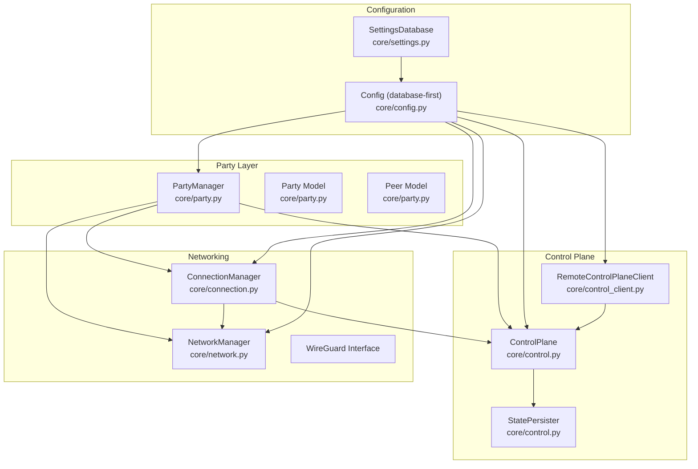

**Diagram sources**
- [party.py](file://core/party.py#L102-L304)
- [control.py](file://core/control.py#L19-L456)
- [connection.py](file://core/connection.py#L18-L493)
- [network.py](file://core/network.py#L25-L515)
- [config.py](file://core/config.py#L17-L114)
- [settings.py](file://core/settings.py#L20-L525)
- [control_client.py](file://core/control_client.py#L23-L438)

**Section sources**
- [party.py](file://core/party.py#L1-L304)
- [control.py](file://core/control.py#L1-L880)
- [connection.py](file://core/connection.py#L1-L493)
- [network.py](file://core/network.py#L1-L515)
- [config.py](file://core/config.py#L1-L114)
- [settings.py](file://core/settings.py#L1-L525)
- [control_client.py](file://core/control_client.py#L1-L438)

## Core Components
- Party and Peer models define the session state and participant metadata.
- PartyManager orchestrates NAT detection, control plane initialization, party creation/joining, and status reporting.
- ControlPlane maintains in-memory party registry, persists state via StatePersister, and runs cleanup tasks.
- ConnectionManager coordinates NAT traversal, establishes WireGuard peers, monitors connectivity, and handles reconnection.
- NetworkManager manages WireGuard interface lifecycle, key generation, latency measurement, and peer addition/removal.
- Config loads application settings from the settings database (database-first approach).
- SettingsDatabase provides async SQLite-backed storage for configuration and preferences.
- RemoteControlPlaneClient provides HTTP-based client for centralized control plane operations.

**Section sources**
- [party.py](file://core/party.py#L44-L100)
- [party.py](file://core/party.py#L102-L304)
- [control.py](file://core/control.py#L19-L456)
- [connection.py](file://core/connection.py#L18-L493)
- [network.py](file://core/network.py#L25-L515)
- [config.py](file://core/config.py#L17-L114)
- [settings.py](file://core/settings.py#L20-L525)
- [control_client.py](file://core/control_client.py#L23-L438)

## Architecture Overview
The session lifecycle integrates local orchestration with a control plane (local or remote). Parties are registered and synchronized across control planes, with state persisted to disk using a write-behind cache. Connections are established via NAT traversal and maintained with periodic monitoring and automatic reconnection.

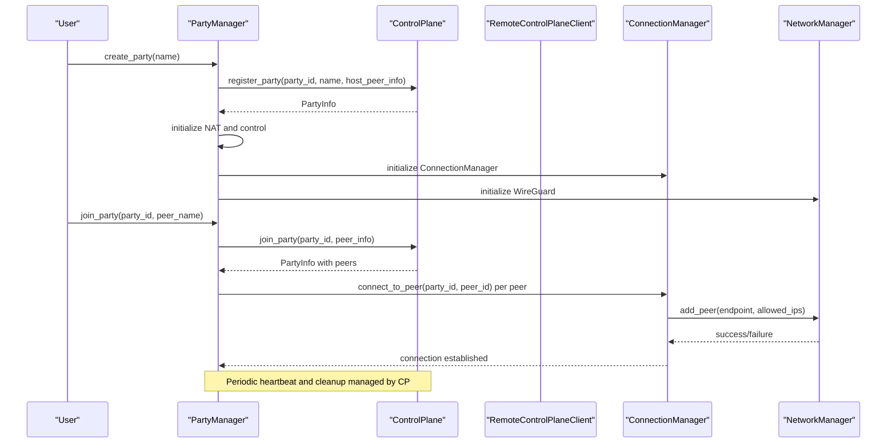

**Diagram sources**
- [party.py](file://core/party.py#L159-L247)
- [control.py](file://core/control.py#L228-L310)
- [connection.py](file://core/connection.py#L38-L125)
- [network.py](file://core/network.py#L392-L444)
- [PARTY.md](file://docs/PARTY.md#L274-L433)

## Detailed Component Analysis

### Party Data Structures
- Party: Identifies a gaming session with id, name, host_id, peers collection, and creation timestamp. Provides helpers to enumerate peers and filter compatible peers by NAT type.
- Peer: Represents a participant with identity, cryptographic key, virtual IP, endpoint, latency, connection type, NAT type, and join timestamp.

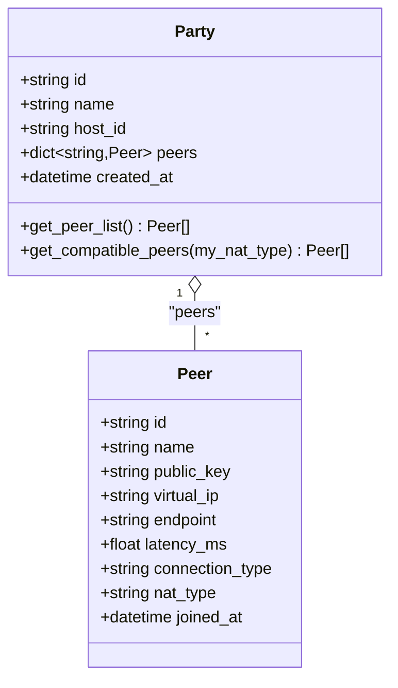

**Diagram sources**
- [party.py](file://core/party.py#L44-L100)

**Section sources**
- [party.py](file://core/party.py#L44-L100)

### Party Lifecycle and Registration
- Creation: PartyManager generates a party id, initializes host peer metadata, registers with the control plane, and sets up NAT and connection managers.
- Joining: PartyManager constructs peer info, joins via control plane, converts returned PartyInfo to local Party, and initiates connections to existing peers.
- Status: PartyManager measures latency for each peer and reports NAT info alongside party state.
- Leaving: PartyManager disconnects from peers and leaves the party via control plane.

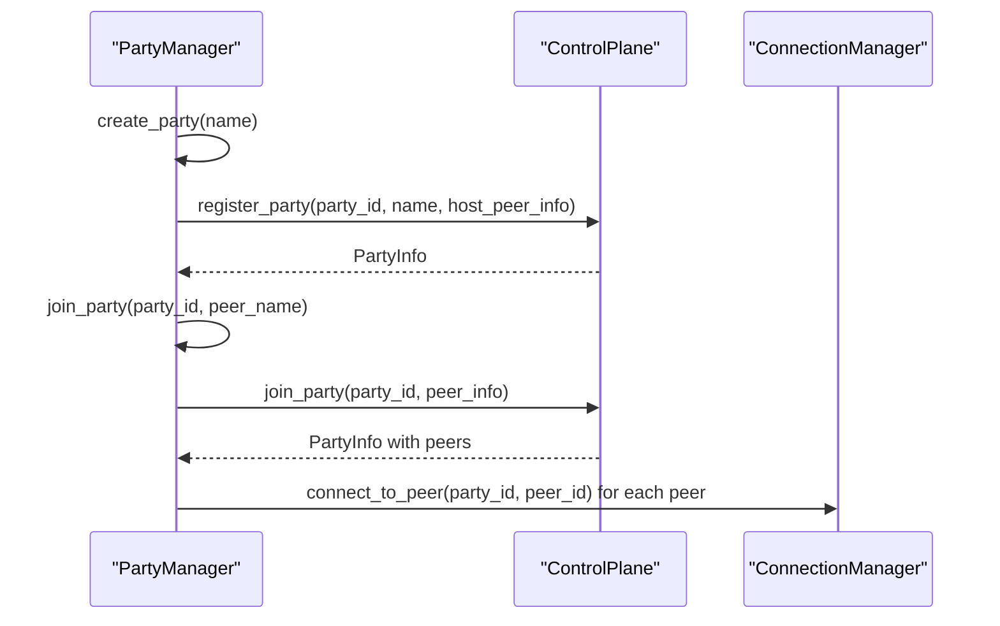

**Diagram sources**
- [party.py](file://core/party.py#L159-L247)
- [PARTY.md](file://docs/PARTY.md#L274-L433)

**Section sources**
- [party.py](file://core/party.py#L159-L304)
- [PARTY.md](file://docs/PARTY.md#L274-L433)

### State Persistence with StatePersister
- Purpose: Reduce disk I/O by batching state writes with a write-behind cache and flushing after a short delay.
- Behavior: Queues state updates, deduplicates rapid successive writes, and performs atomic writes to disk. Flushes on demand during shutdown.

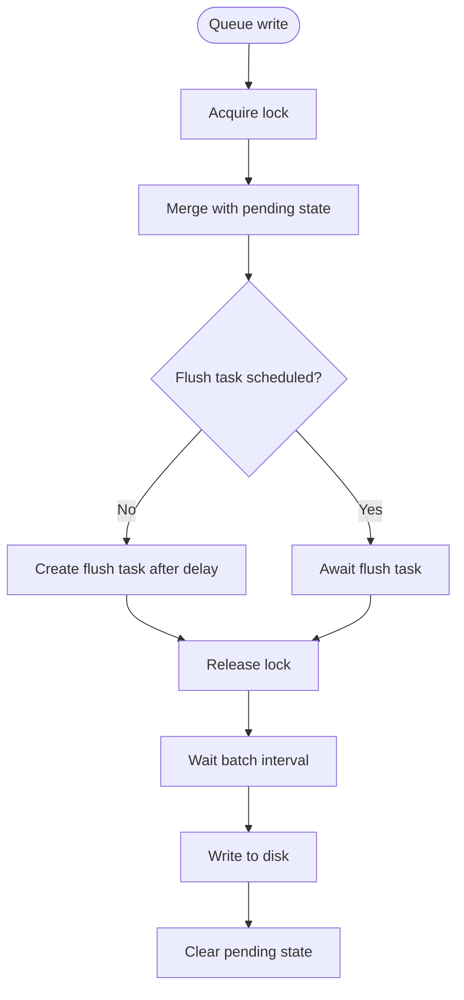

**Diagram sources**
- [control.py](file://core/control.py#L19-L113)

**Section sources**
- [control.py](file://core/control.py#L19-L113)
- [control.py](file://core/control.py#L411-L424)

### Cleanup Task for Stale Peers and Empty Parties
- Runs periodically to remove peers whose last_seen exceeds a timeout and to delete parties with no remaining peers.
- Persists state after cleanup.

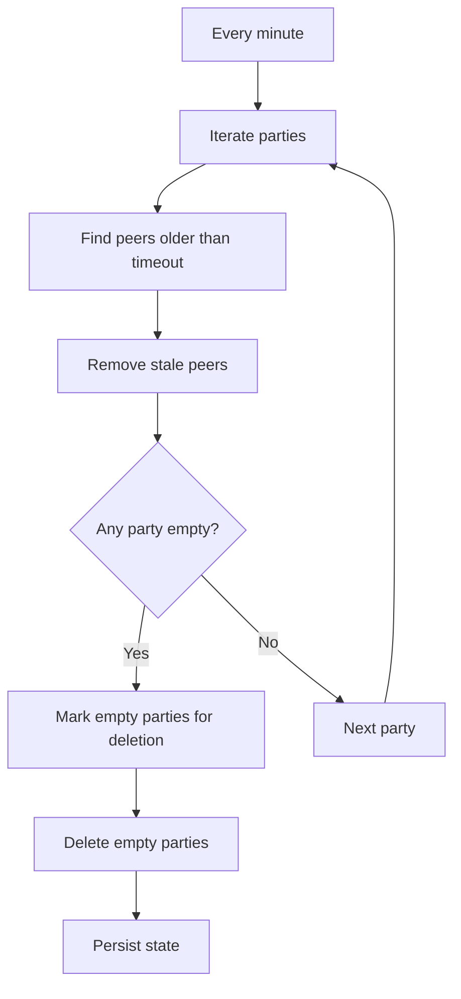

**Diagram sources**
- [control.py](file://core/control.py#L378-L410)

**Section sources**
- [control.py](file://core/control.py#L378-L410)

### Session State Synchronization Between Local and Remote Control Planes
- LocalControlPlane: Registers parties and announces them in a shared discovery file for local peers.
- RemoteControlPlaneClient: HTTP client for centralized control plane with automatic retries, heartbeats, and endpoint operations.
- RemoteControlPlane: WebSocket client for centralized control plane with message handling, reconnection, and server-side synchronization.

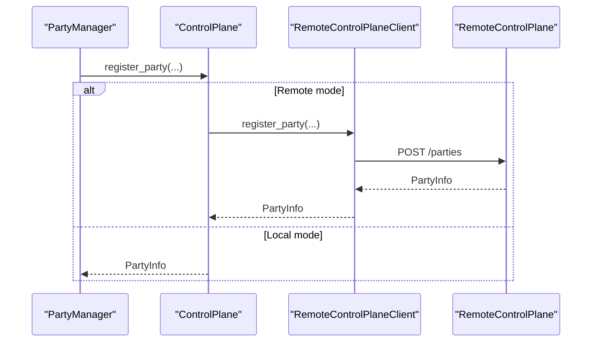

**Diagram sources**
- [control.py](file://core/control.py#L458-L539)
- [control_client.py](file://core/control_client.py#L23-L438)
- [control.py](file://core/control.py#L541-L880)

**Section sources**
- [control.py](file://core/control.py#L458-L880)
- [control_client.py](file://core/control_client.py#L23-L438)

### Party Disbandment, Peer Removal, and Graceful Termination
- Disbandment: When the host leaves or the last peer leaves, the party is removed from the registry.
- Peer removal: Removing a peer updates the registry and clears local state; on host departure, the party is deleted.
- Graceful termination: PartyManager disconnects from peers and leaves the party via control plane.

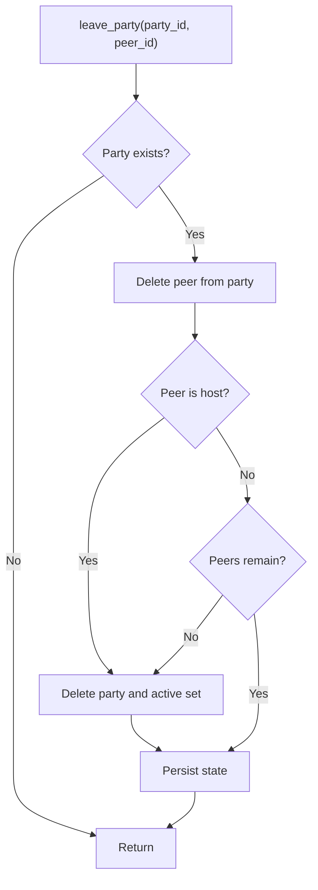

**Diagram sources**
- [control.py](file://core/control.py#L269-L294)

**Section sources**
- [control.py](file://core/control.py#L269-L294)
- [party.py](file://core/party.py#L249-L261)

### Database-First Configuration Integration
- Config.load retrieves all settings from the settings database and constructs the runtime configuration.
- SettingsDatabase provides async SQLite operations, type-aware serialization/deserialization, and concurrency protection.
- Initialization ensures required tables exist and supports default settings population.

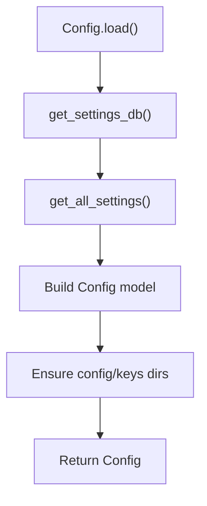

**Diagram sources**
- [config.py](file://core/config.py#L49-L114)
- [settings.py](file://core/settings.py#L36-L96)
- [settings.py](file://core/settings.py#L466-L474)

**Section sources**
- [config.py](file://core/config.py#L49-L114)
- [settings.py](file://core/settings.py#L20-L525)

### Connection Management and NAT Traversal
- ConnectionManager discovers peers via control plane, determines connection strategy based on NAT types, configures WireGuard peers, and monitors connectivity.
- NetworkManager manages WireGuard interface creation, key generation, latency measurement, and peer addition/removal.
- PeerConnection tracks connection state transitions and cleanup timers.

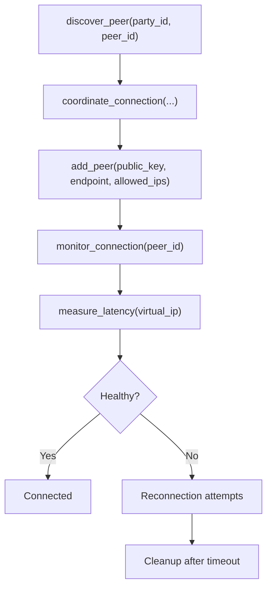

**Diagram sources**
- [connection.py](file://core/connection.py#L38-L125)
- [connection.py](file://core/connection.py#L213-L333)
- [network.py](file://core/network.py#L340-L444)

**Section sources**
- [connection.py](file://core/connection.py#L18-L493)
- [network.py](file://core/network.py#L25-L515)

### Examples of Session Management Workflows

- Creating a party:
  - Initialize NAT and control plane
  - Create Party with host peer
  - Register with control plane
  - Persist state via StatePersister

- Joining a party:
  - Obtain PartyInfo from control plane
  - Convert to local Party
  - Connect to existing peers
  - Measure latency and report status

- Leaving a party:
  - Disconnect from peers
  - Leave via control plane
  - Clear current party reference

- Remote control plane operations:
  - Register peer and get token
  - Register/join party via HTTP endpoints
  - Heartbeat to keep session alive
  - Leave party and stop heartbeat

**Section sources**
- [party.py](file://core/party.py#L159-L304)
- [control.py](file://core/control.py#L228-L310)
- [control_client.py](file://core/control_client.py#L161-L296)
- [PARTY.md](file://docs/PARTY.md#L274-L433)

### State Recovery Procedures
- Control plane startup loads persisted state from disk and restores in-memory registry and ownership pointers.
- StatePersister flushes pending writes on shutdown to prevent data loss.
- Cleanup task removes stale entries and persists changes.

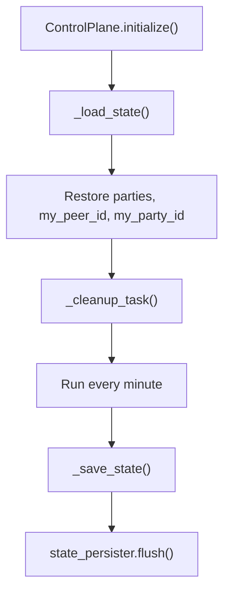

**Diagram sources**
- [control.py](file://core/control.py#L209-L227)
- [control.py](file://core/control.py#L426-L456)
- [control.py](file://core/control.py#L219-L226)

**Section sources**
- [control.py](file://core/control.py#L209-L227)
- [control.py](file://core/control.py#L426-L456)
- [control.py](file://core/control.py#L219-L226)

## Dependency Analysis
- PartyManager depends on Config, NetworkManager, ControlPlane, and ConnectionManager.
- ControlPlane depends on StatePersister and persists to a JSON file under the config directory.
- ConnectionManager depends on ControlPlane, NAT traversal, and NetworkManager.
- NetworkManager depends on Config and manages WireGuard operations.
- Config depends on SettingsDatabase for database-first configuration.

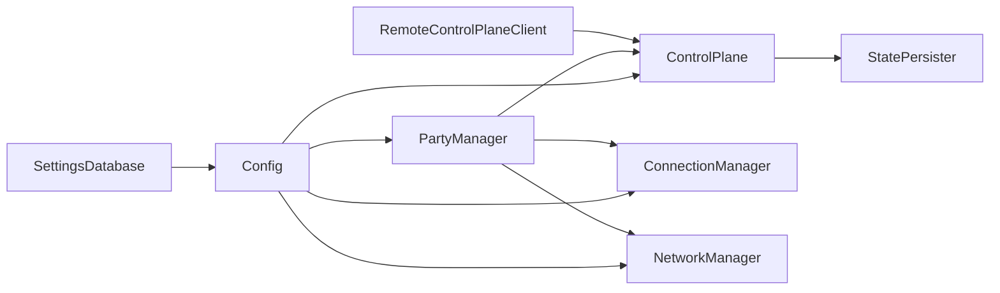

**Diagram sources**
- [party.py](file://core/party.py#L102-L120)
- [control.py](file://core/control.py#L19-L208)
- [connection.py](file://core/connection.py#L18-L36)
- [network.py](file://core/network.py#L25-L41)
- [config.py](file://core/config.py#L49-L114)
- [settings.py](file://core/settings.py#L466-L474)
- [control_client.py](file://core/control_client.py#L23-L43)

**Section sources**
- [party.py](file://core/party.py#L102-L120)
- [control.py](file://core/control.py#L19-L208)
- [connection.py](file://core/connection.py#L18-L36)
- [network.py](file://core/network.py#L25-L41)
- [config.py](file://core/config.py#L49-L114)
- [settings.py](file://core/settings.py#L466-L474)
- [control_client.py](file://core/control_client.py#L23-L43)

## Performance Considerations
- Write-behind caching reduces disk I/O by batching state writes with a short delay.
- Batched persistence deduplicates rapid successive writes.
- Connection monitoring and reconnection use exponential backoff and periodic checks to minimize resource usage.
- NAT compatibility filtering helps peers select optimal connection strategies to reduce latency and improve throughput.

[No sources needed since this section provides general guidance]

## Troubleshooting Guide
- NAT detection failures: The system continues with relay-only mode if NAT detection fails.
- Disk write failures: StatePersister logs errors and continues; ensure sufficient disk space and permissions.
- Corrupted state file: On load failure, the system starts fresh and logs warnings.
- Remote control plane connectivity: The remote client falls back to local mode on connection failure and reconnects with limited attempts.
- Heartbeat failures: Heartbeat errors are logged and do not interrupt operation; the loop continues.

**Section sources**
- [party.py](file://core/party.py#L134-L143)
- [control.py](file://core/control.py#L86-L100)
- [control.py](file://core/control.py#L442-L456)
- [control_client.py](file://core/control_client.py#L571-L622)

## Conclusion
The session management system provides a robust framework for organizing gaming parties, coordinating peer discovery and connections, and maintaining reliable state across local and remote control planes. Its database-first configuration, write-behind caching, and cleanup mechanisms ensure efficient operation and resilience against transient failures.

[No sources needed since this section summarizes without analyzing specific files]

## Appendices

### NAT Compatibility Matrix
- Open NAT can connect to Open, Full Cone, Restricted Cone, Port-Restricted Cone, and Symmetric.
- Full Cone can connect to Open, Full Cone, Restricted Cone, and Port-Restricted Cone.
- Restricted Cone can connect to Open, Full Cone, and Restricted Cone.
- Port-Restricted Cone can connect to Open and Full Cone.
- Symmetric can connect to Open only.
- Unknown NAT requires relay.

**Section sources**
- [party.py](file://core/party.py#L19-L41)

### Tests and Validation
- NAT compatibility filtering is validated in unit tests.
- Party creation includes NAT type propagation for the host peer.

**Section sources**
- [test_party.py](file://tests/test_party.py#L43-L149)
- [test_party.py](file://tests/test_party.py#L160-L196)