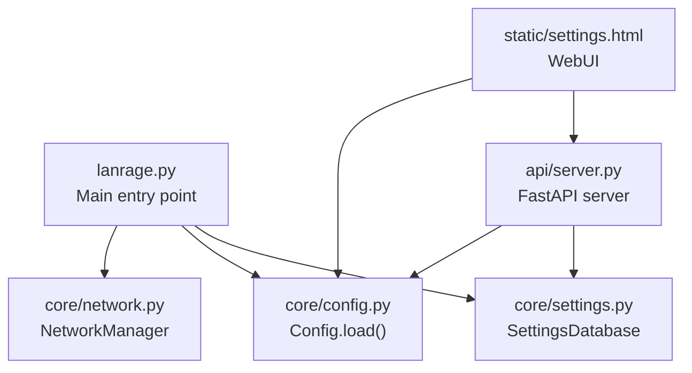
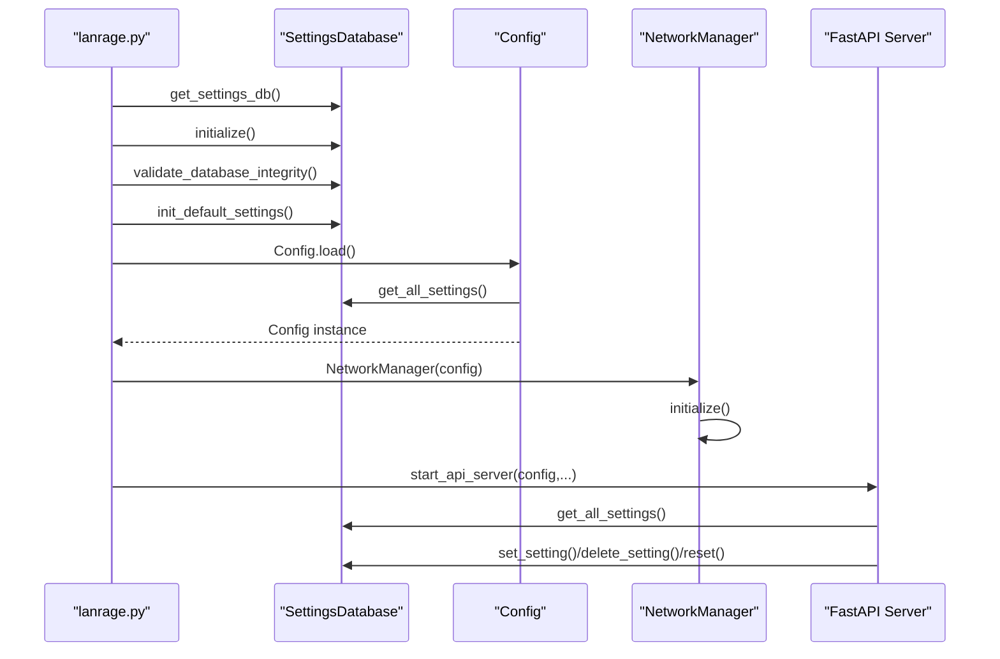
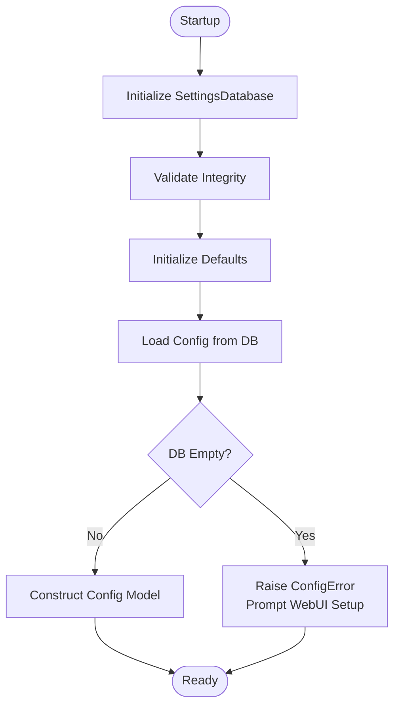
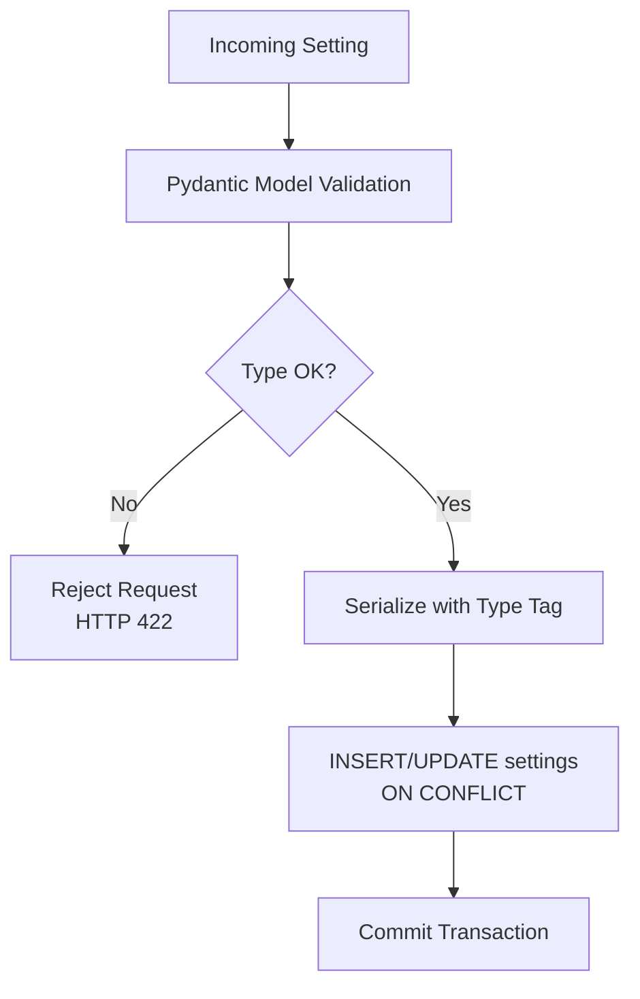
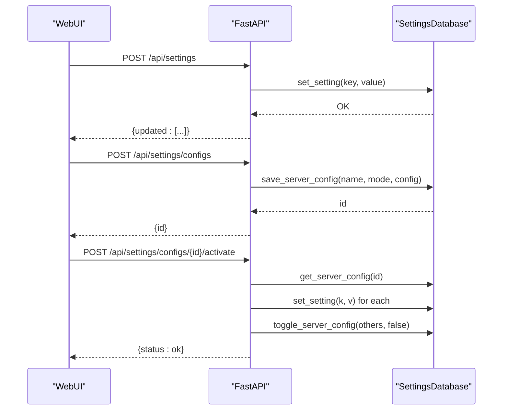
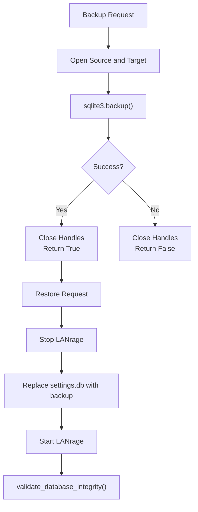
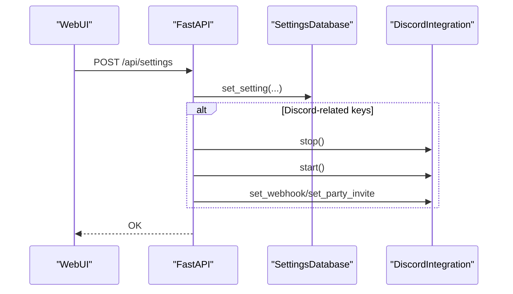
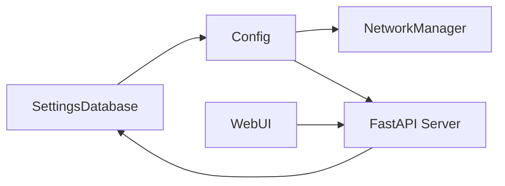

# Configuration Lifecycle & Migration

<cite>
**Referenced Files in This Document**
- [lanrage.py](file://lanrage.py)
- [config.py](file://core/config.py)
- [settings.py](file://core/settings.py)
- [server.py](file://api/server.py)
- [network.py](file://core/network.py)
- [logging_config.py](file://core/logging_config.py)
- [exceptions.py](file://core/exceptions.py)
- [settings.html](file://static/settings.html)
- [index.html](file://static/index.html)
- [SECURITY.md](file://SECURITY.md)
</cite>

## Table of Contents
1. [Introduction](#introduction)
2. [Project Structure](#project-structure)
3. [Core Components](#core-components)
4. [Architecture Overview](#architecture-overview)
5. [Detailed Component Analysis](#detailed-component-analysis)
6. [Dependency Analysis](#dependency-analysis)
7. [Performance Considerations](#performance-considerations)
8. [Troubleshooting Guide](#troubleshooting-guide)
9. [Conclusion](#conclusion)
10. [Appendices](#appendices)

## Introduction
This document explains LANrage’s configuration lifecycle management with a focus on configuration loading, initialization, updates, and migration. It covers the database-first configuration model, fallback mechanisms, error recovery, validation pipeline, backup and restore procedures, and security measures. It also documents the WebUI-driven configuration workflow and how runtime changes propagate through the system.

## Project Structure
LANrage centralizes configuration in a SQLite database accessed via an async SettingsDatabase. The main entry point initializes the database, validates integrity, and loads configuration into a strongly-typed Config model. The WebUI exposes endpoints to update settings and manage saved configurations.

**Diagram sources**
- [lanrage.py](file://lanrage.py#L53-L93)
- [settings.py](file://core/settings.py#L36-L96)
- [config.py](file://core/config.py#L49-L114)
- [server.py](file://api/server.py#L680-L701)
- [settings.html](file://static/settings.html#L1-L200)

**Section sources**
- [lanrage.py](file://lanrage.py#L53-L93)
- [settings.py](file://core/settings.py#L36-L96)
- [config.py](file://core/config.py#L49-L114)
- [server.py](file://api/server.py#L680-L701)
- [settings.html](file://static/settings.html#L1-L200)

## Core Components
- SettingsDatabase: Async SQLite-backed storage for all settings, server configurations, favorites, and game profiles. Provides initialization, integrity checks, backup, and CRUD operations.
- Config: Pydantic-based configuration model loaded from the settings database. Enforces types and provides defaults.
- API Server: Exposes endpoints to read/update settings, reset to defaults, and manage saved configurations.
- WebUI: HTML/JavaScript pages that call API endpoints to persist configuration changes.
- NetworkManager: Consumes configuration to initialize WireGuard interfaces and peers.

**Section sources**
- [settings.py](file://core/settings.py#L20-L96)
- [config.py](file://core/config.py#L17-L114)
- [server.py](file://api/server.py#L575-L678)
- [settings.html](file://static/settings.html#L613-L653)
- [network.py](file://core/network.py#L25-L71)

## Architecture Overview
The configuration lifecycle follows a strict database-first approach. On startup, the application initializes the settings database, validates integrity, and loads configuration. Subsequent updates are persisted to the database and reflected in running components.

**Diagram sources**
- [lanrage.py](file://lanrage.py#L53-L93)
- [settings.py](file://core/settings.py#L36-L96)
- [config.py](file://core/config.py#L49-L114)
- [server.py](file://api/server.py#L575-L678)

## Detailed Component Analysis

### Configuration Loading Sequence
- Database initialization: Ensures schema exists and creates tables for settings, server configurations, favorites, and game profiles.
- Integrity validation: Uses synchronous SQLite PRAGMA integrity_check to verify database health.
- Default initialization: Populates missing default settings atomically.
- Config load: Reads all settings from the database and constructs a typed Config instance, ensuring required directories exist.

**Diagram sources**
- [settings.py](file://core/settings.py#L36-L96)
- [settings.py](file://core/settings.py#L509-L525)
- [config.py](file://core/config.py#L49-L114)

**Section sources**
- [settings.py](file://core/settings.py#L36-L96)
- [settings.py](file://core/settings.py#L509-L525)
- [config.py](file://core/config.py#L49-L114)

### Configuration Validation Pipeline
- Schema validation: Pydantic model enforces field types and defaults.
- Runtime validation: API endpoints validate request payloads (e.g., player counts vs. max).
- Database-level validation: Serialized values include type metadata for safe deserialization.
- Integrity checks: PRAGMA integrity_check and file size monitoring.

**Diagram sources**
- [server.py](file://api/server.py#L74-L97)
- [settings.py](file://core/settings.py#L112-L131)
- [settings.py](file://core/settings.py#L435-L459)

**Section sources**
- [server.py](file://api/server.py#L74-L97)
- [settings.py](file://core/settings.py#L112-L131)
- [settings.py](file://core/settings.py#L435-L459)

### Configuration Updates and Migration
- Update settings: API endpoint applies selective updates to the settings database.
- Saved configurations: Users can save named configurations with mode and settings payload; activation toggles others off and applies the selected set.
- Reset to defaults: Deletes all settings and reinitializes defaults.

**Diagram sources**
- [server.py](file://api/server.py#L582-L678)
- [settings.html](file://static/settings.html#L600-L653)
- [index.html](file://static/index.html#L1877-L1991)

**Section sources**
- [server.py](file://api/server.py#L582-L678)
- [settings.html](file://static/settings.html#L600-L653)
- [index.html](file://static/index.html#L1877-L1991)

### Backup and Restore Procedures
- Backup: Uses sqlite3 backup API to create a consistent copy of the settings database.
- Restore: Replace the current database file with the backup copy and restart the application.
- Integrity verification: After restore, run integrity checks and size verification.

**Diagram sources**
- [settings.py](file://core/settings.py#L408-L431)
- [settings.py](file://core/settings.py#L396-L407)

**Section sources**
- [settings.py](file://core/settings.py#L408-L431)
- [settings.py](file://core/settings.py#L396-L407)

### Hot-Reload and Runtime Modification
- Current behavior: Settings updates are persisted to the database. Some components (e.g., Discord integration) react to specific setting changes by restarting integration services. However, there is no dynamic reconfiguration of the WireGuard interface or other long-lived services without restart.
- Impact: Changing mode, API host/port, or Discord settings triggers immediate updates where applicable. Network topology changes require restart to apply safely.

**Diagram sources**
- [server.py](file://api/server.py#L582-L612)

**Section sources**
- [server.py](file://api/server.py#L582-L612)

### Security Measures
- Transport encryption: WireGuard provides end-to-end encryption and perfect forward secrecy.
- Local-first storage: All configuration data resides in a local SQLite database under the user’s home directory.
- Input validation: Pydantic models and API validators enforce constraints.
- SQL injection protection: Parameterized queries via aiosqlite.
- Access control: API is served locally; CORS allows local UI access.
- Audit logging: Structured logging with context variables and timing decorators.

**Section sources**
- [SECURITY.md](file://SECURITY.md#L12-L34)
- [server.py](file://api/server.py#L23-L29)
- [logging_config.py](file://core/logging_config.py#L118-L154)

## Dependency Analysis
Configuration dependencies flow from the database to the configuration model and then to runtime components.

**Diagram sources**
- [settings.py](file://core/settings.py#L466-L473)
- [config.py](file://core/config.py#L49-L114)
- [network.py](file://core/network.py#L25-L71)
- [server.py](file://api/server.py#L680-L701)

**Section sources**
- [settings.py](file://core/settings.py#L466-L473)
- [config.py](file://core/config.py#L49-L114)
- [network.py](file://core/network.py#L25-L71)
- [server.py](file://api/server.py#L680-L701)

## Performance Considerations
- Asynchronous I/O: SettingsDatabase uses aiosqlite for non-blocking database operations.
- Serialization overhead: Values are serialized with type tags; JSON serialization is used for complex types.
- Timing instrumentation: Decorators log operation durations for performance monitoring.
- Concurrency safety: An asyncio.Lock guards schema initialization and critical sections.

**Section sources**
- [settings.py](file://core/settings.py#L31-L35)
- [settings.py](file://core/settings.py#L435-L459)
- [logging_config.py](file://core/logging_config.py#L169-L230)

## Troubleshooting Guide
Common issues and resolutions:
- Database not initialized: The configuration loader raises a configuration error when the settings database is empty. Use the WebUI to configure settings or run the initialization routine.
- Database integrity failure: Perform a backup, replace the database file with a known-good backup, and re-run integrity checks.
- Permission errors: Ensure the user has write permissions to the configuration directory and that the database file is not locked by another process.
- WireGuard initialization failures: Verify installation, privileges, and absence of conflicting interfaces.

Operational commands and checks:
- Integrity check: Use the built-in integrity validator to confirm database validity.
- Size inspection: Retrieve database size to monitor growth and detect anomalies.
- Backup creation: Use the backup API to create a consistent snapshot.

**Section sources**
- [config.py](file://core/config.py#L68-L74)
- [settings.py](file://core/settings.py#L373-L407)
- [settings.py](file://core/settings.py#L408-L431)
- [exceptions.py](file://core/exceptions.py#L46-L49)

## Conclusion
LANrage’s configuration lifecycle is robust and database-centric. The system provides strong validation, integrity checks, and a WebUI-driven workflow for updates and saved configurations. While runtime updates are applied immediately where feasible, core networking components require restart to reflect significant changes. Security is layered through encryption, local-first storage, and strict input validation.

## Appendices

### Example Scenarios
- First-time setup: Initialize defaults, open the WebUI, configure settings, then restart the application.
- Switching modes: Update the mode setting; the system persists it immediately, but network topology changes require restart.
- Saved configuration rollout: Save a configuration, activate it, and restart to apply all settings consistently.

**Section sources**
- [lanrage.py](file://lanrage.py#L75-L93)
- [server.py](file://api/server.py#L640-L678)
- [settings.html](file://static/settings.html#L600-L653)

### Migration Notes
- Version detection: There is no explicit version field in the settings database; migrations are not implemented in the current codebase.
- Rollback: Use backups to revert to a previous state if an update causes issues.

**Section sources**
- [settings.py](file://core/settings.py#L408-L431)

### Security and Access Controls
- Encryption: WireGuard encryption protects all traffic.
- Access controls: API is local-only; CORS is configured for local UI access.
- Auditing: Structured logs capture context and performance metrics.

**Section sources**
- [SECURITY.md](file://SECURITY.md#L12-L34)
- [server.py](file://api/server.py#L23-L29)
- [logging_config.py](file://core/logging_config.py#L118-L154)