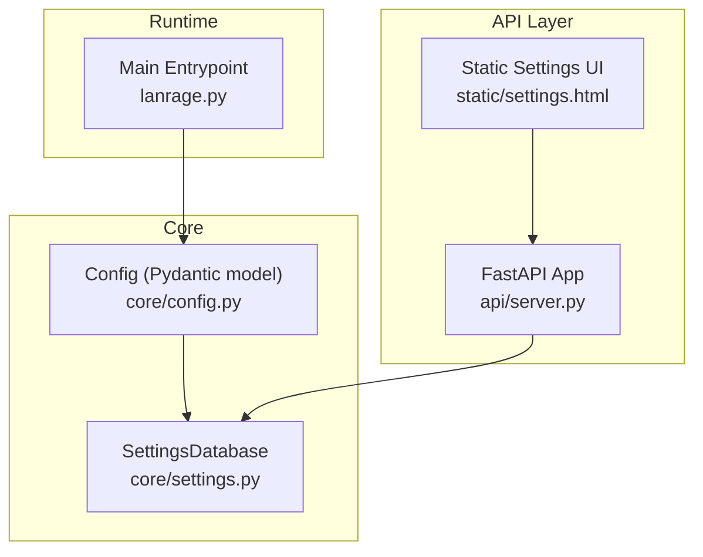
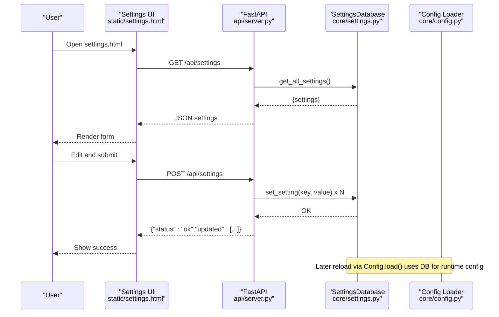
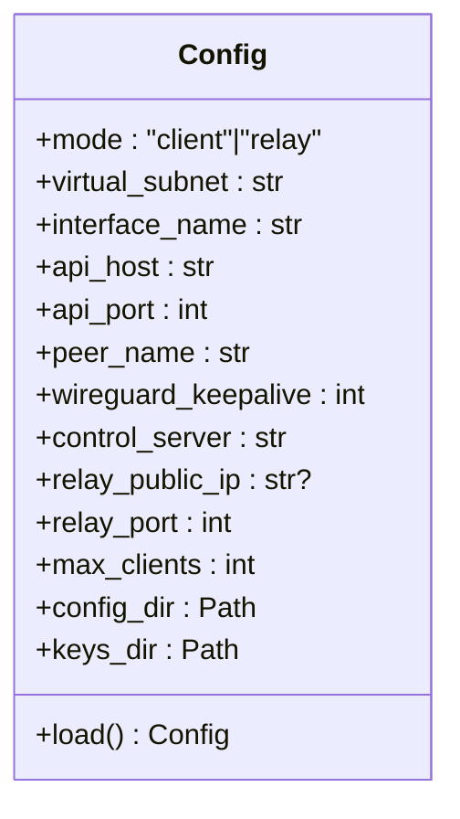
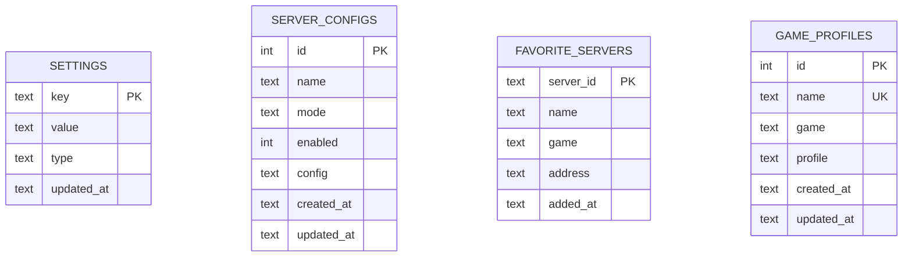
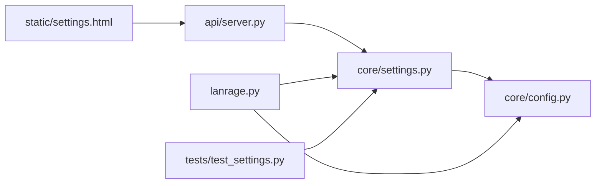

# Configuration System

<cite>
**Referenced Files in This Document**
- [core/config.py](file://core/config.py)
- [core/settings.py](file://core/settings.py)
- [api/server.py](file://api/server.py)
- [lanrage.py](file://lanrage.py)
- [static/settings.html](file://static/settings.html)
- [.env.example](file://.env.example)
- [setup.py](file://setup.py)
- [tests/test_settings.py](file://tests/test_settings.py)
- [docs/SETTINGS.md](file://docs/SETTINGS.md)
</cite>

## Table of Contents
1. [Introduction](#introduction)
2. [Project Structure](#project-structure)
3. [Core Components](#core-components)
4. [Architecture Overview](#architecture-overview)
5. [Detailed Component Analysis](#detailed-component-analysis)
6. [Dependency Analysis](#dependency-analysis)
7. [Performance Considerations](#performance-considerations)
8. [Troubleshooting Guide](#troubleshooting-guide)
9. [Conclusion](#conclusion)
10. [Appendices](#appendices)

## Introduction
This document describes LANrage’s database-first configuration system. The entire configuration surface is stored in a SQLite database and exposed through a Web UI and a programmatic API. There are no environment variables or traditional configuration files; all settings are managed through the Web UI at http://localhost:8666/settings.html and persisted to the database. The system emphasizes type safety, validation, concurrency safety, and operational reliability with built-in backup and integrity checks.

## Project Structure
The configuration system spans three primary areas:
- Core model and loader: Defines strongly-typed configuration and loads it from the database.
- Persistent storage: SQLite-backed settings database with async operations and serialization helpers.
- API and UI: FastAPI endpoints and a static HTML UI for managing settings and saved configurations.

**Diagram sources**
- [core/config.py](file://core/config.py#L17-L114)
- [core/settings.py](file://core/settings.py#L20-L473)
- [api/server.py](file://api/server.py#L16-L701)
- [static/settings.html](file://static/settings.html#L1-L684)
- [lanrage.py](file://lanrage.py#L40-L230)

**Section sources**
- [core/config.py](file://core/config.py#L1-L114)
- [core/settings.py](file://core/settings.py#L1-L525)
- [api/server.py](file://api/server.py#L1-L701)
- [static/settings.html](file://static/settings.html#L1-L684)
- [lanrage.py](file://lanrage.py#L1-L230)

## Core Components
- Config (Pydantic model): Strongly typed configuration with defaults. It loads all values from the settings database and ensures required directories exist.
- SettingsDatabase: Async SQLite layer that persists settings, server configurations, favorites, and game profiles. Provides serialization/deserialization and concurrency safeguards.
- API endpoints: Expose GET/POST/DELETE operations for settings, saved configurations, and reset-to-defaults. They also handle dynamic reconfiguration of integrations like Discord.
- Web UI: A static HTML page that fetches current settings, allows editing, saving, resetting, and managing saved configurations.

Key behaviors:
- Type safety: Pydantic enforces types at runtime.
- Validation: FastAPI request models validate incoming requests; database operations serialize/deserialize values safely.
- Concurrency: Async I/O with per-instance locks; SQLite’s own locking plus explicit asyncio.Lock reduces race conditions.
- Persistence: All settings are stored in a single SQLite file under the user’s home directory.

**Section sources**
- [core/config.py](file://core/config.py#L17-L114)
- [core/settings.py](file://core/settings.py#L20-L473)
- [api/server.py](file://api/server.py#L575-L679)
- [static/settings.html](file://static/settings.html#L483-L681)

## Architecture Overview
The configuration lifecycle:
- Initialization: On startup, the system initializes the settings database and sets defaults if missing.
- Loading: Config.load() reads all settings from the database and constructs the typed Config object.
- Runtime updates: API endpoints update individual settings or reset to defaults; saved configurations apply a group of settings atomically.
- Persistence: All writes go through SettingsDatabase with type-aware serialization and concurrency control.
- Integrity: Built-in integrity checks and backups support operational safety.

**Diagram sources**
- [static/settings.html](file://static/settings.html#L483-L563)
- [api/server.py](file://api/server.py#L575-L611)
- [core/settings.py](file://core/settings.py#L97-L142)
- [core/config.py](file://core/config.py#L49-L114)

## Detailed Component Analysis

### Config Class and Runtime Configuration
The Config class is a Pydantic model that defines the canonical configuration schema. It loads values from the settings database and ensures required directories exist.

- Loading behavior: Config.load() obtains all settings from the database, raises a configuration error if the database is uninitialized, and logs success.
- Defaults: Values are taken from the database; if missing, defaults are applied in the loader.
- Paths: Ensures config and keys directories exist.

Operational notes:
- Hot reload: To reflect runtime changes, restart the service so Config.load() picks up the updated database state.
- Environment variables: Not supported; the loader explicitly removes environment-based loading.

**Diagram sources**
- [core/config.py](file://core/config.py#L17-L114)

**Section sources**
- [core/config.py](file://core/config.py#L17-L114)

### SettingsDatabase: Schema, Types, and Operations
SettingsDatabase encapsulates:
- Schema: settings, server_configs, favorite_servers, game_profiles tables.
- Serialization: Values are serialized with type tags (“bool”, “int”, “float”, “str”, “json”) to preserve types across reads/writes.
- Async operations: All DB operations are async with per-instance locks to reduce races.
- Maintenance: Integrity checks, size reporting, and backup via SQLite’s backup API.

- Type safety: _serialize/_deserialize ensure correct round-trip conversion.
- Concurrency: asyncio.Lock and aiosqlite provide safe concurrent access.
- Integrity: validate_database_integrity() and backup_database() support diagnostics and disaster recovery.

**Diagram sources**
- [core/settings.py](file://core/settings.py#L42-L93)
- [core/settings.py](file://core/settings.py#L435-L459)

**Section sources**
- [core/settings.py](file://core/settings.py#L20-L473)
- [core/settings.py](file://core/settings.py#L408-L459)

### API Endpoints for Programmatic Access
The API exposes:
- GET /api/settings: Retrieve all settings as a JSON object.
- POST /api/settings: Update provided settings; supports partial updates.
- POST /api/settings/reset: Delete all settings and reinitialize defaults.
- GET /api/settings/configs: List saved server configurations.
- POST /api/settings/configs: Save a new configuration snapshot.
- POST /api/settings/configs/{id}/activate: Apply a saved configuration and enable it.
- DELETE /api/settings/configs/{id}: Delete a saved configuration.

Behavior highlights:
- Validation: FastAPI request models enforce field constraints.
- Dynamic integration updates: When Discord-related settings change, the API restarts Discord integration accordingly.
- Atomicity: Saved configurations apply all settings in one operation and toggle enablement.

**Section sources**
- [api/server.py](file://api/server.py#L575-L679)

### Web UI for Configuration Management
The static settings UI:
- Loads current settings via GET /api/settings.
- Allows editing of all configurable fields and toggling of boolean flags.
- Supports saving settings, resetting to defaults, and managing saved configurations.
- Uses JavaScript to call the API endpoints and displays status messages.

Operational notes:
- Requires LANrage to be running with the API server.
- Changes take effect after restarting the service to reload from the database.

**Section sources**
- [static/settings.html](file://static/settings.html#L483-L681)

### Environment Variable Handling and Backward Compatibility
- Environment variables are no longer read. Legacy .env files are deprecated and ignored.
- The setup script initializes the database and instructs users to configure via the Web UI.
- Backward compatibility: Existing installations can migrate by starting LANrage; defaults are initialized and the database becomes the single source of truth.

**Section sources**
- [.env.example](file://.env.example#L1-L36)
- [setup.py](file://setup.py#L24-L83)
- [lanrage.py](file://lanrage.py#L53-L93)

### Database Initialization and Defaults
- Initialization: On first run or via setup.py, the system creates the settings database and seeds default values for all known settings.
- Defaults: init_default_settings() inserts only missing keys, preserving user overrides.
- Integrity: validate_database_integrity() and get_database_size() provide diagnostics.

**Section sources**
- [core/settings.py](file://core/settings.py#L476-L525)
- [setup.py](file://setup.py#L24-L44)
- [lanrage.py](file://lanrage.py#L53-L74)

### Security, Sensitive Data, and Backup/Restore
- Sensitive data handling: The database stores plain text values with type tags. For secrets (e.g., tokens), treat the SQLite file as sensitive and protect file system access.
- Integrity and backups: backup_database() uses SQLite’s backup API to create consistent snapshots suitable for off-host storage.
- Disaster recovery: validate_database_integrity() helps detect corruption early.

**Section sources**
- [core/settings.py](file://core/settings.py#L408-L431)
- [docs/SETTINGS.md](file://docs/SETTINGS.md#L423-L437)

## Dependency Analysis
The configuration system exhibits clean separation of concerns:
- Config depends on SettingsDatabase for loading.
- API depends on SettingsDatabase for persistence and on Config for runtime behavior.
- UI depends on API endpoints.
- Tests validate SettingsDatabase behavior and concurrency.

**Diagram sources**
- [api/server.py](file://api/server.py#L16-L701)
- [core/settings.py](file://core/settings.py#L20-L473)
- [core/config.py](file://core/config.py#L17-L114)
- [lanrage.py](file://lanrage.py#L40-L230)
- [tests/test_settings.py](file://tests/test_settings.py#L1-L338)

**Section sources**
- [api/server.py](file://api/server.py#L16-L701)
- [core/settings.py](file://core/settings.py#L20-L473)
- [core/config.py](file://core/config.py#L17-L114)
- [lanrage.py](file://lanrage.py#L40-L230)
- [tests/test_settings.py](file://tests/test_settings.py#L1-L338)

## Performance Considerations
- Async I/O: All database operations are async, minimizing blocking and enabling concurrent access.
- Locking: Per-instance asyncio.Lock reduces contention; SQLite’s own locking further protects data integrity.
- Serialization overhead: Type-tagged serialization adds minimal CPU cost compared to the benefits of type safety.
- Recommendations:
  - Batch updates via the API when applying multiple settings.
  - Use saved configurations to apply groups of settings atomically.
  - Monitor database size via get_database_size() to anticipate growth.

[No sources needed since this section provides general guidance]

## Troubleshooting Guide
Common issues and resolutions:
- Empty database on first run:
  - Symptom: ConfigError indicating the settings database is empty.
  - Resolution: Start LANrage; defaults are initialized automatically. Alternatively, run setup.py to initialize the database.
- Database integrity failures:
  - Use validate_database_integrity() to confirm health; if failing, restore from a known-good backup.
- Permission errors:
  - Ensure write access to ~/.lanrage/settings.db and parent directories.
- Settings not taking effect:
  - Changes are written to the database; restart LANrage to reload configuration via Config.load().
- Web UI not responding:
  - Confirm the API server is running and reachable at the configured host/port.

**Section sources**
- [core/config.py](file://core/config.py#L68-L114)
- [core/settings.py](file://core/settings.py#L373-L407)
- [lanrage.py](file://lanrage.py#L53-L93)

## Conclusion
LANrage’s database-first configuration system centralizes all settings in a robust, typed, and maintainable schema. It replaces legacy environment variables and configuration files with a modern Web UI and API, ensuring type safety, concurrency control, and operational resilience through integrity checks and backups. Runtime updates require a restart to reload configuration, while saved configurations enable atomic, repeatable deployments.

[No sources needed since this section summarizes without analyzing specific files]

## Appendices

### API Definitions: Settings Endpoints
- GET /api/settings
  - Description: Retrieve all settings as a JSON object.
  - Response: Object with key-value pairs.
- POST /api/settings
  - Description: Update provided settings; accepts partial updates.
  - Request: SettingsRequest (subset of settings).
  - Response: Status and list of updated keys.
- POST /api/settings/reset
  - Description: Reset all settings to defaults.
  - Response: Status message.
- GET /api/settings/configs
  - Description: List saved configurations.
  - Response: Array of server configs.
- POST /api/settings/configs
  - Description: Save a new configuration snapshot.
  - Request: SaveConfigRequest (name, mode, config).
  - Response: Status and new config id.
- POST /api/settings/configs/{id}/activate
  - Description: Apply a saved configuration and enable it.
  - Response: Status message.
- DELETE /api/settings/configs/{id}
  - Description: Delete a saved configuration.
  - Response: Status message.

**Section sources**
- [api/server.py](file://api/server.py#L575-L679)

### Database Schema Evolution and Consistency
- Schema evolution: Add new keys via init_default_settings() to seed defaults without breaking existing installations.
- Consistency guarantees: ON CONFLICT handling in INSERT statements ensures updates are atomic; type tags preserve data integrity across reads/writes.
- Backward compatibility: The loader tolerates missing keys by falling back to defaults; tests validate persistence and type correctness.

**Section sources**
- [core/settings.py](file://core/settings.py#L476-L525)
- [tests/test_settings.py](file://tests/test_settings.py#L97-L132)