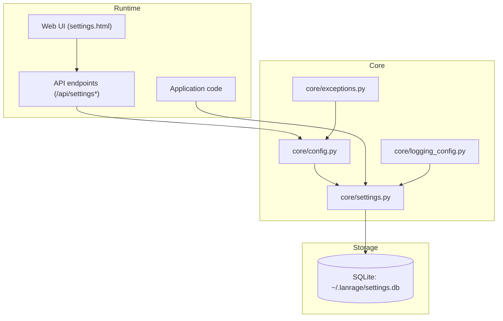
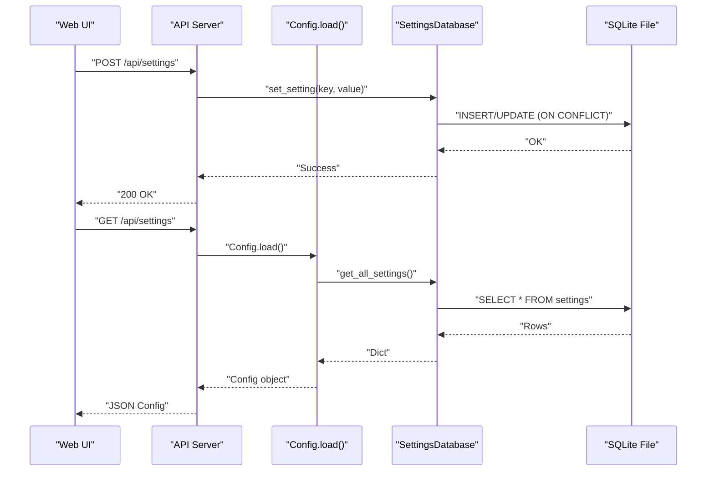
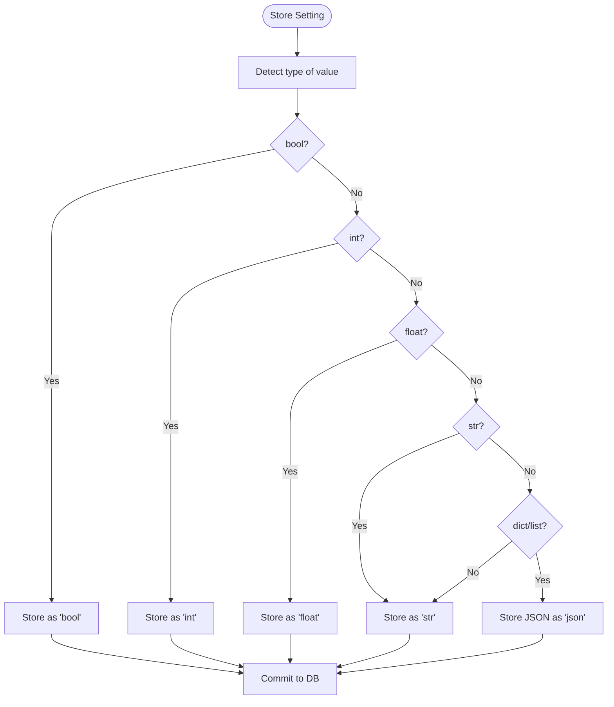
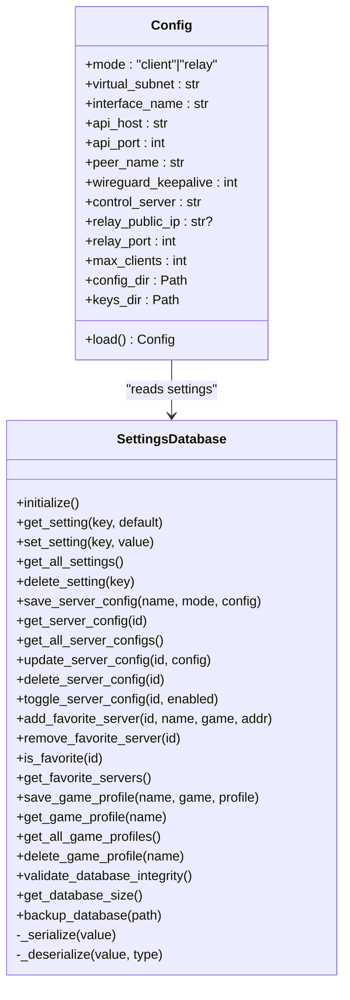
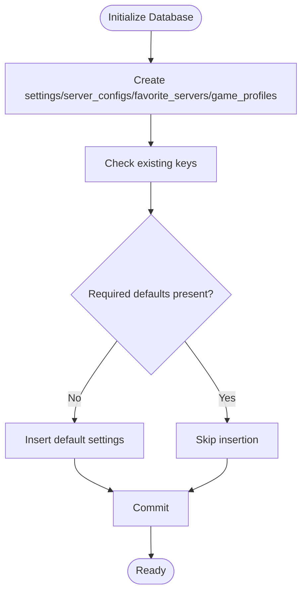
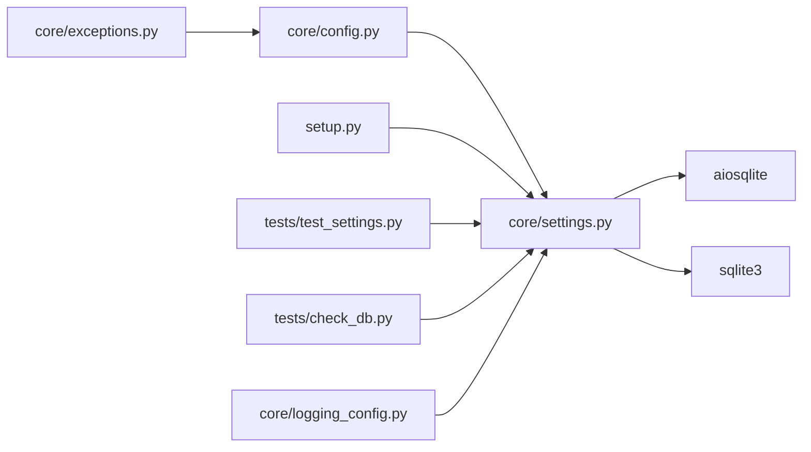

# Database Schema & Storage

<cite>
**Referenced Files in This Document**
- [core/settings.py](file://core/settings.py)
- [core/config.py](file://core/config.py)
- [setup.py](file://setup.py)
- [tests/test_settings.py](file://tests/test_settings.py)
- [tests/check_db.py](file://tests/check_db.py)
- [docs/SETTINGS.md](file://docs/SETTINGS.md)
- [docs/ARCHITECTURE.md](file://docs/ARCHITECTURE.md)
- [core/logging_config.py](file://core/logging_config.py)
- [core/exceptions.py](file://core/exceptions.py)
</cite>

## Table of Contents
1. [Introduction](#introduction)
2. [Project Structure](#project-structure)
3. [Core Components](#core-components)
4. [Architecture Overview](#architecture-overview)
5. [Detailed Component Analysis](#detailed-component-analysis)
6. [Dependency Analysis](#dependency-analysis)
7. [Performance Considerations](#performance-considerations)
8. [Troubleshooting Guide](#troubleshooting-guide)
9. [Conclusion](#conclusion)
10. [Appendices](#appendices)

## Introduction
This document describes LANrage’s database-first configuration approach and the settings database architecture. It covers schema design, field definitions, data types, CRUD operations, transactions, serialization/deserialization, initialization, validation, and maintenance. It also documents how configuration models map to database tables, error handling, and operational guidance for reliability and performance.

## Project Structure
The settings database resides in the core module and is consumed by configuration loading and the Web UI. The setup script initializes defaults, and tests validate behavior and concurrency.

**Diagram sources**
- [core/settings.py](file://core/settings.py#L20-L96)
- [core/config.py](file://core/config.py#L50-L114)
- [setup.py](file://setup.py#L24-L44)

**Section sources**
- [core/settings.py](file://core/settings.py#L1-L525)
- [core/config.py](file://core/config.py#L1-L114)
- [setup.py](file://setup.py#L1-L100)
- [docs/SETTINGS.md](file://docs/SETTINGS.md#L1-L668)

## Core Components
- SettingsDatabase: Async SQLite-backed storage for application settings, server configurations, favorites, and game profiles. Provides initialization, CRUD, and maintenance helpers.
- Config: Pydantic model that loads runtime configuration from the settings database.
- Setup: Initializes default settings and validates integrity.
- Tests: Validate correctness, concurrency, persistence, and edge cases.

**Section sources**
- [core/settings.py](file://core/settings.py#L20-L96)
- [core/config.py](file://core/config.py#L17-L114)
- [setup.py](file://setup.py#L24-L44)
- [tests/test_settings.py](file://tests/test_settings.py#L1-L338)

## Architecture Overview
The settings database is the single source of truth for configuration. The Config loader reads all settings from the database and constructs a strongly-typed configuration object. The Web UI writes settings to the database, which the app consumes at runtime.

**Diagram sources**
- [core/config.py](file://core/config.py#L50-L114)
- [core/settings.py](file://core/settings.py#L97-L150)
- [docs/SETTINGS.md](file://docs/SETTINGS.md#L531-L576)

## Detailed Component Analysis

### SettingsDatabase: Schema, Types, and Constraints
- settings table
  - key: TEXT PRIMARY KEY
  - value: TEXT NOT NULL
  - type: TEXT NOT NULL (“bool”, “int”, “float”, “str”, “json”)
  - updated_at: TEXT NOT NULL (ISO format timestamp)
- server_configs table
  - id: INTEGER PRIMARY KEY AUTOINCREMENT
  - name: TEXT NOT NULL
  - mode: TEXT NOT NULL
  - enabled: INTEGER DEFAULT 1
  - config: TEXT NOT NULL (JSON)
  - created_at: TEXT NOT NULL
  - updated_at: TEXT NOT NULL
- favorite_servers table
  - server_id: TEXT PRIMARY KEY
  - name: TEXT NOT NULL
  - game: TEXT NOT NULL
  - address: TEXT NOT NULL
  - added_at: TEXT NOT NULL
- game_profiles table
  - id: INTEGER PRIMARY KEY AUTOINCREMENT
  - name: TEXT NOT NULL UNIQUE
  - game: TEXT NOT NULL
  - profile: TEXT NOT NULL (JSON)
  - created_at: TEXT NOT NULL
  - updated_at: TEXT NOT NULL

Data types and constraints:
- All textual identifiers are stored as TEXT.
- Numeric fields are stored as TEXT with explicit type metadata for deserialization.
- JSON blobs are stored as TEXT with type “json”.
- Timestamps are stored as TEXT in ISO format.
- Primary keys and uniqueness enforced at schema level.

**Section sources**
- [core/settings.py](file://core/settings.py#L42-L93)
- [docs/SETTINGS.md](file://docs/SETTINGS.md#L49-L88)

### Serialization and Deserialization
- _serialize(value): Converts Python values to (string, type) tuples for storage.
  - bool/int/float/string mapped to native string representation with type tag.
  - dict/list serialized to JSON string with type “json”.
- _deserialize(value, type): Recovers original Python type from stored representation.

**Diagram sources**
- [core/settings.py](file://core/settings.py#L435-L459)

**Section sources**
- [core/settings.py](file://core/settings.py#L435-L459)
- [docs/SETTINGS.md](file://docs/SETTINGS.md#L441-L466)

### CRUD Operations and Transactions
- Settings CRUD
  - get_setting(key, default): SELECT by primary key; deserialize and return default if absent.
  - set_setting(key, value): INSERT ... ON CONFLICT (key) DO UPDATE to upsert; commit.
  - get_all_settings(): SELECT all rows; deserialize each.
  - delete_setting(key): DELETE by primary key; commit.
- Server configurations CRUD
  - save/update/delete/toggle with JSON config serialization/deserialization.
- Favorites CRUD
  - add/remove/is_favorite/get_all with conflict resolution on primary key.
- Game profiles CRUD
  - save/update/delete with unique constraint on name; JSON profile storage.

Transactions and concurrency:
- Each operation opens its own connection and commits immediately.
- A shared asyncio.Lock protects initialization and critical sections to prevent races.

**Section sources**
- [core/settings.py](file://core/settings.py#L97-L370)
- [tests/test_settings.py](file://tests/test_settings.py#L31-L338)

### Configuration Model Mapping
- Config (Pydantic) fields are populated from settings dictionary returned by get_all_settings().
- Fields include mode, network, API, user, WireGuard, relay, and path fields.
- Validation occurs implicitly via Pydantic field definitions; defaults are applied from settings.

**Diagram sources**
- [core/settings.py](file://core/settings.py#L20-L96)
- [core/config.py](file://core/config.py#L17-L114)

**Section sources**
- [core/config.py](file://core/config.py#L49-L114)
- [docs/SETTINGS.md](file://docs/SETTINGS.md#L507-L517)

### Database Initialization and Defaults
- Initialization creates tables if missing.
- Default settings are inserted only if keys are absent.
- Integrity check and backup helpers are provided for maintenance.

**Diagram sources**
- [core/settings.py](file://core/settings.py#L36-L96)
- [core/settings.py](file://core/settings.py#L476-L507)
- [setup.py](file://setup.py#L24-L44)

**Section sources**
- [core/settings.py](file://core/settings.py#L36-L96)
- [core/settings.py](file://core/settings.py#L476-L507)
- [setup.py](file://setup.py#L24-L44)

### Schema Evolution and Backward Compatibility
- Current schema supports:
  - settings: key-value with typed storage.
  - server_configs: named configurations with JSON payload.
  - favorite_servers: bookmarked servers.
  - game_profiles: named, unique profiles with JSON payload.
- No explicit migrations are implemented in the current codebase.
- Backward compatibility is maintained by:
  - Adding new keys without removing old ones.
  - Using default values when keys are missing.
  - Keeping type metadata for safe deserialization.

Recommended future-proofing (not implemented):
- Version table to track schema versions.
- Migration functions to transform older schemas.
- Validation of required fields and types during load.

**Section sources**
- [core/settings.py](file://core/settings.py#L42-L93)
- [core/config.py](file://core/config.py#L68-L91)

### Data Integrity and Maintenance
- validate_database_integrity(): Uses PRAGMA integrity_check via sqlite3 for synchronous validation.
- get_database_size(): Returns file size in bytes.
- backup_database(): Uses sqlite3.backup to create a copy.

Operational guidance:
- Use validate_database_integrity() at startup.
- Periodically backup the database file.
- On corruption, restore from a recent backup and re-run initialization if needed.

**Section sources**
- [core/settings.py](file://core/settings.py#L373-L432)
- [docs/SETTINGS.md](file://docs/SETTINGS.md#L395-L437)

### Error Handling and Diagnostics
- Config.load() raises ConfigError when the database is uninitialized or fails to load.
- Exceptions module defines LANrageError and specialized subclasses; ConfigError is used for configuration failures.
- Logging includes timing decorators for performance insights.

**Section sources**
- [core/config.py](file://core/config.py#L68-L114)
- [core/exceptions.py](file://core/exceptions.py#L46-L49)
- [core/logging_config.py](file://core/logging_config.py#L169-L231)

## Dependency Analysis
- SettingsDatabase depends on aiosqlite for async operations and sqlite3 for synchronous maintenance tasks.
- Config.load() depends on SettingsDatabase to populate a Pydantic model.
- Setup initializes defaults and validates integrity.
- Tests validate behavior, concurrency, and persistence.

**Diagram sources**
- [core/settings.py](file://core/settings.py#L6-L15)
- [core/config.py](file://core/config.py#L61-L66)
- [setup.py](file://setup.py#L28-L32)
- [tests/test_settings.py](file://tests/test_settings.py#L10-L21)
- [tests/check_db.py](file://tests/check_db.py#L3-L7)

**Section sources**
- [core/settings.py](file://core/settings.py#L6-L15)
- [core/config.py](file://core/config.py#L61-L66)
- [setup.py](file://setup.py#L28-L32)
- [tests/test_settings.py](file://tests/test_settings.py#L10-L21)
- [tests/check_db.py](file://tests/check_db.py#L3-L7)

## Performance Considerations
- Async I/O: Uses aiosqlite for non-blocking database operations.
- Concurrency: Shared asyncio.Lock around critical sections; SQLite’s own locking plus the lock reduce race conditions.
- Indexing: No explicit indexes are defined for settings tables in the current schema.
- Query patterns:
  - Settings: key-based lookups (primary key).
  - Server configs: by id or ordered listing.
  - Favorites: by primary key or listing.
  - Profiles: by unique name or listing.
- Recommendations:
  - Consider adding indexes on frequently filtered columns (e.g., server_configs.mode, favorite_servers.game).
  - Batch writes for bulk updates.
  - Use LIMIT/OFFSET for paginated listings.

[No sources needed since this section provides general guidance]

## Troubleshooting Guide
Common issues and resolutions:
- Database locked: Ensure operations are guarded by the internal lock and avoid long synchronous operations.
- Database corrupted: Run validate_database_integrity(); restore from backup; re-run initialization.
- Settings not persisting: Confirm database file exists and is writable; verify disk space; check logs for errors.
- Empty configuration: Config.load() requires at least some settings; run setup or use Web UI to initialize.

**Section sources**
- [docs/SETTINGS.md](file://docs/SETTINGS.md#L606-L634)
- [core/config.py](file://core/config.py#L68-L74)
- [core/settings.py](file://core/settings.py#L373-L395)

## Conclusion
LANrage’s settings database is a compact, database-first solution using SQLite with async operations. It provides robust persistence for configuration, server profiles, favorites, and game profiles, with strong typing via serialized metadata. The design emphasizes simplicity, concurrency safety, and maintainability, while leaving room for future schema evolution and optional indexes.

[No sources needed since this section summarizes without analyzing specific files]

## Appendices

### Appendix A: Example Queries and Modifications
- Retrieve all settings: SELECT key, value, type FROM settings.
- Upsert a setting: INSERT INTO settings (key, value, type, updated_at) VALUES (?, ?, ?, ?) ON CONFLICT(key) DO UPDATE SET value=excluded.value, type=excluded.type, updated_at=excluded.updated_at.
- List server configurations: SELECT id, name, mode, config, enabled FROM server_configs ORDER BY name.
- Backup database: sqlite3.backup(source, backup) via synchronous API.

**Section sources**
- [core/settings.py](file://core/settings.py#L102-L130)
- [core/settings.py](file://core/settings.py#L194-L209)
- [core/settings.py](file://core/settings.py#L418-L428)

### Appendix B: Deployment Scenarios
- Fresh install: run setup.py to initialize defaults and validate integrity.
- Headless environments: initialize via setup.py; access Web UI at http://localhost:8666/settings.html.
- Multi-instance isolation: use separate database paths per environment.
- Disaster recovery: backup_database() to a safe location; restore by copying the backup over the main database file.

**Section sources**
- [setup.py](file://setup.py#L76-L83)
- [docs/SETTINGS.md](file://docs/SETTINGS.md#L520-L530)
- [core/settings.py](file://core/settings.py#L408-L432)