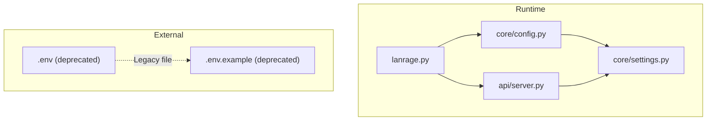
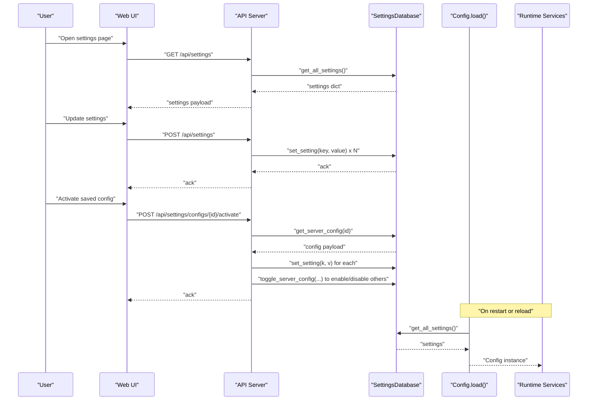
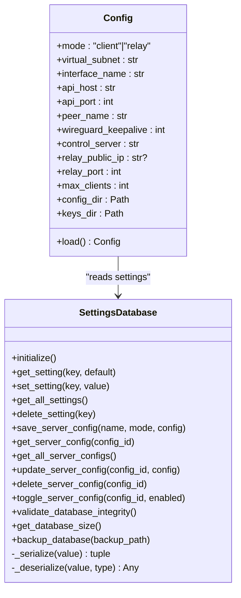
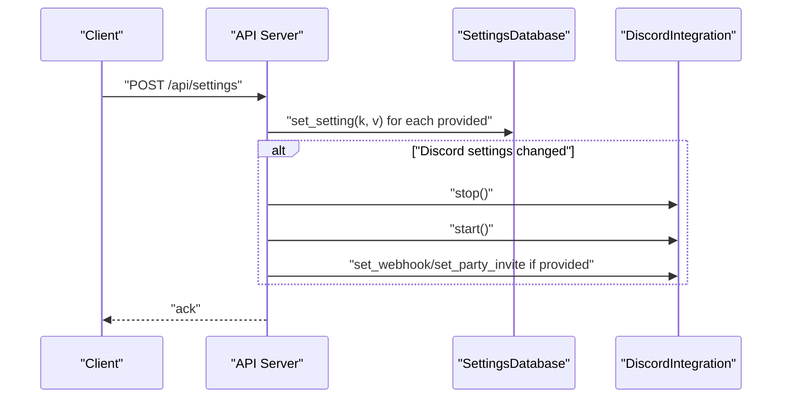
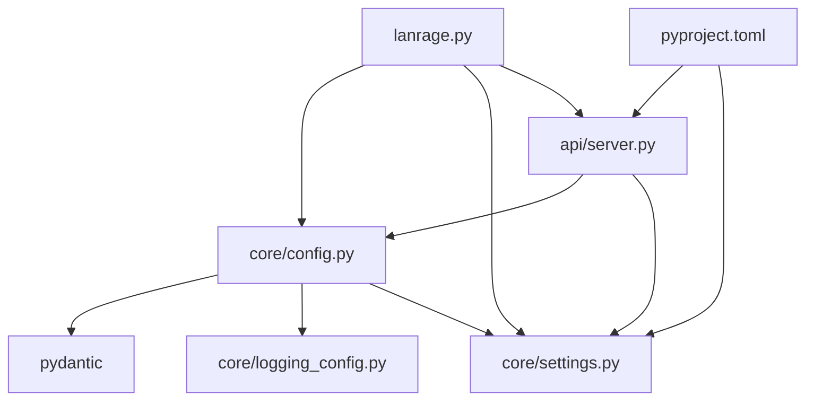
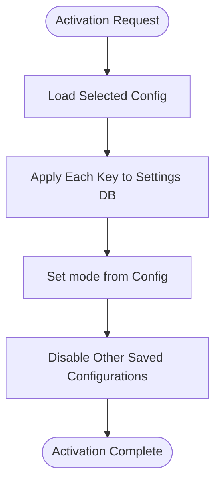

# Environment Integration & Overrides

<cite>
**Referenced Files in This Document**
- [lanrage.py](file://lanrage.py)
- [core/config.py](file://core/config.py)
- [core/settings.py](file://core/settings.py)
- [api/server.py](file://api/server.py)
- [.env](file://.env)
- [.env.example](file://.env.example)
- [pyproject.toml](file://pyproject.toml)
- [SECURITY.md](file://SECURITY.md)
- [IMPROVEMENTS.md](file://IMPROVEMENTS.md)
- [README.md](file://README.md)
</cite>

## Table of Contents
1. [Introduction](#introduction)
2. [Project Structure](#project-structure)
3. [Core Components](#core-components)
4. [Architecture Overview](#architecture-overview)
5. [Detailed Component Analysis](#detailed-component-analysis)
6. [Dependency Analysis](#dependency-analysis)
7. [Performance Considerations](#performance-considerations)
8. [Troubleshooting Guide](#troubleshooting-guide)
9. [Conclusion](#conclusion)
10. [Appendices](#appendices)

## Introduction
This document explains LANrage’s environment integration and configuration override system with a focus on external configuration sources and dynamic environment handling. The project migrated from environment variables to a database-first configuration model, using a SQLite settings database as the single source of truth. This change eliminates environment variable precedence in favor of explicit, auditable, and web-managed settings.

Key goals:
- Document the database-first configuration lifecycle and how settings are persisted and consumed.
- Clarify the absence of environment variable overrides and the rationale behind removing .env support.
- Explain integration with the Web UI and REST API for runtime parameter injection and configuration activation.
- Provide guidance on implementing custom environment integration points and extending the override system safely.
- Address security considerations for sensitive data handling and exposure prevention.

## Project Structure
LANrage’s configuration pipeline centers around:
- A SQLite settings database managed asynchronously.
- A Pydantic-based Config model that loads settings from the database.
- A FastAPI server exposing endpoints to manage settings and apply saved configurations.
- A CLI entrypoint that initializes the database, validates integrity, and starts the service.

**Diagram sources**
- [lanrage.py](file://lanrage.py#L40-L93)
- [core/config.py](file://core/config.py#L49-L114)
- [core/settings.py](file://core/settings.py#L466-L525)
- [api/server.py](file://api/server.py#L575-L678)
- [.env](file://.env#L1-L12)
- [.env.example](file://.env.example#L1-L36)

**Section sources**
- [lanrage.py](file://lanrage.py#L40-L93)
- [core/config.py](file://core/config.py#L17-L114)
- [core/settings.py](file://core/settings.py#L20-L142)
- [api/server.py](file://api/server.py#L575-L678)
- [.env](file://.env#L1-L12)
- [.env.example](file://.env.example#L1-L36)

## Core Components
- Database-first configuration loader: Loads all settings from the SQLite settings database and constructs the Config model.
- Settings persistence: Provides async CRUD operations for settings, including serialization/deserialization and integrity checks.
- Web UI and REST API: Expose endpoints to update settings, reset to defaults, and activate saved configurations.
- CLI entrypoint: Initializes the database, validates integrity, and starts the API server using the loaded configuration.

Key behaviors:
- Environment variables are no longer read for configuration. Legacy .env files are deprecated.
- Settings are applied immediately upon update; some integrations (e.g., Discord) reconnect automatically when related settings change.
- Saved configurations can be activated to apply a named preset and toggle others off.

**Section sources**
- [core/config.py](file://core/config.py#L49-L114)
- [core/settings.py](file://core/settings.py#L97-L142)
- [api/server.py](file://api/server.py#L575-L678)
- [lanrage.py](file://lanrage.py#L53-L93)
- [.env.example](file://.env.example#L1-L36)

## Architecture Overview
The configuration lifecycle is shown below, highlighting how settings move from persistence to runtime consumption and API-driven updates.

**Diagram sources**
- [api/server.py](file://api/server.py#L575-L678)
- [core/config.py](file://core/config.py#L49-L114)
- [core/settings.py](file://core/settings.py#L132-L142)

## Detailed Component Analysis

### Database-First Configuration Model
- Settings are stored in a SQLite table with key, serialized value, type, and updated timestamp.
- Values are serialized to strings with explicit type metadata; deserialization restores native types.
- The Config model reads all settings from the database and populates default values for missing keys.
- Initialization ensures the database exists and is initialized with defaults if empty.

**Diagram sources**
- [core/settings.py](file://core/settings.py#L20-L460)
- [core/config.py](file://core/config.py#L17-L114)

**Section sources**
- [core/settings.py](file://core/settings.py#L20-L142)
- [core/config.py](file://core/config.py#L49-L114)

### Environment Variable Processing and Override Precedence
- Environment variables are no longer processed for configuration. The legacy .env file is deprecated and ignored by the runtime.
- The project explicitly removed environment variable loading in favor of database-first configuration.
- The example .env file documents the old behavior and directs users to the Web UI for configuration.

Implications:
- No override precedence exists between environment variables and database settings.
- All configuration must be managed through the Web UI or API endpoints.

**Section sources**
- [core/config.py](file://core/config.py#L3-L3)
- [.env](file://.env#L1-L12)
- [.env.example](file://.env.example#L1-L36)
- [IMPROVEMENTS.md](file://IMPROVEMENTS.md#L505-L515)

### Integration with External Configuration Systems and Runtime Parameter Injection
- The API exposes endpoints to update settings dynamically:
  - GET /api/settings returns all settings.
  - POST /api/settings updates provided keys.
  - POST /api/settings/reset resets to defaults.
  - Saved configurations are stored and can be activated to apply a named preset.
- Some integrations (e.g., Discord) automatically reconnect when related settings change.

**Diagram sources**
- [api/server.py](file://api/server.py#L582-L611)

**Section sources**
- [api/server.py](file://api/server.py#L575-L678)

### Configuration Override Mechanisms
- Temporary overrides are not supported. All runtime changes persist to the database.
- Conditional settings are not implemented as part of the configuration system; logic for conditionality would need to be added at the application layer.
- Environment-specific configurations are not supported. Instead, use saved configurations to capture environment presets and activate them as needed.

Activation flow:
- Saved configurations are stored with a name, mode, and a config dictionary.
- Activation applies all settings from the selected configuration, sets the mode, and toggles others off.

**Section sources**
- [api/server.py](file://api/server.py#L632-L678)
- [core/settings.py](file://core/settings.py#L150-L241)

### Relationship Between Database-First Configuration and External Environment Sources
- External environment sources (e.g., Docker env vars, Kubernetes ConfigMaps/Secrets) are not integrated into the configuration system.
- To bridge external sources, implement a pre-start process that:
  - Reads external values (e.g., from environment or files).
  - Calls the API to POST /api/settings to persist them to the database.
  - Optionally activates a saved configuration for the target environment.

Conflict resolution:
- Since environment variables are not read, there is no conflict with environment values.
- Saved configurations override current settings when activated; the system applies the chosen preset and disables others.

**Section sources**
- [api/server.py](file://api/server.py#L582-L678)
- [core/settings.py](file://core/settings.py#L150-L241)

### Security Considerations for Environment-Based Configuration
- The project removed environment variable support to prevent accidental exposure of sensitive values in process environments.
- Sensitive values (e.g., Discord tokens) are stored in the database and can be updated via the Web UI/API.
- The security policy emphasizes local-first storage, input validation, and secure defaults.

Recommendations:
- Avoid writing secrets to environment files; use the Web UI/API to set sensitive values.
- Restrict filesystem permissions on the settings database directory.
- Monitor logs for unexpected access attempts and validate inputs rigorously.

**Section sources**
- [SECURITY.md](file://SECURITY.md#L12-L34)
- [api/server.py](file://api/server.py#L582-L611)

### Examples of Environment-Specific Deployments
- Docker Compose: Use a volume mount for the settings database directory to persist configuration across container restarts. Set container networking and resource limits as needed; do not rely on environment variables for configuration.
- Kubernetes: Mount a PersistentVolume for the settings directory and deploy the application as a Deployment. Use ConfigMaps for non-sensitive configuration and Secrets for tokens; write these into the database via a bootstrap job or sidecar that calls the API.
- Cloud platforms: Use platform-specific secret managers to populate initial settings through a bootstrap step that invokes the API endpoints.

Note: These examples describe integration patterns; LANrage itself does not read environment variables for configuration.

**Section sources**
- [api/server.py](file://api/server.py#L575-L678)
- [README.md](file://README.md#L57-L92)

### Implementing Custom Environment Integration Points and Extending the Override System
To extend the system while maintaining safety:
- Add a bootstrap step that reads external values and POSTs them to /api/settings.
- Introduce a “temporary override” concept by:
  - Storing overrides in a separate ephemeral table or a transient flag.
  - Applying overrides at runtime by merging them with database values before constructing Config.
  - Ensuring overrides are cleared on shutdown or after a grace period.
- Add environment-specific presets by:
  - Creating saved configurations for staging, production, etc.
  - Providing a CLI flag or API endpoint to select and activate a preset.
- Maintain auditability by logging all configuration changes and preserving timestamps.

Guidance:
- Keep overrides opt-in and explicit; avoid silent precedence.
- Validate and sanitize all external inputs before persisting.
- Use atomic operations when applying saved configurations to prevent partial updates.

**Section sources**
- [api/server.py](file://api/server.py#L575-L678)
- [core/settings.py](file://core/settings.py#L132-L142)

## Dependency Analysis
The configuration system depends on:
- Pydantic for type-safe configuration modeling.
- aiosqlite for asynchronous database operations.
- FastAPI for runtime configuration management via REST endpoints.
- Python-dotenv is present in dependencies but is not used for configuration loading.

**Diagram sources**
- [core/config.py](file://core/config.py#L7-L10)
- [core/settings.py](file://core/settings.py#L13-L15)
- [api/server.py](file://api/server.py#L11-L14)
- [pyproject.toml](file://pyproject.toml#L26-L50)

**Section sources**
- [pyproject.toml](file://pyproject.toml#L26-L50)
- [core/config.py](file://core/config.py#L7-L10)
- [core/settings.py](file://core/settings.py#L13-L15)
- [api/server.py](file://api/server.py#L11-L14)

## Performance Considerations
- Asynchronous database operations minimize blocking during configuration loading and updates.
- Serialization/deserialization overhead is minimal due to compact type metadata and JSON for complex values.
- Consider batching updates when applying saved configurations to reduce database round trips.

[No sources needed since this section provides general guidance]

## Troubleshooting Guide
Common issues and resolutions:
- Settings database is empty or uninitialized:
  - The loader raises a configuration error when no settings are found. Use the Web UI to configure settings or call the reset endpoint to initialize defaults.
- Database integrity failures:
  - The system performs an integrity check at startup. Investigate disk permissions and file corruption; use the backup utility if available.
- API settings not taking effect:
  - Ensure the settings were successfully written to the database. Use GET /api/settings to confirm current values.
- Discord integration not updating:
  - Some settings trigger a reconnect; verify the settings were updated and that the integration is restarted accordingly.

**Section sources**
- [core/config.py](file://core/config.py#L68-L114)
- [core/settings.py](file://core/settings.py#L373-L431)
- [api/server.py](file://api/server.py#L582-L611)

## Conclusion
LANrage’s configuration system is fully database-driven, eliminating environment variable precedence and providing a centralized, auditable, and web-managed approach. While environment variables are no longer supported, the REST API enables dynamic runtime updates and saved configuration activation. For external environment integration, implement a bootstrap step that writes values to the database. Security best practices emphasize local-first storage and careful handling of sensitive data.

[No sources needed since this section summarizes without analyzing specific files]

## Appendices

### Appendix A: Saved Configuration Activation Flow

**Diagram sources**
- [api/server.py](file://api/server.py#L647-L669)

### Appendix B: Deprecated Environment Files
- .env: Legacy file with example keys (ignored by runtime).
- .env.example: Documentation stating that environment variables are no longer read and directing users to the Web UI.

**Section sources**
- [.env](file://.env#L1-L12)
- [.env.example](file://.env.example#L1-L36)