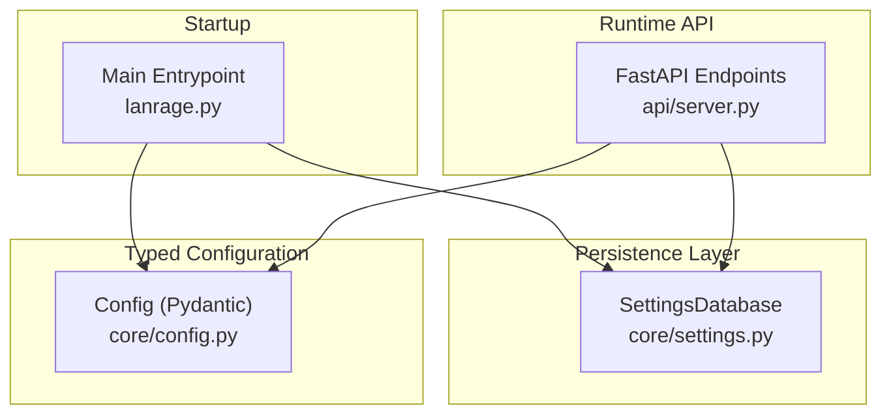
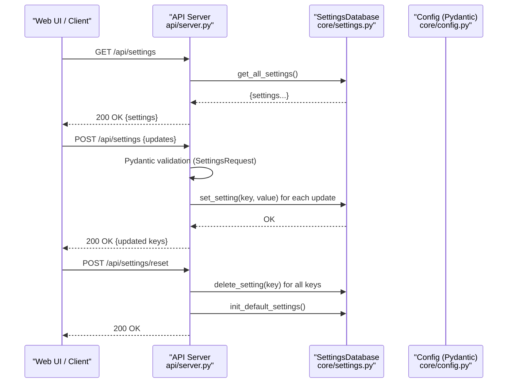
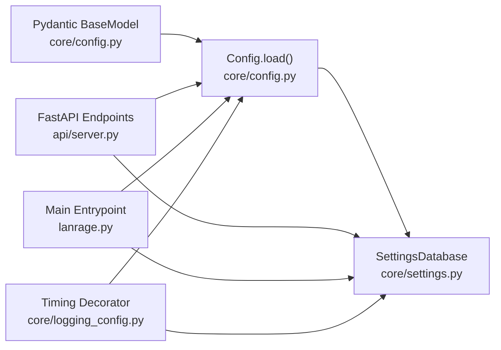

# Settings Management & Validation

<cite>
**Referenced Files in This Document**
- [core/settings.py](file://core/settings.py)
- [core/config.py](file://core/config.py)
- [api/server.py](file://api/server.py)
- [lanrage.py](file://lanrage.py)
- [tests/test_settings.py](file://tests/test_settings.py)
- [docs/SETTINGS.md](file://docs/SETTINGS.md)
- [docs/STARTUP_VALIDATION.md](file://docs/STARTUP_VALIDATION.md)
- [core/logging_config.py](file://core/logging_config.py)
- [core/exceptions.py](file://core/exceptions.py)
</cite>

## Table of Contents
1. [Introduction](#introduction)
2. [Project Structure](#project-structure)
3. [Core Components](#core-components)
4. [Architecture Overview](#architecture-overview)
5. [Detailed Component Analysis](#detailed-component-analysis)
6. [Dependency Analysis](#dependency-analysis)
7. [Performance Considerations](#performance-considerations)
8. [Troubleshooting Guide](#troubleshooting-guide)
9. [Conclusion](#conclusion)
10. [Appendices](#appendices)

## Introduction
This document explains LANrage’s settings management and validation system with a focus on runtime configuration handling and validation rules. It covers:
- How settings are persisted and retrieved using an async SQLite-backed storage layer
- How Pydantic models enforce type safety and validation for incoming configuration updates
- The default value system and initialization flow
- Validation error handling and startup diagnostics
- The settings update pipeline, change tracking, and integration with live components
- Hot-reloading behavior and its impact on active connections
- Guidance for extending validation rules and adding new configuration parameters

## Project Structure
The settings system spans several modules:
- A persistence layer that stores settings in an SQLite database with async operations
- A Pydantic model that defines typed configuration fields and default values
- An API server that exposes endpoints to read/update settings and manage saved configurations
- A main entry point that orchestrates initialization, validation, and component startup

**Diagram sources**
- [core/settings.py](file://core/settings.py#L20-L525)
- [core/config.py](file://core/config.py#L17-L114)
- [api/server.py](file://api/server.py#L574-L701)
- [lanrage.py](file://lanrage.py#L40-L154)

**Section sources**
- [core/settings.py](file://core/settings.py#L1-L525)
- [core/config.py](file://core/config.py#L1-L114)
- [api/server.py](file://api/server.py#L1-L701)
- [lanrage.py](file://lanrage.py#L1-L200)

## Core Components
- SettingsDatabase: Async SQLite-backed storage with serialization/deserialization, concurrency control, and maintenance helpers
- Config (Pydantic): Typed configuration model with defaults and database-driven loading
- API Settings Endpoints: REST endpoints to get/update/reset settings and manage saved configurations
- Main Entrypoint: Initializes settings, validates integrity, loads configuration, and starts components

Key behaviors:
- Persistence: Settings are stored as key-value pairs with an explicit type marker and updated timestamp
- Type safety: Pydantic enforces types and constraints on incoming updates
- Defaults: A default initialization routine seeds missing keys with sensible values
- Integrity: Startup checks validate database integrity and size

**Section sources**
- [core/settings.py](file://core/settings.py#L20-L525)
- [core/config.py](file://core/config.py#L17-L114)
- [api/server.py](file://api/server.py#L574-L701)
- [lanrage.py](file://lanrage.py#L53-L93)

## Architecture Overview
The settings lifecycle integrates persistence, validation, and runtime updates:

**Diagram sources**
- [api/server.py](file://api/server.py#L574-L630)
- [core/settings.py](file://core/settings.py#L97-L131)
- [core/settings.py](file://core/settings.py#L476-L507)

**Section sources**
- [api/server.py](file://api/server.py#L574-L630)
- [core/settings.py](file://core/settings.py#L97-L131)
- [core/settings.py](file://core/settings.py#L476-L507)

## Detailed Component Analysis

### SettingsDatabase: Persistence, Serialization, and Concurrency
Responsibilities:
- Initialize schema with tables for settings, server configurations, favorites, and game profiles
- Serialize values to strings with type markers for storage and deserialize on retrieval
- Provide async CRUD operations with an internal asyncio lock to prevent race conditions
- Offer maintenance utilities: integrity check, size reporting, and backup

Validation and type handling:
- Values are serialized to strings with a type tag ("bool", "int", "float", "str", "json")
- Deserialization converts values back to their original types
- JSON is used for complex types (dict/list)

Concurrency:
- Uses an asyncio.Lock around database operations to ensure thread-safe concurrent access

Maintenance:
- Integrity check via SQLite PRAGMA
- Backup using sqlite3 backup API
- Size reporting via filesystem stat

Operational notes:
- Timestamps are recorded per setting update
- Upsert semantics are used for settings writes

**Section sources**
- [core/settings.py](file://core/settings.py#L20-L525)
- [tests/test_settings.py](file://tests/test_settings.py#L13-L338)

### Pydantic Config: Typed Configuration Model and Defaults
Responsibilities:
- Define strongly typed configuration fields with defaults
- Load configuration from the settings database at runtime
- Ensure directories exist for config and keys

Validation and defaults:
- Fields include mode, network settings, API settings, user preferences, WireGuard settings, relay settings, and path defaults
- Defaults are applied when loading from the database if keys are missing
- Directory paths are ensured to exist during load

Error handling:
- Raises a configuration error if the database is uninitialized or inaccessible
- Provides actionable messages guiding users to the Web UI for setup

**Section sources**
- [core/config.py](file://core/config.py#L17-L114)

### API Settings Endpoints: Validation Pipeline and Runtime Updates
Endpoints:
- GET /api/settings: returns all persisted settings
- POST /api/settings: updates provided settings with Pydantic validation
- POST /api/settings/reset: deletes all settings and reinitializes defaults
- GET /api/settings/configs: lists saved server configurations
- POST /api/settings/configs: saves a named configuration
- POST /api/settings/configs/{id}/activate: applies a saved configuration and enables it
- DELETE /api/settings/configs/{id}: removes a saved configuration

Validation pipeline:
- Incoming updates are validated against a Pydantic model with optional fields
- Only provided keys are updated; missing keys are ignored
- Each update is written via the settings database

Change tracking and consistency:
- Updated keys are returned in the response
- Timestamps are updated automatically on each write

Hot-reloading and component impact:
- Certain settings (e.g., Discord-related) trigger a restart of the Discord integration service
- Other settings are applied immediately; some may require a restart to take full effect (e.g., API host/port)

**Section sources**
- [api/server.py](file://api/server.py#L74-L97)
- [api/server.py](file://api/server.py#L574-L677)

### Startup Initialization and Validation
Initialization steps:
- Initialize settings database and seed defaults if missing
- Validate database integrity and report size
- Load configuration from the database; fall back to defaults on first run
- Initialize network, party, NAT, control plane, metrics, Discord, and server browser
- Start the API server

Validation and diagnostics:
- Database integrity checks and size reporting
- Clear error messages guiding users to the Web UI for initial configuration
- Component initialization order ensures dependent endpoints remain healthy

**Section sources**
- [lanrage.py](file://lanrage.py#L53-L93)
- [docs/STARTUP_VALIDATION.md](file://docs/STARTUP_VALIDATION.md#L1-L172)

## Dependency Analysis
The settings system depends on:
- Pydantic for validation and serialization of configuration updates
- SQLite (via aiosqlite) for async persistence
- FastAPI for REST endpoints exposing settings operations
- Logging utilities for timing and diagnostics

**Diagram sources**
- [core/config.py](file://core/config.py#L17-L114)
- [core/settings.py](file://core/settings.py#L20-L525)
- [api/server.py](file://api/server.py#L574-L701)
- [lanrage.py](file://lanrage.py#L40-L154)
- [core/logging_config.py](file://core/logging_config.py#L169-L230)

**Section sources**
- [core/config.py](file://core/config.py#L17-L114)
- [core/settings.py](file://core/settings.py#L20-L525)
- [api/server.py](file://api/server.py#L574-L701)
- [lanrage.py](file://lanrage.py#L40-L154)
- [core/logging_config.py](file://core/logging_config.py#L169-L230)

## Performance Considerations
- Read/write operations are lightweight (<1ms/<5ms typical)
- Database size remains small for typical usage
- Concurrency is safe with asyncio locks and SQLite’s own locking
- Logging timing decorators provide visibility into operation durations

[No sources needed since this section provides general guidance]

## Troubleshooting Guide
Common issues and resolutions:
- Database locked: Ensure all operations occur within the provided async lock context
- Database corrupted: Use integrity checks and restore from backups
- Settings not persisting: Verify database file existence, write permissions, and available disk space
- Configuration load failures: Use the Web UI to initialize settings; the system will guide you to http://localhost:8666/settings.html

Validation and error handling:
- ConfigError is raised for configuration loading/validation failures
- Startup logs indicate whether the database is initialized and its integrity status
- API endpoints return meaningful HTTP errors for uninitialized components

**Section sources**
- [core/settings.py](file://core/settings.py#L373-L431)
- [core/exceptions.py](file://core/exceptions.py#L46-L49)
- [docs/SETTINGS.md](file://docs/SETTINGS.md#L606-L634)
- [lanrage.py](file://lanrage.py#L75-L93)

## Conclusion
LANrage’s settings system combines a robust async persistence layer with Pydantic-driven validation to deliver a reliable, type-safe configuration experience. Defaults are seeded at first run, integrity is maintained, and runtime updates are handled with clear validation and minimal downtime. The documented extension points allow adding new parameters while preserving type safety and operational reliability.

[No sources needed since this section summarizes without analyzing specific files]

## Appendices

### Validation Scenarios and Examples
- Type checking: Numeric fields validated to integers; boolean toggles enforced; strings validated for length constraints where applicable
- Range validation: Ports and counts constrained to acceptable ranges
- Format verification: URLs and identifiers validated via Pydantic Field constraints
- Error messages: HTTP 422 responses surface validation errors; startup and API logs provide actionable guidance

**Section sources**
- [api/server.py](file://api/server.py#L74-L97)
- [docs/SETTINGS.md](file://docs/SETTINGS.md#L505-L576)

### Extending Validation Rules and Adding New Parameters
Steps to add a new configuration parameter:
1. Add a field to the Pydantic Config model with appropriate type and default
2. Extend the SettingsRequest model in the API to accept the new field
3. Optionally add custom validators or constraints using Pydantic Field or field_validator
4. Ensure the settings database supports the new type (strings with type tags)
5. Update the Web UI to render and submit the new field
6. Test with unit tests covering serialization, deserialization, and validation

Guidance:
- Prefer Pydantic Field constraints for simple validations (min/max, length)
- Use field_validator for cross-field or complex validations
- Keep defaults aligned with Config defaults to avoid ambiguity
- Document new parameters in the settings documentation

**Section sources**
- [core/config.py](file://core/config.py#L17-L114)
- [api/server.py](file://api/server.py#L74-L97)
- [docs/SETTINGS.md](file://docs/SETTINGS.md#L505-L576)