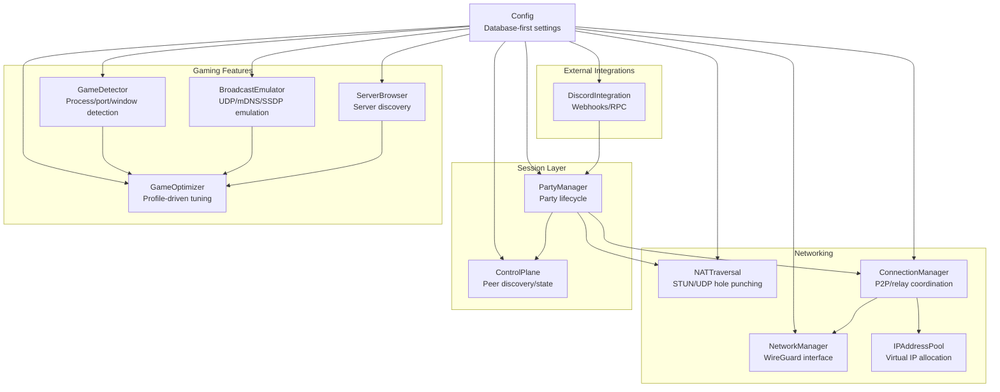
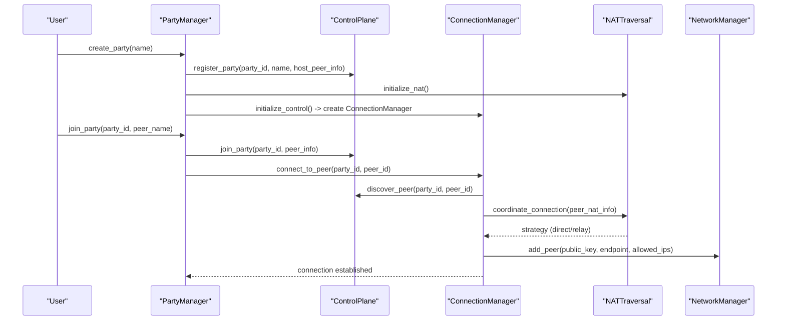
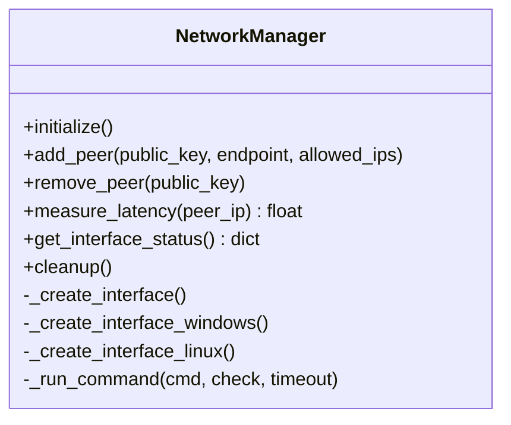
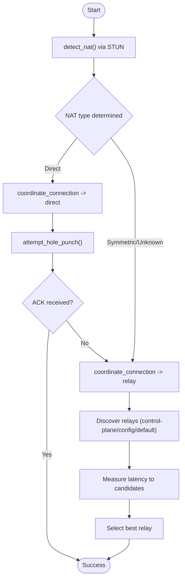
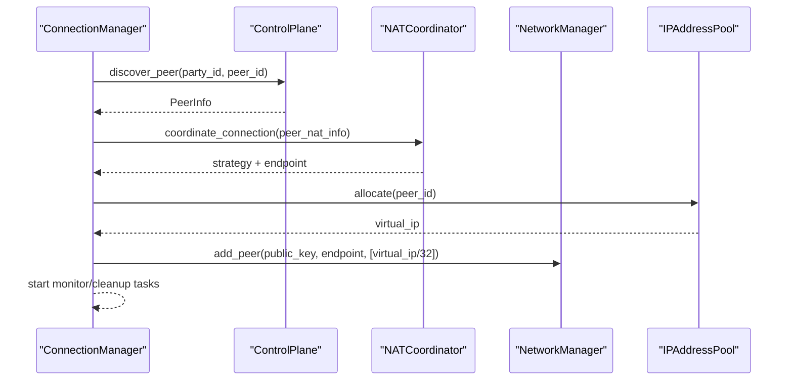
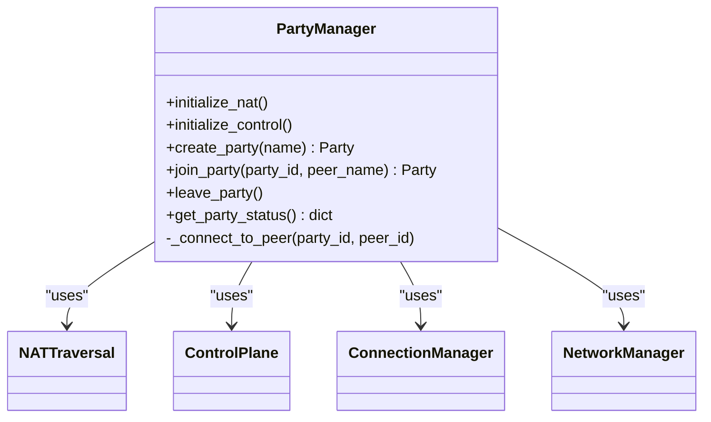
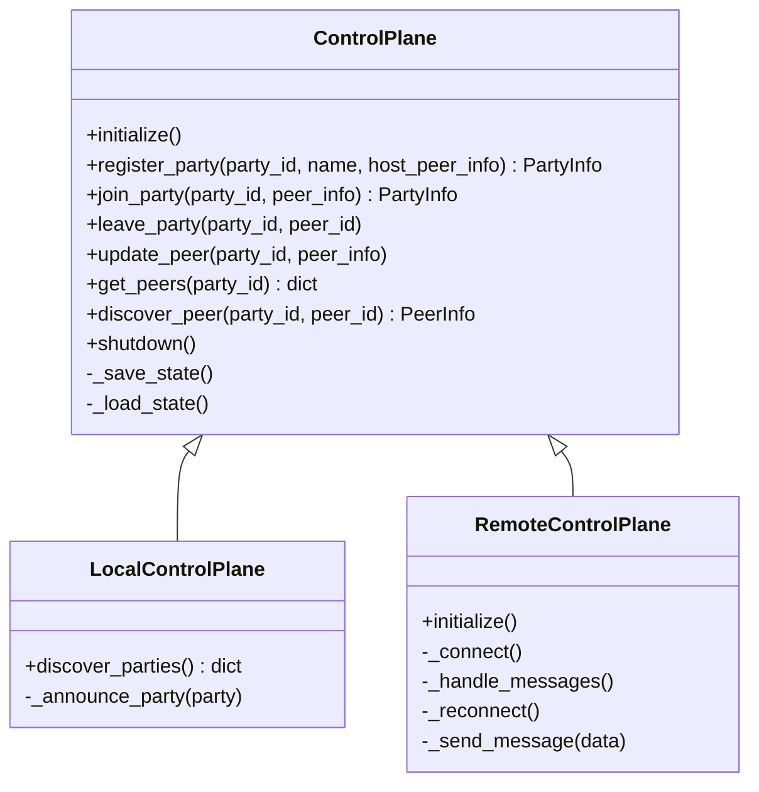
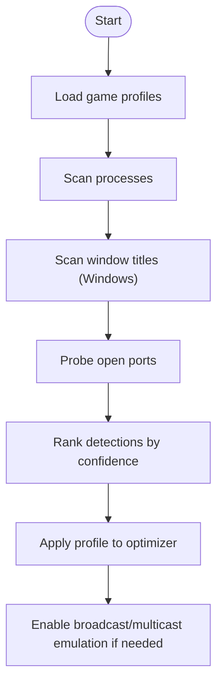
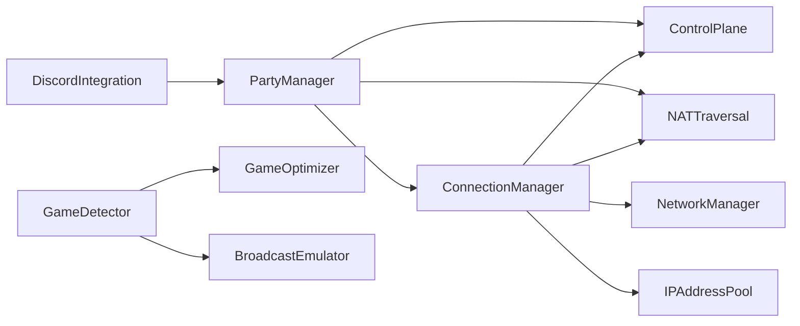

# Core Components

<cite>
**Referenced Files in This Document**
- [core/network.py](file://core/network.py)
- [core/party.py](file://core/party.py)
- [core/config.py](file://core/config.py)
- [core/nat.py](file://core/nat.py)
- [core/connection.py](file://core/connection.py)
- [core/control.py](file://core/control.py)
- [core/games.py](file://core/games.py)
- [core/discord_integration.py](file://core/discord_integration.py)
- [core/broadcast.py](file://core/broadcast.py)
- [core/ipam.py](file://core/ipam.py)
- [core/server_browser.py](file://core/server_browser.py)
- [core/task_manager.py](file://core/task_manager.py)
- [core/utils.py](file://core/utils.py)
- [core/profiler.py](file://core/profiler.py)
</cite>

## Table of Contents
1. [Introduction](#introduction)
2. [Project Structure](#project-structure)
3. [Core Components](#core-components)
4. [Architecture Overview](#architecture-overview)
5. [Detailed Component Analysis](#detailed-component-analysis)
6. [Dependency Analysis](#dependency-analysis)
7. [Performance Considerations](#performance-considerations)
8. [Troubleshooting Guide](#troubleshooting-guide)
9. [Conclusion](#conclusion)

## Introduction
This document explains LANrage’s core components that form the gaming VPN system. It covers:
- Network management with WireGuard interface creation and cross-platform handling
- Party management for mesh networking, peer discovery, and session persistence
- Configuration management using a database-first approach
- NAT traversal with STUN/UDP hole punching and relay fallback
- Game detection and optimization with automatic game profiling and broadcast emulation
- Discord integration for webhooks and Rich Presence
- Supporting subsystems: IPAM, task management, utilities, and profiling

## Project Structure
LANrage organizes its core logic under the core package with focused modules:
- Network and connectivity: network.py, nat.py, connection.py, ipam.py
- Session orchestration: party.py, control.py
- Configuration and persistence: config.py, settings.py (via config.load)
- Gaming features: games.py, broadcast.py, server_browser.py
- Integrations: discord_integration.py
- Runtime support: task_manager.py, utils.py, profiler.py

**Diagram sources**
- [core/network.py](file://core/network.py#L25-L515)
- [core/nat.py](file://core/nat.py#L41-L525)
- [core/connection.py](file://core/connection.py#L18-L493)
- [core/ipam.py](file://core/ipam.py#L10-L183)
- [core/party.py](file://core/party.py#L102-L304)
- [core/control.py](file://core/control.py#L187-L880)
- [core/games.py](file://core/games.py#L265-L800)
- [core/broadcast.py](file://core/broadcast.py#L201-L646)
- [core/server_browser.py](file://core/server_browser.py#L75-L552)
- [core/discord_integration.py](file://core/discord_integration.py#L81-L633)
- [core/config.py](file://core/config.py#L17-L114)

**Section sources**
- [core/network.py](file://core/network.py#L1-L515)
- [core/party.py](file://core/party.py#L1-L304)
- [core/config.py](file://core/config.py#L1-L114)

## Core Components

### Network Management (WireGuard)
- Responsibilities:
  - Initialize and manage the WireGuard interface
  - Cross-platform creation (Windows service and Linux kernel module)
  - Key generation and persistence
  - Peer management (add/remove), latency measurement, and status reporting
  - Logging network operations to a file
- Key APIs:
  - initialize(): checks prerequisites, generates keys, creates interface
  - add_peer(public_key, endpoint, allowed_ips)
  - remove_peer(public_key)
  - measure_latency(peer_ip)
  - get_interface_status()
  - cleanup()
- Platform specifics:
  - Windows: installs/uninstalls WireGuardTunnel$ service with config file
  - Linux: requires root; uses ip link and wg CLI to create and configure

**Section sources**
- [core/network.py](file://core/network.py#L25-L515)

### NAT Traversal (STUN/UDP Hole Punching and Relay)
- Responsibilities:
  - Detect NAT type using STUN against multiple servers
  - Attempt UDP “hole punching” to establish direct P2P
  - Coordinate connection strategy (direct vs relay) based on NAT compatibility
  - Discover and select best relay endpoint with latency measurement
- Key APIs:
  - detect_nat(): returns STUNResponse with public/private mapping and NAT type
  - attempt_hole_punch(peer_public_ip, peer_public_port, local_port)
  - get_connection_strategy(peer_nat_type)
  - _get_relay_endpoint()

**Section sources**
- [core/nat.py](file://core/nat.py#L41-L525)

### Connection Management (Mesh Orchestration)
- Responsibilities:
  - Discover peers via ControlPlane
  - Determine connection strategy (direct/relay) via NAT coordinator
  - Configure WireGuard peers with virtual IPs from IPAM
  - Monitor connection health, auto-retry, and switch relays when beneficial
  - Clean up resources on disconnect
- Key APIs:
  - connect_to_peer(party_id, peer_id)
  - disconnect_from_peer(peer_id)
  - get_connection_status(peer_id)
- Internal state:
  - PeerConnection tracks status, latency, and cleanup timers

**Section sources**
- [core/connection.py](file://core/connection.py#L18-L493)

### Party Management (Session Lifecycle)
- Responsibilities:
  - Create/join/leave parties
  - Track peers, NAT types, and latency
  - Initialize NAT traversal and control plane
  - Coordinate with ConnectionManager to connect peers
- Key APIs:
  - initialize_nat(), initialize_control()
  - create_party(name), join_party(party_id, peer_name), leave_party()
  - get_party_status()

**Section sources**
- [core/party.py](file://core/party.py#L102-L304)

### Control Plane (Peer Discovery and State)
- Responsibilities:
  - Local file-based control plane for development/testing
  - Remote control plane client with WebSocket connectivity and reconnection
  - Batched state persistence to reduce disk I/O
  - Peer registration, updates, discovery, and cleanup
- Key APIs:
  - register_party, join_party, leave_party, update_peer, get_peers, discover_peer
  - RemoteControlPlane: connect, authenticate, handle messages, reconnect

**Section sources**
- [core/control.py](file://core/control.py#L187-L880)

### Configuration Management (Database-First)
- Responsibilities:
  - Load all runtime configuration from a settings database
  - Provide strongly typed settings (mode, network, API, WireGuard keepalive, relay)
  - Ensure directories exist and validate initialization
- Key APIs:
  - Config.load(): returns hydrated Config instance

**Section sources**
- [core/config.py](file://core/config.py#L17-L114)

### Game Detection and Optimization
- Responsibilities:
  - Detect running games via process names, window titles (Windows), and open ports
  - Maintain game profiles with ports, protocols, broadcast/multicast flags, and MTU/keepalive
  - Apply adaptive optimizations (e.g., NAT-aware keepalive)
  - Support broadcast/multicast emulation for LAN discovery
- Key APIs:
  - GameDetector.start()/stop(), _detect_games(), save/load custom profiles
  - GameOptimizer.set_nat_type(), add/remove custom broadcast ports
  - BroadcastEmulator/MulticastEmulator start/stop/inject handlers

**Section sources**
- [core/games.py](file://core/games.py#L265-L800)
- [core/broadcast.py](file://core/broadcast.py#L201-L646)

### Discord Integration (Webhooks and Rich Presence)
- Responsibilities:
  - Send batched notifications to Discord webhooks
  - Update Discord Rich Presence (RPC) with state and party info
  - Optional Discord bot for channel messaging
- Key APIs:
  - start(), stop(), send_notification(), send_bot_message()
  - update_presence(), clear_presence()
  - NotificationBatcher for throttling

**Section sources**
- [core/discord_integration.py](file://core/discord_integration.py#L81-L633)

### Supporting Components
- IP Address Management (IPAM):
  - Allocates virtual IPs from a base subnet, expands across subnets, validates allocations
- Task Manager:
  - Tracks, cancels, and cleans up background tasks with completion callbacks
- Utilities:
  - Admin checks, elevation, latency/bandwidth formatting, port range parsing
- Profiler:
  - Decorators and context managers to capture function timings and system stats

**Section sources**
- [core/ipam.py](file://core/ipam.py#L10-L183)
- [core/task_manager.py](file://core/task_manager.py#L11-L167)
- [core/utils.py](file://core/utils.py#L12-L163)
- [core/profiler.py](file://core/profiler.py#L21-L265)

## Architecture Overview
The system composes configuration-driven modules to deliver a gaming VPN with automatic game awareness and social integrations.

**Diagram sources**
- [core/party.py](file://core/party.py#L144-L247)
- [core/control.py](file://core/control.py#L228-L345)
- [core/connection.py](file://core/connection.py#L38-L124)
- [core/nat.py](file://core/nat.py#L337-L369)
- [core/network.py](file://core/network.py#L392-L420)

## Detailed Component Analysis

### NetworkManager (WireGuard)
- Initialization flow:
  - Check WireGuard availability (Windows: wireguard.exe; Linux: wg)
  - Generate or load keys, persist to keys directory with secure permissions
  - Create interface:
    - Windows: write .conf and install WireGuardTunnel$ service
    - Linux: use ip link and wg CLI with sudo
- Peer lifecycle:
  - add_peer: sets persistent-keepalive, allowed-ips
  - remove_peer: removes WireGuard peer
  - measure_latency: platform-specific ping parsing
- Robustness:
  - Async command runner with timeouts and cleanup
  - Dedicated logging to file with fallback to stderr

**Diagram sources**
- [core/network.py](file://core/network.py#L25-L515)

**Section sources**
- [core/network.py](file://core/network.py#L70-L122)
- [core/network.py](file://core/network.py#L161-L325)
- [core/network.py](file://core/network.py#L392-L444)

### NATTraversal and ConnectionCoordinator
- NAT detection:
  - STUN requests to multiple Google STUN servers
  - Parse mapped address, compute NAT type heuristically
- Hole punching:
  - UDP packets to peer public endpoint from WireGuard port
  - Ack-based success detection
- Strategy selection:
  - Compatibility matrix determines direct vs relay
  - Relay discovery prioritizes control-plane discovered relays, falls back to configured/default
- Latency-based relay switching:
  - Periodic measurement and switch if improvement exceeds threshold

**Diagram sources**
- [core/nat.py](file://core/nat.py#L64-L106)
- [core/nat.py](file://core/nat.py#L244-L292)
- [core/nat.py](file://core/nat.py#L337-L398)

**Section sources**
- [core/nat.py](file://core/nat.py#L64-L106)
- [core/nat.py](file://core/nat.py#L244-L292)
- [core/nat.py](file://core/nat.py#L337-L398)

### ConnectionManager
- Orchestrates peer connection:
  - Discover peer via ControlPlane
  - Determine strategy via NAT coordinator
  - Configure WireGuard peer with virtual IP from IPAM
  - Start monitoring and cleanup tasks
- Monitoring:
  - Periodic latency checks, auto-retry, and relay switching
  - Automatic cleanup after failure timeout

**Diagram sources**
- [core/connection.py](file://core/connection.py#L38-L124)
- [core/ipam.py](file://core/ipam.py#L55-L97)
- [core/network.py](file://core/network.py#L392-L420)

**Section sources**
- [core/connection.py](file://core/connection.py#L38-L124)
- [core/connection.py](file://core/connection.py#L213-L333)
- [core/ipam.py](file://core/ipam.py#L55-L97)

### PartyManager
- Initializes NAT traversal and control plane
- Creates/joins parties, tracks peers, measures latency, and exposes status
- Integrates with ConnectionManager to connect peers

**Diagram sources**
- [core/party.py](file://core/party.py#L102-L304)

**Section sources**
- [core/party.py](file://core/party.py#L121-L158)
- [core/party.py](file://core/party.py#L198-L247)
- [core/party.py](file://core/party.py#L279-L304)

### ControlPlane (Local and Remote)
- LocalControlPlane:
  - File-based persistence with batched writes
  - Local discovery via shared file
- RemoteControlPlane:
  - WebSocket client with reconnection and message handling
  - Registration/join/leave via server, with local fallback

**Diagram sources**
- [core/control.py](file://core/control.py#L187-L456)
- [core/control.py](file://core/control.py#L458-L540)
- [core/control.py](file://core/control.py#L541-L880)

**Section sources**
- [core/control.py](file://core/control.py#L187-L456)
- [core/control.py](file://core/control.py#L541-L880)

### Configuration Management (Database-First)
- Loads all settings from a settings database, validates initialization, and ensures directories exist
- Provides strongly typed configuration for network, API, WireGuard, relay, and user preferences

**Section sources**
- [core/config.py](file://core/config.py#L49-L114)

### Game Detection and Optimization
- Detection:
  - Process name matching (with fuzzy logic)
  - Window title scanning (Windows)
  - Open port probing (UDP/TCP)
- Profiles:
  - Genre-based JSON profiles with ports, protocols, broadcast/multicast flags, MTU, keepalive
  - Custom profiles persisted to disk
- Optimization:
  - NAT-aware keepalive calculation
  - Broadcast/multicast emulation for discovery

**Diagram sources**
- [core/games.py](file://core/games.py#L370-L450)
- [core/games.py](file://core/games.py#L511-L581)
- [core/games.py](file://core/games.py#L696-L800)
- [core/broadcast.py](file://core/broadcast.py#L201-L381)

**Section sources**
- [core/games.py](file://core/games.py#L370-L450)
- [core/games.py](file://core/games.py#L511-L581)
- [core/games.py](file://core/games.py#L696-L800)
- [core/broadcast.py](file://core/broadcast.py#L201-L381)

### Discord Integration
- Webhooks:
  - Batch notifications to reduce API calls
  - Send combined summaries for multiple events
- Rich Presence:
  - Optional RPC updates with party info and assets
- Bot:
  - Optional Discord bot for channel messaging

**Section sources**
- [core/discord_integration.py](file://core/discord_integration.py#L81-L205)
- [core/discord_integration.py](file://core/discord_integration.py#L467-L536)

### Supporting Subsystems
- IPAM:
  - Allocate sequential IPs from subnets, expand to next subnet, validate integrity
- Task Manager:
  - Track tasks, graceful cancellation, completion callbacks
- Utilities:
  - Admin checks, elevated execution, formatting helpers, port range parsing
- Profiler:
  - Timing decorators, hotspots, slow functions, system stats

**Section sources**
- [core/ipam.py](file://core/ipam.py#L10-L183)
- [core/task_manager.py](file://core/task_manager.py#L11-L167)
- [core/utils.py](file://core/utils.py#L12-L163)
- [core/profiler.py](file://core/profiler.py#L21-L265)

## Dependency Analysis
- Cohesion:
  - Each module encapsulates a distinct responsibility (networking, NAT, control, gaming features)
- Coupling:
  - PartyManager depends on ControlPlane, NATTraversal, ConnectionManager, and NetworkManager
  - ConnectionManager depends on ControlPlane, NATTraversal, NetworkManager, and IPAM
  - GameDetector integrates with GameOptimizer and BroadcastEmulator
- External dependencies:
  - OS commands (wg, ip, ping), STUN sockets, optional Discord libraries, psutil, aiofiles

**Diagram sources**
- [core/party.py](file://core/party.py#L102-L158)
- [core/connection.py](file://core/connection.py#L18-L36)
- [core/games.py](file://core/games.py#L265-L274)
- [core/discord_integration.py](file://core/discord_integration.py#L81-L132)

**Section sources**
- [core/party.py](file://core/party.py#L102-L158)
- [core/connection.py](file://core/connection.py#L18-L36)
- [core/games.py](file://core/games.py#L265-L274)
- [core/discord_integration.py](file://core/discord_integration.py#L81-L132)

## Performance Considerations
- Asynchronous I/O:
  - All external commands and network operations use asyncio to avoid blocking
- Batching and caching:
  - ControlPlane state writes are batched; GameDetector profiles cached with TTL
  - Discord notifications batched to reduce API calls
- Resource monitoring:
  - Profiler captures function timings and system stats for hotspots and slow functions
- Connection resilience:
  - Persistent keepalive, periodic monitoring, and auto-retry/cleanup reduce churn

[No sources needed since this section provides general guidance]

## Troubleshooting Guide
- WireGuard initialization failures:
  - Ensure wg/wireguard is installed and accessible; check logs for detailed errors
  - Windows: verify Tunnel service installation; Linux: confirm sudo/root access
- NAT detection failures:
  - STUN servers may be blocked; system falls back to relay-only mode
- Connection issues:
  - Check peer virtual IPs and allowed-ips; verify NAT compatibility and relay selection
  - Use ConnectionManager status queries and latency measurements
- Game detection:
  - Confirm process names and ports match profiles; enable window title detection on Windows
- Discord:
  - Validate webhook URL and invite links; ensure RPC/bot dependencies are installed

**Section sources**
- [core/network.py](file://core/network.py#L70-L122)
- [core/nat.py](file://core/nat.py#L64-L106)
- [core/connection.py](file://core/connection.py#L152-L179)
- [core/games.py](file://core/games.py#L370-L450)
- [core/discord_integration.py](file://core/discord_integration.py#L554-L608)

## Conclusion
LANrage’s core components provide a cohesive, database-first gaming VPN system:
- Robust network management with cross-platform WireGuard support
- Intelligent NAT traversal and connection orchestration
- Session lifecycle management with peer discovery and persistence
- Game-aware features with detection, optimization, and broadcast emulation
- Social integrations via Discord webhooks and Rich Presence
- Strong operational support through IPAM, task management, utilities, and profiling