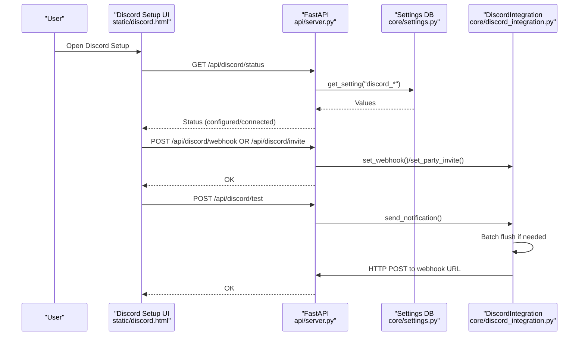
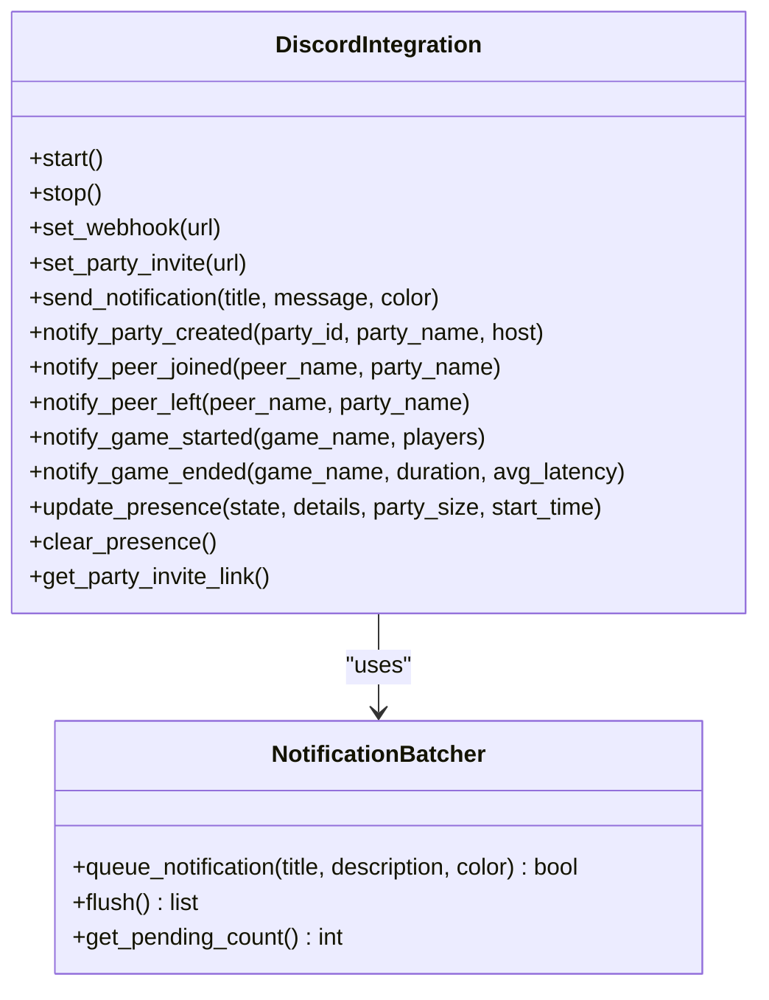
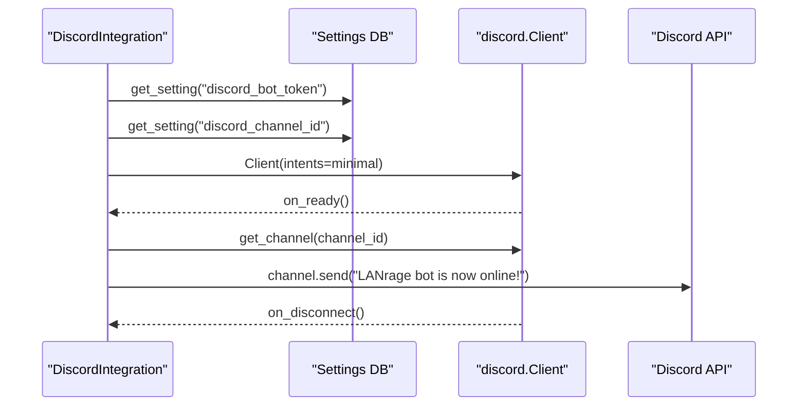
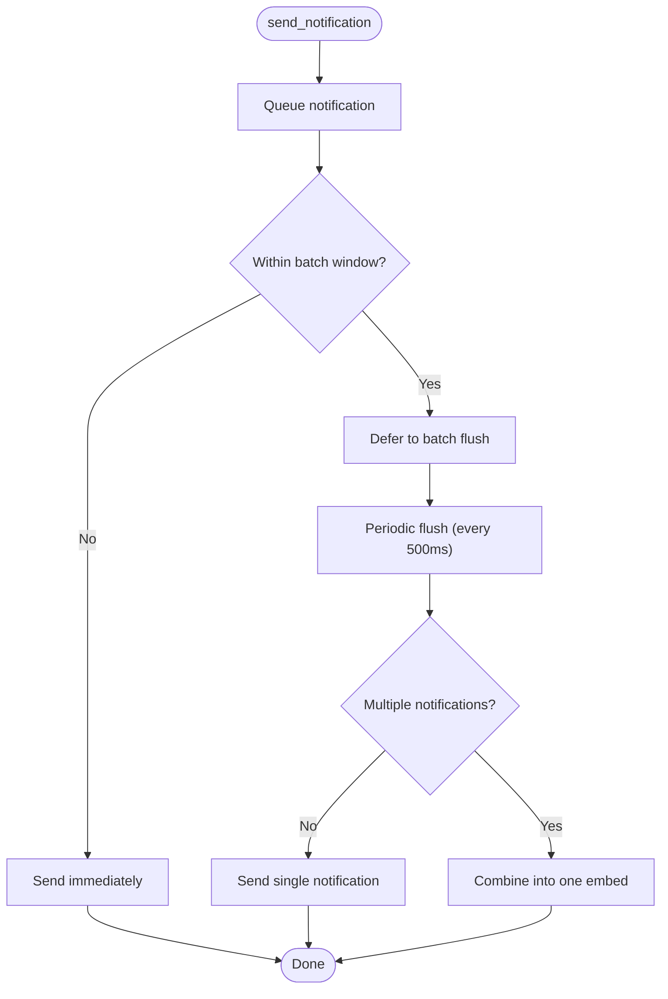
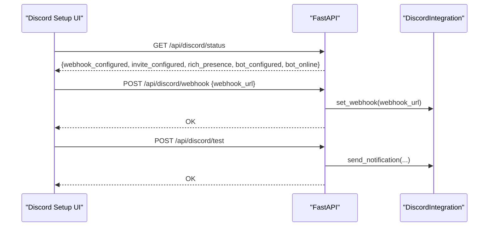
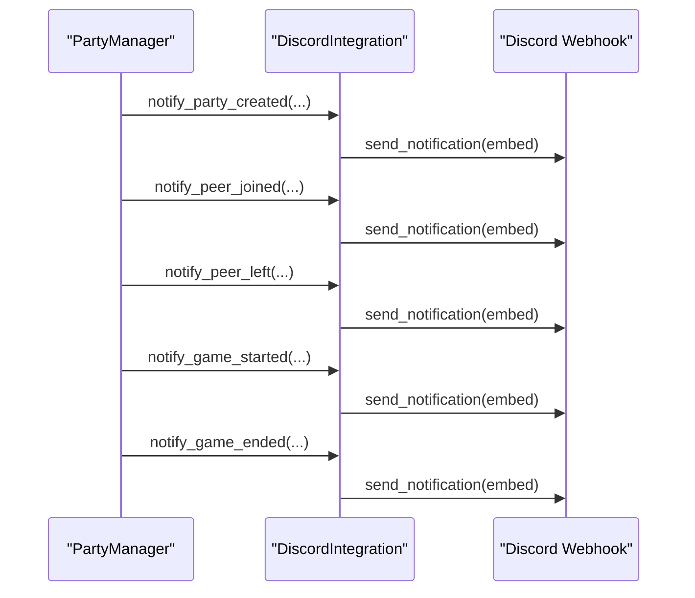
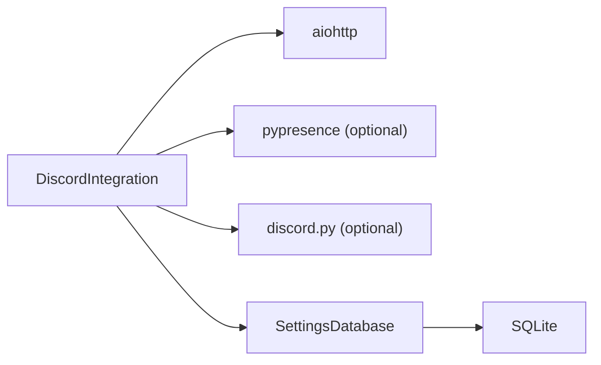

# Discord Bot Integration

<cite>
**Referenced Files in This Document**
- [discord_integration.py](file://core/discord_integration.py)
- [DISCORD.md](file://docs/DISCORD.md)
- [DISCORD_SETUP_GUIDE.md](file://docs/DISCORD_SETUP_GUIDE.md)
- [DISCORD_APP_SETUP.md](file://docs/DISCORD_APP_SETUP.md)
- [DISCORD_RICH_PRESENCE_SETUP.md](file://docs/DISCORD_RICH_PRESENCE_SETUP.md)
- [settings.py](file://core/settings.py)
- [config.py](file://core/config.py)
- [server.py](file://api/server.py)
- [requirements.txt](file://requirements.txt)
- [discord.html](file://static/discord.html)
- [party.py](file://core/party.py)
- [test_discord.py](file://tests/test_discord.py)
</cite>

## Table of Contents
1. [Introduction](#introduction)
2. [Project Structure](#project-structure)
3. [Core Components](#core-components)
4. [Architecture Overview](#architecture-overview)
5. [Detailed Component Analysis](#detailed-component-analysis)
6. [Dependency Analysis](#dependency-analysis)
7. [Performance Considerations](#performance-considerations)
8. [Troubleshooting Guide](#troubleshooting-guide)
9. [Conclusion](#conclusion)
10. [Appendices](#appendices)

## Introduction
This document explains the Discord bot integration for LANrage, focusing on automated messaging, party management notifications, and online presence. It covers setup (token configuration, channel permissions, and intent requirements), lifecycle management (connection, reconnection, graceful shutdown), message delivery (webhook and bot), and fallback behavior when optional components are unavailable. Practical examples demonstrate configuration, formatting, and integration with party management.

## Project Structure
The Discord integration spans several modules:
- Core integration logic and optional bot presence
- Settings persistence and defaults
- API endpoints for configuration and status
- Web UI for setup and testing
- Tests validating behavior

```mermaid
graph TB
subgraph "Core"
DI["DiscordIntegration<br/>core/discord_integration.py"]
SWH["DiscordWebhookHelper<br/>core/discord_integration.py"]
ST["SettingsDatabase<br/>core/settings.py"]
CFG["Config<br/>core/config.py"]
end
subgraph "API"
API["FastAPI Server<br/>api/server.py"]
end
subgraph "UI"
UI["Discord Setup Page<br/>static/discord.html"]
end
subgraph "Party"
PM["PartyManager<br/>core/party.py"]
end
subgraph "Docs"
DOC1["DISCORD.md"]
DOC2["DISCORD_SETUP_GUIDE.md"]
DOC3["DISCORD_APP_SETUP.md"]
DOC4["DISCORD_RICH_PRESENCE_SETUP.md"]
end
DI --> ST
DI --> CFG
API --> DI
UI --> API
PM --> DI
DOC1 --> DI
DOC2 --> UI
DOC3 --> DI
DOC4 --> DI
```

**Diagram sources**
- [discord_integration.py](file://core/discord_integration.py#L81-L633)
- [settings.py](file://core/settings.py#L466-L525)
- [config.py](file://core/config.py#L17-L114)
- [server.py](file://api/server.py#L278-L360)
- [discord.html](file://static/discord.html#L1-L473)
- [party.py](file://core/party.py#L102-L304)
- [DISCORD.md](file://docs/DISCORD.md#L1-L606)
- [DISCORD_SETUP_GUIDE.md](file://docs/DISCORD_SETUP_GUIDE.md#L1-L182)
- [DISCORD_APP_SETUP.md](file://docs/DISCORD_APP_SETUP.md#L1-L195)
- [DISCORD_RICH_PRESENCE_SETUP.md](file://docs/DISCORD_RICH_PRESENCE_SETUP.md#L1-L190)

**Section sources**
- [discord_integration.py](file://core/discord_integration.py#L81-L133)
- [server.py](file://api/server.py#L278-L360)
- [discord.html](file://static/discord.html#L1-L473)
- [party.py](file://core/party.py#L102-L196)

## Core Components
- DiscordIntegration: Orchestrates webhook notifications, optional Rich Presence, and optional bot presence. It loads settings from the database, manages lifecycle tasks, and batches notifications to reduce API calls.
- DiscordWebhookHelper: Provides setup instructions and validates webhook/invite URLs.
- SettingsDatabase: Stores Discord settings (webhook, invite, bot token, channel ID) and initializes defaults.
- API endpoints: Expose configuration, status, and testing for the integration.
- Web UI: Presents setup steps and live status for webhook, invite, and Rich Presence.

Key responsibilities:
- Minimal bot intents: guilds and guild_messages; message_content disabled for privacy.
- Graceful shutdown: cancels background tasks, closes sessions, and cleans up RPC/bot.
- Fire-and-forget webhook delivery with warnings on failure.
- Batched notifications to reduce API traffic.

**Section sources**
- [discord_integration.py](file://core/discord_integration.py#L81-L133)
- [discord_integration.py](file://core/discord_integration.py#L242-L296)
- [discord_integration.py](file://core/discord_integration.py#L134-L178)
- [discord_integration.py](file://core/discord_integration.py#L368-L402)
- [settings.py](file://core/settings.py#L476-L507)
- [server.py](file://api/server.py#L281-L359)
- [DISCORD.md](file://docs/DISCORD.md#L1-L606)

## Architecture Overview
The integration is optional and layered:
- Webhook notifications: persistent, fire-and-forget, and resilient to transient failures.
- Rich Presence: optional, requires pypresence and a Discord app registration.
- Bot presence: optional, connects via discord.py with minimal intents.



**Diagram sources**
- [discord.html](file://static/discord.html#L326-L470)
- [server.py](file://api/server.py#L311-L359)
- [settings.py](file://core/settings.py#L476-L507)
- [discord_integration.py](file://core/discord_integration.py#L324-L402)

## Detailed Component Analysis

### DiscordIntegration
- Lifecycle: start() loads settings, connects Rich Presence (optional), connects bot (optional), and starts a periodic batch flush task. stop() cancels tasks, flushes remaining notifications, closes sessions, and disconnects RPC/bot.
- Webhook notifications: send_notification() queues notifications; _send_webhook() posts embeds to Discord using aiohttp; batched via NotificationBatcher to reduce API calls.
- Bot presence: _connect_bot() creates a discord.Client with minimal intents (guilds, guild_messages, message_content disabled). It runs in a background task and sends a startup message to the configured channel if available.
- Rich Presence: _connect_rich_presence() attempts to connect via pypresence using an app ID from settings; update_presence() and clear_presence() manage state.



**Diagram sources**
- [discord_integration.py](file://core/discord_integration.py#L81-L633)

**Section sources**
- [discord_integration.py](file://core/discord_integration.py#L104-L178)
- [discord_integration.py](file://core/discord_integration.py#L324-L402)
- [discord_integration.py](file://core/discord_integration.py#L242-L296)
- [discord_integration.py](file://core/discord_integration.py#L206-L241)

### Bot Presence and Intents
- Minimal intents: guilds and guild_messages are enabled; message_content is disabled to minimize permissions.
- Channel targeting: requires discord_channel_id to send startup and subsequent messages.
- Connection management: _connect_bot() loads tokens and channel IDs from settings, creates the client, registers event handlers, and runs it in a background task.



**Diagram sources**
- [discord_integration.py](file://core/discord_integration.py#L242-L296)
- [discord_integration.py](file://core/discord_integration.py#L267-L281)

**Section sources**
- [discord_integration.py](file://core/discord_integration.py#L258-L265)
- [discord_integration.py](file://core/discord_integration.py#L267-L281)
- [discord_integration.py](file://core/discord_integration.py#L297-L305)

### Webhook Delivery and Rate Considerations
- Embed payload includes title, description, color, timestamp, and footer.
- Non-204 responses are logged as warnings; delivery is fire-and-forget.
- NotificationBatcher groups multiple events within a short window (default 500 ms) into a single message to reduce API usage.



**Diagram sources**
- [discord_integration.py](file://core/discord_integration.py#L46-L78)
- [discord_integration.py](file://core/discord_integration.py#L179-L186)
- [discord_integration.py](file://core/discord_integration.py#L188-L205)
- [discord_integration.py](file://core/discord_integration.py#L368-L398)

**Section sources**
- [discord_integration.py](file://core/discord_integration.py#L324-L346)
- [discord_integration.py](file://core/discord_integration.py#L368-L402)
- [discord_integration.py](file://core/discord_integration.py#L179-L205)

### API and Web UI Integration
- API endpoints:
  - POST /api/discord/webhook: set webhook URL with validation
  - POST /api/discord/invite: set invite URL with validation
  - GET /api/discord/status: integration status (webhook, invite, presence, bot configured/online)
  - GET /api/discord/instructions: setup instructions
  - POST /api/discord/test: send test notification
- Web UI:
  - Loads status and displays configured/connected badges
  - Validates URL formats before saving
  - Provides “Send Test” action



**Diagram sources**
- [server.py](file://api/server.py#L281-L359)
- [discord.html](file://static/discord.html#L326-L470)
- [discord_integration.py](file://core/discord_integration.py#L324-L346)

**Section sources**
- [server.py](file://api/server.py#L281-L359)
- [discord.html](file://static/discord.html#L326-L470)

### Party Management Integration
- Party creation, joining, leaving, and status reporting are handled by PartyManager.
- DiscordIntegration methods notify about party events and game sessions.
- These notifications can be posted to Discord via webhooks; voice chat links can be included when configured.



**Diagram sources**
- [party.py](file://core/party.py#L159-L196)
- [party.py](file://core/party.py#L198-L247)
- [party.py](file://core/party.py#L249-L261)
- [discord_integration.py](file://core/discord_integration.py#L403-L466)

**Section sources**
- [party.py](file://core/party.py#L159-L261)
- [discord_integration.py](file://core/discord_integration.py#L403-L466)

## Dependency Analysis
- Required: aiohttp for webhook HTTP requests
- Optional: pypresence for Rich Presence; discord.py for bot presence
- Settings stored in SQLite via SettingsDatabase; defaults include Discord fields



**Diagram sources**
- [requirements.txt](file://requirements.txt#L37-L45)
- [discord_integration.py](file://core/discord_integration.py#L95-L102)
- [settings.py](file://core/settings.py#L476-L507)

**Section sources**
- [requirements.txt](file://requirements.txt#L41-L45)
- [settings.py](file://core/settings.py#L476-L507)

## Performance Considerations
- Notification batching reduces API calls; adjust batch interval via NotificationBatcher constructor if needed.
- Webhook delivery is asynchronous and fire-and-forget; errors are logged rather than retried.
- Bot presence uses a background task; ensure the bot token and channel ID are configured to avoid unnecessary connection attempts.

[No sources needed since this section provides general guidance]

## Troubleshooting Guide
Common issues and resolutions:
- Webhook not working
  - Verify URL format and channel permissions
  - Use the UI’s “Send Test” to validate
  - Check logs for warnings on non-204 responses
- Invite link not showing
  - Confirm URL format and expiration/max uses settings
- Rich Presence not connecting
  - Install pypresence and restart LANrage
  - Ensure Discord desktop app is running
  - Verify application ID and asset uploads
- Bot not connecting
  - Ensure discord.py is installed
  - Confirm bot token and channel ID are set
  - Check that the bot has permissions to read/write the target channel
- Graceful shutdown
  - stop() cancels tasks and closes sessions; confirm logs indicate clean disconnects

**Section sources**
- [DISCORD_SETUP_GUIDE.md](file://docs/DISCORD_SETUP_GUIDE.md#L123-L148)
- [DISCORD_RICH_PRESENCE_SETUP.md](file://docs/DISCORD_RICH_PRESENCE_SETUP.md#L79-L123)
- [DISCORD.md](file://docs/DISCORD.md#L584-L593)
- [discord_integration.py](file://core/discord_integration.py#L134-L178)

## Conclusion
The Discord integration is designed to be optional and resilient. Webhooks provide reliable, batched notifications; Rich Presence enhances social visibility; and the bot offers presence signals with minimal permissions. The system handles lifecycle cleanly, with clear fallbacks when optional components are missing.

[No sources needed since this section summarizes without analyzing specific files]

## Appendices

### Setup and Configuration References
- Webhook setup and validation helpers
- Invite URL validation
- Default settings initialization

**Section sources**
- [discord_integration.py](file://core/discord_integration.py#L554-L608)
- [settings.py](file://core/settings.py#L476-L507)
- [DISCORD.md](file://docs/DISCORD.md#L344-L416)

### API Endpoint Reference
- POST /api/discord/webhook
- POST /api/discord/invite
- GET /api/discord/status
- GET /api/discord/instructions
- POST /api/discord/test

**Section sources**
- [server.py](file://api/server.py#L281-L359)

### Tests Reference
- Initialization and lifecycle
- URL validation helpers
- Presence clear behavior

**Section sources**
- [test_discord.py](file://tests/test_discord.py#L20-L122)