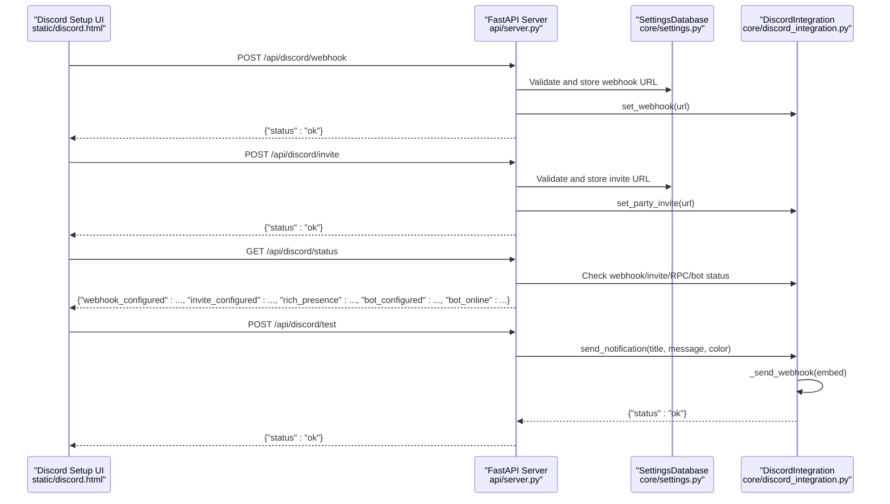
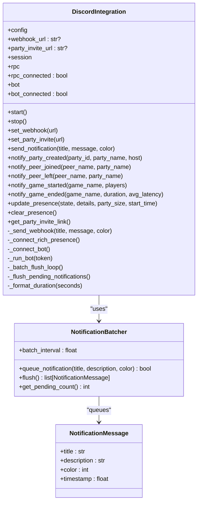
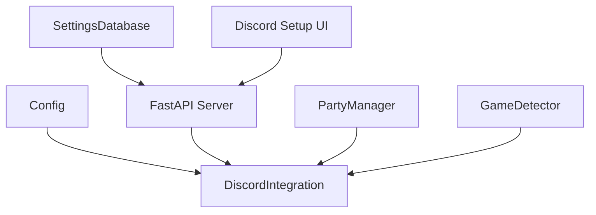

# Discord Integration

<cite>
**Referenced Files in This Document**
- [discord_integration.py](file://core/discord_integration.py)
- [DISCORD.md](file://docs/DISCORD.md)
- [DISCORD_SETUP_GUIDE.md](file://docs/DISCORD_SETUP_GUIDE.md)
- [DISCORD_RICH_PRESENCE_SETUP.md](file://docs/DISCORD_RICH_PRESENCE_SETUP.md)
- [DISCORD_APP_SETUP.md](file://docs/DISCORD_APP_SETUP.md)
- [server.py](file://api/server.py)
- [config.py](file://core/config.py)
- [settings.py](file://core/settings.py)
- [discord.html](file://static/discord.html)
- [party.py](file://core/party.py)
- [games.py](file://core/games.py)
- [test_discord.py](file://tests/test_discord.py)
</cite>

## Table of Contents
1. [Introduction](#introduction)
2. [Project Structure](#project-structure)
3. [Core Components](#core-components)
4. [Architecture Overview](#architecture-overview)
5. [Detailed Component Analysis](#detailed-component-analysis)
6. [Dependency Analysis](#dependency-analysis)
7. [Performance Considerations](#performance-considerations)
8. [Troubleshooting Guide](#troubleshooting-guide)
9. [Conclusion](#conclusion)
10. [Appendices](#appendices)

## Introduction
This document describes LANrage’s Discord integration system, focusing on webhook notifications, Discord Rich Presence, and voice chat coordination. It explains the architecture, configuration, payload structure, event-driven notifications, and operational patterns. It also covers the optional Discord bot presence, error handling, security considerations, and setup procedures.

## Project Structure
The Discord integration spans several modules:
- Core integration logic and helpers
- REST API endpoints for configuration and testing
- Settings database for persistent configuration
- Web UI for configuration and status
- Tests validating integration behavior

```mermaid
graph TB
subgraph "Core"
DI["DiscordIntegration<br/>core/discord_integration.py"]
NH["DiscordWebhookHelper<br/>core/discord_integration.py"]
CFG["Config<br/>core/config.py"]
ST["SettingsDatabase<br/>core/settings.py"]
end
subgraph "API"
API["FastAPI Server<br/>api/server.py"]
END_WEBHOOK["POST /api/discord/webhook"]
END_INVITE["POST /api/discord/invite"]
END_STATUS["GET /api/discord/status"]
END_TEST["POST /api/discord/test"]
end
subgraph "UI"
HTML["Discord Setup Page<br/>static/discord.html"]
end
subgraph "Party & Games"
PARTY["PartyManager<br/>core/party.py"]
GAMES["GameDetector<br/>core/games.py"]
end
HTML --> API
API --> DI
API --> ST
DI --> CFG
DI --> NH
PARTY --> DI
GAMES --> DI
```

**Diagram sources**
- [discord_integration.py](file://core/discord_integration.py#L81-L632)
- [server.py](file://api/server.py#L281-L358)
- [config.py](file://core/config.py#L17-L114)
- [settings.py](file://core/settings.py#L20-L525)
- [discord.html](file://static/discord.html#L247-L324)
- [party.py](file://core/party.py#L102-L304)
- [games.py](file://core/games.py#L265-L650)

**Section sources**
- [discord_integration.py](file://core/discord_integration.py#L1-L633)
- [server.py](file://api/server.py#L278-L358)
- [settings.py](file://core/settings.py#L476-L525)
- [discord.html](file://static/discord.html#L247-L324)

## Core Components
- DiscordIntegration: Orchestrates webhook notifications, Rich Presence, and optional bot presence. Provides event methods for party and game lifecycle.
- DiscordWebhookHelper: URL validation and setup instructions for webhooks and invites.
- API endpoints: Expose configuration, status, and testing for the integration.
- Settings database: Stores Discord credentials and integration state.
- Web UI: Provides a guided setup experience for webhook, invite, and Rich Presence.

Key responsibilities:
- Webhook notifications: Batched, embed-based messages with color-coded semantics.
- Rich Presence: Optional RPC updates with state, details, party size, and start time.
- Voice chat links: Optional invite URL injection into notifications.
- Event-driven notifications: Party creation/join/leave, game start/end.

**Section sources**
- [discord_integration.py](file://core/discord_integration.py#L81-L632)
- [DISCORD.md](file://docs/DISCORD.md#L15-L170)
- [server.py](file://api/server.py#L281-L358)
- [settings.py](file://core/settings.py#L494-L498)

## Architecture Overview
The integration follows an event-driven pattern:
- Configuration is stored in the settings database and loaded at runtime.
- The API exposes endpoints to set webhook/invite URLs, fetch status, and send test notifications.
- The DiscordIntegration instance runs continuously, batching notifications and optionally updating Rich Presence.
- Optional bot presence is supported via discord.py with minimal intents.



**Diagram sources**
- [server.py](file://api/server.py#L281-L358)
- [discord_integration.py](file://core/discord_integration.py#L306-L401)
- [settings.py](file://core/settings.py#L494-L498)
- [discord.html](file://static/discord.html#L378-L459)

## Detailed Component Analysis

### DiscordIntegration
Responsibilities:
- Manage aiohttp session for webhook requests.
- Load Discord settings from the settings database at startup.
- Optionally connect to Discord Rich Presence (RPC) and Discord bot.
- Batch notifications to reduce API calls.
- Provide event methods for party and game lifecycle.

Key methods:
- start/stop: Lifecycle management with graceful shutdown and cleanup.
- set_webhook/set_party_invite: Store configuration for later use.
- send_notification/_send_webhook: Build embed payload and post to webhook.
- notify_party_created/notify_peer_joined/notify_peer_left/notify_game_started/notify_game_ended: Event-driven notifications.
- update_presence/clear_presence: Rich Presence updates.
- get_party_invite_link: Retrieve configured invite URL.
- Internal batcher: NotificationBatcher groups similar notifications within a short time window.



**Diagram sources**
- [discord_integration.py](file://core/discord_integration.py#L81-L632)

**Section sources**
- [discord_integration.py](file://core/discord_integration.py#L81-L632)
- [DISCORD.md](file://docs/DISCORD.md#L17-L342)

### DiscordWebhookHelper
Responsibilities:
- Provide validation for webhook and invite URLs.
- Generate setup instructions for webhooks and invites.
- Offer a quick setup helper to configure and start integration.

Validation rules:
- Webhook URL must start with the official Discord webhook domains.
- Invite URL must start with the official invite domains.

**Section sources**
- [discord_integration.py](file://core/discord_integration.py#L554-L632)
- [DISCORD.md](file://docs/DISCORD.md#L344-L416)

### API Endpoints
Endpoints for Discord integration:
- POST /api/discord/webhook: Set webhook URL with validation.
- POST /api/discord/invite: Set invite URL with validation.
- GET /api/discord/status: Integration status (webhook, invite, Rich Presence, bot).
- GET /api/discord/instructions: Setup instructions for webhooks and invites.
- POST /api/discord/test: Send a test notification.

Behavior:
- Validation occurs before applying configuration.
- Status endpoint reflects current integration state and bot configuration.

**Section sources**
- [server.py](file://api/server.py#L281-L358)
- [DISCORD.md](file://docs/DISCORD.md#L534-L547)

### Settings and Configuration
- Settings are persisted in a SQLite database with typed serialization.
- Default settings include Discord-related keys (webhook, invite, app ID, bot token, channel ID).
- Settings are loaded via Config.load() and accessed through get_settings_db().
- API updates trigger reinitialization of DiscordIntegration when relevant settings change.

Security considerations:
- Bot token and webhook URLs are stored in the settings database.
- Treat tokens as sensitive and restrict access to the database.

**Section sources**
- [settings.py](file://core/settings.py#L476-L525)
- [config.py](file://core/config.py#L49-L114)
- [server.py](file://api/server.py#L582-L611)

### Web UI Integration
- The Discord setup page provides guided steps for webhook and invite configuration.
- It validates URL formats locally and communicates with API endpoints.
- Displays current integration status and allows sending test notifications.

**Section sources**
- [discord.html](file://static/discord.html#L247-L324)
- [discord.html](file://static/discord.html#L378-L459)

### Event-Driven Notifications
Party and game lifecycle events trigger notifications:
- Party created: Host, party ID, optional voice chat link.
- Peer joined/left: Welcome/leave messages with party name.
- Game started: Players list.
- Game ended: Duration and average latency.

Batching:
- Notifications are queued and flushed periodically or when exceeding the batch interval.
- Multiple notifications within the interval are combined into a single embed.

**Section sources**
- [discord_integration.py](file://core/discord_integration.py#L403-L466)
- [DISCORD.md](file://docs/DISCORD.md#L174-L282)

### Rich Presence Implementation
- Optional RPC updates via pypresence.
- Requires a Discord application and uploaded art assets.
- Supports state, details, party size, and start time.
- Assets must be named and uploaded to the application’s Rich Presence Art Assets.

Setup steps:
- Create a Discord application and upload the required assets.
- Configure the application ID in settings.
- Install pypresence and restart LANrage.

**Section sources**
- [discord_integration.py](file://core/discord_integration.py#L206-L241)
- [discord_integration.py](file://core/discord_integration.py#L467-L536)
- [DISCORD_RICH_PRESENCE_SETUP.md](file://docs/DISCORD_RICH_PRESENCE_SETUP.md#L1-L190)
- [DISCORD_APP_SETUP.md](file://docs/DISCORD_APP_SETUP.md#L1-L195)

### Voice Chat Coordination
- Optional Discord voice channel invite URL can be configured.
- Invite URL is injected into party-created notifications.
- The invite link can be viewed and shared from the UI.

**Section sources**
- [discord_integration.py](file://core/discord_integration.py#L403-L415)
- [discord.html](file://static/discord.html#L247-L324)

### Bot Presence (Optional)
- Optional Discord bot presence via discord.py with minimal intents.
- Requires bot token and channel ID to be configured.
- Bot runs in the background and can send messages to a configured channel.

**Section sources**
- [discord_integration.py](file://core/discord_integration.py#L242-L296)
- [server.py](file://api/server.py#L317-L329)

## Dependency Analysis
- DiscordIntegration depends on Config for initialization and aiohttp for webhook requests.
- API server depends on DiscordIntegration and SettingsDatabase for configuration and status.
- Web UI depends on API endpoints for configuration and status.
- Party and game modules can trigger notifications through DiscordIntegration.



**Diagram sources**
- [discord_integration.py](file://core/discord_integration.py#L81-L133)
- [server.py](file://api/server.py#L680-L701)
- [party.py](file://core/party.py#L102-L196)
- [games.py](file://core/games.py#L265-L290)

**Section sources**
- [discord_integration.py](file://core/discord_integration.py#L81-L133)
- [server.py](file://api/server.py#L680-L701)

## Performance Considerations
- Notification batching reduces API calls by grouping events within a short time window.
- Webhook requests are fire-and-forget with minimal overhead.
- Rich Presence updates are executed in a thread pool to avoid blocking the event loop.
- Bot presence runs in a background task and is designed to be resilient to transient failures.

[No sources needed since this section provides general guidance]

## Troubleshooting Guide
Common issues and resolutions:
- Webhook not working:
  - Verify URL format and permissions.
  - Use the “Send Test” button to validate configuration.
  - Check logs for warnings or errors.
- Invite link not showing:
  - Ensure invite URL format is valid and set to never expire with unlimited uses.
- Rich Presence not connecting:
  - Install pypresence and restart LANrage.
  - Confirm Discord desktop app is running.
  - Verify application ID is configured and assets are uploaded.
- Bot presence not active:
  - Ensure bot token and channel ID are configured.
  - Check bot connectivity status via the status endpoint.

**Section sources**
- [DISCORD_SETUP_GUIDE.md](file://docs/DISCORD_SETUP_GUIDE.md#L123-L147)
- [DISCORD_RICH_PRESENCE_SETUP.md](file://docs/DISCORD_RICH_PRESENCE_SETUP.md#L79-L114)
- [server.py](file://api/server.py#L311-L329)

## Conclusion
LANrage’s Discord integration provides a robust, event-driven system for notifications, Rich Presence, and voice chat coordination. It leverages a settings database for secure configuration, a REST API for programmatic control, and a guided web UI for ease of setup. The integration is designed to be resilient, with batching and graceful error handling to minimize impact on the gaming experience.

[No sources needed since this section summarizes without analyzing specific files]

## Appendices

### Webhook Payload Structure
- Embed fields:
  - title: Notification headline.
  - description: Body text with Markdown-like formatting.
  - color: Integer color code.
  - timestamp: ISO 8601 UTC timestamp.
  - footer: Fixed text “LANrage”.

- Request:
  - Method: POST
  - Headers: Content-Type: application/json
  - Body: JSON with embeds array containing a single embed object.

- Response:
  - Expected status: 204 No Content on success.
  - Non-204 statuses are logged as warnings.

**Section sources**
- [discord_integration.py](file://core/discord_integration.py#L382-L398)
- [DISCORD.md](file://docs/DISCORD.md#L140-L171)

### Message Templates and Color Codes
- Party Created: Includes host, party ID, and optional voice chat link.
- Peer Joined: Welcome message with party name.
- Peer Left: Departure message with party name.
- Game Started: Players list.
- Game Ended: Duration and average latency.

Color codes:
- Green: Success (e.g., Party Created)
- Blue: Information (e.g., Peer Joined)
- Orange: Warning (e.g., Peer Left)
- Purple: Game events
- Gray: Neutral (e.g., Game Ended)
- LANrage purple: Default

**Section sources**
- [discord_integration.py](file://core/discord_integration.py#L403-L466)
- [DISCORD.md](file://docs/DISCORD.md#L164-L171)

### Notification Scheduling and Batching
- Batch interval: 500 ms.
- Pending notifications are combined into a single embed when multiple occur within the interval.
- A background task periodically flushes pending notifications.

**Section sources**
- [discord_integration.py](file://core/discord_integration.py#L28-L78)
- [discord_integration.py](file://core/discord_integration.py#L179-L186)
- [discord_integration.py](file://core/discord_integration.py#L188-L205)

### Discord API Integration Details
- Webhook integration: aiohttp ClientSession for HTTP requests.
- Rich Presence: pypresence Presence client with thread pool execution.
- Bot presence: discord.py Client with minimal intents.

**Section sources**
- [discord_integration.py](file://core/discord_integration.py#L10-L13)
- [discord_integration.py](file://core/discord_integration.py#L206-L241)
- [discord_integration.py](file://core/discord_integration.py#L242-L296)

### OAuth and Token Management
- No OAuth flow is implemented for the webhook or Rich Presence.
- Bot token and webhook URLs are stored in the settings database.
- Treat tokens as sensitive and restrict access to the database.

**Section sources**
- [settings.py](file://core/settings.py#L494-L498)
- [DISCORD_SETUP_GUIDE.md](file://docs/DISCORD_SETUP_GUIDE.md#L142-L147)

### Setup Procedures
- Webhook setup: Create a Discord webhook in the desired channel and paste the URL into the UI or API.
- Invite setup: Create a permanent invite link to a voice channel and paste it into the UI or API.
- Rich Presence setup: Register a Discord application, upload assets, configure the application ID, install pypresence, and restart LANrage.

**Section sources**
- [DISCORD_SETUP_GUIDE.md](file://docs/DISCORD_SETUP_GUIDE.md#L16-L66)
- [DISCORD_RICH_PRESENCE_SETUP.md](file://docs/DISCORD_RICH_PRESENCE_SETUP.md#L1-L78)
- [DISCORD_APP_SETUP.md](file://docs/DISCORD_APP_SETUP.md#L18-L70)

### Real-Time Event Processing
- Party events: Triggered by PartyManager actions.
- Game events: Triggered by GameDetector lifecycle callbacks.
- Notifications are queued and sent asynchronously.

**Section sources**
- [party.py](file://core/party.py#L159-L196)
- [games.py](file://core/games.py#L583-L633)
- [discord_integration.py](file://core/discord_integration.py#L403-L466)

### Testing Coverage
- URL validation for webhooks and invites.
- Status retrieval and presence clearing.
- Duration formatting helpers.

**Section sources**
- [test_discord.py](file://tests/test_discord.py#L63-L98)
- [test_discord.py](file://tests/test_discord.py#L117-L122)