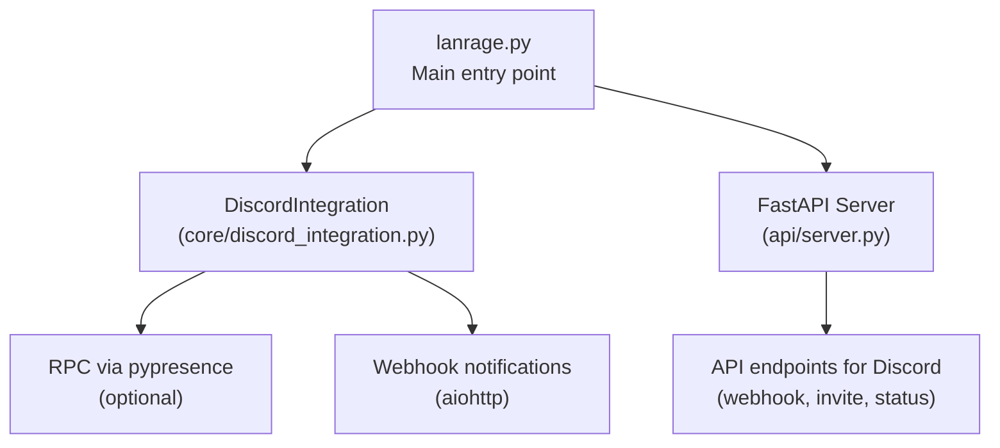
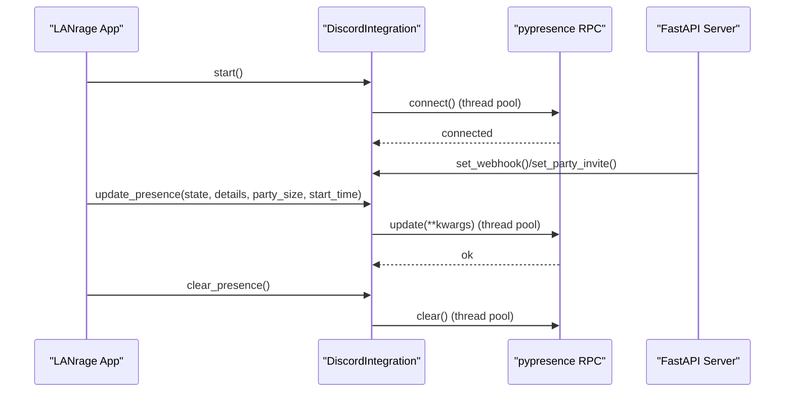
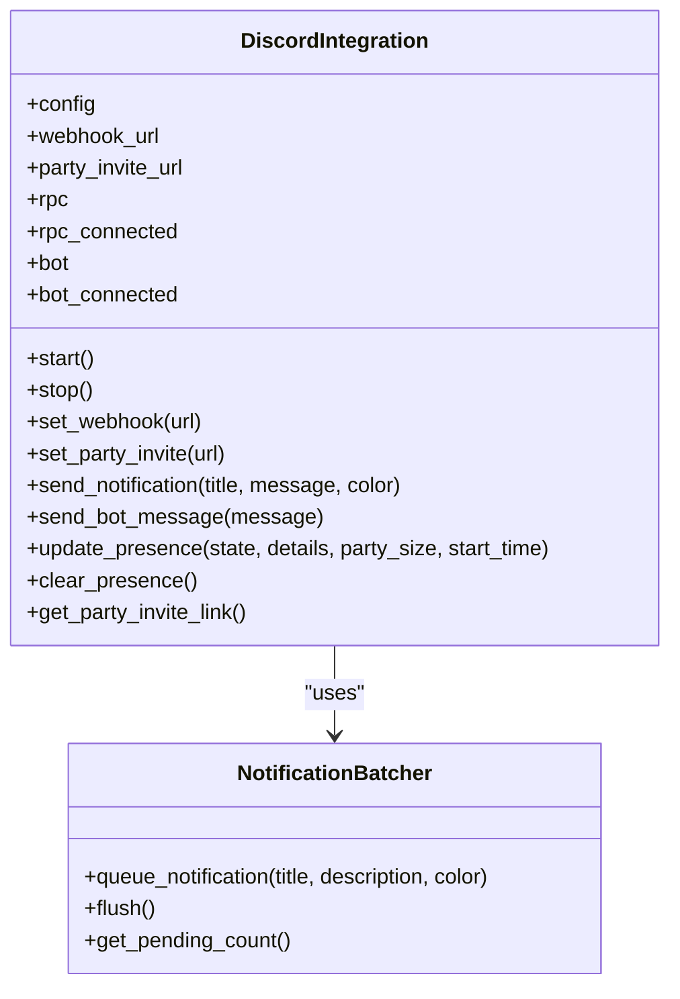
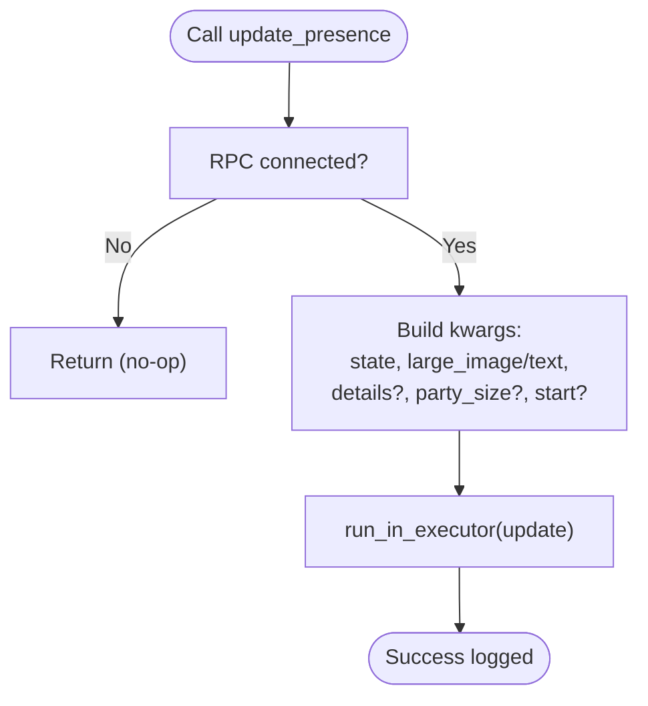
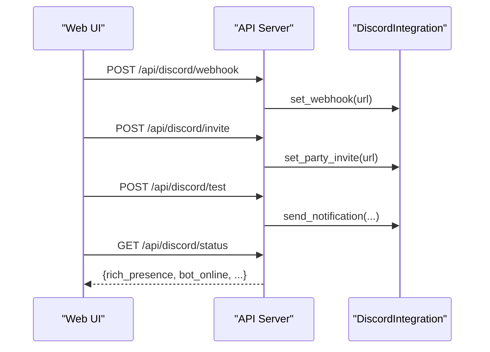
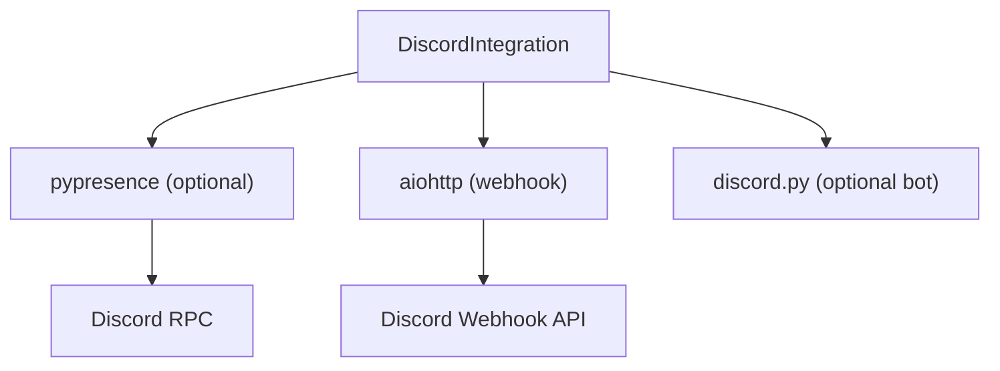

# Rich Presence Integration

<cite>
**Referenced Files in This Document**
- [discord_integration.py](file://core/discord_integration.py)
- [DISCORD.md](file://docs/DISCORD.md)
- [DISCORD_RICH_PRESENCE_SETUP.md](file://docs/DISCORD_RICH_PRESENCE_SETUP.md)
- [DISCORD_APP_SETUP.md](file://docs/DISCORD_APP_SETUP.md)
- [requirements.txt](file://requirements.txt)
- [server.py](file://api/server.py)
- [lanrage.py](file://lanrage.py)
</cite>

## Table of Contents
1. [Introduction](#introduction)
2. [Project Structure](#project-structure)
3. [Core Components](#core-components)
4. [Architecture Overview](#architecture-overview)
5. [Detailed Component Analysis](#detailed-component-analysis)
6. [Dependency Analysis](#dependency-analysis)
7. [Performance Considerations](#performance-considerations)
8. [Troubleshooting Guide](#troubleshooting-guide)
9. [Conclusion](#conclusion)

## Introduction
This document explains the Discord Rich Presence integration for displaying live game state, party status, and player activity in Discord. It covers the setup process for a Discord application, asset management, RPC connection configuration, presence update parameters, threading model to avoid blocking the event loop, practical update scenarios, optional nature of Rich Presence, graceful fallback behavior, and troubleshooting guidance.

## Project Structure
The Rich Presence integration lives in the core module and is wired into the main application lifecycle and API surface.

**Diagram sources**
- [lanrage.py](file://lanrage.py#L132-L136)
- [discord_integration.py](file://core/discord_integration.py#L81-L132)
- [server.py](file://api/server.py#L283-L329)

**Section sources**
- [lanrage.py](file://lanrage.py#L132-L136)
- [discord_integration.py](file://core/discord_integration.py#L81-L132)
- [server.py](file://api/server.py#L283-L329)

## Core Components
- DiscordIntegration: Orchestrates Rich Presence, webhook notifications, and optional Discord bot. It manages RPC connection, presence updates, and graceful shutdown.
- Presence update method: update_presence(state, details, party_size, start_time) sends updates to Discord via pypresence.
- Asset management: Requires a Discord application with Rich Presence assets (e.g., a logo named exactly as required).
- Threading model: RPC operations are executed in a thread pool to avoid blocking the asyncio event loop.
- Optional dependencies: pypresence enables Rich Presence; absence leads to graceful fallback.

**Section sources**
- [discord_integration.py](file://core/discord_integration.py#L81-L132)
- [discord_integration.py](file://core/discord_integration.py#L467-L518)
- [DISCORD.md](file://docs/DISCORD.md#L286-L314)
- [DISCORD_RICH_PRESENCE_SETUP.md](file://docs/DISCORD_RICH_PRESENCE_SETUP.md#L1-L190)
- [requirements.txt](file://requirements.txt#L41-L42)

## Architecture Overview
The integration initializes during application startup, connects to Discord RPC (if available), and exposes API endpoints to configure webhooks and invites. Presence updates are triggered by party and game events.

**Diagram sources**
- [lanrage.py](file://lanrage.py#L132-L136)
- [discord_integration.py](file://core/discord_integration.py#L104-L132)
- [discord_integration.py](file://core/discord_integration.py#L206-L241)
- [discord_integration.py](file://core/discord_integration.py#L467-L518)
- [server.py](file://api/server.py#L283-L308)

## Detailed Component Analysis

### DiscordIntegration: Rich Presence and Notifications
- Initialization and lifecycle:
  - Loads settings from the database and configures webhook and invite URLs if present.
  - Attempts to connect Rich Presence and Discord bot.
  - Starts a background task to flush notification batches periodically.
- Rich Presence:
  - Connects via pypresence in a thread pool to avoid blocking the event loop.
  - Provides update_presence() and clear_presence() methods.
- Webhook notifications:
  - Queues notifications and flushes them in batches to reduce API calls.
  - Supports helper methods for instructions and validation.

**Diagram sources**
- [discord_integration.py](file://core/discord_integration.py#L81-L132)
- [discord_integration.py](file://core/discord_integration.py#L28-L79)

**Section sources**
- [discord_integration.py](file://core/discord_integration.py#L81-L132)
- [discord_integration.py](file://core/discord_integration.py#L179-L205)
- [DISCORD.md](file://docs/DISCORD.md#L15-L82)

### Presence Update Methods
- Parameters:
  - state: Current activity label (e.g., “In Party”, “In Game”).
  - details: Additional info (e.g., game name).
  - party_size: Tuple of (current, max) players.
  - start_time: Unix timestamp to show elapsed time.
- Execution:
  - Runs in a thread pool to avoid blocking the event loop.
  - Uses a large image asset name and text for branding.

**Diagram sources**
- [discord_integration.py](file://core/discord_integration.py#L467-L518)

**Section sources**
- [discord_integration.py](file://core/discord_integration.py#L467-L518)
- [DISCORD.md](file://docs/DISCORD.md#L286-L314)

### Asset Management Requirements
- Discord application:
  - Create an application in the Discord Developer Portal.
  - Enable Rich Presence and upload assets.
- Asset naming and sizing:
  - Upload a logo named exactly “lanrage_logo”.
  - Minimum 512x512 pixels recommended; PNG with transparency preferred.
- Propagation:
  - Assets may take time to propagate to Discord’s CDN.

**Section sources**
- [DISCORD_APP_SETUP.md](file://docs/DISCORD_APP_SETUP.md#L33-L46)
- [DISCORD_APP_SETUP.md](file://docs/DISCORD_APP_SETUP.md#L112-L128)
- [DISCORD_RICH_PRESENCE_SETUP.md](file://docs/DISCORD_RICH_PRESENCE_SETUP.md#L34-L48)

### Threading Model and Event Loop Safety
- Blocking operations:
  - RPC connect/update/clear are executed in a thread pool via run_in_executor.
- Benefits:
  - Prevents blocking the asyncio event loop.
  - Ensures UI responsiveness and smooth operation.

**Section sources**
- [discord_integration.py](file://core/discord_integration.py#L223-L241)
- [discord_integration.py](file://core/discord_integration.py#L510-L518)
- [discord_integration.py](file://core/discord_integration.py#L525-L536)

### Practical Presence Update Scenarios
- Lobby states:
  - Update presence with state indicating “In Party” and include party_size.
- Game sessions:
  - Update presence with state “In Game”, details with game name, party_size, and start_time.
- Party coordination:
  - Use notify_party_created/notify_peer_joined/notify_peer_left for notifications.
  - Use clear_presence() when leaving a party or ending a session.

**Diagram sources**
- [server.py](file://api/server.py#L283-L308)
- [server.py](file://api/server.py#L311-L329)
- [server.py](file://api/server.py#L343-L358)

**Section sources**
- [DISCORD.md](file://docs/DISCORD.md#L441-L531)
- [DISCORD.md](file://docs/DISCORD.md#L534-L547)

## Dependency Analysis
- Optional dependency:
  - pypresence is required for Rich Presence; absence is handled gracefully.
- External integrations:
  - Discord RPC requires the Discord desktop app to be running.
  - Webhook notifications rely on aiohttp and a properly formatted Discord webhook URL.

**Diagram sources**
- [requirements.txt](file://requirements.txt#L41-L45)
- [discord_integration.py](file://core/discord_integration.py#L95-L102)

**Section sources**
- [requirements.txt](file://requirements.txt#L41-L45)
- [DISCORD.md](file://docs/DISCORD.md#L550-L565)

## Performance Considerations
- Batched notifications:
  - NotificationBatcher reduces webhook API calls by grouping events within a short time window.
- Thread pool usage:
  - RPC operations are offloaded to prevent event loop blocking.
- Graceful degradation:
  - Missing pypresence or Discord app does not crash the application; logs warnings and continues.

**Section sources**
- [discord_integration.py](file://core/discord_integration.py#L28-L79)
- [discord_integration.py](file://core/discord_integration.py#L179-L187)
- [DISCORD.md](file://docs/DISCORD.md#L584-L593)

## Troubleshooting Guide
Common issues and resolutions:
- “Discord Rich Presence not configured”
  - Cause: Missing or empty Discord Application ID.
  - Resolution: Set the application ID in settings and restart.
- “Discord Rich Presence failed”
  - Cause: pypresence not installed or Discord desktop app not running.
  - Resolution: Install pypresence and ensure Discord desktop app is running.
- Status not updating
  - Cause: Discord caching or timing.
  - Resolution: Restart Discord and LANrage; wait a few seconds.
- Invalid Application ID
  - Cause: Incorrect format or extra spaces.
  - Resolution: Use the exact numeric ID from the Discord Developer Portal.
- Asset validation problems
  - Cause: Wrong asset name or missing upload.
  - Resolution: Upload “lanrage_logo” with correct name and size; wait for CDN propagation.
- Permission errors
  - Cause: Discord desktop app not running or RPC connection denied.
  - Resolution: Launch Discord desktop app; verify RPC connectivity.

**Section sources**
- [DISCORD_RICH_PRESENCE_SETUP.md](file://docs/DISCORD_RICH_PRESENCE_SETUP.md#L79-L123)
- [DISCORD_APP_SETUP.md](file://docs/DISCORD_APP_SETUP.md#L81-L111)

## Conclusion
The Rich Presence integration provides a robust, optional enhancement to the LANrage experience. By following the setup steps, managing assets correctly, and leveraging the documented threading model, developers can deliver accurate, real-time presence updates without impacting application performance. The system gracefully handles missing dependencies and provides clear troubleshooting pathways for common issues.