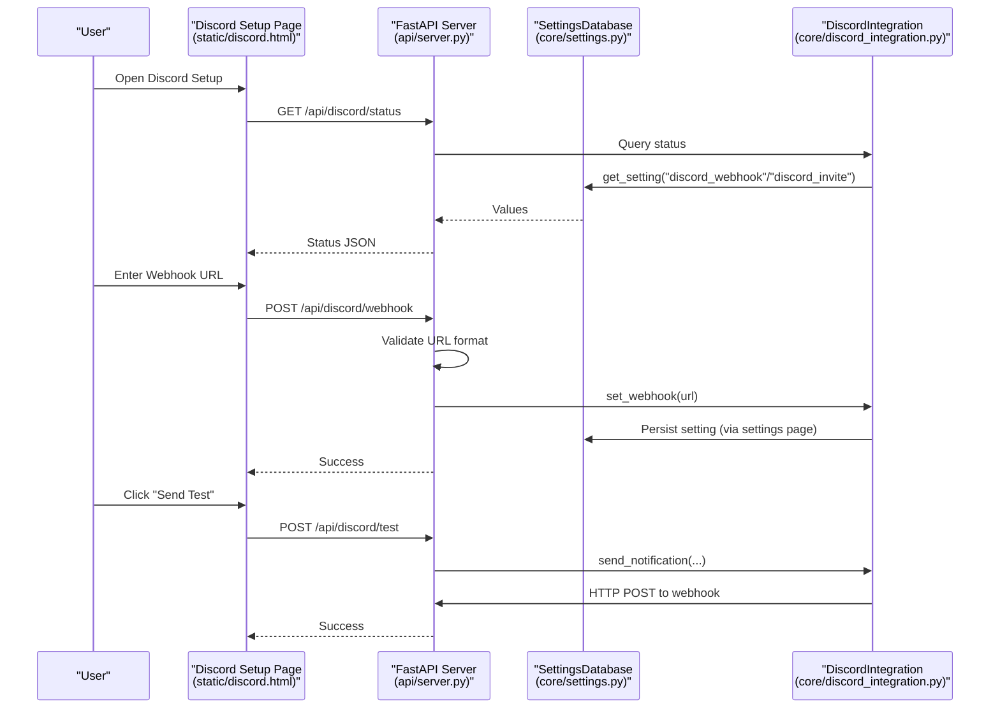
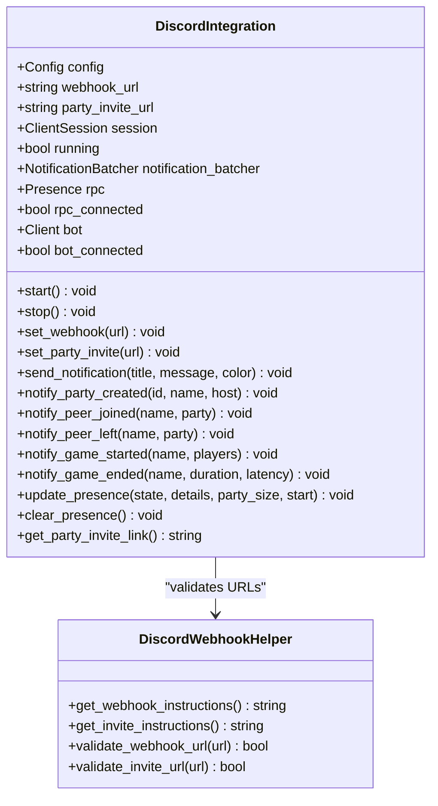
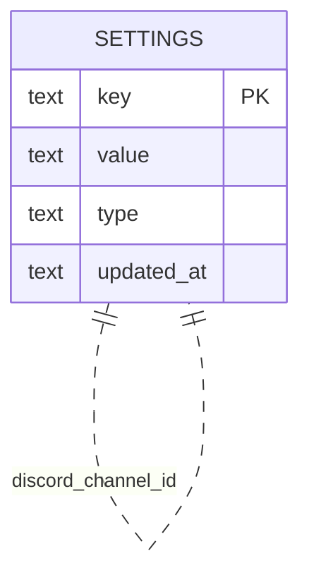
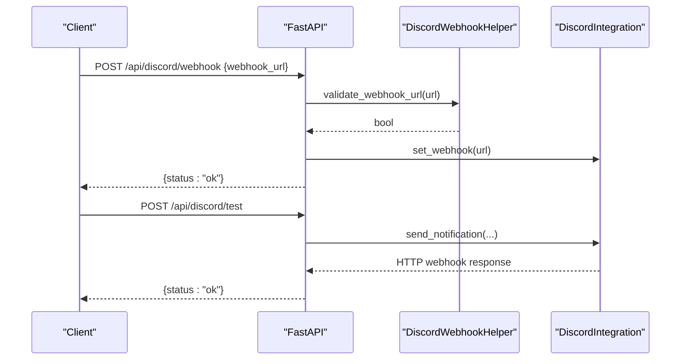
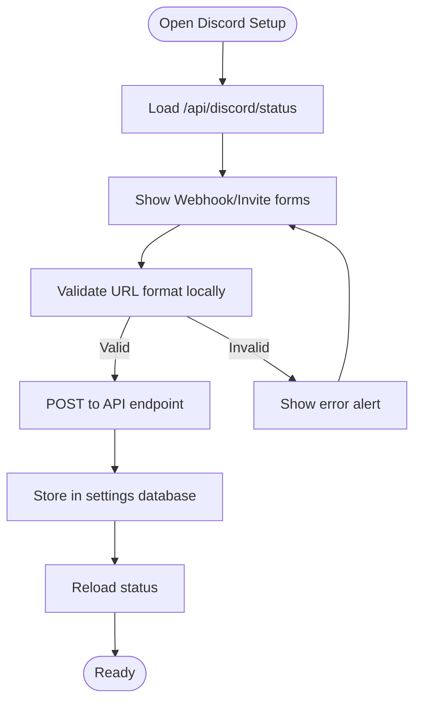
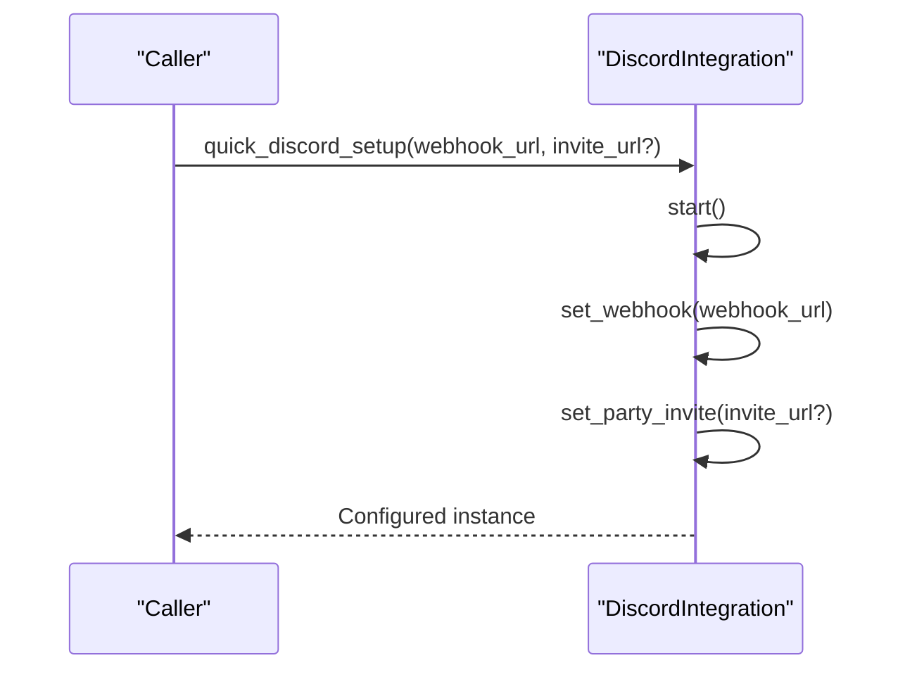
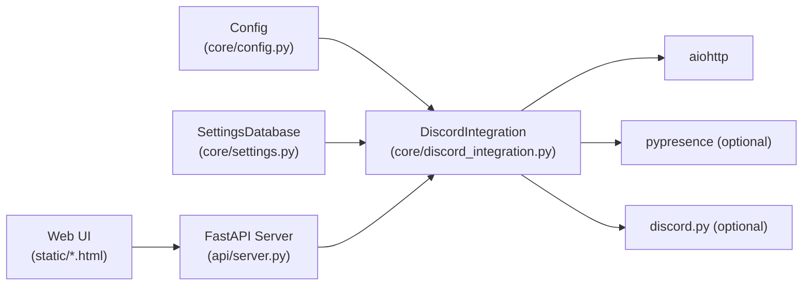

# Setup and Configuration

<cite>
**Referenced Files in This Document**
- [core/discord_integration.py](file://core/discord_integration.py)
- [docs/DISCORD.md](file://docs/DISCORD.md)
- [docs/DISCORD_SETUP_GUIDE.md](file://docs/DISCORD_SETUP_GUIDE.md)
- [docs/DISCORD_RICH_PRESENCE_SETUP.md](file://docs/DISCORD_RICH_PRESENCE_SETUP.md)
- [docs/DISCORD_APP_SETUP.md](file://docs/DISCORD_APP_SETUP.md)
- [core/config.py](file://core/config.py)
- [core/settings.py](file://core/settings.py)
- [api/server.py](file://api/server.py)
- [static/discord.html](file://static/discord.html)
- [static/settings.html](file://static/settings.html)
- [.env.example](file://.env.example)
- [tests/test_discord.py](file://tests/test_discord.py)
</cite>

## Table of Contents
1. [Introduction](#introduction)
2. [Project Structure](#project-structure)
3. [Core Components](#core-components)
4. [Architecture Overview](#architecture-overview)
5. [Detailed Component Analysis](#detailed-component-analysis)
6. [Dependency Analysis](#dependency-analysis)
7. [Performance Considerations](#performance-considerations)
8. [Troubleshooting Guide](#troubleshooting-guide)
9. [Conclusion](#conclusion)
10. [Appendices](#appendices)

## Introduction
This document explains how to set up and configure Discord integration for LANrage, focusing on initial installation, credential management, and environment configuration. It covers:
- Step-by-step setup for webhooks, invites, and Rich Presence
- How credentials are stored and retrieved from the database-first configuration
- Validation of URLs and connectivity
- The quick setup helper for rapid deployment
- Practical examples of configuration files, environment variables, and runtime updates
- Security considerations and troubleshooting

## Project Structure
Discord integration spans several modules:
- Core integration logic and helpers
- Settings database for persistent configuration
- API endpoints for runtime configuration and validation
- Web UI pages for guided setup
- Tests validating URL formats and basic behavior

```mermaid
graph TB
subgraph "Core"
DI["DiscordIntegration<br/>(core/discord_integration.py)"]
DWH["DiscordWebhookHelper<br/>(core/discord_integration.py)"]
CFG["Config<br/>(core/config.py)"]
STG["SettingsDatabase<br/>(core/settings.py)"]
end
subgraph "API"
API["FastAPI Server<br/>(api/server.py)"]
end
subgraph "Web UI"
UI1["Discord Setup Page<br/>(static/discord.html)"]
UI2["Settings Page<br/>(static/settings.html)"]
end
subgraph "Docs"
DOC1["Discord Integration<br/>(docs/DISCORD.md)"]
DOC2["Setup Guide<br/>(docs/DISCORD_SETUP_GUIDE.md)"]
DOC3["Rich Presence Setup<br/>(docs/DISCORD_RICH_PRESENCE_SETUP.md)"]
DOC4["App Setup Guide<br/>(docs/DISCORD_APP_SETUP.md)"]
end
UI1 --> API
UI2 --> API
API --> DI
DI --> STG
CFG --> STG
API --> STG
DOC1 --- DI
DOC2 --- UI1
DOC3 --- DI
DOC4 --- DI
```

**Diagram sources**
- [core/discord_integration.py](file://core/discord_integration.py#L81-L633)
- [core/settings.py](file://core/settings.py#L20-L525)
- [core/config.py](file://core/config.py#L17-L114)
- [api/server.py](file://api/server.py#L278-L360)
- [static/discord.html](file://static/discord.html#L247-L324)
- [static/settings.html](file://static/settings.html#L423-L444)
- [docs/DISCORD.md](file://docs/DISCORD.md#L1-L606)
- [docs/DISCORD_SETUP_GUIDE.md](file://docs/DISCORD_SETUP_GUIDE.md#L1-L182)
- [docs/DISCORD_RICH_PRESENCE_SETUP.md](file://docs/DISCORD_RICH_PRESENCE_SETUP.md#L1-L190)
- [docs/DISCORD_APP_SETUP.md](file://docs/DISCORD_APP_SETUP.md#L1-L195)

**Section sources**
- [core/discord_integration.py](file://core/discord_integration.py#L1-L633)
- [core/settings.py](file://core/settings.py#L1-L525)
- [api/server.py](file://api/server.py#L278-L360)
- [static/discord.html](file://static/discord.html#L1-L473)
- [static/settings.html](file://static/settings.html#L1-L684)
- [docs/DISCORD.md](file://docs/DISCORD.md#L1-L606)
- [docs/DISCORD_SETUP_GUIDE.md](file://docs/DISCORD_SETUP_GUIDE.md#L1-L182)
- [docs/DISCORD_RICH_PRESENCE_SETUP.md](file://docs/DISCORD_RICH_PRESENCE_SETUP.md#L1-L190)
- [docs/DISCORD_APP_SETUP.md](file://docs/DISCORD_APP_SETUP.md#L1-L195)

## Core Components
- DiscordIntegration: Orchestrates webhook notifications, Rich Presence, and optional bot presence. Loads credentials from the settings database at startup and exposes methods to set/update credentials at runtime.
- DiscordWebhookHelper: Provides validation helpers and setup instructions for webhook and invite URLs.
- SettingsDatabase: Persistent storage for all settings including Discord credentials (webhook URL, invite URL, app ID, bot token, channel ID).
- API endpoints: Expose configuration and validation for webhooks, invites, and status checks.
- Web UI: Two pages guide users through setup and expose validation and test actions.

Key responsibilities:
- Credential storage: Stored as settings keys in the SQLite database.
- Validation: URL format checks for webhook and invite URLs.
- Connectivity: Webhook posting and optional Rich Presence updates.
- Runtime updates: Settings can be updated via API/UI; DiscordIntegration reacts by reconnecting and applying new values.

**Section sources**
- [core/discord_integration.py](file://core/discord_integration.py#L81-L133)
- [core/discord_integration.py](file://core/discord_integration.py#L554-L608)
- [core/settings.py](file://core/settings.py#L476-L507)
- [api/server.py](file://api/server.py#L281-L359)
- [static/discord.html](file://static/discord.html#L247-L324)
- [static/settings.html](file://static/settings.html#L423-L444)

## Architecture Overview
The Discord integration follows a database-first configuration model. At runtime, DiscordIntegration loads settings from the settings database, validates URLs, and connects to Discord services. The API and Web UI provide user-driven configuration and validation.



**Diagram sources**
- [static/discord.html](file://static/discord.html#L326-L470)
- [api/server.py](file://api/server.py#L281-L359)
- [core/discord_integration.py](file://core/discord_integration.py#L104-L133)
- [core/settings.py](file://core/settings.py#L97-L131)

## Detailed Component Analysis

### DiscordIntegration: Credentials, Lifecycle, and Notifications
- Startup: Loads webhook and invite from settings database and attempts to connect Rich Presence and optional bot.
- Runtime configuration: set_webhook(), set_party_invite() store values in memory; API endpoints persist via settings.
- Validation: Uses DiscordWebhookHelper for URL validation.
- Notifications: Batches multiple notifications and sends via webhook; includes convenience methods for party/game events.
- Rich Presence: Uses pypresence if available; requires a registered Discord application and app ID.



**Diagram sources**
- [core/discord_integration.py](file://core/discord_integration.py#L81-L552)
- [core/discord_integration.py](file://core/discord_integration.py#L554-L608)

**Section sources**
- [core/discord_integration.py](file://core/discord_integration.py#L81-L552)
- [core/discord_integration.py](file://core/discord_integration.py#L554-L608)

### Settings Database: Storage of Discord Credentials
- Keys used for Discord configuration:
  - discord_app_id
  - discord_webhook
  - discord_invite
  - discord_bot_token
  - discord_channel_id
- Default initialization ensures these keys exist with empty values if missing.
- Settings are persisted via set_setting() and retrieved via get_setting().



**Diagram sources**
- [core/settings.py](file://core/settings.py#L42-L95)
- [core/settings.py](file://core/settings.py#L476-L507)

**Section sources**
- [core/settings.py](file://core/settings.py#L476-L507)

### API Endpoints: Configuration and Validation
- POST /api/discord/webhook: Validates webhook URL format and stores it.
- POST /api/discord/invite: Validates invite URL format and stores it.
- GET /api/discord/status: Reports webhook/invite/Rich Presence/bot status.
- POST /api/discord/test: Sends a test notification to the configured webhook.
- Settings endpoints: Allow updating Discord settings and trigger reconnection.



**Diagram sources**
- [api/server.py](file://api/server.py#L281-L359)
- [core/discord_integration.py](file://core/discord_integration.py#L368-L402)

**Section sources**
- [api/server.py](file://api/server.py#L281-L359)

### Web UI: Guided Setup and Validation
- Discord Setup Page: Guides webhook and invite creation, validates URLs locally, and triggers API endpoints.
- Settings Page: Allows editing Discord settings and saving them to the database.



**Diagram sources**
- [static/discord.html](file://static/discord.html#L326-L470)
- [api/server.py](file://api/server.py#L311-L329)

**Section sources**
- [static/discord.html](file://static/discord.html#L247-L324)
- [static/settings.html](file://static/settings.html#L423-L444)

### Quick Setup Helper: Rapid Deployment
- quick_discord_setup(): Quickly configures and starts DiscordIntegration with a webhook URL and optional invite URL. Useful for automated deployments or demos.



**Diagram sources**
- [core/discord_integration.py](file://core/discord_integration.py#L610-L633)

**Section sources**
- [core/discord_integration.py](file://core/discord_integration.py#L610-L633)

## Dependency Analysis
- DiscordIntegration depends on:
  - Config for runtime configuration
  - SettingsDatabase for persistent settings
  - aiohttp for webhook HTTP requests
  - Optional: pypresence for Rich Presence, discord.py for bot
- API server bridges UI and DiscordIntegration, validating inputs and persisting settings.
- Web UI pages depend on API endpoints for configuration and validation.



**Diagram sources**
- [core/config.py](file://core/config.py#L17-L114)
- [core/discord_integration.py](file://core/discord_integration.py#L84-L103)
- [api/server.py](file://api/server.py#L680-L701)

**Section sources**
- [core/discord_integration.py](file://core/discord_integration.py#L84-L103)
- [api/server.py](file://api/server.py#L680-L701)

## Performance Considerations
- Notification batching: DiscordIntegration batches notifications to reduce API calls, flushing every 500 ms.
- Asynchronous operations: Uses asyncio and aiohttp to avoid blocking during webhook posts.
- Optional integrations: Rich Presence and bot are optional; absence does not impact core functionality.

[No sources needed since this section provides general guidance]

## Troubleshooting Guide
Common issues and resolutions:
- Webhook not working
  - Verify URL format starts with the correct Discord webhook prefix.
  - Check channel permissions and test with the “Send Test” action.
  - Review logs for webhook failures.
- Invite link not showing
  - Ensure URL starts with the correct Discord invite prefix.
  - Confirm invite is set to never expire and unlimited uses.
- Rich Presence not connecting
  - Install pypresence and restart LANrage.
  - Ensure Discord desktop app is running.
  - Verify the registered application ID is configured.
- Permission errors
  - Webhook requires write access to the target channel.
  - Invite link permissions depend on server settings.
- Invalid credentials
  - Use the validation helpers and API endpoints to confirm formats.
- Connectivity problems
  - Test webhook posting via the API test endpoint.
  - Confirm network access to Discord’s API endpoints.

**Section sources**
- [docs/DISCORD_SETUP_GUIDE.md](file://docs/DISCORD_SETUP_GUIDE.md#L123-L148)
- [docs/DISCORD_RICH_PRESENCE_SETUP.md](file://docs/DISCORD_RICH_PRESENCE_SETUP.md#L79-L114)
- [tests/test_discord.py](file://tests/test_discord.py#L63-L99)

## Conclusion
LANrage’s Discord integration is configured through a database-first approach, enabling secure, persistent storage of credentials and flexible runtime updates. The combination of helper validations, API endpoints, and guided Web UI simplifies setup for webhooks, invites, and Rich Presence. Optional components like the bot and Rich Presence enhance user experience without compromising core functionality.

[No sources needed since this section summarizes without analyzing specific files]

## Appendices

### Step-by-Step Setup Procedures
- Webhook creation
  - Use the Discord Setup page to capture the webhook URL and validate it.
  - Alternatively, use the API endpoint to set the webhook and the test endpoint to validate.
- Invite creation
  - Create a permanent, unlimited-use invite and paste it into the Discord Setup page or Settings page.
- Rich Presence configuration
  - Register a Discord application, upload assets, and configure the application ID.
  - Install pypresence and restart LANrage.

**Section sources**
- [docs/DISCORD_SETUP_GUIDE.md](file://docs/DISCORD_SETUP_GUIDE.md#L27-L92)
- [docs/DISCORD_RICH_PRESENCE_SETUP.md](file://docs/DISCORD_RICH_PRESENCE_SETUP.md#L19-L78)
- [docs/DISCORD_APP_SETUP.md](file://docs/DISCORD_APP_SETUP.md#L20-L70)

### Credential Management and Storage
- Stored in the settings database under keys:
  - discord_app_id
  - discord_webhook
  - discord_invite
  - discord_bot_token
  - discord_channel_id
- Environment variables are not used; configuration is managed through the Web UI and API.

**Section sources**
- [core/settings.py](file://core/settings.py#L476-L507)
- [.env.example](file://.env.example#L1-L36)

### Configuration Validation
- URL format checks:
  - Webhook: Must start with the designated Discord webhook domain.
  - Invite: Must start with the designated Discord invite domain.
- Token verification and connectivity:
  - Webhook posting is fire-and-forget; failures are logged and do not crash the service.
  - Rich Presence and bot availability are reported via status endpoints.

**Section sources**
- [core/discord_integration.py](file://core/discord_integration.py#L596-L607)
- [api/server.py](file://api/server.py#L289-L305)
- [tests/test_discord.py](file://tests/test_discord.py#L63-L99)

### Practical Examples
- Webhook URL format examples:
  - https://discord.com/api/webhooks/...
  - https://discordapp.com/api/webhooks/...
- Invite URL format examples:
  - https://discord.gg/...
  - https://discord.com/invite/...
- Runtime configuration updates:
  - Use the Settings page to edit Discord settings and save.
  - API endpoints accept JSON payloads to update webhook, invite, and other settings.

**Section sources**
- [docs/DISCORD.md](file://docs/DISCORD.md#L378-L415)
- [static/settings.html](file://static/settings.html#L526-L563)
- [api/server.py](file://api/server.py#L582-L611)

### Security Considerations
- Keep webhook URLs private; they grant posting rights to the channel.
- Invite links can be public or private; configure expiration and usage limits appropriately.
- No sensitive data is transmitted to Discord; only party and game metadata is posted.
- All communication uses HTTPS.

**Section sources**
- [docs/DISCORD_SETUP_GUIDE.md](file://docs/DISCORD_SETUP_GUIDE.md#L142-L148)