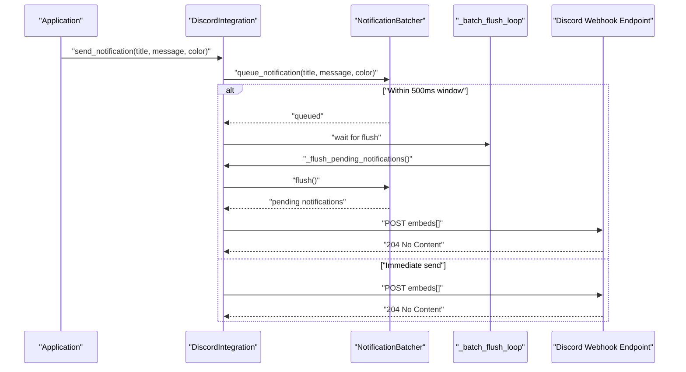
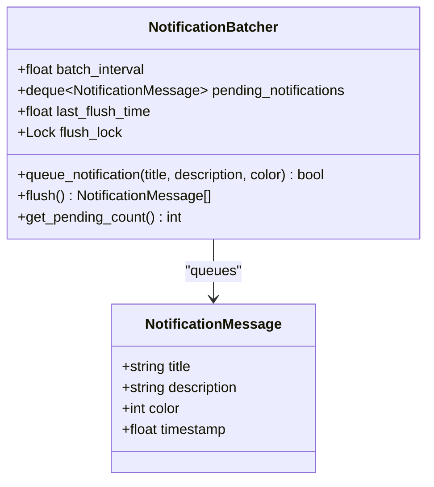
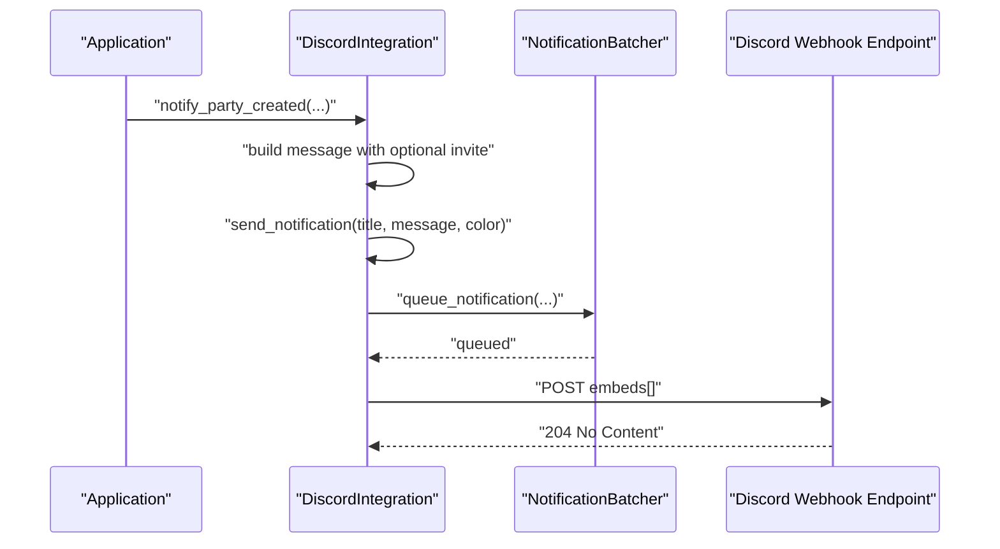
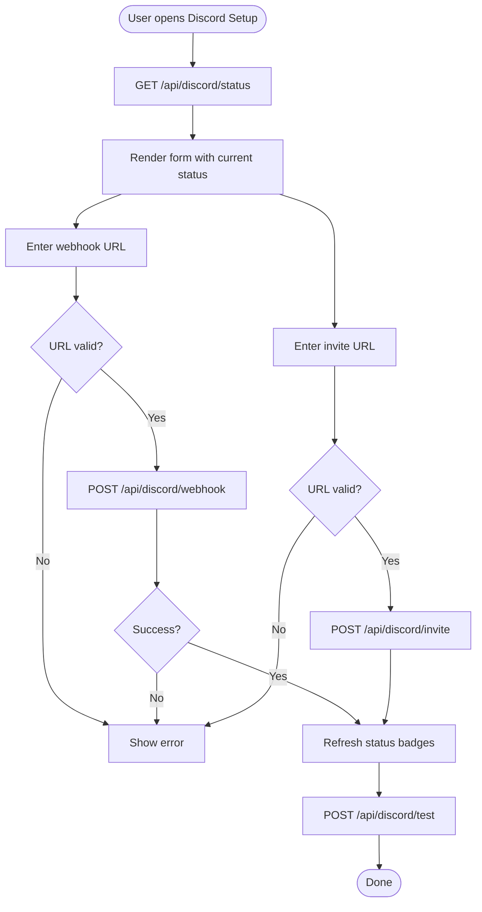
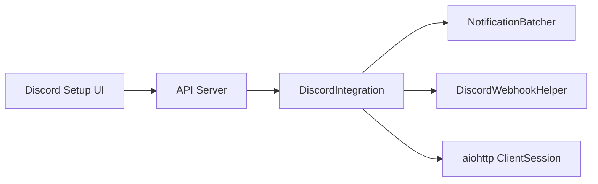
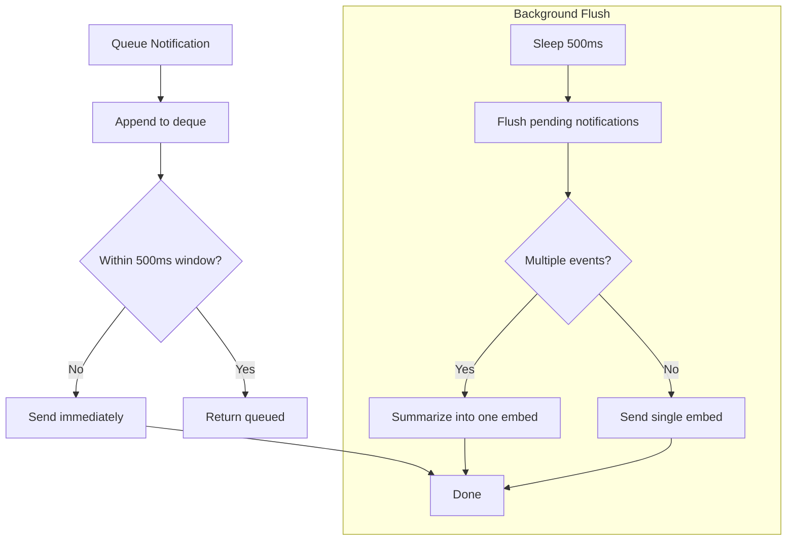

# Webhook Notifications

<cite>
**Referenced Files in This Document**
- [discord_integration.py](file://core/discord_integration.py)
- [DISCORD.md](file://docs/DISCORD.md)
- [DISCORD_SETUP_GUIDE.md](file://docs/DISCORD_SETUP_GUIDE.md)
- [server.py](file://api/server.py)
- [discord.html](file://static/discord.html)
- [test_discord.py](file://tests/test_discord.py)
</cite>

## Table of Contents
1. [Introduction](#introduction)
2. [Project Structure](#project-structure)
3. [Core Components](#core-components)
4. [Architecture Overview](#architecture-overview)
5. [Detailed Component Analysis](#detailed-component-analysis)
6. [Dependency Analysis](#dependency-analysis)
7. [Performance Considerations](#performance-considerations)
8. [Troubleshooting Guide](#troubleshooting-guide)
9. [Conclusion](#conclusion)
10. [Appendices](#appendices)

## Introduction
This document explains the Discord webhook notification system used by the application to deliver automated party status updates, game session alerts, and real-time gaming events. It covers webhook configuration, payload formatting, the notification batching mechanism, supported notification types, and operational guidance including validation, rate limiting considerations, and troubleshooting.

## Project Structure
The Discord integration spans several modules:
- Core integration logic and batching: core/discord_integration.py
- API endpoints for configuration and testing: api/server.py
- Web UI for setup and testing: static/discord.html
- Documentation for setup and usage: docs/DISCORD.md, docs/DISCORD_SETUP_GUIDE.md
- Tests validating behavior and helpers: tests/test_discord.py

```mermaid
graph TB
subgraph "Core"
DI["DiscordIntegration<br/>core/discord_integration.py"]
NB["NotificationBatcher<br/>core/discord_integration.py"]
DH["DiscordWebhookHelper<br/>core/discord_integration.py"]
end
subgraph "API"
API["FastAPI Server<br/>api/server.py"]
EP1["POST /api/discord/webhook"]
EP2["POST /api/discord/invite"]
EP3["GET /api/discord/status"]
EP4["POST /api/discord/test"]
end
subgraph "Web UI"
UI["Discord Setup Page<br/>static/discord.html"]
end
subgraph "External"
DC["Discord Webhook Endpoint"]
end
DI --> NB
DI --> DH
API --> DI
UI --> API
DI --> DC
```

**Diagram sources**
- [discord_integration.py](file://core/discord_integration.py#L28-L79)
- [server.py](file://api/server.py#L281-L359)
- [discord.html](file://static/discord.html#L326-L470)

**Section sources**
- [discord_integration.py](file://core/discord_integration.py#L1-L633)
- [server.py](file://api/server.py#L278-L359)
- [discord.html](file://static/discord.html#L1-L473)

## Core Components
- NotificationBatcher: Collects notifications within a fixed time window and flushes them as a single webhook request when the window closes or when immediate sending is required.
- DiscordIntegration: Orchestrates webhook configuration, sends individual and batched notifications, and exposes convenience methods for party and game session events.
- DiscordWebhookHelper: Provides URL validation helpers and setup instructions for webhooks and invites.
- API endpoints: Expose configuration and testing via REST.
- Web UI: Provides a guided setup experience and test button.

Key responsibilities:
- Queue and batch notifications to minimize API calls.
- Build Discord webhook payloads with embeds, color coding, timestamps, and footers.
- Validate webhook and invite URLs before applying configuration.
- Provide convenience methods for party creation, peer join/leave, and game start/end events.

**Section sources**
- [discord_integration.py](file://core/discord_integration.py#L28-L79)
- [discord_integration.py](file://core/discord_integration.py#L81-L552)
- [discord_integration.py](file://core/discord_integration.py#L554-L633)
- [server.py](file://api/server.py#L281-L359)
- [discord.html](file://static/discord.html#L326-L470)

## Architecture Overview
The notification pipeline is event-driven and asynchronous. Applications can call methods on DiscordIntegration to queue notifications. Internally, NotificationBatcher aggregates events within a 500 ms window. A background task periodically flushes the batch. When ready, DiscordIntegration constructs a webhook payload and posts it to the configured Discord webhook URL.



**Diagram sources**
- [discord_integration.py](file://core/discord_integration.py#L179-L205)
- [discord_integration.py](file://core/discord_integration.py#L324-L346)
- [discord_integration.py](file://core/discord_integration.py#L368-L402)

## Detailed Component Analysis

### NotificationBatcher
- Purpose: Reduce API calls by grouping similar notifications within a short time window.
- Behavior:
  - Maintains a deque of pending NotificationMessage entries.
  - Tracks last flush time and uses a lock to safely flush.
  - Returns whether a notification was queued (vs. sent immediately).
- Batch interval: 500 ms by default.



**Diagram sources**
- [discord_integration.py](file://core/discord_integration.py#L18-L26)
- [discord_integration.py](file://core/discord_integration.py#L28-L79)

**Section sources**
- [discord_integration.py](file://core/discord_integration.py#L28-L79)

### DiscordIntegration
- Responsibilities:
  - Start/stop integration lifecycle.
  - Manage aiohttp session and background tasks.
  - Queue and send notifications via webhook.
  - Provide convenience methods for party and game session events.
  - Update Rich Presence (optional) and manage a Discord bot (optional).
- Payload construction:
  - Embed with title, description, color, timestamp, and footer.
  - Uses UTC timestamp formatting and a consistent footer text.
- Event methods:
  - notify_party_created: Party creation with optional voice chat link.
  - notify_peer_joined/notify_peer_left: Welcome and departure messages.
  - notify_game_started/notify_game_ended: Session start/end with stats.



**Diagram sources**
- [discord_integration.py](file://core/discord_integration.py#L403-L416)
- [discord_integration.py](file://core/discord_integration.py#L324-L346)
- [discord_integration.py](file://core/discord_integration.py#L368-L402)

**Section sources**
- [discord_integration.py](file://core/discord_integration.py#L81-L552)

### DiscordWebhookHelper
- Provides:
  - Validation helpers for webhook and invite URLs.
  - Instructions for creating webhooks and invites.
- Validation rules:
  - Webhook URL must start with the official Discord webhook domains.
  - Invite URL must start with the official Discord invite domains.

**Section sources**
- [discord_integration.py](file://core/discord_integration.py#L554-L608)
- [DISCORD.md](file://docs/DISCORD.md#L378-L415)

### API Endpoints and Web UI
- API endpoints:
  - POST /api/discord/webhook: Validate and set webhook URL.
  - POST /api/discord/invite: Validate and set invite URL.
  - GET /api/discord/status: Report configuration and connectivity status.
  - POST /api/discord/test: Send a test notification.
- Web UI:
  - Guides users through webhook and invite creation.
  - Validates URL formats locally before submission.
  - Displays status badges and allows one-click test.



**Diagram sources**
- [server.py](file://api/server.py#L281-L359)
- [discord.html](file://static/discord.html#L326-L470)

**Section sources**
- [server.py](file://api/server.py#L281-L359)
- [discord.html](file://static/discord.html#L326-L470)

## Dependency Analysis
- Internal dependencies:
  - DiscordIntegration depends on NotificationBatcher and DiscordWebhookHelper.
  - API module depends on DiscordIntegration for configuration and testing.
  - Web UI depends on API endpoints for configuration and status.
- External dependencies:
  - aiohttp for asynchronous HTTP requests to Discord.
  - Optional: pypresence for Rich Presence, discord.py for bot (not required for webhooks).



**Diagram sources**
- [discord_integration.py](file://core/discord_integration.py#L81-L103)
- [server.py](file://api/server.py#L281-L359)
- [discord.html](file://static/discord.html#L326-L470)

**Section sources**
- [discord_integration.py](file://core/discord_integration.py#L3-L15)
- [server.py](file://api/server.py#L278-L359)

## Performance Considerations
- Batching window: 500 ms reduces webhook API calls during bursts (e.g., multiple peers joining quickly).
- Background flush loop: Ensures periodic flushing even if the window is not exceeded.
- Fire-and-forget behavior: Errors are logged and do not block the application.
- Payload size: Embeds are small and lightweight; batching consolidates multiple events into a single request.

[No sources needed since this section provides general guidance]

## Troubleshooting Guide
Common issues and resolutions:
- Webhook URL invalid:
  - Ensure the URL starts with the official Discord webhook domains.
  - Use the validation helpers or the Web UI’s built-in checks.
- Webhook not posting:
  - Verify the channel permissions for the webhook.
  - Use the “Send Test” action to confirm connectivity.
  - Check application logs for warnings or errors.
- Invite URL not showing:
  - Confirm the URL starts with the official Discord invite domains.
  - Ensure the invite is set to never expire and unlimited uses.
- Rate limiting:
  - The batching window (500 ms) helps reduce bursty traffic.
  - If bursts occur, consider increasing the batch interval or reducing event frequency.
- Rich Presence:
  - Install pypresence and restart the application.
  - Ensure the Discord desktop app is running.

**Section sources**
- [DISCORD.md](file://docs/DISCORD.md#L584-L593)
- [DISCORD_SETUP_GUIDE.md](file://docs/DISCORD_SETUP_GUIDE.md#L123-L141)
- [test_discord.py](file://tests/test_discord.py#L63-L99)

## Conclusion
The Discord webhook notification system provides a robust, low-overhead way to keep parties informed of real-time events. The 500 ms batching window minimizes API calls, while the embed-based payload ensures rich, contextual information. With validation, API endpoints, and a guided Web UI, configuration is straightforward and resilient to common misconfigurations.

[No sources needed since this section summarizes without analyzing specific files]

## Appendices

### Webhook Configuration Process
- Obtain a webhook URL from Discord:
  - Server Settings → Integrations → Create Webhook/New Webhook.
  - Name it appropriately and select the target channel.
- Validate and apply:
  - Use the API endpoint POST /api/discord/webhook or the Web UI.
  - The system validates the URL format before saving.
- Optional voice chat invite:
  - Create an invite with “Never Expire” and “No Limit” uses.
  - Apply via POST /api/discord/invite or the Web UI.

**Section sources**
- [DISCORD.md](file://docs/DISCORD.md#L101-L137)
- [DISCORD_SETUP_GUIDE.md](file://docs/DISCORD_SETUP_GUIDE.md#L27-L66)
- [server.py](file://api/server.py#L281-L309)
- [discord.html](file://static/discord.html#L252-L264)

### Notification Types and Templates
- Party created:
  - Title: “🎮 Party Created: {party_name}”
  - Description: Host, Party ID, optional voice chat link.
  - Color: Green.
- Peer joined:
  - Title: “👋 {peer_name} joined”
  - Description: Welcome message to the party.
  - Color: Blue.
- Peer left:
  - Title: “👋 {peer_name} left”
  - Description: Left the party.
  - Color: Orange.
- Game started:
  - Title: “🎮 Game Started: {game_name}”
  - Description: Players list.
  - Color: Purple.
- Game ended:
  - Title: “🏁 Game Ended: {game_name}”
  - Description: Duration and average latency.
  - Color: Gray.

**Section sources**
- [discord_integration.py](file://core/discord_integration.py#L403-L466)
- [DISCORD.md](file://docs/DISCORD.md#L174-L282)

### Webhook Payload Structure
- Embed fields:
  - title: Notification headline.
  - description: Body text with Markdown-like formatting.
  - color: Integer color code.
  - timestamp: ISO 8601 UTC timestamp.
  - footer: Fixed text “LANrage”.
- Request:
  - Method: POST to the webhook URL.
  - Body: JSON with embeds array containing one embed.

**Section sources**
- [discord_integration.py](file://core/discord_integration.py#L382-L390)
- [DISCORD.md](file://docs/DISCORD.md#L157-L171)

### Implementation Details: NotificationBatcher, Queue Management, and Async Delivery
- Queue management:
  - NotificationMessage instances are appended to a deque with timestamp.
  - Flush resets the queue and updates last flush time.
- Asynchronous delivery:
  - Background task sleeps for the batch interval and flushes pending notifications.
  - Combined messages summarize multiple events; single events are sent as-is.
- Immediate vs. queued:
  - If the batch interval is exceeded, send immediately; otherwise queue.



**Diagram sources**
- [discord_integration.py](file://core/discord_integration.py#L46-L63)
- [discord_integration.py](file://core/discord_integration.py#L179-L205)

**Section sources**
- [discord_integration.py](file://core/discord_integration.py#L28-L79)
- [discord_integration.py](file://core/discord_integration.py#L179-L205)

### Practical Examples
- Programmatic setup:
  - Use the quick setup helper to configure webhook and optional invite.
- API usage:
  - POST /api/discord/webhook with a validated URL.
  - POST /api/discord/test to verify delivery.
- Web UI:
  - Navigate to the Discord setup page, paste URLs, and click “Send Test”.

**Section sources**
- [discord_integration.py](file://core/discord_integration.py#L611-L633)
- [server.py](file://api/server.py#L281-L359)
- [discord.html](file://static/discord.html#L378-L426)

### URL Validation and Rate Limiting
- URL validation:
  - Webhook: Must start with official webhook domains.
  - Invite: Must start with official invite domains.
- Rate limiting considerations:
  - The 500 ms batching window reduces burstiness.
  - If experiencing rate limits, consider reducing event frequency or increasing the batch interval.

**Section sources**
- [discord_integration.py](file://core/discord_integration.py#L596-L608)
- [DISCORD.md](file://docs/DISCORD.md#L584-L593)