# Broadcast Emulation

<cite>
**Referenced Files in This Document**
- [core/broadcast.py](file://core/broadcast.py)
- [docs/BROADCAST.md](file://docs/BROADCAST.md)
- [core/games.py](file://core/games.py)
- [game_profiles/README.md](file://game_profiles/README.md)
- [game_profiles/fps.json](file://game_profiles/fps.json)
- [game_profiles/custom/example.json](file://game_profiles/custom/example.json)
- [core/party.py](file://core/party.py)
- [core/config.py](file://core/config.py)
- [tests/test_broadcast.py](file://tests/test_broadcast.py)
- [tests/test_broadcast_dedup.py](file://tests/test_broadcast_dedup.py)
</cite>

## Table of Contents
1. [Introduction](#introduction)
2. [Project Structure](#project-structure)
3. [Core Components](#core-components)
4. [Architecture Overview](#architecture-overview)
5. [Detailed Component Analysis](#detailed-component-analysis)
6. [Dependency Analysis](#dependency-analysis)
7. [Performance Considerations](#performance-considerations)
8. [Troubleshooting Guide](#troubleshooting-guide)
9. [Conclusion](#conclusion)
10. [Appendices](#appendices)

## Introduction
This document explains the broadcast emulation system that enables legacy LAN games to discover each other over the internet. It covers how the system monitors broadcast/multicast traffic, intercepts and forwards packets to party members, prevents network loops via deduplication, and integrates with the party system and game profiles. It also documents the custom broadcast port whitelist mechanism, runtime port management, and practical examples for configuring broadcast emulation for specific games.

## Project Structure
The broadcast emulation system spans several modules:
- Broadcast engine: packet capture, deduplication, forwarding, injection
- Game detection and optimization: dynamic port monitoring and profile-driven configuration
- Party integration: registering peers and forwarding broadcast packets
- Game profiles: JSON-based configuration for ports, protocols, and broadcast/multicast flags

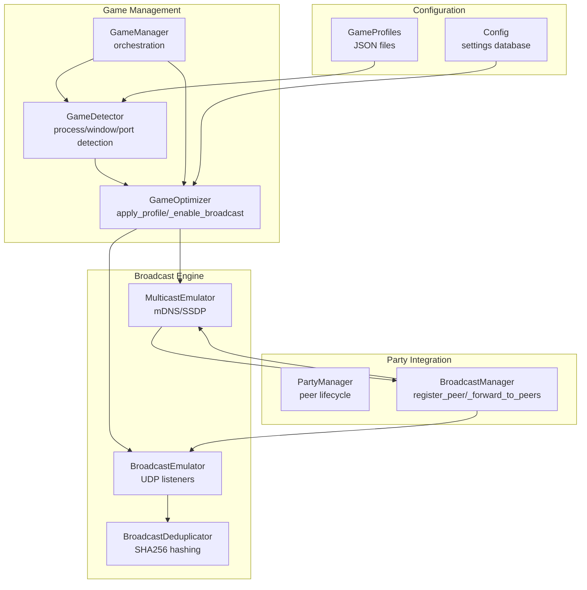

**Diagram sources**
- [core/broadcast.py](file://core/broadcast.py#L201-L646)
- [core/games.py](file://core/games.py#L696-L1349)
- [core/party.py](file://core/party.py#L102-L304)
- [core/config.py](file://core/config.py#L17-L114)

**Section sources**
- [core/broadcast.py](file://core/broadcast.py#L1-L646)
- [core/games.py](file://core/games.py#L696-L1349)
- [core/party.py](file://core/party.py#L102-L304)
- [core/config.py](file://core/config.py#L17-L114)

## Core Components
- BroadcastEmulator: listens on configured UDP ports, detects broadcast packets, deduplicates, and forwards to peers.
- MulticastEmulator: listens on multicast groups (mDNS, SSDP), captures and forwards packets.
- BroadcastDeduplicator: prevents duplicate forwarding using time-windowed SHA256 packet hashes.
- BroadcastManager: coordinates broadcast and multicast emulators, registers peers, and injects remote packets locally.
- GameOptimizer: applies game profiles, dynamically starts/stops broadcast listeners based on active games and a custom whitelist.
- GameDetector/GameProfiles: define which ports and protocols to monitor for each game.
- PartyManager: manages peer lifecycles and integrates with broadcast forwarding.

**Section sources**
- [core/broadcast.py](file://core/broadcast.py#L201-L646)
- [core/games.py](file://core/games.py#L696-L1349)
- [core/party.py](file://core/party.py#L102-L304)

## Architecture Overview
The broadcast emulation pipeline:
- Game detection loads profiles and determines which ports require broadcast emulation.
- GameOptimizer dynamically starts listeners for game ports and maintains a custom whitelist.
- BroadcastEmulator/MulticastEmulator capture inbound packets and forward them to registered peers.
- BroadcastManager injects remote broadcast/multicast packets into the local network.
- PartyManager ensures peers are registered/unregistered as they join/leave.

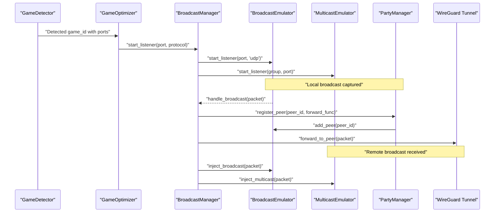

**Diagram sources**
- [core/games.py](file://core/games.py#L807-L928)
- [core/broadcast.py](file://core/broadcast.py#L552-L646)
- [core/party.py](file://core/party.py#L102-L120)

## Detailed Component Analysis

### BroadcastEmulator
- Purpose: Capture UDP broadcast packets on monitored ports, deduplicate, and forward to peers.
- Monitoring: Starts listeners on a predefined list of common game ports plus any dynamic ports from profiles and whitelist.
- Deduplication: Uses BroadcastDeduplicator to prevent loops and redundant forwarding.
- Injection: Can inject remote broadcast packets back into the local network.

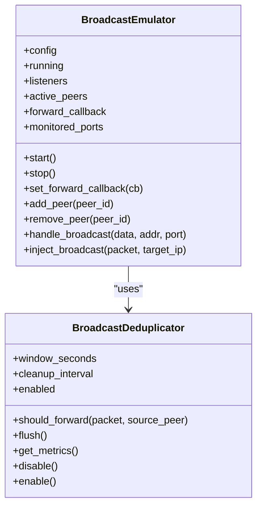

**Diagram sources**
- [core/broadcast.py](file://core/broadcast.py#L201-L239)
- [core/broadcast.py](file://core/broadcast.py#L30-L199)

**Section sources**
- [core/broadcast.py](file://core/broadcast.py#L201-L407)

### MulticastEmulator
- Purpose: Capture and forward multicast packets (e.g., mDNS, SSDP).
- Listening: Joins multicast groups and binds to ports.
- Injection: Sends multicast packets back into the local network.

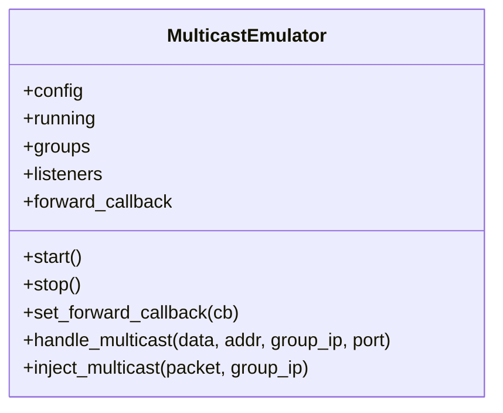

**Diagram sources**
- [core/broadcast.py](file://core/broadcast.py#L427-L537)

**Section sources**
- [core/broadcast.py](file://core/broadcast.py#L427-L537)

### BroadcastDeduplicator
- Purpose: Prevent duplicate forwarding using time-windowed SHA256 hashes of packet content, source IP, and destination port.
- Metrics: Tracks total/deduplicated/forwarded packets and deduplication rate.
- Cleanup: Periodic background task removes expired hashes.

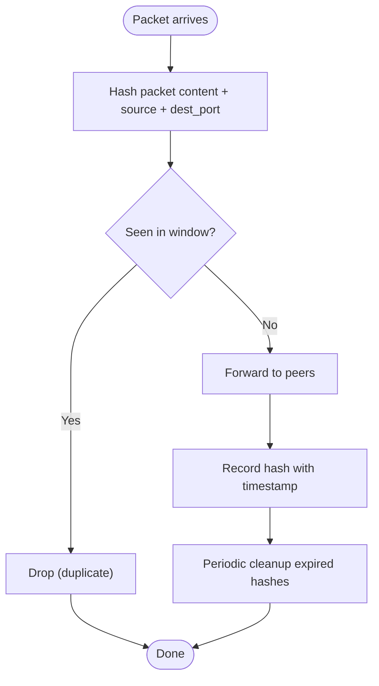

**Diagram sources**
- [core/broadcast.py](file://core/broadcast.py#L30-L199)

**Section sources**
- [core/broadcast.py](file://core/broadcast.py#L30-L199)

### BroadcastManager
- Purpose: Central coordinator for broadcast and multicast emulators.
- Peer registration: Registers/unregisters peers and forwards packets to all registered peers.
- Remote packet injection: Injects remote broadcast/multicast packets into the local network.

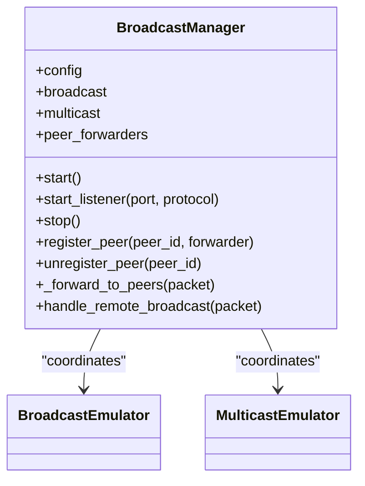

**Diagram sources**
- [core/broadcast.py](file://core/broadcast.py#L552-L646)

**Section sources**
- [core/broadcast.py](file://core/broadcast.py#L552-L646)

### GameOptimizer and Dynamic Port Monitoring
- Purpose: Dynamically enable/disable broadcast listeners based on active game profiles and a custom whitelist.
- Mechanism:
  - Loads game profiles and monitors ports flagged for broadcast.
  - Maintains a set of monitored ports and tracks which game uses which ports.
  - Adds/removes ports from monitoring based on game lifecycle and whitelist.
  - Persists custom ports to a JSON file for runtime persistence.

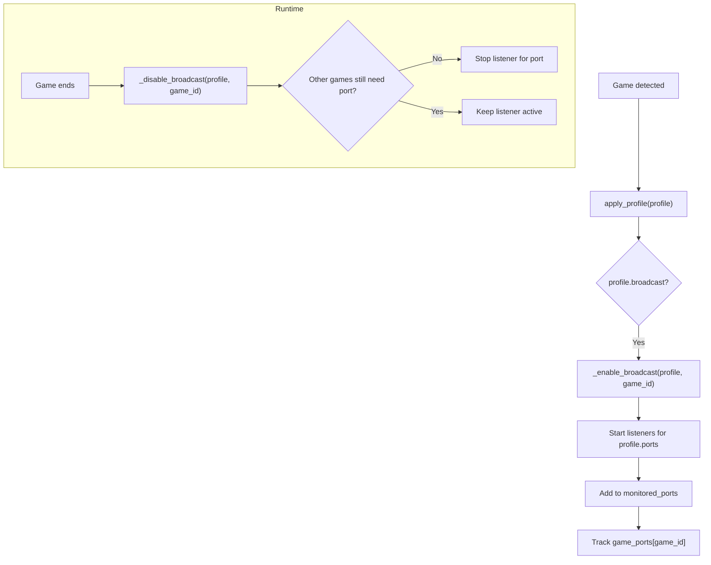

**Diagram sources**
- [core/games.py](file://core/games.py#L807-L928)
- [core/games.py](file://core/games.py#L1228-L1287)

**Section sources**
- [core/games.py](file://core/games.py#L707-L806)
- [core/games.py](file://core/games.py#L807-L928)
- [core/games.py](file://core/games.py#L1228-L1287)

### Custom Broadcast Port Whitelist
- Persistence: Custom ports are stored in a JSON file under the config directory and loaded at startup.
- Runtime management: Ports can be added/removed programmatically and persisted immediately.
- Scope: Ports in the whitelist remain monitored even when no game is actively using them.

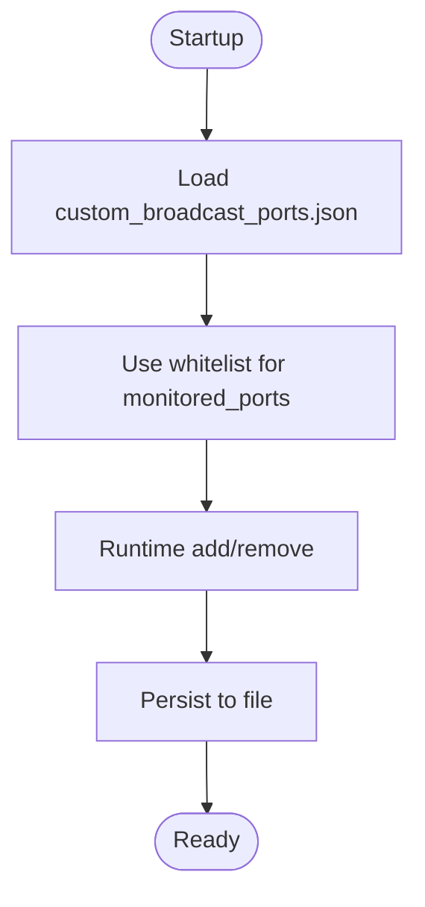

**Diagram sources**
- [core/games.py](file://core/games.py#L714-L744)
- [core/games.py](file://core/games.py#L746-L805)

**Section sources**
- [core/games.py](file://core/games.py#L714-L805)

### Integration with Party System
- Peer registration: When a peer joins, register them with BroadcastManager and add to BroadcastEmulator’s active peers.
- Packet forwarding: BroadcastManager forwards packets to all registered peers via the provided forwarder.
- Lifecycle: Unregister peers on leave and remove from active peers.

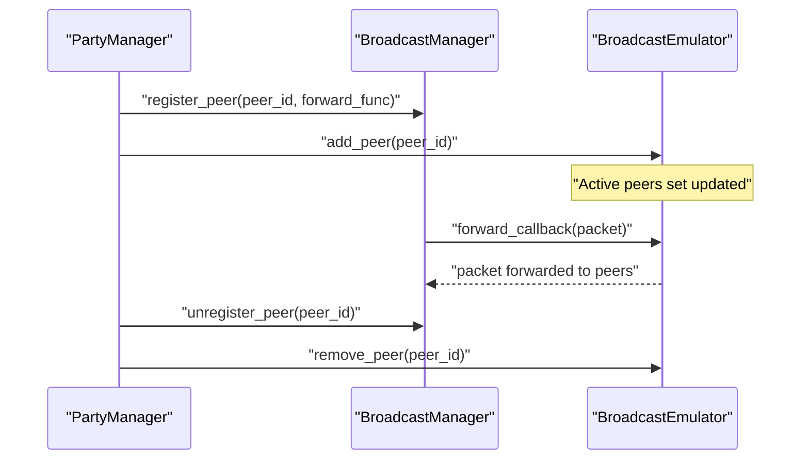

**Diagram sources**
- [core/party.py](file://core/party.py#L102-L120)
- [core/broadcast.py](file://core/broadcast.py#L552-L646)

**Section sources**
- [core/party.py](file://core/party.py#L102-L120)
- [core/broadcast.py](file://core/broadcast.py#L552-L646)

### Game Profiles and Broadcast Configuration
- Profiles define ports, protocol, and whether broadcast/multicast is used.
- Example: FPS profiles include ports and broadcast flags for games like Counter-Strike 2 and Battlefield.
- Custom profiles: Users can add custom games with broadcast/multicast enabled.

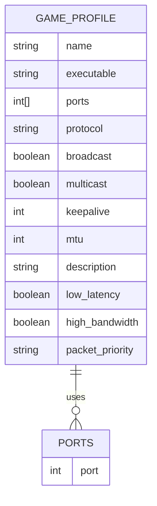

**Diagram sources**
- [game_profiles/README.md](file://game_profiles/README.md#L29-L92)
- [game_profiles/fps.json](file://game_profiles/fps.json#L1-L143)
- [game_profiles/custom/example.json](file://game_profiles/custom/example.json#L1-L18)

**Section sources**
- [game_profiles/README.md](file://game_profiles/README.md#L29-L92)
- [game_profiles/fps.json](file://game_profiles/fps.json#L1-L143)
- [game_profiles/custom/example.json](file://game_profiles/custom/example.json#L1-L18)

## Dependency Analysis
- BroadcastEmulator depends on BroadcastDeduplicator for deduplication and uses asyncio transports for UDP sockets.
- BroadcastManager composes BroadcastEmulator and MulticastEmulator and orchestrates peer forwarding.
- GameOptimizer depends on GameDetector/GameProfiles to decide which ports to monitor and integrates with BroadcastManager.
- PartyManager manages peer lifecycles and integrates with BroadcastManager for broadcast forwarding.

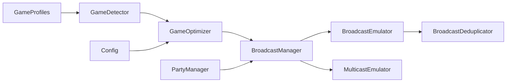

**Diagram sources**
- [core/games.py](file://core/games.py#L696-L1349)
- [core/broadcast.py](file://core/broadcast.py#L201-L646)
- [core/party.py](file://core/party.py#L102-L304)
- [core/config.py](file://core/config.py#L17-L114)

**Section sources**
- [core/games.py](file://core/games.py#L696-L1349)
- [core/broadcast.py](file://core/broadcast.py#L201-L646)
- [core/party.py](file://core/party.py#L102-L304)
- [core/config.py](file://core/config.py#L17-L114)

## Performance Considerations
- CPU overhead: Less than 2% per active port.
- Memory footprint: ~5 MB for all listeners.
- Network overhead: Minimal—only when broadcasts/multicasts occur.
- Latency: Capture <1 ms, forward <5 ms, inject <1 ms, total end-to-end <10 ms.

**Section sources**
- [docs/BROADCAST.md](file://docs/BROADCAST.md#L479-L493)

## Troubleshooting Guide
Common issues and resolutions:
- Port already in use: Listener gracefully skips conflicting ports; ensure no other application uses the port.
- Permission denied: Requires admin/sudo privileges to create raw sockets and bind to privileged ports.
- Broadcasts not forwarded: Ensure peers are registered and forward callback is set; verify active peers count.

Operational checks:
- Verify listeners started for monitored ports.
- Confirm deduplication metrics indicate expected forwarding rates.
- Validate custom whitelist persists and remains effective across restarts.

**Section sources**
- [docs/BROADCAST.md](file://docs/BROADCAST.md#L568-L584)
- [tests/test_broadcast.py](file://tests/test_broadcast.py#L53-L76)
- [tests/test_broadcast_dedup.py](file://tests/test_broadcast_dedup.py#L107-L133)

## Conclusion
The broadcast emulation system provides seamless LAN game discovery over the internet by intelligently capturing, deduplicating, and forwarding broadcast/multicast packets. It integrates tightly with game profiles and the party system, supports dynamic runtime port management, and offers a robust custom whitelist mechanism for user-defined ports. With minimal performance impact and strong reliability, it enables modern LAN games to work reliably in distributed environments.

## Appendices

### Practical Examples

- Configure broadcast emulation for a specific game:
  - Ensure the game profile has broadcast enabled and lists the correct ports.
  - Start the game; GameOptimizer will dynamically start listeners for those ports.
  - Verify listeners are active and peers are registered.

- Monitor broadcast traffic:
  - Use a UDP broadcast sender to emit packets to the monitored port.
  - Observe logs indicating capture and forwarding.
  - Confirm deduplication metrics reflect expected behavior.

- Add a custom broadcast port:
  - Use the runtime API to add a port to the whitelist.
  - Confirm the port remains monitored even when no game is active.
  - Verify persistence by restarting and checking the whitelist file.

**Section sources**
- [docs/BROADCAST.md](file://docs/BROADCAST.md#L438-L478)
- [tests/test_broadcast.py](file://tests/test_broadcast.py#L78-L108)
- [tests/test_broadcast_dedup.py](file://tests/test_broadcast_dedup.py#L107-L133)
- [core/games.py](file://core/games.py#L746-L805)