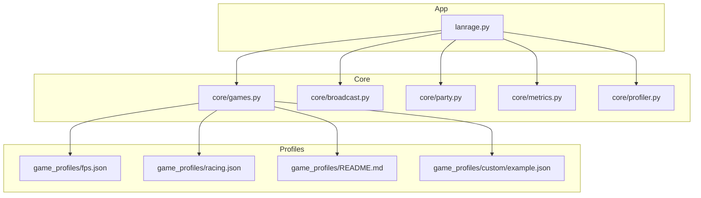
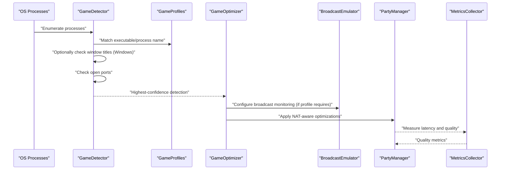
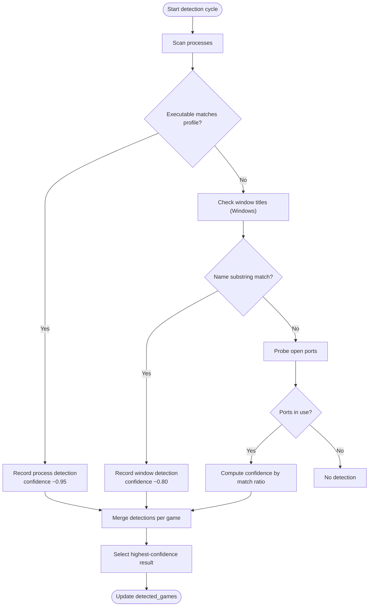
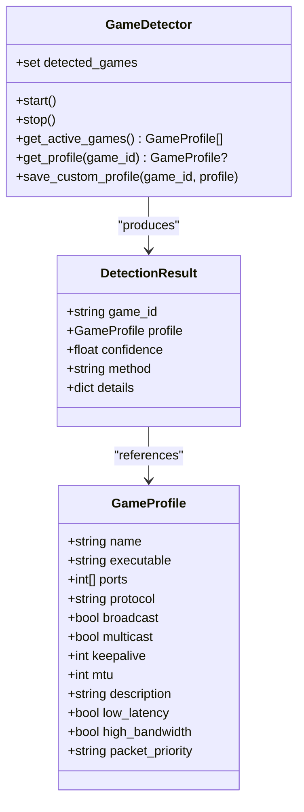
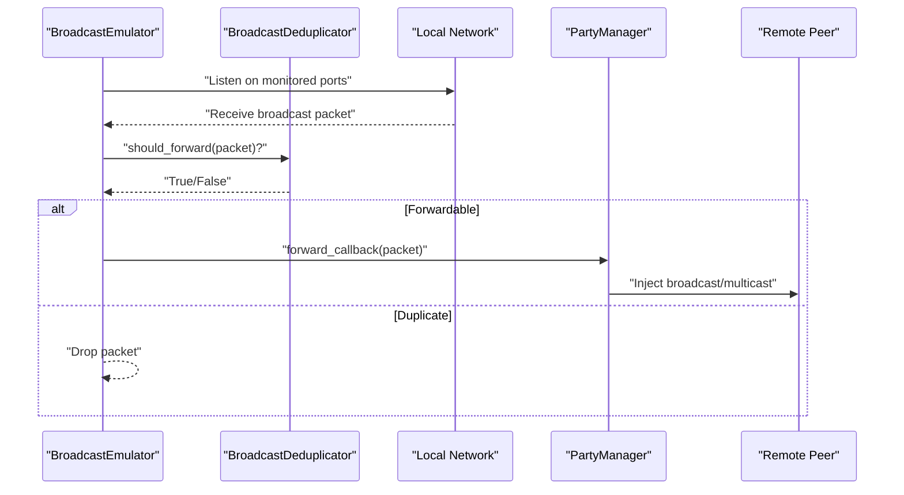
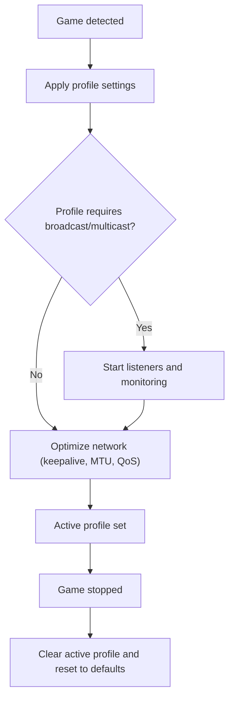
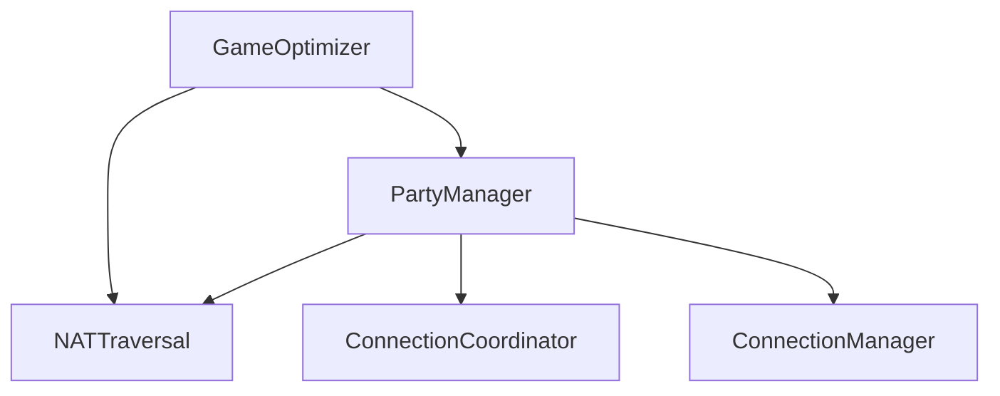
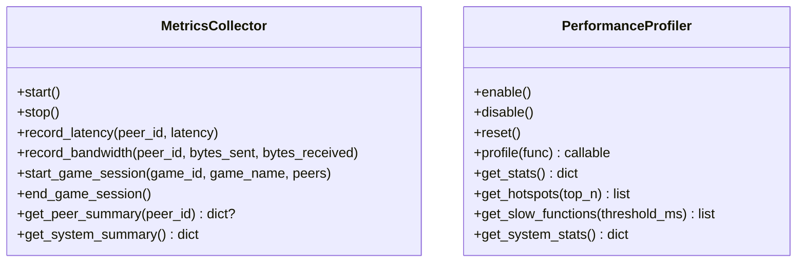
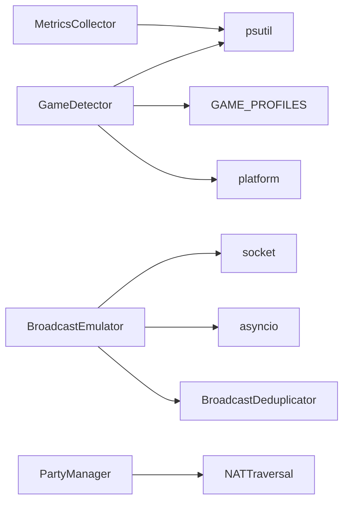

# Game Detection & Profiles

<cite>
**Referenced Files in This Document**
- [games.py](file://core/games.py)
- [broadcast.py](file://core/broadcast.py)
- [party.py](file://core/party.py)
- [metrics.py](file://core/metrics.py)
- [profiler.py](file://core/profiler.py)
- [lanrage.py](file://lanrage.py)
- [fps.json](file://game_profiles/fps.json)
- [racing.json](file://game_profiles/racing.json)
- [README.md](file://game_profiles/README.md)
- [example.json](file://game_profiles/custom/example.json)
- [test_games.py](file://tests/test_games.py)
- [test_game_detection_advanced.py](file://tests/test_game_detection_advanced.py)
</cite>

## Table of Contents
1. [Introduction](#introduction)
2. [Project Structure](#project-structure)
3. [Core Components](#core-components)
4. [Architecture Overview](#architecture-overview)
5. [Detailed Component Analysis](#detailed-component-analysis)
6. [Dependency Analysis](#dependency-analysis)
7. [Performance Considerations](#performance-considerations)
8. [Troubleshooting Guide](#troubleshooting-guide)
9. [Conclusion](#conclusion)
10. [Appendices](#appendices)

## Introduction
This document explains LANrage’s game detection and optimization system with a focus on automatic game profiling, broadcast emulation, and custom game configurations. It covers how the system detects running games using multiple heuristics, applies game-specific optimizations, and integrates with the party system and metrics collection. It also documents the game profile JSON schema, validation, and extension mechanisms, along with troubleshooting guidance for detection issues.

## Project Structure
The game detection and optimization system spans several core modules:
- Game detection and profiles: core/games.py
- Broadcast emulation: core/broadcast.py
- Party and NAT integration: core/party.py
- Metrics and performance monitoring: core/metrics.py and core/profiler.py
- Game profiles (JSON): game_profiles/*.json and game_profiles/custom/*.json
- Tests validating detection and profiles: tests/test_games.py and tests/test_game_detection_advanced.py
- Application entry point: lanrage.py

**Diagram sources**
- [games.py](file://core/games.py#L1-L1349)
- [broadcast.py](file://core/broadcast.py#L1-L646)
- [party.py](file://core/party.py#L1-L304)
- [metrics.py](file://core/metrics.py#L1-L705)
- [profiler.py](file://core/profiler.py#L1-L265)
- [fps.json](file://game_profiles/fps.json#L1-L143)
- [racing.json](file://game_profiles/racing.json#L1-L73)
- [README.md](file://game_profiles/README.md#L1-L174)
- [example.json](file://game_profiles/custom/example.json#L1-L18)
- [lanrage.py](file://lanrage.py#L1-L230)

**Section sources**
- [lanrage.py](file://lanrage.py#L1-L230)
- [games.py](file://core/games.py#L1-L1349)
- [broadcast.py](file://core/broadcast.py#L1-L646)
- [party.py](file://core/party.py#L1-L304)
- [metrics.py](file://core/metrics.py#L1-L705)
- [profiler.py](file://core/profiler.py#L1-L265)
- [README.md](file://game_profiles/README.md#L1-L174)

## Core Components
- GameDetector: Scans for running games using process names, window titles (Windows), and open ports; selects the highest-confidence detection per game.
- GameProfile: Defines per-game optimization parameters (ports, protocol, broadcast/multicast, keepalive, MTU, QoS).
- GameOptimizer: Applies profile-driven network optimizations and manages broadcast port monitoring.
- BroadcastEmulator/MulticastEmulator: Captures and forwards LAN broadcast/multicast packets to party members with deduplication.
- PartyManager: Integrates NAT-aware peer connections and game-specific optimizations.
- MetricsCollector: Tracks system and peer performance metrics for quality assessment.
- PerformanceProfiler: Decorators and context managers for runtime performance profiling.

**Section sources**
- [games.py](file://core/games.py#L265-L696)
- [broadcast.py](file://core/broadcast.py#L201-L646)
- [party.py](file://core/party.py#L102-L304)
- [metrics.py](file://core/metrics.py#L193-L705)
- [profiler.py](file://core/profiler.py#L21-L265)

## Architecture Overview
The system orchestrates detection, optimization, and monitoring around the party and network layers. Game detection triggers profile-based optimizations and broadcast emulation when required. Metrics and profiling help assess and improve performance.

**Diagram sources**
- [games.py](file://core/games.py#L364-L448)
- [games.py](file://core/games.py#L583-L632)
- [broadcast.py](file://core/broadcast.py#L201-L287)
- [party.py](file://core/party.py#L102-L304)
- [metrics.py](file://core/metrics.py#L193-L441)

## Detailed Component Analysis

### Game Detection Algorithms
- Process-based detection: Matches running process names against profile executables with fuzzy matching (case-insensitive, extension removal, Levenshtein distance).
- Window title detection (Windows): Enumerates visible window titles and checks for substring matches against profile names.
- Port-based detection: Probes localhost for open UDP/TCP ports used by the game; confidence derived from match ratio.
- Detection ranking: Process detection is prioritized (highest confidence), followed by window title, then port-based detection.

**Diagram sources**
- [games.py](file://core/games.py#L364-L448)
- [games.py](file://core/games.py#L450-L581)
- [games.py](file://core/games.py#L169-L228)

**Section sources**
- [games.py](file://core/games.py#L364-L448)
- [games.py](file://core/games.py#L450-L581)
- [games.py](file://core/games.py#L169-L228)
- [test_game_detection_advanced.py](file://tests/test_game_detection_advanced.py#L119-L177)

### Game Profile System
- Profiles are stored as JSON files grouped by genre and in a custom directory for user-defined profiles.
- Each profile defines:
  - name, executable, ports, protocol
  - broadcast, multicast flags
  - keepalive, mtu
  - description
  - low_latency, high_bandwidth, packet_priority
- Profiles are loaded asynchronously at startup and cached with TTL.

**Diagram sources**
- [games.py](file://core/games.py#L53-L92)
- [games.py](file://core/games.py#L265-L356)
- [games.py](file://core/games.py#L634-L649)

**Section sources**
- [games.py](file://core/games.py#L94-L162)
- [games.py](file://core/games.py#L257-L263)
- [README.md](file://game_profiles/README.md#L29-L92)
- [test_games.py](file://tests/test_games.py#L98-L126)

### Broadcast Emulation
- BroadcastEmulator listens on common game ports and forwards discovered broadcast packets to peers with deduplication.
- MulticastEmulator handles mDNS and SSDP groups.
- BroadcastDeduplicator prevents duplicate forwarding using time-windowed packet hashing.

**Diagram sources**
- [broadcast.py](file://core/broadcast.py#L201-L381)
- [broadcast.py](file://core/broadcast.py#L29-L199)
- [broadcast.py](file://core/broadcast.py#L427-L550)

**Section sources**
- [broadcast.py](file://core/broadcast.py#L201-L381)
- [broadcast.py](file://core/broadcast.py#L29-L199)
- [broadcast.py](file://core/broadcast.py#L427-L550)

### Automatic Configuration Application
- On game detection, the system logs the detected game and its profile, then delegates to the optimizer to apply network settings (keepalive, MTU, QoS).
- For games flagged with broadcast/multicast, the broadcast emulator is configured to monitor and forward relevant packets.
- When a game stops, the optimizer clears the active profile and resets to defaults.

**Diagram sources**
- [games.py](file://core/games.py#L583-L632)
- [games.py](file://core/games.py#L696-L776)
- [broadcast.py](file://core/broadcast.py#L240-L287)

**Section sources**
- [games.py](file://core/games.py#L583-L632)
- [games.py](file://core/games.py#L696-L776)

### Party Integration and NAT-Aware Optimizations
- PartyManager coordinates NAT traversal and peer connections, enabling direct P2P when compatible.
- GameOptimizer uses NAT type to adapt keepalive intervals and other parameters.

**Diagram sources**
- [party.py](file://core/party.py#L102-L158)
- [games.py](file://core/games.py#L696-L713)

**Section sources**
- [party.py](file://core/party.py#L102-L158)
- [games.py](file://core/games.py#L696-L713)

### Metrics Collection and Performance Monitoring
- MetricsCollector tracks system and peer metrics, computes quality scores, and aggregates historical data.
- PerformanceProfiler decorates functions to capture timing and error statistics.

**Diagram sources**
- [metrics.py](file://core/metrics.py#L193-L705)
- [profiler.py](file://core/profiler.py#L21-L265)

**Section sources**
- [metrics.py](file://core/metrics.py#L193-L705)
- [profiler.py](file://core/profiler.py#L21-L265)

## Dependency Analysis
- GameDetector depends on:
  - psutil for process enumeration
  - platform for Windows-only features
  - GAME_PROFILES loaded from JSON files
- BroadcastEmulator depends on:
  - socket and asyncio for UDP listeners
  - BroadcastDeduplicator for duplicate prevention
- PartyManager integrates NAT traversal and connection management.
- MetricsCollector relies on psutil for system metrics.

**Diagram sources**
- [games.py](file://core/games.py#L3-L17)
- [broadcast.py](file://core/broadcast.py#L1-L16)
- [party.py](file://core/party.py#L1-L16)
- [metrics.py](file://core/metrics.py#L1-L13)

**Section sources**
- [games.py](file://core/games.py#L3-L17)
- [broadcast.py](file://core/broadcast.py#L1-L16)
- [party.py](file://core/party.py#L1-L16)
- [metrics.py](file://core/metrics.py#L1-L13)

## Performance Considerations
- Detection loop runs every 5 seconds; detection methods are lightweight but process enumeration can be costly on systems with many processes.
- Port probing uses non-blocking sockets with timeouts; consider limiting the number of monitored ports for performance.
- Broadcast deduplication uses a time-windowed hash set; tune window and cleanup intervals for high-throughput environments.
- Metrics collection samples every 10 seconds; adjust intervals to balance overhead and insight.

[No sources needed since this section provides general guidance]

## Troubleshooting Guide
Common detection issues and resolutions:
- Process name mismatch:
  - Use fuzzy matching rules: case-insensitive, extension removal, and Levenshtein distance.
  - Ensure the profile executable matches the actual running process name.
- Window title detection not triggering:
  - Only available on Windows; ensure pywin32 is installed and visible windows are present.
- Port-based detection unreliable:
  - Verify the game actually binds to the specified ports locally.
  - Confirm protocol (UDP/TCP) matches the game’s behavior.
- Broadcast/multicast not working:
  - Confirm the game uses broadcast/multicast discovery and the ports are open.
  - Check firewall and permissions for broadcast injection.
- Custom profile not applied:
  - Validate JSON syntax and required fields.
  - Ensure the file is placed under the custom directory and restart LANrage.

**Section sources**
- [games.py](file://core/games.py#L450-L581)
- [games.py](file://core/games.py#L292-L356)
- [README.md](file://game_profiles/README.md#L67-L92)
- [broadcast.py](file://core/broadcast.py#L240-L287)

## Conclusion
LANrage’s game detection and optimization system combines robust multi-method detection, flexible game profiles, and broadcast emulation to deliver seamless LAN-like experiences over the internet. The system integrates with the party and metrics layers to provide NAT-aware connectivity and performance insights. Extensibility is achieved through JSON-based profiles and custom directories, enabling rapid addition of new games and fine-tuned optimization strategies.

[No sources needed since this section summarizes without analyzing specific files]

## Appendices

### Game Profile JSON Schema and Validation
- Required fields:
  - name, executable, ports, protocol
- Optional fields:
  - broadcast, multicast, keepalive, mtu, description, low_latency, high_bandwidth, packet_priority
- Validation tips:
  - Ensure ports are integers and protocol is one of udp/tcp/both.
  - Keepalive should be reasonable for the game type.
  - MTU defaults to 1420 unless the game requires a different value.

**Section sources**
- [README.md](file://game_profiles/README.md#L29-L92)
- [fps.json](file://game_profiles/fps.json#L1-L143)
- [racing.json](file://game_profiles/racing.json#L1-L73)
- [example.json](file://game_profiles/custom/example.json#L1-L18)

### Extensibility Mechanisms
- Add new genres by creating a new JSON file in the game_profiles directory following the schema.
- Add custom profiles in game_profiles/custom/ for personal or private use.
- Use the save_custom_profile API to persist user-defined profiles at runtime.

**Section sources**
- [README.md](file://game_profiles/README.md#L67-L92)
- [games.py](file://core/games.py#L651-L694)

### Implementation Details: Detection Heuristics and Matching
- Fuzzy executable matching:
  - Exact match first, then extension normalization, then Levenshtein similarity with threshold tuning.
- Confidence scoring:
  - Process detection ~0.95, window title ~0.80, port-based derived from match ratio.
- Detection ranking:
  - Highest confidence per game determines the active detection.

**Section sources**
- [games.py](file://core/games.py#L169-L228)
- [games.py](file://core/games.py#L370-L448)
- [test_game_detection_advanced.py](file://tests/test_game_detection_advanced.py#L233-L265)

### Implementation Details: Configuration Application
- Keepalive adaptation based on NAT type and profile overrides.
- Broadcast port monitoring and whitelisting for custom ports.
- Reset to defaults when a game ends.

**Section sources**
- [games.py](file://core/games.py#L20-L51)
- [games.py](file://core/games.py#L710-L776)
- [games.py](file://core/games.py#L623-L632)