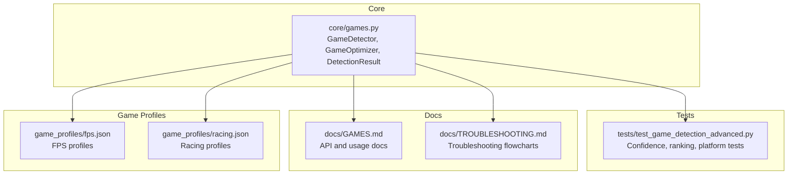
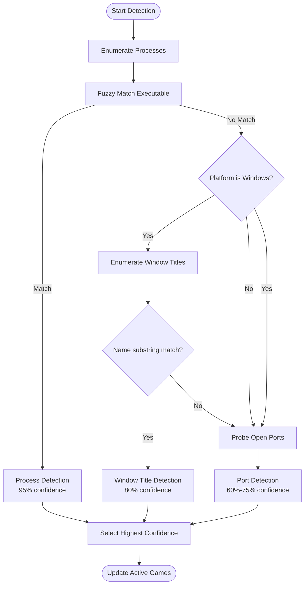
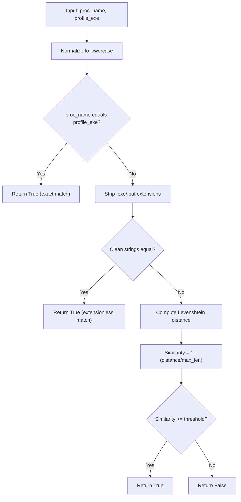
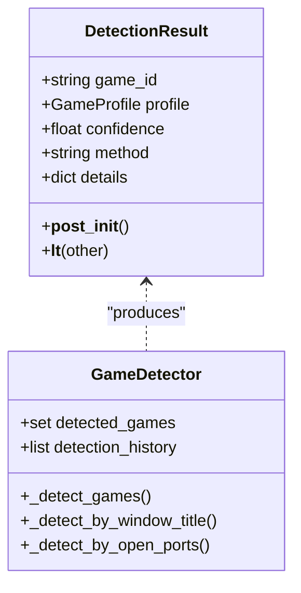
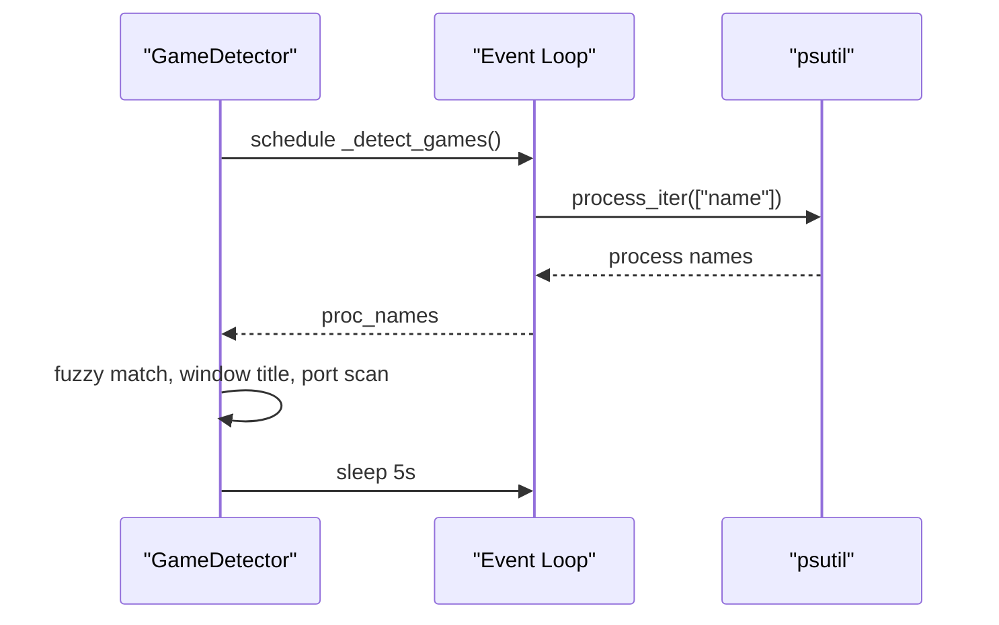
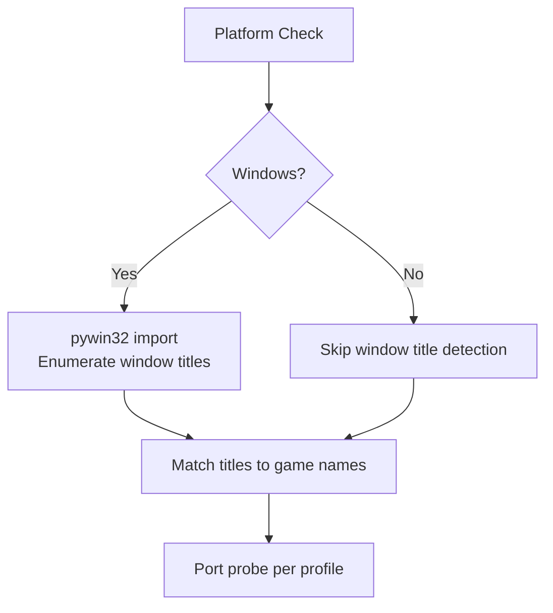
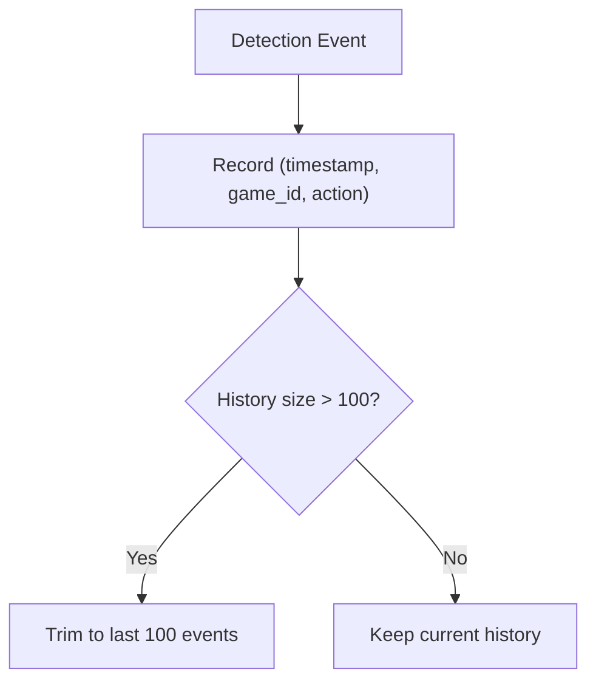
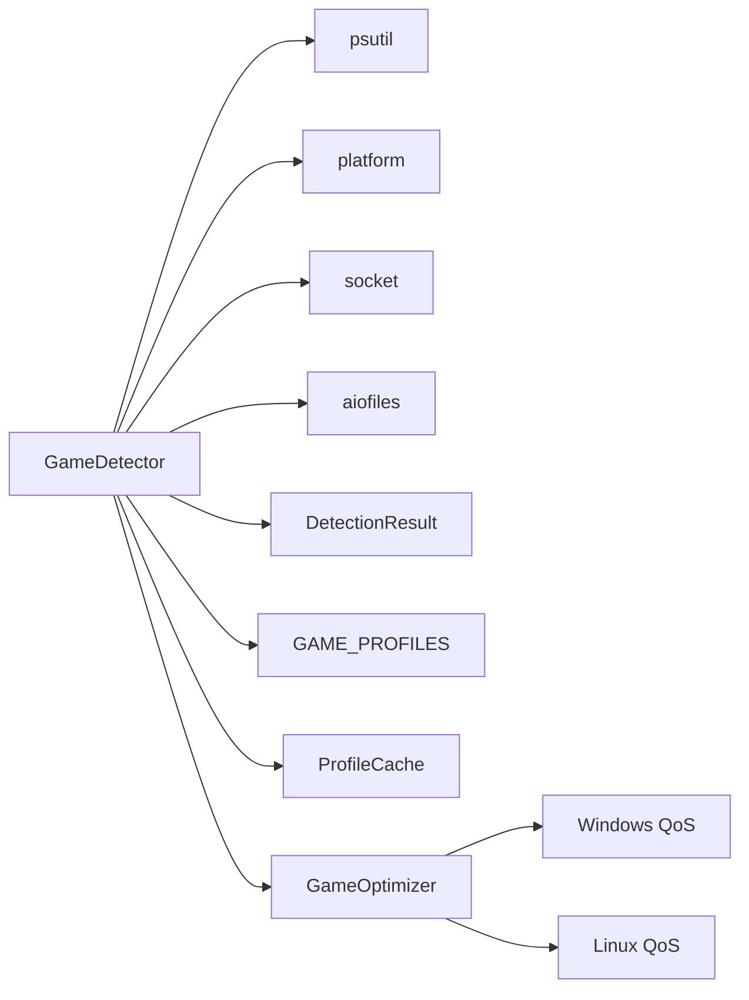
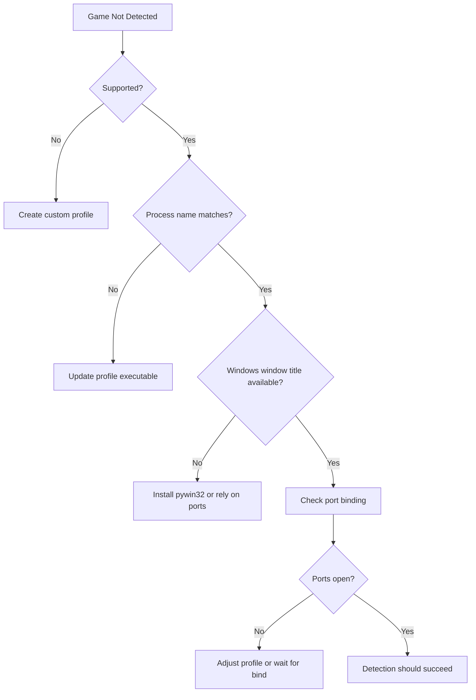

# Game Detection Algorithms

<cite>
**Referenced Files in This Document**
- [core/games.py](file://core/games.py)
- [tests/test_game_detection_advanced.py](file://tests/test_game_detection_advanced.py)
- [docs/GAMES.md](file://docs/GAMES.md)
- [docs/TROUBLESHOOTING.md](file://docs/TROUBLESHOOTING.md)
- [game_profiles/fps.json](file://game_profiles/fps.json)
- [game_profiles/racing.json](file://game_profiles/racing.json)
</cite>

## Table of Contents
1. [Introduction](#introduction)
2. [Project Structure](#project-structure)
3. [Core Components](#core-components)
4. [Architecture Overview](#architecture-overview)
5. [Detailed Component Analysis](#detailed-component-analysis)
6. [Dependency Analysis](#dependency-analysis)
7. [Performance Considerations](#performance-considerations)
8. [Troubleshooting Guide](#troubleshooting-guide)
9. [Conclusion](#conclusion)

## Introduction
This document explains the three-tier game detection system that identifies running games and applies game-specific optimizations. It covers:
- Process name matching with fuzzy logic
- Window title detection for Windows platforms
- Port-based detection
- Confidence scoring and ranking
- Async detection loop architecture
- Platform-specific implementations
- Detection history tracking and error handling
- Practical examples, performance considerations, and troubleshooting

## Project Structure
The game detection system is implemented in a single module with supporting tests and documentation. Game profiles are defined in JSON files grouped by genre.



**Diagram sources**
- [core/games.py](file://core/games.py#L265-L650)
- [tests/test_game_detection_advanced.py](file://tests/test_game_detection_advanced.py#L1-L373)
- [docs/GAMES.md](file://docs/GAMES.md#L1-L631)
- [docs/TROUBLESHOOTING.md](file://docs/TROUBLESHOOTING.md#L1-L904)
- [game_profiles/fps.json](file://game_profiles/fps.json#L1-L143)
- [game_profiles/racing.json](file://game_profiles/racing.json#L1-L73)

**Section sources**
- [core/games.py](file://core/games.py#L1-L1349)
- [tests/test_game_detection_advanced.py](file://tests/test_game_detection_advanced.py#L1-L373)
- [docs/GAMES.md](file://docs/GAMES.md#L1-L631)
- [docs/TROUBLESHOOTING.md](file://docs/TROUBLESHOOTING.md#L1-L904)
- [game_profiles/fps.json](file://game_profiles/fps.json#L1-L143)
- [game_profiles/racing.json](file://game_profiles/racing.json#L1-L73)

## Core Components
- GameProfile: Defines a game’s executable name, ports, protocol, and optimization hints.
- DetectionResult: Encapsulates a detection outcome with confidence and method.
- GameDetector: Orchestrates the async detection loop and applies detection methods.
- GameOptimizer: Applies game-specific optimizations (keepalive, broadcast, QoS, MTU).
- ProfileCache: Caches game profiles with TTL to reduce I/O overhead.

Key behaviors:
- Detection ranking by confidence: process > window title > ports
- Confidence scores: process 95%, window title 80%, ports 60%–75%
- Detection history tracking with timestamps
- Error handling: silent ignores for optional features (window title, port checks)

**Section sources**
- [core/games.py](file://core/games.py#L53-L92)
- [core/games.py](file://core/games.py#L265-L650)
- [core/games.py](file://core/games.py#L94-L162)
- [core/games.py](file://core/games.py#L230-L256)

## Architecture Overview
The detection pipeline runs continuously in an async loop. It enumerates processes, attempts fuzzy matching against profiles, optionally checks window titles on Windows, and scans for open ports. Results are ranked by confidence and used to trigger optimizations.

```mermaid
sequenceDiagram
participant Loop as "Detection Loop"
participant Proc as "Process Enumerator"
participant Fuzzy as "Fuzzy Matcher"
participant Win as "Window Title Detector"
participant Port as "Port Detector"
participant Rank as "Ranking"
participant GM as "GameManager"
participant Opt as "GameOptimizer"
Loop->>Proc : Enumerate running processes
Proc-->>Loop : Process names
Loop->>Fuzzy : Match process names vs profiles
Fuzzy-->>Loop : Process detections (95% confidence)
Loop->>Win : Enumerate window titles (Windows only)
Win-->>Loop : Window detections (80% confidence)
Loop->>Port : Probe open ports per profile
Port-->>Loop : Port detections (60%-75% confidence)
Loop->>Rank : Select highest confidence per game
Rank-->>GM : Notify game started/stopped
GM->>Opt : Apply or clear game-specific optimizations
```

**Diagram sources**
- [core/games.py](file://core/games.py#L364-L448)
- [core/games.py](file://core/games.py#L412-L510)
- [core/games.py](file://core/games.py#L511-L581)
- [core/games.py](file://core/games.py#L1290-L1349)

## Detailed Component Analysis

### Three-Tier Detection System
- Process name matching (highest priority)
  - Uses fuzzy matching with Levenshtein distance and case-insensitive cleaning.
  - Confidence: 95% when matched.
- Window title detection (Windows only)
  - Enumerates visible window titles and checks substring matches against game names.
  - Confidence: 80%.
- Port-based detection
  - Probes UDP/TCP availability on localhost for each profile’s ports.
  - Confidence derived from match ratio: 60% + (matched_ports/total_ports)*20%, capped at 75%.



**Diagram sources**
- [core/games.py](file://core/games.py#L396-L426)
- [core/games.py](file://core/games.py#L412-L510)
- [core/games.py](file://core/games.py#L511-L581)

**Section sources**
- [core/games.py](file://core/games.py#L396-L426)
- [core/games.py](file://core/games.py#L412-L510)
- [core/games.py](file://core/games.py#L511-L581)

### Levenshtein Distance Algorithm for Fuzzy Matching
The fuzzy matcher:
- Performs exact and extensionless comparisons first for speed.
- Falls back to Levenshtein distance to compute similarity.
- Uses a configurable threshold (default 0.85) to decide a match.



**Diagram sources**
- [core/games.py](file://core/games.py#L169-L227)

**Section sources**
- [core/games.py](file://core/games.py#L169-L227)

### Confidence Scoring and Ranking
- Process detection: 95% confidence.
- Window title detection: 80% confidence.
- Port detection: 60% + (matched_ports/total_ports)*20%, capped at 75%.
- Ranking: Highest confidence per game determines the chosen detection.



**Diagram sources**
- [core/games.py](file://core/games.py#L74-L92)
- [core/games.py](file://core/games.py#L371-L448)

**Section sources**
- [core/games.py](file://core/games.py#L74-L92)
- [core/games.py](file://core/games.py#L371-L448)
- [tests/test_game_detection_advanced.py](file://tests/test_game_detection_advanced.py#L236-L264)

### Async Detection Loop and Process Enumeration
- Loop: Runs every 5 seconds while running.
- Process enumeration: Uses psutil to iterate processes and collect names.
- Execution model: Offloads blocking I/O to a thread pool via run_in_executor.



**Diagram sources**
- [core/games.py](file://core/games.py#L364-L394)

**Section sources**
- [core/games.py](file://core/games.py#L364-L394)

### Platform-Specific Implementations
- Windows window title detection:
  - Requires pywin32; silently skipped if unavailable.
  - Enumerates visible windows and checks titles.
- Port detection:
  - Attempts UDP bind and TCP connect to localhost on each profile port.
  - Handles timeouts and exceptions gracefully.
- QoS and MTU adjustments:
  - Platform-specific implementations for Linux and Windows.



**Diagram sources**
- [core/games.py](file://core/games.py#L458-L509)
- [core/games.py](file://core/games.py#L522-L581)

**Section sources**
- [core/games.py](file://core/games.py#L458-L509)
- [core/games.py](file://core/games.py#L522-L581)

### Detection History Tracking and Threshold Calculations
- Detection history: Stores (timestamp, game_id, action) tuples.
- Threshold behavior:
  - Process detection: 95% confidence threshold for acceptance.
  - Window title detection: 80% confidence threshold.
  - Port detection: 60%–75% confidence based on match ratio.
- Ranking: Highest confidence per game wins.



**Diagram sources**
- [core/games.py](file://core/games.py#L583-L621)

**Section sources**
- [core/games.py](file://core/games.py#L583-L621)
- [tests/test_game_detection_advanced.py](file://tests/test_game_detection_advanced.py#L266-L296)

### Error Handling Strategies
- Process enumeration: Ignores NoSuchProcess and AccessDenied.
- Window title detection: Silently skips if pywin32 is missing or on non-Windows.
- Port detection: Silently ignores errors during probing.
- DetectionResult: Clamps confidence to [0.0, 1.0].

**Section sources**
- [core/games.py](file://core/games.py#L387-L391)
- [core/games.py](file://core/games.py#L502-L507)
- [core/games.py](file://core/games.py#L577-L579)
- [core/games.py](file://core/games.py#L83-L87)

### Concrete Detection Scenarios
- Scenario 1: Exact process match
  - A running process name exactly matches a profile executable.
  - Outcome: Process detection at 95% confidence.
- Scenario 2: Fuzzy process match
  - A process name differs only by case or extensions.
  - Outcome: Fuzzy match triggers detection at 95% confidence.
- Scenario 3: Window title match (Windows)
  - Visible window title contains the game name.
  - Outcome: Window title detection at 80% confidence.
- Scenario 4: Port match
  - At least one profile port is open on localhost.
  - Outcome: Port detection with confidence derived from match ratio.

**Section sources**
- [tests/test_game_detection_advanced.py](file://tests/test_game_detection_advanced.py#L122-L153)
- [tests/test_game_detection_advanced.py](file://tests/test_game_detection_advanced.py#L209-L231)
- [tests/test_game_detection_advanced.py](file://tests/test_game_detection_advanced.py#L182-L206)

## Dependency Analysis
The detection system depends on:
- psutil for process enumeration
- platform for OS checks
- socket for port probing
- win32gui/pywin32 for window title enumeration (Windows)
- aiofiles for async JSON I/O
- asyncio for async scheduling



**Diagram sources**
- [core/games.py](file://core/games.py#L1-L17)
- [core/games.py](file://core/games.py#L230-L256)
- [core/games.py](file://core/games.py#L696-L870)

**Section sources**
- [core/games.py](file://core/games.py#L1-L17)
- [core/games.py](file://core/games.py#L230-L256)
- [core/games.py](file://core/games.py#L696-L870)

## Performance Considerations
- Process enumeration cost:
  - Iterating all processes is O(N) where N is the number of running processes.
  - Offloading to a thread pool prevents blocking the event loop.
- Fuzzy matching cost:
  - Levenshtein distance is O(m*n) per pair; minimized by early exact/extensionless matches.
- Window title enumeration:
  - On Windows, enumerating all windows is lightweight but still adds overhead.
- Port probing:
  - UDP bind and TCP connect calls are fast but repeated per profile per cycle.
- Caching:
  - ProfileCache reduces I/O by caching profiles with a TTL.

Recommendations:
- Keep detection interval reasonable (currently 5s).
- Prefer exact or extensionless matches to avoid expensive Levenshtein computation.
- Limit the number of profiles if profiling reveals heavy port scanning.

**Section sources**
- [core/games.py](file://core/games.py#L364-L394)
- [core/games.py](file://core/games.py#L169-L227)
- [core/games.py](file://core/games.py#L230-L256)

## Troubleshooting Guide
Common detection failures and resolutions:
- Game not detected
  - Verify the game is supported or create a custom profile.
  - Ensure the process name matches the profile executable (case-insensitive and extensionless).
  - On Windows, confirm pywin32 is installed for window title detection.
- Incorrect or missing detections
  - Confirm detection ranking: process > window title > ports.
  - Adjust profile executable names or add multiple process variants.
- Port detection unreliable
  - Some games may not bind ports until launch or may use dynamic ports.
  - Consider enabling broadcast/multicast discovery in the profile if applicable.
- Performance impact
  - Reduce detection frequency or limit profiles.
  - Use exact executable names to avoid fuzzy matching overhead.



**Diagram sources**
- [docs/TROUBLESHOOTING.md](file://docs/TROUBLESHOOTING.md#L52-L85)

**Section sources**
- [docs/TROUBLESHOOTING.md](file://docs/TROUBLESHOOTING.md#L52-L85)
- [docs/GAMES.md](file://docs/GAMES.md#L58-L96)

## Conclusion
The three-tier detection system combines robust process name matching, optional window title detection, and port probing to reliably identify running games. Confidence scoring and ranking ensure the most reliable detection method prevails. The async loop, process enumeration via psutil, and platform-specific implementations deliver practical performance while maintaining simplicity and extensibility. Use the troubleshooting guide to diagnose and resolve common detection issues, and leverage custom profiles for unsupported games.