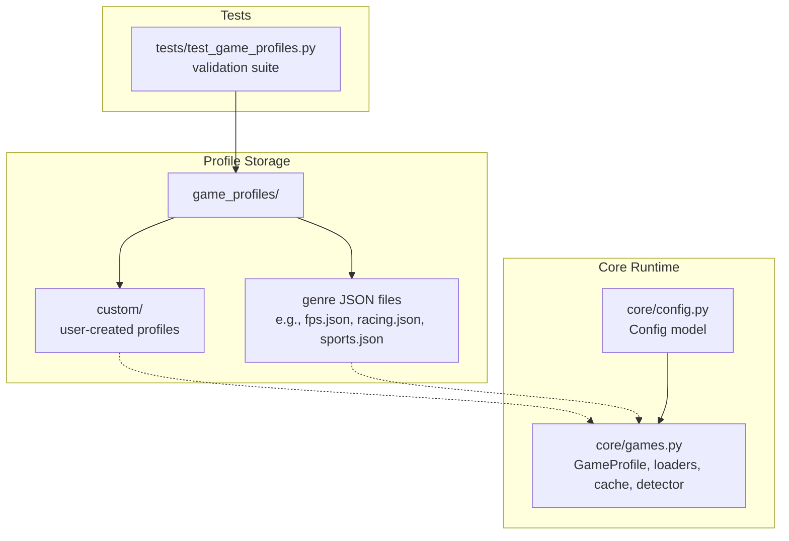
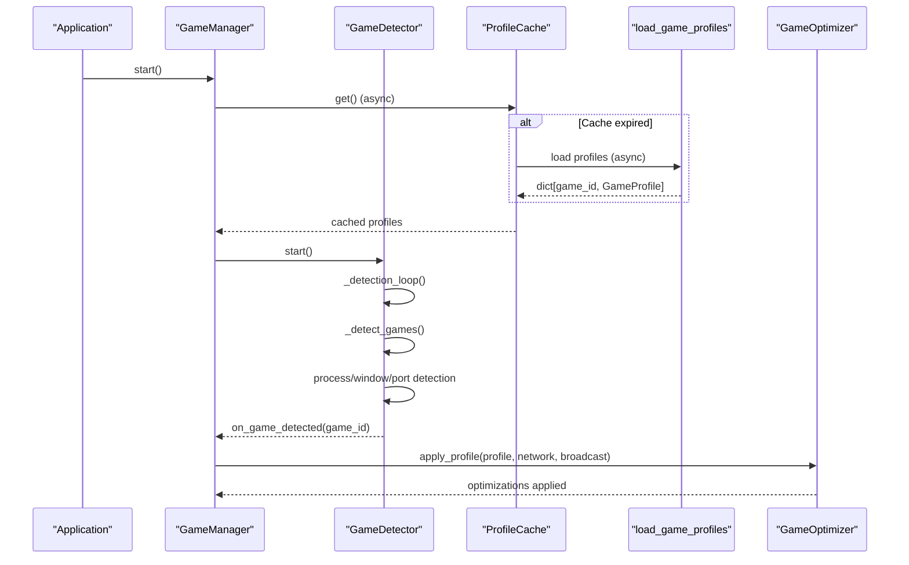
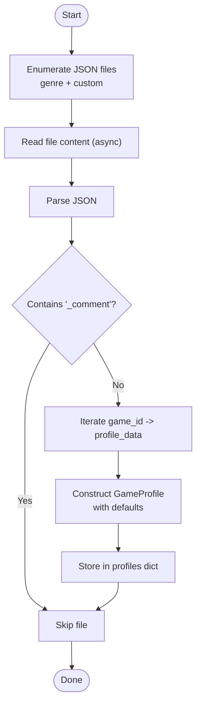
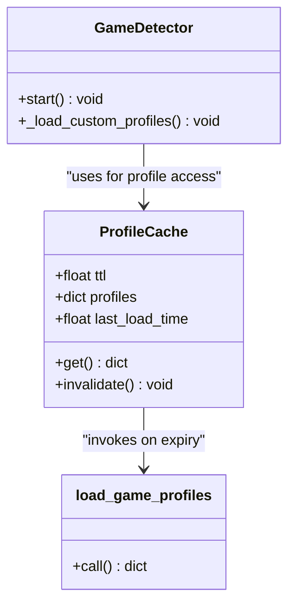
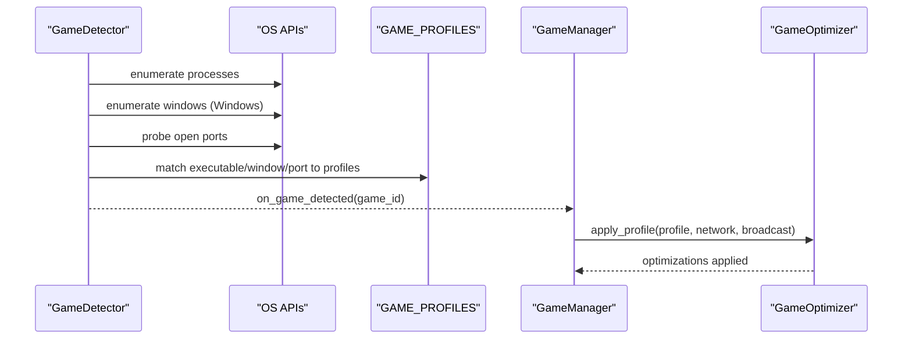
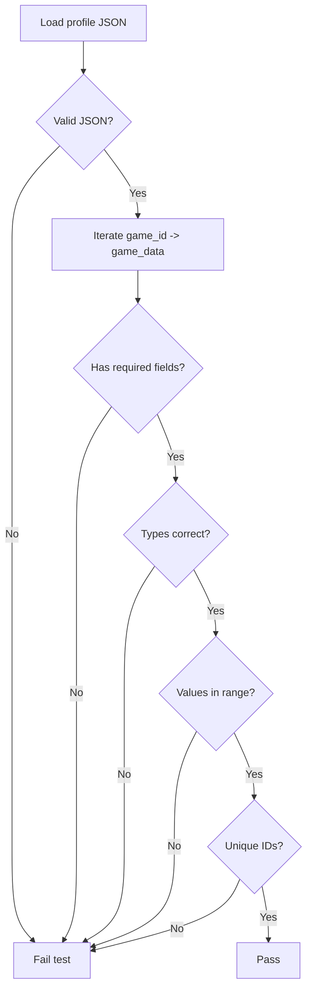
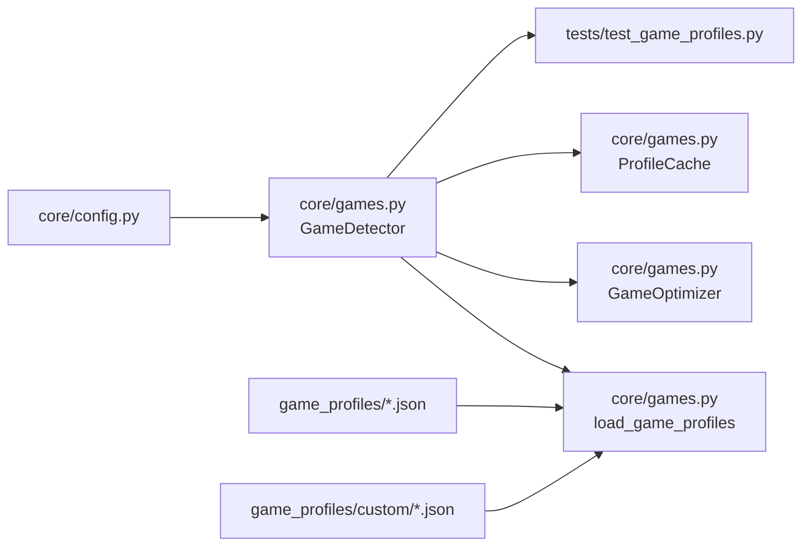

# Game Profile System

<cite>
**Referenced Files in This Document**
- [README.md](file://game_profiles/README.md)
- [example.json](file://game_profiles/custom/example.json)
- [fps.json](file://game_profiles/fps.json)
- [racing.json](file://game_profiles/racing.json)
- [sports.json](file://game_profiles/sports.json)
- [games.py](file://core/games.py)
- [config.py](file://core/config.py)
- [lanrage.py](file://lanrage.py)
- [test_game_profiles.py](file://tests/test_game_profiles.py)
</cite>

## Table of Contents
1. [Introduction](#introduction)
2. [Project Structure](#project-structure)
3. [Core Components](#core-components)
4. [Architecture Overview](#architecture-overview)
5. [Detailed Component Analysis](#detailed-component-analysis)
6. [Dependency Analysis](#dependency-analysis)
7. [Performance Considerations](#performance-considerations)
8. [Troubleshooting Guide](#troubleshooting-guide)
9. [Conclusion](#conclusion)

## Introduction
This document describes the Game Profile System used by the application to detect running games and apply network optimizations tailored to each title. It covers the GameProfile data structure, profile loading mechanisms from JSON files organized by genre, custom profile creation and persistence, the ProfileCache mechanism with TTL expiration, the game_profiles directory structure, validation schema, and integration with the detection system. It also includes examples of profile JSON structure, custom profile creation guidelines, and troubleshooting tips.

## Project Structure
The Game Profile System spans several directories and files:
- game_profiles: Contains genre-based JSON profile files and a custom directory for user-defined profiles.
- core/games.py: Implements GameProfile dataclass, profile loading, caching, detection, and optimization integration.
- core/config.py: Provides configuration access used by the detection system for locating custom profile storage.
- tests/test_game_profiles.py: Validates profile JSON correctness, required fields, types, values, and uniqueness.
- README.md: Documents the directory layout, field meanings, and custom profile creation steps.

**Diagram sources**
- [games.py](file://core/games.py#L94-L162)
- [README.md](file://game_profiles/README.md#L1-L174)
- [test_game_profiles.py](file://tests/test_game_profiles.py#L14-L23)

**Section sources**
- [README.md](file://game_profiles/README.md#L1-L174)
- [games.py](file://core/games.py#L94-L162)
- [config.py](file://core/config.py#L17-L48)

## Core Components
- GameProfile: Defines the schema for a single game’s optimization profile.
- ProfileCache: Asynchronous cache for loaded profiles with TTL expiration.
- load_game_profiles: Loads profiles from genre JSON files and custom JSON.
- GameDetector: Detects running games using multiple heuristics and applies optimizations.
- GameOptimizer: Applies network optimizations based on the active GameProfile.
- GameManager: Orchestrates detection and optimization lifecycle.

Key responsibilities:
- GameProfile encapsulates fields such as name, executable, ports, protocol, broadcast/multicast flags, keepalive, MTU, and optimization hints.
- ProfileCache ensures efficient reuse of loaded profiles with automatic refresh.
- load_game_profiles reads JSON files, validates presence of required fields, and constructs GameProfile instances.
- GameDetector integrates with the detection loop, window title scanning (Windows), and port-based detection.
- GameOptimizer uses profile data to tune network behavior, including adaptive keepalive based on NAT type.

**Section sources**
- [games.py](file://core/games.py#L53-L71)
- [games.py](file://core/games.py#L230-L254)
- [games.py](file://core/games.py#L94-L162)
- [games.py](file://core/games.py#L265-L650)
- [games.py](file://core/games.py#L696-L800)

## Architecture Overview
The system follows an asynchronous, modular architecture:
- Profiles are loaded from disk into memory and optionally cached.
- Detection runs periodically to identify running games and select the best matching profile.
- Optimizations are applied through the GameOptimizer using the selected profile.

**Diagram sources**
- [games.py](file://core/games.py#L239-L254)
- [games.py](file://core/games.py#L94-L162)
- [games.py](file://core/games.py#L281-L290)
- [games.py](file://core/games.py#L364-L448)
- [games.py](file://core/games.py#L1330-L1344)

## Detailed Component Analysis

### GameProfile Data Structure
GameProfile is a dataclass that captures all necessary attributes for a game’s networking profile:
- name: Display name of the game
- executable: Process name pattern (supports wildcards)
- ports: List of ports used by the game
- protocol: "udp", "tcp", or "both"
- broadcast: Whether LAN broadcast discovery is used
- multicast: Whether multicast discovery is used
- keepalive: WireGuard keepalive interval in seconds
- mtu: Optimal MTU size
- description: Human-readable description
- low_latency: Optimization hint for latency-sensitive games
- high_bandwidth: Optimization hint for bandwidth-heavy games
- packet_priority: "low", "medium", or "high" for QoS

These fields are populated from JSON profiles and used by the detection and optimization subsystems.

**Section sources**
- [games.py](file://core/games.py#L53-L71)
- [README.md](file://game_profiles/README.md#L29-L92)

### Profile Loading Mechanisms
- Genre-based profiles: Loaded from game_profiles/*.json and game_profiles/custom/*.json.
- Custom profiles: Loaded from a user-configurable JSON file located under the configuration directory.
- Validation: Required fields and types are enforced by tests; optional fields use sensible defaults.
- Async loading: Uses aiofiles for non-blocking I/O during startup and cache refresh.

**Diagram sources**
- [games.py](file://core/games.py#L94-L162)
- [games.py](file://core/games.py#L292-L356)

**Section sources**
- [games.py](file://core/games.py#L94-L162)
- [games.py](file://core/games.py#L292-L356)

### Configuration Management
- The detection system stores custom profiles in a JSON file under the configuration directory.
- The Config model provides the config_dir path used by GameDetector to locate the custom profiles file.
- The application entry point initializes configuration and starts subsystems.

**Section sources**
- [games.py](file://core/games.py#L275-L276)
- [config.py](file://core/config.py#L45-L47)
- [lanrage.py](file://lanrage.py#L75-L93)

### ProfileCache Mechanism with TTL Expiration
- ProfileCache wraps profile retrieval with an async lock to prevent concurrent reloads.
- TTL controls when profiles are reloaded; on expiry, load_game_profiles is invoked again.
- invalidate forces immediate reload on next access.

**Diagram sources**
- [games.py](file://core/games.py#L230-L254)
- [games.py](file://core/games.py#L94-L162)
- [games.py](file://core/games.py#L281-L290)

**Section sources**
- [games.py](file://core/games.py#L230-L254)

### Game Detection and Integration
- Detection loop checks processes, window titles (Windows), and open ports to identify running games.
- Confidence scoring ranks detection methods; highest confidence wins per game.
- On detection, GameManager triggers GameOptimizer to apply profile-specific optimizations.

**Diagram sources**
- [games.py](file://core/games.py#L364-L448)
- [games.py](file://core/games.py#L1338-L1344)

**Section sources**
- [games.py](file://core/games.py#L364-L448)
- [games.py](file://core/games.py#L1338-L1344)

### Custom Profile Creation and Persistence
- Place a custom profile in game_profiles/custom/<filename>.json.
- Alternatively, create a single-profile JSON and save it to the configured location for custom profiles.
- The system loads custom profiles at startup and merges them into GAME_PROFILES.
- Custom profiles can be saved dynamically via GameDetector.save_custom_profile.

Guidelines:
- Use the same JSON structure as genre profiles.
- Ensure required fields are present and types/values are valid.
- Restart the application to load newly added custom profiles.

**Section sources**
- [README.md](file://game_profiles/README.md#L67-L92)
- [games.py](file://core/games.py#L292-L356)
- [games.py](file://core/games.py#L651-L694)

### Profile Validation Schema
The validation suite enforces:
- All JSON files are valid.
- Each game object contains required fields.
- Field types conform to expectations.
- Field values are within acceptable ranges.
- No duplicate game IDs within or across profiles.
- Minimum total game count is met.

**Diagram sources**
- [test_game_profiles.py](file://tests/test_game_profiles.py#L44-L84)
- [test_game_profiles.py](file://tests/test_game_profiles.py#L87-L137)
- [test_game_profiles.py](file://tests/test_game_profiles.py#L140-L177)
- [test_game_profiles.py](file://tests/test_game_profiles.py#L180-L202)
- [test_game_profiles.py](file://tests/test_game_profiles.py#L204-L217)

**Section sources**
- [test_game_profiles.py](file://tests/test_game_profiles.py#L44-L84)
- [test_game_profiles.py](file://tests/test_game_profiles.py#L87-L137)
- [test_game_profiles.py](file://tests/test_game_profiles.py#L140-L177)
- [test_game_profiles.py](file://tests/test_game_profiles.py#L180-L202)
- [test_game_profiles.py](file://tests/test_game_profiles.py#L204-L217)

### Async Loading Architecture
- load_game_profiles uses async file I/O to avoid blocking the event loop.
- ProfileCache coordinates TTL-based refreshes with async locks.
- GameManager ensures profiles are loaded before starting detection.

**Section sources**
- [games.py](file://core/games.py#L94-L162)
- [games.py](file://core/games.py#L239-L254)
- [games.py](file://core/games.py#L1310-L1314)

## Dependency Analysis
- core/games.py depends on:
  - aiofiles for async JSON parsing
  - pathlib for filesystem paths
  - psutil for process enumeration
  - Config for locating custom profile storage
- game_profiles/* provides the data layer consumed by core/games.py.
- tests/test_game_profiles.py validates the contract between JSON and GameProfile.

**Diagram sources**
- [games.py](file://core/games.py#L13-L15)
- [games.py](file://core/games.py#L94-L162)
- [games.py](file://core/games.py#L265-L650)
- [config.py](file://core/config.py#L17-L48)
- [test_game_profiles.py](file://tests/test_game_profiles.py#L14-L23)

**Section sources**
- [games.py](file://core/games.py#L13-L15)
- [games.py](file://core/games.py#L94-L162)
- [config.py](file://core/config.py#L17-L48)
- [test_game_profiles.py](file://tests/test_game_profiles.py#L14-L23)

## Performance Considerations
- Profile loading is designed to be fast; tests enforce sub-100ms total loading for all profiles.
- Detection runs at a moderate cadence (every few seconds) to balance responsiveness and overhead.
- Cache TTL prevents unnecessary reloads while keeping profiles fresh.
- Asynchronous I/O avoids blocking the main event loop during file operations.

[No sources needed since this section provides general guidance]

## Troubleshooting Guide
Common issues and resolutions:
- Invalid JSON in profile files:
  - Cause: Malformed JSON or extra commas/comments.
  - Resolution: Fix JSON syntax; remove unsupported comments; ensure all required fields are present.
- Missing required fields:
  - Cause: Omitted fields like name, executable, ports, protocol, etc.
  - Resolution: Add missing fields with correct types and values.
- Out-of-range values:
  - Cause: keepalive outside 5–60, MTU outside 1280–1500, or ports outside 1–65535.
  - Resolution: Adjust values to meet constraints.
- Duplicate game IDs:
  - Cause: Same game_id used in multiple files.
  - Resolution: Rename or remove duplicates.
- Custom profile not loading:
  - Cause: Incorrect path or filename, or missing required fields.
  - Resolution: Verify the custom profile file exists in the expected location and conforms to the schema.
- Detection not triggering:
  - Cause: Executable name mismatch or ports not in use.
  - Resolution: Confirm executable pattern, adjust fuzzy matching thresholds, or ensure ports are bound.

**Section sources**
- [test_game_profiles.py](file://tests/test_game_profiles.py#L44-L84)
- [test_game_profiles.py](file://tests/test_game_profiles.py#L140-L177)
- [games.py](file://core/games.py#L148-L152)
- [games.py](file://core/games.py#L348-L355)

## Conclusion
The Game Profile System provides a robust, extensible framework for game detection and optimization. It leverages genre-based profiles, supports custom profiles, and maintains performance through asynchronous loading and caching. The validation suite ensures data integrity, while the detection and optimization pipeline adapts network behavior to each game’s needs.