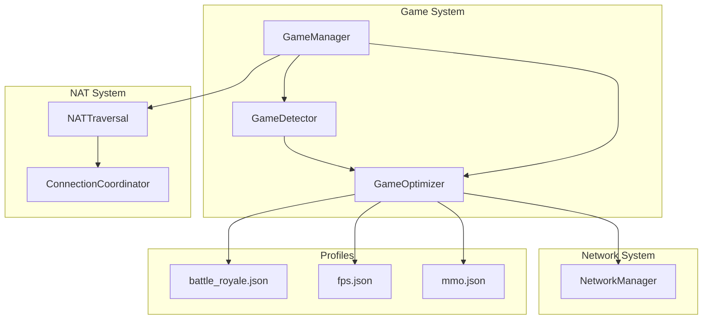
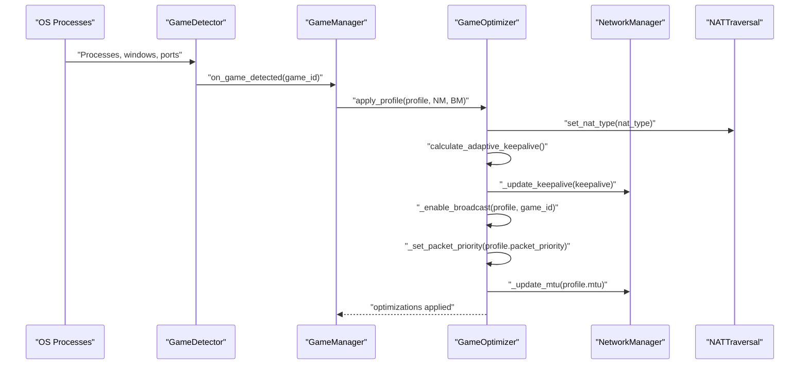
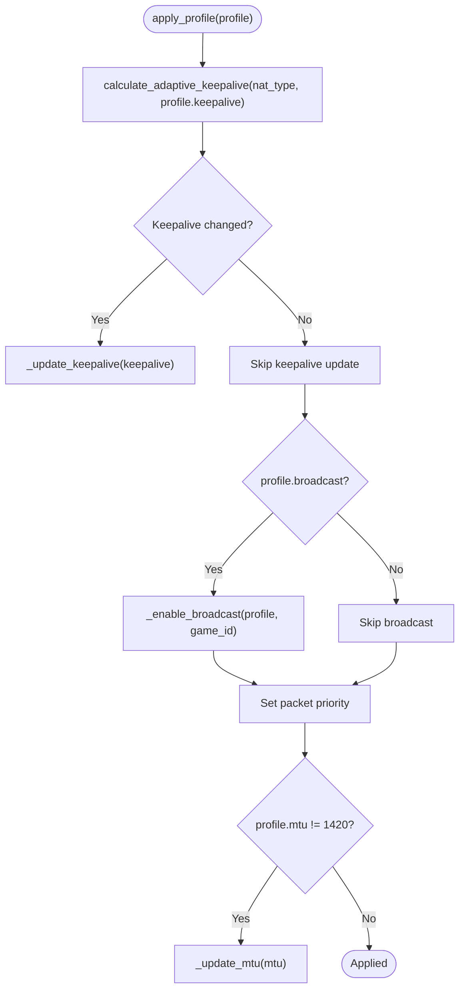
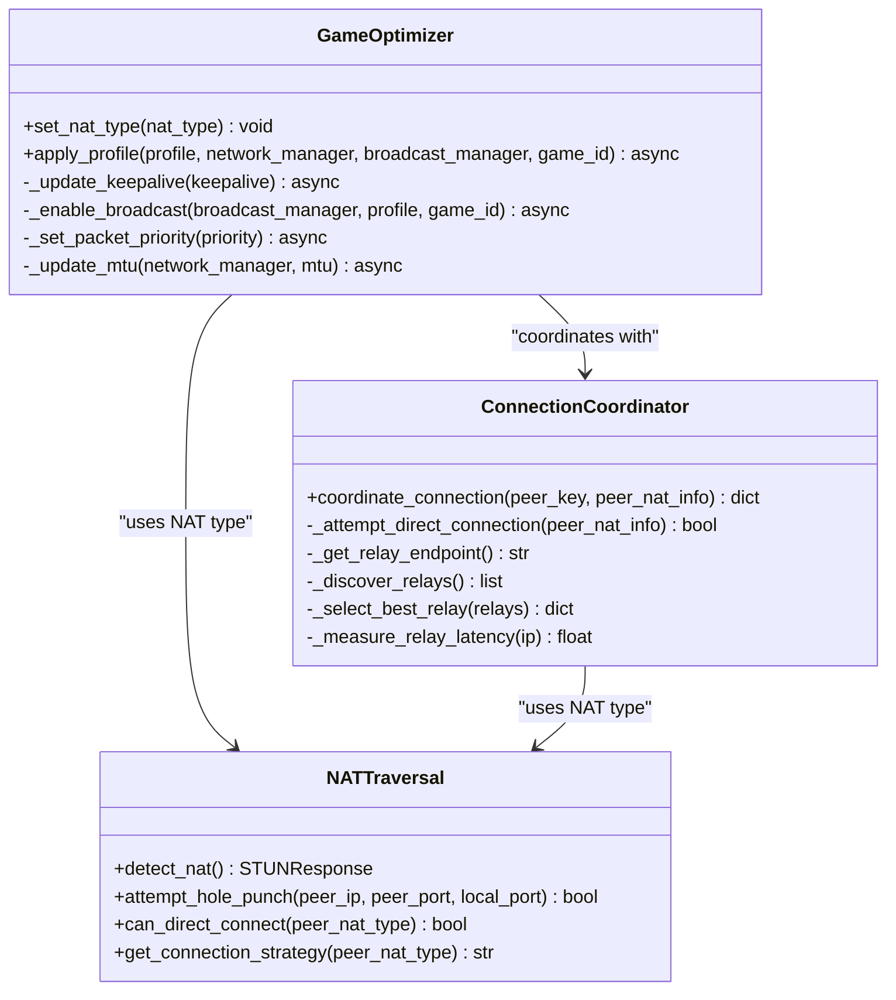
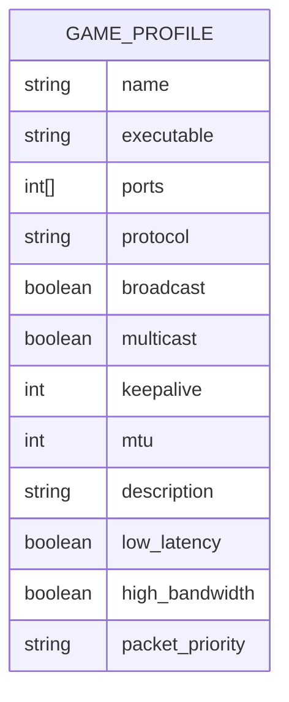
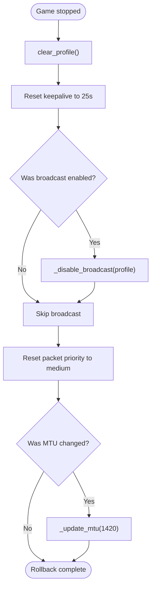
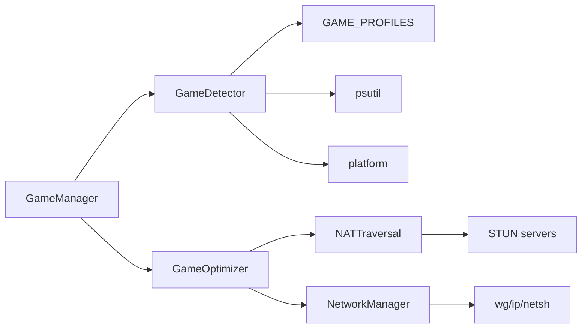
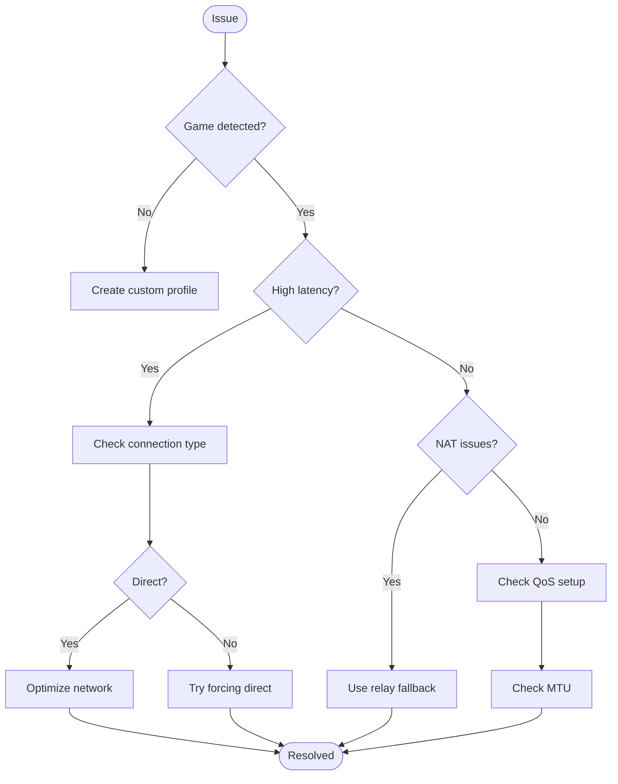

# Optimization Application

<cite>
**Referenced Files in This Document**
- [games.py](file://core/games.py)
- [nat.py](file://core/nat.py)
- [network.py](file://core/network.py)
- [battle_royale.json](file://game_profiles/battle_royale.json)
- [fps.json](file://game_profiles/fps.json)
- [mmo.json](file://game_profiles/mmo.json)
- [GAMES.md](file://docs/GAMES.md)
- [NAT_TRAVERSAL.md](file://docs/NAT_TRAVERSAL.md)
- [TROUBLESHOOTING.md](file://docs/TROUBLESHOOTING.md)
- [test_game_detection_advanced.py](file://tests/test_game_detection_advanced.py)
- [test_games.py](file://tests/test_games.py)
</cite>

## Table of Contents
1. [Introduction](#introduction)
2. [Project Structure](#project-structure)
3. [Core Components](#core-components)
4. [Architecture Overview](#architecture-overview)
5. [Detailed Component Analysis](#detailed-component-analysis)
6. [Dependency Analysis](#dependency-analysis)
7. [Performance Considerations](#performance-considerations)
8. [Troubleshooting Guide](#troubleshooting-guide)
9. [Conclusion](#conclusion)

## Introduction
This document explains how the game optimization application system detects running games and automatically applies network optimizations tailored to each game profile. It covers the GameOptimizer class functionality, including adaptive keepalive calculation based on NAT type, QoS packet prioritization, and MTU optimization. It also documents the integration with NAT traversal strategies, the relationship between game profiles and network configuration, and the automatic application of game-specific settings. The document details optimization parameters such as low_latency, high_bandwidth, and packet_priority, and explains how NAT type influences keepalive intervals, how adaptive optimization algorithms work, and how configurations roll back when games stop.

## Project Structure
The optimization system spans several modules:
- Game detection and profiles: core/games.py
- NAT traversal and connection strategies: core/nat.py
- WireGuard network management: core/network.py
- Game profile definitions: game_profiles/*.json
- Documentation: docs/GAMES.md, docs/NAT_TRAVERSAL.md, docs/TROUBLESHOOTING.md
- Tests: tests/test_games.py, tests/test_game_detection_advanced.py

**Diagram sources**
- [games.py](file://core/games.py#L265-L1349)
- [nat.py](file://core/nat.py#L41-L525)
- [network.py](file://core/network.py#L25-L515)
- [battle_royale.json](file://game_profiles/battle_royale.json#L1-L45)
- [fps.json](file://game_profiles/fps.json#L1-L143)
- [mmo.json](file://game_profiles/mmo.json#L1-L45)

**Section sources**
- [games.py](file://core/games.py#L1-L1349)
- [nat.py](file://core/nat.py#L1-L525)
- [network.py](file://core/network.py#L1-L515)
- [GAMES.md](file://docs/GAMES.md#L1-L631)

## Core Components
- GameDetector: Scans running processes, windows, and open ports to detect games and triggers optimization callbacks.
- GameOptimizer: Applies game-specific optimizations including adaptive keepalive, broadcast emulation, QoS packet priority, and MTU adjustments.
- GameManager: Orchestrates detection and optimization, integrates NAT traversal, and manages lifecycle.
- NATTraversal and ConnectionCoordinator: Determine NAT type and connection strategy, enabling direct P2P or relay fallback.
- NetworkManager: Manages WireGuard interface creation, peer configuration, and MTU updates.

**Section sources**
- [games.py](file://core/games.py#L265-L1349)
- [nat.py](file://core/nat.py#L41-L525)
- [network.py](file://core/network.py#L25-L515)

## Architecture Overview
The system follows a detection-optimization pipeline:
- GameDetector continuously monitors for running games using multiple detection methods.
- On detection, GameManager invokes GameOptimizer to apply profile-specific optimizations.
- GameOptimizer calculates adaptive keepalive based on NAT type, enables broadcast emulation if needed, sets QoS priorities, and adjusts MTU.
- NATTraversal informs GameOptimizer of NAT conditions to tune keepalive and connection strategy.
- NetworkManager executes low-level network changes (WireGuard peers, MTU).

**Diagram sources**
- [games.py](file://core/games.py#L364-L650)
- [games.py](file://core/games.py#L807-L1287)
- [nat.py](file://core/nat.py#L64-L106)
- [network.py](file://core/network.py#L411-L420)

## Detailed Component Analysis

### GameOptimizer: Adaptive Keepalive, QoS, and MTU
- Adaptive keepalive calculation:
  - Uses NAT type mapping to compute optimal keepalive intervals.
  - Respects profile-specified keepalive overrides when meaningful.
  - Updates WireGuard persistent-keepalive configuration for peers.
- Broadcast emulation:
  - Dynamically starts listeners on game ports based on protocol.
  - Tracks ports per game to avoid duplicate listeners.
- QoS packet priority:
  - Maps low/medium/high to DSCP values.
  - Applies platform-specific QoS (iptables + tc on Linux, netsh on Windows).
  - Configures bandwidth guarantees and priority queues on Linux.
- MTU optimization:
  - Updates interface MTU per profile.
  - Supports both Windows and Linux MTU changes.

**Diagram sources**
- [games.py](file://core/games.py#L807-L1287)

**Section sources**
- [games.py](file://core/games.py#L20-L51)
- [games.py](file://core/games.py#L807-L1287)
- [GAMES.md](file://docs/GAMES.md#L261-L521)

### NAT Integration and Connection Strategy
- NATTraversal detects NAT type using STUN and determines whether direct P2P is feasible.
- ConnectionCoordinator selects direct or relay strategy and coordinates hole punching or relay endpoint selection.
- GameOptimizer receives NAT type updates to adjust keepalive and other network parameters.

**Diagram sources**
- [nat.py](file://core/nat.py#L41-L525)
- [games.py](file://core/games.py#L696-L1287)

**Section sources**
- [nat.py](file://core/nat.py#L41-L525)
- [NAT_TRAVERSAL.md](file://docs/NAT_TRAVERSAL.md#L1-L562)
- [games.py](file://core/games.py#L696-L1287)

### Game Profiles and Optimization Parameters
Game profiles define:
- Ports and protocols used by the game.
- Broadcast and multicast discovery flags.
- Keepalive interval and MTU.
- Optimization hints: low_latency, high_bandwidth, packet_priority.

Examples:
- Battle Royale profiles emphasize high bandwidth and high packet priority.
- FPS profiles mirror battle royale characteristics.
- MMORPG profiles typically require high bandwidth but lower packet priority.

**Diagram sources**
- [games.py](file://core/games.py#L53-L71)
- [battle_royale.json](file://game_profiles/battle_royale.json#L1-L45)
- [fps.json](file://game_profiles/fps.json#L1-L143)
- [mmo.json](file://game_profiles/mmo.json#L1-L45)

**Section sources**
- [GAMES.md](file://docs/GAMES.md#L18-L52)
- [battle_royale.json](file://game_profiles/battle_royale.json#L1-L45)
- [fps.json](file://game_profiles/fps.json#L1-L143)
- [mmo.json](file://game_profiles/mmo.json#L1-L45)

### Rollback Mechanisms
When a game stops:
- GameOptimizer clears active profile and resets to defaults:
  - Resets keepalive to default (25s).
  - Disables broadcast emulation if previously enabled.
  - Resets packet priority to medium (default).
  - Restores MTU to default (1420).
- Dynamic port tracking ensures listeners are stopped only when no other game needs them.

**Diagram sources**
- [games.py](file://core/games.py#L1192-L1287)

**Section sources**
- [games.py](file://core/games.py#L1192-L1287)

## Dependency Analysis
- GameOptimizer depends on:
  - NAT type for adaptive keepalive.
  - NetworkManager for WireGuard peer configuration and MTU changes.
  - BroadcastManager for dynamic broadcast emulation (via GameOptimizer’s internal methods).
- GameDetector depends on:
  - GAME_PROFILES for detection rules.
  - psutil for process enumeration.
  - Platform-specific APIs for window title detection on Windows.
- NATTraversal depends on:
  - STUN servers for NAT type detection.
  - Socket operations for hole punching.
- NetworkManager depends on:
  - Platform commands (wg, ip, netsh) for interface management.

**Diagram sources**
- [games.py](file://core/games.py#L265-L1349)
- [nat.py](file://core/nat.py#L41-L525)
- [network.py](file://core/network.py#L25-L515)

**Section sources**
- [games.py](file://core/games.py#L265-L1349)
- [nat.py](file://core/nat.py#L41-L525)
- [network.py](file://core/network.py#L25-L515)

## Performance Considerations
- Keepalive tuning:
  - Symmetric NAT requires frequent keepalive to prevent binding expiration.
  - Default profile keepalive can be overridden per game.
- QoS prioritization:
  - High-priority packets (DSCP EF) receive guaranteed bandwidth on Linux with tc HTB.
  - Windows QoS requires administrative privileges.
- MTU optimization:
  - Profiles specify optimal MTU; default is 1420.
  - Adjusting MTU reduces fragmentation and improves throughput.
- Concurrency:
  - Game detection runs asynchronously every 5 seconds.
  - Network operations are executed via platform commands with timeouts.

[No sources needed since this section provides general guidance]

## Troubleshooting Guide
Common issues and resolutions:
- Game not detected:
  - Verify game is in profiles or create a custom profile.
  - Ensure process name matches profile executable.
- High latency:
  - Check connection type (Direct vs Relayed).
  - For relays, try forcing direct connection or selecting a closer relay.
- NAT-related connectivity:
  - Use relay fallback for symmetric NAT.
  - Open UDP 51820 and consider UPnP or DMZ.
- QoS not applied:
  - Linux requires sudo; ensure iptables/tc are available.
  - Windows requires administrative privileges for netsh.
- MTU issues:
  - Confirm MTU changes were applied per platform commands.
- Rollback not occurring:
  - Ensure the game actually stopped and detection history reflects stop events.

**Diagram sources**
- [TROUBLESHOOTING.md](file://docs/TROUBLESHOOTING.md#L1-L904)

**Section sources**
- [TROUBLESHOOTING.md](file://docs/TROUBLESHOOTING.md#L1-L904)
- [GAMES.md](file://docs/GAMES.md#L540-L631)

## Conclusion
The optimization application system provides a robust, profile-driven approach to network tuning for games. By integrating NAT traversal insights, adaptive keepalive calculation, QoS prioritization, and MTU optimization, it delivers measurable improvements in latency and reliability. The dynamic broadcast emulation and careful rollback mechanisms ensure minimal overhead and safe operation when games stop. The modular design allows for extensible game profiles and platform-specific enhancements.