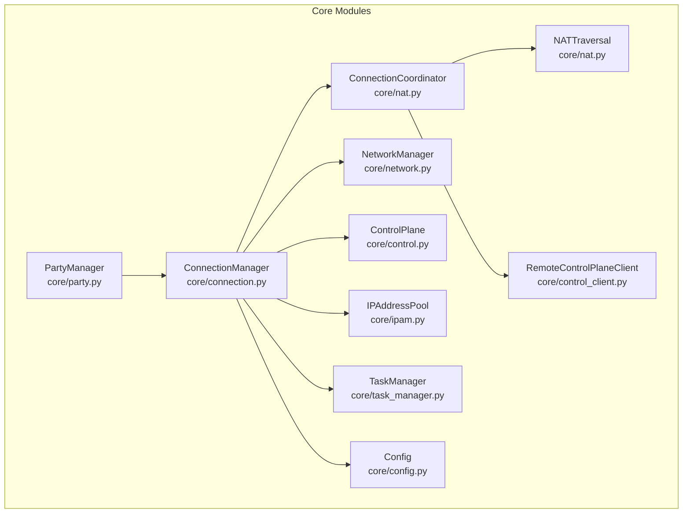
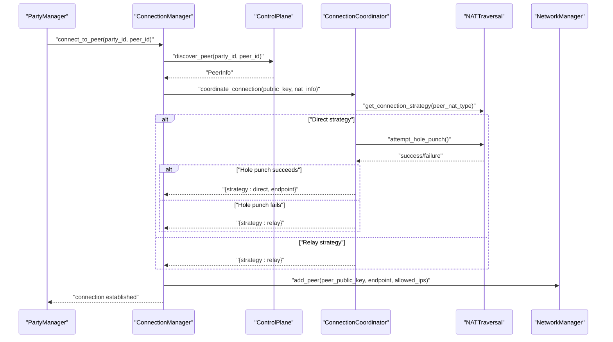
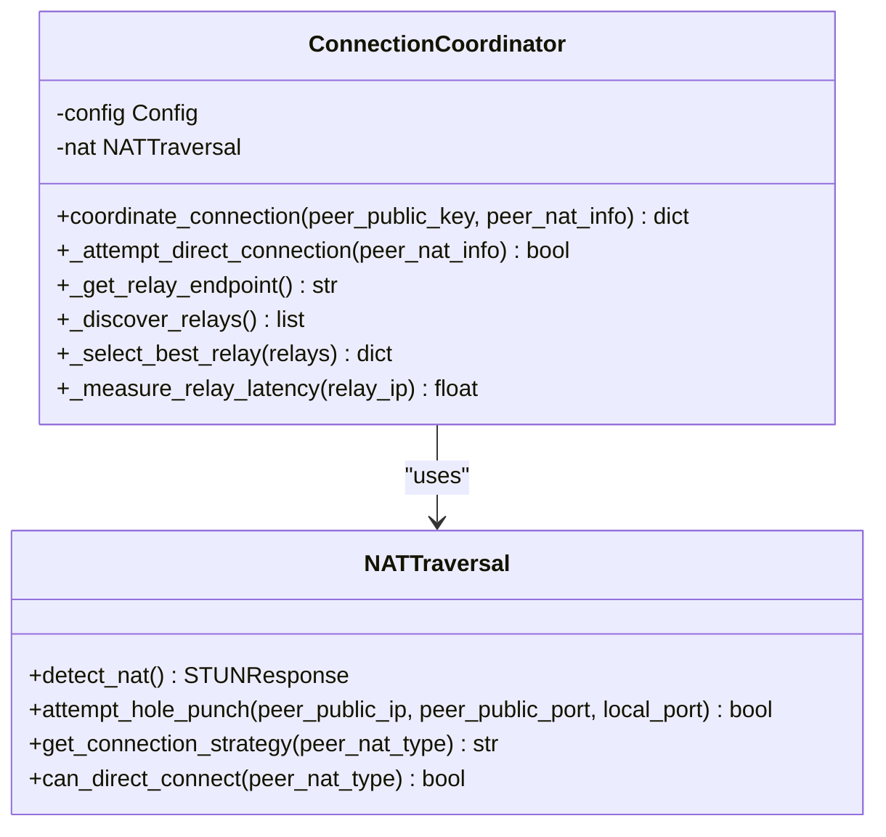
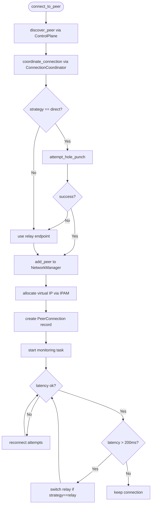
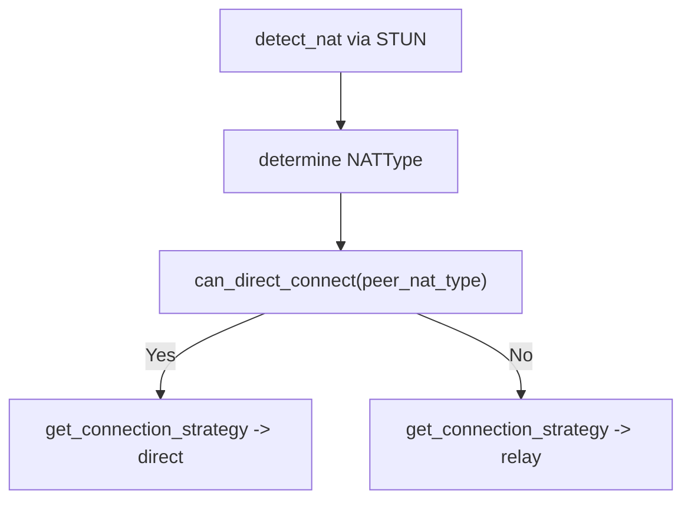
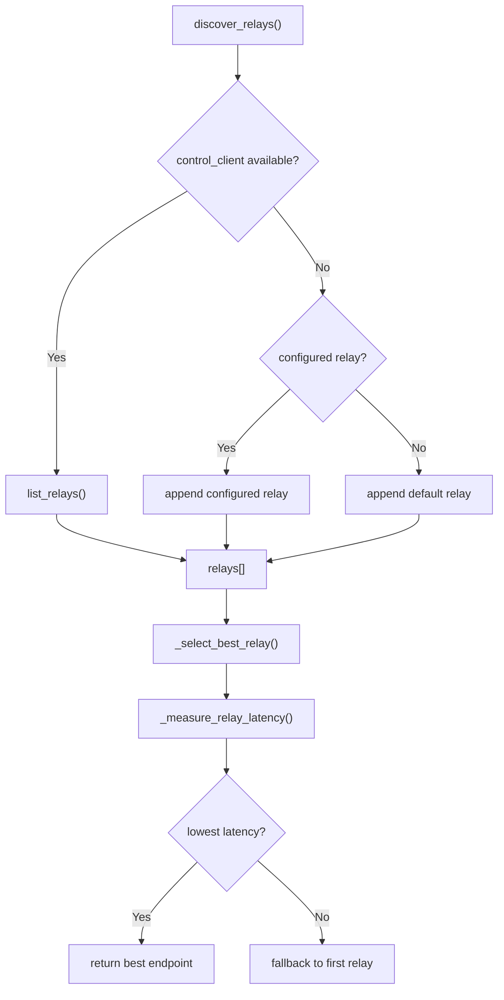
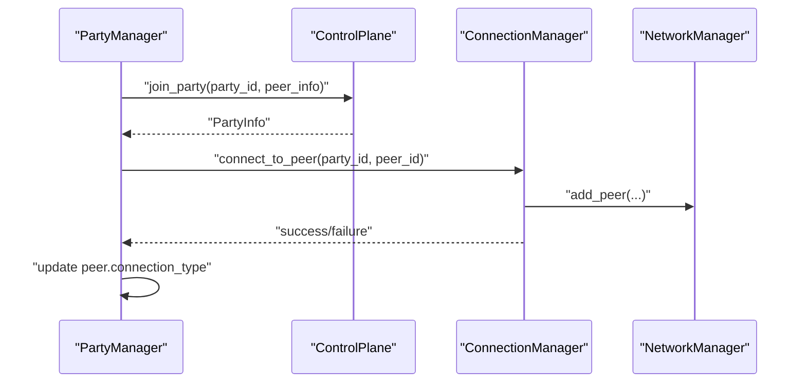
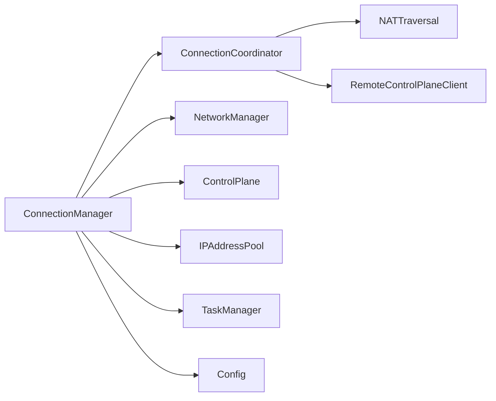

# Connection Coordination

<cite>
**Referenced Files in This Document**
- [connection.py](file://core/connection.py)
- [nat.py](file://core/nat.py)
- [network.py](file://core/network.py)
- [control.py](file://core/control.py)
- [control_client.py](file://core/control_client.py)
- [party.py](file://core/party.py)
- [ipam.py](file://core/ipam.py)
- [task_manager.py](file://core/task_manager.py)
- [config.py](file://core/config.py)
- [test_connection.py](file://tests/test_connection.py)
</cite>

## Table of Contents
1. [Introduction](#introduction)
2. [Project Structure](#project-structure)
3. [Core Components](#core-components)
4. [Architecture Overview](#architecture-overview)
5. [Detailed Component Analysis](#detailed-component-analysis)
6. [Dependency Analysis](#dependency-analysis)
7. [Performance Considerations](#performance-considerations)
8. [Troubleshooting Guide](#troubleshooting-guide)
9. [Conclusion](#conclusion)

## Introduction
This document explains the ConnectionCoordinator class and the peer connection orchestration system. It covers how connection strategies are determined (direct vs relay) based on NAT types, the peer coordination workflow from initial connection through fallback mechanisms, the relay discovery process integrating with the control plane, latency measurement and best relay selection, endpoint negotiation, strategy validation, and connection result reporting. It also documents the integration with the control plane for relay server discovery, the fallback hierarchy from control plane to configured relays to default servers, latency measurement techniques using ICMP ping, error handling for network failures, performance optimization strategies, coordination between multiple peers, connection state management, and graceful degradation when optimal connections cannot be established.

## Project Structure
The connection orchestration spans several modules:
- Connection orchestration and state management
- NAT traversal and strategy determination
- Network management (WireGuard)
- Control plane integration (peer discovery, relay listing)
- IP address management for virtual network
- Background task management

**Diagram sources**
- [connection.py](file://core/connection.py#L18-L125)
- [nat.py](file://core/nat.py#L330-L525)
- [network.py](file://core/network.py#L25-L515)
- [control.py](file://core/control.py#L187-L456)
- [control_client.py](file://core/control_client.py#L23-L438)
- [party.py](file://core/party.py#L102-L157)
- [ipam.py](file://core/ipam.py#L10-L183)
- [task_manager.py](file://core/task_manager.py#L11-L167)
- [config.py](file://core/config.py#L17-L114)

**Section sources**
- [connection.py](file://core/connection.py#L1-L125)
- [nat.py](file://core/nat.py#L1-L120)
- [network.py](file://core/network.py#L1-L120)
- [control.py](file://core/control.py#L1-L120)
- [control_client.py](file://core/control_client.py#L1-L120)
- [party.py](file://core/party.py#L1-L120)
- [ipam.py](file://core/ipam.py#L1-L120)
- [task_manager.py](file://core/task_manager.py#L1-L120)
- [config.py](file://core/config.py#L1-L120)

## Core Components
- ConnectionManager: Orchestrates peer connection lifecycle, strategy selection, WireGuard configuration, and monitoring.
- ConnectionCoordinator: Determines strategy (direct or relay), performs hole punching, and selects relay endpoints.
- NATTraversal: Detects NAT type, decides compatibility, and performs UDP hole punching.
- NetworkManager: Manages WireGuard interface, adds/removes peers, measures latency via ICMP ping.
- ControlPlane and RemoteControlPlaneClient: Peer discovery and relay server listing.
- IPAddressPool: Allocates virtual IPs for peers in the virtual network.
- TaskManager: Background task lifecycle management for monitoring and cleanup.
- Config: Provides runtime configuration including relay settings and control server URL.

**Section sources**
- [connection.py](file://core/connection.py#L18-L125)
- [nat.py](file://core/nat.py#L330-L525)
- [network.py](file://core/network.py#L25-L515)
- [control.py](file://core/control.py#L187-L456)
- [control_client.py](file://core/control_client.py#L23-L438)
- [ipam.py](file://core/ipam.py#L10-L183)
- [task_manager.py](file://core/task_manager.py#L11-L167)
- [config.py](file://core/config.py#L17-L114)

## Architecture Overview
The system integrates NAT detection, strategy determination, control plane discovery, and WireGuard configuration to establish peer-to-peer or relayed connections. The ConnectionManager coordinates the end-to-end flow, delegating strategy decisions to ConnectionCoordinator and NATTraversal, and managing WireGuard peer configuration and monitoring.

**Diagram sources**
- [connection.py](file://core/connection.py#L38-L125)
- [nat.py](file://core/nat.py#L337-L369)
- [nat.py](file://core/nat.py#L371-L377)
- [nat.py](file://core/nat.py#L323-L327)

## Detailed Component Analysis

### ConnectionCoordinator
The ConnectionCoordinator encapsulates strategy determination and relay endpoint selection. It evaluates NAT compatibility and decides whether to attempt direct P2P with hole punching or fall back to relay. It discovers relays from the control plane, measures latency, and selects the best relay endpoint.

Key responsibilities:
- Strategy determination: Direct vs relay based on NAT compatibility.
- Direct connection attempt: Hole punching with NATTraversal.
- Relay discovery: Control plane integration, configured relay, default server fallback.
- Best relay selection: Latency measurement via ICMP ping.
- Endpoint negotiation: Returns endpoint string for NetworkManager.

**Diagram sources**
- [nat.py](file://core/nat.py#L330-L525)
- [nat.py](file://core/nat.py#L41-L106)
- [nat.py](file://core/nat.py#L244-L294)
- [nat.py](file://core/nat.py#L323-L327)

**Section sources**
- [nat.py](file://core/nat.py#L330-L525)

### ConnectionManager
The ConnectionManager orchestrates the end-to-end connection process:
- Discovers peer via ControlPlane.
- Coordinates strategy via ConnectionCoordinator.
- Configures WireGuard peer with negotiated endpoint.
- Allocates virtual IP via IPAM.
- Starts monitoring and cleanup tasks.
- Monitors connection health, handles reconnection, and switches relays when latency is high.
- Reports connection status including latency and strategy.

**Diagram sources**
- [connection.py](file://core/connection.py#L38-L125)
- [connection.py](file://core/connection.py#L213-L305)
- [connection.py](file://core/connection.py#L334-L437)

**Section sources**
- [connection.py](file://core/connection.py#L18-L125)
- [connection.py](file://core/connection.py#L213-L305)
- [connection.py](file://core/connection.py#L334-L437)

### NAT Traversal and Strategy Determination
NATTraversal detects NAT type using STUN and determines compatibility for direct P2P. It also performs UDP hole punching to attempt direct connections. The strategy is derived from compatibility checks.

**Diagram sources**
- [nat.py](file://core/nat.py#L64-L106)
- [nat.py](file://core/nat.py#L295-L327)

**Section sources**
- [nat.py](file://core/nat.py#L41-L106)
- [nat.py](file://core/nat.py#L295-L327)

### Relay Discovery and Best Relay Selection
Relay discovery follows a strict hierarchy:
1. Control plane: RemoteControlPlaneClient.list_relays().
2. Configured relay: Config.relay_public_ip/port.
3. Default server: relay.lanrage.io:51820.

Best relay selection measures latency to each candidate using ICMP ping and picks the lowest-latency option. If latency measurement fails, it falls back to the first available relay.

**Diagram sources**
- [nat.py](file://core/nat.py#L399-L455)
- [nat.py](file://core/nat.py#L457-L479)
- [nat.py](file://core/nat.py#L481-L525)
- [control_client.py](file://core/control_client.py#L373-L402)

**Section sources**
- [nat.py](file://core/nat.py#L399-L455)
- [nat.py](file://core/nat.py#L457-L479)
- [nat.py](file://core/nat.py#L481-L525)
- [control_client.py](file://core/control_client.py#L373-L402)

### Endpoint Negotiation and Validation
Endpoint negotiation occurs after strategy selection:
- Direct strategy: Endpoint is the peer’s public endpoint.
- Relay strategy: Endpoint is the best relay endpoint chosen by ConnectionCoordinator.

Validation includes:
- Strategy validation against NAT compatibility.
- Endpoint existence and reachability (via ICMP ping).
- WireGuard peer configuration success.

**Section sources**
- [nat.py](file://core/nat.py#L337-L369)
- [connection.py](file://core/connection.py#L89-L114)
- [network.py](file://core/network.py#L392-L420)

### Connection Result Reporting
ConnectionManager reports:
- Peer ID, virtual IP, endpoint, strategy, latency, connected time, and status.
- Status transitions: connecting → connected/degraded/failed/cleanup.
- Auto-cleanup after a timeout when connection fails.

**Section sources**
- [connection.py](file://core/connection.py#L152-L179)
- [connection.py](file://core/connection.py#L439-L493)

### Coordination Between Multiple Peers
PartyManager initializes NAT, control plane, and connection manager, then connects to all existing peers upon joining a party. It updates peer statuses based on connection outcomes.

**Diagram sources**
- [party.py](file://core/party.py#L198-L247)
- [connection.py](file://core/connection.py#L38-L125)

**Section sources**
- [party.py](file://core/party.py#L198-L247)
- [connection.py](file://core/connection.py#L38-L125)

## Dependency Analysis
The ConnectionCoordinator depends on NATTraversal for strategy and hole punching, and optionally on RemoteControlPlaneClient for relay discovery. ConnectionManager depends on ConnectionCoordinator, NetworkManager, ControlPlane, IPAM, and TaskManager. The control plane integration is optional but enables dynamic relay discovery.

**Diagram sources**
- [nat.py](file://core/nat.py#L330-L525)
- [connection.py](file://core/connection.py#L18-L125)
- [control_client.py](file://core/control_client.py#L23-L438)

**Section sources**
- [nat.py](file://core/nat.py#L330-L525)
- [connection.py](file://core/connection.py#L18-L125)
- [control_client.py](file://core/control_client.py#L23-L438)

## Performance Considerations
- Latency measurement: ICMP ping is used for both peer latency and relay selection. On Windows and Unix, the command-line ping is executed asynchronously with timeouts.
- Keepalive: Persistent keepalive is enabled for WireGuard peers to improve NAT traversal reliability.
- Monitoring intervals: Connection monitoring runs every 30 seconds to balance responsiveness and resource usage.
- Fallback hierarchy: Control plane discovery, configured relay, and default server ensure resilience when upstream services are unavailable.
- IPAM scalability: Subnet expansion allows allocation across multiple /24 subnets within the base /16.

[No sources needed since this section provides general guidance]

## Troubleshooting Guide
Common issues and resolutions:
- NAT detection failures: Check firewall settings, test STUN connectivity, and try different networks.
- Hole punching failures: Symmetric NAT or strict firewalls require relay fallback.
- Relay connection slowness: Use a closer relay or deploy more relays; check network quality.
- Control plane unavailability: Falls back to configured or default relay; ensure configuration is correct.
- Connection monitoring false positives: Reconnection attempts are limited; high latency triggers relay switching for relay strategies.

**Section sources**
- [nat.py](file://core/nat.py#L64-L106)
- [nat.py](file://core/nat.py#L244-L294)
- [nat.py](file://core/nat.py#L481-L525)
- [connection.py](file://core/connection.py#L213-L305)
- [connection.py](file://core/connection.py#L334-L437)

## Conclusion
The ConnectionCoordinator and ConnectionManager implement a robust, layered approach to peer connection orchestration. Strategy selection is grounded in NAT compatibility, with automatic fallback to relay when direct connections are not feasible. Control plane integration enables dynamic relay discovery, while latency measurement and periodic monitoring ensure optimal performance and graceful degradation. The system balances simplicity with resilience, enabling reliable peer-to-peer or relayed connections across diverse network environments.