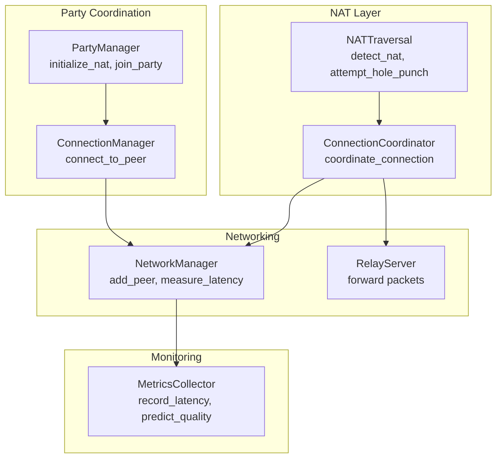
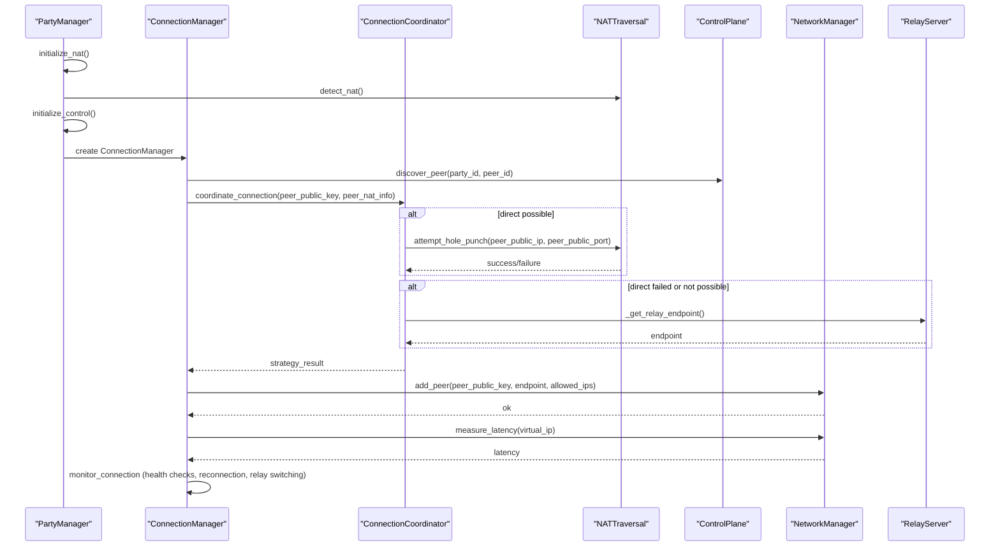
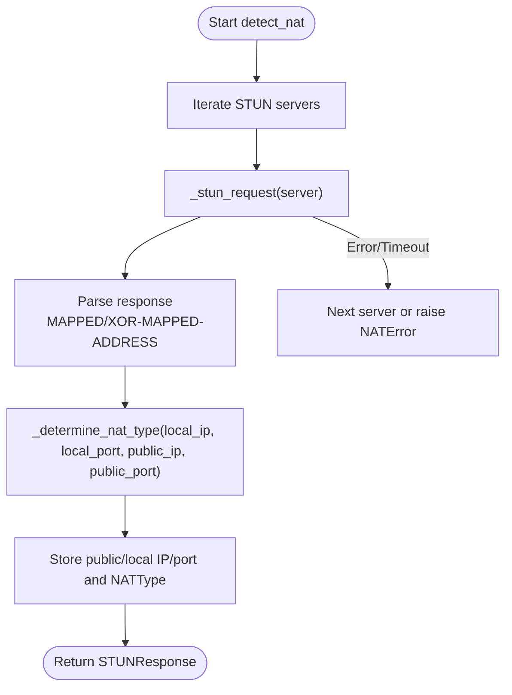
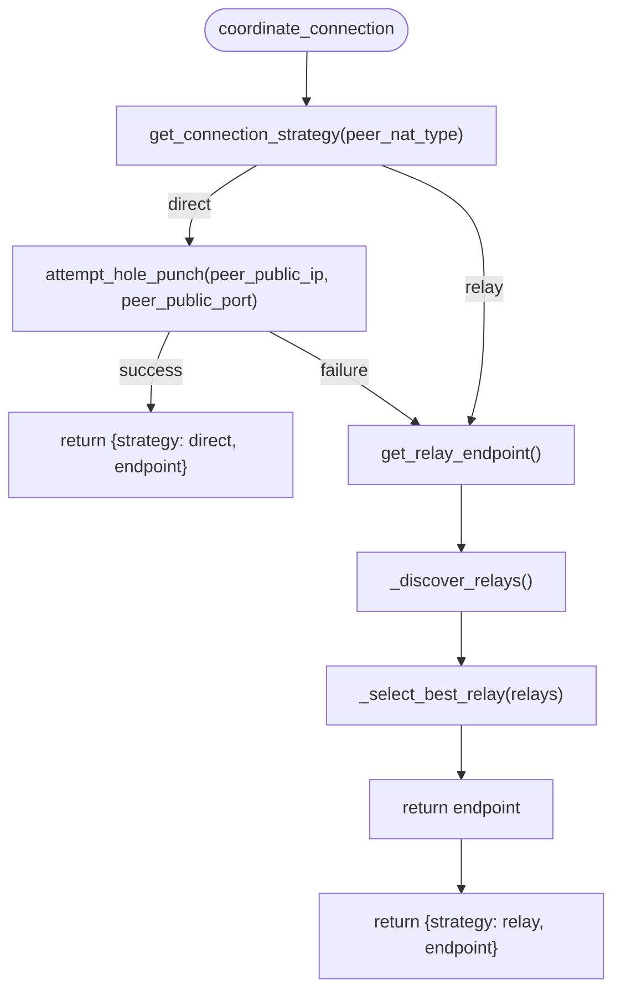
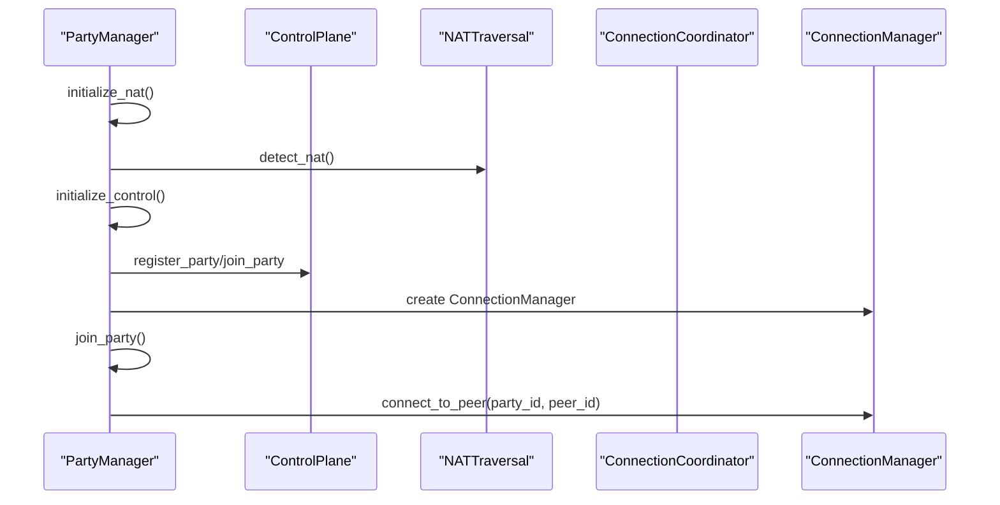
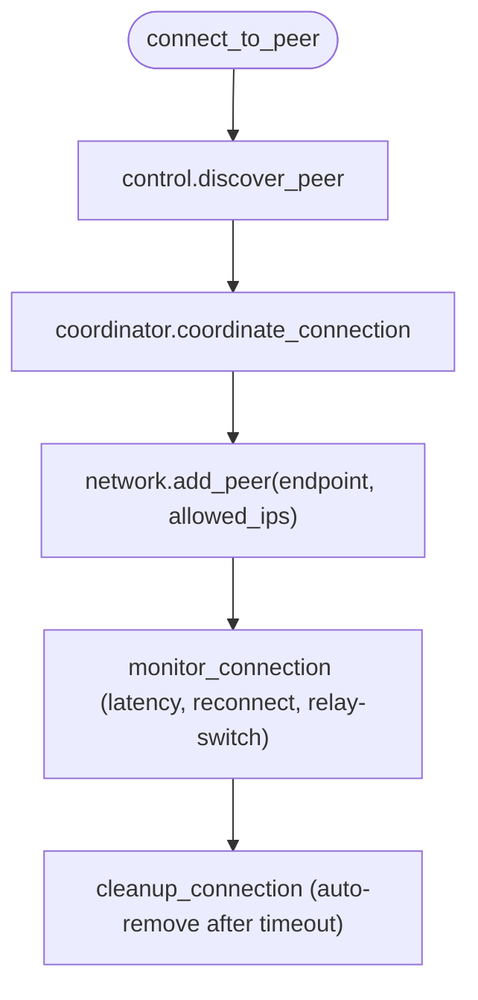
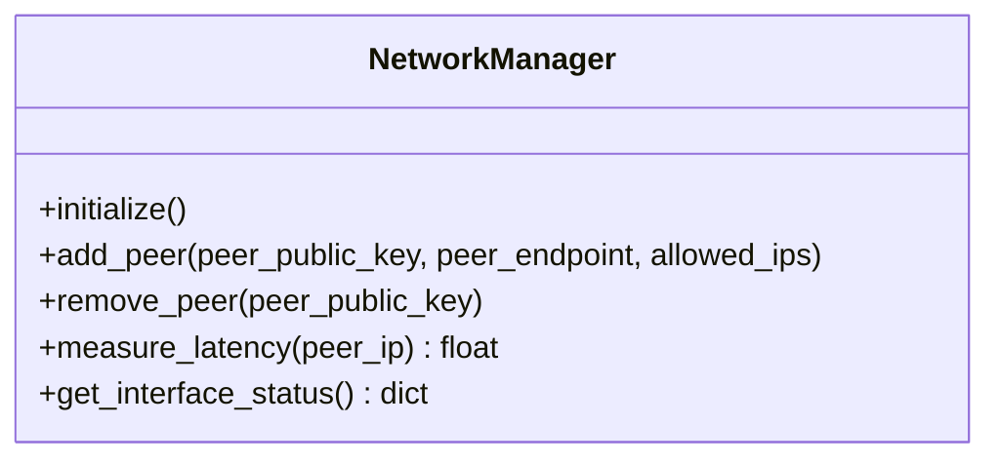
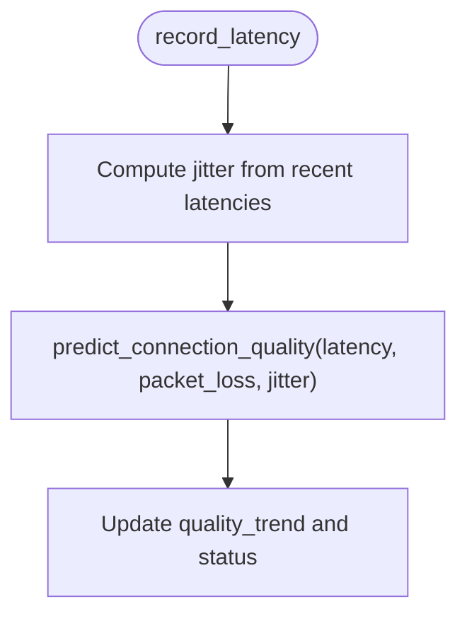
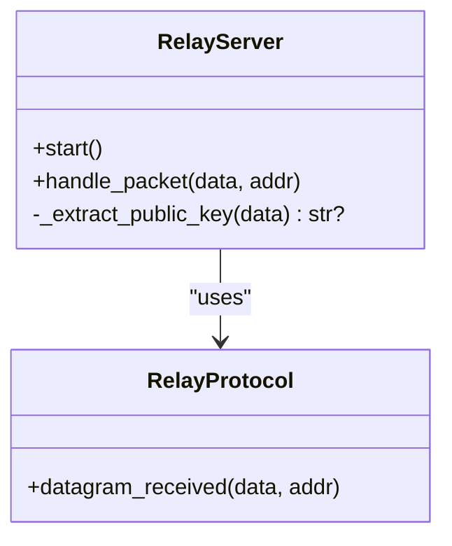
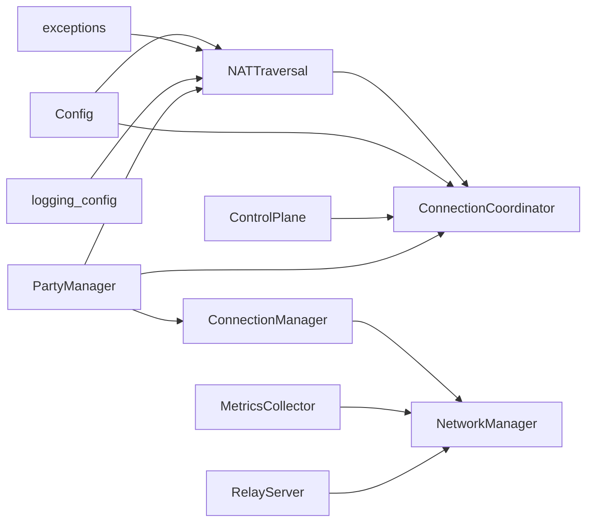

# NAT Traversal

<cite>
**Referenced Files in This Document**
- [core/nat.py](file://core/nat.py)
- [docs/NAT_TRAVERSAL.md](file://docs/NAT_TRAVERSAL.md)
- [core/connection.py](file://core/connection.py)
- [core/party.py](file://core/party.py)
- [core/network.py](file://core/network.py)
- [core/metrics.py](file://core/metrics.py)
- [core/exceptions.py](file://core/exceptions.py)
- [core/logging_config.py](file://core/logging_config.py)
- [core/config.py](file://core/config.py)
- [servers/relay_server.py](file://servers/relay_server.py)
- [tests/test_nat.py](file://tests/test_nat.py)
</cite>

## Table of Contents
1. [Introduction](#introduction)
2. [Project Structure](#project-structure)
3. [Core Components](#core-components)
4. [Architecture Overview](#architecture-overview)
5. [Detailed Component Analysis](#detailed-component-analysis)
6. [Dependency Analysis](#dependency-analysis)
7. [Performance Considerations](#performance-considerations)
8. [Troubleshooting Guide](#troubleshooting-guide)
9. [Conclusion](#conclusion)
10. [Appendices](#appendices)

## Introduction
This document explains LANrage’s NAT traversal system with a focus on STUN/TURN hole punching, connection strategies, and relay fallback mechanisms. It covers NAT classification, UDP hole punching sequences, the connection coordinator, peer connectivity testing, adaptive strategy selection, STUN server selection and testing, TURN relay fallback, integration with the party management system, and metrics collection for connection quality assessment.

## Project Structure
The NAT traversal system spans several modules:
- NAT detection and hole punching: core/nat.py
- Party and coordination: core/party.py, core/connection.py
- WireGuard networking: core/network.py
- Metrics and quality scoring: core/metrics.py
- Logging and timing: core/logging_config.py
- Relay server: servers/relay_server.py
- Tests and docs: tests/test_nat.py, docs/NAT_TRAVERSAL.md

**Diagram sources**
- [core/nat.py](file://core/nat.py#L41-L328)
- [core/connection.py](file://core/connection.py#L18-L125)
- [core/party.py](file://core/party.py#L102-L158)
- [core/network.py](file://core/network.py#L25-L120)
- [servers/relay_server.py](file://servers/relay_server.py#L30-L140)
- [core/metrics.py](file://core/metrics.py#L193-L246)

**Section sources**
- [core/nat.py](file://core/nat.py#L1-L120)
- [core/connection.py](file://core/connection.py#L1-L60)
- [core/party.py](file://core/party.py#L1-L60)
- [core/network.py](file://core/network.py#L1-L60)
- [core/metrics.py](file://core/metrics.py#L1-L60)
- [servers/relay_server.py](file://servers/relay_server.py#L1-L60)

## Core Components
- NATTraversal: Implements STUN-based NAT detection, simplified NAT classification, and UDP hole punching.
- ConnectionCoordinator: Determines strategy (direct vs relay), coordinates hole punching, and selects relay endpoints.
- PartyManager: Initializes NAT traversal, integrates with control plane, and manages peer connections.
- ConnectionManager: Orchestrates peer connection lifecycle, monitors health, and handles reconnection and relay switching.
- NetworkManager: Adds/removes WireGuard peers, measures latency, and applies persistent keepalive.
- MetricsCollector: Tracks latency, jitter, packet loss, and predicts connection quality.
- RelayServer: Stateless UDP relay for NAT traversal fallback.

**Section sources**
- [core/nat.py](file://core/nat.py#L41-L328)
- [core/connection.py](file://core/connection.py#L18-L125)
- [core/party.py](file://core/party.py#L102-L158)
- [core/network.py](file://core/network.py#L25-L120)
- [core/metrics.py](file://core/metrics.py#L193-L246)
- [servers/relay_server.py](file://servers/relay_server.py#L30-L140)

## Architecture Overview
The NAT traversal pipeline:
1. PartyManager initializes NATTraversal and builds ConnectionCoordinator.
2. ConnectionManager connects to peers via control plane discovery.
3. ConnectionCoordinator decides strategy based on NAT types and attempts direct hole punching.
4. If direct fails or not possible, falls back to relay selection and configuration.
5. NetworkManager adds WireGuard peers and measures latency.
6. MetricsCollector records and predicts connection quality.

**Diagram sources**
- [core/party.py](file://core/party.py#L121-L158)
- [core/connection.py](file://core/connection.py#L38-L125)
- [core/nat.py](file://core/nat.py#L244-L328)
- [core/network.py](file://core/network.py#L340-L420)
- [servers/relay_server.py](file://servers/relay_server.py#L48-L140)

## Detailed Component Analysis

### NATTraversal: STUN, Classification, and Hole Punching
- STUN server selection: Multiple Google STUN servers are probed in sequence.
- STUN request/response parsing: Builds RFC 5389 Binding Request, validates Binding Response, verifies transaction ID, and extracts XOR-MAPPED-ADDRESS.
- NAT classification: Simplified detection based on local/public IP/port equality; returns OPEN, FULL_CONE, or PORT_RESTRICTED_CONE.
- UDP hole punching: Sends multiple “punch” packets to peer’s public endpoint and waits for ACK with a 2-second timeout.

**Diagram sources**
- [core/nat.py](file://core/nat.py#L64-L105)
- [core/nat.py](file://core/nat.py#L107-L179)
- [core/nat.py](file://core/nat.py#L181-L226)
- [core/nat.py](file://core/nat.py#L228-L242)

Key behaviors:
- STUN servers: [core/nat.py](file://core/nat.py#L44-L51)
- NAT classification: [core/nat.py](file://core/nat.py#L228-L242)
- Hole punching: [core/nat.py](file://core/nat.py#L244-L294)

**Section sources**
- [core/nat.py](file://core/nat.py#L41-L328)
- [docs/NAT_TRAVERSAL.md](file://docs/NAT_TRAVERSAL.md#L1-L200)

### ConnectionCoordinator: Strategy Selection and Relay Discovery
- Strategy selection: Uses NATTraversal.can_direct_connect to decide direct vs relay.
- Direct attempt: Calls NATTraversal.attempt_hole_punch and returns endpoint if successful.
- Relay discovery: Attempts control plane discovery, falls back to configured or default relay, selects best relay by latency measurement, and returns endpoint.

**Diagram sources**
- [core/nat.py](file://core/nat.py#L323-L369)
- [core/nat.py](file://core/nat.py#L371-L398)
- [core/nat.py](file://core/nat.py#L399-L455)
- [core/nat.py](file://core/nat.py#L457-L525)

**Section sources**
- [core/nat.py](file://core/nat.py#L323-L525)

### PartyManager: NAT Initialization and Party Lifecycle
- Initializes NATTraversal and ConnectionCoordinator.
- Integrates with control plane for peer discovery and party registration.
- Starts peer connections upon joining a party and updates peer statuses.

**Diagram sources**
- [core/party.py](file://core/party.py#L121-L158)
- [core/party.py](file://core/party.py#L198-L247)

**Section sources**
- [core/party.py](file://core/party.py#L102-L304)

### ConnectionManager: Lifecycle, Monitoring, and Fallback
- Orchestrates peer connection: discovery, strategy, WireGuard peer addition, and verification.
- Monitors connection health: periodic latency checks, reconnection attempts, and relay switching.
- Auto-cleanup of failed connections after a timeout.

**Diagram sources**
- [core/connection.py](file://core/connection.py#L38-L125)
- [core/connection.py](file://core/connection.py#L213-L333)
- [core/connection.py](file://core/connection.py#L334-L437)

**Section sources**
- [core/connection.py](file://core/connection.py#L18-L493)

### NetworkManager: WireGuard Integration and Latency Measurement
- Creates and manages WireGuard interface and peers.
- Adds peers with endpoint and allowed IPs, sets persistent keepalive.
- Measures latency to peers using platform-specific ping commands.

**Diagram sources**
- [core/network.py](file://core/network.py#L25-L120)
- [core/network.py](file://core/network.py#L340-L420)

**Section sources**
- [core/network.py](file://core/network.py#L25-L515)

### MetricsCollector: Quality Prediction and Aggregation
- Records latency and computes jitter and quality score.
- Predicts connection quality using latency, packet loss, and jitter.
- Provides aggregation windows and peer/system summaries.

**Diagram sources**
- [core/metrics.py](file://core/metrics.py#L308-L371)
- [core/metrics.py](file://core/metrics.py#L60-L106)

**Section sources**
- [core/metrics.py](file://core/metrics.py#L193-L705)

### RelayServer: Stateless UDP Forwarding
- Stateless packet forwarder for NAT traversal fallback.
- Extracts public key from WireGuard handshake packets for identification.
- Forwards UDP packets between peers without decrypting traffic.

**Diagram sources**
- [servers/relay_server.py](file://servers/relay_server.py#L30-L140)
- [servers/relay_server.py](file://servers/relay_server.py#L224-L256)

**Section sources**
- [servers/relay_server.py](file://servers/relay_server.py#L1-L297)

## Dependency Analysis
- NATTraversal depends on Config, exceptions, and logging; it exposes STUNResponse and NATType.
- ConnectionCoordinator depends on NATTraversal and Config; optionally uses control client for relay discovery.
- PartyManager composes NATTraversal, ConnectionCoordinator, and ControlPlane.
- ConnectionManager depends on NetworkManager, NATTraversal, and ControlPlane.
- NetworkManager depends on Config and platform utilities.
- MetricsCollector depends on psutil and time for system metrics.
- RelayServer depends on Config and settings for runtime configuration.

**Diagram sources**
- [core/nat.py](file://core/nat.py#L53-L62)
- [core/connection.py](file://core/connection.py#L21-L33)
- [core/party.py](file://core/party.py#L105-L120)
- [core/network.py](file://core/network.py#L28-L37)
- [core/metrics.py](file://core/metrics.py#L196-L214)
- [servers/relay_server.py](file://servers/relay_server.py#L38-L47)

**Section sources**
- [core/nat.py](file://core/nat.py#L1-L120)
- [core/connection.py](file://core/connection.py#L1-L60)
- [core/party.py](file://core/party.py#L1-L60)
- [core/network.py](file://core/network.py#L1-L60)
- [core/metrics.py](file://core/metrics.py#L1-L60)
- [servers/relay_server.py](file://servers/relay_server.py#L1-L60)

## Performance Considerations
- STUN probing: Multiple servers improve reliability; timeouts and retries are handled gracefully.
- Hole punching: Sending 5 packets over 500ms increases probability of crossing; 2-second ACK timeout balances responsiveness and robustness.
- Persistent keepalive: WireGuard persistent-keepalive reduces NAT binding expiration.
- Latency measurement: Platform-specific ping commands provide coarse-grained RTT; used for health checks and relay switching.
- Metrics aggregation: Rolling windows and percentiles enable trend analysis without storing raw samples indefinitely.

[No sources needed since this section provides general guidance]

## Troubleshooting Guide
Common issues and resolutions:
- NAT detection failures: Check firewall settings, test STUN manually, or try a different network.
- Hole punching failures: Symmetric NAT or strict firewalls require relay fallback; try different network or adjust router settings.
- Relay slowness: Use closer relay, deploy more relays, or check network quality.
- Connection instability: Monitor latency and jitter; automatic reconnection and relay switching mitigate transient issues.

**Section sources**
- [docs/NAT_TRAVERSAL.md](file://docs/NAT_TRAVERSAL.md#L486-L562)
- [core/connection.py](file://core/connection.py#L213-L437)

## Conclusion
LANrage’s NAT traversal system combines STUN-based NAT detection, UDP hole punching, and a robust relay fallback to maximize direct P2P connectivity. The ConnectionCoordinator intelligently selects strategies based on NAT types, while ConnectionManager and PartyManager orchestrate peer discovery, connection lifecycle, and adaptive fallback. Metrics-driven quality prediction and periodic monitoring ensure resilient, high-quality connections across diverse network environments.

[No sources needed since this section summarizes without analyzing specific files]

## Appendices

### NAT Types and Compatibility Matrix
- NATType: UNKNOWN, OPEN, FULL_CONE, RESTRICTED_CONE, PORT_RESTRICTED_CONE, SYMMETRIC.
- Compatibility: OPEN can connect to anyone; FULL_CONE to FULL_CONE; RESTRICTED/PORT_RESTRICTED to compatible cone NATs; SYMMETRIC requires relay.

**Section sources**
- [core/nat.py](file://core/nat.py#L19-L28)
- [core/party.py](file://core/party.py#L18-L41)

### STUN Protocol Details
- Binding Request: RFC 5389 header with magic cookie and transaction ID.
- Binding Response: XOR-MAPPED-ADDRESS preferred; MAPPED-ADDRESS as fallback.
- XOR decoding: Port and IP decoded using magic cookie.

**Section sources**
- [core/nat.py](file://core/nat.py#L107-L179)
- [docs/NAT_TRAVERSAL.md](file://docs/NAT_TRAVERSAL.md#L352-L380)

### UDP Hole Punching Sequence
- Simultaneous sends to peer’s public endpoint.
- NAT creates mappings allowing return traffic.
- ACK exchange confirms successful hole punching.

**Section sources**
- [core/nat.py](file://core/nat.py#L244-L294)
- [docs/NAT_TRAVERSAL.md](file://docs/NAT_TRAVERSAL.md#L380-L416)

### Relay Fallback Mechanism
- Control plane discovery: list_relays() returns relay list.
- Latency measurement: ICMP ping used to select best relay.
- Fallback chain: control plane -> configured -> default relay.

**Section sources**
- [core/nat.py](file://core/nat.py#L379-L455)
- [servers/relay_server.py](file://servers/relay_server.py#L139-L187)

### Party Management Integration
- PartyManager initializes NAT and control plane, registers parties, and connects peers.
- Peer compatibility filtering based on NAT types for direct connections.

**Section sources**
- [core/party.py](file://core/party.py#L121-L304)

### Metrics Collection for Connection Quality
- Latency recording, jitter computation, and quality prediction.
- Trend tracking and system metrics aggregation.

**Section sources**
- [core/metrics.py](file://core/metrics.py#L308-L371)
- [core/metrics.py](file://core/metrics.py#L60-L106)
- [core/metrics.py](file://core/metrics.py#L645-L705)

### Test Coverage
- NAT traversal test validates STUN servers, NAT detection, and strategy analysis.

**Section sources**
- [tests/test_nat.py](file://tests/test_nat.py#L20-L121)