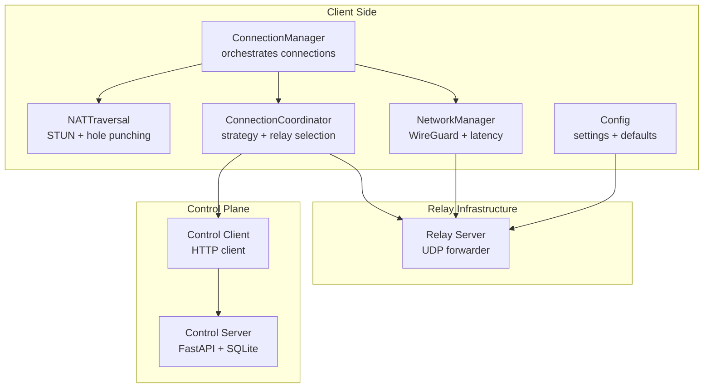
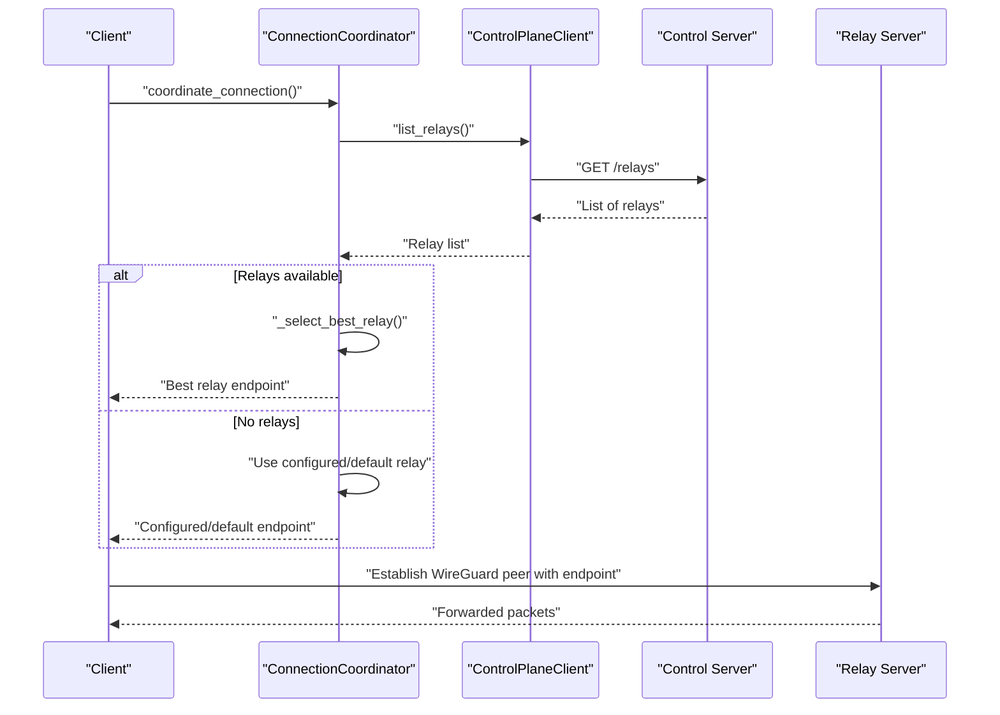
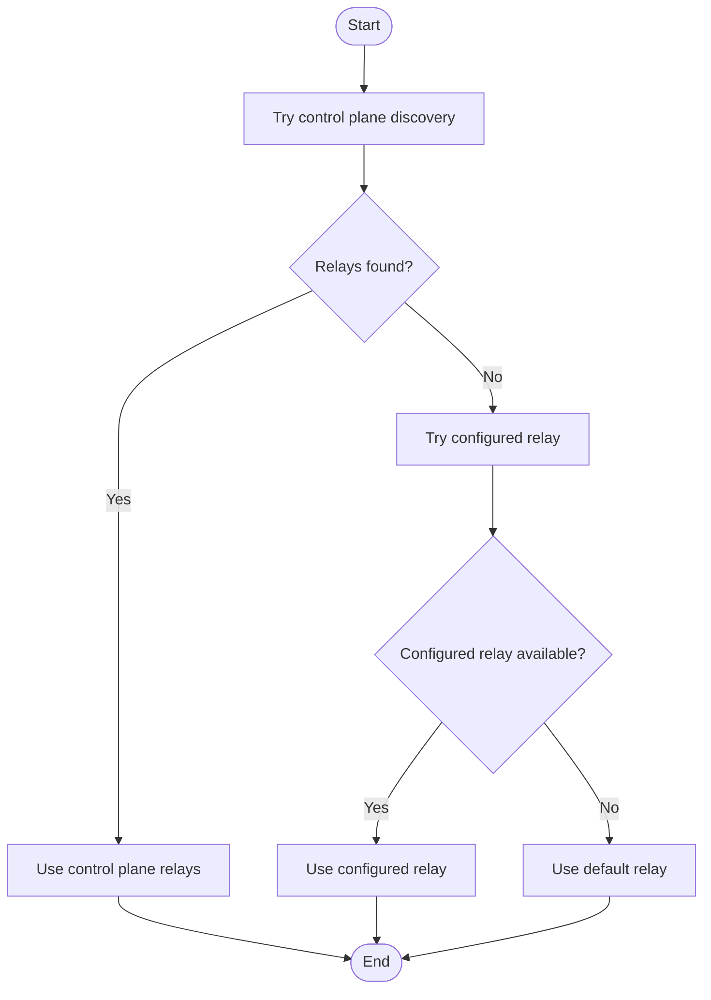
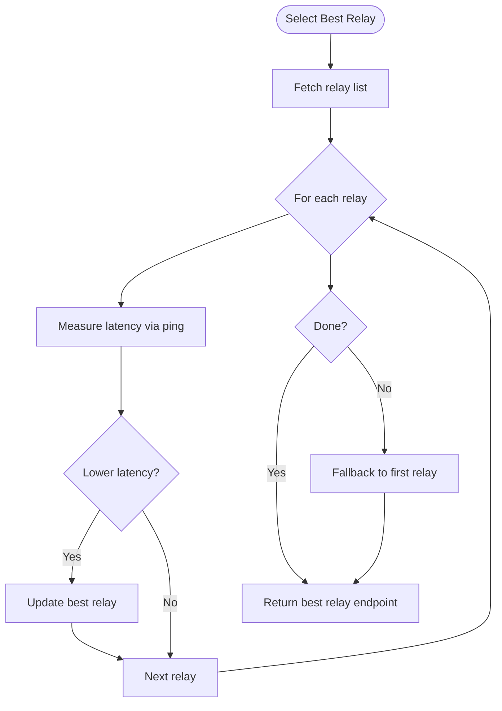
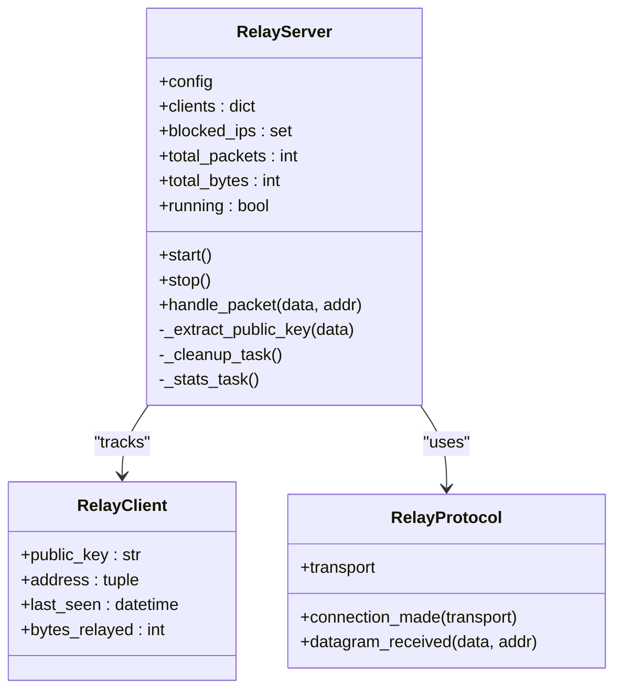
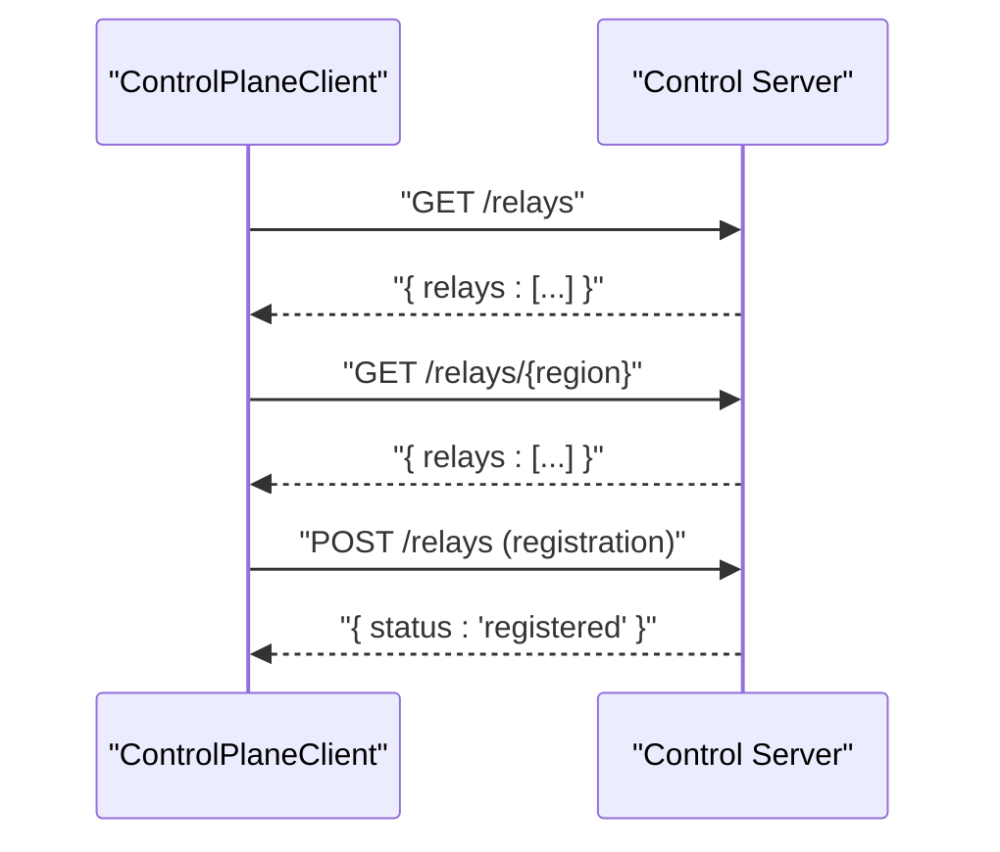
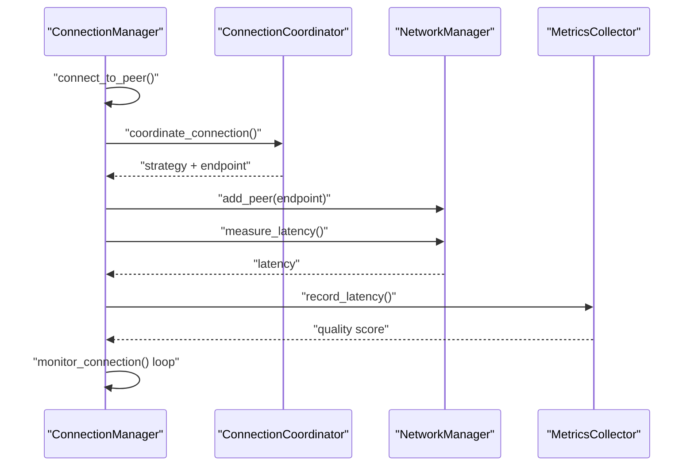
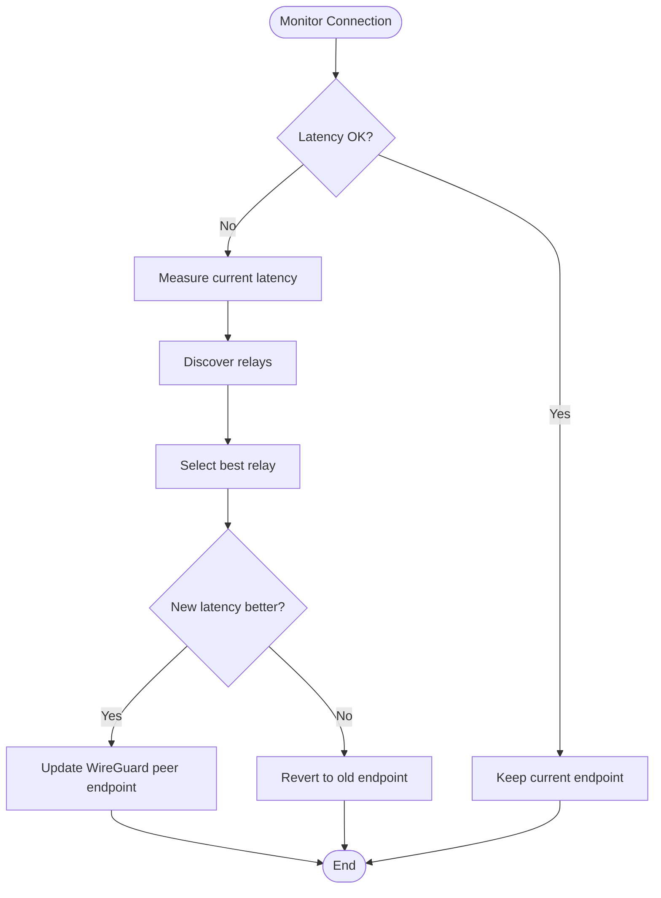
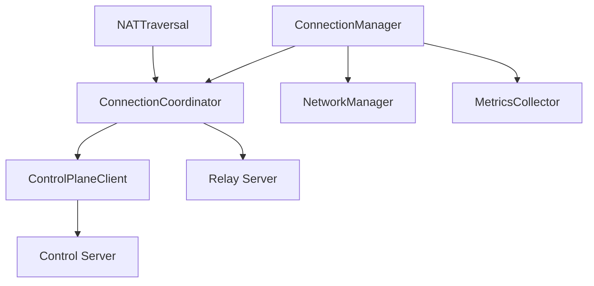

# Relay Fallback Mechanism

<cite>
**Referenced Files in This Document**
- [relay_server.py](file://servers/relay_server.py)
- [control_server.py](file://servers/control_server.py)
- [control_client.py](file://core/control_client.py)
- [nat.py](file://core/nat.py)
- [connection.py](file://core/connection.py)
- [network.py](file://core/network.py)
- [config.py](file://core/config.py)
- [metrics.py](file://core/metrics.py)
- [RELAY_SERVER.md](file://docs/RELAY_SERVER.md)
- [CONTROL_PLANE.md](file://docs/CONTROL_PLANE.md)
- [test_relay_server.py](file://tests/test_relay_server.py)
</cite>

## Table of Contents
1. [Introduction](#introduction)
2. [Project Structure](#project-structure)
3. [Core Components](#core-components)
4. [Architecture Overview](#architecture-overview)
5. [Detailed Component Analysis](#detailed-component-analysis)
6. [Dependency Analysis](#dependency-analysis)
7. [Performance Considerations](#performance-considerations)
8. [Troubleshooting Guide](#troubleshooting-guide)
9. [Conclusion](#conclusion)

## Introduction
This document explains the relay fallback system and TURN server integration in the LANrage networking stack. It covers the relay discovery hierarchy (control plane discovery, configured relay fallback, default relay usage), endpoint selection with latency measurement and geographic proximity, relay server architecture and packet forwarding, dynamic integration with the control plane, error handling and automatic failover, endpoint format and connection establishment, and quality metrics collection. Trade-offs between direct P2P and relay usage, bandwidth and latency implications, and troubleshooting guidance are also included.

## Project Structure
The relay and control plane functionality spans several modules:
- Relay server: Stateless UDP packet forwarder for NAT traversal
- Control plane server: Centralized registry for parties, peers, and relay servers
- Control plane client: HTTP client for dynamic relay discovery
- NAT traversal and connection orchestration: STUN, hole punching, and relay selection
- Network management: WireGuard interface and latency measurement
- Metrics: Quality scoring and connection monitoring

**Diagram sources**
- [connection.py](file://core/connection.py#L18-L125)
- [nat.py](file://core/nat.py#L330-L455)
- [control_client.py](file://core/control_client.py#L23-L437)
- [control_server.py](file://servers/control_server.py#L597-L682)
- [relay_server.py](file://servers/relay_server.py#L30-L120)
- [network.py](file://core/network.py#L25-L120)
- [config.py](file://core/config.py#L17-L114)

**Section sources**
- [RELAY_SERVER.md](file://docs/RELAY_SERVER.md#L1-L544)
- [CONTROL_PLANE.md](file://docs/CONTROL_PLANE.md#L1-L629)

## Core Components
- Relay Server: Stateless UDP forwarder that accepts WireGuard packets and forwards them to all other connected clients. It tracks clients, maintains statistics, and periodically cleans stale entries.
- Control Plane Server: Provides party management, peer discovery, and relay server registry via HTTP endpoints. Stores state in SQLite and supports cleanup of stale entries.
- Control Plane Client: HTTP client that queries the control plane for relay lists and regions, with retry logic and error handling.
- NAT Traversal and Connection Coordinator: Determines whether direct P2P is possible, falls back to relay when needed, and selects the optimal relay endpoint.
- Network Manager: Manages WireGuard interface creation, peer addition/removal, and latency measurement for quality assessment.
- Metrics: Tracks peer latency, jitter, packet loss, and computes a connection quality score.

**Section sources**
- [relay_server.py](file://servers/relay_server.py#L30-L120)
- [control_server.py](file://servers/control_server.py#L597-L682)
- [control_client.py](file://core/control_client.py#L23-L437)
- [nat.py](file://core/nat.py#L330-L525)
- [network.py](file://core/network.py#L25-L120)
- [metrics.py](file://core/metrics.py#L16-L105)

## Architecture Overview
The relay fallback mechanism follows a three-tier discovery hierarchy:
1. Control plane discovery: Query the control plane for available relay servers.
2. Configured relay fallback: Use a pre-configured relay endpoint from settings.
3. Default relay usage: Fallback to a default relay address when others are unavailable.

Endpoint selection considers latency measurement and geographic proximity. The system integrates with the control plane for dynamic discovery and updates, and supports automatic failover and quality-based switching.

**Diagram sources**
- [nat.py](file://core/nat.py#L379-L455)
- [control_client.py](file://core/control_client.py#L373-L402)
- [control_server.py](file://servers/control_server.py#L630-L682)
- [relay_server.py](file://servers/relay_server.py#L30-L120)

## Detailed Component Analysis

### Relay Discovery Hierarchy
The system discovers relays in order:
1. Control plane discovery: Queries the control plane for registered relays and converts them to internal format.
2. Configured relay fallback: Uses the configured relay public IP/port from settings.
3. Default relay usage: Falls back to a default relay address when no control plane relays are available.

**Diagram sources**
- [nat.py](file://core/nat.py#L399-L455)
- [control_client.py](file://core/control_client.py#L373-L402)
- [control_server.py](file://servers/control_server.py#L630-L682)
- [config.py](file://core/config.py#L40-L91)

**Section sources**
- [nat.py](file://core/nat.py#L399-L455)
- [control_client.py](file://core/control_client.py#L373-L402)
- [control_server.py](file://servers/control_server.py#L630-L682)
- [config.py](file://core/config.py#L40-L91)

### Endpoint Selection and Geographic Proximity
The system measures latency to each discovered relay and selects the best one:
- Latency measurement uses ICMP ping via OS commands.
- Geographic proximity is inferred from latency; lower latency implies closer proximity.
- If latency measurement fails, the first relay is used as a fallback.

**Diagram sources**
- [nat.py](file://core/nat.py#L457-L525)
- [nat.py](file://core/nat.py#L481-L525)

**Section sources**
- [nat.py](file://core/nat.py#L457-L525)

### Relay Server Architecture and Packet Forwarding
The relay server is a stateless UDP forwarder:
- Accepts WireGuard packets and extracts public keys from handshake messages.
- Maintains a minimal client map keyed by public key or address.
- Forwards packets to all other connected clients.
- Periodic cleanup removes stale clients; statistics are tracked and printed.

**Diagram sources**
- [relay_server.py](file://servers/relay_server.py#L20-L120)
- [relay_server.py](file://servers/relay_server.py#L224-L256)

**Section sources**
- [relay_server.py](file://servers/relay_server.py#L20-L120)
- [relay_server.py](file://servers/relay_server.py#L224-L256)
- [RELAY_SERVER.md](file://docs/RELAY_SERVER.md#L1-L544)

### Dynamic Integration with Control Plane
The control plane server exposes endpoints for:
- Listing all relays
- Listing relays by region
- Registering relay servers with metadata (public IP, port, region, capacity)

The control plane client queries these endpoints and handles errors with retries.

**Diagram sources**
- [control_client.py](file://core/control_client.py#L373-L402)
- [control_server.py](file://servers/control_server.py#L630-L682)
- [control_server.py](file://servers/control_server.py#L597-L628)

**Section sources**
- [control_client.py](file://core/control_client.py#L373-L402)
- [control_server.py](file://servers/control_server.py#L597-L682)

### Connection Establishment and Quality Metrics
Connection establishment:
- ConnectionManager orchestrates peer discovery, NAT strategy determination, WireGuard peer configuration, and latency verification.
- ConnectionCoordinator determines direct vs relay strategy and selects the endpoint.
- NetworkManager adds/removes WireGuard peers and measures latency.

Quality metrics:
- MetricsCollector records latency, calculates jitter, predicts quality score, and aggregates trends.
- ConnectionManager monitors latency and triggers relay switching when degradation occurs.

**Diagram sources**
- [connection.py](file://core/connection.py#L38-L125)
- [nat.py](file://core/nat.py#L337-L369)
- [network.py](file://core/network.py#L340-L391)
- [metrics.py](file://core/metrics.py#L308-L371)

**Section sources**
- [connection.py](file://core/connection.py#L38-L125)
- [nat.py](file://core/nat.py#L337-L369)
- [network.py](file://core/network.py#L340-L391)
- [metrics.py](file://core/metrics.py#L308-L371)

### Automatic Failover and Relay Switching
When latency exceeds thresholds or degrades, the system attempts to switch to a better relay:
- Measures current latency and compares with a newly selected relay.
- If the new relay improves latency, it updates the peer endpoint.
- If not, it reverts to the previous endpoint.

**Diagram sources**
- [connection.py](file://core/connection.py#L292-L420)
- [nat.py](file://core/nat.py#L379-L455)

**Section sources**
- [connection.py](file://core/connection.py#L292-L420)
- [nat.py](file://core/nat.py#L379-L455)

## Dependency Analysis
The relay fallback mechanism depends on:
- NAT traversal and strategy selection
- Control plane discovery and relay registry
- Network management for WireGuard and latency measurement
- Metrics for quality scoring and monitoring

**Diagram sources**
- [nat.py](file://core/nat.py#L330-L455)
- [control_client.py](file://core/control_client.py#L23-L437)
- [control_server.py](file://servers/control_server.py#L597-L682)
- [relay_server.py](file://servers/relay_server.py#L30-L120)
- [connection.py](file://core/connection.py#L18-L125)
- [network.py](file://core/network.py#L25-L120)
- [metrics.py](file://core/metrics.py#L16-L105)

**Section sources**
- [nat.py](file://core/nat.py#L330-L455)
- [control_client.py](file://core/control_client.py#L23-L437)
- [control_server.py](file://servers/control_server.py#L597-L682)
- [relay_server.py](file://servers/relay_server.py#L30-L120)
- [connection.py](file://core/connection.py#L18-L125)
- [network.py](file://core/network.py#L25-L120)
- [metrics.py](file://core/metrics.py#L16-L105)

## Performance Considerations
- Direct P2P connections offer lower latency and higher throughput compared to relay usage.
- Relay introduces additional latency proportional to geographic distance and server load.
- WireGuard encryption is transparent to the relay; traffic is forwarded without decryption.
- Relay throughput scales with CPU cores and network bandwidth; bottlenecks are typically network I/O.
- Latency measurement uses ICMP ping; accuracy depends on OS support and network conditions.

[No sources needed since this section provides general guidance]

## Troubleshooting Guide
Common issues and resolutions:
- Control plane connectivity failures: Verify control plane URL, network reachability, and retry behavior.
- Relay discovery failures: Confirm relay registration in the control plane and endpoint reachability.
- High latency or degraded connections: Trigger relay switching; verify geographic proximity and server health.
- Relay server unavailability: Use configured/default relay fallback; monitor cleanup and blocked IPs.
- WireGuard configuration errors: Validate interface creation, keys, and peer configuration.

**Section sources**
- [control_client.py](file://core/control_client.py#L128-L159)
- [control_server.py](file://servers/control_server.py#L630-L682)
- [RELAY_SERVER.md](file://docs/RELAY_SERVER.md#L479-L530)
- [connection.py](file://core/connection.py#L292-L420)

## Conclusion
The relay fallback system provides robust NAT traversal by combining dynamic control plane discovery, configured fallbacks, and default relays. With latency-aware endpoint selection, automatic failover, and comprehensive metrics, the system balances reliability and performance. The stateless relay architecture ensures scalability and simplicity, while WireGuard encryption guarantees privacy and integrity.