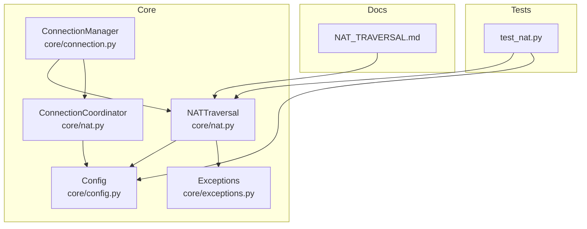
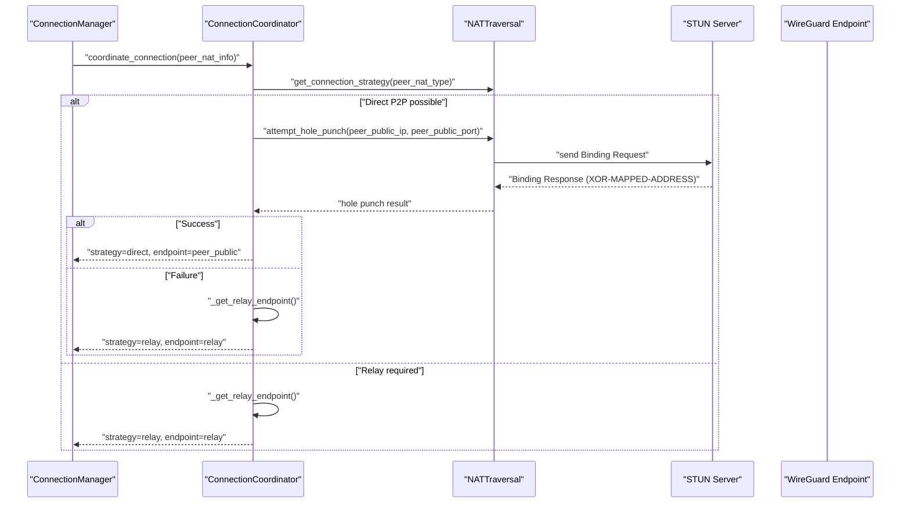
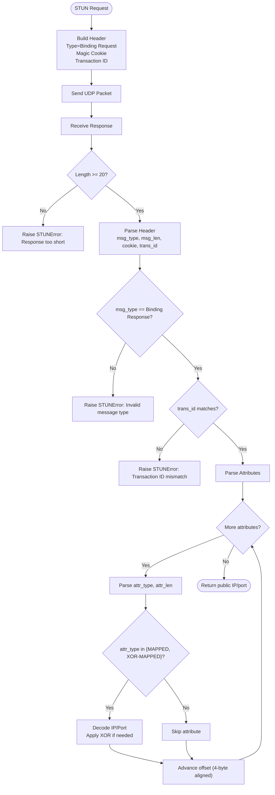
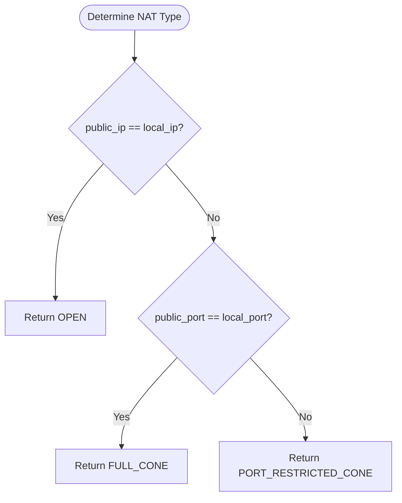
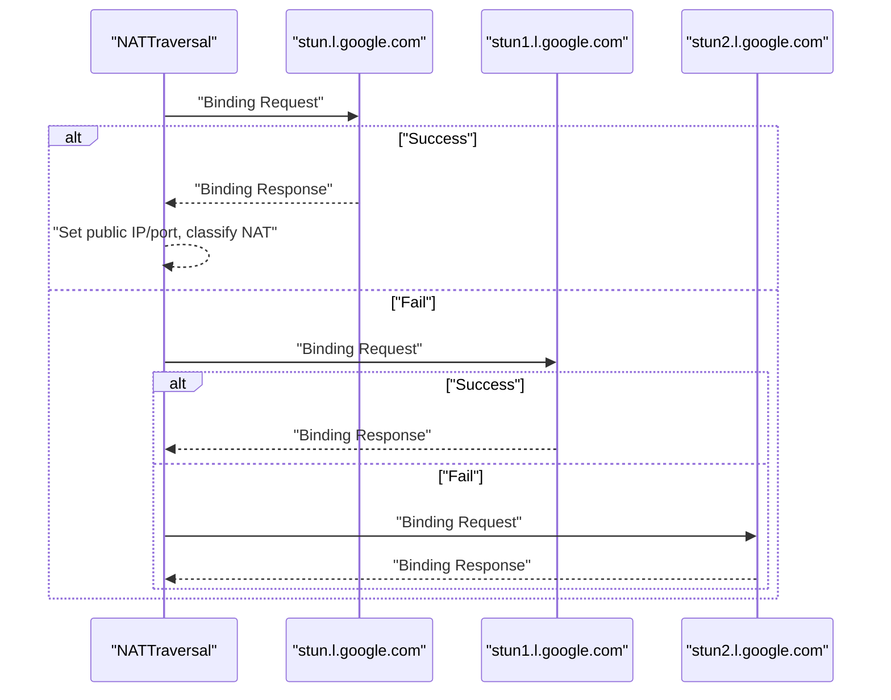
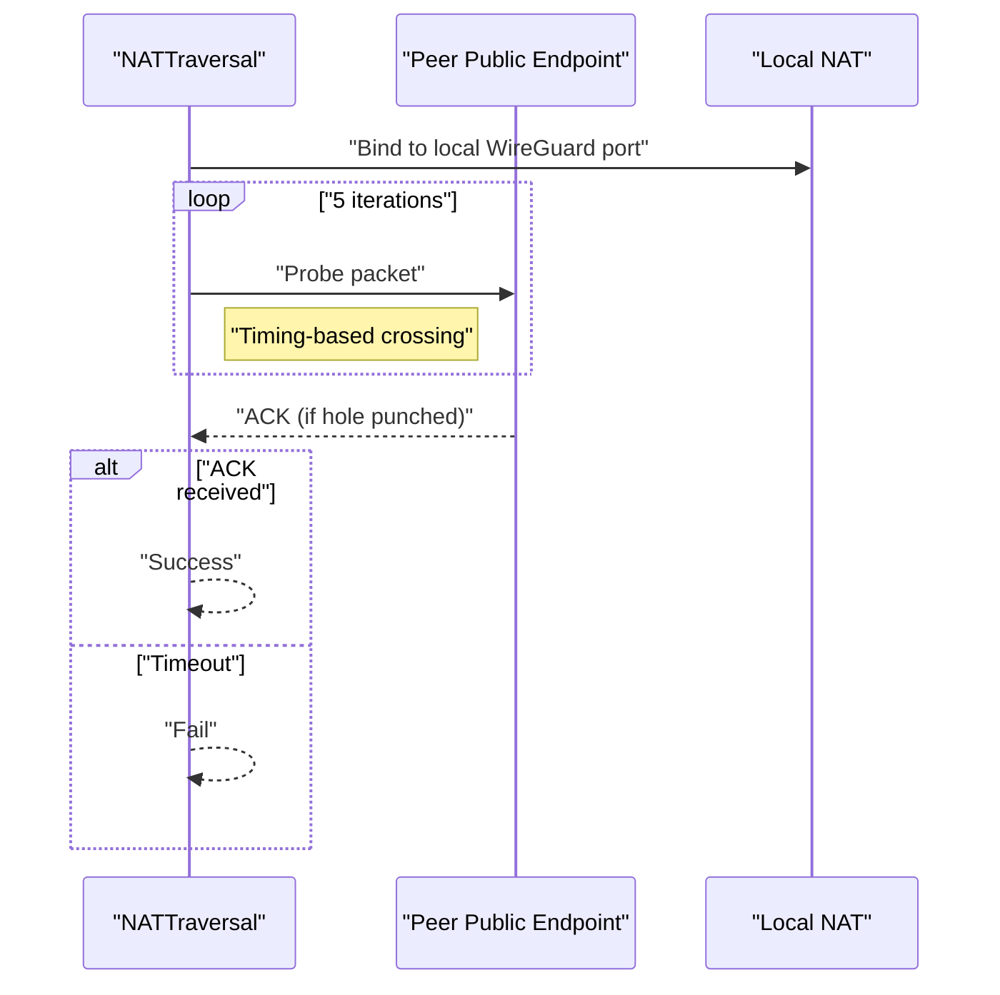
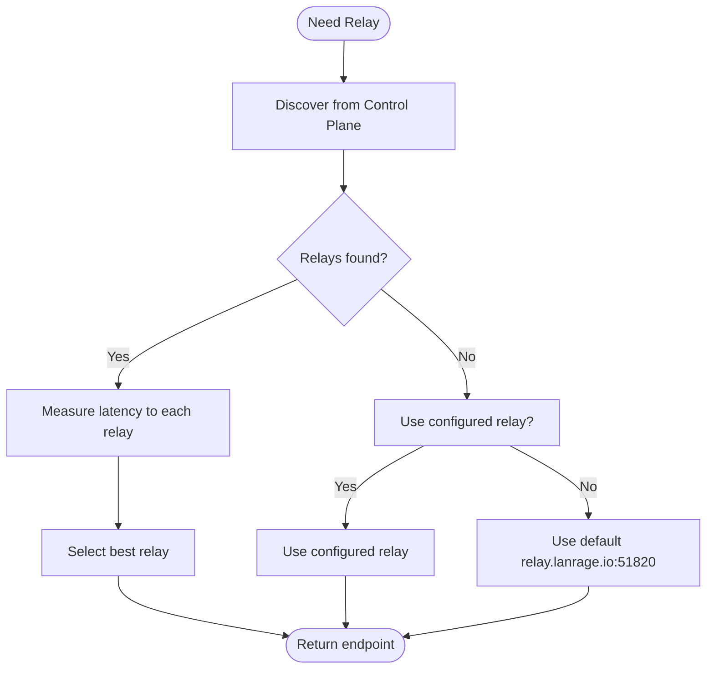
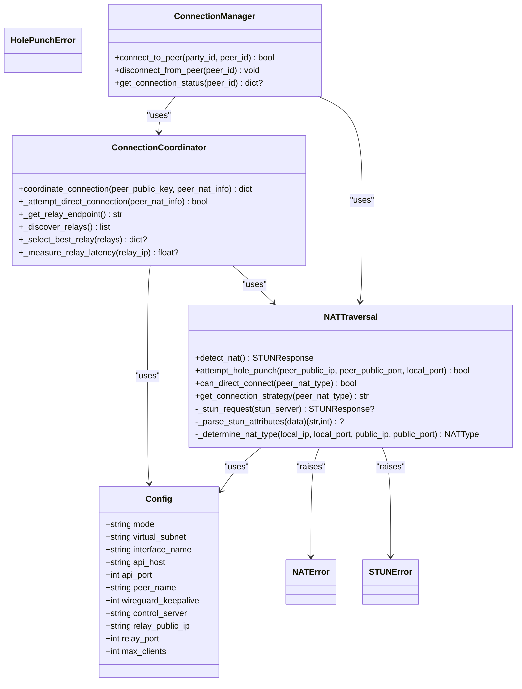

# STUN Server Detection

<cite>
**Referenced Files in This Document**
- [nat.py](file://core/nat.py)
- [test_nat.py](file://tests/test_nat.py)
- [NAT_TRAVERSAL.md](file://docs/NAT_TRAVERSAL.md)
- [config.py](file://core/config.py)
- [exceptions.py](file://core/exceptions.py)
- [connection.py](file://core/connection.py)
</cite>

## Table of Contents
1. [Introduction](#introduction)
2. [Project Structure](#project-structure)
3. [Core Components](#core-components)
4. [Architecture Overview](#architecture-overview)
5. [Detailed Component Analysis](#detailed-component-analysis)
6. [Dependency Analysis](#dependency-analysis)
7. [Performance Considerations](#performance-considerations)
8. [Troubleshooting Guide](#troubleshooting-guide)
9. [Conclusion](#conclusion)
10. [Appendices](#appendices)

## Introduction
This document explains the STUN server detection and NAT type classification implementation in the project. It covers STUN message construction, attribute parsing, response validation, NAT classification logic, STUN server selection with fallback, timeout handling, error recovery, and simplified NAT detection. It also documents the UDP hole punching mechanism and relay fallback strategy, along with common failure modes and alternative detection methods.

## Project Structure
The NAT traversal functionality resides primarily in core/nat.py and is integrated with the connection orchestration in core/connection.py. Tests in tests/test_nat.py exercise the STUN detection and strategy decisions. Documentation in docs/NAT_TRAVERSAL.md provides a high-level overview and usage examples.

**Diagram sources**
- [nat.py](file://core/nat.py#L41-L328)
- [connection.py](file://core/connection.py#L18-L125)
- [config.py](file://core/config.py#L17-L114)
- [exceptions.py](file://core/exceptions.py#L10-L26)
- [test_nat.py](file://tests/test_nat.py#L16-L100)
- [NAT_TRAVERSAL.md](file://docs/NAT_TRAVERSAL.md#L1-L562)

**Section sources**
- [nat.py](file://core/nat.py#L1-L525)
- [connection.py](file://core/connection.py#L1-L200)
- [test_nat.py](file://tests/test_nat.py#L1-L121)
- [NAT_TRAVERSAL.md](file://docs/NAT_TRAVERSAL.md#L1-L562)

## Core Components
- NATTraversal: Implements STUN-based NAT detection, STUN request/response handling, attribute parsing, and simplified NAT classification.
- ConnectionCoordinator: Determines connection strategy (direct vs relay), coordinates hole punching, and selects the best relay endpoint.
- Exceptions: Defines NATError, STUNError, and HolePunchError for robust error handling.
- Config: Provides runtime configuration including relay settings used by the relay fallback mechanism.

Key responsibilities:
- STUN message construction and validation
- Attribute parsing for MAPPED-ADDRESS and XOR-MAPPED-ADDRESS
- NAT type classification (OPEN, FULL_CONE, PORT_RESTRICTED_CONE)
- UDP hole punching attempts
- Relay discovery and latency-based selection

**Section sources**
- [nat.py](file://core/nat.py#L19-L328)
- [exceptions.py](file://core/exceptions.py#L10-L26)
- [config.py](file://core/config.py#L40-L43)

## Architecture Overview
The NAT traversal pipeline starts with NATTraversal.detect_nat(), which iterates through a list of public STUN servers. For each server, it sends a Binding Request and parses the response to extract the public endpoint. Based on the mapping between local and public IP/port, it classifies the NAT type. If direct connection is not feasible, ConnectionCoordinator decides whether to attempt UDP hole punching or fall back to a relay.

**Diagram sources**
- [connection.py](file://core/connection.py#L337-L377)
- [nat.py](file://core/nat.py#L323-L328)
- [nat.py](file://core/nat.py#L244-L294)
- [nat.py](file://core/nat.py#L379-L455)

## Detailed Component Analysis

### STUN Protocol Implementation
- STUN message format:
  - Message Type: Binding Request (0x0001) and Binding Response (0x0101)
  - Magic Cookie: 0x2112A442
  - Transaction ID: 12 random bytes
  - Header layout follows RFC 5389
- Message construction:
  - Packs message type, length placeholder, magic cookie, and transaction ID
  - Sends to the target STUN server
- Response validation:
  - Verifies response length and header fields
  - Confirms message type is Binding Response
  - Validates transaction ID matches the sent value
- Attribute parsing:
  - Iterates attributes until end of payload
  - Parses MAPPED-ADDRESS (0x0001) and XOR-MAPPED-ADDRESS (0x0020)
  - Applies XOR decoding for port and IP when using XOR-MAPPED-ADDRESS
  - Handles 4-byte alignment/padding for attributes

**Diagram sources**
- [nat.py](file://core/nat.py#L117-L179)
- [nat.py](file://core/nat.py#L181-L226)

**Section sources**
- [nat.py](file://core/nat.py#L117-L179)
- [nat.py](file://core/nat.py#L181-L226)

### NAT Type Classification
The implementation uses a simplified classification based on the mapping between local and public endpoints:
- OPEN: public IP equals local IP
- FULL_CONE: public port equals local port
- PORT_RESTRICTED_CONE: default assumption when ports differ (requires more sophisticated multi-request testing for full detection)

**Diagram sources**
- [nat.py](file://core/nat.py#L228-L242)

**Section sources**
- [nat.py](file://core/nat.py#L228-L242)

### STUN Server Selection and Fallback
- Multiple public STUN servers are tried in sequence:
  - stun.l.google.com, stun1.l.google.com, stun2.l.google.com, stun3.l.google.com, stun4.l.google.com
- Each server is probed with a Binding Request; the first successful response sets the NAT type and public endpoint.
- Error handling:
  - Invalid responses raise STUNError
  - Timeouts and OS/network errors are logged and retried against remaining servers
  - If all servers fail, NATError is raised with details

**Diagram sources**
- [nat.py](file://core/nat.py#L64-L105)
- [nat.py](file://core/nat.py#L44-L51)

**Section sources**
- [nat.py](file://core/nat.py#L44-L51)
- [nat.py](file://core/nat.py#L64-L105)

### UDP Hole Punching
- Attempts direct P2P connectivity by sending a small probe packet to the peer’s public endpoint from the local WireGuard port.
- Waits briefly for an acknowledgment; if successful, direct connection is possible.
- Designed to exploit NAT mappings created by outbound traffic.

**Diagram sources**
- [nat.py](file://core/nat.py#L244-L294)

**Section sources**
- [nat.py](file://core/nat.py#L244-L294)

### Relay Discovery and Selection
- If direct connection is not possible or hole punching fails, the system falls back to a relay.
- Discovery prioritizes:
  1) Control plane discovery via control_client.list_relays()
  2) Configured relay (from Config.relay_public_ip)
  3) Default relay.lanrage.io:51820
- Latency measurement uses ICMP ping to select the best relay.

**Diagram sources**
- [nat.py](file://core/nat.py#L379-L455)
- [config.py](file://core/config.py#L40-L43)

**Section sources**
- [nat.py](file://core/nat.py#L379-L455)
- [config.py](file://core/config.py#L40-L43)

### Transaction ID Management and Magic Cookie Verification
- Transaction ID: 12 random bytes generated per request and compared against the response.
- Magic cookie: 0x2112A442 used to verify the response authenticity and for XOR decoding of XOR-MAPPED-ADDRESS.
- These checks prevent replay and ensure the response corresponds to the sent request.

**Section sources**
- [nat.py](file://core/nat.py#L121-L122)
- [nat.py](file://core/nat.py#L140-L148)
- [nat.py](file://core/nat.py#L204-L216)

### Simplified NAT Detection Logic and Limitations
- The simplified logic determines NAT type from a single STUN round-trip:
  - OPEN if public IP equals local IP
  - FULL_CONE if public port equals local port
  - PORT_RESTRICTED_CONE otherwise
- Limitations:
  - Cannot distinguish RESTRICTED_CONE from PORT_RESTRICTED_CONE with a single request
  - Cannot detect SYMMETRIC NAT reliably without additional probing
  - May misclassify symmetric NAT as port-restricted under certain conditions

**Section sources**
- [nat.py](file://core/nat.py#L228-L242)
- [NAT_TRAVERSAL.md](file://docs/NAT_TRAVERSAL.md#L195-L198)

### STUN Message Format Specification
- Message Type: 0x0001 (Binding Request), 0x0101 (Binding Response)
- Magic Cookie: 0x2112A442
- Transaction ID: 12 random bytes
- Attributes:
  - MAPPED-ADDRESS (0x0001)
  - XOR-MAPPED-ADDRESS (0x0020) preferred for privacy and correctness

**Section sources**
- [nat.py](file://core/nat.py#L117-L127)
- [nat.py](file://core/nat.py#L198-L226)
- [NAT_TRAVERSAL.md](file://docs/NAT_TRAVERSAL.md#L363-L379)

### Attribute Parsing Details
- Iterates through attributes, validates lengths, and decodes address families.
- For IPv4:
  - Port decoded via XOR with 0x2112 for XOR-MAPPED-ADDRESS
  - IP decoded via XOR with magic cookie for XOR-MAPPED-ADDRESS
- Handles 4-byte alignment for attribute boundaries.

**Section sources**
- [nat.py](file://core/nat.py#L181-L226)

### Correlation Between Local and Public IP/Port Mapping
- Local endpoint: discovered by binding to a random port and retrieving the socket name.
- Public endpoint: extracted from STUN response attributes.
- NAT classification depends on equality of IPs and ports between local and public endpoints.

**Section sources**
- [nat.py](file://core/nat.py#L114-L115)
- [nat.py](file://core/nat.py#L156-L167)

## Dependency Analysis
- NATTraversal depends on:
  - Config for relay settings
  - Exceptions for error propagation
  - Logging for diagnostics
- ConnectionCoordinator depends on:
  - Config for relay configuration
  - NATTraversal for strategy decisions
  - Control plane client for relay discovery
- ConnectionManager integrates NAT traversal into the peer connection lifecycle.

**Diagram sources**
- [config.py](file://core/config.py#L17-L114)
- [exceptions.py](file://core/exceptions.py#L10-L26)
- [nat.py](file://core/nat.py#L53-L62)
- [nat.py](file://core/nat.py#L330-L455)
- [connection.py](file://core/connection.py#L18-L125)

**Section sources**
- [config.py](file://core/config.py#L17-L114)
- [exceptions.py](file://core/exceptions.py#L10-L26)
- [nat.py](file://core/nat.py#L53-L62)
- [nat.py](file://core/nat.py#L330-L455)
- [connection.py](file://core/connection.py#L18-L125)

## Performance Considerations
- STUN request timeout is set to 3 seconds per server; total detection time scales with the number of servers.
- UDP hole punching sends 5 packets over 500 ms with a 2-second ACK wait, balancing success probability and latency.
- Relay selection measures latency using ICMP ping; platform differences (Windows vs Unix) are handled.
- Direct P2P adds minimal latency (<1ms), while relay introduces 10–100ms overhead depending on geography.

[No sources needed since this section provides general guidance]

## Troubleshooting Guide
Common STUN server failures and remedies:
- Firewall blocking UDP: Ensure UDP egress to STUN servers is permitted.
- STUN servers unreachable: Test manually with netcat or equivalent; try alternate networks.
- NAT misclassification: Expect simplified classification; symmetric NAT may require relay.

Hole punching failures:
- Symmetric NAT or overly restrictive firewalls: Use relay fallback automatically.
- Timing issues: Retry or adjust network conditions.

Relay performance issues:
- Geographic distance or congestion: Prefer closer relays; deploy more relays if feasible.

Validation and testing:
- Run the test suite to validate NAT detection and strategy decisions.

**Section sources**
- [NAT_TRAVERSAL.md](file://docs/NAT_TRAVERSAL.md#L486-L523)
- [test_nat.py](file://tests/test_nat.py#L20-L100)

## Conclusion
The implementation provides a practical, lightweight STUN-based NAT detection and traversal solution. It constructs and validates STUN messages, parses essential attributes, and classifies NAT types using a simplified heuristic. It integrates UDP hole punching and automatic relay fallback, with robust error handling and logging. While the simplified classification cannot fully distinguish all NAT types, it enables reliable direct P2P connectivity for most cone NAT scenarios and gracefully falls back to relays when needed.

[No sources needed since this section summarizes without analyzing specific files]

## Appendices

### Example Workflows
- NAT detection: See [test_nat.py](file://tests/test_nat.py#L33-L45) for end-to-end detection and [nat.py](file://core/nat.py#L64-L105) for the detection loop.
- STUN request/response handling: See [nat.py](file://core/nat.py#L107-L179) for request building, sending, and response parsing.
- Attribute parsing for MAPPED-ADDRESS/XOR-MAPPED-ADDRESS: See [nat.py](file://core/nat.py#L181-L226).
- Correlation between local/public mapping: See [nat.py](file://core/nat.py#L114-L115) and [nat.py](file://core/nat.py#L156-L167).
- NAT classification: See [nat.py](file://core/nat.py#L228-L242).
- STUN server selection and fallback: See [nat.py](file://core/nat.py#L64-L105) and [nat.py](file://core/nat.py#L44-L51).
- UDP hole punching: See [nat.py](file://core/nat.py#L244-L294).
- Relay discovery and selection: See [nat.py](file://core/nat.py#L379-L455) and [config.py](file://core/config.py#L40-L43).